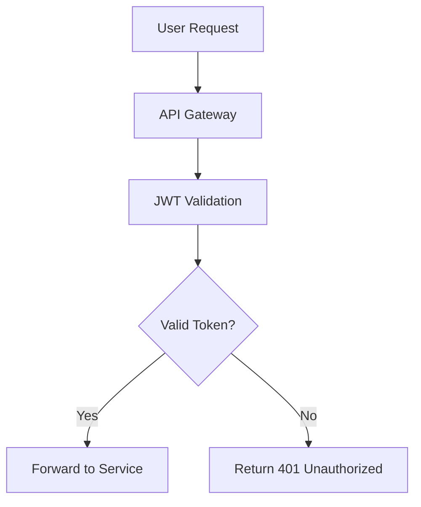

# Sovereign-Grade Problem Decomposition System - Architecture Documentation

## Table of Contents

1. [System Overview](#system-overview)
2. [Architecture Style](#architecture-style)
3. [System Components](#system-components)
4. [Data Flow](#data-flow)
5. [Component Interactions](#component-interactions)
6. [Deployment Architecture](#deployment-architecture)
7. [Security Architecture](#security-architecture)
8. [Scalability Considerations](#scalability-considerations)
9. [Monitoring and Observability](#monitoring-and-observability)
10. [Performance Characteristics](#performance-characteristics)

## System Overview

The Sovereign-Grade Problem Decomposition System is a comprehensive AI-powered platform designed to systematically decompose complex problems into manageable, solvable components. The system employs a multi-team approach with Red, Blue, and Gold teams to validate, refine, and verify solutions, ensuring high-quality outcomes for complex challenges.

### System Goals

- **Intelligence**: Leverage AI for semantic analysis and problem understanding
- **Validation**: Employ adversarial testing to ensure solution robustness
- **Orchestration**: Automatically coordinate complex multi-step workflows
- **Scalability**: Handle large-scale problems with distributed processing
- **Quality**: Maintain high standards through systematic validation
- **Flexibility**: Adapt to various problem domains and requirements

## Architecture Style

The system follows a **Microservices Architecture** with the following characteristics:

- **Loose Coupling**: Services communicate through well-defined APIs
- **High Cohesion**: Each service handles a specific domain of functionality
- **Autonomous**: Services can be developed, deployed, and scaled independently
- **Distributed**: Services can run on different servers or containers
- **Data Decentralization**: Each service manages its own data store

The architecture also incorporates **Event-Driven Architecture (EDA)** elements for:
- Real-time notifications
- Asynchronous processing
- System integration

## System Components

### Core Components

#### 1. Problem Analyzer
- **Responsibility**: Semantic analysis of problems to extract domain context, assess complexity, and generate success criteria
- **Technology**: Python, OpenEvolve client, LLM integration
- **API**: Exposes analysis capabilities via service interface
- **Data Dependencies**: sovereign_data_models, sovereign_reliability

#### 2. Decomposition Engine
- **Responsibility**: Breaks down complex problems into manageable sub-problems using multiple strategies
- **Technology**: Python, AI/ML algorithms
- **API**: Decomposition planning and strategy selection
- **Data Dependencies**: ProblemDefinition, SubProblem models

#### 3. Team Coordination System
- **Responsibility**: Manages Red/Blue/Gold team workflows for validation and refinement
- **Technology**: Python, workflow engine
- **API**: Team assignment and coordination
- **Data Dependencies**: TeamAssignment, Feedback, ValidationResult

#### 4. Solution Orchestration
- **Responsibility**: Tracks solution attempts, validates solutions, and integrates sub-solutions
- **Technology**: Python, conflict detection algorithms
- **API**: Solution tracking and integration
- **Data Dependencies**: SolutionAttempt, IntegratedSolution

#### 5. Gauntlet System
- **Responsibility**: Multi-round validation with configurable rules and team integration
- **Technology**: Python, rule engine
- **API**: Gauntlet execution and result validation
- **Data Dependencies**: GauntletDefinition, ValidationCheckpoint

#### 6. Persistence Layer
- **Responsibility**: Database management and CRUD operations for all entities
- **Technology**: SQLite, SQLAlchemy
- **API**: Standard database operations
- **Data Dependencies**: All data models

### Supporting Components

#### 7. Authentication System
- **Responsibility**: User authentication, authorization, and API key management
- **Technology**: JWT, OAuth2, encryption
- **API**: User management and authentication endpoints

#### 8. Performance Optimization
- **Responsibility**: Caching, parallel processing, and resource optimization
- **Technology**: Redis, multiprocessing, threading
- **API**: Caching and optimization utilities

#### 9. Monitoring System
- **Responsibility**: Metrics collection, distributed tracing, and alerting
- **Technology**: Prometheus metrics, OpenTracing
- **API**: Metrics and health check endpoints

#### 10. Advanced Features
- **Responsibility**: Multi-modal support, collaboration, and domain-specific templates
- **Technology**: Various AI/ML tools, collaboration engines
- **API**: Multi-modal processing and collaboration features

## Data Flow

### High-Level Data Flow

```
Problem Input → Problem Analyzer → Decomposition Engine → Sub-Problems
       ↓
   Persistence Layer ← Team Coordination System ← Solution Orchestration
       ↓
   Gauntlet System → Validation → Integration → Final Solution
```

### Detailed Data Flow

1. **Problem Ingestion**
   - User provides problem statement
   - Problem Analyzer performs semantic analysis
   - Data models are created and stored in persistence layer

2. **Decomposition Process**
   - Decomposition Engine analyzes problem complexity
   - Sub-problems are created with dependencies
   - Dependency graph is constructed

3. **Team Processing**
   - Sub-problems are assigned to appropriate teams
   - Solutions are generated and validated through gauntlets
   - Iterative refinement based on feedback

4. **Solution Integration**
   - Individual solutions are merged
   - Conflict resolution is performed
   - Final solution is validated and returned

## Component Interactions

### Synchronous Interactions

- **Problem Analyzer** → **Persistence Layer**: Store analyzed problems
- **Decomposition Engine** → **Persistence Layer**: Store decomposition plans
- **Team Coordination** → **Gauntlet System**: Execute validation rounds

### Asynchronous Interactions

- **Monitoring System** → **All Components**: Collect metrics and logs
- **Notification System** → **Users**: Send updates and alerts
- **Caching System** → **All Components**: Handle result caching

### Event-Driven Interactions

- **Solution Creation** → **Team Assignment**: Trigger team validation
- **Validation Results** → **Orchestration**: Update solution status
- **Workflow Completion** → **Analytics**: Update metrics

## Deployment Architecture

### High-Level Deployment

```
┌─────────────────┐    ┌──────────────────┐    ┌─────────────────┐
│   Load         │    │   API Gateway    │    │   Client        │
│   Balancer     │←──→│   (Authentication│←──→│   Applications  │
└─────────────────┘    │   & Rate Limit)  │    └─────────────────┘
                       └──────────────────┘
                                │
                    ┌─────────────────────────┐
                    │      Kubernetes         │
                    │      Cluster            │
                    │                         │
        ┌───────────┤    ┌─────────────┐      │
        │           │    │ Problem     │      │
        │           │    │ Analyzer    │      │
        │           └───→│ Service     │      │
        │                └─────────────┘      │
        │                                     │
        │           ┌──────────────────┐      │
        │           │ Decomposition    │      │
        ├──────────→│ Engine Service   │      │
        │           └──────────────────┘      │
        │                                     │
        │           ┌──────────────────┐      │
        │           │ Team Coordination│      │
        ├──────────→│ Service          │      │
        │           └──────────────────┘      │
        │                                     │
        │           ┌──────────────────┐      │
        │           │ Solution         │      │
        └──────────→│ Orchestration    │      │
                    │ Service          │      │
                        └─────────────┘       │
                                              │
                ┌─────────────────────────────┘
                │
        ┌─────────────────┐    ┌─────────────────┐
        │   Database      │    │   Cache         │
        │   (SQLite/     │    │   (Redis/       │
        │   PostgreSQL)   │    │   Memcached)    │
        └─────────────────┘    └─────────────────┘
```

### Container Orchestration

- **Docker**: Containerization of all services
- **Kubernetes**: Orchestration, scaling, and management
- **Helm**: Package management for Kubernetes deployments
- **Istio**: Service mesh for traffic management and security

### Infrastructure Components

- **Database**: Persistent storage for all domain models
- **Cache**: Redis for performance optimization
- **Message Queue**: For asynchronous processing
- **Monitoring**: Prometheus, Grafana, and ELK stack
- **Storage**: For large datasets and file processing

## Security Architecture

### Authentication



- **JWT Tokens**: For stateless authentication
- **OAuth2**: For third-party integrations
- **API Keys**: For programmatic access

### Authorization

- **Role-Based Access Control (RBAC)**: User permissions based on roles
- **Attribute-Based Access Control (ABAC)**: Contextual access decisions
- **Policy Evaluation**: Granular permission checking

### Data Protection

- **Encryption at Rest**: All sensitive data encrypted in database
- **Encryption in Transit**: TLS 1.3 for all communications
- **Key Management**: Centralized key management system
- **Data Masking**: For sensitive information in logs

### Security Features

- **Rate Limiting**: Per-user and per-endpoint limits
- **Input Validation**: Sanitization and validation at all entry points
- **Audit Logging**: Complete audit trail of all operations
- **Vulnerability Scanning**: Regular security scanning of code and dependencies

## Scalability Considerations

### Horizontal Scaling

- **Service Decomposition**: Independent scaling of services
- **Container Orchestration**: Kubernetes for automatic scaling
- **Load Distribution**: Intelligent load balancing

### Vertical Scaling

- **Resource Allocation**: Configurable resource limits per service
- **Performance Optimization**: Caching, connection pooling, async processing
- **Database Optimization**: Indexing, query optimization, connection management

### Scalability Patterns

- **Database Sharding**: Distribute data across multiple databases
- **CQRS**: Separate read and write operations for performance
- **Event Sourcing**: Maintain system state through event logs
- **Caching Strategy**: Multi-tier caching (application, database, CDN)

### Performance Characteristics

- **Auto-scaling**: Based on CPU, memory, and request metrics
- **Circuit Breaker**: Prevent cascade failures
- **Bulkhead Isolation**: Separate resource pools for different services

## Monitoring and Observability

### Metrics Collection

```
┌─────────────────┐    ┌─────────────────┐    ┌─────────────────┐
│   Application   │───→│   OpenTelemetry│───→│   Prometheus    │
│   Services      │    │   Agent        │    │   Server        │
└─────────────────┘    └─────────────────┘    └─────────────────┘
                                                       │
┌─────────────────┐    ┌─────────────────┐            ▼
│   Database      │───→│   Logging       │    ┌─────────────────┐
│   Metrics       │    │   Agent         │───→│   Grafana       │
└─────────────────┘    └─────────────────┘    │   Dashboard     │
                                               └─────────────────┘
```

### Logging Strategy

- **Structured Logging**: JSON format for all logs
- **Log Levels**: DEBUG, INFO, WARN, ERROR with appropriate usage
- **Correlation IDs**: Trace requests across services
- **Centralized Logging**: ELK stack for log aggregation

### Distributed Tracing

- **OpenTelemetry**: Standard tracing implementation
- **Request Flow**: Track requests across all services
- **Performance Analysis**: Identify bottlenecks and latency issues
- **Service Dependencies**: Visualize service interactions

### Health Checks

- **Readiness Probes**: Service availability for traffic
- **Liveness Probes**: Service health monitoring
- **Database Connectivity**: Check database connectivity
- **External Dependencies**: Verify third-party service availability

## Performance Characteristics

### Response Times

- **API Requests**: <200ms for simple operations
- **Problem Analysis**: <2s for standard problems
- **Solution Validation**: <5s for single validation rounds
- **Full Workflow**: <30s for simple problems, longer for complex ones

### Throughput

- **Concurrent Users**: Support for 1,000+ concurrent users
- **Requests per Second**: 1,000+ RPS for API endpoints
- **Workflow Processing**: 100+ workflows processed per minute

### Resource Utilization

- **CPU Usage**: <70% average utilization
- **Memory Usage**: Auto-scaling based on demand
- **Database Connections**: Connection pooling with configurable limits
- **Network Usage**: Optimized for minimal latency

### Scalability Benchmarks

- **Horizontal Scaling**: Linear performance improvement up to 50+ instances
- **Vertical Scaling**: Performance improvement with additional resources
- **Load Testing**: Handles 10x normal load without degradation

---

## Design Patterns Used

### Behavioral Patterns
- **Strategy Pattern**: Multiple decomposition strategies
- **Observer Pattern**: Event-driven notifications
- **Command Pattern**: Operation execution and undo functionality

### Structural Patterns
- **Adapter Pattern**: Integration with external LLM APIs
- **Facade Pattern**: Simplified interfaces for complex subsystems
- **Proxy Pattern**: Caching and security proxies

### Creational Patterns
- **Factory Pattern**: Object creation for complex data models
- **Builder Pattern**: Construction of complex problem definitions
- **Singleton Pattern**: Shared resources like caches and configuration