# Architecture Diagrams

**Version:** 1.0.0
**Last Updated:** 2025-01-03

---

## Table of Contents

1. [System Overview](#system-overview)
2. [Component Architecture](#component-architecture)
3. [Data Flow](#data-flow)
4. [Execution Methods](#execution-methods)
5. [Integration Patterns](#integration-patterns)
6. [Deployment](#deployment)

---

## System Overview

### High-Level Architecture

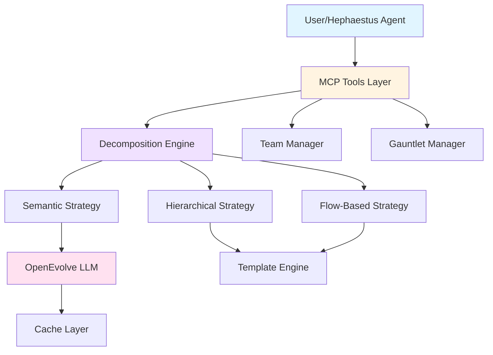

---

### Component Interaction

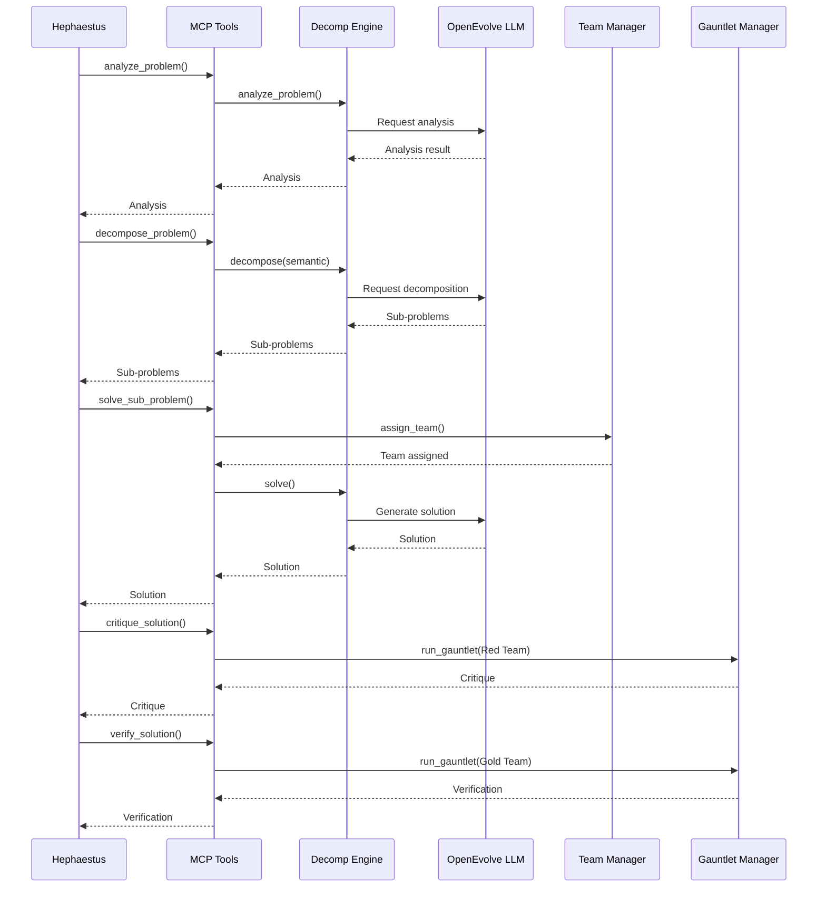

---

## Component Architecture

### Decomposition Engine

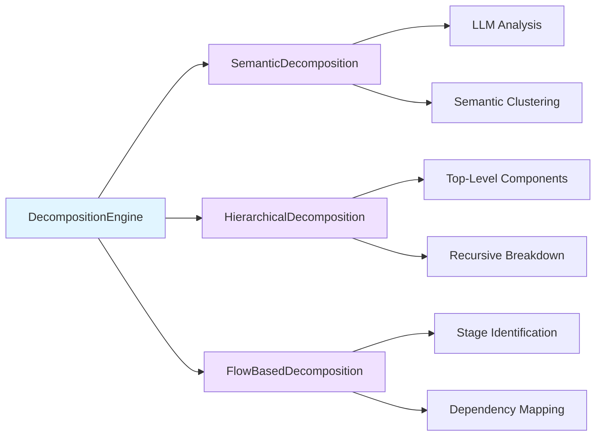

---

### MCP Tools Architecture

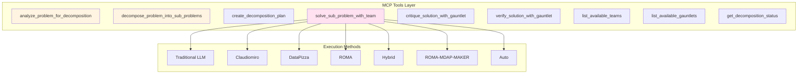

---

## Data Flow

### Decomposition Workflow

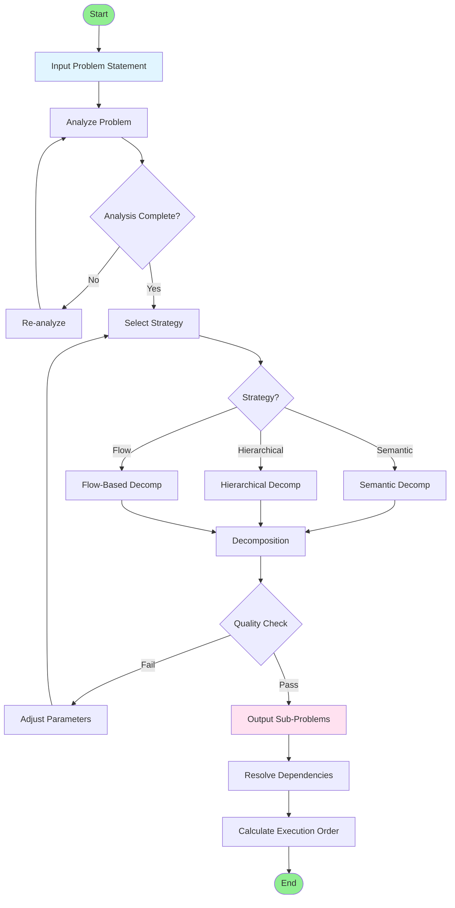

---

### Solution Integration Flow

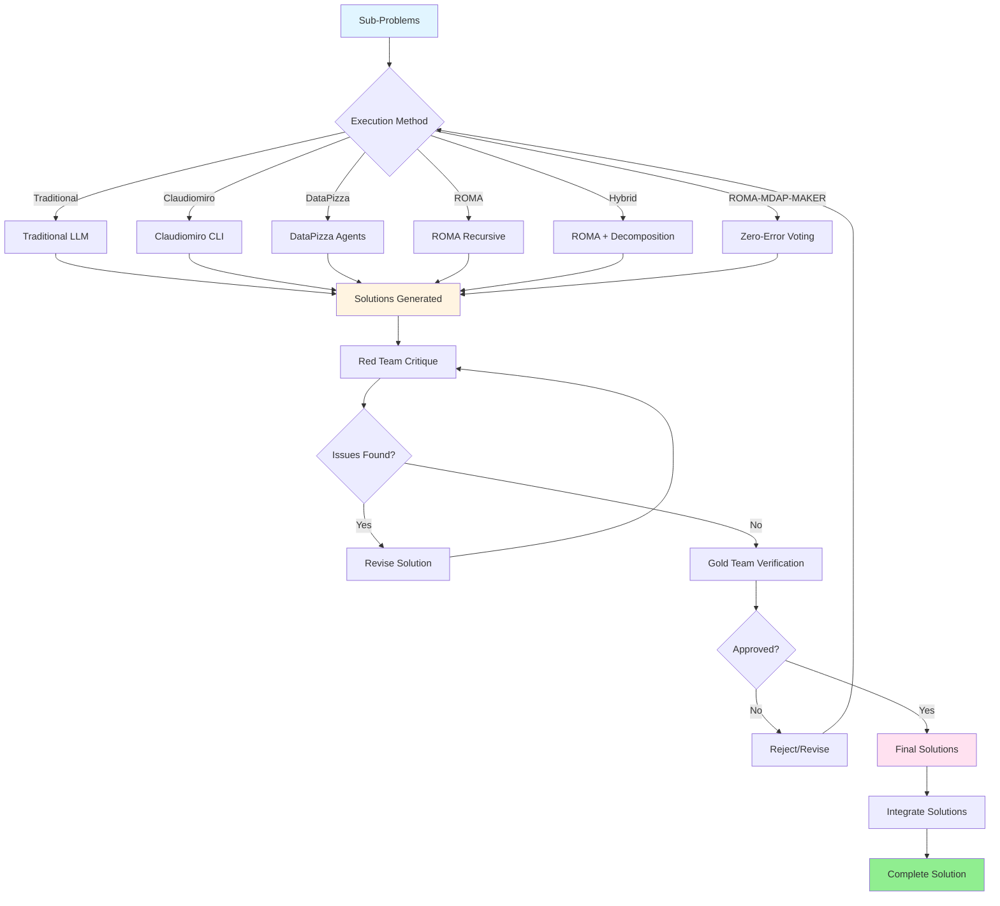

---

## Execution Methods

### Method Comparison

```mermaid
graph TB
    subgraph "Traditional Method"
        T1[LLM Prompt] --> T2[Solution Generation]
        T2 --> T3[Optional Evolution]
    end

    subgraph "Claudiomiro Method"
        C1[Problem Statement] --> C2[Claudiomiro CLI]
        C2 --> C3[Autonomous Development]
        C3 --> C4[File Generation]
    end

    subgraph "DataPizza Method"
        D1[Problem Statement] --> D2[Multi-Agent System]
        D2 --> D3[Tool Use]
        D3 --> D4[Collaborative Solution]
    end

    subgraph "ROMA Method"
        R1[Problem Statement] --> R2[Recursive Decomposition]
        R2 --> R3[Hierarchical Execution]
        R3 --> R4[Aggregated Solution]
    end

    subgraph "ROMA-MDAP-MAKER Method"
        M1[Problem Statement] --> M2[ROMA Decomposition]
        M2 --> M3[Atomic Tasks]
        M3 --> M4[MAKER Voting]
        M4 --> M5[Zero-Error Result]
    end

    style T3 fill:#e1f5ff
    style C4 fill:#f0e1ff
    style D4 fill:#fff4e1
    style R4 fill:#ffe1f0
    style M5 fill:#e1ffe1
```

---

### ROMA-MDAP-MAKER Zero-Error Flow

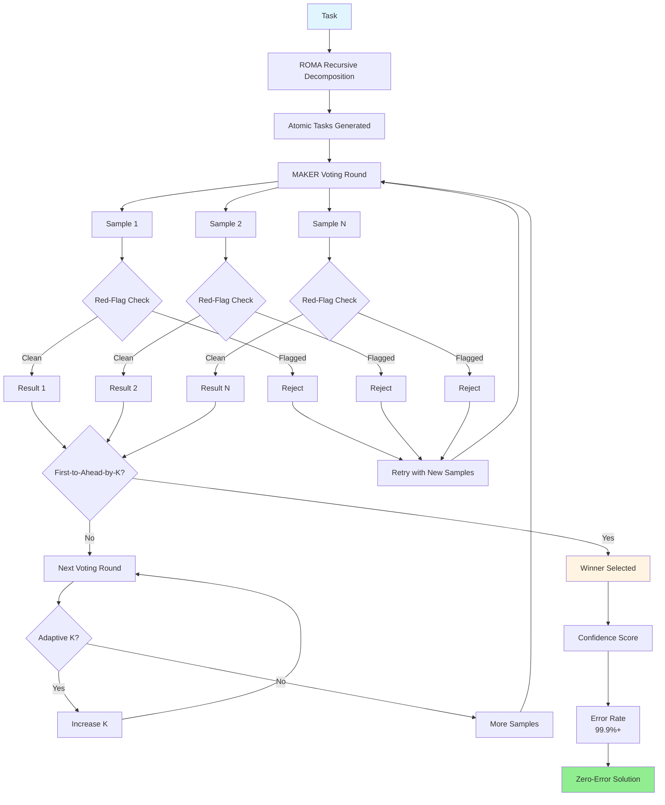

---

## Integration Patterns

### Hephaestus Integration

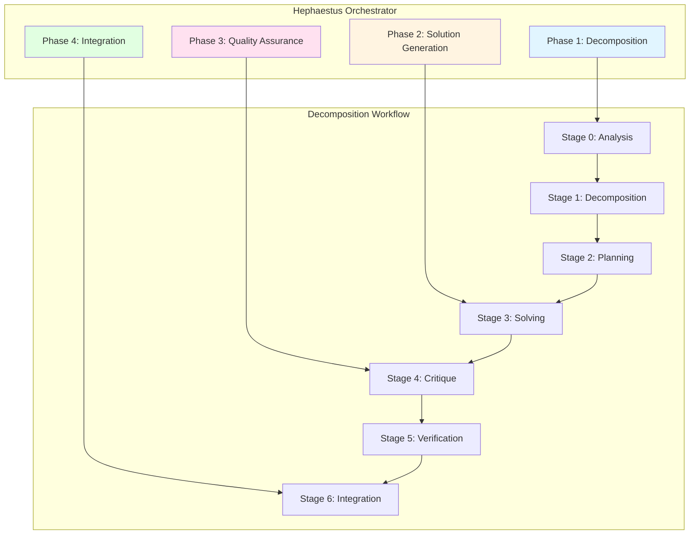

---

### OpenEvolve Integration

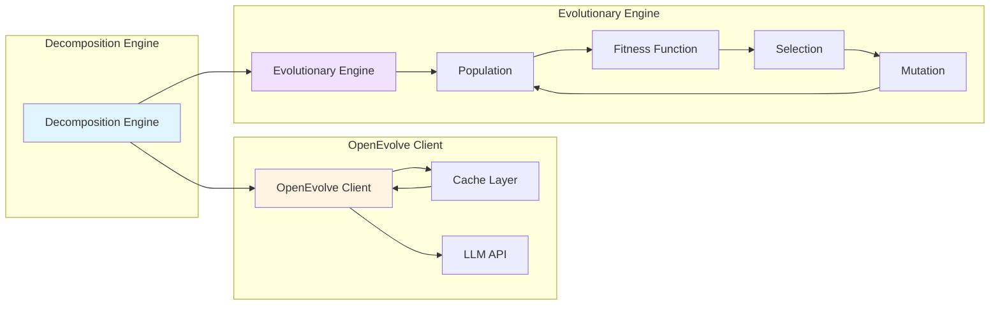

---

## Deployment

### Production Deployment

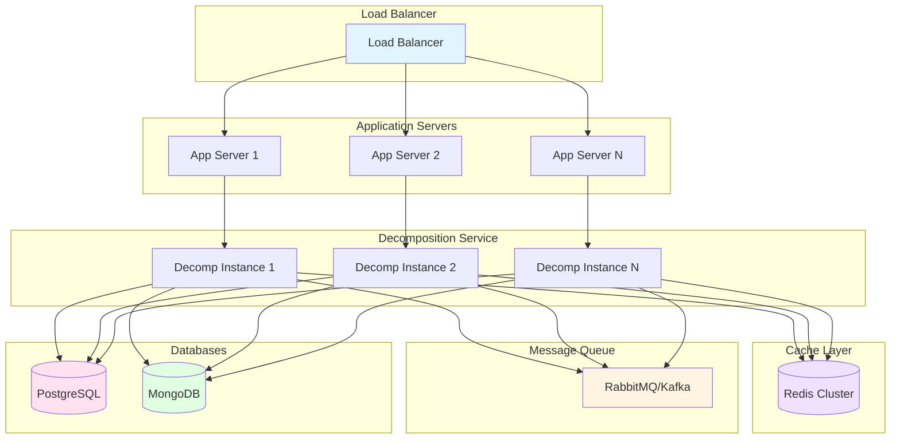

---

### Development Environment

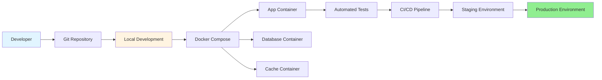

---

## Performance Optimization

### Caching Strategy

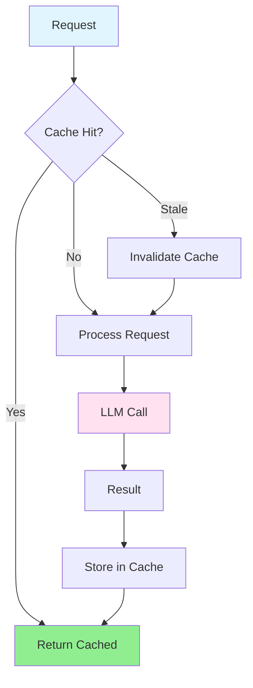

---

### Parallel Execution

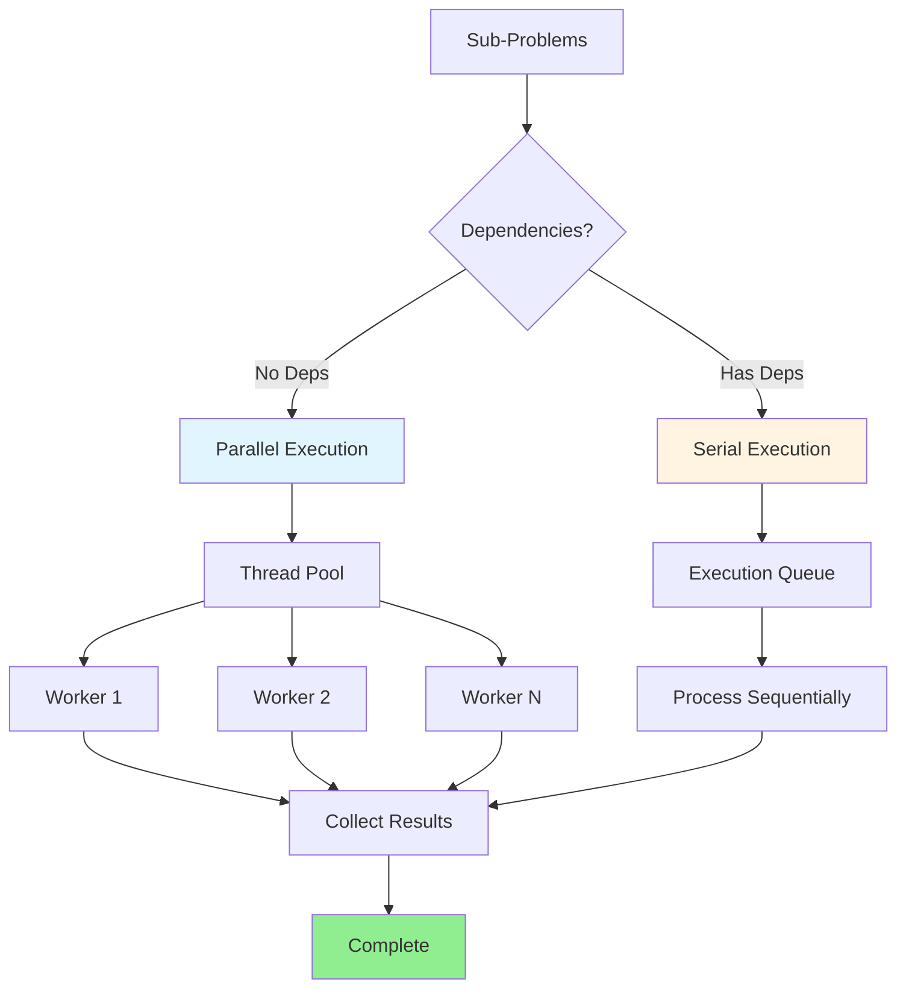

---

## Monitoring

### Metrics Flow

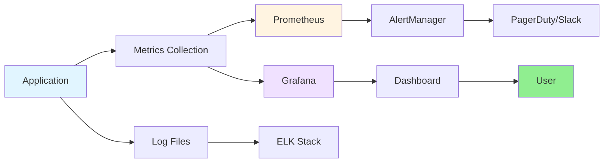

---

## Security Architecture

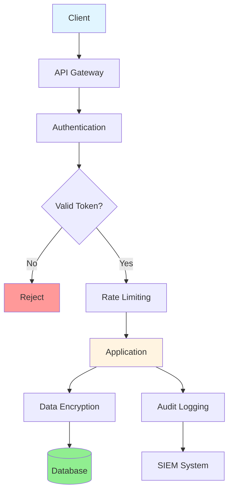

---

## Summary

### Key Architectural Principles

1. **Modularity**: Clear separation of concerns
2. **Scalability**: Horizontal scaling support
3. **Reliability**: Redundancy and failover
4. **Performance**: Caching and optimization
5. **Security**: Encryption and authentication
6. **Monitoring**: Comprehensive observability

### Technology Stack

- **Language**: Python 3.8+
- **LLM**: OpenAI GPT-4 / Anthropic Claude
- **Caching**: Redis
- **Database**: PostgreSQL / MongoDB
- **Message Queue**: RabbitMQ / Kafka
- **Monitoring**: Prometheus / Grafana
- **Deployment**: Docker / Kubernetes

---

**Document Version:** 1.0.0
**Last Updated:** 2025-01-03
