# BubbleLab Architecture

## Table of Contents

- [System Overview](#system-overview)
- [Architecture Principles](#architecture-principles)
- [Component Architecture](#component-architecture)
- [Data Flow](#data-flow)
- [Security Architecture](#security-architecture)
- [Deployment Architecture](#deployment-architecture)
- [Integration Patterns](#integration-patterns)
- [Scalability Considerations](#scalability-considerations)
- [Technology Stack](#technology-stack)

---

## System Overview

BubbleLab is a modular, type-safe workflow automation platform that compiles visual workflows into production-ready TypeScript code. The architecture follows a monorepo pattern with clear separation between core packages, applications, and integration layers.

### High-Level Architecture

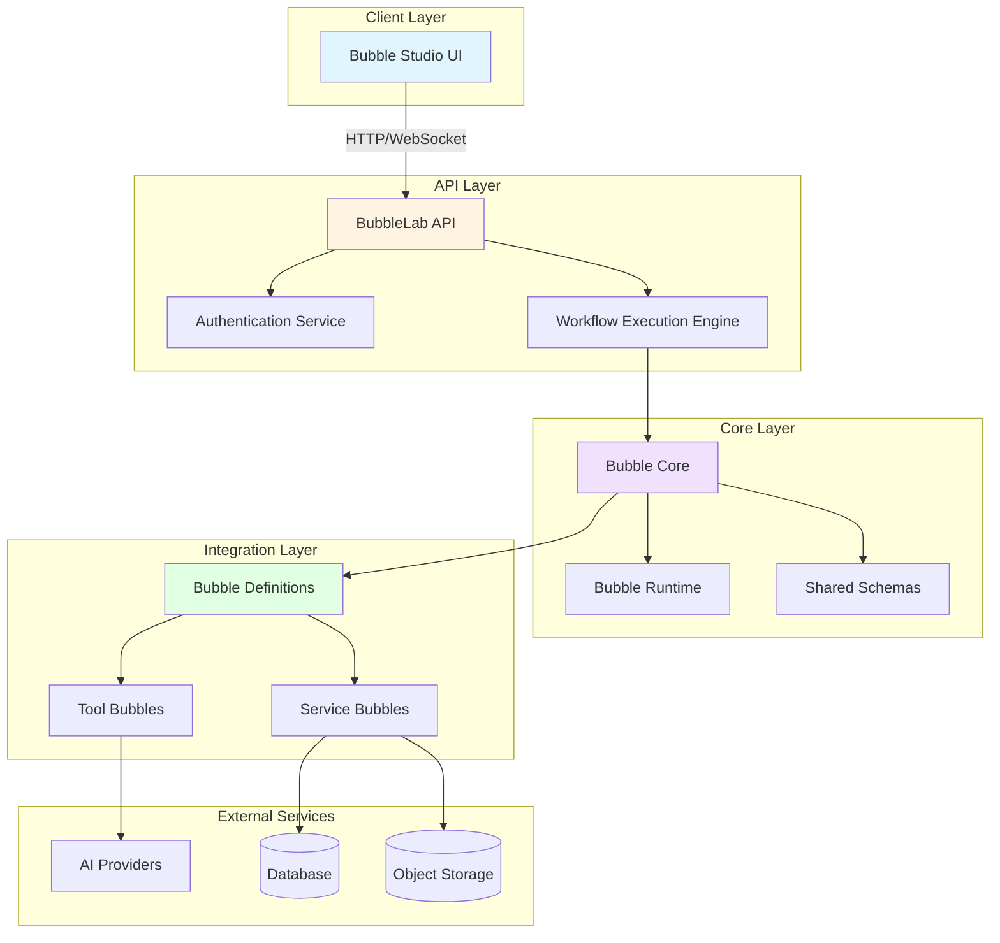

---

## Architecture Principles

### 1. **Type Safety First**
- All workflows compile to TypeScript
- Strong typing throughout the stack
- Compile-time error detection
- IDE-friendly development experience

### 2. **Separation of Concerns**
- Clear boundaries between UI, API, and core logic
- Independent packages with well-defined interfaces
- Minimal coupling between components

### 3. **Observability**
- Built-in tracing and logging
- Execution metrics and performance monitoring
- Token usage and cost tracking
- Detailed execution history

### 4. **Extensibility**
- Plugin-based bubble system
- Easy to add new integrations
- Custom tools and services
- Template system for reusability

### 5. **Developer Experience**
- Visual builder with code export
- Hot-reload development
- Clear error messages
- Comprehensive documentation

---

## Component Architecture

### Monorepo Structure

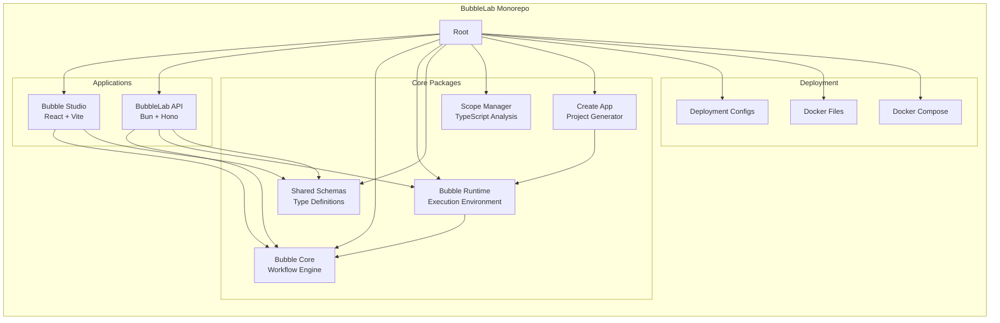

### Core Components

#### 1. Bubble Studio (Frontend)
**Location:** `apps/bubble-studio`

**Responsibilities:**
- Visual workflow builder interface
- Real-time collaboration features
- Workflow validation and testing
- Code generation and export
- Execution history visualization

**Technology Stack:**
- React 18+ with TypeScript
- Vite for build tooling
- TanStack Router for routing
- TanStack Query for state management
- Radix UI for components
- TailwindCSS for styling

#### 2. BubbleLab API (Backend)
**Location:** `apps/bubblelab-api`

**Responsibilities:**
- RESTful API for workflow CRUD operations
- Workflow execution orchestration
- User authentication and authorization
- Credential management
- Webhook handling
- Template management

**Technology Stack:**
- Bun runtime
- Hono web framework
- Drizzle ORM for database access
- PostgreSQL/SQLite for persistence
- Zod for validation
- OpenTelemetry for tracing

#### 3. Bubble Core (Workflow Engine)
**Location:** `packages/bubble-core`

**Responsibilities:**
- Bubble definition and validation
- Workflow compilation
- Type generation
- Dependency injection
- Execution context management

**Key Features:**
- Abstract base classes for all bubble types
- Strong TypeScript typing
- Parameter validation
- Result transformation
- Error handling

#### 4. Bubble Runtime (Execution Environment)
**Location:** `packages/bubble-runtime`

**Responsibilities:**
- Workflow execution engine
- Bubble instantiation
- Data flow management
- Error propagation
- Execution tracing
- Metrics collection

**Key Features:**
- Isolated execution contexts
- Automatic dependency resolution
- Circular dependency detection
- Timeout management
- Memory limits

---

## Data Flow

### Workflow Creation Flow

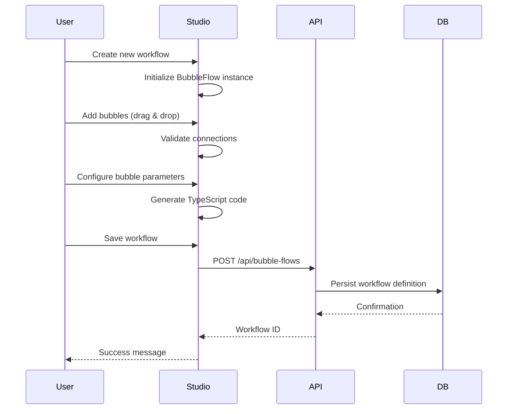

### Workflow Execution Flow

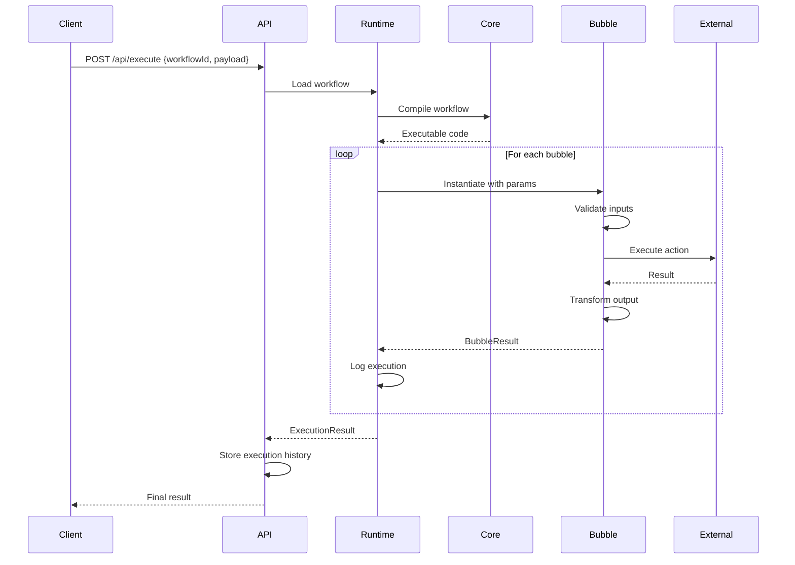

### AI-Powered Flow Generation

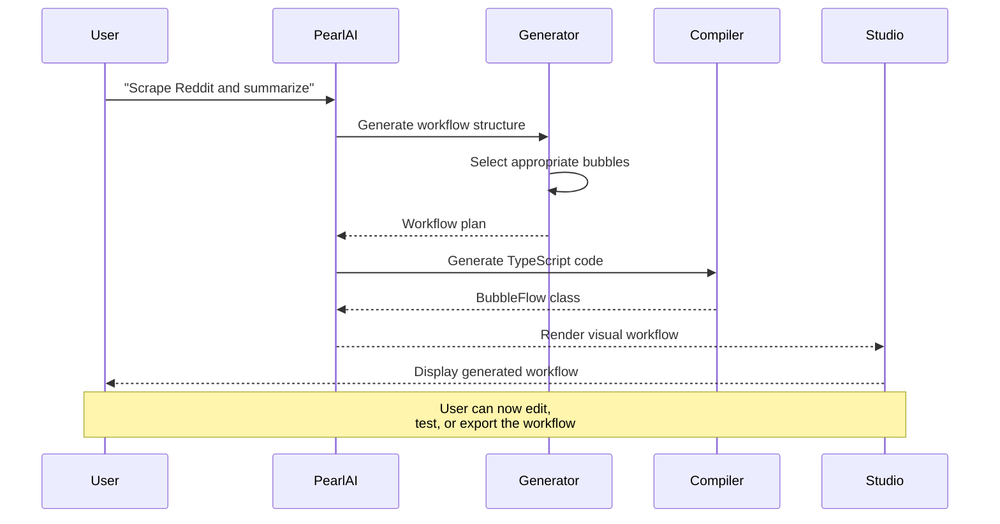

---

## Security Architecture

### Authentication & Authorization

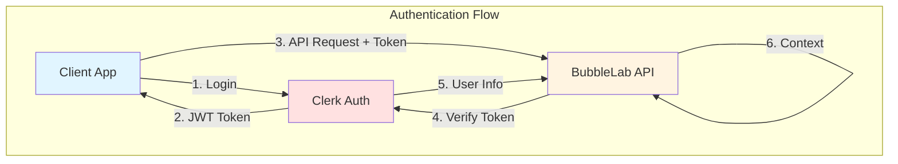

### Credential Management

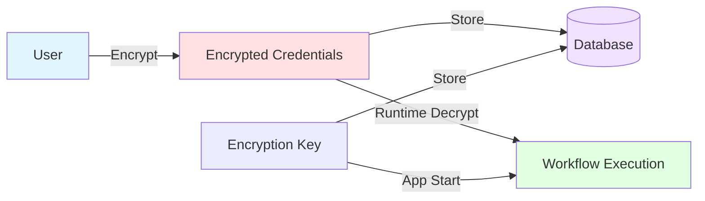

**Security Features:**

1. **Encryption at Rest**
   - AES-256 encryption for stored credentials
   - Environment-specific encryption keys
   - Key rotation support

2. **Secure Execution**
   - Isolated execution contexts
   - Timeout enforcement
   - Memory limits
   - Sandbox mode for tool bubbles

3. **API Security**
   - CORS configuration
   - Rate limiting
   - Request validation
   - SQL injection prevention (parameterized queries)

4. **Webhook Security**
   - HMAC signature verification
   - Replay attack prevention
   - IP whitelisting support

---

## Deployment Architecture

### Development Environment

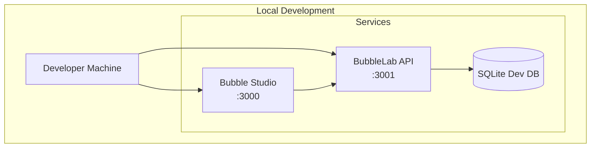

### Production Deployment

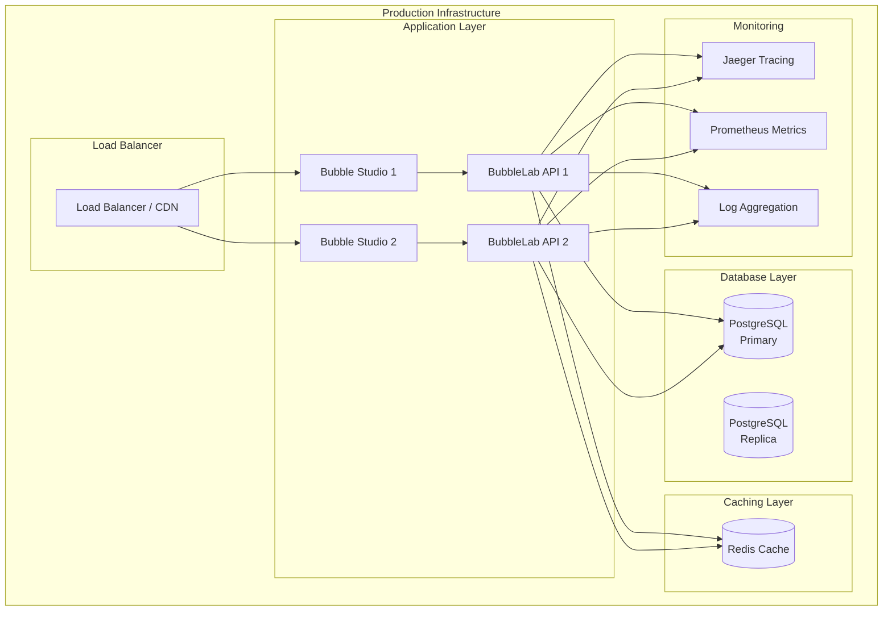

### Container Architecture

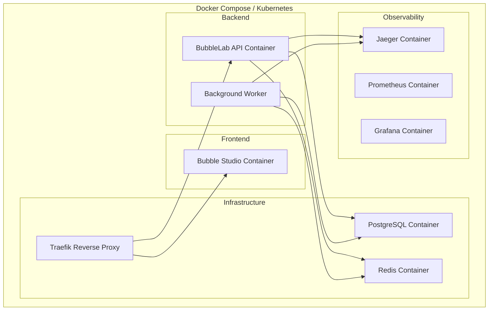

---

## Integration Patterns

### Bubble System Architecture

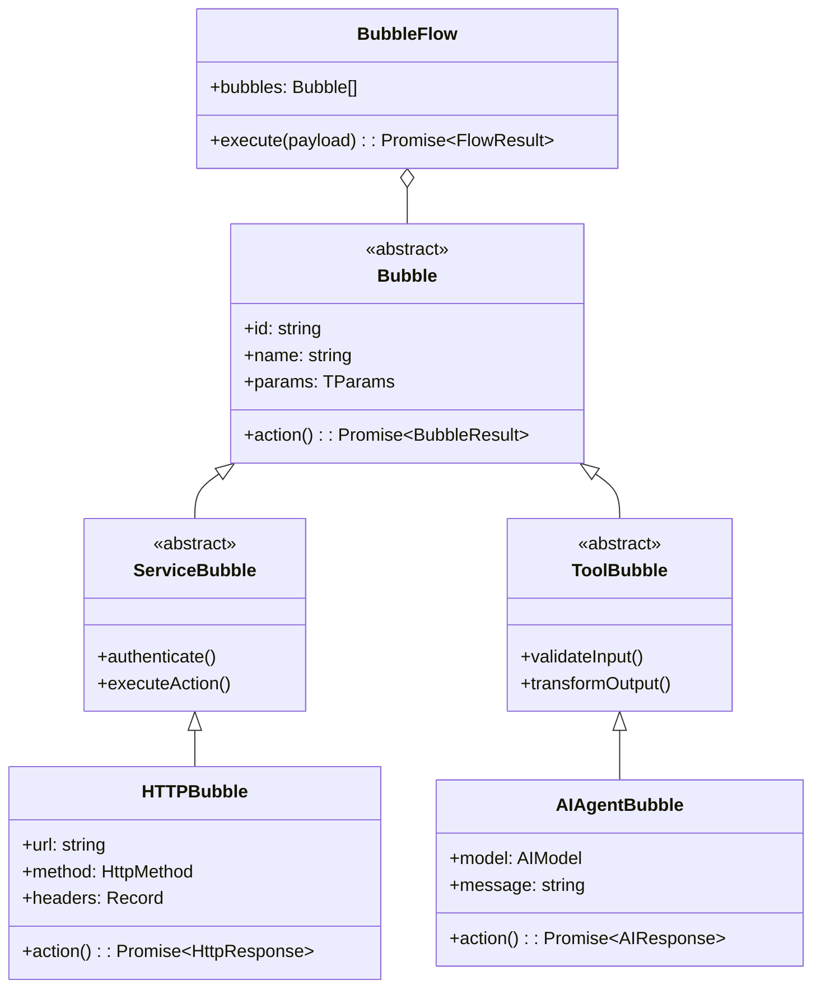

### Integration Points

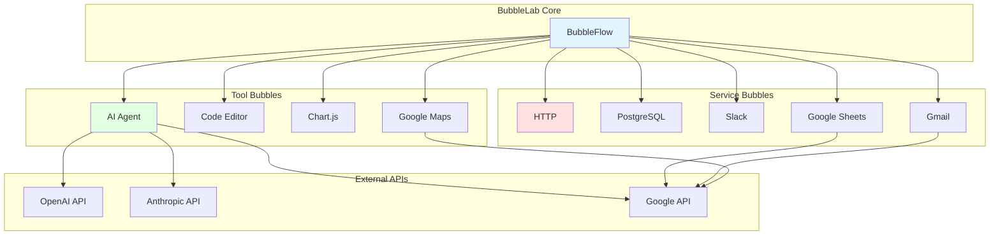

---

## Scalability Considerations

### Horizontal Scaling

**API Layer:**
- Stateless design enables horizontal scaling
- Load balancer distributes requests
- Session state stored in Redis
- Database connection pooling

**Execution Layer:**
- Worker queues for async execution
- Background job processing
- Priority queues for different execution tiers
- Dead letter queues for failed jobs

### Vertical Scaling

**Database:**
- Read replicas for query scaling
- Connection pooling limits
- Query optimization
- Indexing strategy

**Caching:**
- Redis for session data
- API response caching
- Workflow template caching
- Bubble metadata caching

### Performance Optimization

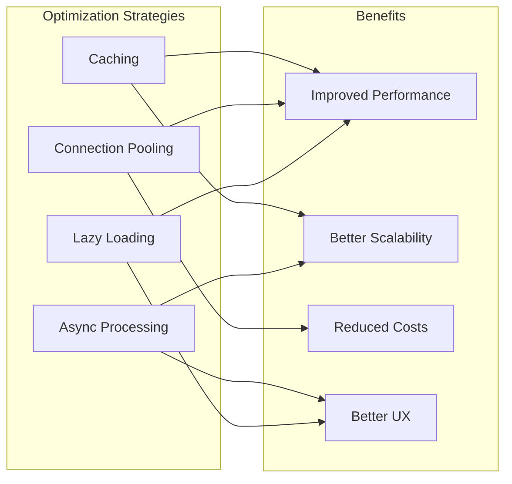

---

## Technology Stack

### Frontend

| Technology | Purpose | Version |
|------------|---------|---------|
| React | UI Framework | 18+ |
| TypeScript | Type Safety | 5+ |
| Vite | Build Tool | Latest |
| TanStack Router | Routing | Latest |
| TanStack Query | State Management | Latest |
| Radix UI | Component Library | Latest |
| TailwindCSS | Styling | 3+ |
| React Flow | Visual Builder | Latest |

### Backend

| Technology | Purpose | Version |
|------------|---------|---------|
| Bun | Runtime | Latest |
| Hono | Web Framework | Latest |
| Drizzle ORM | Database ORM | Latest |
| PostgreSQL | Database | 14+ |
| SQLite | Dev Database | 3+ |
| Zod | Validation | Latest |
| OpenTelemetry | Tracing | Latest |
| JWT | Authentication | Latest |

### DevOps

| Technology | Purpose | Version |
|------------|---------|---------|
| Docker | Containerization | Latest |
| Docker Compose | Local Dev | Latest |
| Kubernetes | Orchestration | 1.25+ |
| Traefik | Reverse Proxy | Latest |
| Prometheus | Metrics | Latest |
| Jaeger | Tracing | Latest |
| Grafana | Visualization | Latest |

### Development Tools

| Technology | Purpose | Version |
|------------|---------|---------|
| pnpm | Package Manager | 8+ |
| Turbo | Build System | Latest |
| ESLint | Linting | Latest |
| Prettier | Formatting | Latest |
| Husky | Git Hooks | Latest |
| TypeScript | Type Checking | 5+ |

---

## Monitoring & Observability

### Metrics Collection

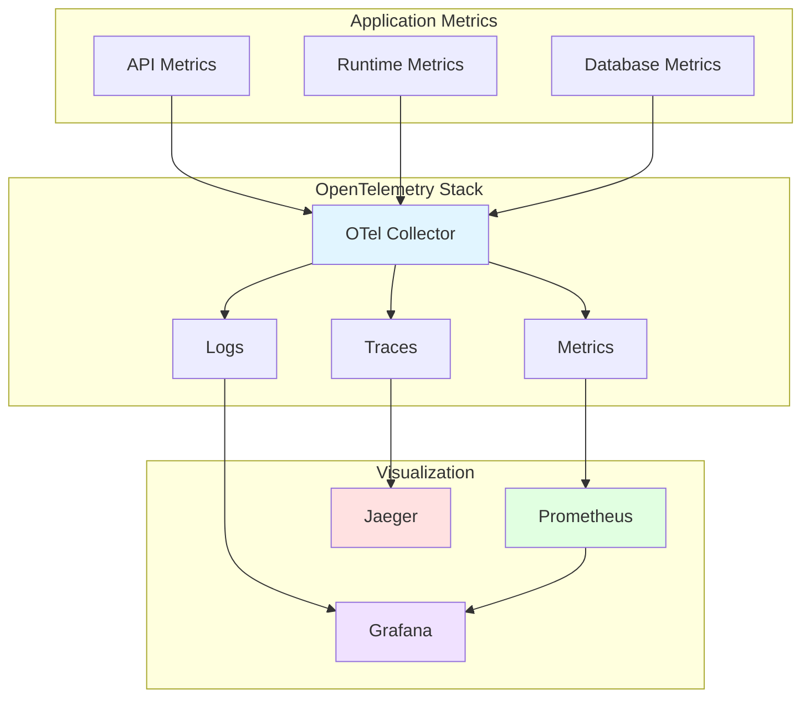

### Key Metrics

**System Metrics:**
- CPU usage
- Memory usage
- Disk I/O
- Network I/O

**Application Metrics:**
- Request rate
- Response time
- Error rate
- Active executions

**Business Metrics:**
- Workflow executions
- Bubble usage statistics
- Token consumption
- Cost tracking

---

## Future Architecture Considerations

### Planned Enhancements

1. **Multi-Region Deployment**
   - Geographic distribution
   - Data locality compliance
   - Reduced latency

2. **Advanced Caching**
   - Edge caching
   - CDN integration
   - Intelligent cache invalidation

3. **Event-Driven Architecture**
   - Message queue integration
   - Event sourcing
   - CQRS pattern

4. **Microservices Transition**
   - Service decomposition
   - Independent scaling
   - Technology diversity

5. **AI/ML Enhancements**
   - Workflow optimization
   - Anomaly detection
   - Predictive scaling

---

## Documentation References

- [DEPLOYMENT_GUIDE.md](./DEPLOYMENT_GUIDE.md) - Deployment instructions
- [CONTRIBUTING.md](./CONTRIBUTING.md) - Development setup
- [docs/runbooks/](./docs/runbooks/) - Operational procedures
- [docs/integrations/](./docs/integrations/) - Integration guides
- [docs/security/](./docs/security/) - Security documentation

---

## Support & Community

- **Documentation:** https://docs.bubblelab.ai/
- **Discord:** https://discord.gg/PkJvcU2myV
- **GitHub Issues:** https://github.com/bubblelabai/BubbleLab/issues
- **Email:** support@bubblelab.ai

---

*Last Updated: January 2026*
