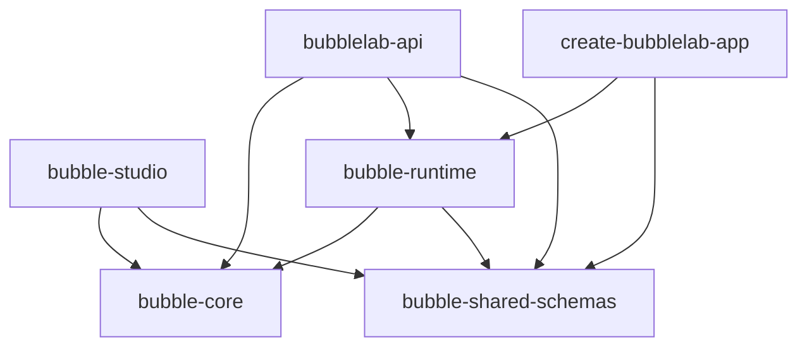
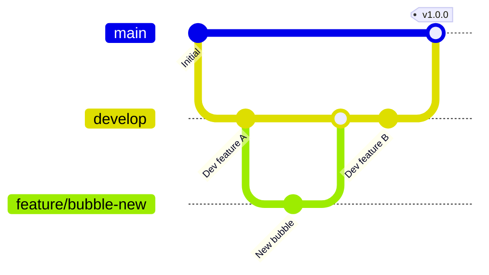

# Development Guide

## Table of Contents

- [Overview](#overview)
- [Development Environment](#development-environment)
- [Project Structure](#project-structure)
- [Development Workflow](#development-workflow)
- [Testing](#testing)
- [Debugging](#debugging)
- [Code Style](#code-style)
- [Git Workflow](#git-workflow)
- [Common Tasks](#common-tasks)

---

## Overview

This guide covers the development workflow for contributing to BubbleLab, including setup, coding practices, testing, and submission guidelines.

---

## Development Environment

### Prerequisites

**Required:**
- [Bun](https://bun.sh) v1.0+ (backend runtime)
- [Node.js](https://nodejs.org) v18+ (development)
- [pnpm](https://pnpm.io) v8+ (package manager)
- [Git](https://git-scm.com) v2.30+

**Recommended:**
- [VS Code](https://code.visualstudio.com) with extensions
- [Docker Desktop](https://www.docker.com/products/docker-desktop)
- [PostgreSQL client](https://www.postgresql.org/download/)

### VS Code Extensions

```
- dbaeumer.vscode-eslint
- esbenp.prettier-vscode
- bradlc.vscode-tailwindcss
- ms-vscode.vscode-typescript-next
- EditorConfig.EditorConfig
- ts-migrate.ts-migrate
- nikitasVoloshyov.vscode-Better-align
```

### Quick Setup

```bash
# Clone repository
git clone https://github.com/bubblelabai/BubbleLab.git
cd BubbleLab

# Install dependencies
pnpm install

# Setup environment
pnpm run setup:env

# Start development servers
pnpm run dev
```

**Services will start on:**
- Frontend: http://localhost:3000
- Backend: http://localhost:3001

---

## Project Structure

### Monorepo Layout

```
BubbleLab/
├── apps/                      # Applications
│   ├── bubble-studio/        # Visual workflow builder
│   └── bubblelab-api/        # Backend API server
│
├── packages/                  # Shared packages
│   ├── bubble-core/          # Core workflow engine
│   ├── bubble-runtime/       # Execution runtime
│   ├── bubble-shared-schemas/# Shared TypeScript types
│   ├── ts-scope-manager/     # TypeScript scope analysis
│   └── create-bubblelab-app/ # CLI scaffolding tool
│
├── docs/                      # Documentation
├── deployment/                # Deployment configurations
├── templates/                 # Workflow templates
└── examples/                  # Example projects
```

### Package Dependencies



---

## Development Workflow

### Branch Strategy



**Branch Types:**

- `main` - Production releases
- `develop` - Integration branch for features
- `feature/*` - New features
- `bugfix/*` - Bug fixes
- `hotfix/*` - Production hotfixes
- `release/*` - Release preparation

### Feature Development Workflow

**1. Create Feature Branch**

```bash
# Start from develop
git checkout develop
git pull origin develop

# Create feature branch
git checkout -b feature/amazing-new-bubble
```

**2. Development**

```bash
# Make your changes
# ...

# Run tests
pnpm test

# Run linter
pnpm lint

# Build packages
pnpm build
```

**3. Commit Changes**

```bash
# Stage changes
git add .

# Commit with conventional commit message
git commit -m "feat: add amazing new bubble integration

- Implement core bubble logic
- Add tests for new bubble
- Update documentation

Closes #123"
```

**4. Push and Create PR**

```bash
# Push branch
git push origin feature/amazing-new-bubble

# Create pull request on GitHub
# Target: develop
```

---

## Testing

### Test Structure

```
packages/bubble-core/
├── src/
│   └── bubbles/
│       └── http.ts
└── __tests__/
    └── bubbles/
        └── http.test.ts
```

### Writing Tests

**Unit Tests (Jest + React Testing Library):**

```typescript
// __tests__/bubbles/http.test.ts
import { describe, it, expect, beforeEach } from '@jest/globals';
import { HTTPBubble } from '../src/bubbles/http';

describe('HTTPBubble', () => {
  let bubble: HTTPBubble;

  beforeEach(() => {
    bubble = new HTTPBubble({
      url: 'https://api.example.com/test',
      method: 'GET',
    });
  });

  describe('validation', () => {
    it('should validate valid params', () => {
      expect(bubble.validate()).toBeTruthy();
    });

    it('should reject invalid URL', () => {
      bubble.params.url = 'not-a-url';
      expect(bubble.validate()).toBeFalsy();
    });

    it('should require URL', () => {
      bubble.params.url = '';
      expect(bubble.validate()).toBeFalsy();
    });
  });

  describe('execution', () => {
    it('should make GET request', async () => {
      const result = await bubble.action();
      expect(result.success).toBe(true);
      expect(result.data).toBeDefined();
    });

    it('should handle errors', async () => {
      bubble.params.url = 'https://invalid-domain-12345.com';
      const result = await bubble.action();
      expect(result.success).toBe(false);
      expect(result.error).toBeDefined();
    });
  });
});
```

**Integration Tests:**

```typescript
// __tests__/integration/workflow-execution.test.ts
import { describe, it, expect } from '@jest/globals';
import { BubbleRunner } from '@bubblelab/bubble-runtime';

describe('Workflow Execution Integration', () => {
  it('should execute simple workflow', async () => {
    const workflow = {
      bubbles: [
        {
          type: 'http',
          params: { url: 'https://api.example.com/data' },
        },
      ],
    };

    const runner = new BubbleRunner(workflow);
    const result = await runner.execute();

    expect(result.status).toBe('success');
    expect(result.outputs.length).toBe(1);
  });
});
```

### Running Tests

```bash
# Run all tests
pnpm test

# Run tests in watch mode
pnpm test:watch

# Run tests for specific package
pnpm --filter bubble-core test

# Run tests with coverage
pnpm test:coverage

# Run integration tests
pnpm test:integration
```

---

## Debugging

### VS Code Configuration

**.vscode/launch.json:**

```json
{
  "version": "0.2.0",
  "configurations": [
    {
      "name": "Debug API Server",
      "type": "node",
      "request": "launch",
      "runtimeExecutable": "bun",
      "runtimeArgs": ["run", "src/index.ts"],
      "cwd": "${workspaceFolder}/apps/bubblelab-api",
      "env": {
        "BUBBLE_ENV": "dev",
        "DATABASE_URL": "file:./dev.db"
      }
    },
    {
      "name": "Debug Frontend",
      "type": "chrome",
      "request": "launch",
      "url": "http://localhost:3000",
      "webRoot": "${workspaceFolder}/apps/bubble-studio"
    }
  ]
}
```

### Debugging Techniques

**Console Logging:**

```typescript
import { logger } from './lib/logger';

// Structured logging
logger.info({
  workflowId: workflow.id,
  step: 'http_bubble',
  message: 'Making HTTP request'
});

// Debug logging
logger.debug({
  bubbleParams: bubble.params,
  validationResult: validation
});
```

**Breakpoints:**

```typescript
// Add debugger statement
function processWorkflow(workflow: Workflow) {
  debugger; // Execution pauses here
  // ...
}
```

**Performance Profiling:**

```bash
# Profile Node.js performance
bun --inspect-brk src/index.ts

# Open Chrome DevTools
# chrome://inspect
```

---

## Code Style

### TypeScript Configuration

**tsconfig.json:**

```json
{
  "compilerOptions": {
    "target": "ES2022",
    "module": "ESNext",
    "lib": ["ES2022"],
    "strict": true,
    "esModuleInterop": true,
    "skipLibCheck": true,
    "forceConsistentCasingInFileNames": true,
    "resolveJsonModule": true,
    "moduleResolution": "bundler",
    "allowImportingTsExtensions": true,
    "noEmit": true
  }
}
```

### ESLint Configuration

**.eslintrc.json:**

```json
{
  "extends": [
    "eslint:recommended",
    "plugin:@typescript-eslint/recommended",
    "plugin:react/recommended",
    "plugin:react-hooks/recommended",
    "prettier"
  ],
  "rules": {
    "@typescript-eslint/no-explicit-any": "error",
    "@typescript-eslint/explicit-function-return-type": "warn",
    "no-console": ["warn", { "allow": ["warn", "error"] }],
    "prefer-const": "error"
  }
}
```

### Prettier Configuration

**.prettierrc:**

```json
{
  "semi": true,
  "trailingComma": "es5",
  "singleQuote": true,
  "printWidth": 100,
  "tabWidth": 2,
  "useTabs": false
}
```

### Naming Conventions

**Files:**
- Components: `PascalCase.tsx` (e.g., `BubbleNode.tsx`)
- Utilities: `camelCase.ts` (e.g., `httpUtils.ts`)
- Types: `PascalCase.types.ts` (e.g., `Workflow.types.ts`)
- Tests: `<name>.test.ts`

**Code:**

```typescript
// Classes: PascalCase
class BubbleRunner { }

// Interfaces: PascalCase with I prefix
interface IWorkflow { }

// Types: PascalCase
type WorkflowResult = { };

// Functions/Variables: camelCase
function executeWorkflow() { }
const bubbleCount = 10;

// Constants: UPPER_SNAKE_CASE
const MAX_RETRIES = 3;

// Private properties: prefix with _
private _logger: Logger;

// Async functions: prefix with try if needed
async function tryExecute() { }
```

---

## Git Workflow

### Commit Messages

**Conventional Commits:**

```
<type>[optional scope]: <description>

[optional body]

[optional footer(s)]
```

**Types:**
- `feat` - New feature
- `fix` - Bug fix
- `docs` - Documentation changes
- `style` - Code style changes (formatting)
- `refactor` - Code refactoring
- `test` - Adding or updating tests
- `chore` - Maintenance tasks
- `perf` - Performance improvements

**Examples:**

```bash
# Simple feature
git commit -m "feat: add Slack notification bubble"

# Feature with scope
git commit -m "feat(api): add workflow execution endpoint"

# Bug fix
git commit -m "fix: resolve memory leak in workflow runner"

# Breaking change
git commit -m "feat!: change bubble API interface

BREAKING CHANGE: Bubble.params is now required
"
```

### Pull Request Guidelines

**PR Title Format:**

```
[Type] Short description

# Example:
[Feat] Add Google Sheets integration bubble
```

**PR Description Template:**

```markdown
## Summary
Brief description of changes

## Changes
- Change 1
- Change 2

## Testing
- [ ] Unit tests added/updated
- [ ] Integration tests added/updated
- [ ] Manual testing completed

## Checklist
- [ ] Follows contribution guidelines
- [ ] No new warnings
- [ ] Documentation updated
- [ ] Tests pass locally

## Related Issues
Closes #123
```

---

## Common Tasks

### Adding a New Bubble

**1. Create Bubble Class**

```typescript
// packages/bubble-core/src/bubbles/tool-bubble/my-tool.ts
import { ToolBubble, ToolBubbleParams } from '../tool-bubble';

export interface MyToolParams extends ToolBubbleParams {
  apiKey: string;
  input: string;
}

export class MyTool extends ToolBubble<MyToolParams> {
  async action(): Promise<BubbleResult> {
    // Implementation
    return {
      success: true,
      data: result
    };
  }

  validate(): boolean {
    return !!(this.params.apiKey && this.params.input);
  }
}
```

**2. Export Bubble**

```typescript
// packages/bubble-core/src/bubbles/tool-bubble/index.ts
export * from './my-tool';
```

**3. Add Tests**

```typescript
// __tests__/bubbles/my-tool.test.ts
import { MyTool } from '../src/bubbles/tool-bubble/my-tool';

describe('MyTool', () => {
  // Tests
});
```

**4. Update Documentation**

```markdown
# MyTool Bubble

## Description
...

## Parameters
...

## Example
...
```

### Adding API Endpoint

**1. Define Route**

```typescript
// apps/bubblelab-api/src/routes/my-feature.ts
import { Hono } from 'hono';
import { zValidator } from '@hono/zod-validator';
import { z } from 'zod';

const app = new Hono();

const schema = z.object({
  input: z.string(),
});

app.post('/api/my-feature', zValidator('json', schema), async (c) => {
  const { input } = c.req.valid('json');
  // Implementation
  return c.json({ result });
});

export default app;
```

**2. Register Route**

```typescript
// apps/bubblelab-api/src/index.ts
import myFeatureRoutes from './routes/my-feature';

app.route('/', myFeatureRoutes);
```

### Database Migration

**1. Create Migration**

```bash
# Using Drizzle
pnpm --filter bubblelab-api db:generate

# Creates file: migrations/0001_new_table.sql
```

**2. Run Migration**

```bash
pnpm --filter bubblelab-api db:migrate
```

**3. Update Schema**

```typescript
// packages/bubble-shared-schemas/src/db-schema.ts
export const myTable = pgTable('my_table', {
  id: serial('id').primaryKey(),
  name: text('name').notNull(),
  createdAt: timestamp('created_at').defaultNow(),
});
```

---

## Performance Guidelines

### Optimization Tips

**1. Async Operations:**

```typescript
// Bad: Sequential async operations
for (const item of items) {
  await processItem(item);
}

// Good: Parallel async operations
await Promise.all(items.map(item => processItem(item)));
```

**2. Error Handling:**

```typescript
// Bad: Silent failures
try {
  await riskyOperation();
} catch (e) {
  // Ignore error
}

// Good: Proper error handling
try {
  await riskyOperation();
} catch (e) {
  logger.error({ error: e }, 'Operation failed');
  throw e;
}
```

**3. Memory Management:**

```typescript
// Good: Clean up resources
async function processLargeDataset(data: any[]) {
  const results = [];
  for (const item of data) {
    const result = await processItem(item);
    results.push(result);

    // Allow garbage collection
    if (results.length % 1000 === 0) {
      await new Promise(resolve => setImmediate(resolve));
    }
  }
  return results;
}
```

---

## Related Documentation

- [CONTRIBUTING.md](./CONTRIBUTING.md) - Contribution guide
- [ARCHITECTURE.md](./ARCHITECTURE.md) - System architecture
- [docs/runbooks/](./docs/runbooks/) - Operational procedures

---

*Last Updated: January 2026*
