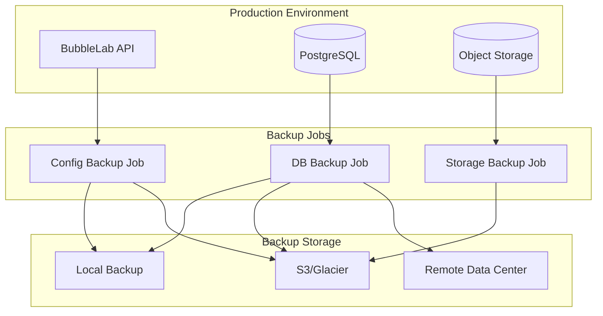
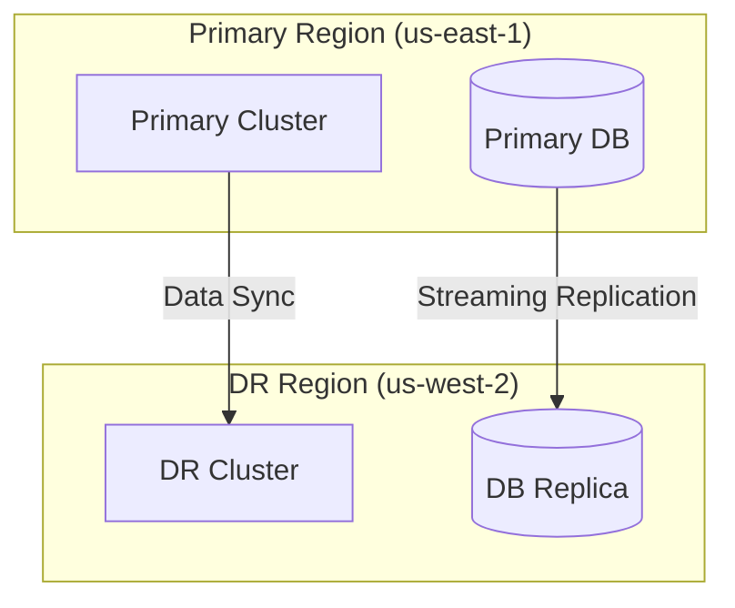

# Backup and Recovery Runbook

## Table of Contents

- [Overview](#overview)
- [Backup Strategy](#backup-strategy)
- [Database Backups](#database-backups)
- [Application Backups](#application-backups)
- [Storage Backups](#storage-backups)
- [Recovery Procedures](#recovery-procedures)
- [Disaster Recovery](#disaster-recovery)
- [Testing Backups](#testing-backups)

---

## Overview

This runbook covers backup and recovery procedures for BubbleLab deployments, ensuring data safety and business continuity.

### Backup Architecture



---

## Backup Strategy

### 3-2-1 Backup Rule

1. **3** copies of your data (production + 2 backups)
2. **2** different storage types (local + cloud)
3. **1** offsite backup (different geographical location)

### Backup Types

| Type | Frequency | Retention | Purpose |
|------|-----------|-----------|---------|
| **Full Backup** | Daily | 30 days | Complete restore |
| **Incremental** | Hourly | 7 days | Point-in-time recovery |
| **Archive** | Monthly | 1 year | Long-term compliance |

### RPO and RTO Targets

- **RPO (Recovery Point Objective):** 15 minutes
  - Maximum acceptable data loss
  - Determines backup frequency

- **RTO (Recovery Time Objective):** 1 hour
  - Maximum acceptable downtime
  - Determines recovery procedures

---

## Database Backups

### Automated PostgreSQL Backups

**CronJob Manifest:**

```yaml
apiVersion: batch/v1
kind: CronJob
metadata:
  name: postgres-backup
  namespace: bubblelab
spec:
  schedule: "0 2 * * *"  # Daily at 2 AM
  successfulJobsHistoryLimit: 7
  failedJobsHistoryLimit: 3
  jobTemplate:
    spec:
      template:
        spec:
          containers:
          - name: pg-backup
            image: postgres:14-alpine
            command:
            - /bin/sh
            - -c
            - |
              set -e
              TIMESTAMP=$(date +%Y%m%d_%H%M%S)
              BACKUP_FILE="/backup/backup_${TIMESTAMP}.sql.gz"

              # Create backup
              PGPASSWORD=$POSTGRES_PASSWORD pg_dump \
                -h postgres-primary-0.postgres-primary \
                -U postgres \
                -d bubblelab \
                --verbose \
                --clean \
                --if-exists \
                | gzip > $BACKUP_FILE

              # Upload to S3
              aws s3 cp $BACKUP_FILE \
                s3://bubblelab-backups/database/backup_${TIMESTAMP}.sql.gz

              # Clean local files older than 7 days
              find /backup -name "*.sql.gz" -mtime +7 -delete

              # Keep last 30 backups in S3
              aws s3 ls s3://bubblelab-backups/database/ | \
                awk '{print $4}' | \
                sort -r | \
                tail -n +31 | \
                xargs -I {} aws s3 rm s3://bubblelab-backups/database/{}

              echo "Backup completed: ${BACKUP_FILE}"
            env:
            - name: POSTGRES_PASSWORD
              valueFrom:
                secretKeyRef:
                  name: postgres-secrets
                  key: postgres-password
            - name: AWS_ACCESS_KEY_ID
              valueFrom:
                secretKeyRef:
                  name: aws-credentials
                  key: access-key-id
            - name: AWS_SECRET_ACCESS_KEY
              valueFrom:
                secretKeyRef:
                  name: aws-credentials
                  key: secret-access-key
            volumeMounts:
            - name: backup-storage
              mountPath: /backup
          volumes:
          - name: backup-storage
            persistentVolumeClaim:
              claimName: backup-pvc
          restartPolicy: OnFailure
```

### Continuous Archiving (WAL)

**Enable WAL Archiving:**

```yaml
# postgres-config ConfigMap
apiVersion: v1
kind: ConfigMap
metadata:
  name: postgres-config
  namespace: bubblelab
data:
  postgresql.conf: |
    # WAL Settings
    wal_level = replica
    archive_mode = on
    archive_command = 'aws s3 cp %p s3://bubblelab-backups/wal/%f'
    archive_timeout = 300

    # Retention
    wal_keep_size = 1GB
```

### Manual Backup

```bash
# Backup to local file
kubectl exec -it postgres-0 -n bubblelab -- pg_dump \
  -U postgres \
  -d bubblelab \
  --verbose \
  --clean \
  --if-exists \
  | gzip > backup_$(date +%Y%m%d).sql.gz

# Backup from local machine
kubectl exec -n bubblelab postgres-0 -- pg_dump \
  -U postgres \
  -d bubblelab \
  --clean \
  --if-exists \
  > backup.sql

# Backup specific tables
kubectl exec -n bubblelab postgres-0 -- pg_dump \
  -U postgres \
  -d bubblelab \
  -t users \
  -t bubble_flows \
  --clean \
  --if-exists \
  > tables_backup.sql
```

### Point-in-Time Recovery

```bash
# List available backups
aws s3 ls s3://bubblelab-backups/database/

# Restore to specific point
kubectl exec -it postgres-0 -n bubblelab -- bash -c "
  # Stop PostgreSQL
  pg_ctl stop -D /var/lib/postgresql/data

  # Restore base backup
  gunzip -c /tmp/backup_20260118.sql.gz | psql -U postgres

  # Configure recovery
  echo 'restore_command = \"aws s3 cp s3://bubblelab-backups/wal/%f %p\"' >> /var/lib/postgresql/data/recovery.conf
  echo 'recovery_target_time = \"2026-01-18 10:00:00\"' >> /var/lib/postgresql/data/recovery.conf

  # Start PostgreSQL
  pg_ctl start -D /var/lib/postgresql/data
"
```

---

## Application Backups

### Kubernetes Resources

**Backup Script:**

```bash
#!/bin/bash
# backup-kubernetes-resources.sh

TIMESTAMP=$(date +%Y%m%d_%H%M%S)
BACKUP_DIR="/tmp/k8s-backup-${TIMESTAMP}"
mkdir -p $BACKUP_DIR

# Backup all resources in namespace
kubectl get all -n bubblelab -o yaml > $BACKUP_DIR/all-resources.yaml

# Backup specific resources
kubectl get configmaps -n bubblelab -o yaml > $BACKUP_DIR/configmaps.yaml
kubectl get secrets -n bubblelab -o yaml > $BACKUP_DIR/secrets.yaml
kubectl get deployments -n bubblelab -o yaml > $BACKUP_DIR/deployments.yaml
kubectl get statefulsets -n bubblelab -o yaml > $BACKUP_DIR/statefulsets.yaml
kubectl get services -n bubblelab -o yaml > $BACKUP_DIR/services.yaml
kubectl get ingresses -n bubblelab -o yaml > $BACKUP_DIR/ingresses.yaml
kubectl get pvc -n bubblelab -o yaml > $BACKUP_DIR/pvc.yaml

# Upload to S3
aws s3 sync $BACKUP_DIR s3://bubblelab-backups/kubernetes/${TIMESTAMP}/

# Clean local
rm -rf $BACKUP_DIR

echo "Kubernetes resources backed up successfully"
```

### Using Velero

**Install Velero:**

```bash
# Install Velero CLI
brew install velero  # macOS
# or
wget https://github.com/vmware-tanzu/velero/releases/download/v1.11.0/velero-v1.11.0-linux-amd64.tar.gz
tar -xvf velero-v1.11.0-linux-amd64.tar.gz
sudo mv velero-v1.11.0-linux-amd64/velero /usr/local/bin/

# Install Velero on cluster
velero install \
  --provider aws \
  --plugins velero/velero-plugin-for-aws:v1.5.0 \
  --bucket bubblelab-velero \
  --backup-location-config region=us-east-1 \
  --snapshot-location-config region=us-east-1
```

**Create Backup:**

```bash
# Backup entire namespace
velero backup create bubblelab-daily-$(date +%Y%m%d) \
  --include-namespaces bubblelab

# Backup specific resources
velero backup create bubblelab-db-$(date +%Y%m%d) \
  --include-namespaces bubblelab \
  --selector app=postgres

# Schedule daily backups
velero schedule create bubblelab-daily \
  --schedule="0 2 * * *" \
  --include-namespaces bubblelab
```

**Restore from Backup:**

```bash
# List available backups
velero backup get

# Restore from backup
velero restore create --from-backup bubblelab-daily-20260118

# Restore specific resources
velero restore create --from-backup bubblelab-daily-20260118 \
  --include-resources pods,deployments
```

---

## Storage Backups

### Object Storage Backup

**R2/S3 Backup Script:**

```bash
#!/bin/bash
# backup-object-storage.sh

SOURCE_BUCKET="bubblelab-uploads"
BACKUP_BUCKET="bubblelab-backups"
TIMESTAMP=$(date +%Y%m%d_%H%M%S)

# Sync to backup bucket
aws s3 sync s3://${SOURCE_BUCKET} s3://${BACKUP_BUCKET}/uploads/${TIMESTAMP}/

# Enable versioning on backup bucket
aws s3api put-bucket-versioning \
  --bucket ${BACKUP_BUCKET} \
  --versioning-configuration Status=Enabled

# Create lifecycle policy for old backups
aws s3api put-bucket-lifecycle-configuration \
  --bucket ${BACKUP_BUCKET} \
  --lifecycle-configuration file://lifecycle.json
```

**Lifecycle Configuration (lifecycle.json):**

```json
{
  "Rules": [
    {
      "Id": "DeleteOldBackups",
      "Status": "Enabled",
      "Prefix": "uploads/",
      "Expiration": {
        "Days": 90
      },
      "NoncurrentVersionExpiration": {
        "NoncurrentDays": 30
      }
    }
  ]
}
```

---

## Recovery Procedures

### Database Recovery

#### Full Restore

```bash
# Stop application
kubectl scale deployment bubblelab-api --replicas=0 -n bubblelab

# Restore from backup
kubectl exec -i postgres-0 -n bubblelab -- psql -U postgres -d bubblelab < backup.sql

# Or from S3
aws s3 cp s3://bubblelab-backups/database/backup_20260118.sql.gz - | \
  gunzip | \
  kubectl exec -i postgres-0 -n bubblelab -- psql -U postgres -d postgres

# Verify restore
kubectl exec -it postgres-0 -n bubblelab -- psql -U postgres -d bubblelab -c "
  SELECT COUNT(*) FROM users;
  SELECT COUNT(*) FROM bubble_flows;
"

# Start application
kubectl scale deployment bubblelab-api --replicas=3 -n bubblelab

# Verify application
kubectl get pods -n bubblelab
curl https://api.bubblelab.ai/health
```

#### Point-in-Time Recovery

```bash
# Identify recovery point
aws s3 ls s3://bubblelab-backups/wal/

# Restore base backup
kubectl exec -it postgres-0 -n bubblelab -- bash -c "
  pg_ctl stop -D /var/lib/postgresql/data
  rm -rf /var/lib/postgresql/data/*
  gunzip -c /tmp/base_backup.sql.gz | psql -U postgres
"

# Configure recovery
kubectl exec -it postgres-0 -n bubblelab -- bash -c "
  cat > /var/lib/postgresql/data/recovery.conf <<EOF
  restore_command = 'aws s3 cp s3://bubblelab-backups/wal/%f %p'
  recovery_target_time = '2026-01-18 10:00:00'
  EOF
"

# Start PostgreSQL
kubectl exec -it postgres-0 -n bubblelab -- pg_ctl start -D /var/lib/postgresql/data
```

### Application Recovery

```bash
# Restore Kubernetes resources
velero restore create --from-backup bubblelab-daily-20260118

# Or manually restore
kubectl apply -f backup/daily-20260118/deployments.yaml
kubectl apply -f backup/daily-20260118/services.yaml
kubectl apply -f backup/daily-20260118/configmaps.yaml

# Restore secrets (manual verification required)
kubectl apply -f backup/daily-20260118/secrets.yaml

# Verify resources
kubectl get all -n bubblelab
```

---

## Disaster Recovery

### Disaster Recovery Plan

#### Scenario 1: Single Pod Failure

**Impact:** Low
**Recovery Time:** < 5 minutes

```bash
# Kubernetes auto-restarts failed pods
# Manual intervention:
kubectl delete pod <pod-name> -n bubblelab
kubectl wait --for=condition=ready pod -l app=bubblelab-api -n bubblelab
```

#### Scenario 2: Node Failure

**Impact:** Medium
**Recovery Time:** < 15 minutes

```bash
# Kubernetes reschedules pods to healthy nodes
# Verify rescheduling:
kubectl get pods -n bubblelab -o wide

# If node not recovered:
kubectl cordon <failed-node>
kubectl drain <failed-node> --ignore-daemonsets --delete-emptydir-data
```

#### Scenario 3: Database Failure

**Impact:** High
**Recovery Time:** < 1 hour

```bash
# Promote replica to primary
kubectl exec -it postgres-replica-0 -n bubblelab -- bash -c "
  pg_ctl promote -D /var/lib/postgresql/data
"

# Update application connection string
kubectl set env deployment/bubblelab-api \
  DATABASE_URL=postgresql://postgres-replica-0.postgres-replica:5432/bubblelab \
  -n bubblelab

# Verify
kubectl exec -it postgres-replica-0 -n bubblelab -- psql -c "SELECT pg_is_in_recovery();"
```

#### Scenario 4: Region Failure

**Impact:** Critical
**Recovery Time:** < 4 hours

```bash
# Deploy to disaster recovery region
kubectl apply -f k8s/dr-region/

# Restore from latest backup
aws s3 sync s3://bubblelab-backups s3://bubblelab-dr-backups

# Update DNS to point to DR region
# (automated via Route53 health checks)
```

### Multi-Region Setup



---

## Testing Backups

### Automated Backup Testing

**Test CronJob:**

```yaml
apiVersion: batch/v1
kind: CronJob
metadata:
  name: backup-test
  namespace: bubblelab
spec:
  schedule: "0 3 * * 0"  # Weekly on Sunday at 3 AM
  jobTemplate:
    spec:
      template:
        spec:
          containers:
          - name: backup-test
            image: postgres:14-alpine
            command:
            - /bin/sh
            - -c
            - |
              # Download latest backup
              LATEST_BACKUP=$(aws s3 ls s3://bubblelab-backups/database/ | \
                sort -r | head -1 | awk '{print $4}')

              aws s3 cp s3://bubblelab-backups/database/${LATEST_BACKUP} /tmp/test-backup.sql.gz

              # Create test database
              createdb -U postgres bubblelab_test

              # Restore backup
              gunzip -c /tmp/test-backup.sql.gz | psql -U postgres -d bubblelab_test

              # Run validation queries
              RESULT=$(psql -U postgres -d bubblelab_test -t -c "
                SELECT COUNT(*) FROM users;
              ")

              if [ $RESULT -gt 0 ]; then
                echo "Backup test successful: $RESULT users restored"
              else
                echo "Backup test failed"
                exit 1
              fi

              # Cleanup
              dropdb -U postgres bubblelab_test
              rm /tmp/test-backup.sql.gz
            env:
            - name: POSTGRES_PASSWORD
              valueFrom:
                secretKeyRef:
                  name: postgres-secrets
                  key: postgres-password
            - name: AWS_ACCESS_KEY_ID
              valueFrom:
                secretKeyRef:
                  name: aws-credentials
                  key: access-key-id
            - name: AWS_SECRET_ACCESS_KEY
              valueFrom:
                secretKeyRef:
                  name: aws-credentials
                  key: secret-access-key
          restartPolicy: OnFailure
```

### Manual Testing

```bash
# Test restore to new database
kubectl exec -it postgres-0 -n bubblelab -- bash -c "
  createdb -U postgres bubblelab_restore_test
  psql -U postgres bubblelab_restore_test < /tmp/backup.sql
  psql -U postgres bubblelab_restore_test -c 'SELECT COUNT(*) FROM users;'
  dropdb -U postgres bubblelab_restore_test
"

# Test Velero restore
velero backup create test-backup --include-namespaces bubblelab
velero restore create test-restore --from-backup test-backup
velero restore get test-restore
velero restore delete test-restore
```

---

## Backup Checklist

### Daily Operations
- [ ] Verify automated backups completed
- [ ] Check backup logs for errors
- [ ] Verify backup sizes are reasonable
- [ ] Confirm S3 uploads successful

### Weekly Operations
- [ ] Test restore from latest backup
- [ ] Review backup retention policy
- [ ] Check storage costs
- [ ] Update documentation if needed

### Monthly Operations
- [ ] Full disaster recovery drill
- [ ] Review and update RPO/RTO targets
- [ ] Audit backup access controls
- [ ] Test multi-region failover (if applicable)

---

## Related Documentation

- [deployment.md](./deployment.md) - Deployment procedures
- [troubleshooting.md](./troubleshooting.md) - Emergency procedures
- [maintenance.md](./maintenance.md) - Maintenance procedures

---

*Last Updated: January 2026*
