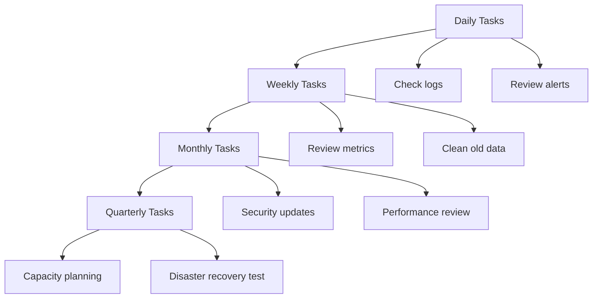

# Maintenance Procedures Runbook

## Table of Contents

- [Overview](#overview)
- [Maintenance Windows](#maintenance-windows)
- [Routine Maintenance](#routine-maintenance)
- [System Updates](#system-updates)
- [Database Maintenance](#database-maintenance)
- [Security Maintenance](#security-maintenance)
- [Performance Tuning](#performance-tuning)
- [Capacity Planning](#capacity-planning)

---

## Overview

This runbook covers routine maintenance procedures for BubbleLab deployments to ensure optimal performance, security, and reliability.

### Maintenance Schedule



---

## Maintenance Windows

### Scheduled Maintenance

**Weekly Maintenance Window:**
- **Time:** Sunday 2:00 AM - 4:00 AM UTC
- **Duration:** Up to 2 hours
- **Impact:** Potential brief interruptions
- **Notification:** 48 hours in advance

**Monthly Maintenance Window:**
- **Time:** First Sunday 2:00 AM - 6:00 AM UTC
- **Duration:** Up to 4 hours
- **Impact:** Downtime expected
- **Notification:** 1 week in advance

### Maintenance Mode

**Enable Maintenance Mode:**

```bash
# Update ingress to show maintenance page
kubectl patch ingress bubblelab-ingress -n bubblelab -p '{
  "metadata": {
    "annotations": {
      "nginx.ingress.kubernetes.io/maintenance-mode": "true"
    }
  }
}'

# Or scale deployments to zero
kubectl scale deployment bubblelab-api --replicas=0 -n bubblelab
kubectl scale deployment bubble-studio --replicas=0 -n bubblelab
```

**Maintenance Page Configuration:**

```yaml
apiVersion: v1
kind: ConfigMap
metadata:
  name: maintenance-page
  namespace: bubblelab
data:
  maintenance.html: |
    <!DOCTYPE html>
    <html>
    <head>
      <title>Scheduled Maintenance</title>
      <style>
        body {
          font-family: Arial, sans-serif;
          display: flex;
          justify-content: center;
          align-items: center;
          height: 100vh;
          background: #f5f5f5;
        }
        .container {
          text-align: center;
          padding: 40px;
          background: white;
          border-radius: 8px;
          box-shadow: 0 2px 10px rgba(0,0,0,0.1);
        }
      </style>
    </head>
    <body>
      <div class="container">
        <h1>🔧 Scheduled Maintenance</h1>
        <p>We're currently performing scheduled maintenance.</p>
        <p>Expected completion: [Time]</p>
        <p>We apologize for any inconvenience.</p>
      </div>
    </body>
    </html>
```

---

## Routine Maintenance

### Daily Tasks

**1. Review Logs (5 minutes)**

```bash
# Check for errors
kubectl logs -n bubblelab deployment/bubblelab-api --since=6h | grep ERROR

# Check for warnings
kubectl logs -n bubblelab deployment/bubblelab-api --since=6h | grep WARN

# Check authentication logs
kubectl logs -n bubblelab deployment/bubblelab-api --since=6h | grep -i "auth"
```

**2. Review Alerts (5 minutes)**

```bash
# Check Prometheus alerts
curl http://prometheus:9090/api/v1/alerts | jq '.data.alerts[] | select(.state=="firing")'

# Check Grafana dashboards
# Visit: https://grafana.bubblelab.ai
```

**3. Check Resource Usage (5 minutes)**

```bash
# Pod resource usage
kubectl top pods -n bubblelab

# Node resource usage
kubectl top nodes

# Persistent volume usage
kubectl get pvc -n bubblelab
```

**4. Verify Backups (5 minutes)**

```bash
# Check latest backup
aws s3 ls s3://bubblelab-backups/database/ | sort -r | head -1

# Verify backup integrity
aws s3 cp s3://bubblelab-backups/database/latest.sql.gz - | gunzip | head
```

### Weekly Tasks

**1. Review Performance Metrics (30 minutes)**

```bash
# Check response times
# Grafana Dashboard: API Performance

# Check error rates
# Grafana Dashboard: Error Tracking

# Check database performance
kubectl exec -it postgres-0 -n bubblelab -- psql -c "
SELECT query, mean_exec_time, calls
FROM pg_stat_statements
ORDER BY mean_exec_time DESC
LIMIT 20;
"
```

**2. Clean Old Data (15 minutes)**

```bash
# Clean old execution logs (older than 90 days)
kubectl exec -it postgres-0 -n bubblelab -- psql -d bubblelab -c "
DELETE FROM execution_logs
WHERE created_at < NOW() - INTERVAL '90 days';
"

# Clean old audit logs (older than 180 days)
kubectl exec -it postgres-0 -n bubblelab -- psql -d bubblelab -c "
DELETE FROM audit_logs
WHERE timestamp < NOW() - INTERVAL '180 days';
"

# Vacuum database
kubectl exec -it postgres-0 -n bubblelab -- vacuumdb -U postgres -d bubblelab --analyze --verbose
"
```

**3. Review Security Logs (20 minutes)**

```bash
# Check for failed login attempts
kubectl logs -n bubblelab deployment/bubblelab-api --since=168h | grep -i "failed login"

# Check for unauthorized access attempts
kubectl logs -n bubblelab deployment/bubblelab-api --since=168h | grep -i "unauthorized"

# Review access patterns
kubectl exec -it postgres-0 -n bubblelab -- psql -d bubblelab -c "
SELECT user_id, COUNT(*) as access_count
FROM audit_logs
WHERE timestamp > NOW() - INTERVAL '7 days'
GROUP BY user_id
ORDER BY access_count DESC
LIMIT 20;
"
```

**4. Update Documentation (15 minutes)**

- Document any changes made during the week
- Update runbooks if procedures changed
- Review and update incident reports

---

## System Updates

### Application Updates

**Update Procedure:**

```bash
# 1. Enable maintenance mode (if required)
kubectl scale deployment bubblelab-api --replicas=0 -n bubblelab

# 2. Backup current version
kubectl get deployment bubblelab-api -n bubblelab -o yaml > bubblelab-api-backup.yaml

# 3. Update image
kubectl set image deployment/bubblelab-api \
  bubblelab-api=bubblelab/api:v1.2.3 \
  -n bubblelab

# 4. Watch rollout
kubectl rollout status deployment/bubblelab-api -n bubblelab

# 5. Verify health
kubectl get pods -n bubblelab
curl https://api.bubblelab.ai/health

# 6. If issues, rollback
kubectl rollout undo deployment/bubblelab-api -n bubblelab
```

**Rolling Update:**

```bash
# Rolling update with zero downtime
kubectl set image deployment/bubblelab-api \
  bubblelab-api=bubblelab/api:v1.2.3 \
  -n bubblelab \
  --record=true

# Monitor rollout
kubectl rollout status deployment/bubblelab-api -n bubblelab
kubectl logs -f -l app=bubblelab-api -n bubblelab
```

### Dependency Updates

**Security Updates:**

```bash
# Check for vulnerabilities
pnpm audit

# Fix vulnerabilities
pnpm audit fix

# Rebuild and test
pnpm build
pnpm test

# Deploy if tests pass
kubectl set image deployment/bubblelab-api bubblelab-api=bubblelab/api:latest
```

### Platform Updates

**Kubernetes Version Upgrade:**

```bash
# Check current version
kubectl version

# Plan upgrade
kubectl get nodes
kubectl drain node1 --ignore-daemonsets --delete-emptydir-data

# Upgrade node (follow cloud provider documentation)
# ...

# Uncordon node
kubectl uncordon node1

# Verify workloads
kubectl get pods -o wide
```

---

## Database Maintenance

### Weekly Vacuum

```bash
# Vacuum and analyze
kubectl exec -it postgres-0 -n bubblelab -- vacuumdb -U postgres -d bubblelab --analyze --verbose

# Check for bloat
kubectl exec -it postgres-0 -n bubblelab -- psql -d bubblelab -c "
SELECT
  schemaname,
  tablename,
  pg_size_pretty(pg_total_relation_size(schemaname||'.'||tablename)) AS size
FROM pg_tables
WHERE schemaname = 'public'
ORDER BY pg_total_relation_size(schemaname||'.'||tablename) DESC;
"
```

### Index Maintenance

```sql
-- Check index usage
SELECT
  schemaname,
  tablename,
  indexname,
  idx_scan,
  idx_tup_read,
  idx_tup_fetch
FROM pg_stat_user_indexes
ORDER BY idx_scan ASC
LIMIT 20;

-- Reindex if needed
REINDEX TABLE bubble_flows;
REINDEX INDEX idx_user_email;
```

### Statistics Update

```bash
# Update table statistics
kubectl exec -it postgres-0 -n bubblelab -- psql -d bubblelab -c "
ANALYZE users;
ANALYZE bubble_flows;
ANALYZE executions;
ANALYZE audit_logs;
"
```

---

## Security Maintenance

### Weekly Security Tasks

**1. Review Access Controls (15 minutes)**

```sql
-- Review user permissions
SELECT
  u.email,
  u.role,
  COUNT(DISTINCT al.action) as action_count
FROM users u
LEFT JOIN audit_logs al ON u.id = al.user_id
WHERE al.timestamp > NOW() - INTERVAL '7 days'
GROUP BY u.id, u.email, u.role
ORDER BY action_count DESC;
```

**2. Rotate API Keys (if needed)**

```bash
# Generate new keys
# Update in secrets
kubectl create secret generic bubblelab-secrets \
  --from-literal=google-api-key=new_key \
  --from-literal=openrouter-api-key=new_key \
  --dry-run=client -o yaml | kubectl apply -f -
```

**3. Review Security Policies (20 minutes)**

- Check firewall rules
- Review network policies
- Verify RBAC configurations
- Check pod security policies

### Monthly Security Tasks

**1. Security Audit (1-2 hours)**

```bash
# Run security scanner
# Example: Trivy
trivy image bubblelab/api:latest

# Check for vulnerabilities
kubectl exec -it <pod-name> -- npm audit

# Review security group rules
# (Cloud provider specific)
```

**2. Penetration Testing**

- Schedule quarterly penetration tests
- Review and address findings
- Update security controls based on results

---

## Performance Tuning

### Database Tuning

**Configuration Review:**

```bash
# Review PostgreSQL settings
kubectl exec -it postgres-0 -n bubblelab -- psql -c "SHOW ALL;" > pg-settings.txt

# Check slow queries
kubectl exec -it postgres-0 -n bubblelab -- psql -d bubblelab -c "
SELECT
  query,
  mean_exec_time,
  calls,
  total_exec_time
FROM pg_stat_statements
ORDER BY mean_exec_time DESC
LIMIT 10;
"
```

**Optimization Tasks:**

```sql
-- Add missing indexes based on query patterns
CREATE INDEX CONCURRENTLY IF NOT EXISTS idx_workflow_user_updated
ON bubble_flows(user_id, updated_at DESC);

-- Update statistics
ANALYZE;

-- Reindex fragmented indexes
REINDEX DATABASE CONCURRENTLY bubblelab;
```

### Application Tuning

**Connection Pooling:**

```bash
# Review connection pool settings
# Update in application configuration

# Monitor connection usage
kubectl exec -it postgres-0 -n bubblelab -- psql -c "
SELECT count(*) FROM pg_stat_activity;
"
```

**Caching Strategy:**

```bash
# Review cache hit rates
kubectl exec -it redis-0 -n bubblelab -- redis-cli INFO stats | grep keyspace

# Adjust cache size if needed
kubectl exec -it redis-0 -n bubblelab -- redis-cli CONFIG SET maxmemory 2gb
```

---

## Capacity Planning

### Monthly Capacity Review

**Current Usage Analysis:**

```bash
# Review resource usage trends
kubectl top pods -n bubblelab --use-protocol-buffers

# Check storage growth
kubectl get pvc -n bubblelab

# Review database growth
kubectl exec -it postgres-0 -n bubblelab -- psql -d bubblelab -c "
SELECT
  pg_size_pretty(pg_database_size('bubblelab')) as db_size;
"
```

**Growth Projection:**

```sql
-- Project 6-month growth
SELECT
  pg_size_pretty(pg_database_size('bubblelab')) as current_size,
  pg_size_pretty(pg_database_size('bubblelab') * 1.5) as projected_6mo
FROM pg_database
WHERE datname = 'bubblelab';
```

### Scaling Planning

**Horizontal Scaling:**

```bash
# Review current replica counts
kubectl get deployment -n bubblelab

# Plan based on usage trends
# Update HPA settings if needed
kubectl edit hpa bubblelab-api-hpa -n bubblelab
```

**Vertical Scaling:**

```bash
# Review resource limits
kubectl describe deployment bubblelab-api -n bubblelab | grep -A 10 Resources

# Plan resource increases
# Update deployment specifications
```

### Cost Optimization

**Review Cloud Costs:**

```bash
# Review current resource allocation
kubectl get all -n bubblelab -o wide

# Identify underutilized resources
kubectl top pods -n bubblelab

# Optimize based on actual usage
# Adjust resource requests and limits
```

---

## Maintenance Checklist

### Daily
- [ ] Review logs for errors
- [ ] Check active alerts
- [ ] Verify resource usage
- [ ] Confirm backups completed

### Weekly
- [ ] Review performance metrics
- [ ] Clean old data
- [ ] Review security logs
- [ ] Update documentation
- [ ] Vacuum database

### Monthly
- [ ] Security audit
- [ ] Performance review
- [ ] Capacity planning
- [ ] Dependency updates
- [ ] Backup testing

### Quarterly
- [ ] Disaster recovery test
- [ ] Security assessment
- [ ] Architecture review
- [ ] Cost optimization review
- [ ] Major version upgrades

---

## Related Documentation

- [backup-recovery.md](./backup-recovery.md) - Backup procedures
- [monitoring.md](./monitoring.md) - Monitoring setup
- [scaling.md](./scaling.md) - Scaling procedures
- [deployment.md](./deployment.md) - Deployment procedures

---

*Last Updated: January 2026*
