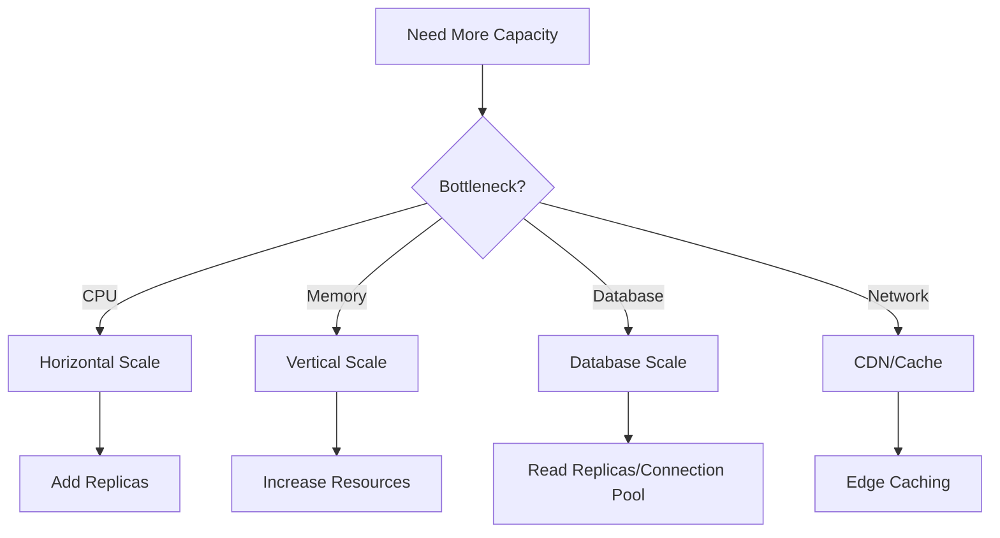
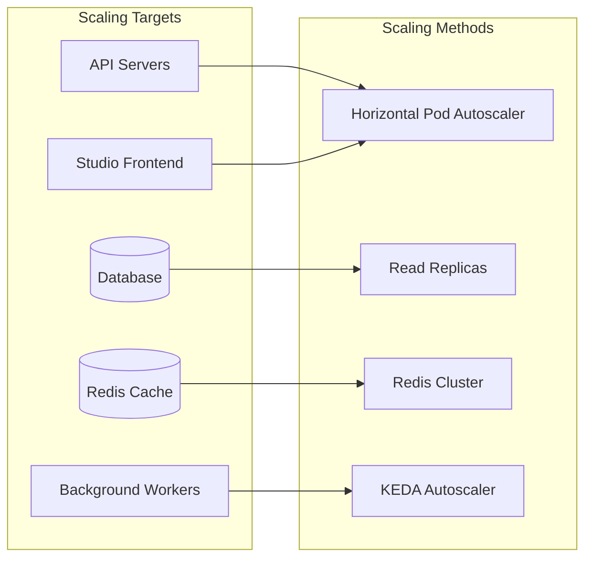
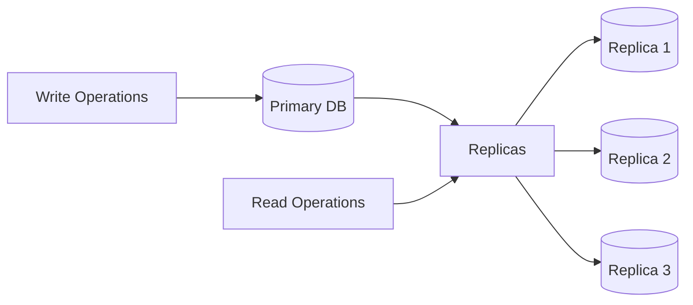

# Scaling Runbook

## Table of Contents

- [Overview](#overview)
- [Scaling Strategies](#scaling-strategies)
- [Vertical Scaling](#vertical-scaling)
- [Horizontal Scaling](#horizontal-scaling)
- [Database Scaling](#database-scaling)
- [Auto-Scaling Configuration](#auto-scaling-configuration)
- [Performance Testing](#performance-testing)

---

## Overview

This runbook covers scaling procedures for BubbleLab deployments, including vertical and horizontal scaling approaches, database scaling strategies, and auto-configuration.

### Scaling Decision Tree



---

## Scaling Strategies

### Horizontal Scaling vs Vertical Scaling

| Aspect | Horizontal Scaling | Vertical Scaling |
|--------|-------------------|------------------|
| **Cost** | Lower (commodity hardware) | Higher (specialized hardware) |
| **Complexity** | Higher (load balancing, data consistency) | Lower (single instance) |
| **Fault Tolerance** | Better (redundancy) | Limited (SPOF) |
| **Scalability Limit** | Theoretically unlimited | Hardware constraints |
| **Use Case** | Stateless applications | Stateful applications, databases |

### Scaling Targets



---

## Vertical Scaling

### When to Use Vertical Scaling

- Memory-intensive workloads
- Single-threaded applications
- Development/testing environments
- Small-scale deployments

### Resource Limit Updates

```bash
# Edit deployment directly
kubectl edit deployment bubblelab-api -n bubblelab

# Or patch specific resources
kubectl patch deployment bubblelab-api -n bubblelab -p '{
  "spec": {
    "template": {
      "spec": {
        "containers": [{
          "name": "bubblelab-api",
          "resources": {
            "requests": {
              "memory": "2Gi",
              "cpu": "1000m"
            },
            "limits": {
              "memory": "4Gi",
              "cpu": "2000m"
            }
          }
        }]
      }
    }
  }
}'
```

### Resource Profiles

**Development:**
```yaml
resources:
  requests:
    memory: "256Mi"
    cpu: "100m"
  limits:
    memory: "512Mi"
    cpu: "250m"
```

**Staging:**
```yaml
resources:
  requests:
    memory: "512Mi"
    cpu: "250m"
  limits:
    memory: "1Gi"
    cpu: "500m"
```

**Production (Small):**
```yaml
resources:
  requests:
    memory: "1Gi"
    cpu: "500m"
  limits:
    memory: "2Gi"
    cpu: "1000m"
```

**Production (Large):**
```yaml
resources:
  requests:
    memory: "2Gi"
    cpu: "1000m"
  limits:
    memory: "4Gi"
    cpu: "2000m"
```

### Database Vertical Scaling

```bash
# Update PostgreSQL configuration
kubectl edit configmap postgres-config -n bubblelab

# Key parameters:
shared_buffers = 2GB          # 25% of RAM
effective_cache_size = 6GB    # 50-75% of RAM
maintenance_work_mem = 512MB
work_mem = 16MB
max_connections = 200

# Restart database
kubectl rollout restart statefulset/postgres -n bubblelab
```

---

## Horizontal Scaling

### Manual Scaling

```bash
# Scale to 5 replicas
kubectl scale deployment bubblelab-api --replicas=5 -n bubblelab

# Scale frontend
kubectl scale deployment bubble-studio --replicas=3 -n bubblelab

# Verify scaling
kubectl get pods -n bubblelab
kubectl get deployment bubblelab-api -n bubblelab
```

### Horizontal Pod Autoscaler (HPA)

**Create HPA:**

```bash
# API HPA based on CPU
kubectl autoscale deployment bubblelab-api \
  --cpu-percent=70 \
  --min=3 \
  --max=10 \
  -n bubblelab

# API HPA based on memory
kubectl autoscale deployment bubblelab-api \
  --type=Resource \
  --resource-name=memory \
  --resource-percent=80 \
  --min=3 \
  --max=10 \
  -n bubblelab

# Studio HPA
kubectl autoscale deployment bubble-studio \
  --cpu-percent=70 \
  --min=2 \
  --max=6 \
  -n bubblelab
```

**HPA YAML Manifest:**

```yaml
apiVersion: autoscaling/v2
kind: HorizontalPodAutoscaler
metadata:
  name: bubblelab-api-hpa
  namespace: bubblelab
spec:
  scaleTargetRef:
    apiVersion: apps/v1
    kind: Deployment
    name: bubblelab-api
  minReplicas: 3
  maxReplicas: 10
  metrics:
  - type: Resource
    resource:
      name: cpu
      target:
        type: Utilization
        averageUtilization: 70
  - type: Resource
    resource:
      name: memory
      target:
        type: Utilization
        averageUtilization: 80
  behavior:
    scaleDown:
      stabilizationWindowSeconds: 300
      policies:
      - type: Percent
        value: 50
        periodSeconds: 60
    scaleUp:
      stabilizationWindowSeconds: 0
      policies:
      - type: Percent
        value: 100
        periodSeconds: 30
      - type: Pods
        value: 2
        periodSeconds: 30
      selectPolicy: Max
```

**Check HPA Status:**

```bash
# List HPAs
kubectl get hpa -n bubblelab

# Describe HPA
kubectl describe hpa bubblelab-api-hpa -n bubblelab

# Watch HPA in real-time
watch kubectl get hpa -n bubblelab
```

---

## Database Scaling

### Read Replicas

**Architecture:**



**Implementation:**

```yaml
# StatefulSet for Primary
apiVersion: apps/v1
kind: StatefulSet
metadata:
  name: postgres-primary
  namespace: bubblelab
spec:
  replicas: 1
  serviceName: postgres-primary
  selector:
    matchLabels:
      app: postgres
      role: primary
  template:
    metadata:
      labels:
        app: postgres
        role: primary
    spec:
      containers:
      - name: postgres
        image: postgres:14-alpine
        env:
        - name: POSTGRES_REPLICATION_MODE
          value: "primary"
        - name: POSTGRES_REPLICATION_USER
          value: "replicator"
        - name: POSTGRES_REPLICATION_PASSWORD
          valueFrom:
            secretKeyRef:
              name: postgres-secrets
              key: replication-password
        ports:
        - containerPort: 5432
        volumeMounts:
        - name: postgres-data
          mountPath: /var/lib/postgresql/data
  volumeClaimTemplates:
  - metadata:
      name: postgres-data
    spec:
      accessModes: ["ReadWriteOnce"]
      resources:
        requests:
          storage: 100Gi

---
# StatefulSet for Replicas
apiVersion: apps/v1
kind: StatefulSet
metadata:
  name: postgres-replica
  namespace: bubblelab
spec:
  replicas: 2
  serviceName: postgres-replica
  selector:
    matchLabels:
      app: postgres
      role: replica
  template:
    metadata:
      labels:
        app: postgres
        role: replica
    spec:
      containers:
      - name: postgres
        image: postgres:14-alpine
        env:
        - name: POSTGRES_REPLICATION_MODE
          value: "replica"
        - name: POSTGRES_PRIMARY_HOST
          value: "postgres-primary-0.postgres-primary"
        - name: POSTGRES_REPLICATION_USER
          value: "replicator"
        - name: POSTGRES_REPLICATION_PASSWORD
          valueFrom:
            secretKeyRef:
              name: postgres-secrets
              key: replication-password
        ports:
        - containerPort: 5432
```

**Application Configuration:**

```typescript
// Configure read/write splitting
const dataSource = {
  write: {
    host: process.env.DB_PRIMARY_HOST,
    port: 5432,
    database: 'bubblelab',
    user: 'app_user',
    password: process.env.DB_PASSWORD,
  },
  read: {
    hosts: [
      process.env.DB_REPLICA1_HOST,
      process.env.DB_REPLICA2_HOST,
    ],
    port: 5432,
    database: 'bubblelab',
    user: 'app_user',
    password: process.env.DB_PASSWORD,
  }
};

// Use write for transactions, read for queries
async function query(sql, params) {
  const pool = sql.startsWith('SELECT') ? readPool : writePool;
  return pool.query(sql, params);
}
```

### Connection Pooling

**PgBouncer Configuration:**

```yaml
apiVersion: apps/v1
kind: Deployment
metadata:
  name: pgbouncer
  namespace: bubblelab
spec:
  replicas: 2
  selector:
    matchLabels:
      app: pgbouncer
  template:
    metadata:
      labels:
        app: pgbouncer
    spec:
      containers:
      - name: pgbouncer
        image: edoburu/pgbouncer:latest
        env:
        - name: DATABASES_HOST
          value: "postgres-primary-0.postgres-primary"
        - name: DATABASES_PORT
          value: "5432"
        - name: DATABASES_USER
          value: "app_user"
        - name: DATABASES_PASSWORD
          valueFrom:
            secretKeyRef:
              name: postgres-secrets
              key: app-password
        - name: DATABASES_DBNAME
          value: "bubblelab"
        - name: POOL_MODE
          value: "transaction"
        - name: MAX_CLIENT_CONN
          value: "1000"
        - name: DEFAULT_POOL_SIZE
          value: "50"
        ports:
        - containerPort: 5432
```

---

## Auto-Scaling Configuration

### Cluster Autoscaler

```bash
# Enable cluster autoscaler on AWS EKS
eksctl utils update-cluster-logging \
  --region=us-east-1 \
  --cluster=bubblelab \
  --retain-types=api,audit,authenticator,controllerManager,scheduler

# Create node groups with auto-scaling
eksctl create nodegroup \
  --cluster=bubblelab \
  --region=us-east-1 \
  --name=ng-api \
  --node-type=m5.large \
  --nodes=3 \
  --nodes-min=3 \
  --nodes-max=10 \
  --auto-scaling
```

### KEDA for Event-Driven Scaling

```yaml
apiVersion: keda.sh/v1alpha1
kind: ScaledObject
metadata:
  name: bubblelab-worker-scaler
  namespace: bubblelab
spec:
  scaleTargetRef:
    name: bubblelab-worker
  minReplicaCount: 1
  maxReplicaCount: 10
  triggers:
  - type: redis
    metadata:
      address: redis:6379
      listName: workflow-jobs
      listLength: '5'
      activationListLength: '3'
```

---

## Performance Testing

### Load Testing with Artillery

**Test Configuration:**

```yaml
# load-test.yml
config:
  target: "https://api.bubblelab.ai"
  phases:
    - duration: 60
      arrivalRate: 10
      name: "Warm up"
    - duration: 120
      arrivalRate: 50
      name: "Ramp up to 50 RPS"
    - duration: 300
      arrivalRate: 100
      name: "Sustained load at 100 RPS"
    - duration: 60
      arrivalRate: 200
      name: "Spike test at 200 RPS"
  processor: "./load-test-processor.js"
scenarios:
  - name: "Health Check"
    flow:
      - get:
          url: "/health"
  - name: "Execute Workflow"
    flow:
      - post:
          url: "/api/execute"
          json:
            flowId: "test-flow-id"
            payload:
              test: true
```

**Run Load Test:**

```bash
# Install artillery
npm install -g artillery

# Run load test
artillery run load-test.yml

# Run with reporting
artillery run load-test.yml --output report.json

# Generate HTML report
artillery report report.json --output report.html
```

### Benchmarking

```bash
# API benchmarking
wrk -t12 -c400 -d30s https://api.bubblelab.ai/health

# Database benchmarking
kubectl exec -it postgres-0 -n bubblelab -- pgbench -c 10 -j 2 -t 1000 bubblelab
```

---

## Scaling Checklist

### Pre-Scaling Preparation

- [ ] Baseline metrics established
- [ ] Auto-scaling configured
- [ ] Monitoring dashboards ready
- [ ] Load testing completed
- [ ] Database scaling planned
- [ ] Cost estimates calculated

### During Scaling

- [ ] Monitor resource usage
- [ ] Check error rates
- [ ] Verify response times
- [ ] Validate data consistency
- [ ] Check autoscaler logs

### Post-Scaling Verification

- [ ] All services healthy
- [ ] Performance improved
- [ ] No errors or timeouts
- [ ] Database performance OK
- [ ] Costs within budget
- [ ] Update documentation

---

## Related Documentation

- [deployment.md](./deployment.md) - Deployment procedures
- [monitoring.md](./monitoring.md) - Monitoring and metrics
- [troubleshooting.md](./troubleshooting.md) - Performance troubleshooting

---

*Last Updated: January 2026*
