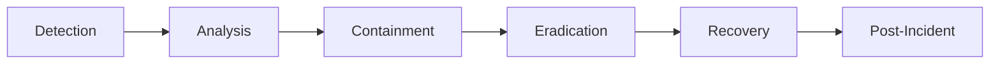

# Security Incident Response Runbook

## Table of Contents

- [Overview](#overview)
- [Incident Classification](#incident-classification)
- [Response Team](#response-team)
- [Detection and Reporting](#detection-and-reporting)
- [Initial Response](#initial-response)
- [Investigation](#investigation)
- [Containment](#containment)
- [Eradication](#eradication)
- [Recovery](#recovery)
- [Post-Incident Activities](#post-incident-activities)

---

## Overview

This runbook provides procedures for responding to security incidents in BubbleLab deployments, including detection, containment, eradication, and recovery.

### Incident Response Lifecycle



---

## Incident Classification

### Severity Levels

**SEVERITY 1 - CRITICAL**

- Complete service outage due to security breach
- Data breach exposing sensitive user data
- Ransomware or malware infection
- Unauthorized access to production systems

**Response Time:** < 15 minutes

**SEVERITY 2 - HIGH**

- Significant unauthorized access attempt
- Data exfiltration in progress
- DoS attack affecting services
- Compromise of user accounts

**Response Time:** < 1 hour

**SEVERITY 3 - MEDIUM**

- Suspicious activity detected
- Minor data exposure
- Brute force login attempts
- Vulnerability exploitation attempt

**Response Time:** < 4 hours

**SEVERITY 4 - LOW**

- Policy violations
- Minor security misconfigurations
- Information disclosure (non-sensitive)
- Failed login attempts

**Response Time:** < 24 hours

---

## Response Team

### Roles and Responsibilities

**Incident Commander (IC)**
- Overall coordination
- Decision-making authority
- Communication with stakeholders

**Technical Lead**
- Technical investigation
- Forensic analysis
- System recovery

**Communications Lead**
- External communications
- User notifications
- Press inquiries

**Legal Counsel**
- Legal compliance
- Regulatory requirements
- Data breach notifications

**HR (if applicable)**
- Employee matters
- Internal communications

---

## Detection and Reporting

### Detection Methods

**Automated Monitoring:**

```bash
# Security monitoring alerts
- Failed login spikes
- Unusual API usage patterns
- Data export anomalies
- Unauthorized access attempts
- Malware detection
- Intrusion detection system (IDS) alerts
- Web application firewall (WAF) triggers
```

**Manual Detection:**

```bash
# Review logs for suspicious activity
kubectl logs -n bubblelab deployment/bubblelab-api | grep -i "unauthorized\|forbidden\|attack"

# Check for unusual data access
kubectl exec -it postgres-0 -n bubblelab -- psql -d bubblelab -c "
SELECT user_id, COUNT(*) as access_count
FROM audit_logs
WHERE timestamp > NOW() - INTERVAL '1 hour'
GROUP BY user_id
HAVING COUNT(*) > 1000
ORDER BY access_count DESC;
"

# Check for data export
kubectl logs -n bubblelab deployment/bubblelab-api | grep "export\|download"
```

### Incident Reporting

**Report Template:**

```markdown
## Security Incident Report

**Date/Time:** [Timestamp]
**Reporter:** [Name/Role]
**Severity:** [CRITICAL/HIGH/MEDIUM/LOW]

### Summary
[Brief description of the incident]

### Affected Systems
- [List affected systems/services]

### Initial Impact
- [Data affected]
- [Users affected]
- [Services affected]

### Initial Actions Taken
- [Actions already performed]

### Evidence
- [Links to logs/screenshots]
```

---

## Initial Response

### Immediate Actions (First 15 Minutes)

**1. Activate Incident Response Team**

```bash
# Page on-call engineer
# Send alert to #security-incidents Slack channel
# Email incident response team
```

**2. Initial Assessment**

```bash
# Verify incident
kubectl get pods -n bubblelab
kubectl top pods -n bubblelab
kubectl logs -f deployment/bubblelab-api -n bubblelab | tail -100

# Check for active connections
kubectl exec -it postgres-0 -n bubblelab -- psql -c "
SELECT count(*) FROM pg_stat_activity;
"
```

**3. Preserve Evidence**

```bash
# Create evidence snapshot
kubectl logs -n bubblelab --all-containers=true > /tmp/security-incident-$(date +%Y%m%d-%H%M%S).log

# Snapshot current state
kubectl get all -n bubblelab -o yaml > /tmp/state-$(date +%Y%m%d-%H%M%S).yaml

# Database snapshot
kubectl exec -it postgres-0 -n bubblelab -- pg_dump -U postgres bubblelab > /tmp/db-snapshot-$(date +%Y%m%d-%H%M%S).sql
```

**4. Initial Containment**

```bash
# If confirmed attack, isolate affected systems
kubectl scale deployment bubblelab-api --replicas=0 -n bubblelab

# Enable maintenance mode
# Update ingress to return 503
```

---

## Investigation

### Evidence Collection

**System Logs:**

```bash
# Collect API logs
kubectl logs deployment/bubblelab-api -n bubblelab --since=24h > api-24h.log

# Collect authentication logs
kubectl logs deployment/bubblelab-api -n bubblelab | grep "auth\|login" > auth.log

# Collect audit logs
kubectl exec -it postgres-0 -n bubblelab -- psql -d bubblelab -c "
SELECT * FROM audit_logs
WHERE timestamp > NOW() - INTERVAL '24 hours'
ORDER BY timestamp DESC
" > audit-24h.log
```

**Network Analysis:**

```bash
# Check network traffic
kubectl top pods -n bubblelab

# Check for unusual connections
kubectl exec -it <pod-name> -n bubblelab -- netstat -antp

# Check DNS queries
kubectl exec -it <pod-name> -n bubblelab -- cat /etc/resolv.conf
```

**User Activity:**

```sql
-- Suspicious user activity
SELECT
    user_id,
    COUNT(*) as request_count,
    MIN(timestamp) as first_seen,
    MAX(timestamp) as last_seen,
    COUNT(DISTINCT ip_address) as unique_ips
FROM audit_logs
WHERE timestamp > NOW() - INTERVAL '24 hours'
GROUP BY user_id
HAVING COUNT(*) > 1000 OR COUNT(DISTINCT ip_address) > 10
ORDER BY request_count DESC;
```

### Forensic Analysis

**Malware Detection:**

```bash
# Scan containers
kubectl exec -it <pod-name> -n bubblelab -- clamscan -r /app

# Check for modified files
kubectl exec -it <pod-name> -n bubblelab -- find /app -type f -mtime -1
```

**Data Exfiltration Check:**

```sql
-- Check for large data exports
SELECT
    user_id,
    action,
    COUNT(*) as export_count,
    SUM(data_size) as total_size
FROM audit_logs
WHERE action IN ('export', 'download', 'backup')
  AND timestamp > NOW() - INTERVAL '24 hours'
GROUP BY user_id, action
HAVING SUM(data_size) > 1024 * 1024 * 100  -- 100MB
ORDER BY total_size DESC;
```

---

## Containment

### Short-Term Containment

**Isolate Affected Systems:**

```bash
# Scale down affected deployments
kubectl scale deployment bubblelab-api --replicas=0 -n bubblelab
kubectl scale deployment bubble-studio --replicas=0 -n bubblelab

# Network isolation
kubectl networkpolicy deny-all -n bubblelab
```

**Disable Compromised Accounts:**

```sql
-- Disable user accounts
UPDATE users
SET is_disabled = true, disabled_at = NOW()
WHERE id IN (SELECT DISTINCT user_id FROM suspicious_activity);

-- Revoke all sessions
DELETE FROM sessions WHERE user_id IN (...);
```

**Block Malicious IPs:**

```yaml
# Add IP blocklist to ingress
apiVersion: networking.k8s.io/v1
kind: Ingress
metadata:
  name: bubblelab-ingress
  annotations:
    nginx.ingress.kubernetes.io/whitelist-source-range: "10.0.0.0/8,192.168.0.0/16"
    nginx.ingress.kubernetes.io/denylist: "1.2.3.4,5.6.7.8"
```

### Long-Term Containment

**Implement Additional Security Controls:**

- Enable rate limiting
- Add MFA requirement
- Restrict API access
- Implement IP whitelisting
- Enable CAPTCHA on login
- Review and update firewall rules

---

## Eradication

### Remove Malicious Code

**Scan and Remove:**

```bash
# Scan for malware
kubectl exec -it <pod-name> -n bubblelab -- clamscan -r --remove /app

# Verify clean state
kubectl exec -it <pod-name> -n bubblelab -- find /app -type f -name "*.sh" -o -name "*.exe"

# Rebuild clean images
docker build -t bubblelab/api:clean .
kubectl set image deployment/bubblelab-api bubblelab-api=bubblelab/api:clean -n bubblelab
```

### Patch Vulnerabilities

**Update Dependencies:**

```bash
# Check for vulnerabilities
npm audit
pnpm audit

# Update vulnerable packages
pnpm update

# Rebuild and deploy
pnpm build
kubectl set image deployment/bubblelab-api bubblelab-api=bubblelab/api:latest -n bubblelab
```

### Close Attack Vectors

**Fix Security Issues:**

- Update firewall rules
- Close open ports
- Patch software vulnerabilities
- Update encryption keys
- Rotate credentials
- Review access controls

---

## Recovery

### Restore Services

**Clean Deployment:**

```bash
# Deploy clean version
kubectl apply -f k8s/production/

# Verify clean state
kubectl get pods -n bubblelab
kubectl logs -f deployment/bubblelab-api -n bubblelab

# Health checks
curl https://api.bubblelab.ai/health
```

**Data Recovery:**

```bash
# If data was corrupted, restore from backup
aws s3 cp s3://bubblelab-backups/database/clean-backup.sql.gz - | \
  gunzip | \
  kubectl exec -i postgres-0 -n bubblelab -- psql -U postgres -d bubblelab

# Verify data integrity
kubectl exec -it postgres-0 -n bubblelab -- psql -d bubblelab -c "
SELECT COUNT(*) FROM users;
SELECT COUNT(*) FROM bubble_flows;
"
```

### Monitor for Recurrence

**Enhanced Monitoring:**

```bash
# Add security monitoring
kubectl apply -f monitoring/security-alerts.yml

# Review logs regularly
kubectl logs -f deployment/bubblelab-api -n bubblelab | grep -i "attack\|malicious\|unauthorized"

# Set up automated alerts
# Configure Prometheus alerts for suspicious patterns
```

---

## Post-Incident Activities

### Documentation

**Incident Report:**

```markdown
# Security Incident Report

## Executive Summary
[High-level overview for management]

## Timeline
- [Time] Incident detected
- [Time] Response team activated
- [Time] Initial containment
- [Time] Investigation completed
- [Time] Systems recovered

## Impact Assessment
- Data affected: [Type and volume]
- Users affected: [Number]
- Services affected: [List]
- Downtime: [Duration]

## Root Cause Analysis
[Detailed explanation of what happened and why]

## Lessons Learned
[What went well, what didn't]

## Action Items
- [ ] [Specific improvements]
- [ ] [Process changes]
- [ ] [Tooling updates]

## Recommendations
[Long-term security improvements]
```

### Communication

**Internal Communication:**

```bash
# Notify engineering team
# Post update in #security-incidents
# Schedule post-mortem meeting
```

**External Communication (if required):**

- User notifications
- Regulatory filings (if applicable)
- Press statements (if public)
- Security advisories

### Prevention

**Security Improvements:**

```bash
# Conduct security audit
# Implement additional monitoring
# Update security policies
# Conduct penetration testing
# Provide security training
```

---

## Emergency Contacts

| Role | Name | Contact |
|------|------|---------|
| Incident Commander | [Name] | [Phone/Slack] |
| Technical Lead | [Name] | [Phone/Slack] |
| Security Team | security@bubblelab.ai | Slack #security |
| Legal Counsel | [Name] | [Phone/Email] |
| Executive Team | [Name] | [Phone/Email] |

---

## Related Documentation

- [troubleshooting.md](./troubleshooting.md) - General troubleshooting
- [monitoring.md](./monitoring.md) - Security monitoring setup
- [maintenance.md](./maintenance.md) - Security maintenance procedures

---

*Last Updated: January 2026*
