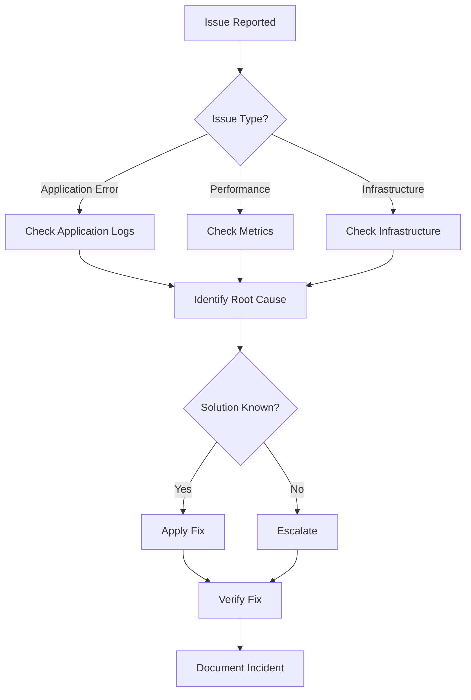

# Troubleshooting Runbook

## Table of Contents

- [Overview](#overview)
- [Diagnostic Tools](#diagnostic-tools)
- [Common Issues](#common-issues)
- [Service-Specific Issues](#service-specific-issues)
- [Performance Issues](#performance-issues)
- [Security Issues](#security-issues)
- [Emergency Procedures](#emergency-procedures)

---

## Overview

This runbook provides systematic approaches to diagnosing and resolving common issues in BubbleLab deployments. It covers troubleshooting procedures for all components and includes diagnostic commands and solutions.

### Troubleshooting Workflow



---

## Diagnostic Tools

### Logging Commands

```bash
# View all logs
kubectl logs -f -n bubblelab --all-containers=true

# View specific pod logs
kubectl logs -f deployment/bubblelab-api -n bubblelab

# View logs from all replicas
kubectl logs -f -l app=bubblelab-api -n bubblelab --max-log-requests=10

# View logs from specific time range
kubectl logs --since-time=2026-01-18T10:00:00Z -n bubblelab deployment/bubblelab-api

# View previous container logs (if crashed)
kubectl logs --previous -n bubblelab deployment/bubblelab-api

# View logs with specific patterns
kubectl logs -n bubblelab deployment/bubblelab-api | grep ERROR

# Docker logs
docker-compose logs -f bubblelab-api
docker-compose logs --tail=100 bubblelab-api
```

### Health Check Commands

```bash
# API Health Check
curl https://api.bubblelab.ai/health
curl -I https://api.bubblelab.ai/health

# Detailed Health Check
curl https://api.bubblelab.ai/health | jq '.'

# Database Health
kubectl exec -it postgres-0 -n bubblelab -- pg_isready

# Redis Health
kubectl exec -it redis-0 -n bubblelab -- redis-cli ping

# Pod Health
kubectl get pods -n bubblelab
kubectl describe pod <pod-name> -n bubblelab
```

### Diagnostic Queries

```sql
-- Database Connection Count
SELECT count(*) FROM pg_stat_activity WHERE datname = 'bubblelab';

-- Long-Running Queries
SELECT pid, now() - pg_stat_activity.query_start AS duration, query
FROM pg_stat_activity
WHERE (now() - pg_stat_activity.query_start) > interval '5 minutes';

-- Table Sizes
SELECT
  schemaname,
  tablename,
  pg_size_pretty(pg_total_relation_size(schemaname||'.'||tablename)) AS size
FROM pg_tables
WHERE schemaname = 'public'
ORDER BY pg_total_relation_size(schemaname||'.'||tablename) DESC;

-- Index Usage
SELECT
  schemaname,
  tablename,
  indexname,
  idx_scan,
  idx_tup_read,
  idx_tup_fetch
FROM pg_stat_user_indexes
ORDER BY idx_scan DESC;
```

---

## Common Issues

### 1. Application Won't Start

#### Symptoms
- Pod stuck in `CrashLoopBackOff`
- Container exits immediately
- 502/503 errors from load balancer

#### Diagnosis
```bash
# Check pod status
kubectl get pods -n bubblelab

# Check pod events
kubectl describe pod <pod-name> -n bubblelab

# Check logs
kubectl logs <pod-name> -n bubblelab

# Check resource usage
kubectl top pods -n bubblelab
```

#### Common Causes & Solutions

**Missing Environment Variables:**
```bash
# Check environment
kubectl exec -it <pod-name> -n bubblelab -- env | grep BUBBLE

# Solution: Add missing env vars to ConfigMap/Secret
kubectl edit configmap bubblelab-config -n bubblelab
kubectl edit secret bubblelab-secrets -n bubblelab
```

**Database Connection Failed:**
```bash
# Test database connectivity
kubectl exec -it <pod-name> -n bubblelab -- nc -zv postgres 5432

# Check DATABASE_URL
kubectl exec -it <pod-name> -n bubblelab -- echo $DATABASE_URL

# Solution: Verify database is running and credentials are correct
kubectl get pods -n bubblelab -l app=postgres
kubectl logs -f deployment/postgres -n bubblelab
```

**Port Already in Use:**
```bash
# Check what's using the port
kubectl exec -it <pod-name> -n bubblelab -- netstat -tulpn | grep :3001

# Solution: Update service to use different port or kill conflicting process
```

**Insufficient Resources:**
```bash
# Check resource limits
kubectl describe pod <pod-name> -n bubblelab | grep -A 5 Limits

# Solution: Increase resource limits
kubectl patch deployment bubblelab-api -n bubblelab -p '{"spec":{"template":{"spec":{"containers":[{"name":"bubblelab-api","resources":{"limits":{"memory":"2Gi","cpu":"1000m"}}}]}}}}'
```

---

### 2. High Memory Usage

#### Symptoms
- OOMKilled events
- Frequent pod restarts
- Memory usage approaching limits

#### Diagnosis
```bash
# Check memory usage
kubectl top pods -n bubblelab
kubectl top nodes

# Check memory limits
kubectl describe pod <pod-name> -n bubblelab | grep -A 10 Memory

# Check for memory leaks
kubectl exec -it <pod-name> -n bubblelab -- bun run heap-snapshot

# Check OOM events
kubectl get events -n bubblelab --field-selector reason=OOMKilling
```

#### Solutions

**Increase Memory Limits:**
```yaml
# Edit deployment
resources:
  requests:
    memory: "1Gi"
    cpu: "500m"
  limits:
    memory: "2Gi"
    cpu: "1000m"
```

**Optimize Memory Usage:**
```bash
# Enable memory profiling
bun --smol run src/index.ts

# Check for memory leaks
# Add heap snapshot collection in code
# Use memory profiler tools
```

**Add More Replicas:**
```bash
# Scale horizontally
kubectl scale deployment bubblelab-api --replicas=5 -n bubblelab
```

---

### 3. Slow Response Times

#### Symptoms
- High latency
- Timeout errors
- Poor user experience

#### Diagnosis
```bash
# Measure response time
time curl https://api.bubblelab.ai/health

# Check database query performance
kubectl exec -it postgres-0 -n bubblelab -- psql -d bubblelab -c "
SELECT query, mean_exec_time, calls
FROM pg_stat_statements
ORDER BY mean_exec_time DESC
LIMIT 10;
"

# Check Redis performance
kubectl exec -it redis-0 -n bubblelab -- redis-cli INFO stats

# Check for slow requests in logs
kubectl logs -n bubblelab deployment/bubblelab-api | grep "duration"
```

#### Solutions

**Add Database Indexes:**
```sql
-- Create missing indexes
CREATE INDEX idx_user_email ON users(email);
CREATE INDEX idx_workflow_user_id ON bubble_flows(user_id);
CREATE INDEX idx_execution_created_at ON executions(created_at);
```

**Enable Caching:**
```bash
# Check cache hit rate
kubectl exec -it redis-0 -n bubblelab -- redis-cli INFO stats | grep keyspace

# Enable response caching
# Configure Redis cache in API
```

**Scale Horizontally:**
```bash
# Add more replicas
kubectl scale deployment bubblelab-api --replicas=5 -n bubblelab

# Enable HPA (Horizontal Pod Autoscaler)
kubectl autoscale deployment bubblelab-api \
  --cpu-percent=70 \
  --min=3 \
  --max=10 \
  -n bubblelab
```

**Optimize Slow Queries:**
```sql
-- Analyze query plan
EXPLAIN ANALYZE SELECT * FROM bubble_flows WHERE user_id = '...';

-- Add specific indexes based on query patterns
-- Rewrite inefficient queries
-- Use connection pooling
```

---

### 4. Database Connection Issues

#### Symptoms
- "ECONNREFUSED" errors
- "Too many connections" errors
- Connection timeouts

#### Diagnosis
```bash
# Check database connectivity
kubectl exec -it <pod-name> -n bubblelab -- nc -zv postgres 5432

# Check connection count
kubectl exec -it postgres-0 -n bubblelab -- psql -c "
SELECT count(*) FROM pg_stat_activity WHERE datname = 'bubblelab';
"

# Check max connections
kubectl exec -it postgres-0 -n bubblelab -- psql -c "SHOW max_connections;"

# Check for connection leaks
kubectl exec -it postgres-0 -n bubblelab -- psql -c "
SELECT pid, usename, application_name, state, state_change
FROM pg_stat_activity
WHERE datname = 'bubblelab'
ORDER BY state_change;
"
```

#### Solutions

**Increase Max Connections:**
```yaml
# In postgresql.conf
max_connections = 200
```

**Implement Connection Pooling:**
```bash
# Use PgBouncer or similar connection pooler
# Configure pool size in application
```

**Fix Connection Leaks:**
```bash
# Ensure connections are properly closed in code
# Use connection timeout settings
# Implement connection retry logic
```

---

## Service-Specific Issues

### BubbleLab API Issues

#### 500 Internal Server Errors

**Diagnosis:**
```bash
# Check API logs
kubectl logs -f deployment/bubblelab-api -n bubblelab | grep ERROR

# Check for unhandled exceptions
kubectl logs -f deployment/bubblelab-api -n bubblelab | grep "Unhandled"

# Check database errors
kubectl logs -f deployment/bubblelab-api -n bubblelab | grep "database"
```

**Common Solutions:**
- Check database migrations
- Verify environment variables
- Check for missing dependencies
- Review recent code changes

#### Authentication Failures

**Diagnosis:**
```bash
# Check Clerk configuration
kubectl get secret bubblelab-secrets -n bubblelab -o yaml | grep clerk

# Test authentication flow
curl -X POST https://api.bubblelab.ai/auth/login \
  -H "Content-Type: application/json" \
  -d '{"email":"test@example.com","password":"password"}'
```

**Common Solutions:**
- Verify Clerk API keys
- Check JWT token validation
- Ensure CORS configuration is correct
- Verify user exists in database

#### AI Service Errors

**Diagnosis:**
```bash
# Check AI API keys
kubectl get secret bubblelab-secrets -n bubblelab -o yaml | grep API_KEY

# Test AI connectivity
curl -H "Authorization: Bearer $GOOGLE_API_KEY" \
  https://generativelanguage.googleapis.com/v1/models
```

**Common Solutions:**
- Verify API keys are valid
- Check API quota limits
- Implement retry logic
- Add fallback providers

---

### Bubble Studio Issues

#### Build Failures

**Diagnosis:**
```bash
# Check build logs
kubectl logs -f deployment/bubble-studio -n bubblelab

# Check for TypeScript errors
kubectl exec -it bubble-studio-xxxx -n bubblelab -- npm run type-check
```

**Common Solutions:**
- Clear node_modules and reinstall
- Update dependencies
- Fix TypeScript errors
- Check environment variables

#### CORS Errors

**Diagnosis:**
```bash
# Check browser console for CORS errors
# Verify API URL configuration
kubectl exec -it bubble-studio-xxxx -n bubblelab -- echo $VITE_API_URL
```

**Common Solutions:**
- Configure CORS in API
- Set correct API URL
- Use same origin or configure proxy
- Add CORS headers

---

## Performance Issues

### High CPU Usage

#### Diagnosis
```bash
# Check CPU usage
kubectl top pods -n bubblelab

# Check CPU limits
kubectl describe pod <pod-name> -n bubblelab | grep -A 5 CPU

# Profile CPU usage
kubectl exec -it <pod-name> -n bubblelab -- bun run cpu-profile
```

#### Solutions
- Increase CPU limits
- Optimize hot paths
- Implement caching
- Scale horizontally
- Use worker queues for heavy tasks

### Database Performance

#### Slow Queries

**Diagnosis:**
```sql
-- Find slow queries
SELECT
  query,
  mean_exec_time,
  calls,
  total_exec_time
FROM pg_stat_statements
ORDER BY mean_exec_time DESC
LIMIT 10;

-- Analyze query plan
EXPLAIN ANALYZE <your-query>;
```

**Solutions:**
- Add appropriate indexes
- Rewrite queries
- Update statistics
- Increase work_mem
- Use connection pooling

#### Table Bloat

**Diagnosis:**
```sql
-- Check for bloat
SELECT
  schemaname,
  tablename,
  pg_size_pretty(pg_total_relation_size(schemaname||'.'||tablename)) AS size,
  pg_size_pretty(pg_relation_size(schemaname||'.'||tablename)) AS table_size,
  pg_size_pretty(pg_total_relation_size(schemaname||'.'||tablename) - pg_relation_size(schemaname||'.'||tablename)) AS index_size
FROM pg_tables
WHERE schemaname = 'public'
ORDER BY pg_total_relation_size(schemaname||'.'||tablename) DESC;
```

**Solutions:**
```sql
-- Vacuum and analyze
VACUUM ANALYZE;

-- Reindex tables
REINDEX TABLE bubble_flows;

-- Reindex database
REINDEX DATABASE bubblelab;
```

---

## Security Issues

### Unauthorized Access

#### Diagnosis
```bash
# Check authentication logs
kubectl logs -f deployment/bubblelab-api -n bubblelab | grep "auth"

# Check for failed login attempts
kubectl logs -f deployment/bubblelab-api -n bubblelab | grep "failed"

# Audit user access
kubectl exec -it postgres-0 -n bubblelab -- psql -d bubblelab -c "
SELECT user_id, action, timestamp
FROM audit_logs
WHERE action = 'unauthorized_access'
ORDER BY timestamp DESC
LIMIT 50;
"
```

#### Solutions
- Enable rate limiting
- Implement IP whitelisting
- Enable 2FA
- Review and revoke compromised credentials
- Enable security alerts

### Data Exposure

#### Diagnosis
```bash
# Check for sensitive data in logs
kubectl logs -f deployment/bubblelab-api -n bubblelab | grep -i "password\|token\|key"

# Check for unencrypted credentials
kubectl exec -it postgres-0 -n bubblelab -- psql -d bubblelab -c "
SELECT table_name, column_name
FROM information_schema.columns
WHERE column_name LIKE '%password%'
OR column_name LIKE '%token%'
OR column_name LIKE '%key%';
"
```

#### Solutions
- Ensure encryption at rest
- Enable TLS in transit
- Remove sensitive data from logs
- Implement data masking
- Rotate encryption keys

---

## Emergency Procedures

### Service Down - All Services

#### Immediate Actions
```bash
# 1. Check cluster health
kubectl cluster-info
kubectl get nodes

# 2. Check all pods
kubectl get pods -n bubblelab

# 3. Check recent events
kubectl get events -n bubblelab --sort-by='.lastTimestamp'

# 4. Restart if needed
kubectl rollout restart deployment/bubblelab-api -n bubblelab
kubectl rollout restart deployment/bubble-studio -n bubblelab
```

### Database Failure

#### Immediate Actions
```bash
# 1. Check database pod
kubectl get pods -n bubblelab -l app=postgres

# 2. Check database logs
kubectl logs -f deployment/postgres -n bubblelab

# 3. Restart database
kubectl rollout restart statefulset/postgres -n bubblelab

# 4. If data corruption, restore from backup
kubectl exec -it postgres-0 -n bubblelab -- psql -d bubblelab < backup.sql
```

### Security Incident

#### Immediate Actions
```bash
# 1. Isolate affected systems
kubectl scale deployment bubblelab-api --replicas=0 -n bubblelab

# 2. Enable maintenance mode
# Update ingress to return 503

# 3. Preserve evidence
kubectl logs -n bubblelab --all-containers=true > incident-logs.txt
kubectl get events -n bubblelab > incident-events.txt

# 4. Review access logs
kubectl exec -it postgres-0 -n bubblelab -- psql -d bubblelab -c "
SELECT * FROM audit_logs
WHERE timestamp > NOW() - INTERVAL '1 hour'
ORDER BY timestamp DESC;
"

# 5. Change all credentials
# Rotate API keys, database passwords, encryption keys
```

---

## Escalation Procedures

### When to Escalate

- Issue not resolved within 30 minutes
- Unknown root cause
- Security incident
- Data loss or corruption
- Production outage affecting multiple users

### Escalation Contacts

1. **On-Call Engineer** (First line)
   - Response time: 15 minutes
   - Contact: Slack @oncall

2. **Tech Lead** (Second line)
   - Response time: 30 minutes
   - Contact: Slack @tech-lead

3. **CTO** (Critical incidents)
   - Response time: 1 hour
   - Contact: Phone/Slack @cto

### Incident Report Template

```markdown
## Incident Report

**Date/Time:** [Timestamp]
**Severity:** [Critical/High/Medium/Low]
**Reporter:** [Name]

### Summary
[Brief description of the issue]

### Impact
- Affected Services: [List]
- Affected Users: [Count/Segment]
- Business Impact: [Description]

### Timeline
- [Time] Incident detected
- [Time] Investigation started
- [Time] Root cause identified
- [Time] Fix implemented
- [Time] Service restored

### Root Cause
[Detailed explanation]

### Resolution
[Steps taken to resolve]

### Prevention
[Actions to prevent recurrence]
```

---

## Related Documentation

- [deployment.md](./deployment.md) - Deployment procedures
- [monitoring.md](./monitoring.md) - Monitoring and alerting
- [security-incident.md](./security-incident.md) - Security incident response
- [maintenance.md](./maintenance.md) - Maintenance procedures

---

*Last Updated: January 2026*
