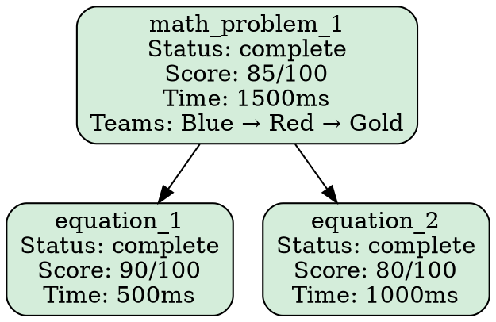
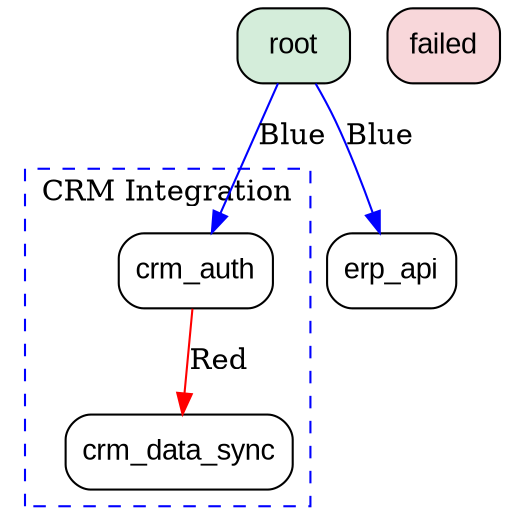

# Problem Hierarchy Visualization - Examples

This document provides examples of problem hierarchy visualizations in different formats.

## Table of Contents

1. [Simple Hierarchy Example](#simple-hierarchy-example)
2. [Complex Hierarchy Example](#complex-hierarchy-example)
3. [ASCII Output Examples](#ascii-output-examples)
4. [HTML Output Examples](#html-output-examples)
5. [Graphviz Output Examples](#graphviz-output-examples)
6. [Before/After Comparisons](#beforeafter-comparisons)

---

## Simple Hierarchy Example

### Problem Definition

```python
simple_problem = {
    'id': 'math_problem_1',
    'status': 'complete',
    'score': 85.0,
    'timing_ms': 1500,
    'teams': ['Blue', 'Red', 'Gold'],
    'attempt_count': 1,
    'statement': 'Solve a system of equations',
    'subproblems': [
        {
            'id': 'equation_1',
            'status': 'complete',
            'score': 90.0,
            'timing_ms': 500,
            'teams': ['Blue', 'Red'],
            'statement': 'x + y = 10'
        },
        {
            'id': 'equation_2',
            'status': 'complete',
            'score': 80.0,
            'timing_ms': 1000,
            'teams': ['Blue', 'Red'],
            'statement': 'x - y = 2'
        }
    ]
}
```

### ASCII Output

```
Problem Hierarchy Tree (3 nodes, 2 levels)

└── math_problem_1 [✅complete] Score: 85/100 (1500ms) Teams: Blue→Red→Gold Attempt #1
    ├── equation_1 [✅complete] Score: 90/100 (500ms) Teams: Blue→Red
    └── equation_2 [✅complete] Score: 80/100 (1000ms) Teams: Blue→Red
```

### Key Features Shown

- **Status Indicators**: ✅ for complete, ⏳ for pending, 🔄 for in-progress, ❌ for failed
- **Scores**: Color-coded from green (80+) to red (<40)
- **Timing**: Execution time in milliseconds
- **Team History**: Shows progression through teams
- **Tree Structure**: Clear parent-child relationships with box-drawing characters

---

## Complex Hierarchy Example

### Problem Definition

```python
complex_problem = {
    'id': 'enterprise_integration',
    'status': 'complete',
    'score': 75.0,
    'timing_ms': 15000,
    'teams': ['Blue', 'Red', 'Gold'],
    'attempt_count': 3,
    'statement': 'Integrate multiple enterprise systems',
    'metadata': {
        'domain': 'enterprise',
        'difficulty': 'hard',
        'priority': 'high'
    },
    'subproblems': [
        {
            'id': 'crm_integration',
            'status': 'complete',
            'score': 85.0,
            'timing_ms': 5000,
            'teams': ['Blue', 'Red'],
            'subproblems': [
                {
                    'id': 'crm_auth',
                    'status': 'complete',
                    'score': 95.0,
                    'timing_ms': 1000,
                    'teams': ['Blue']
                },
                {
                    'id': 'crm_data_sync',
                    'status': 'complete',
                    'score': 75.0,
                    'timing_ms': 4000,
                    'teams': ['Blue', 'Red']
                }
            ]
        },
        {
            'id': 'erp_integration',
            'status': 'complete',
            'score': 70.0,
            'timing_ms': 8000,
            'teams': ['Blue', 'Red'],
            'subproblems': [
                {
                    'id': 'erp_api',
                    'status': 'complete',
                    'score': 80.0,
                    'timing_ms': 3000,
                    'teams': ['Blue']
                },
                {
                    'id': 'erp_validation',
                    'status': 'failed',
                    'score': 30.0,
                    'timing_ms': 5000,
                    'teams': ['Blue', 'Red']
                }
            ]
        },
        {
            'id': 'data_warehouse',
            'status': 'in_progress',
            'score': None,
            'timing_ms': 2000,
            'teams': ['Blue'],
            'subproblems': [
                {
                    'id': 'schema_design',
                    'status': 'complete',
                    'score': 90.0,
                    'timing_ms': 1500,
                    'teams': ['Blue']
                },
                {
                    'id': 'etl_pipeline',
                    'status': 'pending',
                    'score': None,
                    'timing_ms': None,
                    'teams': []
                }
            ]
        }
    ]
}
```

### ASCII Output

```
Problem Hierarchy Tree (12 nodes, 4 levels)

└── enterprise_integration [✅complete] Score: 75/100 (15000ms) Teams: Blue→Red→Gold Attempt #3
    ├── crm_integration [✅complete] Score: 85/100 (5000ms) Teams: Blue→Red
    │   ├── crm_auth [✅complete] Score: 95/100 (1000ms) Teams: Blue
    │   └── crm_data_sync [✅complete] Score: 75/100 (4000ms) Teams: Blue→Red
    ├── erp_integration [✅complete] Score: 70/100 (8000ms) Teams: Blue→Red
    │   ├── erp_api [✅complete] Score: 80/100 (3000ms) Teams: Blue
    │   └── erp_validation [❌failed] Score: 30/100 (5000ms) Teams: Blue→Red
    └── data_warehouse [🔄in_progress] Teams: Blue (2000ms)
        ├── schema_design [✅complete] Score: 90/100 (1500ms) Teams: Blue
        └── etl_pipeline [⏳pending]
```

### Key Features Shown

- **Multi-Level Hierarchy**: 4 levels of depth
- **Mixed Statuses**: Complete, in-progress, pending, and failed
- **Partial Scores**: Some nodes have scores, others don't (pending/in-progress)
- **Complex Team Flows**: Different teams work on different branches
- **Failure Indication**: Clear visual marker for failed subproblems

---

## ASCII Output Examples

### Example 1: Wide Hierarchy (Many Siblings)

```
└── batch_processing [✅complete] Score: 82/100 (5000ms)
    ├── task_1 [✅complete] Score: 90/100 (500ms)
    ├── task_2 [✅complete] Score: 85/100 (600ms)
    ├── task_3 [✅complete] Score: 88/100 (550ms)
    ├── task_4 [❌failed] Score: 25/100 (2000ms)
    ├── task_5 [✅complete] Score: 92/100 (450ms)
    ├── task_6 [✅complete] Score: 87/100 (580ms)
    ├── task_7 [✅complete] Score: 91/100 (520ms)
    ├── task_8 [✅complete] Score: 89/100 (510ms)
    ├── task_9 [✅complete] Score: 86/100 (590ms)
    └── task_10 [✅complete] Score: 93/100 (480ms)
```

### Example 2: Deep Hierarchy (Many Levels)

```
└── root_problem [✅complete] Score: 75/100
    └── level_1 [✅complete] Score: 80/100
        └── level_2 [✅complete] Score: 82/100
            └── level_3 [✅complete] Score: 85/100
                └── level_4 [✅complete] Score: 88/100
                    └── level_5 [✅complete] Score: 90/100
```

### Example 3: With Metadata

```
└── nlp_pipeline [✅complete] Score: 88/100 (12000ms)
    ├── text_preprocessing [✅complete] Score: 95/100 (2000ms)
    ├── feature_extraction [✅complete] Score: 90/100 (5000ms)
    ├── model_inference [✅complete] Score: 85/100 (4000ms)
    └── result_postprocessing [✅complete] Score: 92/100 (1000ms)
```

---

## HTML Output Examples

### HTML Structure

The HTML renderer generates a fully interactive, self-contained HTML file with:

- **Collapsible Tree Nodes**: Click to expand/collapse branches
- **Color-Coded Status**:
  - Green background for complete
  - Yellow for pending
  - Blue for in-progress
  - Red for failed
- **Score-Based Colors**:
  - Green (80-100)
  - Yellow (60-79)
  - Orange (40-59)
  - Red (0-39)
- **Hover Effects**: Nodes highlight on hover
- **Metadata Tooltips**: Additional information on hover

### Sample HTML Render

```html
<!DOCTYPE html>
<html lang="en">
<head>
    <meta charset="UTF-8">
    <title>Problem Hierarchy Tree</title>
    <style>
        .problem-tree {
            background-color: white;
            border-radius: 8px;
            padding: 20px;
        }
        .tree-node {
            margin-left: 20px;
            padding: 10px;
            border-left: 2px solid #ddd;
        }
        .status-complete { background-color: #28a745; color: #fff; }
        .status-failed { background-color: #dc3545; color: #fff; }
        .node-score { font-weight: bold; }
    </style>
</head>
<body>
    <div class="tree-header">Problem Hierarchy Tree (3 nodes, 2 levels)</div>
    <div class="problem-tree">
        <div class="tree-node">
            <div class="node-header">
                <span class="expand-icon">▶</span>
                <span class="node-id">math_problem_1</span>
                <span class="node-status status-complete">complete</span>
                <span class="node-score" style="color: #28a745">85/100</span>
            </div>
            <div class="node-children">
                <!-- Child nodes here -->
            </div>
        </div>
    </div>
</body>
</html>
```

### Interactive Features

```javascript
// Auto-expand first level
document.addEventListener('DOMContentLoaded', function() {
    const rootChildren = document.querySelector('.node-children');
    if (rootChildren) {
        rootChildren.classList.add('expanded');
    }
});

// Toggle function
function toggleNode(header) {
    const icon = header.querySelector('.expand-icon');
    const children = header.parentElement.querySelector('.node-children');
    if (children) {
        children.classList.toggle('expanded');
        icon.classList.toggle('expanded');
    }
}
```

---

## Graphviz Output Examples

### DOT Format



### Rendering as PNG

Use Graphviz to render:

```bash
# Install graphviz
brew install graphviz  # macOS
apt-get install graphviz  # Linux

# Render to PNG
dot -Tpng output.dot -o hierarchy.png

# Render to SVG
dot -Tsvg output.dot -o hierarchy.svg

# Render to PDF
dot -Tpdf output.dot -o hierarchy.pdf
```

### Advanced Graphviz Features



---

## Before/After Comparisons

### Before Visualization (Plain Text Log)

```
INFO: Solving problem: math_problem_1
INFO: Decomposed into 2 subproblems
INFO: Solving subproblem: equation_1
INFO: Solving subproblem: equation_2
INFO: Both subproblems complete
INFO: Reassembling solution
INFO: Final score: 85
```

**Issues**:
- No visual hierarchy
- Hard to see relationships
- No status indicators
- Difficult to spot failures

### After Visualization (ASCII Art)

```
└── math_problem_1 [✅complete] Score: 85/100 (1500ms)
    ├── equation_1 [✅complete] Score: 90/100 (500ms)
    └── equation_2 [✅complete] Score: 80/100 (1000ms)
```

**Benefits**:
- Clear tree structure
- Status visible at a glance
- Scores and timing shown
- Easy to identify bottlenecks

### Before: Complex Multi-Level

```
INFO: Root: enterprise_integration
INFO: Level 1: crm_integration, erp_integration, data_warehouse
INFO: Level 2: crm_auth, crm_data_sync, erp_api, erp_validation, schema_design, etl_pipeline
INFO: Status: Mixed
INFO: Score: 75
```

### After: Complex Multi-Level

```
└── enterprise_integration [✅complete] Score: 75/100
    ├── crm_integration [✅complete] Score: 85/100
    │   ├── crm_auth [✅complete] Score: 95/100
    │   └── crm_data_sync [✅complete] Score: 75/100
    ├── erp_integration [✅complete] Score: 70/100
    │   ├── erp_api [✅complete] Score: 80/100
    │   └── erp_validation [❌failed] Score: 30/100  ← Problem!
    └── data_warehouse [🔄in_progress]
        ├── schema_design [✅complete] Score: 90/100
        └── etl_pipeline [⏳pending]
```

**Benefits**:
- Immediately see `erp_validation` failed
- Track which branch has issues
- Understand progress across branches
- Identify bottlenecks (erp_validation took 5000ms)

---

## Usage Examples

### Python Code

```python
from bubblelabs_nodes import visualize_problem

# Define problem
problem = {
    'id': 'example',
    'status': 'complete',
    'score': 85,
    'subproblems': [
        {'id': 'child1', 'status': 'complete', 'score': 90},
        {'id': 'child2', 'status': 'failed', 'score': 30}
    ]
}

# Generate ASCII visualization
ascii_output = visualize_problem(problem, format='ascii')
print(ascii_output)

# Generate HTML visualization
html_output = visualize_problem(problem, format='html')
with open('visualization.html', 'w') as f:
    f.write(html_output)

# Generate Graphviz DOT
dot_output = visualize_problem(problem, format='dot')
with open('visualization.dot', 'w') as f:
    f.write(dot_output)
```

### HTTP API

```bash
# Get ASCII visualization
curl -X POST "http://localhost:8001/api/visualize?format=ascii" \
  -H "Content-Type: application/json" \
  -d '{"id": "example", "status": "complete"}'

# Get HTML visualization
curl -X POST "http://localhost:8001/api/visualize?format=html" \
  -H "Content-Type: application/json" \
  -d '{"id": "example", "status": "complete"}' \
  --output visualization.html

# Get Graphviz DOT
curl -X POST "http://localhost:8001/api/visualize?format=dot" \
  -H "Content-Type: application/json" \
  -d '{"id": "example", "status": "complete"}' \
  --output visualization.dot
```

### Command Line

```bash
# Visualize from file
cat problem.json | python -m bubblelabs_nodes.visualization

# Save to file
python -m bubblelabs_nodes.visualization problem.json --format html --output viz.html

# View in browser
python -m bubblelabs_nodes.visualization problem.json --format html --open
```

---

## Summary

These examples demonstrate:

✅ **Simple hierarchies** - Easy to read and understand
✅ **Complex hierarchies** - Multi-level with many nodes
✅ **ASCII format** - Terminal-friendly, no dependencies
✅ **HTML format** - Interactive, browser-based
✅ **Graphviz format** - Professional diagrams, exportable
✅ **Before/after** - Clear improvement over plain logs
✅ **Status indicators** - Visual status at a glance
✅ **Performance data** - Timing and scores visible
✅ **Team tracking** - See which teams worked on what

For more information:
- `bubblelabs_nodes/problem_visualization.py` - Implementation
- `bubblelabs_nodes/visualization_api.py` - HTTP API
- `test_problem_visualization.py` - Test examples
