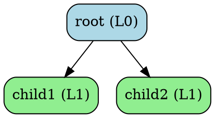

# Problem Visualization Guide for Gauntlet System

This guide explains how to visualize problem hierarchies and decomposition trees in the OpenEvolve Gauntlet system.

## Table of Contents

1. [Overview](#overview)
2. [Visualization Renderers](#visualization-renderers)
3. [ASCII Tree Rendering](#ascii-tree-rendering)
4. [HTML Interactive Rendering](#html-interactive-rendering)
5. [Graphviz DOT Rendering](#graphviz-dot-rendering)
6. [Usage Examples](#usage-examples)
7. [Custom Visualization](#custom-visualization)

---

## Overview

The Gauntlet system provides three visualization renderers for problem hierarchies:

1. **ASCII Renderer**: Terminal-friendly text-based trees
2. **HTML Renderer**: Interactive web-based visualizations
3. **Graphviz Renderer**: Publication-quality diagrams

### Quick Example

```python
from bubblelabs_nodes import visualize_ascii, visualize_problem

# Build and visualize problem tree
tree = visualize_ascii(problem)
print(tree)

# Or use the helper function
tree = visualize_problem(problem, renderer='ascii')
```

---

## Visualization Renderers

### ASCIITreeRenderer

Creates text-based tree diagrams using box-drawing characters.

**Features:**
- Terminal-compatible output
- Color support (optional)
- Compact representation
- No external dependencies

**Example Output:**
```
┌─────────────────────────────────┐
│     complex_problem (L0)         │
│   Subproblems: 3                 │
└─────────────────────────────────┘
    ├─ sub_1 (L1) [ATOMIC]
    ├─ sub_2 (L1) [ATOMIC]
    └─ sub_3 (L1) [ATOMIC]
```

### HTMLTreeRenderer

Creates interactive HTML visualizations with collapsible nodes.

**Features:**
- Collapsible/expandable nodes
- Color coding by level
- Search functionality
- Export to HTML file

**Example:**
```python
from bubblelabs_nodes import visualize_html

html = visualize_html(problem)

# Save to file
with open('problem_tree.html', 'w') as f:
    f.write(html)
```

### GraphvizTreeRenderer

Creates Graphviz DOT format for publication-quality diagrams.

**Features:**
- Professional diagrams
- Multiple layout engines (dot, neato, etc.)
- Export to PNG, SVG, PDF
- Customizable styling

**Example:**
```python
from bubblelabs_nodes import visualize_dot

dot = visualize_dot(problem)

# Render to PNG (requires graphviz)
import graphviz
graph = graphviz.Source(dot)
graph.render('problem_tree', format='png', cleanup=True)
```

---

## ASCII Tree Rendering

### Basic Usage

```python
from bubblelabs_nodes import visualize_ascii

problem = {
    'id': 'root',
    'statement': 'Root problem',
    'subproblems': [
        {'id': 'child1', 'statement': 'Child 1'},
        {'id': 'child2', 'statement': 'Child 2'},
    ]
}

tree = visualize_ascii(problem)
print(tree)
```

### Advanced Options

```python
from bubblelabs_nodes import ASCIITreeRenderer, ProblemTreeBuilder

# Build tree
builder = ProblemTreeBuilder()
tree = builder.build(problem)

# Create renderer with options
renderer = ASCIITreeRenderer(
    show_level=True,
    show_subproblem_count=True,
    compact=False
)

# Render
ascii_tree = renderer.render(tree)
```

### Customizing ASCII Output

```python
# Custom box characters
renderer = ASCIITreeRenderer(
    box_chars={
        'vertical': '│',
        'horizontal': '─',
        'left_corner': '├',
        'right_corner': '└',
        'cross': '┼'
    }
)

# Or use simple characters
renderer = ASCIITreeRenderer(simple_style=True)
```

---

## HTML Interactive Rendering

### Basic HTML Visualization

```python
from bubblelabs_nodes import visualize_html

html = visualize_html(problem)

# Options
html = visualize_html(
    problem,
    collapsible=True,
    show_metadata=True,
    color_scheme='default'
)
```

### HTML Features

**1. Collapsible Nodes:**
```html
<details>
    <summary>problem_123 (L0)</summary>
    <div class="children">
        <!-- Subproblems -->
    </div>
</details>
```

**2. Color Coding:**
- Level 0: Blue
- Level 1: Green
- Level 2: Orange
- Level 3+: Red

**3. Metadata Display:**
- Problem ID
- Statement
- Subproblem count
- Atomic status

### Customizing HTML Output

```python
from bubblelabs_nodes import HTMLTreeRenderer

renderer = HTMLTreeRenderer(
    include_styles=True,
    color_scheme='dark',  # or 'light'
    max_depth=10
)

html = renderer.render(tree)
```

### Exporting HTML

```python
# Save to file
with open('visualization.html', 'w') as f:
    f.write(html)

# Open in browser
import webbrowser
webbrowser.open('visualization.html')
```

---

## Graphviz DOT Rendering

### Basic DOT Output

```python
from bubblelabs_nodes import visualize_dot

dot = visualize_dot(problem)
print(dot)
```

### DOT Output Example



### Rendering to Image

```python
import graphviz

# Get DOT format
dot = visualize_dot(problem)

# Create graph
graph = graphviz.Source(dot)

# Render to PNG
graph.render('problem_tree', format='png', cleanup=True)

# Render to SVG
graph.render('problem_tree', format='svg', cleanup=True)

# Render to PDF
graph.render('problem_tree', format='pdf', cleanup=True)
```

### Graphviz Layout Options

```python
from bubblelabs_nodes import GraphvizTreeRenderer

# Use different layout engines
renderer = GraphvizTreeRenderer(
    layout_engine='dot'  # or 'neato', 'fdp', 'sfdp', 'twopi', 'circo'
)

dot = renderer.render(tree)
```

**Layout Engines:**
- `dot`: Hierarchical (default)
- `neato`: Force-directed
- `fdp`: Force-directed (large graphs)
- `sfdp`: Force-directed (scalable)
- `twopi`: Radial
- `circo`: Circular

### Customizing Graphviz Output

```python
renderer = GraphvizTreeRenderer(
    node_shape='box',
    node_style='rounded,filled',
    color_scheme='level-based',
    fontname='Helvetica',
    fontsize=12
)

dot = renderer.render(tree)
```

---

## Usage Examples

### Example 1: Visualizing Decomposed Problem

```python
from bubblelabs_nodes import visualize_ascii

# Create decomposed problem
problem = {
    'id': 'complex_system',
    'statement': 'Build a complex system',
    'subproblems': [
        {
            'id': 'frontend',
            'statement': 'Build frontend',
            'subproblems': [
                {'id': 'ui', 'statement': 'Design UI'},
                {'id': 'api', 'statement': 'Integrate API'},
            ]
        },
        {
            'id': 'backend',
            'statement': 'Build backend',
            'subproblems': [
                {'id': 'db', 'statement': 'Setup database'},
                {'id': 'server', 'statement': 'Create server'},
            ]
        },
    ]
}

# Visualize
tree = visualize_ascii(problem)
print(tree)
```

**Output:**
```
┌──────────────────────────────────────┐
│      complex_system (L0)               │
│    Subproblems: 2                      │
└──────────────────────────────────────┘
    ├─ frontend (L1)
    │   ├─ ui (L2) [ATOMIC]
    │   └─ api (L2) [ATOMIC]
    └─ backend (L1)
        ├─ db (L2) [ATOMIC]
        └─ server (L2) [ATOMIC]
```

### Example 2: HTML with Interactivity

```python
from bubblelabs_nodes import visualize_html

problem = {
    'id': 'project',
    'subproblems': [
        {'id': 'phase1', 'statement': 'Phase 1'},
        {'id': 'phase2', 'statement': 'Phase 2'},
        {'id': 'phase3', 'statement': 'Phase 3'},
    ]
}

html = visualize_html(problem, collapsible=True)

with open('project_tree.html', 'w') as f:
    f.write(html)

print("Open project_tree.html in your browser")
```

### Example 3: Graphviz Publication Diagram

```python
import graphviz
from bubblelabs_nodes import visualize_dot

problem = {
    'id': 'research',
    'statement': 'Research project',
    'subproblems': [
        {'id': 'literature', 'statement': 'Literature review'},
        {'id': 'experiment', 'statement': 'Experiments'},
        {'id': 'writing', 'statement': 'Write paper'},
    ]
}

dot = visualize_dot(problem)
graph = graphviz.Source(dot)

# Render publication-quality diagram
graph.render('research_project', format='pdf', cleanup=True)
print("Generated research_project.pdf")
```

### Example 4: Custom Visualization

```python
from bubblelabs_nodes import (
    ProblemTreeBuilder,
    ASCIITreeRenderer,
    HTMLTreeRenderer
)

# Build tree
builder = ProblemTreeBuilder()
tree_node = builder.build(problem)

# ASCII for terminal
ascii_renderer = ASCIITreeRenderer(show_level=True)
ascii_tree = ascii_renderer.render(tree_node)
print(ascii_tree)

# HTML for web
html_renderer = HTMLTreeRenderer(color_scheme='dark')
html_tree = html_renderer.render(tree_node)

with open('custom_viz.html', 'w') as f:
    f.write(html_tree)
```

---

## Custom Visualization

### Creating Custom Renderer

```python
from bubblelabs_nodes import ProblemNode

def custom_renderer(node: ProblemNode, indent: int = 0) -> str:
    """Custom tree renderer"""
    prefix = "  " * indent
    result = f"{prefix}{node.problem_id}"

    if node.is_atomic:
        result += " [ATOMIC]"

    result += f" - {node.statement}\n"

    for child in node.children:
        result += custom_renderer(child, indent + 1)

    return result

# Use custom renderer
tree = custom_renderer(tree_node)
print(tree)
```

### Adding Metadata to Visualization

```python
def visualize_with_metadata(node: ProblemNode) -> str:
    """Visualize with execution metadata"""
    result = f"{node.problem_id}\n"

    if hasattr(node, 'metadata'):
        metadata = node.metadata
        if 'execution_time' in metadata:
            result += f"  Time: {metadata['execution_time']}ms\n"
        if 'success' in metadata:
            result += f"  Success: {metadata['success']}\n"

    return result
```

---

## Summary

Problem visualization in Gauntlet provides:
- ✅ **ASCII trees** for terminal output
- ✅ **HTML visualization** for interactive exploration
- ✅ **Graphviz diagrams** for publication
- ✅ **Custom renderers** for specific needs
- ✅ **Multiple output formats** (text, HTML, DOT, PNG, SVG, PDF)

For more information:
- `bubblelabs_nodes/visualization.py` for implementation
- `bubblelabs_nodes/` for usage examples
