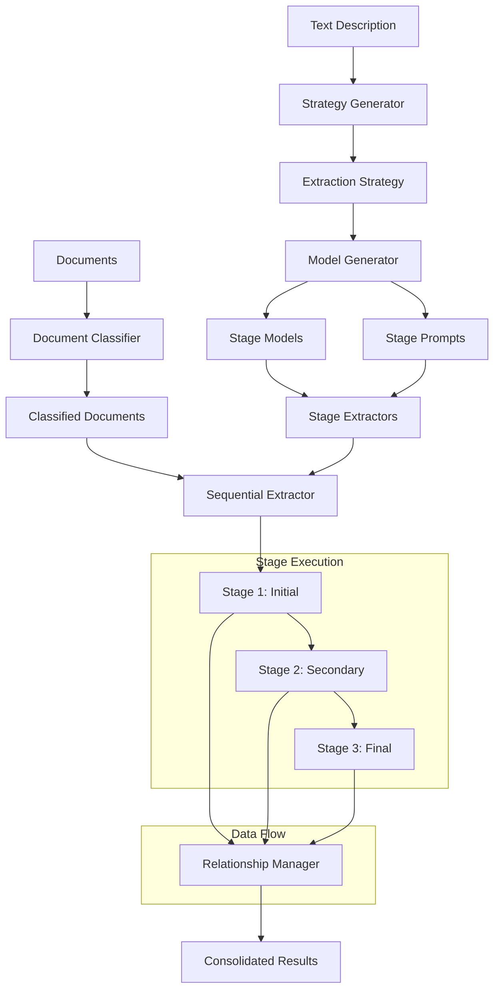

# Case 2: Hierarchical Extraction Implementation Guide

## Table of Contents
1. [Overview](#overview)
2. [Architecture](#architecture)
3. [Core Data Structures](#core-data-structures)
4. [Workflow Diagram](#workflow-diagram)
5. [Implementation Components](#implementation-components)
6. [Code Structure](#code-structure)
7. [Configuration Management](#configuration-management)
8. [Field Naming Consistency](#field-naming-consistency)
9. [Complete Implementation Guide](#complete-implementation-guide)
10. [Example Use Case](#example-use-case)

## Overview

Case 2 (Hierarchical Extraction) is designed for multi-document extraction scenarios where documents have **relationships** and data needs to flow between different extraction stages. Unlike single-type extraction or Case 1 (multi-type without relationships), Case 2 orchestrates a **sequential extraction process** where each stage builds upon the results of previous stages.

### Key Characteristics
- **Sequential Processing**: Stages execute in a defined order
- **Data Flow**: Results from one stage feed into the next stage
- **Relationship Mapping**: Explicit relationships between stages
- **Document Classification**: AI-driven document type classification
- **Consolidation**: Final stage consolidates all extracted data

### Use Cases
- Purchase Orders + Bill of Materials (PO → BOM → Consolidation)
- Invoices + Contracts + Payment Records
- Medical Records + Lab Results + Prescriptions
- Legal Documents + Evidence + Case Files

## Architecture

```
┌─────────────────┐    ┌──────────────────┐    ┌─────────────────┐
│   Text          │    │   Strategy        │    │   Model          │
│   Description   │───▶│   Generator       │───▶│   Generator      │
└─────────────────┘    └──────────────────┘    └─────────────────┘
                                │                        │
                                ▼                        ▼
┌─────────────────┐    ┌──────────────────┐    ┌─────────────────┐
│   Sequential    │◀───│   Stage           │◀───│   Stage          │
│   Extractor     │    │   Extractors     │    │   Models        │
└─────────────────┘    └──────────────────┘    └─────────────────┘
         │
         ▼
┌─────────────────┐
│   Consolidated  │
│   Results       │
└─────────────────┘
```

## Core Data Structures

### 1. ExtractionStageType Enum
```python
class ExtractionStageType(Enum):
    INITIAL = "initial"      # First stage - extract primary keys
    SECONDARY = "secondary"   # Middle stages - use keys to extract related data
    FINAL = "final"          # Final stage - consolidate all information
```

### 2. RelationshipType Enum
```python
class RelationshipType(Enum):
    DIRECT_KEY_MATCH = "direct_key_match"        # Direct key matching (e.g., order_id)
    DERIVED_KEY_MATCH = "derived_key_match"      # Derived key matching (e.g., customer_id from order)
    AGGREGATION = "aggregation"                  # Aggregation of multiple records
    TRANSFORMATION = "transformation"             # Data transformation between stages
```

### 3. ExtractionStage Dataclass
```python
@dataclass
class ExtractionStage:
    stage_name: str                              # Human-readable stage name
    stage_type: ExtractionStageType              # INITIAL, SECONDARY, or FINAL
    document_types: List[str]                    # Document types this stage processes
    key_fields: List[str]                        # Key fields for relationships
    input_keys: List[str]                        # Keys needed from previous stages
    output_keys: List[str]                       # Keys this stage produces
    extraction_fields: List[Dict[str, Any]]     # Fields to extract
    description: str                             # Stage description
```

### 4. RelationshipMapping Dataclass
```python
@dataclass
class RelationshipMapping:
    source_stage: str                            # Stage that produces data
    target_stage: str                            # Stage that consumes data
    key_field: str                               # Field used for matching
    relationship_type: RelationshipType          # Type of relationship
    description: str                            # Relationship description
    transformation_rules: Optional[Dict[str, Any]] = None  # Data transformation rules
```

### 5. ExtractionStrategy Dataclass
```python
@dataclass
class ExtractionStrategy:
    use_case_name: str                           # Name of the use case
    description: str                             # Overall description
    stages: List[ExtractionStage]                # All extraction stages
    relationships: List[RelationshipMapping]       # Inter-stage relationships
    extraction_sequence: List[str]               # Ordered execution sequence
    document_classifications: Dict[str, str]     # doc_type -> stage_name mapping
    consolidation_rules: Optional[Dict[str, Any]] = None  # Final consolidation rules
```

## Workflow Diagram



## Implementation Components

### 1. Case2Orchestrator (`case2_main.py`)
**Main entry point** for Case 2 operations.

**Key Methods:**
- `create_new_use_case()`: Creates a complete Case 2 use case
- `load_persisted_use_case()`: Loads existing Case 2 use case
- `extract_documents()`: Executes extraction on documents

**Responsibilities:**
- Orchestrates the complete workflow
- Manages use case creation and loading
- Coordinates between strategy and model generators

### 2. Case2StrategyGenerator (`case2_strategy_generator.py`)
**Generates extraction strategy** from text description.

**Key Methods:**
- `generate_strategy()`: Main strategy generation method
- `_analyze_description()`: Analyzes text description
- `_generate_stages()`: Creates extraction stages
- `_generate_relationships()`: Defines inter-stage relationships

**Responsibilities:**
- AI-driven strategy analysis
- Stage definition and sequencing
- Relationship mapping
- Document classification rules

### 3. Case2ModelGenerator (`case2_model_generator.py`)
**Generates Pydantic models and prompts** for each stage.

**Key Methods:**
- `generate_hierarchical_models()`: Creates models for all stages
- `_generate_stage_model()`: Creates model for single stage
- `generate_stage_extractors()`: Creates stage extractor configurations
- `_build_model_structure_for_prompt()`: Builds model structure for AI prompts

**Responsibilities:**
- Dynamic Pydantic model generation
- AI prompt creation
- Field naming consistency
- Stage extractor configuration

### 4. Case2SequentialExtractor (`case2_extractor.py`)
**Executes the hierarchical extraction process**.

**Key Methods:**
- `extract_hierarchically()`: Main extraction orchestration
- `_execute_stage()`: Executes single stage
- `_classify_and_route_documents()`: Document classification and routing

**Responsibilities:**
- Sequential stage execution
- Document classification
- Data flow management
- Result consolidation

### 5. Case2RelationshipManager (`case2_extractor.py`)
**Manages data flow** between extraction stages.

**Key Methods:**
- `process_stage_results()`: Processes stage results for next stages
- `get_input_data_for_stage()`: Gets input data for target stage
- `consolidate_results()`: Consolidates final results

**Responsibilities:**
- Inter-stage data flow
- Key field matching
- Result aggregation
- Final consolidation

## Code Structure

### Directory Structure
```
Hierarchical_extraction/
├── __init__.py
├── case2_core.py              # Core data structures and enums
├── case2_main.py              # Main orchestrator
├── case2_strategy_generator.py # Strategy generation
├── case2_model_generator.py   # Model and prompt generation
└── case2_extractor.py         # Sequential extraction engine
```

### Use Case Folder Structure
```
Use-cases/
└── UseCaseName/
    ├── config.json                    # Main configuration
    ├── UseCaseName_strategy.py        # Strategy definition
    ├── Stage1Name/
    │   ├── Stage1Name_models.py       # Stage 1 Pydantic model
    │   ├── Stage1Name_prompt.py       # Stage 1 AI prompt
    │   └── config.json                # Stage 1 configuration
    ├── Stage2Name/
    │   ├── Stage2Name_models.py
    │   ├── Stage2Name_prompt.py
    │   └── config.json
    └── Stage3Name/
        ├── Stage3Name_models.py
        ├── Stage3Name_prompt.py
        └── config.json
```

## Configuration Management

### Main Configuration (`config.json`)
```json
{
  "extraction_config": {
    "use_case": "PoDataExtraction",
    "description": "Extract PO and BOM data with relationships",
    "extraction_type": "multi_type_with_relationships",
    "configuration_mode": "text_description",
    "extraction_strategy": {
      "stages": [
        {
          "stage_name": "PO Extraction",
          "stage_type": "initial",
          "document_types": ["Purchase Order (PO)"],
          "key_fields": ["Material Number"],
          "input_keys": [],
          "output_keys": [],
          "extraction_fields": [
            {
              "field_name": "Material Number",
              "field_type": "str",
              "description": "Unique identifier for the material/item",
              "required": true
            }
          ],
          "description": "Extracts all relevant item-level fields from the customer purchase order"
        }
      ],
      "relationships": [
        {
          "source_stage": "PO Extraction",
          "target_stage": "BOM Extraction",
          "key_field": "Material Number",
          "relationship_type": "direct_key_match",
          "description": "Material Number from PO is matched directly to ID in BOM",
          "transformation_rules": null
        }
      ],
      "extraction_sequence": ["PO Extraction", "BOM Extraction", "PO-BOM Alignment & Consolidation"],
      "document_classifications": {
        "Purchase Order (PO)": "PO Extraction",
        "Bill of Material (BOM)": "BOM Extraction"
      },
      "consolidation_rules": {
        "final_output_format": "A tabular dataset where each row corresponds to a PO item",
        "key_consolidation_fields": ["Material Number", "Quantity", "Description"],
        "aggregation_rules": "For each PO item, join with the BOM entry where Material Number matches ID",
        "output_structure": "hierarchical"
      }
    }
  }
}
```

## Field Naming Consistency

### Problem
Case 2 models need to maintain **field naming consistency** with original single-type models to ensure data flow works correctly.

### Solution
**Dynamic field name extraction and matching:**

```python
def _extract_original_model_info(use_case_path: str) -> Dict[str, Any]:
    """Extract field names from the original single-type model for Case 2 consistency"""
    try:
        model_filename = f"{os.path.basename(use_case_path)}_models.py"
        model_path = os.path.join(use_case_path, model_filename)
        
        if os.path.exists(model_path):
            with open(model_path, 'r', encoding='utf-8') as f:
                model_content = f.read()
            
            import re
            field_pattern = r'(\w+):\s*\w+\s*=\s*Field\('
            field_names = re.findall(field_pattern, model_content)
            
            return {'field_names': field_names}
        
        return {}
    except Exception as e:
        logger.warning(f"Could not extract original model info: {e}")
        return {}
```

**Smart field matching in prompt generation:**

```python
def _build_model_structure_for_prompt(self, stage: ExtractionStage, original_model_info: Optional[Dict[str, Any]] = None) -> str:
    """Build Pydantic model structure string for inclusion in prompts"""
    lines = []
    
    # Get original field names if available
    original_field_names = []
    if original_model_info and 'field_names' in original_model_info:
        original_field_names = original_model_info['field_names']
    
    for field in stage.extraction_fields:
        field_name = field['field_name']
        
        # Check if this field corresponds to an original field
        original_field_name = None
        for orig_name in original_field_names:
            # Normalize both field names for comparison
            normalized_field = field_name.lower().replace(' ', '').replace('-', '').replace('_', '').replace('/', '')
            normalized_orig = orig_name.lower().replace(' ', '').replace('-', '').replace('_', '').replace('/', '')
            
            # Check for exact match or semantic match
            if (normalized_field == normalized_orig or 
                # Handle special cases like ID -> materialnumber
                (normalized_field == 'id' and normalized_orig == 'materialnumber') or
                # Handle Type/Part Designation -> typepartdesignation
                ('type' in normalized_field and 'part' in normalized_field and 'designation' in normalized_field and 
                 'type' in normalized_orig and 'part' in normalized_orig and 'designation' in normalized_orig)):
                original_field_name = orig_name
                break
        
        # Use original field name if found, otherwise convert to snake_case
        if original_field_name:
            field_name = original_field_name
        else:
            field_name = field['field_name'].replace(' ', '_').replace('-', '_').replace('/', '_').lower()
        
        # Add field to model structure
        lines.append(f'    {field_name}: {python_type} = Field(description="{description}")')
    
    return '\n'.join(lines) if lines else '    pass'
```

## Complete Implementation Guide

### Step 1: Create Core Data Structures

Create `case2_core.py` with all the dataclasses and enums defined above.

### Step 2: Implement Strategy Generator

```python
class Case2StrategyGenerator:
    def __init__(self, ai_client):
        self.ai_client = ai_client
    
    def generate_strategy(self, description: str, use_case_name: str) -> ExtractionStrategy:
        """Generate complete extraction strategy from text description"""
        # Step 1: Analyze description
        analysis = self._analyze_description(description, use_case_name)
        
        # Step 2: Generate stages
        stages = self._generate_stages(analysis)
        
        # Step 3: Generate relationships
        relationships = self._generate_relationships(analysis, stages)
        
        # Step 4: Determine extraction sequence
        extraction_sequence = self._determine_extraction_sequence(stages, relationships)
        
        # Step 5: Create document classifications
        document_classifications = self._create_document_classifications(stages)
        
        # Step 6: Generate consolidation rules
        consolidation_rules = self._generate_consolidation_rules(analysis, stages)
        
        return ExtractionStrategy(
            use_case_name=use_case_name,
            description=description,
            stages=stages,
            relationships=relationships,
            extraction_sequence=extraction_sequence,
            document_classifications=document_classifications,
            consolidation_rules=consolidation_rules
        )
```

### Step 3: Implement Model Generator

```python
class Case2ModelGenerator:
    def __init__(self, ai_client):
        self.ai_client = ai_client
    
    def generate_hierarchical_models(self, strategy: ExtractionStrategy, original_model_info: Optional[Dict[str, Any]] = None) -> Dict[str, Type[BaseModel]]:
        """Generate Pydantic models for each extraction stage"""
        stage_models = {}
        
        for stage in strategy.stages:
            model_class = self._generate_stage_model(stage, strategy, original_model_info)
            stage_models[stage.stage_name] = model_class
        
        return stage_models
    
    def generate_stage_extractors(self, strategy: ExtractionStrategy, stage_models: Dict[str, Type[BaseModel]], original_model_info: Optional[Dict[str, Any]] = None) -> List[StageExtractor]:
        """Generate stage extractor configurations"""
        extractors = []
        
        for stage in strategy.stages:
            model_class = stage_models.get(stage.stage_name)
            if not model_class:
                continue
            
            # Generate prompt for this stage
            prompt = self._generate_stage_prompt(stage, strategy, original_model_info)
            
            # Create stage extractor
            extractor = StageExtractor(
                stage_name=stage.stage_name,
                stage_type=stage.stage_type,
                document_types=stage.document_types,
                model_class=model_class,
                prompt=prompt,
                input_keys=stage.input_keys,
                output_keys=stage.output_keys,
                extraction_fields=stage.extraction_fields,
                config_path=""  # Will be set during persistence
            )
            extractors.append(extractor)
        
        return extractors
```

### Step 4: Implement Sequential Extractor

```python
class Case2SequentialExtractor:
    def __init__(self, strategy: ExtractionStrategy, stage_extractors: List[StageExtractor], ai_client=None):
        self.strategy = strategy
        self.stage_extractors = stage_extractors
        self.ai_client = ai_client
        self.relationship_manager = Case2RelationshipManager()
        self.document_classifier = DocumentClassifier(ai_client)
    
    def extract_hierarchically(self, documents: List[Dict[str, Any]]) -> HierarchicalExtractionResult:
        """Perform complete hierarchical extraction process"""
        # Step 1: Classify documents by type
        classified_docs = self._classify_and_route_documents(documents)
        
        # Step 2: Execute stages in sequence
        stage_results = {}
        all_relationships = {}
        
        for stage_name in self.strategy.extraction_sequence:
            # Get stage extractor
            stage_extractor = self._get_stage_extractor(stage_name)
            if not stage_extractor:
                continue
            
            # Get documents for this stage
            stage_documents = self._get_documents_for_stage(stage_name, classified_docs)
            
            # Get input data from previous stages
            input_data = self.relationship_manager.get_input_data_for_stage(
                stage_name, self.strategy.relationships
            )
            
            # Execute stage extraction
            stage_result = self._execute_stage(stage_extractor, stage_documents, input_data)
            
            # Process results and relationships
            relationship_data = self.relationship_manager.process_stage_results(
                stage_name, stage_result, self.strategy.relationships
            )
            
            stage_results[stage_name] = stage_result
            all_relationships[stage_name] = relationship_data
        
        # Step 3: Consolidate final results
        consolidated_results = self.relationship_manager.consolidate_results(self.strategy)
        
        # Step 4: Create final result
        return HierarchicalExtractionResult(
            use_case_name=self.strategy.use_case_name,
            extraction_strategy=self.strategy,
            stage_results=stage_results,
            relationships=all_relationships,
            consolidated_results=consolidated_results,
            processing_metadata={}
        )
```

### Step 5: Implement Main Orchestrator

```python
class Case2Orchestrator:
    def __init__(self, ai_client=None):
        self.ai_client = ai_client
        self.strategy_generator = Case2StrategyGenerator(self.ai_client)
        self.model_generator = Case2ModelGenerator(self.ai_client)
    
    def create_new_use_case(self, description: str, use_case_name: str, use_case_path: str, original_model_info: Optional[Dict[str, Any]] = None) -> Dict[str, Any]:
        """Create a new Case 2 use case from text description"""
        # Step 1: Generate extraction strategy
        strategy = self.strategy_generator.generate_strategy(description, use_case_name)
        
        # Step 2: Generate hierarchical models
        stage_models = self.model_generator.generate_hierarchical_models(strategy, original_model_info)
        
        # Step 3: Generate stage extractors
        stage_extractors = self.model_generator.generate_stage_extractors(strategy, stage_models, original_model_info)
        
        # Step 4: Save everything to files
        self._save_use_case(strategy, stage_models, stage_extractors, use_case_path)
        
        # Step 5: Create config
        config = Case2Config.create_config(use_case_name, strategy)
        
        return {
            'success': True,
            'use_case_name': use_case_name,
            'strategy': strategy,
            'stage_models': stage_models,
            'stage_extractors': stage_extractors,
            'config': config,
            'use_case_path': use_case_path
        }
    
    def load_persisted_use_case(self, use_case_path: str) -> Dict[str, Any]:
        """Load a persisted Case 2 use case"""
        # Step 1: Load strategy from config
        strategy = Case2Config.load_strategy_from_config(config_path)
        
        # Step 2: Load stage models and extractors
        stage_models = {}
        stage_extractors = []
        
        for stage in strategy.stages:
            stage_dir = os.path.join(use_case_path, stage.stage_name)
            if os.path.exists(stage_dir):
                # Load model
                model_file = os.path.join(stage_dir, f"{stage.stage_name}_models.py")
                if os.path.exists(model_file):
                    model_class = self._load_model_from_file(model_file, stage.stage_name)
                    stage_models[stage.stage_name] = model_class
                
                # Load prompt
                prompt_file = os.path.join(stage_dir, f"{stage.stage_name}_prompt.py")
                prompt = ""
                if os.path.exists(prompt_file):
                    prompt = self._load_prompt_from_file(prompt_file)
                
                # Create stage extractor
                extractor = StageExtractor(
                    stage_name=stage.stage_name,
                    stage_type=stage.stage_type,
                    document_types=stage.document_types,
                    model_class=stage_models.get(stage.stage_name),
                    prompt=prompt,
                    input_keys=stage.input_keys,
                    output_keys=stage.output_keys,
                    extraction_fields=stage.extraction_fields,
                    config_path=stage_dir
                )
                stage_extractors.append(extractor)
        
        return {
            'success': True,
            'strategy': strategy,
            'stage_models': stage_models,
            'stage_extractors': stage_extractors,
            'use_case_path': use_case_path
        }
    
    def extract_documents(self, documents: List[Dict[str, Any]], use_case_path: str) -> HierarchicalExtractionResult:
        """Extract documents using a Case 2 use case"""
        # Load persisted use case
        load_result = self.load_persisted_use_case(use_case_path)
        if not load_result['success']:
            raise ValueError(f"Failed to load use case: {load_result['error']}")
        
        strategy = load_result['strategy']
        stage_extractors = load_result['stage_extractors']
        
        # Create sequential extractor
        extractor = Case2SequentialExtractor(strategy, stage_extractors, self.ai_client)
        
        # Perform extraction
        result = extractor.extract_hierarchically(documents)
        
        return result
```

### Step 6: UI Integration

```python
# In ui_app.py - Load Selected Model button
if extraction_type == 'multi_type_with_relationships':
    # Case 2: Load from extraction_strategy
    strategy = extraction_config.get('extraction_strategy', {})
    stages = strategy.get('stages', [])
    
    # Generate model name from use case name
    st.session_state.main_model_name = f"{st.session_state.use_case}Model"
    
    # Extract fields from all stages for display
    all_fields = []
    for stage in stages:
        stage_fields = stage.get('extraction_fields', [])
        for field in stage_fields:
            all_fields.append({
                'field_name': field.get('field_name', ''),
                'field_type': field.get('field_type', 'str'),
                'description': field.get('description', ''),
                'required': field.get('required', True),
                'stage': stage.get('stage_name', '')
            })
    
    st.session_state.fields = all_fields
    st.session_state.configuration_mode = 'text_description'
    st.session_state.text_description = extraction_config.get('text_description', '')
    st.session_state.parsed_fields = all_fields
```

## Example Use Case

### PO-BOM Extraction Example

**Text Description:**
```
Extract key fields from customer documents (Purchase Order (PO), Bill of Material (BOM)) and align them so that each PO item is enriched with the correct technical details. Start with the customer purchase order, which could have multiple items. The item is linked to its BOM via a Material Number. For every item in the PO, pull out the Material Number along with the basic item details like Quantity, Description, and Delivery Date. Use the item's Material Number from the PO to find the BOM having the same Material Number (represented as 'ID' at Level 0). From the matching BOM, extract the part's 'Type/Part Designation' and Dimensions. Once you have the Type/Part Designation and Dimensions matched back to the PO item, keep them linked together with the PO fields you already pulled out.
```

**Generated Strategy:**
```python
ExtractionStrategy(
    use_case_name="PoDataExtraction",
    description="Extract PO and BOM data with relationships",
    stages=[
        ExtractionStage(
            stage_name="PO Extraction",
            stage_type=ExtractionStageType.INITIAL,
            document_types=["Purchase Order (PO)"],
            key_fields=["Material Number"],
            extraction_fields=[
                {"field_name": "Material Number", "field_type": "str", "description": "Unique identifier for the material/item", "required": True},
                {"field_name": "Quantity", "field_type": "int", "description": "Number of units ordered", "required": True},
                {"field_name": "Description", "field_type": "str", "description": "Description of the item", "required": True},
                {"field_name": "Delivery Date", "field_type": "str", "description": "Requested delivery date", "required": True}
            ]
        ),
        ExtractionStage(
            stage_name="BOM Extraction",
            stage_type=ExtractionStageType.SECONDARY,
            document_types=["Bill of Material (BOM)"],
            key_fields=["ID"],
            extraction_fields=[
                {"field_name": "ID", "field_type": "str", "description": "Material Number at Level 0", "required": True},
                {"field_name": "Type/Part Designation", "field_type": "str", "description": "Technical type or designation", "required": True},
                {"field_name": "Dimensions", "field_type": "str", "description": "Physical dimensions", "required": True}
            ]
        ),
        ExtractionStage(
            stage_name="PO-BOM Alignment & Consolidation",
            stage_type=ExtractionStageType.FINAL,
            document_types=["Purchase Order (PO)", "Bill of Material (BOM)"],
            key_fields=["Material Number", "ID"],
            extraction_fields=[
                {"field_name": "Material Number", "field_type": "str", "description": "Material Number from PO (linked to BOM ID)", "required": True},
                {"field_name": "Quantity", "field_type": "int", "description": "Quantity from PO", "required": True},
                {"field_name": "Description", "field_type": "str", "description": "Description from PO", "required": True},
                {"field_name": "Delivery Date", "field_type": "str", "description": "Delivery Date from PO", "required": True},
                {"field_name": "Type/Part Designation", "field_type": "str", "description": "Type/Part Designation from BOM", "required": True},
                {"field_name": "Dimensions", "field_type": "str", "description": "Dimensions from BOM", "required": True}
            ]
        )
    ],
    relationships=[
        RelationshipMapping(
            source_stage="PO Extraction",
            target_stage="BOM Extraction",
            key_field="Material Number",
            relationship_type=RelationshipType.DIRECT_KEY_MATCH,
            description="Material Number from PO is matched directly to ID in BOM"
        ),
        RelationshipMapping(
            source_stage="PO Extraction",
            target_stage="PO-BOM Alignment & Consolidation",
            key_field="Material Number",
            relationship_type=RelationshipType.AGGREGATION,
            description="PO item fields are aggregated for final consolidation"
        ),
        RelationshipMapping(
            source_stage="BOM Extraction",
            target_stage="PO-BOM Alignment & Consolidation",
            key_field="ID",
            relationship_type=RelationshipType.AGGREGATION,
            description="BOM technical fields are joined with PO items"
        )
    ],
    extraction_sequence=["PO Extraction", "BOM Extraction", "PO-BOM Alignment & Consolidation"],
    document_classifications={
        "Purchase Order (PO)": "PO Extraction",
        "Bill of Material (BOM)": "BOM Extraction"
    }
)
```

**Generated Models:**

```python
# PO Extraction Model
class POExtractionModel(BaseModel):
    materialnumber: str = Field(description="Unique identifier for the material/item")
    quantity: int = Field(description="Number of units ordered")
    description: str = Field(description="Description of the item")
    deliverydate: str = Field(description="Requested delivery date")

# BOM Extraction Model
class BOMExtractionModel(BaseModel):
    materialnumber: str = Field(description="Material Number at Level 0")
    typepartdesignation: str = Field(description="Technical type or designation")
    dimensions: str = Field(description="Physical dimensions")

# PO-BOM Alignment Model
class PO_BOM_Alignment_ConsolidationModel(BaseModel):
    materialnumber: str = Field(description="Material Number from PO (linked to BOM ID)")
    quantity: int = Field(description="Quantity from PO")
    description: str = Field(description="Description from PO")
    deliverydate: str = Field(description="Delivery Date from PO")
    typepartdesignation: str = Field(description="Type/Part Designation from BOM")
    dimensions: str = Field(description="Dimensions from BOM")
```

**Execution Flow:**
1. **Document Classification**: PO documents → PO Extraction, BOM documents → BOM Extraction
2. **Stage 1 (PO Extraction)**: Extract Material Number, Quantity, Description, Delivery Date
3. **Stage 2 (BOM Extraction)**: Use Material Number to find matching BOM entries, extract Type/Part Designation, Dimensions
4. **Stage 3 (Consolidation)**: Join PO and BOM data using Material Number, produce final consolidated results

**Final Output:**
```json
[
  {
    "materialnumber": "3AFP201773229",
    "quantity": 100,
    "description": "Steel Rod",
    "deliverydate": "11-04-2025",
    "typepartdesignation": "Steel Rod 20mm",
    "dimensions": "20mm x 1000mm"
  },
  {
    "materialnumber": "3AFP201773267",
    "quantity": 50,
    "description": "Aluminum Plate",
    "deliverydate": "15-04-2025",
    "typepartdesignation": "Aluminum Plate 5mm",
    "dimensions": "500mm x 500mm x 5mm"
  }
]
```

This implementation provides a complete, self-contained guide for implementing Case 2 hierarchical extraction with all the necessary components, data structures, and workflow management.
