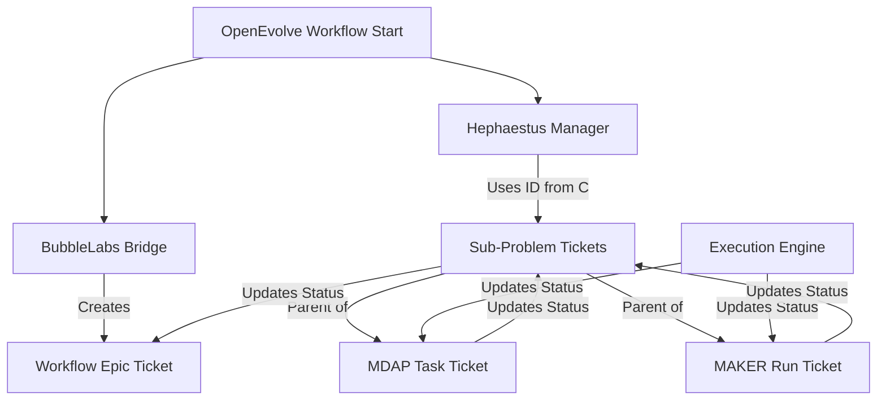

# Hephaestus & OpenEvolve Integration Finalization
## Integration of Integrations

This document details the final integration step connecting the **BubbleLabs Visualization Layer** with the **Hephaestus Execution Layer** within the **OpenEvolve** workflow.

### Overview

Previously, two separate integration paths existed:
1. **BubbleLabsHephaestusBridge**: Created high-level "Epic" tickets for workflows based on BubbleLabs definitions.
2. **HephaestusIntegrationManager**: Handled detailed execution tracking (MDAP tasks, MAKER runs, Sub-problems).

These have now been unified in `openevolve_workflow_manager_integrated.py` to ensure a seamless flow of information.

### Key Changes in `openevolve_workflow_manager_integrated.py`

1. **Unified Manager Initialization**:
   - The `HephaestusIntegrationManager` is now initialized alongside the `BubbleLabsHephaestusBridge`.
   - It accepts the `ticket_id` created by BubbleLabs as its `workflow_epic_id`. This creates a parent-child relationship in Hephaestus between the workflow visualization and the actual execution tasks.

2. **Hierarchical Ticket Structure**:
   - **Level 1 (Epic)**: Created by BubbleLabs Bridge (Workflow Definition).
   - **Level 2 (Story/Task)**: Created by `HephaestusIntegrationManager` (Sub-problems).
   - **Level 3 (Sub-task)**: Created by `HephaestusIntegrationManager` (MDAP Tasks, MAKER Runs).

3. **Active Execution Flow**:
   - The `_solve_sub_problems` method has been enhanced to:
     - Detect if `MDAP` or `MAKER` strategies are enabled.
     - Instantiate the appropriate `MDAPTask` or `MakerConfig` objects.
     - Call `sync_mdap_task` or `sync_maker_run` to create tickets *before* execution.
     - Sync results back to Hephaestus upon completion.

### Integration Flow Diagram

### Verification
The integration ensures that when a user views a Workflow in BubbleLabs, the corresponding Hephaestus ticket contains links to all granular execution details, providing full traceability from high-level intent to low-level agent actions.
