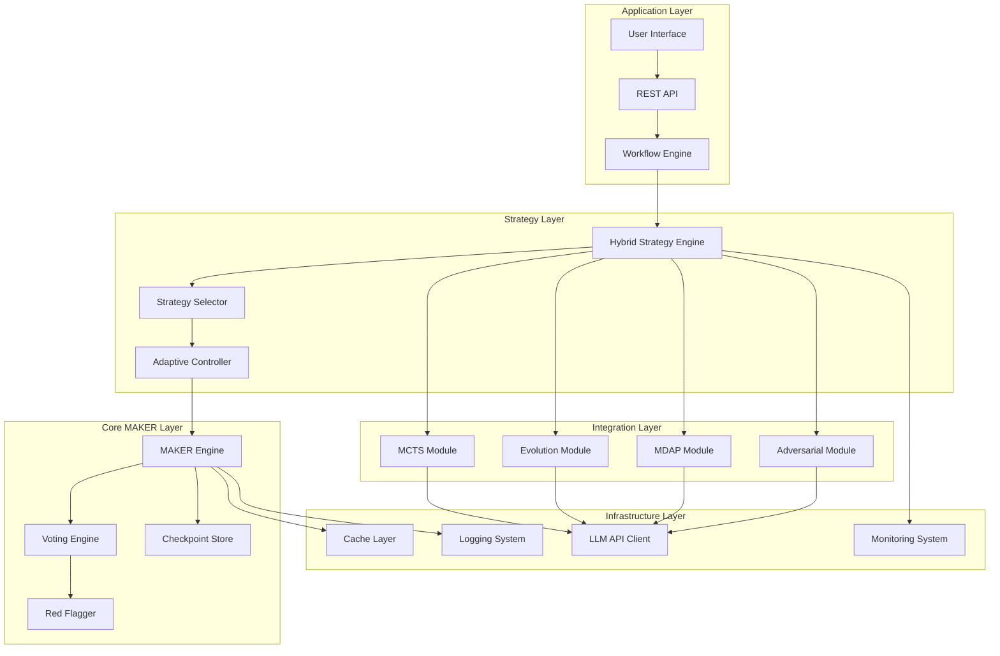
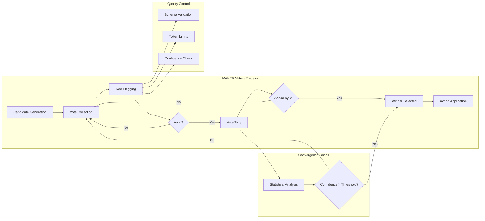
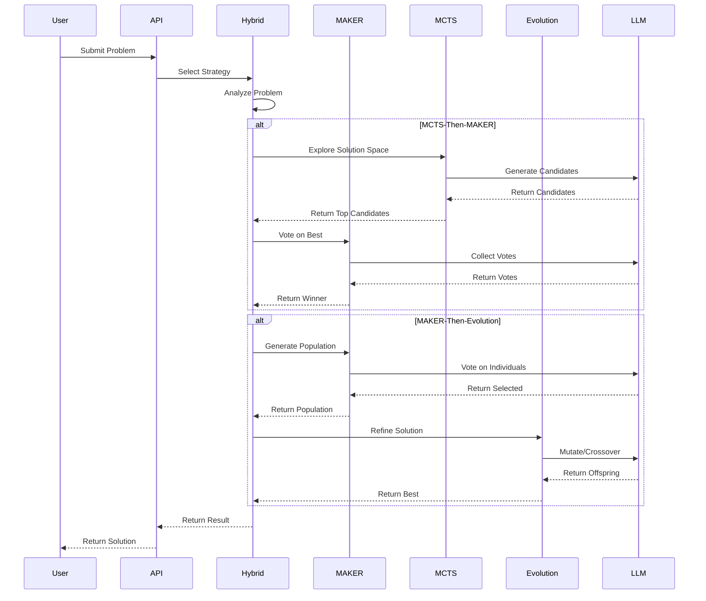
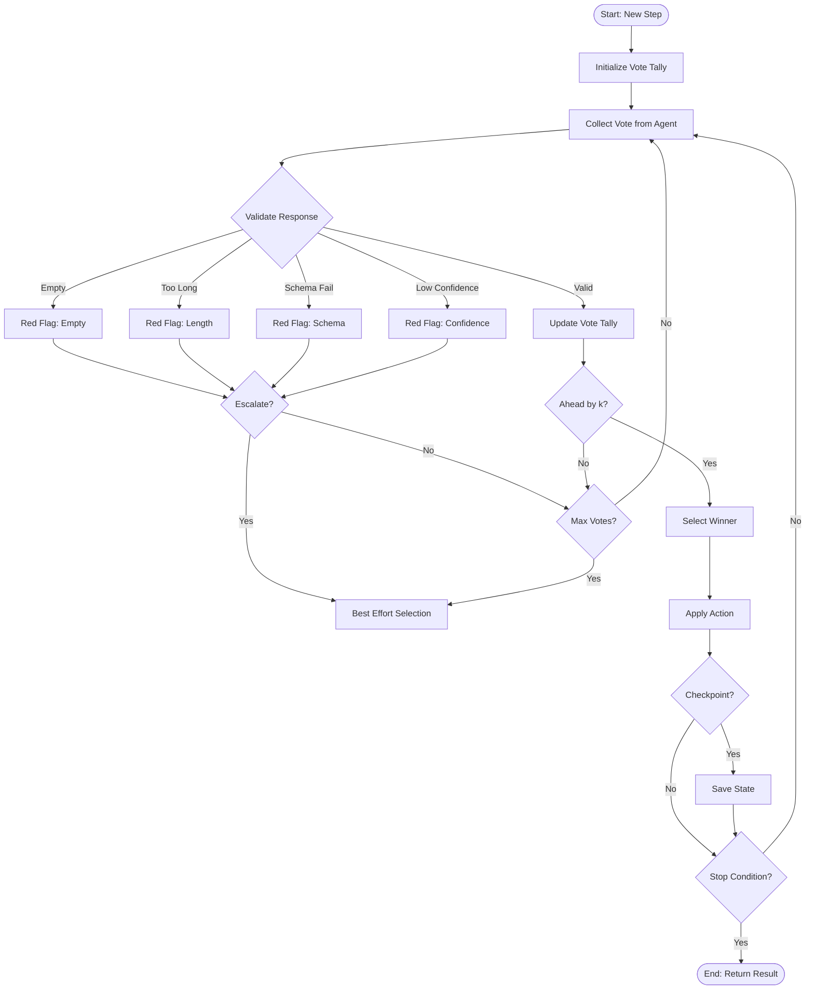
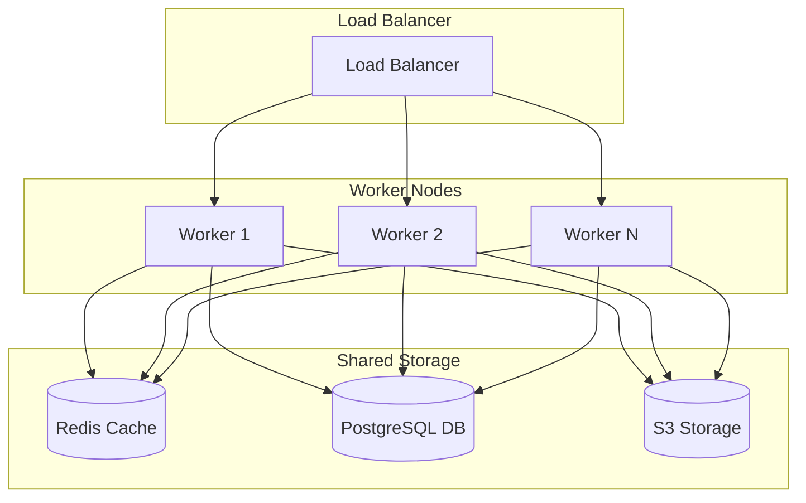

# HYBRID MAKER ARCHITECTURE

## System Architecture Overview

The Hybrid MAKER architecture integrates the MAKER framework (arXiv:2511.09030) with multiple computational strategies including MCTS, Evolutionary Algorithms, and Adversarial Testing. This document provides a comprehensive architectural overview of the hybrid system.

**Paper Reference:** "Solving a Million-Step LLM Task with Zero Errors" (arXiv:2511.09030)

---

## Table of Contents

1. [Architecture Overview](#architecture-overview)
2. [Core Components](#core-components)
3. [Component Diagrams](#component-diagrams)
4. [Data Flow Diagrams](#data-flow-diagrams)
5. [Integration Patterns](#integration-patterns)
6. [Architecture Decisions](#architecture-decisions)
7. [Trade-offs and Design Rationale](#trade-offs-and-design-rationale)
8. [Performance Characteristics](#performance-characteristics)
9. [Scalability Considerations](#scalability-considerations)
10. [Security and Reliability](#security-and-reliability)

---

## Architecture Overview

The Hybrid MAKER system is designed as a layered architecture with clear separation of concerns:

```
┌─────────────────────────────────────────────────────────────┐
│                    Application Layer                        │
│  (User Interfaces, APIs, Workflows)                         │
└─────────────────────────────────────────────────────────────┘
                              ↓
┌─────────────────────────────────────────────────────────────┐
│                   Strategy Layer                            │
│  (Hybrid Strategies, Mode Selection, Adaptive Control)      │
└─────────────────────────────────────────────────────────────┘
                              ↓
┌─────────────────────────────────────────────────────────────┐
│                   Core MAKER Layer                          │
│  (Voting Engine, Red Flagging, Zero-Error Guarantees)       │
└─────────────────────────────────────────────────────────────┘
                              ↓
┌─────────────────────────────────────────────────────────────┐
│                   Integration Layer                         │
│  (MCTS, Evolution, MDAP, Adversarial)                       │
└─────────────────────────────────────────────────────────────┘
                              ↓
┌─────────────────────────────────────────────────────────────┐
│                   Infrastructure Layer                      │
│  (LLM APIs, Caching, Logging, Monitoring)                   │
└─────────────────────────────────────────────────────────────┘
```

### Key Architectural Principles

1. **Modularity**: Each component is independently developed and tested
2. **Extensibility**: New strategies can be added without modifying existing code
3. **Reliability**: Zero-error guarantees through MAKER voting
4. **Adaptivity**: Dynamic strategy selection based on problem characteristics
5. **Performance**: Parallel execution and efficient resource utilization

---

## Core Components

### 1. MAKER Framework Core

The MAKER (Multi-Agent Voting with Escalation and Red-flagging) framework provides the foundation:

```python
class MAKEREngine:
    """Core MAKER engine implementing first-to-ahead-by-k voting"""

    def __init__(self, team: Team, config: MakerConfig):
        self.team = team
        self.config = config
        self.red_flagger = RedFlagger(config.red_flag_rules)
        self.metrics = {
            "steps": 0,
            "votes_cast": 0,
            "red_flags": 0,
            "escalations": 0
        }

    def solve(self, initial_state, step_builder, apply_action,
              checkpoint_store=None, stop_condition=None) -> MakerRunResult:
        """Execute MAKER solving with zero-error guarantees"""
        pass
```

**Key Features:**
- **First-to-Ahead-by-k Voting**: Statistical convergence guarantees
- **Red Flagging**: Quality control for candidate solutions
- **Checkpointing**: Fault tolerance and recovery
- **Multi-Agent Teams**: Collaborative problem solving

### 2. MDAP (Multi-Agent Decomposition and Planning)

MDAP decomposes complex problems into manageable subtasks:

```python
class MDAPOrchestrator:
    """Orchestrates multi-agent task decomposition and execution"""

    def __init__(self, team: Team, config: MDAPConfig):
        self.team = team
        self.config = config
        self.selector = AgentSelector(team)
        self.red_flagger = RedFlagger(config.red_flag_rules)
        self.cache = MDAPCache(config.cache_max_size, config.cache_ttl_seconds)

    def execute_task(self, task: MDAPTask) -> MDAPRunResult:
        """Execute MDAP task with voting-based validation"""
        pass
```

**Key Features:**
- **Task Decomposition**: Break down complex problems
- **Agent Selection**: Intelligent agent assignment
- **Caching**: Performance optimization
- **Fallback Policies**: Graceful degradation

### 3. Hybrid Strategy Engine

Coordinates multiple computational strategies:

```python
class HybridStrategyEngine:
    """Coordinates MAKER with MCTS, Evolution, and Adversarial testing"""

    def __init__(self, config: MAKERHybridConfig):
        self.config = config
        self.strategies = {
            'mcts_then_maker': MCTSThenMAKER,
            'maker_then_evolution': MAKERThenEvolution,
            'maker_adversarial': MAKERAdversarialHybrid,
            'adaptive_maker': AdaptiveMAKERHybrid,
            'maker_mdap_parallel': MAKERMDAPParallel
        }

    def select_strategy(self, problem: ProblemDefinition) -> str:
        """Adaptive strategy selection based on problem characteristics"""
        pass

    async def execute(self, theorem: str, mode: MAKERHybridMode) -> EvolutionResult:
        """Execute selected hybrid strategy"""
        pass
```

---

## Component Diagrams

### High-Level Component Architecture



### MAKER Voting Component



### Hybrid Strategy Integration

```mermaid
graph TB
    subgraph "MCTS-Then-MAKER"
        M1[MCTS Exploration] --> M2[Generate Candidates]
        M2 --> M3[MAKER Voting]
        M3 --> M4[Select Best]
    end

    subgraph "MAKER-Then-Evolution"
        E1[MAKER Voting] --> E2[Initial Population]
        E2 --> E3[Evolution]
        E3 --> E4[Refined Solution]
    end

    subgraph "MAKER-Adversarial"
        A1[Red Team Attack] --> A2[Blue Team Defense]
        A2 --> A3[MAKER Voting]
        A3 --> A4[Robust Solution]
    end

    subgraph "Adaptive MAKER"
        AD1[Monitor Metrics] --> AD2{Strategy?}
        AD2 -->|Low Diversity| AD3[MAKER Voting]
        AD2 -->|High Convergence| AD4[MDAP Decomposition]
        AD2 -->|Normal| AD5[Evolution]
        AD3 --> AD6[Next Generation]
        AD4 --> AD6
        AD5 --> AD6
    end

    subgraph "MAKER-MDAP Parallel"
        P1[MAKER Voting] --> P3[Combine Results]
        P2[MDAP Decomposition] --> P3
        P3 --> P4[Final Solution]
    end
```



---

## Data Flow Diagrams

### Complete Data Flow



### MAKER Voting Data Flow



---

## Integration Patterns

### Pattern 1: Sequential Composition

Used in MCTS-Then-MAKER and MAKER-Then-Evolution:

```python
class SequentialHybridStrategy(HybridStrategy):
    """Base class for sequentially composed strategies"""

    async def generate_proof(self, theorem: str, **kwargs) -> EvolutionResult:
        # Phase 1: Execute first strategy
        result1 = await self._phase1(theorem, **kwargs)

        # Phase 2: Use result1 as input for second strategy
        result2 = await self._phase2(result1, **kwargs)

        return result2
```

**Characteristics:**
- Clear phase boundaries
- Output of phase N becomes input of phase N+1
- Easy to debug and test
- May have longer execution time

### Pattern 2: Parallel Execution

Used in MAKER-MDAP Parallel:

```python
class ParallelHybridStrategy(HybridStrategy):
    """Base class for parallel strategies"""

    async def generate_proof(self, theorem: str, **kwargs) -> EvolutionResult:
        # Launch all strategies in parallel
        tasks = [
            self._run_strategy_A(theorem, **kwargs),
            self._run_strategy_B(theorem, **kwargs),
            self._run_strategy_C(theorem, **kwargs)
        ]

        # Wait for all to complete
        results = await asyncio.gather(*tasks, return_exceptions=True)

        # Combine results
        return self._combine_results(results)
```

**Characteristics:**
- Maximum resource utilization
- Faster execution
- Requires result combination strategy
- May have higher cost

### Pattern 3: Adaptive Switching

Used in Adaptive MAKER:

```python
class AdaptiveHybridStrategy(HybridStrategy):
    """Base class for adaptive strategies"""

    async def generate_proof(self, theorem: str, **kwargs) -> EvolutionResult:
        population = self._initialize_population(theorem)

        for generation in range(self.max_generations):
            # Monitor metrics
            metrics = self._calculate_metrics(population)

            # Select strategy based on metrics
            strategy = self._select_strategy(metrics)

            # Apply selected strategy
            population = await strategy.execute(population)

            # Check convergence
            if self._check_convergence(metrics):
                break

        return self._best_result(population)
```

**Characteristics:**
- Dynamic strategy selection
- Responsive to problem state
- Optimal resource allocation
- Complex implementation

### Pattern 4: Coevolution

Used in MAKER-Adversarial:

```python
class CoevolutionStrategy(HybridStrategy):
    """Base class for adversarial coevolution"""

    async def generate_proof(self, theorem: str, **kwargs) -> EvolutionResult:
        red_team = RedTeam()
        blue_team = BlueTeam()

        for round_num in range(self.adversarial_rounds):
            # Red team generates attacks
            attacks = red_team.generate_attacks(theorem)

            # Blue team generates defenses
            defenses = blue_team.generate_defenses(attacks)

            # MAKER voting selects best
            best = self._vote_on_defenses(defenses)

            # Both teams learn from round
            red_team.learn(best)
            blue_team.learn(attacks)

        return best
```

**Characteristics:**
- Competitive improvement
- Finds edge cases
- Increases robustness
- Requires careful balance

---

## Architecture Decisions

### Decision 1: Layered Architecture

**Rationale:**
- Clear separation of concerns
- Independent component testing
- Easy to modify or replace layers
- Supports multiple interfaces

**Trade-offs:**
- More indirection
- Potential performance overhead
- Increased complexity

**Mitigation:**
- Use efficient data structures
- Minimize cross-layer calls
- Profile and optimize hot paths

### Decision 2: MAKER as Foundation

**Rationale:**
- Zero-error guarantees through voting
- Statistical convergence properties
- Red flagging for quality control
- Proven in million-step tasks

**Trade-offs:**
- Higher computational cost
- Requires multiple agents
- Slower than single-agent approaches

**Mitigation:**
- Parallel vote collection
- Efficient caching
- Adaptive k-values

### Decision 3: Multiple Integration Patterns

**Rationale:**
- Different problems need different strategies
- No single approach is optimal
- Flexibility for users
- Research opportunities

**Trade-offs:**
- Increased code complexity
- More testing surface
- User confusion about which to use

**Mitigation:**
- Clear documentation
- Strategy recommendation engine
- Sensible defaults
- Usage examples

### Decision 4: Async/Await Execution Model

**Rationale:**
- Natural for parallel operations
- Efficient I/O handling
- Compatible with modern Python
- Good performance characteristics

**Trade-offs:**
- Steeper learning curve
- Debugging complexity
- Not all libraries support async

**Mitigation:**
- Comprehensive error handling
- Synchronous fallbacks
- Clear async patterns
- Extensive logging

### Decision 5: Configuration-Driven Behavior

**Rationale:**
- No code changes for tuning
- Easy experimentation
- Configuration as code
- Reproducible results

**Trade-offs:**
- Configuration complexity
- Potential for invalid configs
- Harder to maintain backward compatibility

**Mitigation:**
- Schema validation
- Config presets
- Migration tools
- Comprehensive examples

---

## Trade-offs and Design Rationale

### Performance vs. Accuracy

**MAKER Voting:**
- **High Accuracy**: First-to-ahead-by-k provides statistical guarantees
- **Lower Performance**: Requires multiple votes (N = 2k - 1 minimum)
- **Trade-off Resolution**: Adaptive k-values, parallel voting, caching

### Exploration vs. Exploitation

**MCTS-Then-MAKER:**
- **Exploration**: MCTS searches diverse solution space
- **Exploitation**: MAKER refines best candidates
- **Trade-off Resolution**: Balance exploration constant (C) and voting threshold (k)

### Diversity vs. Convergence

**Evolution:**
- **Diversity**: Population variety prevents local optima
- **Convergence**: Goal is to find optimal solution
- **Trade-off Resolution**: Adaptive diversity thresholds, MAKER voting maintains diversity

### Cost vs. Quality

**Multiple Agents:**
- **Higher Cost**: More LLM API calls
- **Higher Quality**: Multiple perspectives, voting reduces errors
- **Trade-off Resolution**: Caching, efficient prompts, early stopping

### Flexibility vs. Simplicity

**Multiple Strategies:**
- **Flexibility**: Choose optimal approach for each problem
- **Complexity**: More code, more testing, harder to learn
- **Trade-off Resolution**: Sensible defaults, clear documentation, examples

---

## Performance Characteristics

### Computational Complexity

| Strategy | Time Complexity | Space Complexity | Notes |
|----------|----------------|------------------|-------|
| MCTS-Then-MAKER | O(N × C × k) | O(N) | N=simulations, C=exploration constant, k=voting threshold |
| MAKER-Then-Evolution | O(P × G × k) | O(P) | P=population, G=generations, k=voting threshold |
| MAKER-Adversarial | O(R × T × k) | O(T) | R=rounds, T=team size, k=voting threshold |
| Adaptive MAKER | O(G × S × k) | O(P) | G=generations, S=strategies, P=population |
| MAKER-MDAP Parallel | O(max(T1, T2) × k) | O(P) | Parallel execution, T=task time |

### Bottleneck Analysis

**Primary Bottlenecks:**
1. **LLM API Latency**: Dominates execution time
2. **Vote Collection**: Sequential in current implementation
3. **Cache Misses**: Redundant computations

**Optimization Strategies:**
1. **Parallel API Calls**: Concurrent vote collection
2. **Smart Caching**: Cache LLM responses, intermediate results
3. **Batch Processing**: Combine multiple requests
4. **Early Stopping**: Convergence detection

### Scalability Limits

**Vertical Scaling:**
- More CPU cores: Parallel vote collection
- More RAM: Larger populations, deeper search
- Faster storage: Checkpoint I/O

**Horizontal Scaling:**
- Multiple workers: Distributed MAKER voting
- Load balancing: Even distribution of LLM calls
- Shared cache: Redis/Memcached for distributed caching

**Recommended Limits:**
- Population size: 10-50 individuals
- Voting threshold (k): 2-5
- MCTS simulations: 50-200
- Evolution generations: 20-100

---

## Scalability Considerations

### Problem Size Scaling

```
Small Problems (< 100 tokens):
├── Single MAKER pass
├── k = 2-3
└── Population = 10

Medium Problems (100-1000 tokens):
├── MAKER + MDAP decomposition
├── k = 3-4
└── Population = 20-30

Large Problems (> 1000 tokens):
├── Full hybrid pipeline
├── k = 4-5
└── Population = 30-50
```

### Resource Scaling

**CPU-Bound:**
- Vote counting
- Convergence checking
- Population management

**I/O-Bound:**
- LLM API calls
- Checkpoint read/write
- Cache access

**Memory-Bound:**
- Population storage
- MCTS tree
- Vote history

### Distributed Deployment



---

## Security and Reliability

### Zero-Error Guarantees

The MAKER framework provides statistical zero-error guarantees:

**Theorem (First-to-Ahead-by-k):**
For N = 2k - 1 votes with probability p > 0.5 of being correct, the probability that the first-to-ahead-by-k winner is correct approaches 1 as N increases.

**Implementation:**
- Red flagging filters low-quality responses
- Voting ensures majority agreement
- Escalation handles edge cases
- Checkpoints enable recovery

### Fault Tolerance

**Checkpoint/Recovery:**
```python
checkpoint_store = FileCheckpointStore("maker_state.json")

result = maker.solve(
    initial_state,
    step_builder,
    apply_action,
    checkpoint_store=checkpoint_store  # Auto-save every 25 steps
)
```

**Graceful Degradation:**
- Fallback to best-effort if voting fails
- Partial result recovery
- Timeout handling
- Error logging

### Input Validation

**Red Flag Rules:**
```python
red_flag_rules = RedFlagRules(
    max_tokens=750,
    max_characters=6000,
    blocked_patterns=["<script>", "eval("],
    min_confidence=0.2,
    require_schema_match=True
)
```

### Output Sanitization

**Schema Validation:**
```python
def validate_schema(candidate, schema):
    """Validate candidate against expected schema"""
    errors = []
    # Type checking
    # Required fields
    # Value ranges
    return len(errors) == 0, errors
```

---

## Conclusion

The Hybrid MAKER architecture provides a robust, scalable framework for solving complex computational problems. By integrating MAKER's zero-error voting with MCTS exploration, evolutionary optimization, and adversarial testing, the system achieves:

- **Reliability**: Statistical zero-error guarantees
- **Flexibility**: Multiple strategies for different problem types
- **Performance**: Parallel execution and efficient caching
- **Adaptivity**: Dynamic strategy selection
- **Scalability**: Horizontal and vertical scaling options

The modular design allows for easy extension and customization while maintaining the core principles of zero-error computation.

---

**Reference Implementation**: `C:\Users\mmeadow\Documents\OpenEvolve\Frontend\hybrid_maker_integration.py`

**Paper**: https://arxiv.org/abs/2511.09030
