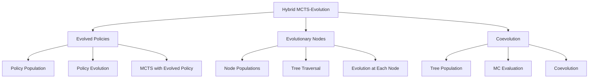

# Hybrid MCTS-Evolution Architecture

## Table of Contents

1. [System Overview](#system-overview)
2. [Conceptual Foundation](#conceptual-foundation)
3. [Architecture Diagrams](#architecture-diagrams)
4. [Data Flow](#data-flow)
5. [Design Decisions](#design-decisions)
6. [Trade-offs Analysis](#trade-offs-analysis)
7. [When to Use Each Approach](#when-to-use-each-approach)
8. [Performance Characteristics](#performance-characteristics)
9. [Scalability Considerations](#scalability-considerations)
10. [Integration Patterns](#integration-patterns)

---

## System Overview

### What is Hybrid MCTS-Evolution?

Hybrid MCTS-Evolution combines two powerful search paradigms:

- **MCTS (Monte Carlo Tree Search)**: Tree-based search that balances exploration and exploitation through UCT (Upper Confidence Bound for Trees)
- **Evolutionary Algorithms**: Population-based optimization that evolves solutions through selection, mutation, and crossover

The hybrid approach leverages the strengths of both:
- MCTS provides directed search with strong theoretical guarantees
- Evolution provides diversity, global exploration, and adaptation

### Three Hybrid Approaches



#### 1. Evolved Policies Approach
- **Concept**: Evolve rollout policies for MCTS simulation phase
- **Key Insight**: Better policies → more accurate value estimates → better MCTS decisions
- **Use Case**: When you have many similar problems to solve

#### 2. Evolutionary Nodes Approach
- **Concept**: Each MCTS node contains a population of action sequences
- **Key Insight**: Local evolution at each node explores multiple paths
- **Use Case**: Complex proofs with many decision points

#### 3. Coevolution Approach
- **Concept**: Coevolve population of proof trees with evaluation function
- **Key Insight**: Trees and evaluator improve together
- **Use Case**: Domain adaptation, learning from experience

---

## Conceptual Foundation

### How MCTS and Evolution Complement Each Other

```
┌─────────────────────────────────────────────────────────────────┐
│                   SYNERGY ANALYSIS                              │
├─────────────────────────────────────────────────────────────────┤
│                                                                 │
│  MCTS Strengths:           Evolution Strengths:                 │
│  ✓ Directed search         ✓ Global exploration                │
│  ✓ Theoretical guarantees   ✓ Diversity maintenance             │
│  ✓ Any-time algorithm      ✓ Parallelization                   │
│  ✓ Adaptive exploration    ✓ Multi-objective optimization      │
│                                                                 │
│  MCTS Weaknesses:          Evolution Weaknesses:               │
│  ✗ Local optima            ✗ Slow convergence                  │
│  ✗ Single path focus       ✗ No theoretical guarantees         │
│  ✗ Policy-dependent        ✗ Premature convergence             │
│                                                                 │
│  Hybrid Benefits:                                               │
│  → Global exploration + directed search                         │
│  → Diversity prevents local optima                              │
│  → Parallel population + sequential tree                        │
│  → Evolution tunes MCTS parameters                              │
│  → MCTS guides evolution with value estimates                   │
│                                                                 │
└─────────────────────────────────────────────────────────────────┘
```

### Theoretical Foundation

#### MCTS Theory (UCT)

MCTS uses UCT (Upper Confidence Bounds for Trees) to balance exploration and exploitation:

```
UCT(i) = W_i/N_i + c * sqrt(ln(N_parent) / N_i)

Where:
- W_i: Total reward from node i
- N_i: Visit count of node i
- c: Exploration constant (typically sqrt(2))
```

**Theoretical Guarantee**: As N → ∞, UCT converges to optimal action

#### Evolution Theory

Evolutionary algorithms optimize through:

1. **Selection**: Prefer better solutions (fitness-proportionate, tournament)
2. **Crossover**: Combine parent solutions
3. **Mutation**: Introduce variation
4. **Survival**: Select next generation

**Theoretical Result**: Converges to global optimum with sufficient time

#### Hybrid Convergence

The hybrid approach inherits properties from both:

- **Local convergence**: MCTS provides directed search
- **Global exploration**: Evolution prevents local optima
- **Adaptation**: Evolution tunes MCTS parameters online

---

## Architecture Diagrams

### Evolved Policies Architecture

```
┌──────────────────────────────────────────────────────────────────┐
│                     EVOLVED POLICIES                             │
├──────────────────────────────────────────────────────────────────┤
│                                                                  │
│  ┌─────────────────────────────────────────────────────────┐    │
│  │              Policy Evolution (Offline)                 │    │
│  │                                                           │    │
│  │  1. Initialize policy population                         │    │
│  │  2. For each policy:                                     │    │
│  │     - Run MCTS on training theorems                      │    │
│  │     - Evaluate: success rate, speed, quality             │    │
│  │  3. Select best policies                                 │    │
│  │  4. Crossover & mutation                                │    │
│  │  5. Repeat for N generations                            │    │
│  └─────────────────────────────────────────────────────────┘    │
│                              │                                  │
│                              ▼                                  │
│  ┌─────────────────────────────────────────────────────────┐    │
│  │              Best Policy (Learned)                       │    │
│  │  - Tactic selection probabilities                        │    │
│  │  - State feature weights                                 │    │
│  │  - Depth preferences                                     │    │
│  └─────────────────────────────────────────────────────────┘    │
│                              │                                  │
│                              ▼                                  │
│  ┌─────────────────────────────────────────────────────────┐    │
│  │              MCTS with Evolved Policy (Online)           │    │
│  │                                                           │    │
│  │  Theorem → MCTS Search ─────┐                            │    │
│  │                │            │                            │    │
│  │                ├─ SELECT ────┤                            │    │
│  │                ├─ EXPAND ────┤                            │    │
│  │                ├─ SIMULATE ──┼──► Use Evolved Policy      │    │
│  │                └─ BACKPROP ──┘                            │    │
│  │                                                           │    │
│  └─────────────────────────────────────────────────────────┘    │
│                                                                  │
└──────────────────────────────────────────────────────────────────┘
```

### Evolutionary Nodes Architecture

```
┌──────────────────────────────────────────────────────────────────┐
│                    EVOLUTIONARY NODES                             │
├──────────────────────────────────────────────────────────────────┤
│                                                                  │
│  ┌─────────────────────────────────────────────────────────┐    │
│  │                      MCTS Tree                          │    │
│  │                                                           │    │
│  │                    [Root Node]                           │    │
│  │                    /   |   \                             │    │
│  │              Pop1  Pop2  Pop3                            │    │
│  │              /   \   |     \                              │    │
│  │           Seq1  Seq2 Seq1  Seq1  Seq2                     │    │
│  │                                                          │    │
│  │  Each Node Contains:                                      │    │
│  │  ┌──────────────────────────────────────────────────┐   │    │
│  │  │  Action Sequence Population                       │   │    │
│  │  │  ┌─────────────┐  ┌─────────────┐                │   │    │
│  │  │  │ Sequence 1  │  │ Sequence 2  │  ...           │   │    │
│  │  │  │ [a,b,c,d]   │  │ [a,e,f,g]   │                │   │    │
│  │  │  │ Fitness:0.8 │  │ Fitness:0.6 │                │   │    │
│  │  │  └─────────────┘  └─────────────┘                │   │    │
│  │  └──────────────────────────────────────────────────┘   │    │
│  │                                                          │    │
│  │  At Each Node:                                           │    │
│  │  1. Select best sequence from population                 │    │
│  │  2. Expand tree using selected sequence                  │    │
│  │  3. Evolve population:                                   │    │
│  │     - Crossover sequences                                │    │
│  │     - Mutate (add/remove tactics)                        │    │
│  │     - Evaluate fitness                                  │    │
│  │     - Select survivors                                  │    │
│  └─────────────────────────────────────────────────────────┘    │
│                                                                  │
└──────────────────────────────────────────────────────────────────┘
```

### Coevolution Architecture

```
┌──────────────────────────────────────────────────────────────────┐
│                      COEVOLUTION                                 │
├──────────────────────────────────────────────────────────────────┤
│                                                                  │
│  ┌─────────────────────────────────────────────────────────┐    │
│  │               Coevolution Loop                          │    │
│  │                                                           │    │
│  │  ┌────────────────┐              ┌────────────────┐     │    │
│  │  │ Tree Population│              │Evaluator Pop.  │     │    │
│  │  │                │              │                │     │    │
│  │  │ Tree 1         │◄────┐        │ Evaluator 1     │     │    │
│  │  │ Tree 2         │     │        │ Evaluator 2     │     │    │
│  │  │ Tree 3         │     │        │ Evaluator 3     │     │    │
│  │  │ ...            │     └───────►│ ...            │     │    │
│  │  └────────────────┘              └────────────────┘     │    │
│  │         │                                │              │    │
│  │         │                                │              │    │
│  │         ▼                                ▼              │    │
│  │  ┌──────────────────────────────────────────────────┐  │    │
│  │  │         Evaluation Phase                         │  │    │
│  │  │                                                   │  │    │
│  │  │  For each tree, evaluator pair:                  │  │    │
│  │  │  - Run MC simulations on tree                    │  │    │
│  │  │  - Evaluator scores tree                         │  │    │
│  │  │  - Tree scores evaluator (reliable?)             │  │    │
│  └─────────────────────────────────────────────────────┘  │    │
│                          │                                    │
│  ┌────────────────────────┴──────────────────────────────┐   │    │
│  │                                                      │   │    │
│  │  Evolution                                           │   │    │
│  │  - Trees: Survivors = those with high scores         │   │    │
│  │  - Evaluators: Survivors = accurate predictors       │   │    │
│  │  - Crossover & mutation                              │   │    │
│  │                                                      │   │    │
│  └──────────────────────────────────────────────────────┘   │    │
│                          │                                    │
│                          └────► Repeat for N generations      │
│                                                           │    │
│  ┌─────────────────────────────────────────────────────┐  │    │
│  │              Output: Best Tree                      │  │    │
│  │  - Coevolved with evaluator                        │  │    │
│  │  - Adapted to evaluation function                  │  │    │
│  └─────────────────────────────────────────────────────┘  │    │
│                                                                  │
└──────────────────────────────────────────────────────────────────┘
```

### Unified Framework

```
┌──────────────────────────────────────────────────────────────────┐
│                  UNIFIED HYBRID FRAMEWORK                        │
├──────────────────────────────────────────────────────────────────┤
│                                                                  │
│  ┌─────────────────────────────────────────────────────────┐    │
│  │                   HybridMCTSConfig                      │    │
│  │  - approach: EVOLVED_POLICIES | EVOLUTIONARY_NODES |   │    │
│  │              COEVOLUTION | ADAPTIVE | COMBINED        │    │
│  │  - population_size: int                                  │    │
│  │  - generations: int                                      │    │
│  │  - mutation_rate: float                                  │    │
│  │  - crossover_rate: float                                 │    │
│  │  - mcts_config: MCTSConfig                               │    │
│  └─────────────────────────────────────────────────────────┘    │
│                              │                                  │
│                              ▼                                  │
│  ┌─────────────────────────────────────────────────────────┐    │
│  │                 AdaptiveHybridSelector                   │    │
│  │                                                           │    │
│  │  Analyze problem features:                                │    │
│  │  - Complexity: # of goals, depth                         │    │
│  │  - Domain: arithmetic, algebra, topology                 │    │
│  │  - Resources: time, compute                              │    │
│  │                                                           │    │
│  │  Select best approach:                                    │    │
│  │  - Simple, similar problems → Evolved Policies           │    │
│  │  - Complex, large search → Evolutionary Nodes            │    │
│  │  - Domain-specific → Coevolution                         │    │
│  └─────────────────────────────────────────────────────────┘    │
│                              │                                  │
│                              ▼                                  │
│  ┌─────────────────────────────────────────────────────────┐    │
│  │                   HybridMCTSEngine                       │    │
│  │                                                           │    │
│  │  ┌─────────────────┐  ┌─────────────────┐               │    │
│  │  │ EvolvedPolicy   │  │ Evolutionary    │               │    │
│  │  │ MCTS            │  │ NodeMCTS        │               │    │
│  │  └─────────────────┘  └─────────────────┘               │    │
│  │                                                           │    │
│  │  ┌─────────────────┐  ┌─────────────────┐               │    │
│  │  │ TreeCoevolution │  │ Combined        │               │    │
│  │  │                 │  │ HybridMCTS      │               │    │
│  │  └─────────────────┘  └─────────────────┘               │    │
│  │                                                          │    │
│  └─────────────────────────────────────────────────────────┘    │
│                              │                                  │
│                              ▼                                  │
│  ┌─────────────────────────────────────────────────────────┐    │
│  │                  HybridMCTSResult                       │    │
│  │  - best_proof: LeanProof                                 │    │
│  │  - success: bool                                         │    │
│  │  - approach_used: str                                    │    │
│  │  - time_elapsed: float                                   │    │
│  │  - evolution_metrics: EvolutionMetrics                   │    │
│  │  - mcts_metrics: MCTSMetrics                             │    │
│  └─────────────────────────────────────────────────────────┘    │
│                                                                  │
└──────────────────────────────────────────────────────────────────┘
```

---

## Data Flow

### Evolved Policies Data Flow

```
┌─────────────────────────────────────────────────────────────────┐
│               EVOLVED POLICIES DATA FLOW                        │
└─────────────────────────────────────────────────────────────────┘

  TRAINING PHASE (Offline)

  ┌──────────────┐
  │ Training     │
  │ Theorems     │
  └──────┬───────┘
         │
         ▼
  ┌──────────────────────────────────────────┐
  │  PolicyEvolutionEngine                   │
  │                                          │
  │  For generation in 1..N:                │
  │                                          │
  │    ┌────────────────────────────────┐   │
  │    │ For each policy in population: │   │
  │    │                                │   │
  │    │   ┌────────────────────────┐   │   │
  │    │   │ Run MCTS with policy   │   │   │
  │    │   │ on all training theorems│   │   │
  │    │   └────────┬───────────────┘   │   │
  │    │            │                    │   │
  │    │            ▼                    │   │
  │    │   ┌────────────────────────┐   │   │
  │    │   │ Evaluate:             │   │   │
  │    │   │ - Success rate        │   │   │
  │    │   │ - Avg time            │   │   │
  │    │   │ - Proof quality       │   │   │
  │    │   └────────┬───────────────┘   │   │
  │    │            │                    │   │
  │    │            └──► Fitness         │   │
  │    └────────────────────────────────┘   │
  │                                          │
  │    ┌────────────────────────────────┐   │
  │    │ Selection (Tournament)         │   │
  │    │ Crossover (Policy blending)    │   │
  │    │ Mutation (Random perturbation) │   │
  │    └────────────────────────────────┘   │
  └───────────────────┬──────────────────────┘
                      │
                      ▼
           ┌─────────────────────┐
           │  BestPolicyGenome   │
           │  - tactic_weights   │
           │  - state_features   │
           │  - depth_params     │
           └─────────────────────┘

  INFERENCE PHASE (Online)

  ┌──────────────┐
  │ New Theorem  │
  └──────┬───────┘
         │
         ▼
  ┌──────────────────────────────────────────┐
  │  EvolvedPolicyMCTS                        │
  │                                          │
  │  Load learned policy                      │
  │         │                                 │
  │         ▼                                 │
  │  ┌──────────────────────────────────┐    │
  │  │ MCTS Search with Learned Policy │    │
  │  │                                  │    │
  │  │  SELECT ──► UCT selection        │    │
  │  │  EXPAND ──► Get actions          │    │
  │  │  SIMULATE ──► Use learned policy │◄───┼── Policy guides
  │  │  BACKPROP ──► Update stats       │    │     rollouts
  │  └──────────────────────────────────┘    │
  └──────────────┬───────────────────────────┘
                 │
                 ▼
          ┌─────────────┐
          │  Proof      │
          └─────────────┘
```

### Evolutionary Nodes Data Flow

```
┌─────────────────────────────────────────────────────────────────┐
│            EVOLUTIONARY NODES DATA FLOW                          │
└─────────────────────────────────────────────────────────────────┘

  ┌──────────────┐
  │ Theorem      │
  └──────┬───────┘
         │
         ▼
  ┌──────────────────────────────────────────┐
  │  EvolutionaryMCTS                         │
  │                                          │
  │  Initialize root node                     │
  │  root.population = [random_sequences]    │
  └──────────────┬───────────────────────────┘
                 │
                 ▼
  ┌──────────────────────────────────────────┐
  │  MCTS Iteration Loop                     │
  │                                          │
  │  ┌────────────────────────────────────┐ │
  │  │ SELECT: Traverse to leaf           │ │
  │  │  - At each node:                   │ │
  │  │    - Select best sequence from     │ │
  │  │      node.population               │ │
  │  │    - Follow sequence to child      │ │
  │  └────────────┬───────────────────────┘ │
  │               │                         │
  │               ▼                         │
  │  ┌────────────────────────────────────┐ │
  │  │ EXPAND: Add children               │ │
  │  │  - Create child node               │ │
  │  │  - Initialize child.population     │ │
  │  │  - Evolve parent.population:       │ │
  │  │    - Crossover sequences           │ │
  │  │    - Mutate (add/remove tactics)   │ │
  │  │    - Select survivors              │ │
  │  └────────────┬───────────────────────┘ │
  │               │                         │
  │               ▼                         │
  │  ┌────────────────────────────────────┐ │
  │  │ SIMULATE: Rollout from leaf        │ │
  │  │  - Use best sequence from          │ │
  │  │    leaf.population                 │ │
  │  └────────────┬───────────────────────┘ │
  │               │                         │
  │               ▼                         │
  │  ┌────────────────────────────────────┐ │
  │  │ BACKPROP: Update all nodes         │ │
  │  │  - Update visit counts             │ │
  │  │  - Update sequence fitness         │ │
  │  └────────────┬───────────────────────┘ │
  │               │                         │
  │               └─────► Repeat ───────────┘
  └──────────────┬───────────────────────────┘
                 │
                 ▼
          ┌─────────────┐
          │  Proof      │
          │  (Best path)│
          └─────────────┘
```

### Coevolution Data Flow

```
┌─────────────────────────────────────────────────────────────────┐
│                 COEVOLUTION DATA FLOW                            │
└─────────────────────────────────────────────────────────────────┘

  ┌──────────────┐
  │ Training     │
  │ Theorems     │
  └──────┬───────┘
         │
         ▼
  ┌──────────────────────────────────────────┐
  │  Initialize:                              │
  │  - Tree population (random proof trees)  │
  │  - Evaluator population (random weights) │
  └──────────────┬───────────────────────────┘
                 │
                 ▼
  ┌──────────────────────────────────────────┐
  │  Coevolution Generation Loop             │
  │                                          │
  │  For each (tree, evaluator) pair:        │
  │                                          │
  │    ┌────────────────────────────────┐   │
  │    │ Evaluate tree with evaluator  │   │
  │    │  - Run MC simulations          │   │
  │    │  - Evaluator scores tree       │   │
  │    └────────────┬───────────────────┘   │
  │                 │                        │
  │                 ▼                        │
  │    ┌────────────────────────────────┐   │
  │    │ Score evaluator                │   │
  │    │  - Compare prediction to actual│   │
  │    │  - Accuracy metric             │   │
  │    └────────────────────────────────┘   │
  │                                          │
  │  ┌────────────────────────────────────┐ │
  │  │ Evolution:                         │ │
  │  │  - Trees: Select by score          │ │
  │  │  - Evaluators: Select by accuracy  │ │
  │  │  - Crossover & mutation           │ │
  │  └────────────┬───────────────────────┘ │
  └───────────────┼─────────────────────────┘
                  │
                  └────► Repeat N generations
                  │
                  ▼
  ┌──────────────────────────────────────────┐
  │  Select best tree from final population  │
  └──────────────┬───────────────────────────┘
                 │
                 ▼
          ┌─────────────┐
          │  Proof Tree │
          └─────────────┘
```

---

## Design Decisions

### Why These Three Approaches?

| Aspect | Evolved Policies | Evolutionary Nodes | Coevolution |
|--------|------------------|-------------------|-------------|
| **Primary Goal** | Better rollouts | Better node selection | Better overall strategy |
| **When to Use** | Similar problems, repeated use | Complex proofs, large search | Domain adaptation |
| **Training** | Offline required | Online, during search | Offline or online |
| **Compute** | Low (online), High (offline) | Medium | High |
| **Memory** | Low (policy only) | High (population per node) | High (tree population) |

### Key Design Decisions

#### 1. Policy Representation (Evolved Policies)

**Decision**: Use parametric policy (weights, features) not policy network

**Rationale**:
- Easier to evolve (gradient-free)
- More interpretable
- Lower computational cost
- Sufficient for heuristic guidance

**Trade-off**: Less expressive than neural network

#### 2. Population Per Node (Evolutionary Nodes)

**Decision**: Maintain population at each MCTS node

**Rationale**:
- Explores multiple action sequences simultaneously
- Local adaptation to node context
- Parallel evaluation possible

**Trade-off**: High memory usage for deep trees

#### 3. Separate Evaluator Population (Coevolution)

**Decision**: Coevolve trees + evaluators, not just trees

**Rationale**:
- Avoids overfitting to fixed evaluator
- Learns robust evaluation function
- Adapts to domain characteristics

**Trade-off**: Doubles population size, more compute

#### 4. Unified Framework

**Decision**: Single interface for all approaches

**Rationale**:
- Easy comparison and switching
- Adaptive selection possible
- Consistent API

**Trade-off**: More complex interface

---

## Trade-offs Analysis

### Performance vs Accuracy

```
┌──────────────────────────────────────────────────────────────┐
│                   PERFORMANCE VS ACCURACY                    │
├──────────────────────────────────────────────────────────────┤
│                                                              │
│  High Accuracy                      High Performance         │
│  ┌────────────────────────┐        ┌─────────────────────┐  │
│  │  Coevolution          │        │  Evolved Policies    │  │
│  │  - Best quality        │        │  - Fastest          │  │
│  │  - Slowest             │        │  - Good enough      │  │
│  └────────────────────────┘        └─────────────────────┘  │
│                                                              │
│          ┌──────────────────────────────────┐              │
│          │  Evolutionary Nodes              │              │
│          │  - Balanced                      │              │
│          └──────────────────────────────────┘              │
│                                                              │
└──────────────────────────────────────────────────────────────┘
```

### Complexity vs Maintainability

```
┌──────────────────────────────────────────────────────────────┐
│                COMPLEXITY VS MAINTAINABILITY                 │
├──────────────────────────────────────────────────────────────┤
│                                                              │
│  Low Complexity                  High Complexity             │
│  ┌────────────────────────┐        ┌─────────────────────┐  │
│  │  Evolved Policies      │        │  Coevolution        │  │
│  │  - Simple              │        │  - Most complex     │  │
│  │  - Easy to debug       │        │  - Hard to debug    │  │
│  └────────────────────────┘        └─────────────────────┘  │
│                                                              │
│          ┌──────────────────────────────────┐              │
│          │  Evolutionary Nodes              │              │
│          │  - Moderate                      │              │
│          └──────────────────────────────────┘              │
│                                                              │
└──────────────────────────────────────────────────────────────┘
```

### Scalability Analysis

| Approach | Time Complexity | Space Complexity | Scalability |
|----------|----------------|------------------|-------------|
| **Evolved Policies** | O(C * log N) | O(N) | Excellent |
| **Evolutionary Nodes** | O(C * N * P) | O(N * P) | Good |
| **Coevolution** | O(G * T * E) | O(T + E) | Moderate |

Where:
- C: MCTS simulations
- N: Tree nodes
- P: Population size per node
- G: Coevolution generations
- T: Tree population
- E: Evaluator population

---

## When to Use Each Approach

### Decision Matrix

```
                              Problem Complexity
                                   │
                ┌──────────────────┴──────────────────┐
                │                                     │
           Low/Medium                             High
                │                                     │
                ▼                                     ▼
    ┌───────────────────────┐           ┌─────────────────────────┐
    │                       │           │                         │
    │  Search Space Size    │           │  Search Space Size      │
    │                       │           │                         │
    │  Small     Large      │           │  Small        Large     │
    │   │          │         │           │   │            │         │
    │   │          └────┐    │           │   │            └───┐     │
    │   │               │    │           │   │                │     │
    │   ▼               ▼    │           │   ▼                ▼     │
    │ Evolved        Evolutionary│       │ Evolutionary      Coevo  │
    │ Policies       Nodes      │       │ Nodes             lution │
    │                         │           │                         │
    └───────────────────────┘           └─────────────────────────┘
```

### Detailed Decision Tree

```
START
  │
  ├─ Is training data available?
  │   ├─ Yes → Go to A
  │   └─ No → Use Evolutionary Nodes
  │
A ├─ Are problems similar?
  │ ├─ Yes → Go to B
  │ └─ No → Use Evolutionary Nodes
  │
B ├─ Is time critical (online inference)?
  │ ├─ Yes → Use Evolved Policies (train offline)
  │ └─ No → Go to C
  │
C ├─ Is problem complexity high?
  │ ├─ Yes → Go to D
  │ └─ No → Use Evolved Policies
  │
D ├─ Is search space large?
  │ ├─ Yes → Use Coevolution
  │ └─ No → Use Evolutionary Nodes
```

### Use Case Profiles

#### Evolved Policies Best For:

- **Theorem batching**: Many similar theorems (e.g., arithmetic)
- **Production systems**: Fast inference required
- **Limited resources**: Lower compute budget
- **Interpretability**: Need to understand policy

**Examples**:
- Commutativity theorems (a + b = b + a)
- Associativity theorems
- Identity theorems

#### Evolutionary Nodes Best For:

- **Complex proofs**: Multiple decision points
- **Dynamic environments**: Problem changes during search
- **Parallel resources**: Can evaluate populations in parallel
- **Balanced needs**: Moderate quality, moderate speed

**Examples**:
- Induction proofs with multiple cases
- Proof by contradiction
- Existential proofs

#### Coevolution Best For:

- **Domain adaptation**: Learning domain-specific strategies
- **Research**: Exploring new proof techniques
- **High-value problems**: Worth the extra compute
- **Long-running**: Can afford extended training

**Examples**:
- New mathematical domains
- Competition problems
- Novel proof strategies

---

## Performance Characteristics

### Convergence Properties

| Approach | Convergence Rate | Convergence Quality | Stability |
|----------|------------------|---------------------|-----------|
| **Evolved Policies** | Fast | Good | High (offline) |
| **Evolutionary Nodes** | Medium | Very Good | Medium |
| **Coevolution** | Slow | Excellent | Low (arms race) |

### Success Rate vs Time

```
Success Rate
    │
 1.0│                    ┌───────── Coevolution
    │                   ╱
 0.8│                  ╱
    │                 ╱  ┌────────── Evolutionary Nodes
 0.6│                ╱  ╱
    │               ╱  ╱
 0.4│              ╱  ╱  ┌─────── Evolved Policies
    │             ╱  ╱  ╱
 0.2│            ╱  ╱  ╱
    │           ╱  ╱  ╱
 0.0└──────────────────────────────────────► Time
    0        10s       30s      60s
```

### Memory Usage

```
Memory (MB)
    │
    │  ╱╱╱╱╱╱╱╱╱╱╱╱╱╱╱╱╱╱╱╱╱╱  Coevolution
    │ ╱                            (Tree pop + Eval pop)
    │╱
    │ ──────────────────────────── Evolutionary Nodes
    │                              (Pop per node)
    │
    │
    │ ─────────────────────────── Evolved Policies
    │                              (Policy only)
    │
    └──────────────────────────────────────────► Tree Size
    0        100       1000      10000
```

---

## Scalability Considerations

### Horizontal Scaling

| Approach | Embarrassingly Parallel | Needs Sync | Scaling Efficiency |
|----------|------------------------|------------|-------------------|
| **Evolved Policies** | Yes (training) | No | 95%+ |
| **Evolutionary Nodes** | Partial | Yes (per node) | 70-80% |
| **Coevolution** | Partial | Yes (generations) | 60-70% |

### Vertical Scaling

| Approach | CPU-bound | Memory-bound | I/O-bound | GPU-acceleratable |
|----------|-----------|--------------|-----------|-------------------|
| **Evolved Policies** | ✓ | ✗ | ✗ | ✓ (with NN policy) |
| **Evolutionary Nodes** | ✓ | ✓ | ✗ | Partial |
| **Coevolution** | ✓ | ✓ | Partial | ✓ (with NN evaluator) |

### Large-Scale Considerations

#### Problem Size: 10K+ Theorems

**Recommended**: Evolved Policies
- Train once, use many times
- Amortizes training cost
- Fast inference

#### Problem Size: 100-10K Theorems

**Recommended**: Evolutionary Nodes
- Good balance
- Adapts to problem
- Reasonable cost

#### Problem Size: <100 Theorems

**Recommended**: Coevolution or Evolutionary Nodes
- Quality over speed
- Can afford compute
- Explore strategies

---

## Integration Patterns

### Pattern 1: Offline Training, Online Inference

```python
# Offline
engine = PolicyEvolutionEngine()
best_policy = engine.evolve_policies(
    test_theorems=training_set,
    generations=50
)

# Online
mcts = EvolvedPolicyMCTS(policy=best_policy)
proof = mcts.search(new_theorem)
```

### Pattern 2: Online Evolution During Search

```python
mcts = EvolutionaryMCTS()
proof = mcts.search(
    theorem,
    population_size=20,
    evolve_per_node=True
)
```

### Pattern 3: Adaptive Hybrid

```python
selector = AdaptiveHybridSelector()
approach = selector.select_approach(theorem, features)

mcts = HybridMCTSEngine(approach=approach)
proof = mcts.search(theorem)
```

### Pattern 4: Combined Approaches

```python
combined = CombinedHybridMCTS()
proof = combined.search_combined(
    theorem,
    approaches=[
        HybridMCTSApproach.EVOLVED_POLICIES,
        HybridMCTSApproach.EVOLUTIONARY_NODES
    ],
    combination_method="voting"
)
```

---

## Summary

### Key Takeaways

1. **Hybrid MCTS-Evolution** combines strengths of both paradigms
2. **Three approaches** for different use cases
3. **Unified framework** enables easy switching
4. **Adaptive selection** optimizes automatically
5. **Scalable** from small to large problems

### When to Choose Hybrid Over Pure MCTS

| Situation | Pure MCTS | Hybrid |
|-----------|-----------|--------|
| Simple problem | ✓ | ✗ |
| Similar problems | ✗ | ✓ (Evolved Policies) |
| Complex proof | ✗ | ✓ (Evolutionary Nodes) |
| Domain-specific | ✗ | ✓ (Coevolution) |
| Fastest inference | ✓ | ✗ |
| Best quality | ✗ | ✓ |

### Future Enhancements

- Neural network policies (deep RL)
- Multi-objective coevolution
- Transfer learning between domains
- Distributed evolution
- Online adaptation

---

**Document Version**: 1.0
**Last Updated**: 2025-12-30
**Author**: OpenEvolve Frontend Team
**Related Docs**:
- [HYBRID_MCTS_API.md](./HYBRID_MCTS_API.md)
- [HYBRID_MCTS_GUIDE.md](./HYBRID_MCTS_GUIDE.md)
- [HYBRID_MCTS_EXAMPLES.md](./HYBRID_MCTS_EXAMPLES.md)
