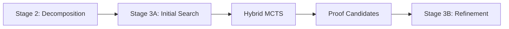

# Hybrid MCTS-Evolution Integration Guide

## Table of Contents

1. [OpenEvolve Integration](#openevolve-integration)
2. [LeanAide Integration](#leanaide-integration)
3. [Workflow Integration](#workflow-integration)
4. [REST API Integration](#rest-api-integration)
5. [Third-Party Integration](#third-party-integration)

---

## OpenEvolve Integration

### Stage 3A: Initial Search

Hybrid MCTS integrates into OpenEvolve Stage 3 (Search & Refinement).

```python
from hybrid_mcts_workflow import HybridMCTSWorkflowIntegrator

# Configure for Stage 3A
config = HybridMCTSConfig(
    approach=HybridMCTSApproach.EVOLVED_POLICIES,
    mcts_simulations=500,
    time_budget=30.0
)

integrator = HybridMCTSWorkflowIntegrator(config)

# Stage 3A: Initial search
result = await integrator.stage_3a_initial_search(
    sub_problem=problem,
    exploration_depth=2
)
```

**Integration Points**:



### Stage 3B: Parallel Exploration

Run multiple hybrid approaches in parallel.

```python
# Stage 3B: Parallel refinement
results = await integrator.stage_3b_parallel_exploration(
    sub_problem=problem,
    approaches=[
        HybridMCTSApproach.EVOLVED_POLICIES,
        HybridMCTSApproach.EVOLUTIONARY_NODES,
        HybridMCTSApproach.COEVOLUTION
    ],
    time_per_approach=20.0
)

# Select best result
best_result = integrator.select_best_result(results)
```

### Stage 3C: Refinement

Refine candidates with thorough search.

```python
# Stage 3C: Refinement
refined_result = await integrator.stage_3c_refinement(
    candidate=best_result,
    refinement_config=HybridMCTSPresets.thorough(),
    verification_enabled=True
)
```

### Complete Workflow Integration

```python
from openevolve import OpenEvolveOrchestrator
from hybrid_mcts_workflow import HybridMCTSWorkflowIntegrator

async def solve_with_openevolve(theorem: str):
    """Complete OpenEvolve workflow with Hybrid MCTS."""

    # Initialize orchestrator
    orchestrator = OpenEvolveOrchestrator()

    # Configure hybrid MCTS integration
    hybrid_config = HybridMCTSConfig(
        approach=HybridMCTSApproach.ADAPTIVE,
        enable_adaptive_selection=True
    )

    integrator = HybridMCTSWorkflowIntegrator(hybrid_config)

    # Stage 1: Problem Analysis
    analysis = await orchestrator.analyze_problem(theorem)

    # Stage 2: Decomposition
    sub_problems = await orchestrator.decompose_problem(analysis)

    # Stage 3: Search (with Hybrid MCTS)
    solutions = []
    for sub_problem in sub_problems:
        solution = await integrator.solve_with_hybrid_mcts(
            sub_problem=sub_problem,
            stage="3b_parallel"  # Use parallel exploration
        )
        solutions.append(solution)

    # Stage 4: Synthesis
    final_proof = await orchestrator.synthesize_solutions(solutions)

    # Stage 5: Verification
    verified = await orchestrator.verify_proof(final_proof)

    return final_proof if verified else None
```

---

## LeanAide Integration

### Translation

Hybrid MCTS uses LeanAide for theorem translation.

```python
from hybrid_mcts import HybridMCTSEngine, HybridMCTSConfig

# Enable LeanAide integration
config = HybridMCTSConfig(
    leanaide_enabled=True,
    leanaide_host="localhost",
    leanaide_port=7654,
    leanaide_timeout=30.0
)

engine = HybridMCTSEngine(config)

# Theorem is automatically translated
theorem = "For all n, n + 0 = n"  # Natural language
result = await engine.search(theorem)

# LeanAide metrics available
if result.leanaide_metrics:
    print(f"Translation: {result.leanaide_metrics.translation_success}")
    print(f"Lean code: {result.leanaide_metrics.lean_code}")
```

### Verification

Formal verification with LeanAide.

```python
# Enable verification
config.leanaide_enabled = True
config.enable_lean_verification = True

result = await engine.search(theorem)

# Check verification
if result.leanaide_metrics:
    if result.leanaide_metrics.verification_success:
        print("✓ Formally verified")
    else:
        print("✗ Verification failed")
        for error in result.leanaide_metrics.errors:
            print(f"  {error}")
```

### Feedback Loop

Use LeanAide feedback to improve search.

```python
from hybrid_mcts import LeanAideFeedbackLoop

feedback = LeanAideFeedbackLoop(
    engine=engine,
    feedback_frequency=10  # Every 10 iterations
)

async def search_with_feedback(theorem: str):
    """Search with LeanAide feedback."""

    async def on_iteration(iteration, result):
        # Get LeanAide feedback
        feedback_result = await feedback.get_feedback(
            current_best=result.best_proof
        )

        if feedback_result.has_errors:
            # Adjust search based on feedback
            feedback.adjust_search_strategy(feedback_result.errors)

        return iteration < 100

    result = await engine.search(
        theorem,
        iteration_callback=on_iteration
    )

    return result
```

---

## Workflow Integration

### Integrator Class

Complete workflow integration class.

```python
from hybrid_mcts_workflow import HybridMCTSWorkflowIntegrator

class HybridMCTSWorkflowIntegrator:
    """Integration with OpenEvolve workflow."""

    def __init__(self, config: HybridMCTSConfig):
        self.config = config
        self.engine = HybridMCTSEngine(config)

    async def solve_with_hybrid_mcts(
        self,
        sub_problem: SubProblem,
        approach: Optional[HybridMCTSApproach] = None,
        **kwargs
    ) -> ProofSolution:
        """
        Solve subproblem using hybrid MCTS.

        Args:
            sub_problem: Decomposed subproblem
            approach: Specific approach to use
            **kwargs: Additional parameters

        Returns:
            ProofSolution
        """

        # Extract theorem from subproblem
        theorem = sub_problem.statement

        # Configure approach
        if approach:
            self.config.approach = approach

        # Search
        result = await self.engine.search(
            theorem,
            **kwargs
        )

        # Convert to ProofSolution
        solution = ProofSolution(
            sub_problem_id=sub_problem.id,
            proof=result.best_proof,
            confidence=result.mcts_confidence,
            approach_used=result.approach_used,
            metrics=result.to_dict()
        )

        return solution

    async def batch_solve(
        self,
        sub_problems: List[SubProblem],
        parallel: bool = True
    ) -> List[ProofSolution]:
        """Solve multiple subproblems."""

        if parallel:
            tasks = [
                self.solve_with_hybrid_mcts(sp)
                for sp in sub_problems
            ]
            solutions = await asyncio.gather(*tasks)
        else:
            solutions = []
            for sp in sub_problems:
                solution = await self.solve_with_hybrid_mcts(sp)
                solutions.append(solution)

        return solutions

    def select_best_result(
        self,
        results: List[ProofSolution]
    ) -> ProofSolution:
        """Select best solution from candidates."""

        # By confidence
        return max(results, key=lambda r: r.confidence)
```

### Workflow Example

Complete workflow example.

```python
import asyncio
from hybrid_mcts_workflow import HybridMCTSWorkflowIntegrator
from openevolve import OpenEvolveWorkflow

async def complete_workflow():
    """Complete workflow with hybrid MCTS."""

    # Theorem to prove
    theorem = """
    For all natural numbers n,
      sum from i=0 to n of i = n*(n+1)/2
    """

    # Initialize workflow
    workflow = OpenEvolveWorkflow()

    # Configure hybrid MCTS integration
    hybrid_config = HybridMCTSConfig(
        approach=HybridMCTSApproach.ADAPTIVE,
        enable_adaptive_selection=True,
        leanaide_enabled=True
    )

    integrator = HybridMCTSWorkflowIntegrator(hybrid_config)

    # Decompose problem
    sub_problems = await workflow.decompose(theorem)

    print(f"Decomposed into {len(sub_problems)} sub-problems")

    # Solve each with hybrid MCTS
    solutions = await integrator.batch_solve(
        sub_problems,
        parallel=True
    )

    # Synthesize final proof
    final_proof = await workflow.synthesize(solutions)

    # Verify
    verification = await workflow.verify(final_proof)

    if verification.success:
        print("✓ Proof verified successfully")
        print(final_proof.lean_code)
    else:
        print("✗ Verification failed")

    return final_proof

if __name__ == "__main__":
    asyncio.run(complete_workflow())
```

---

## REST API Integration

### API Endpoints

REST API for hybrid MCTS service.

```python
from fastapi import FastAPI, HTTPException
from hybrid_mcts import HybridMCTSEngine, HybridMCTSConfig

app = FastAPI(title="Hybrid MCTS API")

# Global engine
engine: HybridMCTSEngine = None

@app.on_event("startup")
async def startup():
    """Initialize engine."""
    config = HybridMCTSConfig(
        approach=HybridMCTSApproach.ADAPTIVE,
        enable_caching=True
    )
    global engine
    engine = HybridMCTSEngine(config)

@app.post("/search")
async def search_theorem(request: SearchRequest):
    """Search for proof."""
    try:
        result = await engine.search(
            theorem=request.theorem,
            time_budget=request.time_budget
        )
        return SearchResponse(
            success=result.success,
            proof=result.best_proof.lean_code if result.best_proof else None,
            confidence=result.mcts_confidence,
            approach=result.approach_used.value,
            time=result.time_elapsed
        )
    except Exception as e:
        raise HTTPException(status_code=500, detail=str(e))

@app.post("/batch")
async def batch_search(request: BatchRequest):
    """Batch search multiple theorems."""
    results = await engine.batch_search(
        request.theorems,
        parallel=request.parallel
    )
    return BatchResponse(results=results)

@app.post("/train")
async def train_policy(request: TrainRequest):
    """Train evolved policy."""
    from hybrid_mcts import PolicyEvolutionEngine

    engine = PolicyEvolutionEngine(request.config)
    policy = await engine.evolve_policies(
        test_theorems=request.theorems,
        generations=request.generations
    )

    # Save policy
    policy_id = f"policy_{uuid.uuid4()}"
    engine.save_policy(policy, f"policies/{policy_id}.json")

    return TrainResponse(policy_id=policy_id, fitness=policy.fitness)

@app.get("/policy/{policy_id}")
async def get_policy(policy_id: str):
    """Load trained policy."""
    from hybrid_mcts import PolicyEvolutionEngine

    try:
        policy = PolicyEvolutionEngine.load_policy(f"policies/{policy_id}.json")
        return PolicyResponse(
            policy_id=policy_id,
            fitness=policy.fitness,
            genome=policy.to_dict()
        )
    except FileNotFoundError:
        raise HTTPException(status_code=404, detail="Policy not found")
```

### Client Usage

```python
import requests

# Search theorem
response = requests.post("http://localhost:8000/search", json={
    "theorem": "For all n, n + 0 = n",
    "time_budget": 30.0
})

result = response.json()
print(f"Success: {result['success']}")
print(f"Proof: {result['proof']}")

# Batch search
response = requests.post("http://localhost:8000/batch", json={
    "theorems": [
        "For all n, n + 0 = n",
        "For all a b, a + b = b + a"
    ],
    "parallel": True
})

batch_result = response.json()
for r in batch_result['results']:
    print(f"{r['theorem']}: {r['success']}")
```

---

## Third-Party Integration

### Integration with SAT Solvers

```python
from hybrid_mcts import HybridMCTSEngine
from sat_solver import SATSolver

class SATHybridMCTS(HybridMCTSEngine):
    """Hybrid MCTS with SAT solver integration."""

    def __init__(self, config, sat_solver):
        super().__init__(config)
        self.sat_solver = sat_solver

    async def search_with_sat(self, theorem: str):
        """Search using SAT solver hints."""

        # Get SAT solver constraints
        constraints = await self.sat_solver.get_constraints(theorem)

        # Use constraints to guide search
        self.config.constraints = constraints

        result = await self.search(theorem)

        return result
```

### Integration with Computer Algebra Systems

```python
from sympy import simplify, expand

class CASGuidedMCTS(HybridMCTSEngine):
    """MCTS guided by CAS."""

    async def expand_with_cas(self, state: ProofState):
        """Use CAS to expand expressions."""

        # Extract expression
        expr = self.extract_expression(state)

        # Simplify with CAS
        simplified = simplify(expr)

        # Generate tactic
        tactic = self.cas_to_tactic(simplified)

        return tactic
```

### Integration with Proof Assistants

```python
from lean4_integration import Lean4Server

class Lean4HybridMCTS(HybridMCTSEngine):
    """Hybrid MCTS with Lean4 integration."""

    def __init__(self, config, lean4_server: Lean4Server):
        super().__init__(config)
        self.lean4 = lean4_server

    async def verify_with_lean4(self, proof: LeanProof):
        """Verify proof with Lean4."""

        # Send to Lean4
        result = await self.lean4.elaborate(proof.lean_code)

        if result.errors:
            # Adjust proof based on errors
            adjusted = await self.adjust_proof(proof, result.errors)
            return await self.verify_with_lean4(adjusted)

        return result
```

### Integration with LLMs

```python
from openai import OpenAI

class LLMGuidedHybridMCTS(HybridMCTSEngine):
    """Hybrid MCTS with LLM guidance."""

    def __init__(self, config, openai_client: OpenAI):
        super().__init__(config)
        self.llm = openai_client

    async def get_llm_tactics(self, state: ProofState):
        """Get tactic suggestions from LLM."""

        prompt = f"""
        Current proof state:
        Goals: {state.goals}
        Context: {state.context}

        Suggest 5 applicable Lean tactics.
        """

        response = await self.llm.chat.completions.create(
            model="gpt-4",
            messages=[{"role": "user", "content": prompt}]
        )

        tactics = self.parse_llm_response(response.choices[0].message.content)
        return tactics

    async def search_with_llm(self, theorem: str):
        """Search with LLM guidance."""

        # Get initial tactics from LLM
        root_state = ProofState(goals=[theorem])
        llm_tactics = await self.get_llm_tactics(root_state)

        # Use tactics to seed MCTS
        self.config.seed_tactics = llm_tactics

        result = await self.search(theorem)

        return result
```

---

## Deployment

### Docker Deployment

```dockerfile
FROM python:3.10-slim

WORKDIR /app

# Install dependencies
COPY requirements.txt .
RUN pip install -r requirements.txt

# Copy application
COPY . .

# Expose API port
EXPOSE 8000

# Run service
CMD ["uvicorn", "api:app", "--host", "0.0.0.0", "--port", "8000"]
```

### Kubernetes Deployment

```yaml
apiVersion: apps/v1
kind: Deployment
metadata:
  name: hybrid-mcts-service
spec:
  replicas: 3
  selector:
    matchLabels:
      app: hybrid-mcts
  template:
    metadata:
      labels:
        app: hybrid-mcts
    spec:
      containers:
      - name: hybrid-mcts
        image: hybrid-mcts:latest
        ports:
        - containerPort: 8000
        resources:
          requests:
            memory: "2Gi"
            cpu: "1"
          limits:
            memory: "4Gi"
            cpu: "2"
        env:
        - name: LEANAIDE_HOST
          value: "leanaide-service"
        - name: LEANAIDE_PORT
          value: "7654"
```

### Monitoring

```python
from prometheus_client import Counter, Histogram

# Metrics
search_counter = Counter(
    'hybrid_mcts_searches_total',
    'Total searches',
    ['approach', 'success']
)

search_duration = Histogram(
    'hybrid_mcts_search_duration_seconds',
    'Search duration',
    ['approach']
)

# Use in code
search_counter.labels(
    approach=result.approach_used.value,
    success=result.success
).inc()

search_duration.labels(
    approach=result.approach_used.value
).observe(result.time_elapsed)
```

---

**Document Version**: 1.0
**Last Updated**: 2025-12-30
**Author**: OpenEvolve Frontend Team
**Related Docs**:
- [HYBRID_MCTS_ARCHITECTURE.md](./HYBRID_MCTS_ARCHITECTURE.md)
- [HYBRID_MCTS_API.md](./HYBRID_MCTS_API.md)
- [HYBRID_MCTS_GUIDE.md](./HYBRID_MCTS_GUIDE.md)
