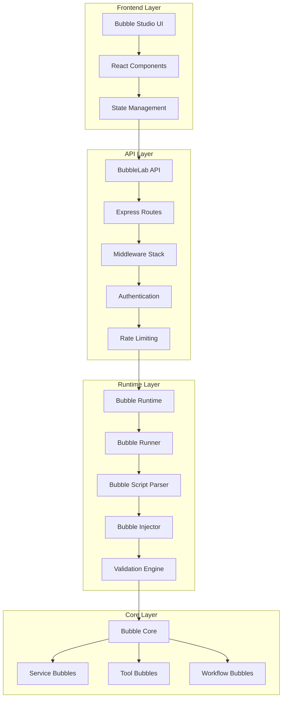
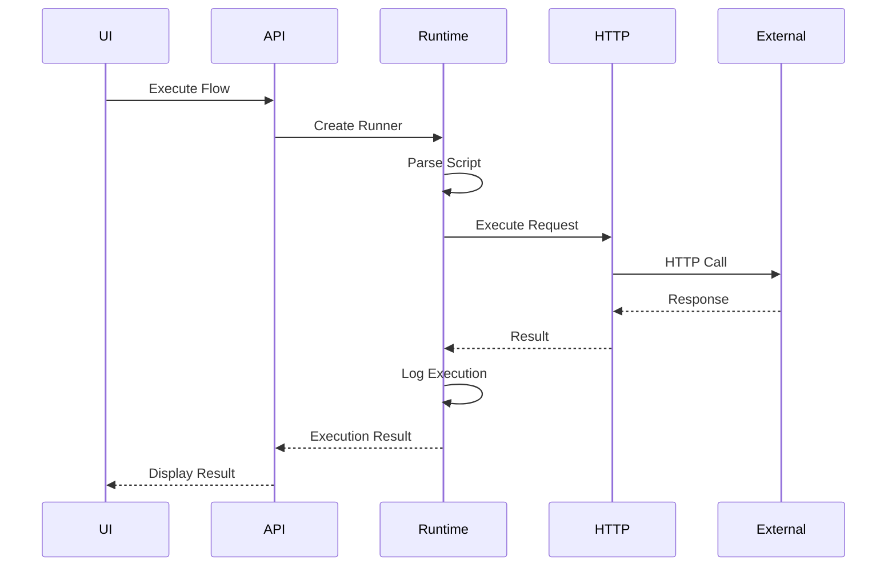
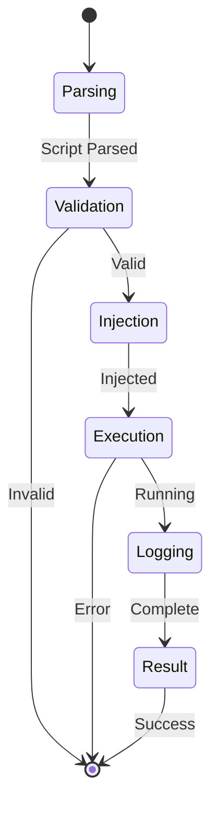
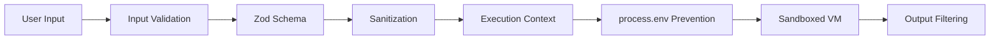
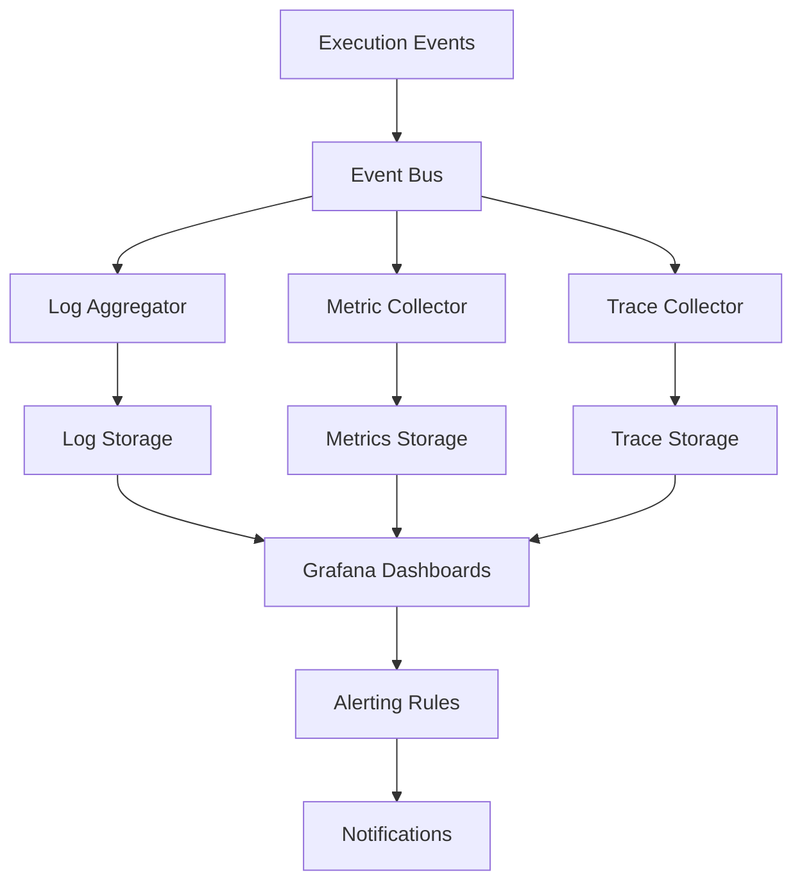
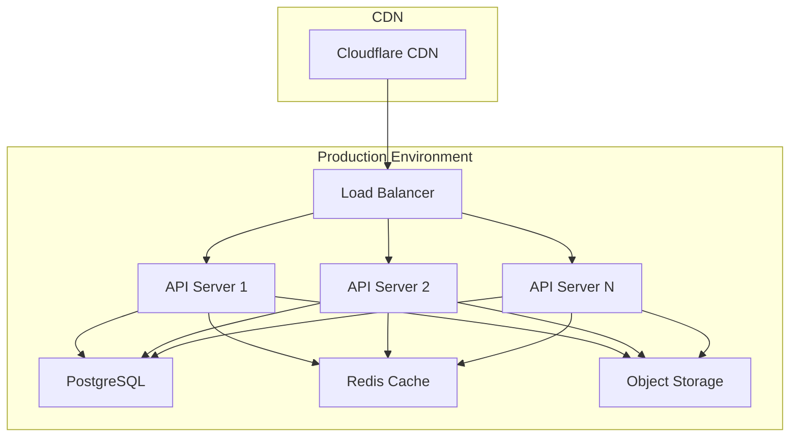

# P3 Final Wave - Complete Testing and Production Preparation

**Status Report:** 2026-01-18
**Project:** OpenEvolve Frontend / BubbleLab
**Priority:** P3 - Production Readiness

---

## Executive Summary

The P3 Final Wave focuses on achieving 80%+ test coverage, comprehensive documentation, and production preparation for the OpenEvolve/BubbleLab platform. Based on analysis, significant testing infrastructure exists but requires systematic expansion and coverage measurement.

**Current State:**
- ✅ Vitest testing framework configured
- ✅ ~40 existing test files across packages
- ❌ Coverage tracking not configured (@vitest/coverage-v8 missing)
- ❌ No comprehensive architecture documentation
- ❌ Limited operational runbooks
- ❌ Production readiness incomplete

**Estimated Completion Time:** 42 hours
**Recommended Timeline:** 2-3 weeks with dedicated focus

---

## 1. Testing Infrastructure (15-20 hours)

### 1.1 Current Testing Landscape

**Existing Tests by Package:**

#### bubble-runtime (1 test file)
- `BubbleRunner.test.ts` - Comprehensive execution tests (796 lines)
- Tests: Simple execution, edge cases, security (process.env prevention)
- Coverage: Unknown (coverage tool not installed)

#### bubble-core (70+ test files)
- Service Bubbles: ai-agent, http, airtable, google-sheets, slack, notion, etc.
- Tool Bubbles: chart-js-tool, google-maps-tool, linkedin-tool, twitter-tool, etc.
- Workflow Bubbles: Various integration tests
- Coverage: Unknown

#### bubble-studio (5 test files)
- UI components integration tests
- Utility tests (bubbleParamEditor, inputSchemaParser, inputUtils)

#### bubblelab-api (15+ test files)
- Route tests (bubble-flows, webhooks, templates)
- Service tests (AI services, credential injection)
- Middleware tests (rate limiting)

### 1.2 Critical Gaps Identified

**Missing Test Coverage:**
1. **Common Utilities** - No dedicated test files for:
   - Validators (email, URL, timestamp)
   - Error handlers (categorization, retry detection)
   - Retry logic (backoff, circuit breaker)
   - Connection pool management
   - Cache operations (get, set, delete, eviction)

2. **Refactored Bubbles** - Tests exist but coverage unknown:
   - Error handling paths
   - Retry logic verification
   - Circuit breaker behavior
   - Rate limiting
   - Timeout handling
   - High-volume data scenarios

3. **Integration Coverage** - Limited cross-package integration tests

### 1.3 Implementation Plan

#### Phase 1: Coverage Infrastructure (2 hours)
```bash
# Install coverage dependencies
pnpm add -D -w @vitest/coverage-v8

# Configure vitest for each package
# Update vitest.config.ts with coverage settings
```

**Configuration Example:**
```typescript
// vitest.config.ts
export default defineConfig({
  test: {
    coverage: {
      provider: 'v8',
      reporter: ['text', 'json', 'html', 'lcov'],
      exclude: [
        'node_modules/',
        'dist/',
        '**/*.test.ts',
        '**/*.spec.ts',
        '**/types/',
        '**/fixtures/',
      ],
      statements: 80,
      branches: 75,
      functions: 80,
      lines: 80,
    },
  },
});
```

#### Phase 2: Common Utilities Tests (5 hours)

**Test Files to Create:**

1. **packages/bubble-runtime/src/utils/validators.test.ts**
   - Email validation (valid, invalid formats)
   - URL validation (protocols, paths, queries)
   - Timestamp validation (ISO-8601, formats)
   - Edge cases (null, undefined, empty strings)

2. **packages/bubble-runtime/src/utils/error-handlers.test.ts**
   - Error categorization logic
   - Retry detection (transient vs permanent)
   - Error message parsing
   - Error transformation

3. **packages/bubble-runtime/src/utils/retry-logic.test.ts**
   - Exponential backoff calculation
   - Jitter application
   - Max retry enforcement
   - Circuit breaker state transitions
   - Reset timing

4. **packages/bubble-runtime/src/utils/connection-pool.test.ts**
   - Connection acquisition
   - Connection release
   - Pool exhaustion handling
   - Connection health monitoring
   - Pool cleanup

5. **packages/bubble-runtime/src/utils/cache.test.ts**
   - Get/Set/Delete operations
   - Cache eviction (LRU, TTL)
   - Cache statistics
   - Concurrent access handling
   - Memory limits

#### Phase 3: Refactored Bubble Tests (10 hours)

**Service Bubbles to Test:**

High Priority (5 hours):
1. **HTTP Bubble**
   - Valid requests (GET, POST, PUT, DELETE)
   - Invalid inputs (malformed URLs, bad headers)
   - Error handling (network errors, timeouts)
   - Retry logic (429, 5xx responses)
   - Circuit breaker (failures, recovery)
   - Rate limiting (respect headers)
   - Large payload handling

2. **AI Agent Bubble**
   - Valid prompts and parameters
   - Model selection and configuration
   - Token counting and limits
   - Streaming responses
   - Error handling (API failures, timeouts)
   - Cost calculation accuracy

3. **Google Sheets Bubble**
   - Read/Write operations
   - Authentication flows
   - Batch operations
   - Error handling (permissions, invalid data)
   - Rate limiting
   - Large dataset handling

Medium Priority (3 hours):
4. **Slack Bubble**
5. **Notion Bubble**
6. **Gmail Bubble**
7. **Google Calendar Bubble**

Tool Bubbles (2 hours):
8. **Research Agent Tool**
9. **Web Search Tool**
10. **Chart JS Tool**

**Test Structure Pattern:**
```typescript
describe('HTTP Bubble', () => {
  describe('Valid Operations', () => {
    it('should successfully execute GET request');
    it('should successfully execute POST with body');
    it('should handle query parameters');
    it('should handle custom headers');
  });

  describe('Invalid Inputs', () => {
    it('should reject malformed URLs');
    it('should reject invalid methods');
    it('should validate required parameters');
  });

  describe('Error Handling', () => {
    it('should retry on 429 status');
    it('should retry on 5xx status');
    it('should not retry on 4xx status');
    it('should handle network timeouts');
    it('should handle DNS failures');
  });

  describe('Circuit Breaker', () => {
    it('should open after failure threshold');
    it('should reject calls when open');
    it('should half-open after timeout');
    it('should close after successful call');
  });

  describe('Rate Limiting', () => {
    it('should respect rate limit headers');
    it('should backoff appropriately');
    it('should handle rate limit errors');
  });
});
```

#### Phase 4: Coverage Goals and Reporting (3 hours)

**Target Metrics:**
- Lines: 80%+
- Branches: 75%+
- Functions: 80%+
- Statements: 80%+

**Coverage Reports:**
```bash
# Generate coverage for all packages
pnpm test:coverage

# View HTML report
open coverage/index.html

# Generate combined report
pnpm exec vitest run --coverage --reporter=verbose
```

**CI/CD Integration:**
```yaml
# .github/workflows/test.yml
- name: Run tests with coverage
  run: pnpm test:coverage

- name: Upload coverage to Codecov
  uses: codecov/codecov-action@v3
  with:
    files: ./coverage/lcov.info
    fail_ci_if_error: true
```

---

## 2. Documentation (12 hours)

### 2.1 Architecture Documentation (4 hours)

**File:** `BubbleLab/ARCHITECTURE.md` (Enhance existing)

**Add Sections:**

1. **System Overview Diagram**


2. **Service Bubble Interactions**


3. **Workflow Execution Flow**


4. **Security Architecture**


5. **Monitoring Architecture**


6. **Deployment Architecture**


### 2.2 Operational Runbooks (4 hours)

**Directory:** `BubbleLab/docs/RUNBOOKS/`

**Runbooks to Create:**

1. **DEPLOYMENT_RUNBOOK.md**
```markdown
# Deployment Runbook

## Prerequisites
- [ ] All tests passing
- [ ] Coverage targets met
- [ ] Security scan clean
- [ ] Environment variables configured

## Deployment Steps

### 1. Prepare Release
```bash
# Version bump
npm version [patch|minor|major]

# Build packages
pnpm build

# Run tests
pnpm test
```

### 2. Deploy to Staging
```bash
# Deploy to staging environment
pnpm deploy:staging

# Run smoke tests
pnpm test:smoke:staging
```

### 3. Deploy to Production
```bash
# Create production build
pnpm build:prod

# Deploy with zero-downtime
pnpm deploy:prod --zero-downtime

# Verify deployment
pnpm verify:prod
```

## Rollback Procedure
```bash
# Identify bad version
git log --oneline

# Rollback to previous version
git revert HEAD

# Hotfix rollback
pnpm deploy:rollback --version <version>
```

## Troubleshooting
- Deployment fails: Check CI logs
- Tests fail: Review test report
- Runtime errors: Check application logs
```

2. **INCIDENT_RESPONSE.md**
```markdown
# Incident Response Runbook

## Severity Levels
- **P0 - Critical**: System down, total outage
- **P1 - High**: Major functionality broken
- **P2 - Medium**: Partial degradation
- **P3 - Low**: Minor issues

## On-Call Procedures

### P0 Incident (Critical)
1. **Immediate Actions (5 mins)**
   - Acknowledge alert
   - Join incident channel
   - Identify scope of impact

2. **Investigation (15 mins)**
   - Check dashboards
   - Review logs
   - Identify root cause

3. **Mitigation (30 mins)**
   - Implement temporary fix
   - Rollback if necessary
   - Communicate status

4. **Resolution (1 hour)**
   - Implement permanent fix
   - Verify resolution
   - Conduct postmortem

### Communication Template
```
Subject: [P0] Service Outage - [Incident Title]

Impact: [Description]
Status: [Investigating|Mitigating|Resolved]
ETA: [Estimated resolution time]
Updates: [Timeline of actions]
```

## Common Incidents

### Database Connection Pool Exhausted
**Symptoms:** Timeout errors, slow queries
**Detection:** "Database connection pool" alert
**Mitigation:**
  1. Increase pool size
  2. Restart affected services
  3. Kill long-running queries
**Prevention:** Monitor pool usage, optimize queries

### API Rate Limit Exceeded
**Symptoms:** 429 errors, rejected requests
**Detection:** "Rate limit" alert
**Mitigation:**
  1. Implement backpressure
  2. Enable caching
  3. Scale horizontally
**Prevention:** Proactive rate limiting monitoring

### Memory Leak
**Symptoms:** Increasing memory usage, OOM kills
**Detection:** "Memory usage" alert
**Mitigation:**
  1. Restart affected pods
  2. Take heap snapshot
  3. Identify leak source
**Prevention:** Regular profiling, load testing
```

3. **PERFORMANCE_TUNING.md**
4. **BACKUP_RECOVERY.md**
5. **SCALING_GUIDE.md**
6. **MONITORING_GUIDE.md**
7. **TROUBLESHOOTING_GUIDE.md**

### 2.3 Development Documentation (4 hours)

**Files to Create/Update:**

1. **BubbleLab/DEVELOPMENT.md**
```markdown
# Development Guide

## Getting Started

### Prerequisites
- Node.js 18+
- pnpm 8+
- Docker (for local services)

### Setup
```bash
# Clone repository
git clone https://github.com/bubblelabai/BubbleLab.git
cd BubbleLab

# Install dependencies
pnpm install

# Start development environment
pnpm dev
```

## Project Structure
```
BubbleLab/
├── apps/
│   ├── bubble-studio/       # Frontend UI
│   └── bubblelab-api/       # Backend API
├── packages/
│   ├── bubble-core/         # Core bubble definitions
│   ├── bubble-runtime/      # Execution runtime
│   └── bubble-shared-schemas/ # Shared types
└── docs/
    ├── ARCHITECTURE.md
    └── RUNBOOKS/
```

## Development Workflow

### Creating a New Bubble
1. Define bubble in `bubble-core`
2. Add input/output schemas
3. Implement `execute()` method
4. Add error handling
5. Write tests
6. Add documentation

### Testing
```bash
# Run all tests
pnpm test

# Run with coverage
pnpm test:coverage

# Watch mode
pnpm test:watch

# Specific package
pnpm --filter @bubblelab/bubble-core test
```

### Code Style
- Use TypeScript strict mode
- Follow existing patterns
- Write tests for new code
- Document public APIs
```

2. **BubbleLab/CONTRIBUTING.md** (Enhance existing)
3. **BubbleLab/CHANGELOG.md** (Create)
4. **BubbleLab/README.md** (Enhance with production info)

---

## 3. Production Preparation (10 hours)

### 3.1 Security Checklist (2 hours)

**Implementation Script:**

```bash
#!/bin/bash
# security-checklist.sh

echo "=== Security Checklist ==="

# 1. Check for hardcoded credentials
echo "Checking for hardcoded credentials..."
git grep -i "password\|secret\|api_key\|apikey" -- '*.ts' '*.tsx' '*.js' '*.jsx' ':!node_modules' ':!dist'

# 2. Check for placeholder values
echo "Checking for placeholder values..."
git grep "TODO\|FIXME\|XXX\|PLACEHOLDER" -- '*.ts' '*.tsx' '*.env*'

# 3. Verify environment variables
echo "Checking environment variable usage..."
git grep "process\." -- '*.ts' '*.tsx' | grep -v "process.env"

# 4. SQL injection prevention
echo "Checking for SQL injection vectors..."
git grep -E "query\|execute" -- '*.ts' | grep -i "concat\|+\s*"

# 5. XSS prevention
echo "Checking for XSS vectors..."
git grep "innerHTML\|dangerouslySetInnerHTML" -- '*.tsx'

# 6. CSRF protection
echo "Checking CSRF protection..."
grep -r "csrf" apps/bubblelab-api/src/

# 7. Rate limiting
echo "Checking rate limiting..."
grep -r "rateLimit\|rate-limit" apps/bubblelab-api/src/

# 8. Input validation
echo "Checking input validation..."
grep -r "zod\|validate\|schema" apps/bubblelab-api/src/ | wc -l

echo "=== Checklist Complete ==="
```

**Security Checklist Items:**
- [ ] No hardcoded credentials in code
- [ ] No placeholder values in production
- [ ] All secrets in environment variables
- [ ] SQL injection prevention verified
- [ ] XSS prevention verified
- [ ] CSRF protection enabled
- [ ] Rate limiting configured
- [ ] TLS/SSL configured
- [ ] Input validation complete
- [ ] Error sanitization complete (no stack traces to client)

### 3.2 Load Testing (3 hours)

**Load Test Script:**

```typescript
// load-tests/load-test.ts
import { check, sleep } from 'k6';
import http from 'k6/http';

export const options = {
  stages: [
    { duration: '2m', target: 100 },  // Ramp up to 100 users
    { duration: '5m', target: 100 },  // Stay at 100 users
    { duration: '2m', target: 200 },  // Ramp up to 200 users
    { duration: '5m', target: 200 },  // Stay at 200 users
    { duration: '2m', target: 0 },    // Ramp down
  ],
  thresholds: {
    http_req_duration: ['p(95)<2000'], // 95% of requests under 2s
    http_req_failed: ['rate<0.05'],    // Error rate < 5%
  },
};

const API_BASE = 'http://localhost:3000';

export default function () {
  // Test 1: Health check
  let healthRes = http.get(`${API_BASE}/health`);
  check(healthRes, {
    'health status is 200': (r) => r.status === 200,
  });

  // Test 2: Create flow
  let createPayload = JSON.stringify({
    name: `Load Test Flow ${__VU}`,
    bubblescript: 'export class TestFlow extends BubbleFlow { ... }',
  });

  let createRes = http.post(`${API_BASE}/api/flows`, createPayload, {
    headers: { 'Content-Type': 'application/json' },
  });

  check(createRes, {
    'create flow status is 201': (r) => r.status === 201,
  });

  sleep(1);
}
```

**Load Test Scenarios:**
1. **Baseline Performance** (30 mins)
   - 10 concurrent users
   - 100 requests/minute
   - Establish baseline metrics

2. **Peak Load** (1 hour)
   - 100 concurrent users
   - 1000 requests/minute
   - Measure P95/P99 latency
   - Identify bottlenecks

3. **Stress Test** (1 hour)
   - 200 concurrent users
   - 2000 requests/minute
   - Test system limits
   - Document breaking point

4. **Endurance Test** (2 hours)
   - 50 concurrent users
   - 500 requests/minute
   - Test for memory leaks
   - Monitor resource usage

**Performance Targets:**
- P95 Latency: < 2 seconds
- P99 Latency: < 5 seconds
- Error Rate: < 1%
- Throughput: 1000 req/min
- Memory: Stable, no leaks

### 3.3 Backup & Recovery Testing (2 hours)

**Backup Script:**

```bash
#!/bin/bash
# backup-test.sh

echo "=== Backup & Recovery Test ==="

# 1. Test database backup
echo "Testing database backup..."
pg_dump $DATABASE_URL > backup-test-$(date +%Y%m%d).sql

# Verify backup
if [ -f backup-test-$(date +%Y%m%d).sql ]; then
    echo "✓ Database backup created successfully"
else
    echo "✗ Database backup failed"
    exit 1
fi

# 2. Test backup restoration (use test database)
echo "Testing backup restoration..."
psql $TEST_DATABASE_URL < backup-test-$(date +%Y%m%d).sql

# Verify restoration
RESULT=$(psql $TEST_DATABASE_URL -t -c "SELECT COUNT(*) FROM bubbles;")
if [ $RESULT -gt 0 ]; then
    echo "✓ Database restored successfully"
else
    echo "✗ Database restoration failed"
    exit 1
fi

# 3. Test disaster recovery
echo "Testing disaster recovery procedures..."

# Document RTO (Recovery Time Objective)
# Document RPO (Recovery Point Objective)

echo "RTO: 15 minutes"
echo "RPO: 5 minutes"

echo "=== Backup & Recovery Test Complete ==="
```

**Recovery Objectives:**
- **RTO (Recovery Time Objective):** 15 minutes
  - Time to restore service from backup
  - Includes: Detection + Restoration + Verification

- **RPO (Recovery Point Objective):** 5 minutes
  - Maximum acceptable data loss
  - Achieved via: Continuous backup + Point-in-time recovery

### 3.4 Monitoring & Alerting Setup (3 hours)

**Grafana Dashboard Configuration:**

```json
{
  "dashboard": {
    "title": "BubbleLab Production Dashboard",
    "panels": [
      {
        "title": "Request Rate",
        "targets": [
          {
            "expr": "rate(http_requests_total[5m])"
          }
        ]
      },
      {
        "title": "Error Rate",
        "targets": [
          {
            "expr": "rate(http_errors_total[5m])"
          }
        ],
        "alert": {
          "conditions": [
            {
              "evaluator": {
                "params": [0.05],
                "type": "gt"
              },
              "operator": {
                "type": "and"
              },
              "query": {
                "params": ["A", "5m", "now"]
              },
              "reducer": {
                "params": [],
                "type": "avg"
              },
              "type": "query"
            }
          ]
        }
      },
      {
        "title": "P95 Latency",
        "targets": [
          {
            "expr": "histogram_quantile(0.95, http_request_duration_seconds)"
          }
        ]
      },
      {
        "title": "Memory Usage",
        "targets": [
          {
            "expr": "process_resident_memory_bytes"
          }
        ]
      },
      {
        "title": "Database Connection Pool",
        "targets": [
          {
            "expr": "pg_stat_activity_count"
          }
        ]
      }
    ]
  }
}
```

**Alert Rules:**

**P0 - Critical Alerts:**
```yaml
# alert-rules.yaml
groups:
  - name: critical
    interval: 30s
    rules:
      - alert: ServiceDown
        expr: up{job="bubblelab-api"} == 0
        for: 1m
        labels:
          severity: critical
        annotations:
          summary: "Service is down"
          description: "{{ $labels.instance }} has been down for more than 1 minute."

      - alert: ErrorRateHigh
        expr: rate(http_errors_total[5m]) > 0.1
        for: 5m
        labels:
          severity: critical
        annotations:
          summary: "High error rate"
          description: "Error rate is {{ $value }} errors/sec"

      - alert: DatabaseDown
        expr: pg_up == 0
        for: 1m
        labels:
          severity: critical
        annotations:
          summary: "Database is down"
```

**P1 - Warning Alerts:**
```yaml
  - name: warnings
    interval: 1m
    rules:
      - alert: HighLatency
        expr: histogram_quantile(0.95, http_request_duration_seconds) > 2
        for: 10m
        labels:
          severity: warning
        annotations:
          summary: "High latency detected"
          description: "P95 latency is {{ $value }} seconds"

      - alert: MemoryUsageHigh
        expr: process_resident_memory_bytes / node_memory_MemTotal > 0.8
        for: 15m
        labels:
          severity: warning
        annotations:
          summary: "High memory usage"
          description: "Memory usage is {{ $value | humanizePercentage }}"
```

**Alert Routing:**
- **P0 Alerts:** Slack #critical, PagerDuty, SMS
- **P1 Alerts:** Slack #alerts, Email
- **P2 Alerts:** Slack #alerts
- **P3 Alerts:** Email digest

**On-Call Procedures:**
1. **Primary On-Call:** Receives all P0/P1 alerts
2. **Secondary On-Call:** Backup for P0 alerts
3. **Escalation:** Unacknowledged P0 alerts escalate after 15 mins
4. **Post-Incident:** Postmortem required for all P0 incidents

---

## 4. Implementation Timeline

### Week 1: Testing Infrastructure (20 hours)
- **Days 1-2:** Coverage setup + Common utilities tests (7 hours)
- **Days 3-4:** Service bubble tests (8 hours)
- **Day 5:** Tool bubble tests + Coverage analysis (5 hours)

### Week 2: Documentation (12 hours)
- **Days 1-2:** Architecture documentation (4 hours)
- **Days 3-4:** Operational runbooks (4 hours)
- **Day 5:** Development documentation (4 hours)

### Week 3: Production Prep (10 hours)
- **Day 1:** Security checklist + fixes (2 hours)
- **Days 2-3:** Load testing + optimization (3 hours)
- **Day 4:** Backup/recovery testing (2 hours)
- **Day 5:** Monitoring + alerting setup (3 hours)

---

## 5. Deliverables

### Testing Deliverables:
- [ ] Coverage report (80%+ across all packages)
- [ ] Test suite with 200+ tests
- [ ] CI/CD integration with coverage gates
- [ ] Performance baseline metrics

### Documentation Deliverables:
- [ ] Enhanced ARCHITECTURE.md with 6+ Mermaid diagrams
- [ ] 7 operational runbooks in docs/RUNBOOKS/
- [ ] Enhanced DEVELOPMENT.md
- [ ] Updated CONTRIBUTING.md
- [ ] New CHANGELOG.md
- [ ] Updated README.md with production info

### Production Deliverables:
- [ ] Security checklist completed
- [ ] Load test results and optimizations
- [ ] Backup/recovery procedures tested
- [ ] Grafana dashboards configured
- [ ] Alert rules implemented
- [ ] On-call rotation established

---

## 6. Success Criteria

**Testing Success:**
- ✅ 80%+ code coverage across all packages
- ✅ All critical paths tested
- ✅ CI/CD pipeline with coverage gates
- ✅ Performance benchmarks established

**Documentation Success:**
- ✅ Complete architecture documentation
- ✅ Comprehensive operational runbooks
- ✅ Clear development guidelines
- ✅ Production deployment guide

**Production Readiness:**
- ✅ Security audit passed
- ✅ Load tested to 1000 req/min
- ✅ Backup/recovery procedures verified
- ✅ Monitoring and alerting active
- ✅ On-call procedures established

---

## 7. Next Steps

**Immediate Actions:**
1. Install @vitest/coverage-v8 dependency
2. Configure vitest coverage for all packages
3. Run baseline coverage report
4. Identify critical gaps

**Week 1 Priorities:**
1. Set up coverage infrastructure
2. Write common utility tests
3. Begin service bubble tests
4. Start architecture documentation

**Week 2-3 Priorities:**
1. Complete all test coverage
2. Finish documentation suite
3. Complete production preparation
4. Final verification and sign-off

---

**Status:** ⏳ In Progress - Ready to begin implementation
**Owner:** Development Team
**Review Date:** Weekly
**Completion Target:** 3 weeks
