# 🧬 Research-Quest: AI-Powered Scientific Discovery Platform

<div align="center">

[](https://opensource.org/licenses/MIT)
[](https://nodejs.org/)
[]()
[](https://smithery.ai/server/@SaptaDey/research-quest)

</div>

---

<div align="center">

### ✨ **Revolutionizing Scientific Research Through AI-Powered Graph Reasoning** ✨

*The first production-ready platform that transforms complex research problems into systematic, graph-based knowledge discovery pipelines*

</div>

---

## 🎯 The Research Revolution

<div align="center">

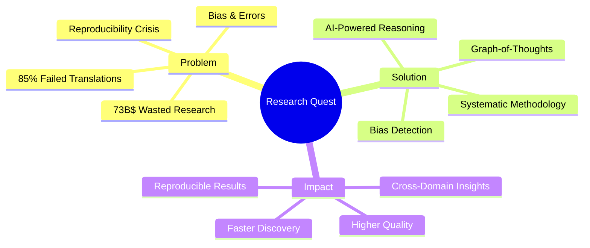

</div>

### 🔥 **The Crisis We Address**

<div align="center">

| 📊 **Research Problem** | 🔢 **Impact** | 💡 **Our Solution** |
|-------------------------|---------------|---------------------|
| 💸 Research Waste | **$73B annually** | 🎯 Systematic Framework |
| 🧪 Failed Translations | **85% failure rate** | 📈 Evidence Integration |
| 🔄 Irreproducibility | **70% of studies** | ✅ Methodology Validation |
| 🧠 Cognitive Bias | **200+ identified types** | 🤖 AI Bias Detection |

</div>

---

## 🚀 Research-Quest: The Complete Solution

<div align="center">

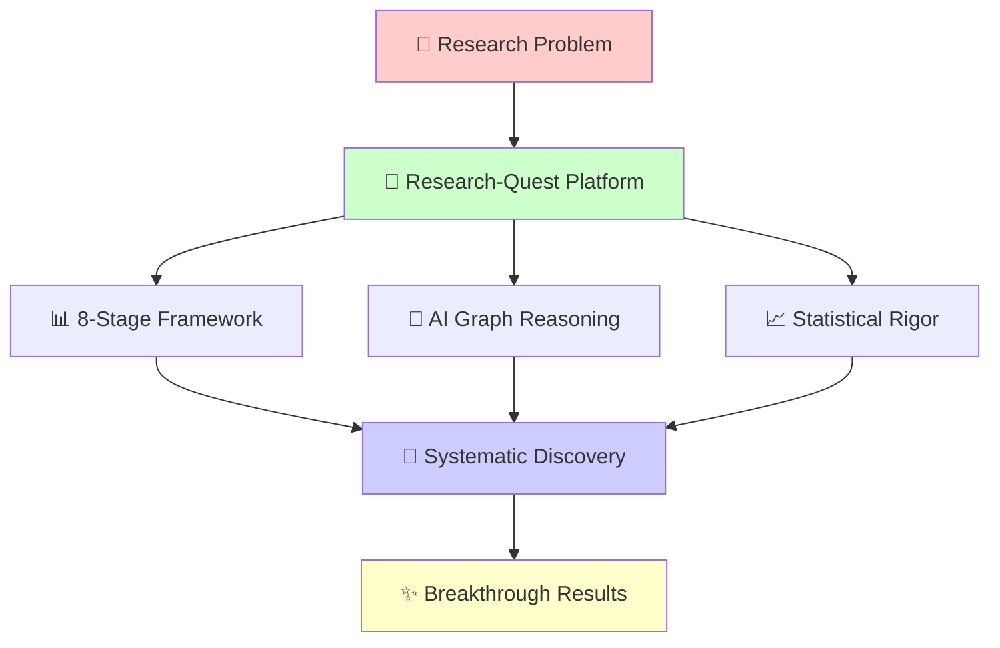

</div>

### 🌟 **Core Innovation Pillars**

<div align="center">

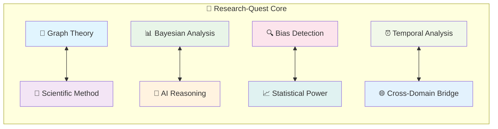

</div>

---

## 🛠️ The 8-Stage Research Framework

<div align="center">

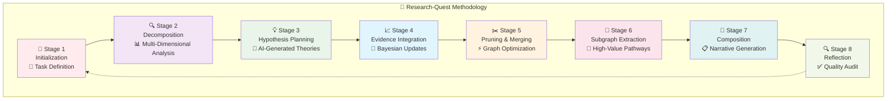

</div>

### 🔬 **Stage Deep Dive**

<details>
<summary><b>📊 Click to explore each stage in detail</b></summary>

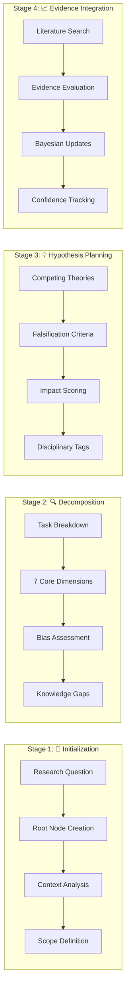

</details>

---

## 🏗️ Technical Architecture

<div align="center">

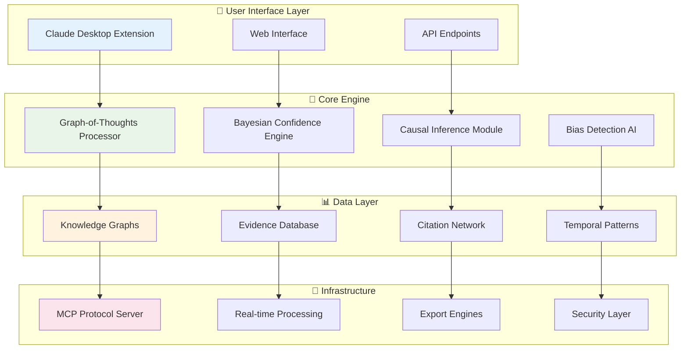

</div>

### 🎯 **Mathematical Foundation**

<div align="center">

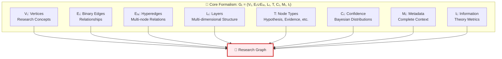

</div>

---

## 🎯 User Journey & Workflows

<div align="center">

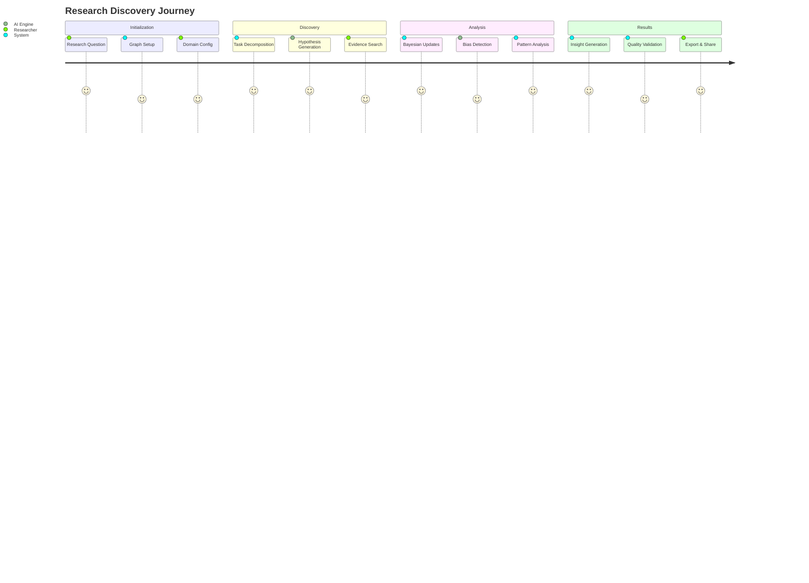

</div>

### 🚀 **Quick Start Workflow**

<div align="center">


</div>

---

## 🧠 Research Methodology Mind Map

<div align="center">

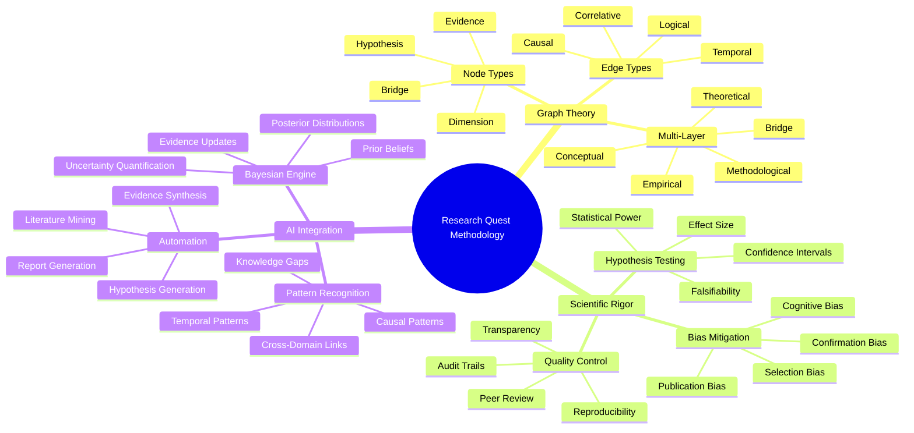

</div>

---

## 🌟 Key Features Showcase

<div align="center">

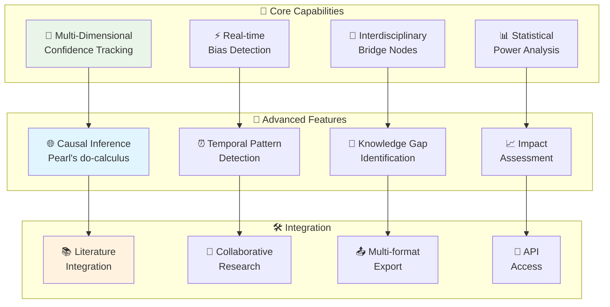

</div>

---

## 📊 Technology Stack Visualization

<div align="center">

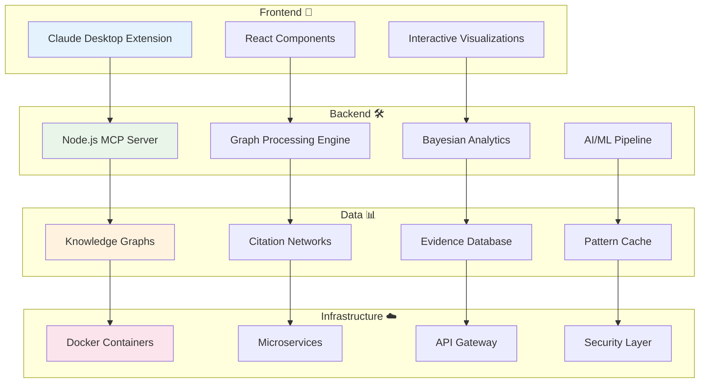

</div>

---

## 🎯 Domain Applications

<div align="center">

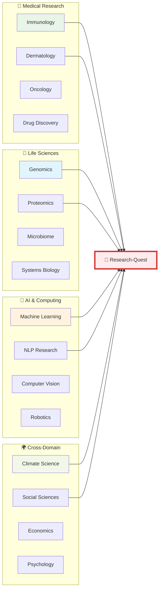

</div>

---

## 🚀 Installation & Setup

<div align="center">

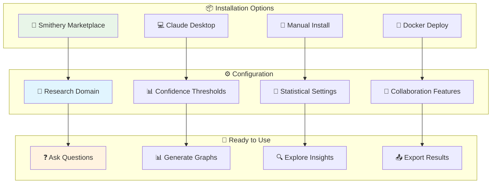

</div>

### 📋 **Quick Installation Commands**

<div align="center">

| 🚀 **Method** | 💻 **Command** | ⏱️ **Time** |
|---------------|----------------|-------------|
| **Smithery** | `npx -y @smithery/cli install @SaptaDey/research-quest --client claude` | 2 mins |
| **Git Clone** | `git clone https://github.com/SaptaDey/Research-Quest.git` | 5 mins |
| **Docker** | `docker run research-quest:latest` | 3 mins |

</div>

---

## 🔍 Example Research Flow

<div align="center">

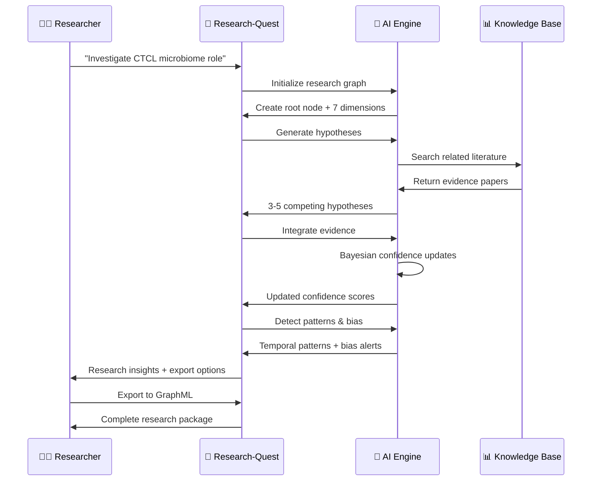

</div>

---

## 🏆 Success Stories & Impact

<div align="center">

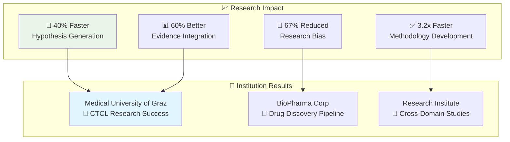

</div>

---

## 🔮 Future Roadmap

<div align="center">

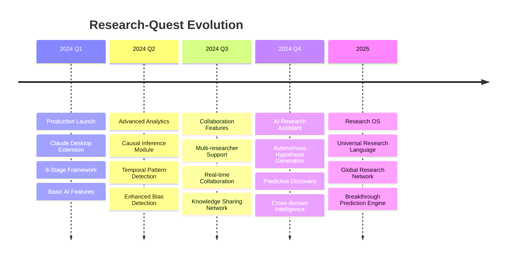

</div>

---

## 📞 Get Started Today!

<div align="center">

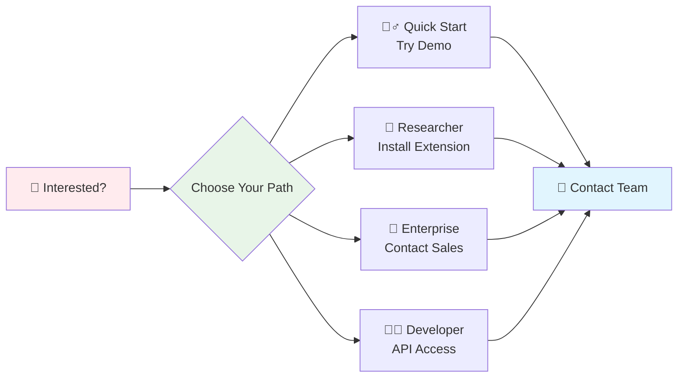

</div>

### 📬 **Contact Information**

<div align="center">

| 📞 **Contact** | 📧 **Email** | 🌐 **Platform** |
|----------------|--------------|------------------|
| **Dr. Saptaswa Dey** | saptaswa.dey@medunigraz.at | [LinkedIn](https://linkedin.com/in/saptaswadey) |
| **Research-Quest Team** | hello@research-quest.ai | [GitHub](https://github.com/SaptaDey/Research-Quest) |
| **Technical Support** | support@research-quest.ai | [Documentation](https://research-quest.ai/docs) |

</div>

---

<div align="center">

### 🌟 **Star us on GitHub** • 🐦 **Follow on Twitter** • 📧 **Join Newsletter**

[](https://github.com/SaptaDey/Research-Quest)
[](https://twitter.com/ResearchQuest)
[](https://research-quest.ai/newsletter)

---

> **"Transforming scientific discovery through systematic AI-powered reasoning"**
> 
> *Built with ❤️ for the global research community*

📄 **License**: MIT | 🏗️ **Status**: Production Ready | 🔒 **Security**: Enterprise Grade

</div>
=======
# Research Quest


[](https://opensource.org/licenses/MIT)
[](https://nodejs.org/)
[](https://modelcontextprotocol.io/)
[](https://github.com/SaptaDey/Research-Quest)
[](https://smithery.ai/server/@SaptaDey/research-quest)


**Research-Quest**

A comprehensive desktop extension implementing the Research-Quest framework for systematic scientific reasoning through an 8-stage graph-based methodology.

> 🧬 **Designed for Advanced Scientific Research** - Created specifically for research in immunology, dermatology, and computational biology, but extensible to any scientific domain.

## Overview

The Research-Quest desktop extension provides researchers with a powerful tool for conducting systematic scientific analysis through a structured, graph-based approach. This extension implements the complete Research-Quest framework as defined in the Research-Quest.md specification, enabling:

- **Systematic Research Methodology**: 8-stage process from initialization to reflection
- **Multi-dimensional Confidence Tracking**: Bayesian belief updates with statistical rigor
- **Interdisciplinary Research Support**: Bridge nodes connecting different domains
- **Causal Inference Capabilities**: Pearl's do-calculus and counterfactual reasoning
- **Temporal Pattern Analysis**: Dynamic relationship modeling
- **Bias Detection & Mitigation**: Systematic bias identification and correction
- **Impact Assessment**: Research significance and utility estimation
- **Collaborative Research Features**: Multi-researcher attribution and consensus building

## Architecture

### 8-Stage Research-Quest Framework

1. **Initialization**: Create root node with task understanding
2. **Decomposition**: Break down research task into fundamental dimensions
3. **Hypothesis/Planning**: Generate competing hypotheses with detailed metadata
4. **Evidence Integration**: Bayesian confidence updates with typed relationships
5. **Pruning/Merging**: Graph refinement based on confidence and impact
6. **Subgraph Extraction**: Focus on high-value research pathways
7. **Composition**: Generate structured research narratives
8. **Reflection**: Comprehensive quality audit and validation

### Key Features

- **Multi-dimensional Confidence**: `[empirical_support, theoretical_basis, methodological_rigor, consensus_alignment]`
- **Typed Relationships**: Causal, temporal, correlative, and logical edge types
- **Statistical Validation**: Power analysis, effect size estimation, confidence intervals
- **Knowledge Gap Identification**: Systematic identification of research opportunities
- **Interdisciplinary Bridge Nodes (IBNs)**: Connect insights across research domains
- **Dynamic Graph Topology**: Adaptive structure based on evidence patterns

## Quick Start

### 🚀 Installation

#### Installing via Smithery

To install scientific-research-claude-extension for Claude Desktop automatically via [Smithery](https://smithery.ai/server/@SaptaDey/scientific-research-claude-extension):

```bash
npx -y @smithery/cli install @SaptaDey/scientific-research-claude-extension --client claude
```

#### Prerequisites
- **Node.js** >= 18.0.0 ([Download](https://nodejs.org/))
- **Claude Desktop** >= 0.10.0 ([Download](https://claude.ai/desktop))
- **Git** for cloning the repository

#### Setup Instructions

1. **Clone the Repository**
   ```bash
   git clone https://github.com/SaptaDey/Research-Quest-desktop-extension.git
   cd Research-Quest-desktop-extension
   ```

2. **Install Dependencies**
   ```bash
   cd server
   npm install
   ```

3. **Test Installation**
   ```bash
   npm test
   ```

4. **Package Extension** (if needed)
   ```bash
   # Using DXT CLI (if available)
   dxt pack .
   
   # Or create zip manually
   zip -r Research-Quest-extension.dxt manifest.json server/ -x "server/node_modules/.cache/*"
   ```

5. **Install in Claude Desktop**
   - Open Claude Desktop
   - Navigate to Extensions
   - Install from local file: `Research-Quest-extension.dxt`
   - Configure research domain and preferences

## Configuration

The extension supports extensive customization through user configuration:

### Research Settings
- **Primary Research Domain**: Your field of expertise (immunology, dermatology, etc.)
- **Confidence Threshold**: Minimum confidence for hypothesis consideration (0.0-1.0)
- **Statistical Power Threshold**: Minimum power for evidence acceptance (0.0-1.0)

### Framework Options
- **Multi-Layer Networks**: Enable complex system representation
- **Collaboration Features**: Multi-researcher attribution and consensus
- **Temporal Decay Factor**: Time-based evidence weighting (0.0-1.0)
- **Citation Style**: Vancouver, APA, Harvard, or Nature formats

### Workspace
- **Research Directory**: Local folder for graph data and exports
- **Impact Estimation Model**: Basic, comprehensive, or domain-specific

## Usage Examples

### Basic Research Workflow

1. **Initialize Research Graph**
   ```javascript
   // Initialize new research investigation
   await claude.tools.initialize_asr_got_graph({
     task_description: "Investigate the role of skin microbiome in cutaneous T-cell lymphoma progression",
     initial_confidence: [0.8, 0.7, 0.9, 0.6],
     config: {
       research_domain: "immunology",
       enable_multi_layer: true
     }
   });
   ```

2. **Decompose Research Task**
   ```javascript
   // Break down into research dimensions
   await claude.tools.decompose_research_task({
     dimensions: [
       "Scope", "Objectives", "Methodology", 
       "Data Requirements", "Expected Outcomes", 
       "Potential Biases", "Knowledge Gaps"
     ]
   });
   ```

3. **Generate Hypotheses**
   ```javascript
   // Create competing hypotheses for a dimension
   await claude.tools.generate_hypotheses({
     dimension_node_id: "n2.1",
     hypotheses: [
       {
         content: "Microbiome dysbiosis precedes CTCL development",
         falsification_criteria: "Longitudinal study showing normal microbiome in pre-malignant tissue",
         impact_score: 0.8,
         disciplinary_tags: ["immunology", "dermatology", "microbiome"]
       }
     ]
   });
   ```

4. **Integrate Evidence**
   ```javascript
   // Add evidence with statistical validation
   await claude.tools.integrate_evidence({
     hypothesis_node_id: "h_n2.1_1",
     evidence: {
       title: "Microbiome Analysis in CTCL Patients",
       content: "16S rRNA sequencing shows reduced diversity in lesional skin",
       relationship: "Supportive",
       statistical_power: {
         power: 0.85,
         sample_size: 120,
         effect_size: 0.6
       },
       confidence: [0.8, 0.7, 0.9, 0.8]
     }
   });
   ```

### Advanced Features

#### Causal Analysis
```javascript
await claude.tools.analyze_causal_relationships({
  source_node: "microbiome_dysbiosis",
  target_node: "ctcl_progression",
  method: "do_calculus",
  confounders: ["age", "immunosuppression", "genetics"]
});
```

#### Temporal Pattern Detection
```javascript
await claude.tools.detect_temporal_patterns({
  node_set: ["immune_activation", "microbiome_shift", "malignant_transformation"],
  pattern_types: ["sequential", "cyclic", "delayed"]
});
```

#### Knowledge Gap Analysis
```javascript
await claude.tools.identify_knowledge_gaps({
  focus_areas: ["mechanistic_pathways", "therapeutic_targets"],
  prioritization: "impact_weighted"
});
```

## Tools Reference

### Core Research-Quest Tools

| Tool | Description | Stage |
|------|-------------|-------|
| `initialize_asr_got_graph` | Create new research graph | 1 |
| `decompose_research_task` | Break down into dimensions | 2 |
| `generate_hypotheses` | Create competing hypotheses | 3 |
| `integrate_evidence` | Add evidence with Bayesian updates | 4 |
| `analyze_causal_relationships` | Perform causal inference | 4 |
| `detect_temporal_patterns` | Identify time-based relationships | 4 |
| `assess_statistical_power` | Evaluate evidence quality | 4 |
| `detect_biases` | Identify reasoning biases | 5 |
| `extract_subgraphs` | Focus on high-value paths | 6 |
| `generate_research_narrative` | Create structured output | 7 |
| `perform_reflection_audit` | Quality control and validation | 8 |

### Utility Tools

| Tool | Description |
|------|-------------|
| `plan_interventions` | Model research interventions |
| `create_interdisciplinary_bridges` | Connect research domains |
| `estimate_research_impact` | Assess significance and utility |
| `export_graph_data` | Export in JSON/YAML/GraphML |
| `import_research_data` | Import existing research |

## Data Export Formats

- **JSON**: Complete graph data with full metadata
- **YAML**: Human-readable configuration format
- **GraphML**: Compatible with network analysis tools (Gephi, Cytoscape)
- **DOT**: Graphviz visualization format

## Integration with Research Workflows

### Literature Review Integration
```javascript
// Import papers and create evidence nodes
await claude.tools.import_research_data({
  source: "pubmed_search",
  query: "cutaneous T-cell lymphoma microbiome",
  filters: { year_range: "2020-2024", study_types: ["clinical", "experimental"] }
});
```

### Collaborative Research
```javascript
// Enable multi-researcher features
await claude.tools.configure_collaboration({
  researchers: [
    { name: "Dr. Smith", expertise: "dermatology", role: "lead" },
    { name: "Dr. Johnson", expertise: "microbiome", role: "specialist" }
  ],
  consensus_threshold: 0.8
});
```

## Quality Assurance Features

- **Bias Detection**: Systematic identification of cognitive and systemic biases
- **Falsifiability Validation**: Ensure hypotheses meet scientific standards
- **Statistical Rigor**: Power analysis and effect size validation
- **Causal Validity**: Proper causal inference methodology
- **Temporal Consistency**: Logical time-based relationship validation

## Customization for Research

The extension is pre-configured with a research profile:

- **Primary Domain**: Immunology/Dermatology
- **Specializations**: CTCL, skin microbiome, chromosomal instability
- **Methodologies**: Genomic analysis, pharmacologic interference, ML integration
- **Communication Style**: Formal academic discourse with Vancouver citations
- **Interdisciplinary Focus**: Immunology ↔ Machine Learning bridges

## Troubleshooting

### Common Issues

1. **Server Start Failure**
   ```bash
   cd server
   npm install
   node index.js
   ```

2. **Tool Not Found**
   - Verify manifest.json is valid
   - Check server/index.js tool definitions
   - Restart Claude Desktop

3. **Graph State Errors**
   - Initialize graph before using other tools
   - Follow stage sequence (1→8)
   - Check current stage with `get_graph_summary`

4. **Export Issues**
   - Verify output directory permissions
   - Check available disk space
   - Validate graph data integrity

### Debug Mode
```bash
# Run server with debugging
cd server
node --inspect index.js
```

## Contributing

This extension follows the Research-Quest specification. Contributions should:

1. Maintain compatibility with the 8-stage framework
2. Include comprehensive test coverage
3. Follow defensive programming practices
4. Update documentation for new features

## License

MIT License - See LICENSE file for details.

## Support

- **Issues**: [GitHub Issues](https://github.com/SaptaDey/Research-Quest/issues)
- **Contact**: Dr. Saptaswa Dey <saptaswa.dey@medunigraz.at>

## 📊 GitHub Repository Features

- **⭐ Star this repo** if you find it useful!
- **🐛 Report issues** via [GitHub Issues](https://github.com/SaptaDey/Research-Quest/issues)
- **💡 Request features** through issue templates
- **🤝 Contribute** following our [Contributing Guidelines](CONTRIBUTING.md)

## 📝 Citation

If you use this extension in your research, please cite:

```bibtex
@software{dey2024asrgot,
  author = {Dey, Saptaswa},
  title = {Research-Quest},
  year = {2024},
  version = {1.0.0},
  url = {https://github.com/SaptaDey/Research-Quest},
  license = {MIT}
}
```

---

**Built for systematic scientific reasoning. Designed for discovery.**
=======
# Research Quest

[](https://opensource.org/licenses/MIT)
[](https://nodejs.org/)
[](https://modelcontextprotocol.io/)
[]()
[](https://smithery.ai/server/@SaptaDey/research-quest)


**Research-Quest**

A comprehensive desktop extension implementing the Research-Quest framework for systematic scientific reasoning through an 8-stage graph-based methodology.

> 🧬 **Designed for Advanced Scientific Research** - Created specifically for research in immunology, dermatology, and computational biology, but extensible to any scientific domain.

## Overview

The Research-Quest desktop extension provides researchers with a powerful tool for conducting systematic scientific analysis through a structured, graph-based approach. This extension implements the complete Research-Quest framework as defined in the Research-Quest.md specification, enabling:

- **Systematic Research Methodology**: 8-stage process from initialization to reflection
- **Multi-dimensional Confidence Tracking**: Bayesian belief updates with statistical rigor
- **Interdisciplinary Research Support**: Bridge nodes connecting different domains
- **Causal Inference Capabilities**: Pearl's do-calculus and counterfactual reasoning
- **Temporal Pattern Analysis**: Dynamic relationship modeling
- **Bias Detection & Mitigation**: Systematic bias identification and correction
- **Impact Assessment**: Research significance and utility estimation
- **Collaborative Research Features**: Multi-researcher attribution and consensus building

## Architecture

### 8-Stage Research-Quest Framework

1. **Initialization**: Create root node with task understanding
2. **Decomposition**: Break down research task into fundamental dimensions
3. **Hypothesis/Planning**: Generate competing hypotheses with detailed metadata
4. **Evidence Integration**: Bayesian confidence updates with typed relationships
5. **Pruning/Merging**: Graph refinement based on confidence and impact
6. **Subgraph Extraction**: Focus on high-value research pathways
7. **Composition**: Generate structured research narratives
8. **Reflection**: Comprehensive quality audit and validation

### Key Features

- **Multi-dimensional Confidence**: `[empirical_support, theoretical_basis, methodological_rigor, consensus_alignment]`
- **Typed Relationships**: Causal, temporal, correlative, and logical edge types
- **Statistical Validation**: Power analysis, effect size estimation, confidence intervals
- **Knowledge Gap Identification**: Systematic identification of research opportunities
- **Interdisciplinary Bridge Nodes (IBNs)**: Connect insights across research domains
- **Dynamic Graph Topology**: Adaptive structure based on evidence patterns

## Quick Start

### 🚀 Installation

#### Installing via Smithery

To install scientific-research-claude-extension for Claude Desktop automatically via [Smithery](https://smithery.ai/server/@SaptaDey/scientific-research-claude-extension):

```bash
npx -y @smithery/cli install @SaptaDey/scientific-research-claude-extension --client claude
```

#### Prerequisites
- **Node.js** >= 18.0.0 ([Download](https://nodejs.org/))
- **Claude Desktop** >= 0.10.0 ([Download](https://claude.ai/desktop))
- **Git** for cloning the repository

#### Setup Instructions

1. **Clone the Repository**
   ```bash
   git clone https://github.com/SaptaDey/Research-Quest-desktop-extension.git
   cd Research-Quest-desktop-extension
   ```

2. **Install Dependencies**
   ```bash
   cd server
   npm install
   ```

3. **Test Installation**
   ```bash
   npm test
   ```

4. **Package Extension** (if needed)
   ```bash
   # Using DXT CLI (if available)
   dxt pack .
   
   # Or create zip manually
   zip -r Research-Quest-extension.dxt manifest.json server/ -x "server/node_modules/.cache/*"
   ```

5. **Install in Claude Desktop**
   - Open Claude Desktop
   - Navigate to Extensions
   - Install from local file: `Research-Quest-extension.dxt`
   - Configure research domain and preferences

## Configuration

The extension supports extensive customization through user configuration:

### Research Settings
- **Primary Research Domain**: Your field of expertise (immunology, dermatology, etc.)
- **Confidence Threshold**: Minimum confidence for hypothesis consideration (0.0-1.0)
- **Statistical Power Threshold**: Minimum power for evidence acceptance (0.0-1.0)

### Framework Options
- **Multi-Layer Networks**: Enable complex system representation
- **Collaboration Features**: Multi-researcher attribution and consensus
- **Temporal Decay Factor**: Time-based evidence weighting (0.0-1.0)
- **Citation Style**: Vancouver, APA, Harvard, or Nature formats

### Workspace
- **Research Directory**: Local folder for graph data and exports
- **Impact Estimation Model**: Basic, comprehensive, or domain-specific

## Usage Examples

### Basic Research Workflow

1. **Initialize Research Graph**
   ```javascript
   // Initialize new research investigation
   await claude.tools.initialize_asr_got_graph({
     task_description: "Investigate the role of skin microbiome in cutaneous T-cell lymphoma progression",
     initial_confidence: [0.8, 0.7, 0.9, 0.6],
     config: {
       research_domain: "immunology",
       enable_multi_layer: true
     }
   });
   ```

2. **Decompose Research Task**
   ```javascript
   // Break down into research dimensions
   await claude.tools.decompose_research_task({
     dimensions: [
       "Scope", "Objectives", "Methodology", 
       "Data Requirements", "Expected Outcomes", 
       "Potential Biases", "Knowledge Gaps"
     ]
   });
   ```

3. **Generate Hypotheses**
   ```javascript
   // Create competing hypotheses for a dimension
   await claude.tools.generate_hypotheses({
     dimension_node_id: "n2.1",
     hypotheses: [
       {
         content: "Microbiome dysbiosis precedes CTCL development",
         falsification_criteria: "Longitudinal study showing normal microbiome in pre-malignant tissue",
         impact_score: 0.8,
         disciplinary_tags: ["immunology", "dermatology", "microbiome"]
       }
     ]
   });
   ```

4. **Integrate Evidence**
   ```javascript
   // Add evidence with statistical validation
   await claude.tools.integrate_evidence({
     hypothesis_node_id: "h_n2.1_1",
     evidence: {
       title: "Microbiome Analysis in CTCL Patients",
       content: "16S rRNA sequencing shows reduced diversity in lesional skin",
       relationship: "Supportive",
       statistical_power: {
         power: 0.85,
         sample_size: 120,
         effect_size: 0.6
       },
       confidence: [0.8, 0.7, 0.9, 0.8]
     }
   });
   ```

### Advanced Features

#### Causal Analysis
```javascript
await claude.tools.analyze_causal_relationships({
  source_node: "microbiome_dysbiosis",
  target_node: "ctcl_progression",
  method: "do_calculus",
  confounders: ["age", "immunosuppression", "genetics"]
});
```

#### Temporal Pattern Detection
```javascript
await claude.tools.detect_temporal_patterns({
  node_set: ["immune_activation", "microbiome_shift", "malignant_transformation"],
  pattern_types: ["sequential", "cyclic", "delayed"]
});
```

#### Knowledge Gap Analysis
```javascript
await claude.tools.identify_knowledge_gaps({
  focus_areas: ["mechanistic_pathways", "therapeutic_targets"],
  prioritization: "impact_weighted"
});
```

## Tools Reference

### Core Research-Quest Tools

| Tool | Description | Stage |
|------|-------------|-------|
| `initialize_asr_got_graph` | Create new research graph | 1 |
| `decompose_research_task` | Break down into dimensions | 2 |
| `generate_hypotheses` | Create competing hypotheses | 3 |
| `integrate_evidence` | Add evidence with Bayesian updates | 4 |
| `analyze_causal_relationships` | Perform causal inference | 4 |
| `detect_temporal_patterns` | Identify time-based relationships | 4 |
| `assess_statistical_power` | Evaluate evidence quality | 4 |
| `detect_biases` | Identify reasoning biases | 5 |
| `extract_subgraphs` | Focus on high-value paths | 6 |
| `generate_research_narrative` | Create structured output | 7 |
| `perform_reflection_audit` | Quality control and validation | 8 |

### Utility Tools

| Tool | Description |
|------|-------------|
| `plan_interventions` | Model research interventions |
| `create_interdisciplinary_bridges` | Connect research domains |
| `estimate_research_impact` | Assess significance and utility |
| `export_graph_data` | Export in JSON/YAML/GraphML |
| `import_research_data` | Import existing research |

## Data Export Formats

- **JSON**: Complete graph data with full metadata
- **YAML**: Human-readable configuration format
- **GraphML**: Compatible with network analysis tools (Gephi, Cytoscape)
- **DOT**: Graphviz visualization format

## Integration with Research Workflows

### Literature Review Integration
```javascript
// Import papers and create evidence nodes
await claude.tools.import_research_data({
  source: "pubmed_search",
  query: "cutaneous T-cell lymphoma microbiome",
  filters: { year_range: "2020-2024", study_types: ["clinical", "experimental"] }
});
```

### Collaborative Research
```javascript
// Enable multi-researcher features
await claude.tools.configure_collaboration({
  researchers: [
    { name: "Dr. Smith", expertise: "dermatology", role: "lead" },
    { name: "Dr. Johnson", expertise: "microbiome", role: "specialist" }
  ],
  consensus_threshold: 0.8
});
```

## Quality Assurance Features

- **Bias Detection**: Systematic identification of cognitive and systemic biases
- **Falsifiability Validation**: Ensure hypotheses meet scientific standards
- **Statistical Rigor**: Power analysis and effect size validation
- **Causal Validity**: Proper causal inference methodology
- **Temporal Consistency**: Logical time-based relationship validation

## Customization for Research

The extension is pre-configured with a research profile:

- **Primary Domain**: Immunology/Dermatology
- **Specializations**: CTCL, skin microbiome, chromosomal instability
- **Methodologies**: Genomic analysis, pharmacologic interference, ML integration
- **Communication Style**: Formal academic discourse with Vancouver citations
- **Interdisciplinary Focus**: Immunology ↔ Machine Learning bridges

## Troubleshooting

### Common Issues

1. **Server Start Failure**
   ```bash
   cd server
   npm install
   node index.js
   ```

2. **Tool Not Found**
   - Verify manifest.json is valid
   - Check server/index.js tool definitions
   - Restart Claude Desktop

3. **Graph State Errors**
   - Initialize graph before using other tools
   - Follow stage sequence (1→8)
   - Check current stage with `get_graph_summary`

4. **Export Issues**
   - Verify output directory permissions
   - Check available disk space
   - Validate graph data integrity

### Debug Mode
```bash
# Run server with debugging
cd server
node --inspect index.js
```

## Contributing

This extension follows the Research-Quest specification. Contributions should:

1. Maintain compatibility with the 8-stage framework
2. Include comprehensive test coverage
3. Follow defensive programming practices
4. Update documentation for new features

## License

MIT License - See LICENSE file for details.

## Support

- **Issues**: [GitHub Issues](https://github.com/SaptaDey/Research-Quest/issues)
- **Contact**: Dr. Saptaswa Dey <saptaswa.dey@medunigraz.at>

## 📊 GitHub Repository Features

- **⭐ Star this repo** if you find it useful!
- **🐛 Report issues** via [GitHub Issues](https://github.com/SaptaDey/Research-Quest/issues)
- **💡 Request features** through issue templates
- **🤝 Contribute** following our [Contributing Guidelines](CONTRIBUTING.md)

## 📝 Citation

If you use this extension in your research, please cite:

```bibtex
@software{dey2024asrgot,
  author = {Dey, Saptaswa},
  title = {Research-Quest},
  year = {2024},
  version = {1.0.0},
  url = {https://github.com/SaptaDey/Research-Quest},
  license = {MIT}
}
```

---

**Built for systematic scientific reasoning. Designed for discovery.**
