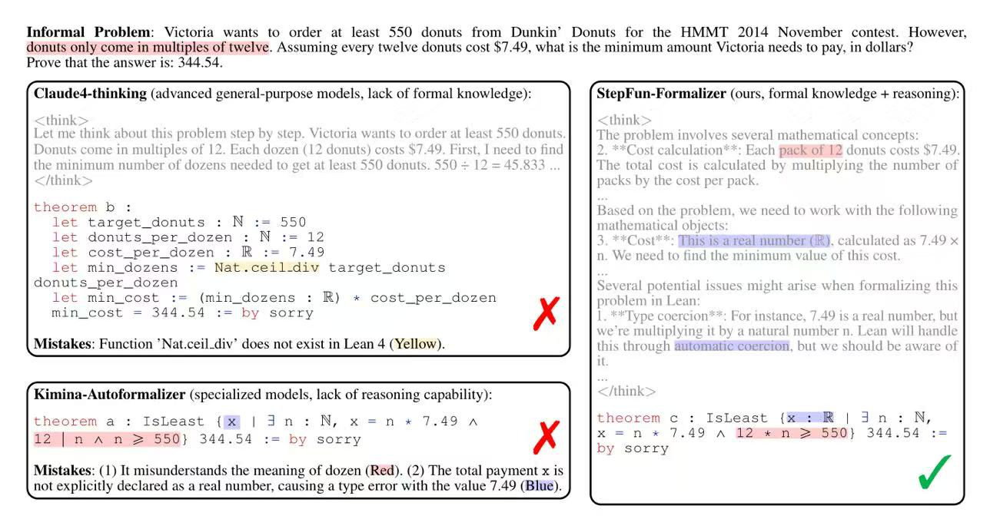
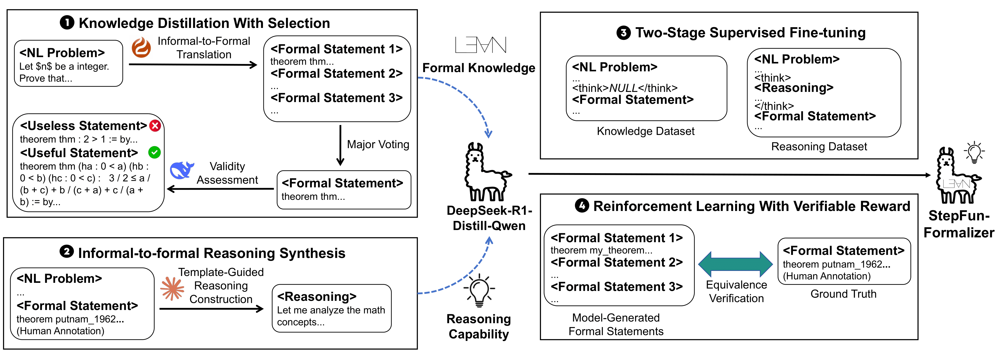
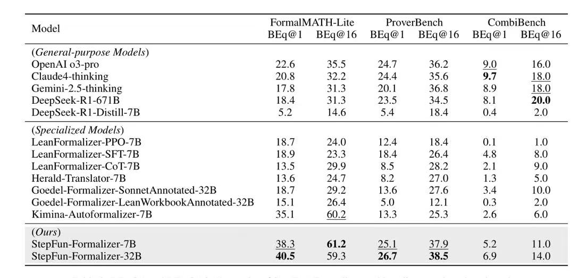

# StepFun-Formalizer: Unlocking the Autoformalization Potential of LLMs through Knowledge-Reasoning Fusion

<p align="center">
  <br>
</p>

<div align="center"> 
  <a href="https://www.arxiv.org/abs/2508.04440"></a> &ensp;
  <a href="https://huggingface.co/stepfun-ai/StepFun-Formalizer-32B"></a> &ensp;
  <a href="https://github.com/stepfun-ai/StepFun-Formalizer"></a> &ensp;
</div>
<br>

## Introduction

We introduce StepFun-Formalizer, a family of large language models designed to translate natural-language mathematical problems into formal statements in Lean 4. Through the fusion of formal knowledge and informal-to-formal reasoning capability, StepFun-Formalizer achieves strong performance on autoformalization tasks. Evaluated with [BEq](https://github.com/Purewhite2019/rethinking_autoformalization) verification on mainstream benchmarks including [FormalMATH-Lite](https://huggingface.co/datasets/SphereLab/FormalMATH-Lite), [ProverBench](https://huggingface.co/datasets/deepseek-ai/DeepSeek-ProverBench), and [CombiBench](https://huggingface.co/datasets/AI-MO/CombiBench), StepFun-Formalizer matches or exceeds all prior general-purpose and specialized autoformalization models of comparable scale. Please refer to our [paper](https://arxiv.org/abs/2508.04440) for more details.

<p align="center">
  
</p>

**Figure 1: A case study to demonstrate the impact of formal knowledge and informal-to-formal reasoning capability on autoformalization models.** It shows that general-purpose models without formal knowledge make mistakes in code implementation, while specialized ones without reasoning capability struggle with problem understanding and informal-formal alignment. StepFun-Formalizer improves autoformalization performance by combining these two capabilities.

## Method

<p align="center">
  
</p>

**Figure 2: The illustration of our method.** It shows the construction of the knowledge and reasoning datasets (① and ②), as well as the training process including SFT and RL (③ and ④).

## Evalaution Results

<p align="center">
  
</p>

**Tabel 1:** BEq@1 and BEq@16 (%) results of StepFun-Formalizer and baselines on three benchmarks. See `src/eval_benchmarks.py` for the evaluation code.

## Model Download

<div align="center">
  
| Model | Download |
| -------- | -------- |
|    StepFun-Formalizer-7B    |   [🤗HuggingFace](https://huggingface.co/stepfun-ai/StepFun-Formalizer-7B)    |
|    StepFun-Formalizer-32B    |   [🤗HuggingFace](https://huggingface.co/stepfun-ai/StepFun-Formalizer-32B)    |

</div>

## License
Both the code repository and the model weights are released under the Apache License (Version 2.0).

## Citation

```latex
@misc{stepfunformalizer2025,
      title={StepFun-Formalizer: Unlocking the Autoformalization Potential of LLMs through Knowledge-Reasoning Fusion}, 
      author={Yutong Wu and Di Huang and Ruosi Wan and Yue Peng and Shijie Shang and Chenrui Cao and Lei Qi and Rui Zhang and Zidong Du and Jie Yan and Xing Hu},
      year={2025},
      eprint={2508.04440},
      archivePrefix={arXiv},
      primaryClass={cs.CL},
      url={https://arxiv.org/abs/2508.04440}, 
}
```
