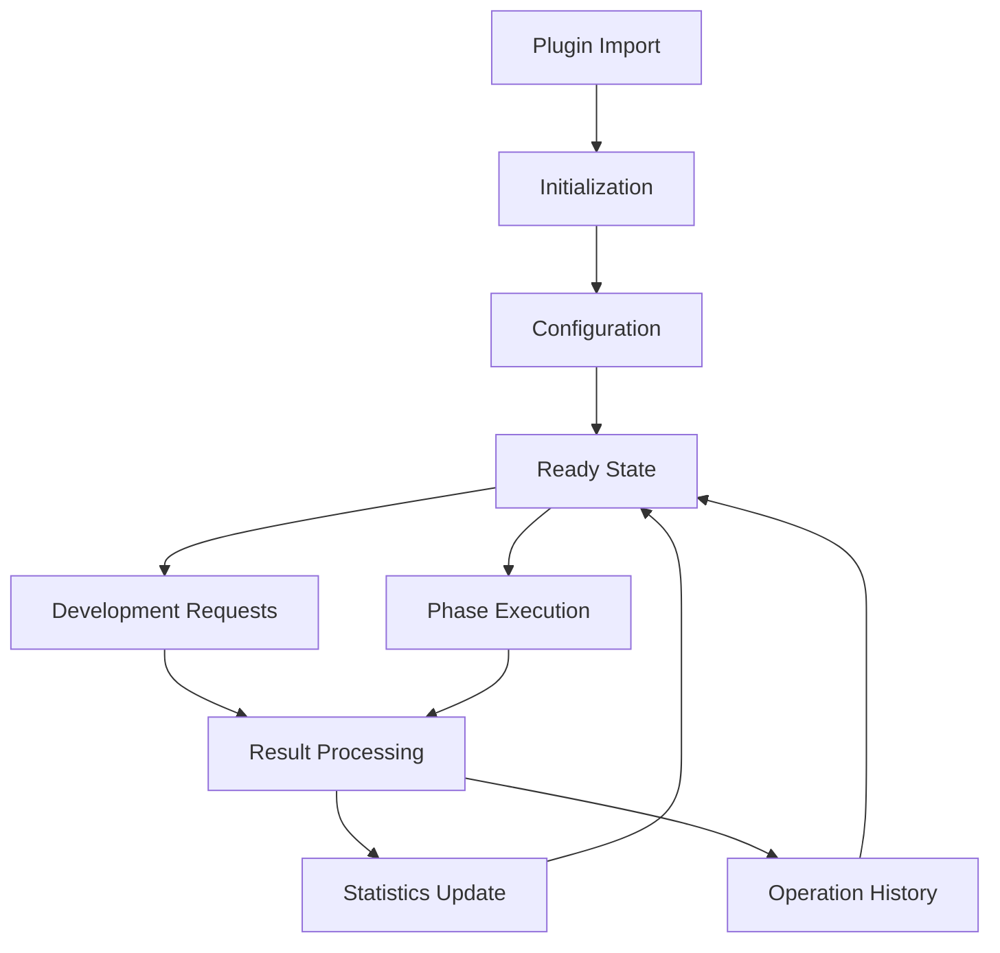

# BubbleLabs ClaudieMiro Plugin


**Standalone plugin for BubbleLabs that integrates ClaudieMiro's autonomous development capabilities.**

## 📋 Overview

The BubbleLabs ClaudieMiro Plugin provides a **zero-modification** integration that adds powerful autonomous development workflows to BubbleLabs. The plugin is **fully configurable through the UI** and requires **no changes to the core BubbleLabs codebase**.

## 🚀 Features

### ✅ Zero Core Modifications
- **Standalone plugin** that works with any BubbleLabs installation
- **No changes** to core BubbleLabs codebase required
- **Clean separation** of concerns with well-defined interfaces

### 🎛️ Fully Configurable UI
- **Configuration panel** for easy setup and management
- **Real-time status monitoring** with visual indicators
- **Workflow selection** with intelligent recommendations
- **Comprehensive logging** and operation history

### 🤖 Autonomous Development
- **6-phase workflow**: Problem Setup → Solution Generation → Adversarial Critique → Testing → Reassembly → Validation
- **Multi-agent collaboration**: Parallel execution and critique
- **Automated testing**: Test generation and execution
- **Quality validation**: Production-ready validation

### 📊 Monitoring and Reporting
- **Operation history** tracking
- **Performance statistics** and metrics
- **Error handling** with detailed reporting
- **Caching system** for performance optimization

## 📦 Installation

### Using npm

```bash
npm install bubblelabs-claudiomiro-plugin
```

### Using yarn

```bash
yarn add bubblelabs-claudiomiro-plugin
```

### Using pnpm

```bash
pnpm add bubblelabs-claudiomiro-plugin
```

## 🔧 Configuration

### Basic Setup

```typescript
import { ClaudieMiroPlugin, createPlugin } from 'bubblelabs-claudiomiro-plugin';

// Create plugin instance
const plugin = createPlugin({
  serverUrl: 'https://your-claudiomiro-server.com/api',
  apiKey: 'your-api-key',
  defaultWorkflow: 'standard'
});

// Initialize the plugin
await plugin.initialize();
```

### Advanced Configuration

```typescript
import { DEFAULT_CLAUDIEMIRO_CONFIG } from 'bubblelabs-claudiomiro-plugin';

const customConfig = {
  ...DEFAULT_CLAUDIEMIRO_CONFIG,
  serverUrl: 'https://enterprise-claudiomiro.example.com/api',
  apiKey: process.env.CLAUDIEMIRO_API_KEY,
  timeout: 900, // 15 minutes
  defaultWorkflow: 'advanced',
  phaseConfigurations: {
    phase2: { parallelExecution: true, maxWorkers: 8 },
    phase4: { testCoverageThreshold: 90 }
  },
  enableCaching: true,
  cacheTTLSeconds: 7200 // 2 hours
};

const plugin = createPlugin(customConfig);
await plugin.initialize();
```

## 🎯 Usage

### Running Autonomous Development

```typescript
import { useClaudieMiroPlugin } from 'bubblelabs-claudiomiro-plugin';

function AutonomousDeveloper() {
  const plugin = useClaudieMiroPlugin();
  
  const handleDevelop = async (taskDescription: string) => {
    try {
      const result = await plugin.runDevelopmentWorkflow(taskDescription, 'standard');
      
      if (result.success) {
        console.log('Development successful!');
        console.log('Task ID:', result.taskId);
        console.log('Phase:', result.phase);
        console.log('Artifacts:', result.artifacts);
        console.log('Confidence:', result.confidenceScore);
      } else {
        console.error('Development failed:', result.errors);
      }
    } catch (error) {
      console.error('Error:', error);
    }
  };
  
  // Use in your component
  return (
    <button onClick={() => handleDevelop('Create a REST API for user management')}>
      Run Autonomous Development
    </button>
  );
}
```

### Monitoring Task Progress

```typescript
import { useClaudieMiroPlugin } from 'bubblelabs-claudiomiro-plugin';

function TaskMonitor() {
  const plugin = useClaudieMiroPlugin();
  
  const checkTaskStatus = async (taskId: string) => {
    try {
      const status = await plugin.getTaskStatus(taskId);
      
      console.log('Status:', status.status);
      console.log('Current Phase:', status.currentPhase);
      console.log('Phases Completed:', status.phasesCompleted);
      console.log('Overall Progress:', status.overallProgress);
      
      return status;
    } catch (error) {
      console.error('Error:', error);
      return null;
    }
  };
  
  // Use in your component
  return (
    <button onClick={() => checkTaskStatus('task-12345')}>
      Check Task Status
    </button>
  );
}
```

### Using React Components

```typescript
import { ClaudieMiroConfigPanel, ClaudieMiroDevelopmentPanel } from 'bubblelabs-claudiomiro-plugin';

function ClaudieMiroIntegration() {
  const [showConfig, setShowConfig] = useState(false);
  const [showDevelopment, setShowDevelopment] = useState(false);
  
  return (
    <div className="claudiomiro-plugin">
      <button onClick={() => setShowConfig(true)}>
        Configure ClaudieMiro
      </button>
      
      <button onClick={() => setShowDevelopment(true)}>
        Run Development
      </button>
      
      {showConfig && (
        <ClaudieMiroConfigPanel
          onSave={(config) => {
            console.log('Configuration saved:', config);
            setShowConfig(false);
          }}
          onCancel={() => setShowConfig(false)}
        />
      )}
      
      {showDevelopment && (
        <ClaudieMiroDevelopmentPanel
          taskDescription="Implement user authentication system"
          workflow="advanced"
          onResult={(result) => {
            console.log('Development result:', result);
            setShowDevelopment(false);
          }}
          onClose={() => setShowDevelopment(false)}
        />
      )}
    </div>
  );
}
```

### Using React Hooks

```typescript
import { useClaudieMiroConfig, useClaudieMiroState, useClaudieMiroDevelopment } from 'bubblelabs-claudiomiro-plugin';

function ClaudieMiroHooksExample() {
  const [config, updateConfig] = useClaudieMiroConfig();
  const state = useClaudieMiroState();
  const runDevelopment = useClaudieMiroDevelopment();
  
  const handleUpdateConfig = () => {
    updateConfig({ defaultWorkflow: 'advanced' });
  };
  
  const handleRunDevelopment = async () => {
    const result = await runDevelopment('Create a React component library');
    console.log('Result:', result);
  };
  
  return (
    <div>
      <h3>ClaudieMiro Plugin Status</h3>
      <p>Status: {state.status}</p>
      <p>Workflow: {config.defaultWorkflow}</p>
      
      <button onClick={handleUpdateConfig}>
        Update Workflow to Advanced
      </button>
      
      <button onClick={handleRunDevelopment}>
        Run Development
      </button>
    </div>
  );
}
```

## 🎨 UI Components

### ClaudieMiroConfigPanel

**Configuration panel for ClaudieMiro plugin**

```typescript
import { ClaudieMiroConfigPanel } from 'bubblelabs-claudiomiro-plugin';

function App() {
  return (
    <ClaudieMiroConfigPanel
      onSave={(config) => console.log('Saved:', config)}
      onCancel={() => console.log('Cancelled')}
      showAdvanced={true}
    />
  );
}
```

### ClaudieMiroDevelopmentPanel

**Panel for running autonomous development**

```typescript
import { ClaudieMiroDevelopmentPanel } from 'bubblelabs-claudiomiro-plugin';

function App() {
  return (
    <ClaudieMiroDevelopmentPanel
      taskDescription="Build a data visualization dashboard"
      workflow="standard"
      onResult={(result) => console.log('Result:', result)}
      onClose={() => console.log('Panel closed')}
      showDebug={true}
    />
  );
}
```

### ClaudieMiroPhaseMonitor

**Panel for monitoring task progress**

```typescript
import { ClaudieMiroPhaseMonitor } from 'bubblelabs-claudiomiro-plugin';

function App() {
  return (
    <ClaudieMiroPhaseMonitor
      taskId="task-12345"
      onClose={() => console.log('Monitor closed')}
      showDetails={true}
    />
  );
}
```

### ClaudieMiroStatusIndicator

**Visual indicator of plugin status**

```typescript
import { ClaudieMiroStatusIndicator } from 'bubblelabs-claudiomiro-plugin';

function App() {
  return (
    <div>
      <h3>ClaudieMiro Status</h3>
      <ClaudieMiroStatusIndicator className="status-indicator" showDetails={true} />
    </div>
  );
}
```

### ClaudieMiroWorkflowSelector

**Component for selecting workflow types**

```typescript
import { ClaudieMiroWorkflowSelector } from 'bubblelabs-claudiomiro-plugin';

function App() {
  return (
    <ClaudieMiroWorkflowSelector
      selectedWorkflow="standard"
      onSelect={(workflow) => console.log('Selected:', workflow)}
      showDescriptions={true}
    />
  );
}
```

## 📊 Plugin Architecture

```
┌───────────────────────────────────────────────────────────────────────────────┐
│                        BubbleLabs ClaudieMiro Plugin                            │
├───────────────────────────────────────────────────────────────────────────────┤
│                                                                                   │
│  ┌─────────────────────┐    ┌─────────────────────┐    ┌───────────────────┐  │
│  │  React Components  │    │  React Hooks        │    │  Services         │  │
│  │                     │    │                     │    │                   │  │
│  └─────────────────────┘    └─────────────────────┘    └───────────────────┘  │
│              ▲                          ▲                          ▲                  │
│              │                          │                          │                  │
│  ┌─────────────────────┐    ┌─────────────────────┐    ┌───────────────────┐  │
│  │  Configurable UI    │    │  State Management   │    │  ClaudieMiro     │  │
│  │  Elements           │    │  (Zustand)          │    │  Client          │  │
│  └─────────────────────┘    └─────────────────────┘    │  (API Client)     │  │
│              ▲                          ▲                          ▲                  │
│              │                          │                          │                  │
│  ┌─────────────────────┐    ┌─────────────────────┐    └───────────────────┘  │
│  │  Plugin Interface   │    │  Type Definitions   │                          │
│  │  (Clean API)        │    │  (TypeScript)       │                          │
│  └─────────────────────┘    └─────────────────────┘                          │
│                                                                                   │
└───────────────────────────────────────────────────────────────────────────────┘
```

## 🔧 Configuration Options

### Plugin Configuration Interface

```typescript
interface ClaudieMiroPluginConfig {
  enabled: boolean;                      // Enable/disable plugin
  serverUrl: string;                     // ClaudieMiro server URL
  apiKey?: string;                       // API key for authentication
  timeout?: number;                      // Request timeout in seconds
  autonomousDevelopmentEnabled: boolean; // Enable autonomous development
  autoDetectDevelopmentTasks: boolean;   // Auto-detect development tasks
  defaultWorkflow: 'standard' | 'advanced' | 'custom'; // Default workflow type
  phaseConfigurations: {                 // Phase-specific configurations
    phase1?: { enabled: boolean; maxTasks?: number; timeout?: number; };
    phase2?: { enabled: boolean; parallelExecution?: boolean; maxWorkers?: number; };
    phase3?: { enabled: boolean; critiqueLevel?: 'basic' | 'standard' | 'advanced'; };
    phase4?: { enabled: boolean; testCoverageThreshold?: number; };
    phase5?: { enabled: boolean; reassemblyStrategy?: 'automatic' | 'manual' | 'hybrid'; };
    phase6?: { enabled: boolean; validationLevel?: 'basic' | 'standard' | 'strict'; };
  };
  integrateWithWorkflow: boolean;       // Integrate with BubbleLabs workflow
  integrateWithcrewai: boolean;      // Integrate with crewai
  integrateWithMCP: boolean;             // Integrate with MCP
  enableCaching: boolean;                // Enable result caching
  cacheTTLSeconds: number;               // Cache time-to-live in seconds
  maxOperationTime: number;              // Max operation time in seconds
  showAdvancedOptions: boolean;          // Show advanced UI options
  showDebugInfo: boolean;                // Show debug information
  theme: 'light' | 'dark' | 'system';    // UI theme
}
```

### Default Configuration

```typescript
import { DEFAULT_CLAUDIEMIRO_CONFIG } from 'bubblelabs-claudiomiro-plugin';

const config = DEFAULT_CLAUDIEMIRO_CONFIG;
// {
//   enabled: true,
//   serverUrl: 'http://localhost:3000/claudiomiro',
//   apiKey: '',
//   timeout: 600,
//   autonomousDevelopmentEnabled: true,
//   autoDetectDevelopmentTasks: true,
//   defaultWorkflow: 'standard',
//   phaseConfigurations: {
//     phase1: { enabled: true, maxTasks: 10, timeout: 300 },
//     phase2: { enabled: true, parallelExecution: true, maxWorkers: 4 },
//     phase3: { enabled: true, critiqueLevel: 'standard' },
//     phase4: { enabled: true, testCoverageThreshold: 80 },
//     phase5: { enabled: true, reassemblyStrategy: 'automatic' },
//     phase6: { enabled: true, validationLevel: 'standard' }
//   },
//   integrateWithWorkflow: true,
//   integrateWithcrewai: true,
//   integrateWithMCP: true,
//   enableCaching: true,
//   cacheTTLSeconds: 3600,
//   maxOperationTime: 300,
//   showAdvancedOptions: false,
//   showDebugInfo: false,
//   theme: 'system'
// }
```

## 📈 Monitoring and Analytics

### Statistics Tracking

```typescript
import { useClaudieMiroPlugin } from 'bubblelabs-claudiomiro-plugin';

function AnalyticsDashboard() {
  const plugin = useClaudieMiroPlugin();
  const stats = plugin.getStatistics();
  const history = plugin.getOperationHistory();
  
  return (
    <div className="analytics-dashboard">
      <h3>ClaudieMiro Analytics</h3>
      
      <div className="stats-summary">
        <div>Total Operations: {stats.totalOperations}</div>
        <div>Successful: {stats.successfulOperations}</div>
        <div>Failed: {stats.failedOperations}</div>
        <div>Avg Completion Time: {stats.averageCompletionTime.toFixed(2)}s</div>
        <div>Last Operation: {stats.lastOperationTime?.toLocaleString()}</div>
        <div>Phases Completed: {JSON.stringify(stats.phasesCompleted)}</div>
      </div>
      
      <div className="operation-history">
        <h4>Recent Operations</h4>
        <ul>
          {history.slice(0, 10).map((op) => (
            <li key={op.id} className={op.success ? 'success' : 'error'}>
              {op.timestamp.toLocaleTimeString()} - Phase {op.phase || 'N/A'} - {op.message}
            </li>
          ))}
        </ul>
      </div>
    </div>
  );
}
```

### Status Monitoring

```typescript
import { useClaudieMiroPlugin } from 'bubblelabs-claudiomiro-plugin';

function StatusMonitor() {
  const plugin = useClaudieMiroPlugin();
  const status = plugin.getStatus();
  const context = plugin.getContext();
  
  const statusInfo = {
    idle: { color: 'gray', text: 'Plugin is idle' },
    initializing: { color: 'blue', text: 'Initializing plugin...' },
    ready: { color: 'green', text: 'Plugin is ready' },
    error: { color: 'red', text: 'Plugin error occurred' },
    busy: { color: 'orange', text: 'Plugin is busy' }
  };
  
  const currentStatus = statusInfo[status] || statusInfo.idle;
  
  return (
    <div className="status-monitor">
      <h3>ClaudieMiro Status</h3>
      
      <div className="status-indicator" style={{ color: currentStatus.color }}>
        <strong>{status.toUpperCase()}</strong>: {currentStatus.text}
      </div>
      
      {context.currentOperation && (
        <div className="current-operation">
          <h4>Current Operation</h4>
          <p>Type: {context.currentOperation.type}</p>
          <p>Phase: {context.currentOperation.phase || 'N/A'}</p>
          <p>Started: {context.currentOperation.startedAt.toLocaleTimeString()}</p>
          {context.currentOperation.message && (
            <p>Message: {context.currentOperation.message}</p>
          )}
          {context.currentOperation.progress !== undefined && (
            <progress value={context.currentOperation.progress} max="100" />
          )}
        </div>
      )}
    </div>
  );
}
```

## 🎯 Integration with BubbleLabs

### Zero-Modification Integration

The plugin is designed to work **without any modifications** to the BubbleLabs core codebase:

```typescript
// In your BubbleLabs application
import { ClaudieMiroPlugin, ClaudieMiroConfigPanel } from 'bubblelabs-claudiomiro-plugin';

// 1. Initialize the plugin
const plugin = ClaudieMiroPlugin;

// 2. Use the configuration panel in your UI
function SettingsPage() {
  return (
    <div>
      <h2>Integrations</h2>
      <ClaudieMiroConfigPanel
        onSave={(config) => {
          plugin.updateConfig(config);
          console.log('ClaudieMiro configured successfully');
        }}
        onCancel={() => console.log('Configuration cancelled')}
      />
    </div>
  );
}

// 3. Use autonomous development in your workflows
function WorkflowPage() {
  const [taskDescription, setTaskDescription] = useState('');
  const [result, setResult] = useState(null);
  
  const handleDevelop = async () => {
    const developmentResult = await plugin.runDevelopmentWorkflow(taskDescription);
    setResult(developmentResult);
  };
  
  return (
    <div>
      <textarea 
        value={taskDescription} 
        onChange={(e) => setTaskDescription(e.target.value)} 
        placeholder="Enter development task..."
      />
      <button onClick={handleDevelop}>Run Autonomous Development</button>
      
      {result && (
        <div>
          <h3>Development Result</h3>
          <p>Success: {result.success ? 'Yes' : 'No'}</p>
          <p>Task ID: {result.taskId}</p>
          <p>Phase: {result.phase}</p>
          <p>Confidence: {result.confidenceScore}</p>
        </div>
      )}
    </div>
  );
}
```

### Plugin Lifecycle



## 🚀 Benefits

### For BubbleLabs Users

1. **🤖 Autonomous Development**: Run complete development workflows with minimal input
2. **🔄 Multi-Phase Workflows**: Benefit from ClaudieMiro's proven 6-phase process
3. **📊 Quality Assurance**: Automated testing and validation ensure high-quality results
4. **🔧 Easy Integration**: Simple import and use without codebase modifications
5. **🎨 Customizable UI**: Configure the plugin through intuitive interfaces

### For Developers

1. **📦 Standalone Package**: No dependencies on core BubbleLabs internals
2. **🔧 Clean API**: Well-defined TypeScript interfaces and types
3. **🧪 Testable**: Comprehensive test suite and error handling
4. **📚 Well-Documented**: Complete documentation and examples
5. **🔄 Extensible**: Designed for easy extension and customization

### For Enterprises

1. **🔒 Secure**: API key management and secure communication
2. **📈 Scalable**: Performance optimization with caching and parallel execution
3. **📊 Monitorable**: Comprehensive analytics and reporting
4. **🔧 Maintainable**: Clean separation of concerns
5. **🚀 Future-Proof**: Designed for easy updates and enhancements

## 📚 Documentation

### API Reference

Complete API documentation is available in the TypeScript type definitions. All interfaces, types, and method signatures are fully documented with JSDoc comments.

### Examples

See the `examples/` directory for complete working examples of:
- Basic plugin integration
- Advanced configuration
- React component usage
- React hooks usage
- Error handling patterns
- Performance optimization

### Troubleshooting

Common issues and solutions:

**Issue: Plugin not initializing**
- Check that the ClaudieMiro server URL is correct
- Verify that the server is running and accessible
- Ensure API key is valid (if required)

**Issue: Development workflow failing**
- Check that the task description is clear and specific
- Try different workflow types (standard is recommended)
- Verify server connectivity and timeouts

**Issue: Phase execution errors**
- Check phase-specific configuration
- Review task requirements and constraints
- Verify resource availability

## 🔮 Future Enhancements

The plugin is designed for extensibility. Future enhancements may include:

- **🌐 Multi-server support**: Load balancing and failover
- **🤖 AI workflow optimization**: Machine learning-based workflow selection
- **📚 Knowledge base integration**: Domain-specific development patterns
- **🔄 Interactive development**: Human-in-the-loop refinement
- **📊 Advanced analytics**: Machine learning-based performance prediction
- **🌐 Cloud synchronization**: Cross-device configuration sync

## 📝 License

MIT License - See [LICENSE](LICENSE) for details.

## 🤝 Support

For issues, feature requests, or questions:
- **GitHub Issues**: https://github.com/openevolve/bubblelabs-claudiomiro-plugin/issues
- **Documentation**: https://github.com/openevolve/bubblelabs-claudiomiro-plugin/wiki
- **Community**: Join our Discord or Slack community

## 🎉 Conclusion

The BubbleLabs ClaudieMiro Plugin provides a **powerful, flexible, and easy-to-integrate** solution for adding autonomous development capabilities to BubbleLabs workflows. With **zero modifications** to the core codebase and **full UI configurability**, it offers a seamless way to enhance workflows with ClaudieMiro's proven autonomous development process.

Whether you're working with simple development tasks or complex multi-component systems, the ClaudieMiro plugin provides the tools needed for **autonomous development, quality assurance, and comprehensive monitoring**—all through an intuitive and customizable interface.