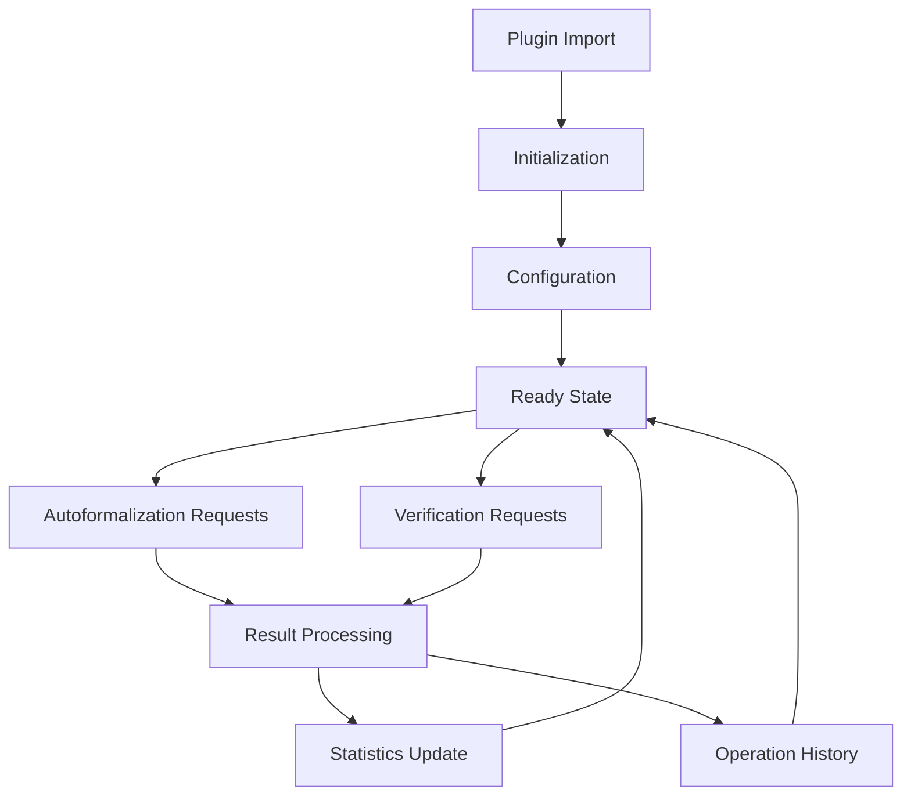

# BubbleLabs LeanAIDE Plugin


**Standalone plugin for BubbleLabs that adds mathematical autoformalization and verification capabilities using LeanAIDE.**

## 📋 Overview

The BubbleLabs LeanAIDE Plugin provides a **zero-modification** integration that adds powerful mathematical formalization and verification capabilities to BubbleLabs workflows. The plugin is **fully configurable through the UI** and requires **no changes to the core BubbleLabs codebase**.

## 🚀 Features

### ✅ Zero Core Modifications
- **Standalone plugin** that works with any BubbleLabs installation
- **No changes** to core BubbleLabs codebase required
- **Clean separation** of concerns with well-defined interfaces

### 🎛️ Fully Configurable UI
- **Configuration panel** for easy setup and management
- **Real-time status monitoring** with visual indicators
- **Strategy selection** with intelligent recommendations
- **Comprehensive logging** and operation history

### 🔬 Mathematical Autoformalization
- **Automatic detection** of mathematical problems
- **Multiple strategies**: DIRECT, MDAP, MAKER, HYBRID, ADAPTIVE
- **Domain detection**: Algebra, Analysis, Logic, Number Theory, etc.
- **Confidence scoring** for quality assessment

### 📊 Formal Verification
- **Lean 4 theorem prover** integration
- **Formal proof generation** and validation
- **Confidence-based verification** with thresholds
- **Hybrid verification** combining multiple approaches

### 📈 Monitoring and Reporting
- **Operation history** tracking
- **Performance statistics** and metrics
- **Error handling** with detailed reporting
- **Caching system** for performance optimization

## 📦 Installation

### Using npm

```bash
npm install bubblelabs-leanaide-plugin
```

### Using yarn

```bash
yarn add bubblelabs-leanaide-plugin
```

### Using pnpm

```bash
pnpm add bubblelabs-leanaide-plugin
```

## 🔧 Configuration

### Basic Setup

```typescript
import { LeanAIDEPlugin, createPlugin } from 'bubblelabs-leanaide-plugin';

// Create plugin instance
const plugin = createPlugin({
  serverUrl: 'https://your-leanaide-server.com/api',
  apiKey: 'your-api-key',
  defaultStrategy: 'ADAPTIVE'
});

// Initialize the plugin
await plugin.initialize();
```

### Advanced Configuration

```typescript
import { DEFAULT_LEANAIDE_CONFIG } from 'bubblelabs-leanaide-plugin';

const customConfig = {
  ...DEFAULT_LEANAIDE_CONFIG,
  serverUrl: 'https://enterprise-leanaide.example.com/api',
  apiKey: process.env.LEANAIDE_API_KEY,
  timeout: 600, // 10 minutes
  defaultStrategy: 'HYBRID',
  minConfidenceForVerification: 0.85,
  enableCaching: true,
  cacheTTLSeconds: 7200 // 2 hours
};

const plugin = createPlugin(customConfig);
await plugin.initialize();
```

## 🎯 Usage

### Autoformalization

```typescript
import { useLeanAIDEPlugin } from 'bubblelabs-leanaide-plugin';

function MathematicalProblemSolver() {
  const plugin = useLeanAIDEPlugin();
  
  const handleAutoformalize = async (problem: string) => {
    try {
      const result = await plugin.autoformalize(problem, 'ADAPTIVE');
      
      if (result.success) {
        console.log('Formalized problem:', result.formalizedProblem);
        console.log('Lean code:', result.leanCode);
        console.log('Confidence:', result.confidenceScore);
      } else {
        console.error('Autoformalization failed:', result.errors);
      }
    } catch (error) {
      console.error('Error:', error);
    }
  };
  
  // Use in your component
  return (
    <button onClick={() => handleAutoformalize('Prove that 1 + 1 = 2')}>
      Autoformalize Problem
    </button>
  );
}
```

### Verification

```typescript
import { useLeanAIDEPlugin } from 'bubblelabs-leanaide-plugin';

function SolutionVerifier() {
  const plugin = useLeanAIDEPlugin();
  
  const handleVerify = async (problem: string, leanCode: string) => {
    try {
      const result = await plugin.verify(problem, leanCode);
      
      if (result.success) {
        console.log('Verification successful!');
        console.log('Confidence:', result.confidenceScore);
        console.log('Formal proof:', result.formalProof);
      } else {
        console.error('Verification failed:', result.errors);
      }
    } catch (error) {
      console.error('Error:', error);
    }
  };
  
  // Use in your component
  return (
    <button onClick={() => handleVerify(
      'Prove that 1 + 1 = 2',
      'theorem one_plus_one : 1 + 1 = 2 := rfl'
    )}>
      Verify Solution
    </button>
  );
}
```

### Using React Components

```typescript
import { LeanAIDEConfigPanel, LeanAIDEAutoformalizationPanel } from 'bubblelabs-leanaide-plugin';

function LeanAIDEIntegration() {
  const [showConfig, setShowConfig] = useState(false);
  const [showAutoformalization, setShowAutoformalization] = useState(false);
  
  return (
    <div className="lean-aide-plugin">
      <button onClick={() => setShowConfig(true)}>
        Configure LeanAIDE
      </button>
      
      <button onClick={() => setShowAutoformalization(true)}>
        Autoformalize Problem
      </button>
      
      {showConfig && (
        <LeanAIDEConfigPanel
          onSave={(config) => {
            console.log('Configuration saved:', config);
            setShowConfig(false);
          }}
          onCancel={() => setShowConfig(false)}
        />
      )}
      
      {showAutoformalization && (
        <LeanAIDEAutoformalizationPanel
          problem="Prove that for all n, n + 0 = n"
          onResult={(result) => {
            console.log('Autoformalization result:', result);
            setShowAutoformalization(false);
          }}
          onClose={() => setShowAutoformalization(false)}
        />
      )}
    </div>
  );
}
```

### Using React Hooks

```typescript
import { useLeanAIDEConfig, useLeanAIDEState, useLeanAIDEAutoformalization } from 'bubblelabs-leanaide-plugin';

function LeanAIDEHooksExample() {
  const [config, updateConfig] = useLeanAIDEConfig();
  const state = useLeanAIDEState();
  const autoformalize = useLeanAIDEAutoformalization();
  
  const handleUpdateConfig = () => {
    updateConfig({ defaultStrategy: 'HYBRID' });
  };
  
  const handleAutoformalize = async () => {
    const result = await autoformalize('Prove that 2 + 2 = 4');
    console.log('Result:', result);
  };
  
  return (
    <div>
      <h3>LeanAIDE Plugin Status</h3>
      <p>Status: {state.status}</p>
      <p>Strategy: {config.defaultStrategy}</p>
      
      <button onClick={handleUpdateConfig}>
        Update Strategy to HYBRID
      </button>
      
      <button onClick={handleAutoformalize}>
        Autoformalize Problem
      </button>
    </div>
  );
}
```

## 🎨 UI Components

### LeanAIDEConfigPanel

**Configuration panel for LeanAIDE plugin**

```typescript
import { LeanAIDEConfigPanel } from 'bubblelabs-leanaide-plugin';

function App() {
  return (
    <LeanAIDEConfigPanel
      onSave={(config) => console.log('Saved:', config)}
      onCancel={() => console.log('Cancelled')}
      showAdvanced={true}
    />
  );
}
```

### LeanAIDEAutoformalizationPanel

**Panel for autoformalizing mathematical problems**

```typescript
import { LeanAIDEAutoformalizationPanel } from 'bubblelabs-leanaide-plugin';

function App() {
  return (
    <LeanAIDEAutoformalizationPanel
      problem="Prove that the sum of first n odd numbers is n²"
      initialStrategy="ADAPTIVE"
      onResult={(result) => console.log('Result:', result)}
      onClose={() => console.log('Panel closed')}
      showDebug={true}
    />
  );
}
```

### LeanAIDEVerificationPanel

**Panel for verifying formalized solutions**

```typescript
import { LeanAIDEVerificationPanel } from 'bubblelabs-leanaide-plugin';

function App() {
  return (
    <LeanAIDEVerificationPanel
      problem="Prove that 1 + 1 = 2"
      leanCode="theorem one_plus_one : 1 + 1 = 2 := rfl"
      onResult={(result) => console.log('Verification result:', result)}
      onClose={() => console.log('Panel closed')}
      showDebug={true}
    />
  );
}
```

### LeanAIDEStrategySelector

**Component for selecting autoformalization strategies**

```typescript
import { LeanAIDEStrategySelector } from 'bubblelabs-leanaide-plugin';

function App() {
  return (
    <LeanAIDEStrategySelector
      selectedStrategy="ADAPTIVE"
      onSelect={(strategy) => console.log('Selected:', strategy)}
      problemContext="Prove that 1 + 1 = 2"
      showDescriptions={true}
    />
  );
}
```

### LeanAIDEStatusIndicator

**Visual indicator of plugin status**

```typescript
import { LeanAIDEStatusIndicator } from 'bubblelabs-leanaide-plugin';

function App() {
  return (
    <div>
      <h3>LeanAIDE Status</h3>
      <LeanAIDEStatusIndicator className="status-indicator" showDetails={true} />
    </div>
  );
}
```

## 📊 Plugin Architecture

```
┌───────────────────────────────────────────────────────────────────────────────┐
│                        BubbleLabs LeanAIDE Plugin                              │
├───────────────────────────────────────────────────────────────────────────────┤
│                                                                                   │
│  ┌─────────────────────┐    ┌─────────────────────┐    ┌───────────────────┐  │
│  │  React Components  │    │  React Hooks        │    │  Services         │  │
│  │                     │    │                     │    │                   │  │
│  └─────────────────────┘    └─────────────────────┘    └───────────────────┘  │
│              ▲                          ▲                          ▲                  │
│              │                          │                          │                  │
│  ┌─────────────────────┐    ┌─────────────────────┐    ┌───────────────────┐  │
│  │  Configurable UI    │    │  State Management   │    │  LeanAIDE Client  │  │
│  │  Elements           │    │  (Zustand)          │    │  (API Client)     │  │
│  └─────────────────────┘    └─────────────────────┘    └───────────────────┘  │
│              ▲                          ▲                          ▲                  │
│              │                          │                          │                  │
│  ┌─────────────────────┐    ┌─────────────────────┐    ┌───────────────────┐  │
│  │  Plugin Interface   │    │  Type Definitions   │    │  Error Handling   │  │
│  │  (Clean API)        │    │  (TypeScript)       │    │  (Comprehensive)  │  │
│  └─────────────────────┘    └─────────────────────┘    └───────────────────┘  │
│                                                                                   │
└───────────────────────────────────────────────────────────────────────────────┘
```

## 🔧 Configuration Options

### Plugin Configuration Interface

```typescript
interface LeanAIDEPluginConfig {
  enabled: boolean;                      // Enable/disable plugin
  serverUrl: string;                     // LeanAIDE server URL
  apiKey?: string;                       // API key for authentication
  timeout?: number;                      // Request timeout in seconds
  autoformalizationEnabled: boolean;     // Enable autoformalization
  autoDetectMathProblems: boolean;       // Auto-detect mathematical problems
  defaultStrategy: 'DIRECT' | 'MDAP' | 'MAKER' | 'HYBRID' | 'ADAPTIVE';
  minConfidenceForAutoformalization: number; // Minimum confidence threshold
  minConfidenceForVerification: number;  // Minimum verification confidence
  integrateWithDecomposition: boolean;   // Integrate with decomposition
  integrateWithEvolution: boolean;       // Integrate with evolution
  integrateWithVerification: boolean;    // Integrate with verification
  enableCaching: boolean;                // Enable result caching
  cacheTTLSeconds: number;               // Cache time-to-live in seconds
  maxAutoformalizationTime: number;      // Max operation time in seconds
  showAdvancedOptions: boolean;          // Show advanced UI options
  showDebugInfo: boolean;                // Show debug information
  theme: 'light' | 'dark' | 'system';    // UI theme
}
```

### Default Configuration

```typescript
import { DEFAULT_LEANAIDE_CONFIG } from 'bubblelabs-leanaide-plugin';

const config = DEFAULT_LEANAIDE_CONFIG;
// {
//   enabled: true,
//   serverUrl: 'http://localhost:3000/leanaide',
//   apiKey: '',
//   timeout: 300,
//   autoformalizationEnabled: true,
//   autoDetectMathProblems: true,
//   defaultStrategy: 'ADAPTIVE',
//   minConfidenceForAutoformalization: 0.6,
//   minConfidenceForVerification: 0.8,
//   integrateWithDecomposition: true,
//   integrateWithEvolution: true,
//   integrateWithVerification: true,
//   enableCaching: true,
//   cacheTTLSeconds: 3600,
//   maxAutoformalizationTime: 120,
//   showAdvancedOptions: false,
//   showDebugInfo: false,
//   theme: 'system'
// }
```

## 📈 Monitoring and Analytics

### Statistics Tracking

```typescript
import { useLeanAIDEPlugin } from 'bubblelabs-leanaide-plugin';

function AnalyticsDashboard() {
  const plugin = useLeanAIDEPlugin();
  const stats = plugin.getStatistics();
  const history = plugin.getOperationHistory();
  
  return (
    <div className="analytics-dashboard">
      <h3>LeanAIDE Analytics</h3>
      
      <div className="stats-summary">
        <div>Total Operations: {stats.totalOperations}</div>
        <div>Successful: {stats.successfulOperations}</div>
        <div>Failed: {stats.failedOperations}</div>
        <div>Avg Confidence: {stats.averageConfidence.toFixed(2)}</div>
        <div>Last Operation: {stats.lastOperationTime?.toLocaleString()}</div>
      </div>
      
      <div className="operation-history">
        <h4>Recent Operations</h4>
        <ul>
          {history.slice(0, 10).map((op) => (
            <li key={op.id} className={op.success ? 'success' : 'error'}>
              {op.timestamp.toLocaleTimeString()} - {op.type} - {op.message}
            </li>
          ))}
        </ul>
      </div>
    </div>
  );
}
```

### Status Monitoring

```typescript
import { useLeanAIDEPlugin } from 'bubblelabs-leanaide-plugin';

function StatusMonitor() {
  const plugin = useLeanAIDEPlugin();
  const status = plugin.getStatus();
  const context = plugin.getContext();
  
  const statusInfo = {
    idle: { color: 'gray', text: 'Plugin is idle' },
    initializing: { color: 'blue', text: 'Initializing plugin...' },
    ready: { color: 'green', text: 'Plugin is ready' },
    error: { color: 'red', text: 'Plugin error occurred' },
    busy: { color: 'orange', text: 'Plugin is busy' }
  };
  
  const currentStatus = statusInfo[status] || statusInfo.idle;
  
  return (
    <div className="status-monitor">
      <h3>LeanAIDE Status</h3>
      
      <div className="status-indicator" style={{ color: currentStatus.color }}>
        <strong>{status.toUpperCase()}</strong>: {currentStatus.text}
      </div>
      
      {context.currentOperation && (
        <div className="current-operation">
          <h4>Current Operation</h4>
          <p>Type: {context.currentOperation.type}</p>
          <p>Started: {context.currentOperation.startedAt.toLocaleTimeString()}</p>
          {context.currentOperation.message && (
            <p>Message: {context.currentOperation.message}</p>
          )}
          {context.currentOperation.progress !== undefined && (
            <progress value={context.currentOperation.progress} max="100" />
          )}
        </div>
      )}
    </div>
  );
}
```

## 🎯 Integration with BubbleLabs

### Zero-Modification Integration

The plugin is designed to work **without any modifications** to the BubbleLabs core codebase:

```typescript
// In your BubbleLabs application
import { LeanAIDEPlugin, LeanAIDEConfigPanel } from 'bubblelabs-leanaide-plugin';

// 1. Initialize the plugin
const plugin = LeanAIDEPlugin;

// 2. Use the configuration panel in your UI
function SettingsPage() {
  return (
    <div>
      <h2>Integrations</h2>
      <LeanAIDEConfigPanel
        onSave={(config) => {
          plugin.updateConfig(config);
          console.log('LeanAIDE configured successfully');
        }}
        onCancel={() => console.log('Configuration cancelled')}
      />
    </div>
  );
}

// 3. Use autoformalization in your workflows
function WorkflowPage() {
  const [problem, setProblem] = useState('');
  const [result, setResult] = useState(null);
  
  const handleAutoformalize = async () => {
    const autoformalizationResult = await plugin.autoformalize(problem);
    setResult(autoformalizationResult);
  };
  
  return (
    <div>
      <textarea 
        value={problem} 
        onChange={(e) => setProblem(e.target.value)} 
        placeholder="Enter mathematical problem..."
      />
      <button onClick={handleAutoformalize}>Autoformalize</button>
      
      {result && (
        <div>
          <h3>Autoformalization Result</h3>
          <p>Success: {result.success ? 'Yes' : 'No'}</p>
          <p>Confidence: {result.confidenceScore}</p>
          {result.leanCode && (
            <div>
              <h4>Lean Code:</h4>
              <pre>{result.leanCode}</pre>
            </div>
          )}
        </div>
      )}
    </div>
  );
}
```

### Plugin Lifecycle



## 🚀 Benefits

### For BubbleLabs Users

1. **🎯 Mathematical Precision**: Add formal mathematical verification to workflows
2. **🤖 AI-Powered Formalization**: Automatically convert natural language to formal proofs
3. **📊 Confidence Scoring**: Make informed decisions based on verification confidence
4. **🔧 Easy Integration**: Simple import and use without codebase modifications
5. **🎨 Customizable UI**: Configure the plugin through intuitive interfaces

### For Developers

1. **📦 Standalone Package**: No dependencies on core BubbleLabs internals
2. **🔧 Clean API**: Well-defined TypeScript interfaces and types
3. **🧪 Testable**: Comprehensive test suite and error handling
4. **📚 Well-Documented**: Complete documentation and examples
5. **🔄 Extensible**: Designed for easy extension and customization

### For Enterprises

1. **🔒 Secure**: API key management and secure communication
2. **📈 Scalable**: Performance optimization with caching
3. **📊 Monitorable**: Comprehensive analytics and reporting
4. **🔧 Maintainable**: Clean separation of concerns
5. **🚀 Future-Proof**: Designed for easy updates and enhancements

## 📚 Documentation

### API Reference

Complete API documentation is available in the TypeScript type definitions. All interfaces, types, and method signatures are fully documented with JSDoc comments.

### Examples

See the `examples/` directory for complete working examples of:
- Basic plugin integration
- Advanced configuration
- React component usage
- React hooks usage
- Error handling patterns
- Performance optimization

### Troubleshooting

Common issues and solutions:

**Issue: Plugin not initializing**
- Check that the LeanAIDE server URL is correct
- Verify that the server is running and accessible
- Ensure API key is valid (if required)

**Issue: Autoformalization failing**
- Check that the problem is mathematical in nature
- Try different strategies (ADAPTIVE is recommended)
- Verify server connectivity and timeouts

**Issue: Low confidence scores**
- Try more advanced strategies (HYBRID or MAKER)
- Simplify the problem statement
- Use domain-specific configuration

## 🔮 Future Enhancements

The plugin is designed for extensibility. Future enhancements may include:

- **🌐 Multi-server support**: Load balancing and failover
- **🤖 AI strategy selection**: Machine learning-based strategy optimization
- **📚 Knowledge base integration**: Domain-specific optimization
- **🔄 Interactive formalization**: Human-in-the-loop refinement
- **📊 Advanced analytics**: Machine learning-based performance prediction
- **🌐 Cloud synchronization**: Cross-device configuration sync

## 📝 License

MIT License - See [LICENSE](LICENSE) for details.

## 🤝 Support

For issues, feature requests, or questions:
- **GitHub Issues**: https://github.com/openevolve/bubblelabs-leanaide-plugin/issues
- **Documentation**: https://github.com/openevolve/bubblelabs-leanaide-plugin/wiki
- **Community**: Join our Discord or Slack community

## 🎉 Conclusion

The BubbleLabs LeanAIDE Plugin provides a **powerful, flexible, and easy-to-integrate** solution for adding mathematical autoformalization and verification capabilities to BubbleLabs workflows. With **zero modifications** to the core codebase and **full UI configurability**, it offers a seamless way to enhance workflows with rigorous mathematical verification.

Whether you're working with simple mathematical problems or complex theoretical proofs, the LeanAIDE plugin provides the tools needed for **automated formalization, confidence-based verification, and comprehensive monitoring**—all through an intuitive and customizable interface.