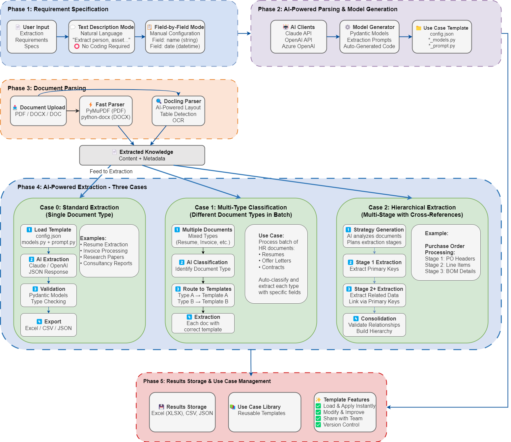

# Knowledge Extraction Tool - V2

An AI-powered knowledge extraction tool that extracts key information from documents using Large Lnaguage Models (LLMs). The tool supports dynamic Pydantic model generation, document parsing with multiple parsing methods, and three distinct extraction workflows for different complexity levels.

**This is Version 2 of the Generic Knowledge Extraction Tool** - A version with enhanced capabilities, modular architecture, and three distinct extraction cases. 

**User Interface**: The product UI for this tool is **BubbleLab (TypeScript)**, located at `core-projects/BubbleLab`. This subproject provides the Python backend/CLI logic and libraries that BubbleLab consumes via API. The former Python web UI has been removed.

**Read the article on Version 1**: [Building a Generic Knowledge Extraction AI Agent](https://medium.com/data-science-collective/building-a-generic-knowledge-extraction-ai-agent-that-allows-the-creation-of-flexible-586d6a1b1499)

**Version 1**: [Original implementation](https://github.com/umairalipathan1980/A-Generic-Knowledge-Extraction-AI-Agent)



**See the demo video**: [Demo Video](https://www.youtube.com/watch?v=DfzbVcE7fRc&t=6s)

## ✨ Key Features

### **AI-Powered Configuration**
- **Text Description Mode**: Natural language interface - describe what you want to extract in plain English
- **Field-by-Field Mode**: Traditional manual configuration with intuitive UI controls
- **Auto Model Generation**: Converts configurations into production-ready Pydantic models and extraction prompts
- **Multi-AI Support**: Choose between Claude (Sonnet-4), OpenAI (GPT-4.1), or Azure OpenAI

### **Advanced Document Parsing**
- **Fast Parser**: PyMuPDF (PDF) + python-docx (DOCX) for speed (~5 seconds)
- **AI-Powered Parser**: Docling with layout detection, table extraction, and OCR (Requires a CUDA-enabled GPU for faster processing)
- **Automatic Format Detection**: Handles various document layouts and structures
- **Batch Processing**: Process multiple documents simultaneously

### **Three Extraction Cases**

#### **Case 0: Single-Type Documents**
Standard extraction for homogeneous document batches
- Resume processing
- Invoice extraction  
- Research paper analysis
- Business report processing

#### **Case 1: Multi-Type Classification**
Intelligent document classification and routing
- Mixed document batches (resumes + offer letters + contracts)
- AI-powered content analysis for classification
- Parallel extraction with type-specific templates
- Automatic routing to appropriate extractors

#### **Case 2: Hierarchical Extraction**
Multi-stage extraction with cross-document relationships
- Purchase Orders → Bill of Materials linking
- Medical lab reports with patient ID relationships
- Sequential stage processing
- Cross-reference validation and consolidation

### **Template System**
- **Pre-built Use Cases**: Ready-to-use templates for common scenarios
- **Save & Reuse**: Convert any configuration into a reusable template
- **Template Library**: AI Consultancy Reports, Lab Report Extraction, PO Processing, Resume Analysis
- **Easy Customization**: Load, modify, and improve existing templates

### **Export & Integration**
- **Multiple Formats**: Excel (.xlsx), CSV, JSON export
- **Structured Output**: Validated data with Pydantic type checking
- **Batch Results**: Process and export hundreds of documents
- **Timestamp Tracking**: Automatic result file naming with timestamps

### **Enterprise Features**
- **Azure OpenAI Integration**: Enterprise-grade AI with data residency
- **API Key Management**: Secure .env-based configuration
- **Error Handling**: Robust fallback mechanisms
- **Logging**: Comprehensive activity tracking
- **Validation**: Automatic data type checking and validation

## Quick Start

### Prerequisites
- Python 3.12+
- API keys for Claude and/or OpenAI

### Installation

1. **Clone the repository**
```bash
git clone https://github.com/umairalipathan1980/Generic-Knowledge-Extraction-Tool-with-Multiple-Extractors.git
cd Generic-Knowledge-Extraction-Tool-with-Multiple-Extractors
```

2. **Set up environment**
```bash
# Run automated setup
./setup.sh

# Or manually:
python -m venv venv
source venv/bin/activate  # On Windows: venv\Scripts\activate
pip install -r requirements.txt
```

3. **Configure API keys**
```bash
# Copy environment template
cp .env.example .env

# Edit .env with your API keys. You can use a single LLM for all tasks
CLAUDE_API_KEY=your_claude_key_here
OPENAI_API_KEY=your_openai_key_here
AZURE_API_KEY=your_azure_openai_key_here  # Optional
```

4. **Launch the application**

The user interface for this tool is **BubbleLab (TypeScript)**, located at `core-projects/BubbleLab`. The Python code in this subproject provides the backend/CLI logic and libraries that BubbleLab drives via API; there is no standalone Python UI to launch here.

## Usage Guide

### Basic Workflow

1. **Choose Configuration Mode**
   - **Text Description**: Describe extraction requirements in natural language
   - **Field-by-Field**: Manually define each field with types and descriptions (only works for Case 0)

2. **Select Extraction Case**
   - **Case 0**: Single document type (resumes, invoices, etc.)
   - **Case 1**: Mixed document types in one batch
   - **Case 2**: Multi-stage hierarchical extraction

3. **Configure Parsing**
   - **Fast Parsing**: Quick text extraction (recommended for most use cases)
   - **Docling Parsing**: AI-powered layout analysis (for complex documents)

4. **Generate Models**
   - AI automatically creates Pydantic models and extraction prompts
   - Review and validate generated fields
   - Save as reusable template

5. **Process Documents**
   - Upload documents (PDF, DOCX, DOC)
   - Select AI model (Claude or OpenAI)
   - Execute extraction
   - Download results in Excel/CSV/JSON

### Example: Text Description Mode

```
"Extract information from business consultancy reports including company name, 
industry sector, annual revenue, number of employees, key recommendations, 
implementation timeline, and priority level (high/medium/low)."
```

The AI will automatically:
- Identify 7 fields to extract
- Determine appropriate data types
- Generate Pydantic validation models
- Create optimized extraction prompts
- Save everything as a reusable template

## Project Structure

```
generic-knowledge-extraction-tool/
├── UI & Main Application
│   └── (UI is BubbleLab - TypeScript at core-projects/BubbleLab; see README)
│
├── AI Client Layer
│   └── ai/
│       ├── clients/
│       │   ├── claude_client.py     # Claude API integration
│       │   └── openai_client.py     # OpenAI/Azure API integration
│       └── extractors/
│           ├── claude_extractor.py  # Claude extraction logic
│           └── openai_extractor.py  # OpenAI extraction logic
│
├── Core Processing
│   ├── core/
│   │   ├── model_generator.py       # Dynamic Pydantic model generation
│   │   ├── text_description_parser.py # Natural language → field configs
│   │   └── text_description_client.py # Text processing client
│   └── parsers/
│       ├── document_parser.py       # Fast document parsing (PyMuPDF + docx)
│       └── docling_parser.py        # AI-powered parsing with layout detection
│
├── Advanced Extraction Cases
│   └── extraction/
│       ├── case1_classifier.py      # Multi-type document classification
│       └── hierarchical/            # Case 2: Multi-stage extraction
│           ├── case2_main.py        # Main orchestrator
│           ├── case2_strategy_generator.py # AI strategy planning
│           ├── case2_extractor.py   # Sequential extraction
│           ├── case2_core.py        # Core data structures
│           ├── case2_ai_adapter.py  # AI client adaptation
│           └── case2_model_generator.py # Hierarchical model generation
│
├── Template Library
│   └── templates/
│       ├── AI_Consultancy_Reports/ # Business consultancy templates
│       ├── PODataExtraction/       # Purchase order processing (hierarchical)
│       ├── Procurement/            # Single-type procurement
│       └── Procurement_MultiType/  # Multi-type procurement
│
├── Utilities & Configuration
│   ├── utils/
│   │   ├── messaging_system.py     # Progress tracking and notifications
│   │   └── prompts/                # Prompt templates
│   ├── data/                       # Sample documents for testing
│   ├── docs/                       # Documentation
│   ├── assets/                     # Images and static files
│   ├── requirements.txt            # Python dependencies
│   └── README.md                   # Project documentation
```

## Configuration

### Environment Variables

Create a `.env` file in the project root:

```bash
# Required: At least one AI provider
CLAUDE_API_KEY=your_anthropic_key_here
OPENAI_API_KEY=your_openai_key_here

# Optional: Azure OpenAI (enterprise)
AZURE_API_KEY=your_azure_key_here
AZURE_ENDPOINT=your_azure_endpoint
AZURE_DEPLOYMENT_NAME=your_deployment_name

# Optional: Logging
LOG_LEVEL=INFO
```

### Supported Document Types
- **PDF**: All versions including scanned documents
- **DOCX**: Microsoft Word documents
- **DOC**: Legacy Word documents (with conversion)

### AI Model Options
- **Claude**: claude-sonnet-4 - Excellent for complex extractions
- **OpenAI**: GPT-4.1 - Strong general-purpose performance
- **Azure OpenAI**: Enterprise deployment with data residency

## Use Cases & Examples

### Business Documents
- **Consultancy Reports**: Company analysis, recommendations, financials
- **Contracts**: Terms, dates, parties, obligations
- **Proposals**: Scope, timeline, pricing, deliverables

### Technical Documents
- **Research Papers**: Authors, methodology, findings, citations
- **Technical Specifications**: Requirements, parameters, compliance
- **Lab Reports**: Test results, measurements, analysis

### Administrative Documents
- **Resumes**: Contact info, experience, education, skills
- **Invoices**: Billing details, line items, taxes, totals
- **Purchase Orders**: Items, quantities, suppliers, delivery dates

### Complex Hierarchical Cases
- **Medical Records**: Patient info → Test categories → Individual results
- **Procurement Workflows**: PO headers → Line items → BOM specifications
- **Financial Reports**: Company overview → Department breakdown → Line items

## Advanced Features

### Hierarchical Extraction (Case 2)

For complex multi-document workflows:

1. **Strategy Generation**: AI analyzes your description and creates extraction stages
2. **Model Generation**: Separate Pydantic models for each stage
3. **Sequential Processing**: Documents processed in dependency order
4. **Relationship Mapping**: Cross-document linking via key fields
5. **Consolidation**: Final unified output with all relationships

Example workflow:
```
Stage 1: Extract PO headers → Material Numbers
Stage 2: Extract BOM details → Match via Material Number
Stage 3: Consolidate → Enriched PO items with technical specs
```

### Template Management

- **Save Configurations**: Convert any setup into a reusable template
- **Template Library**: Browse and load pre-built templates
- **Easy Modification**: Update existing templates with new fields
- **Version Control**: Track template changes and improvements

### Batch Processing

- Process hundreds of documents in a single session
- Mixed document types automatically classified and routed
- Parallel extraction for maximum performance
- Consolidated results with individual document tracking

## Security & Privacy

- **Local Processing**: All document parsing happens locally
- **API Security**: Secure key management via environment variables
- **Data Validation**: Pydantic models ensure data integrity
- **Azure Support**: Enterprise-grade AI with data residency guarantees

## Development

### Adding New Use Cases

1. Use Text Description Mode to describe your extraction requirements
2. Generate and validate the configuration
3. Test with sample documents
4. Save as template for reuse

### Extending Functionality

The modular architecture supports easy extension:
- Add new AI providers in the client layer
- Implement custom parsers for specialized document types
- Create domain-specific validation rules
- Build custom export formats
- More efficient (Pydantic) model generation


## License

This project is licensed under the MIT License - see the LICENSE file for details.

## Contributing

1. Fork the repository
2. Create a feature branch (`git checkout -b feature/amazing-feature`)
3. Commit your changes (`git commit -m 'Add amazing feature'`)
4. Push to the branch (`git push origin feature/amazing-feature`)
5. Open a Pull Request


## Version History

### V2.0 (Current)
- Complete rewrite with three extraction cases
- Text Description Mode for natural language configuration
- Hierarchical extraction for complex workflows
- Multi-AI provider support (Claude, OpenAI, Azure)
- Advanced document parsing with Docling integration
- Template system for reusable configurations

### V1.x
- Basic extraction functionality
- Single document type processing
- Manual field configuration only

---

