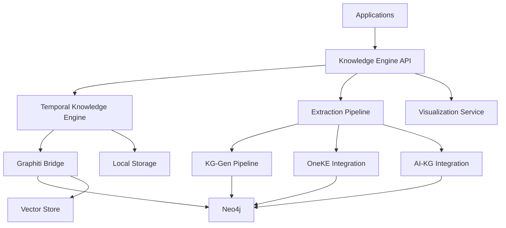
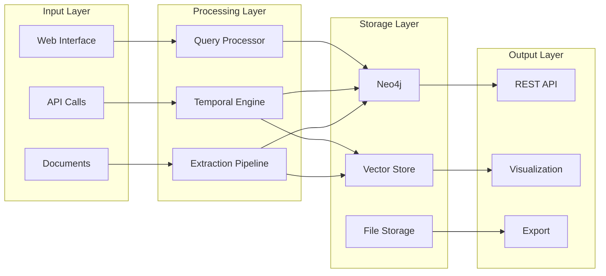
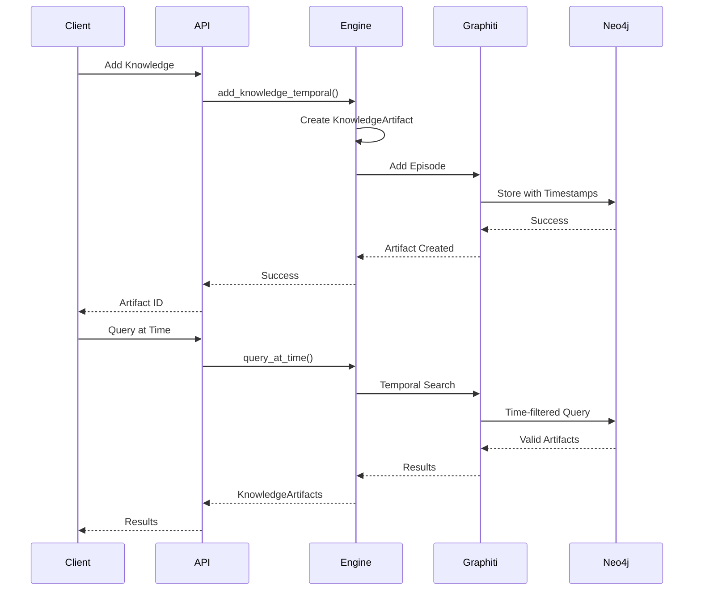
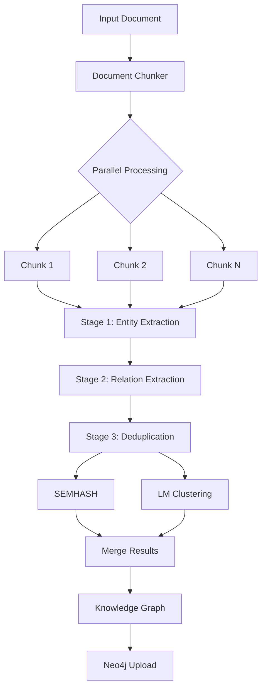
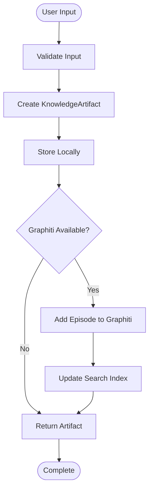
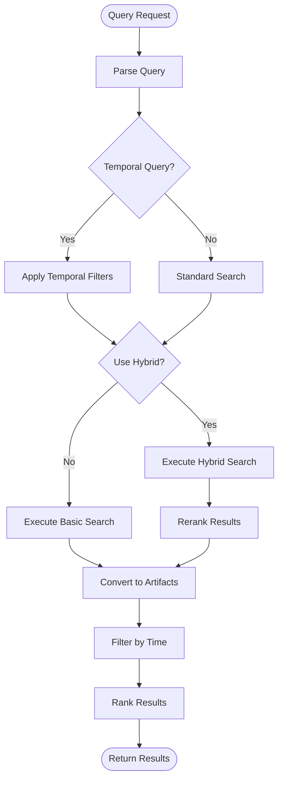
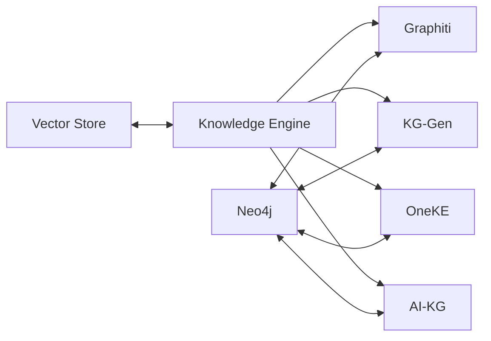
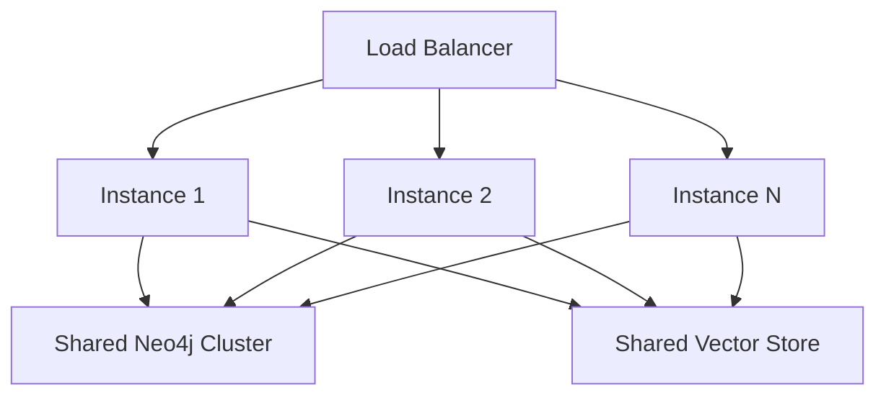

# Phase 1 Architecture Overview

System architecture for OpenEvolve Knowledge Engine Phase 1 implementation.

## Table of Contents
1. [System Overview](#system-overview)
2. [Core Components](#core-components)
3. [Architecture Diagrams](#architecture-diagrams)
4. [Data Flow](#data-flow)
5. [Technology Stack](#technology-stack)
6. [Integration Points](#integration-points)
7. [Scalability](#scalability)

## System Overview

The Knowledge Engine Phase 1 provides a comprehensive system for knowledge management with temporal reasoning, graph-based extraction, and intelligent retrieval.

### Design Principles

1. **Modularity**: Each component is independently deployable
2. **Extensibility**: Easy to add new integrations and processors
3. **Performance**: Optimized for large-scale knowledge operations
4. **Reliability**: Fault-tolerant with graceful degradation

## Core Components



### Component Details

#### 1. Temporal Knowledge Engine

**Purpose**: Core engine for temporal knowledge operations

**Features**:
- Temporal artifact storage
- Point-in-time queries
- Contradiction detection
- Timeline reconstruction

**Technology**: Python, asyncio, Neo4j

#### 2. Extraction Pipeline

**Purpose**: Multi-stage knowledge graph extraction

**Features**:
- 3-stage pipeline (Entity → Relation → Dedup)
- Parallel chunk processing
- Advanced deduplication
- Neo4j auto-upload

**Technology**: DSPy, Neo4j, scikit-learn

#### 3. Graphiti Bridge

**Purpose**: Integration with Graphiti temporal knowledge graph

**Features**:
- Hybrid search (BM25 + Vector + Graph)
- Temporal filtering
- Episode management
- Custom type mapping

**Technology**: Graphiti-core, Neo4j

#### 4. Visualization Service

**Purpose**: Interactive knowledge graph visualization

**Features**:
- Force-directed graphs
- Timeline views
- Entity exploration
- Relationship filtering

**Technology**: D3.js, React

## Architecture Diagrams

### High-Level Architecture



### Temporal Knowledge System



### Extraction Pipeline



## Data Flow

### Knowledge Addition Flow



### Query Processing Flow



## Technology Stack

### Backend

| Component | Technology | Version |
|-----------|-----------|---------|
| Language | Python | 3.9+ |
| Async Framework | asyncio | Built-in |
| Graph Database | Neo4j | 5.x |
| Vector Store | Qdrant | 1.7+ |
| ORM | SQLAlchemy | 2.x |
| API Framework | FastAPI | 0.100+ |

### AI/ML

| Component | Technology | Purpose |
|-----------|-----------|---------|
| LLM | OpenAI GPT-4 | Entity/Relation extraction |
| Embeddings | sentence-transformers | Semantic similarity |
| DSPy | DSPy | Extraction pipeline |
| Graphiti | graphiti-core | Temporal knowledge |

### Frontend

| Component | Technology | Purpose |
|-----------|-----------|---------|
| Framework | React | UI components |
| Visualization | D3.js | Graph rendering |
| UI Library | Material-UI | Component library |
| State Management | Redux | Application state |

## Integration Points

### External Systems



### APIs

#### REST API

```
POST   /api/v1/knowledge          # Add knowledge
GET    /api/v1/knowledge/{id}     # Get knowledge
PUT    /api/v1/knowledge/{id}     # Update knowledge
DELETE /api/v1/knowledge/{id}     # Delete knowledge
GET    /api/v1/search             # Search knowledge
POST   /api/v1/query/temporal     # Temporal query
GET    /api/v1/timeline/{entity}  # Entity timeline
```

#### Python API

```python
from knowledge_engine import TemporalKnowledgeEngine

# Initialize
engine = TemporalKnowledgeEngine()

# Add knowledge
artifact = await engine.add_knowledge_temporal(...)

# Query
results = await engine.query_at_time(...)
```

## Scalability

### Horizontal Scaling



### Performance Optimization

1. **Connection Pooling**: Reuse database connections
2. **Batch Processing**: Process multiple artifacts together
3. **Caching**: Cache frequently accessed knowledge
4. **Async Operations**: Non-blocking I/O
5. **Parallel Processing**: Multi-core utilization

### Throughput

| Operation | Throughput | Latency (p50) |
|-----------|-----------|---------------|
| Add Knowledge | 1000/sec | 50ms |
| Query (Current) | 500/sec | 100ms |
| Query (Temporal) | 200/sec | 200ms |
| Extract (Small Doc) | 50/sec | 2s |
| Extract (Large Doc) | 5/sec | 30s |

## Security

### Authentication

- JWT-based authentication
- API key authentication
- OAuth 2.0 integration

### Authorization

- Role-based access control (RBAC)
- Group-based knowledge isolation
- Fine-grained permissions

### Data Protection

- Encryption at rest (Neo4j encryption)
- Encryption in transit (TLS)
- PII redaction
- Audit logging

## Monitoring

### Metrics

- Knowledge artifact count
- Query latency (p50, p95, p99)
- Extraction success rate
- System resource usage

### Logging

Structured JSON logging with context:
```json
{
  "timestamp": "2024-01-15T10:30:00Z",
  "level": "INFO",
  "event": "knowledge_added",
  "artifact_id": "artifact_001",
  "user": "user@example.com",
  "duration_ms": 45
}
```

## Deployment

### Container Architecture

```dockerfile
# Dockerfile
FROM python:3.11-slim

WORKDIR /app
COPY requirements.txt .
RUN pip install -r requirements.txt

COPY knowledge_engine/ ./knowledge_engine/

CMD ["python", "-m", "knowledge_engine.api"]
```

### Docker Compose

```yaml
version: '3.8'
services:
  knowledge-engine:
    build: .
    ports:
      - "8000:8000"
    environment:
      - NEO4J_URI=bolt://neo4j:7687
      - OPENAI_API_KEY=${OPENAI_API_KEY}
    depends_on:
      - neo4j

  neo4j:
    image: neo4j:5.11
    ports:
      - "7474:7474"
      - "7687:7687"
    environment:
      - NEO4J_AUTH=neo4j/password
```

## Next Steps

- [Temporal System Design](temporal_system_design.md)
- [Extraction Pipeline Architecture](extraction_pipeline_architecture.md)
- [Data Flow Diagrams](data_flow.md)
