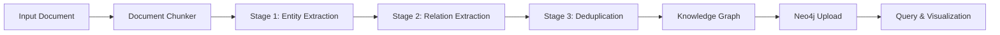
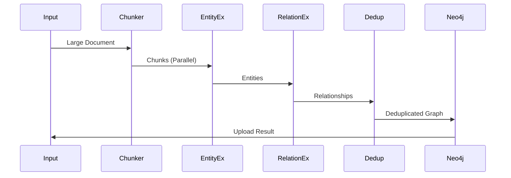
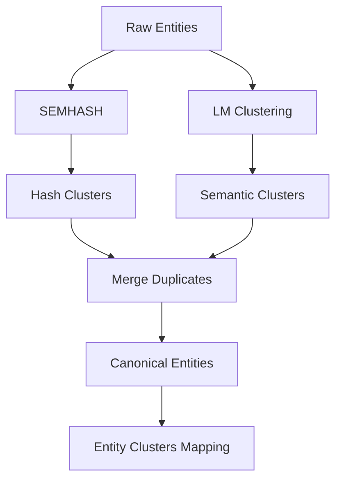

# KG-Gen Pipeline Guide

Complete guide for the 3-stage knowledge graph generation pipeline integrating kg-gen with OpenEvolve.

## Table of Contents
1. [Overview](#overview)
2. [Pipeline Architecture](#pipeline-architecture)
3. [Installation](#installation)
4. [Configuration](#configuration)
5. [Basic Usage](#basic-usage)
6. [Stage Details](#stage-details)
7. [Parallel Processing](#parallel-processing)
8. [Deduplication](#deduplication)
9. [Neo4j Integration](#neo4j-integration)
10. [Performance Optimization](#performance-optimization)
11. [Examples](#examples)

## Overview

The KG-Gen Pipeline implements a sophisticated 3-stage approach to knowledge graph extraction:

1. **Entity Extraction**: Identify and extract entities using DSPy
2. **Relation Extraction**: Extract subject-predicate-object triples
3. **Deduplication**: Merge duplicate entities using SEMHASH and LM clustering

### Key Features

- **Multi-stage processing**: Separate concerns for better accuracy
- **Parallel chunking**: Process large documents efficiently
- **Advanced deduplication**: Semantic hash + LM clustering
- **Neo4j auto-upload**: Direct graph database integration
- **Progress tracking**: Real-time pipeline monitoring

## Pipeline Architecture



### Data Flow



## Installation

### Prerequisites

```bash
# Core dependencies
pip install dspy-ai
pip install neo4j
pip install sentence-transformers
pip install scikit-learn

# Optional: GPU acceleration
pip install torch torchvision --index-url https://download.pytorch.org/whl/cu118
```

### Setup

```bash
cd knowledge_engine/integrations
pip install -r requirements.txt
```

### Configuration

Create `knowledge_engine/config/kggen_pipeline.yaml`:

```yaml
enabled: true
default_chunk_size: 5000
default_overlap: 200
parallel_workers: 4

stages:
  entity_extraction:
    model: openai/gpt-4o
    temperature: 0.0
    max_tokens: 4000
    prompt_template: null

  relation_extraction:
    model: openai/gpt-4o
    temperature: 0.0
    max_tokens: 8000
    extract_temporal: true
    extract_attributes: true

  deduplication:
    method: full  # semhash, lm_cluster, full
    semhash_threshold: 0.95
    lm_cluster_size: 128
    embedding_model: sentence-transformers/all-MiniLM-L6-v2

neo4j_upload:
  enabled: true
  batch_size: 100
  create_indices: true
  verify_upload: true

progress_tracking:
  enabled: true
  log_interval: 10
  save_intermediate: true
```

## Basic Usage

### Simple Extraction

```python
from knowledge_engine.integrations.kggen_pipeline import KGGenPipelineIntegration

# Initialize pipeline
pipeline = KGGenPipelineIntegration()

# Extract from text
text = """
Apple Inc. is a technology company headquartered in Cupertino, California.
It was founded by Steve Jobs, Steve Wozniak, and Ronald Wayne in 1976.
Apple designs and manufactures consumer electronics and software products.
"""

graph = await pipeline.extract_knowledge_graph(
    text=text,
    context="Apple company profile"
)

# Results
print(f"Entities: {len(graph.entities)}")
print(f"Relationships: {len(graph.relationships)}")
print(graph.entities)  # ['Apple Inc.', 'Steve Jobs', 'Cupertino', ...]
print(graph.relationships)  # [('Apple Inc.', 'headquartered_in', 'Cupertino'), ...]
```

### Complete Pipeline

```python
# Extract and upload to Neo4j
graph = await pipeline.extract_and_upload(
    text=text,
    context="Document about Apple",
    upload_to_neo4j=True
)

print(f"Uploaded {len(graph.entities)} entities")
print(f"Uploaded {len(graph.relationships)} relationships")
```

## Stage Details

### Stage 1: Entity Extraction

Extracts named entities from text using DSPy.

```python
async def _extract_entities(text: str, context: str) -> List[str]:
    """
    Extract entities using DSPy with configured model.

    Args:
        text: Input text
        context: Document context

    Returns:
        List of entity names
    """
```

**Configuration**:
```yaml
entity_extraction:
  model: openai/gpt-4o  # or local model
  temperature: 0.0  # Deterministic
  max_tokens: 4000
  entity_types:
    - PERSON
    - ORGANIZATION
    - LOCATION
    - TECHNOLOGY
    - CONCEPT
```

**Example Output**:
```python
[
    "Apple Inc.",
    "Steve Jobs",
    "Steve Wozniak",
    "Ronald Wayne",
    "Cupertino, California",
    "1976"
]
```

### Stage 2: Relation Extraction

Extracts relationships between entities.

```python
async def _extract_relations(
    text: str,
    entities: List[str],
    context: str
) -> List[Tuple[str, str, str]]:
    """
    Extract SPO triples using DSPy.

    Args:
        text: Input text
        entities: List of entities from Stage 1
        context: Document context

    Returns:
        List of (subject, predicate, object) triples
    """
```

**Configuration**:
```yaml
relation_extraction:
  model: openai/gpt-4o
  temperature: 0.0
  max_tokens: 8000
  extract_temporal: true  # Extract time-based relations
  extract_attributes: true  # Extract entity attributes
  relation_types:
    - founded_by
    - headquartered_in
    - manufactures
    - located_in
    - created_in
```

**Example Output**:
```python
[
    ("Apple Inc.", "founded_by", "Steve Jobs"),
    ("Apple Inc.", "founded_by", "Steve Wozniak"),
    ("Apple Inc.", "founded_by", "Ronald Wayne"),
    ("Apple Inc.", "headquartered_in", "Cupertino, California"),
    ("Apple Inc.", "founded_in", "1976")
]
```

### Stage 3: Deduplication

Removes duplicate entities using semantic hashing and clustering.

```python
async def _deduplicate_graph(
    graph: KnowledgeGraph,
    method: str = 'full'
) -> KnowledgeGraph:
    """
    Deduplicate entities and relationships.

    Methods:
    - semhash: Semantic hash-based deduplication
    - lm_cluster: Language model clustering
    - full: Both methods combined
    """
```

#### SEMHASH Deduplication

```python
async def _semhash_deduplication(graph: KnowledgeGraph) -> KnowledgeGraph:
    """
    Use semantic hashes to identify duplicates.

    Process:
    1. Create embedding for each entity
    2. Generate hash from embedding
    3. Cluster similar hashes
    4. Merge duplicates
    """
```

**Configuration**:
```yaml
semhash_threshold: 0.95  # Similarity threshold
embedding_model: sentence-transformers/all-MiniLM-L6-v2
```

**Example**:
```python
# Before: 3 duplicates
entities = ["Apple", "Apple Inc.", "Apple Incorporated"]

# After: 1 canonical entity
entities = ["Apple Inc."]
entity_clusters = {
    "Apple Inc.": ["Apple", "Apple Incorporated"]
}
```

#### LM Clustering Deduplication

```python
async def _lm_cluster_deduplication(graph: KnowledgeGraph) -> KnowledgeGraph:
    """
    Use language model embeddings for clustering.

    Process:
    1. Generate embeddings for all entities
    2. Perform clustering (DBSCAN, HDBSCAN)
    3. Merge entities within clusters
    """
```

**Configuration**:
```yaml
lm_cluster_size: 128
clustering_algorithm: hdbscan  # or dbscan, agglomerative
min_cluster_size: 2
```

## Parallel Processing

### Large Document Processing

```python
# Process large documents with parallel chunking
large_text = """... 100K+ character document ..."""

graph = await pipeline.extract_from_large_document(
    document=large_text,
    chunk_size=5000,      # Characters per chunk
    parallel_chunks=4     # Process 4 chunks at once
)

print(f"Total entities: {len(graph.entities)}")
print(f"Total relationships: {len(graph.relationships)}")
```

### Chunking Strategy

```python
from knowledge_engine.integrations.kggen_chunking import DocumentChunker

# Create chunker
chunker = DocumentChunker(
    chunk_size=5000,    # Target chunk size
    overlap=200,        # Overlap between chunks
    split_on="\n\n"     # Split on paragraphs
)

# Chunk document
chunks = chunker.chunk_document(large_text)

print(f"Created {len(chunks)} chunks")
for i, chunk in enumerate(chunks):
    print(f"Chunk {i}: {len(chunk.text)} chars")
```

### Parallel Processing

```python
from knowledge_engine.integrations.kggen_parallel import ParallelChunkProcessor

# Create processor
processor = ParallelChunkProcessor(max_workers=4)

# Process chunks in parallel
results = await processor.process_chunks_parallel(
    chunks=chunks,
    processing_fn=lambda chunk: pipeline.extract_knowledge_graph(chunk.text)
)

# Results are automatically merged
combined = KnowledgeGraph()
for result in results:
    if result:
        combined.merge(result)
```

## Deduplication

### Understanding Deduplication



### Configuration Options

```yaml
deduplication:
  method: full  # Options: semhash, lm_cluster, full

  # SEMHASH options
  semhash_threshold: 0.95  # Higher = more strict
  hash_algorithm: md5      # or sha256

  # LM Clustering options
  lm_cluster_size: 128
  embedding_model: sentence-transformers/all-MiniLM-L6-v2
  clustering_algorithm: hdbscan
  min_cluster_size: 2
  cluster_selection_epsilon: 0.1
```

### Accessing Clusters

```python
# Extract knowledge graph
graph = await pipeline.extract_knowledge_graph(text)

# Access entity clusters
for canonical, duplicates in graph.entity_clusters.items():
    print(f"Canonical: {canonical}")
    print(f"Duplicates: {duplicates}")
    # Output:
    # Canonical: Apple Inc.
    # Duplicates: ['Apple', 'Apple Incorporated', 'Apple Corp']
```

### Custom Deduplication

```python
# Use specific deduplication method
graph = await pipeline.extract_knowledge_graph(
    text=text,
    dedup_method='semhash'  # Only semantic hashing
)

# Skip deduplication entirely
graph = await pipeline.extract_knowledge_graph(
    text=text,
    dedup_method='none'
)
```

## Neo4j Integration

### Upload to Neo4j

```python
# Upload graph to Neo4j
result = await pipeline.upload_to_neo4j(
    graph=graph,
    batch_size=100
)

if result.success:
    print(f"Uploaded {result.entities_uploaded} entities")
    print(f"Uploaded {result.relationships_uploaded} relationships")
else:
    print(f"Upload failed: {result.error}")
```

### Neo4j Configuration

```yaml
neo4j_upload:
  enabled: true
  batch_size: 100
  create_indices: true
  verify_upload: true

neo4j:
  uri: bolt://localhost:7687
  username: neo4j
  password: ${NEO4J_PASSWORD}
  database: knowledge_graph
```

### Automatic Index Creation

```python
# Indices are automatically created on upload
# Entity indices
CREATE INDEX entity_name_index FOR (e:Entity) ON (e.name)
CREATE INDEX entity_type_index FOR (e:Entity) ON (e.type)

# Relationship indices
CREATE INDEX rel_type_index FOR ()-[r:RELATED]->() ON (r.type)
```

### Verification

```python
# Verify upload
result = await pipeline.upload_to_neo4j(
    graph=graph,
    batch_size=100
)

if result.success and pipeline.pipeline_config['neo4j_upload']['verify_upload']:
    # Run verification queries
    count = await neo4j_backend.execute_query(
        "MATCH (n) RETURN count(n) as count"
    )
    print(f"Verified {count['count']} nodes in Neo4j")
```

## Performance Optimization

### Batch Processing

```python
# Process multiple documents efficiently
texts = [doc1, doc2, doc3, doc4, doc5]

# Batch extraction
graphs = await pipeline.extract_batch(texts)

# Combine results
combined = KnowledgeGraph()
for graph in graphs:
    combined.merge(graph)
```

### Caching

```python
# Use caching for repeated extractions
import hashlib

text_hash = hashlib.md5(text.encode()).hexdigest()

# First call: extracts and caches
graph1 = await pipeline.extract_cached(text_hash)

# Second call: returns cached result
graph2 = await pipeline.extract_cached(text_hash)
```

### Worker Configuration

```yaml
# Adjust based on your hardware
parallel_workers: 4  # Number of parallel chunks

# For CPU-heavy operations:
parallel_workers: multiprocessing.cpu_count()

# For I/O-heavy operations:
parallel_workers: 16  # Can oversubscribe
```

### Memory Optimization

```python
# Process very large documents in streaming mode
async def extract_streaming(text_file, chunk_size=5000):
    """Process file in chunks to minimize memory usage."""

    chunker = DocumentChunker(chunk_size=chunk_size)

    with open(text_file, 'r') as f:
        while True:
            chunk = f.read(chunk_size)
            if not chunk:
                break

            # Process chunk
            graph = await pipeline.extract_knowledge_graph(chunk)

            # Upload immediately
            await pipeline.upload_to_neo4j(graph)

            # Clear from memory
            del graph
```

## Examples

### Example 1: Research Paper Processing

```python
# Extract knowledge from research paper
paper = """
Deep learning is a subset of machine learning that uses neural networks
with multiple layers to model complex patterns in data. Neural networks
are computing systems inspired by biological neural networks...
"""

graph = await pipeline.extract_knowledge_graph(
    text=paper,
    context="AI research paper"
)

print("Entities:")
for entity in graph.entities[:10]:
    print(f"  - {entity}")

print("\nRelationships:")
for subj, pred, obj in graph.relationships[:10]:
    print(f"  - {subj} -> {pred} -> {obj}")
```

### Example 2: Wikipedia Article

```python
# Process Wikipedia article
import requests

# Fetch article
url = "https://en.wikipedia.org/wiki/Artificial_intelligence"
response = requests.get(url)
text = response.text

# Extract knowledge graph
graph = await pipeline.extract_from_large_document(
    document=text,
    chunk_size=3000,
    parallel_chunks=8
)

# Upload to Neo4j
result = await pipeline.upload_to_neo4j(graph)
print(f"Uploaded: {result.entities_uploaded} entities")
```

### Example 3: Custom Entity Types

```python
# Configure for specific domain
pipeline.pipeline_config['stages']['entity_extraction'] = {
    'entity_types': [
        'PROTEIN',
        'GENE',
        'DISEASE',
        'DRUG',
        'PATHWAY'
    ],
    'model': 'biobert-based'  # Biomedical model
}

# Extract biomedical knowledge
bio_text = """
The TP53 gene encodes the tumor protein p53, which plays a crucial role
in preventing cancer. Mutations in TP53 are found in many types of tumors...
"""

graph = await pipeline.extract_knowledge_graph(
    text=bio_text,
    context="Biomedical research"
)
```

### Example 4: Incremental Updates

```python
# Incrementally update knowledge base
async def update_knowledge_base(new_documents):
    """Add new knowledge to existing graph."""

    for doc in new_documents:
        # Extract from new document
        new_graph = await pipeline.extract_knowledge_graph(doc)

        # Upload to Neo4j (Neo4j handles dedup)
        await pipeline.upload_to_neo4j(new_graph)

        print(f"Added {len(new_graph.entities)} new entities")
```

## FAQ

**Q: How do I improve extraction accuracy?**

A: Provide context and use domain-specific models:
```python
graph = await pipeline.extract_knowledge_graph(
    text=text,
    context="Biomedical research paper about cancer",
    model="biobert-based"  # Domain-specific
)
```

**Q: What's the optimal chunk size?**

A: Depends on your text:
- Short documents (< 10K chars): Use entire document
- Medium documents (10K-100K): 3000-5000 char chunks
- Long documents (> 100K): 5000-10000 char chunks

**Q: How do I handle duplicate relationships?**

A: The pipeline automatically deduplicates relationships during the merge phase.

**Q: Can I use local models instead of OpenAI?**

A: Yes! Configure in `kggen_pipeline.yaml`:
```yaml
stages:
  entity_extraction:
    model: local/llama-3-8b
    api_base: http://localhost:8000/v1
```

**Q: How do I monitor progress?**

A: Enable progress tracking:
```python
from knowledge_engine.integrations.kggen_pipeline import ProgressTracker

tracker = ProgressTracker(callback=lambda x: print(f"Progress: {x}%"))
graph = await pipeline.extract_knowledge_graph(text, progress_tracker=tracker)
```

## Next Steps

- Learn about [Temporal Knowledge Integration](temporal_kg_integration_guide.md)
- Explore [Visualization Guide](graph_visualization_guide.md)
- Check [API Reference](api/extraction_pipeline_api.md)
