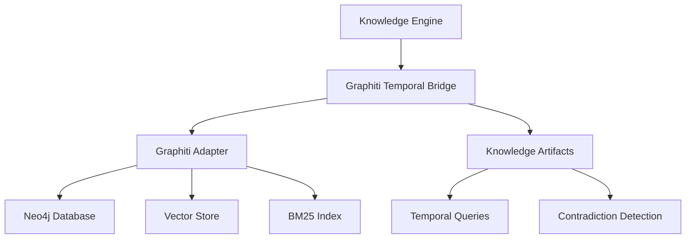

# Graphiti Integration Guide

Complete guide for integrating Graphiti's temporal knowledge graph capabilities with the OpenEvolve Knowledge Engine.

## Table of Contents
1. [Overview](#overview)
2. [Architecture](#architecture)
3. [Installation](#installation)
4. [Configuration](#configuration)
5. [Basic Usage](#basic-usage)
6. [Advanced Features](#advanced-features)
7. [API Reference](#api-reference)
8. [Best Practices](#best-practices)
9. [Troubleshooting](#troubleshooting)
10. [Examples](#examples)

## Overview

### What is Graphiti?

Graphiti is a temporal knowledge graph system that tracks knowledge evolution over time, enabling:
- **Point-in-time queries**: Query knowledge as it was at any moment
- **Temporal reasoning**: Track when facts become valid/invalid
- **Contradiction detection**: Identify conflicting information
- **Hybrid search**: Combine BM25, vector, and graph traversal

### Integration Benefits

The Graphiti integration provides:
- **Temporal awareness**: Track knowledge validity over time
- **Enhanced search**: Hybrid search with multiple strategies
- **Knowledge evolution**: Monitor how knowledge changes
- **Conflict resolution**: Detect and resolve contradictions

## Architecture



### Components

1. **GraphitiTemporalBridge**: High-level bridge for Graphiti operations
2. **GraphitiAdapter**: Direct interface to Graphiti API
3. **KnowledgeArtifact**: Canonical representation with temporal metadata
4. **Temporal Filters**: Query optimization for time-based searches

## Installation

### Prerequisites

```bash
# Required dependencies
pip install graphiti-core
pip install neo4j
pip install openai
pip install sqlalchemy
```

### Setup

1. **Clone and install**:
```bash
cd knowledge_engine/integrations
pip install -r requirements.txt
```

2. **Configure Neo4j**:
```yaml
# integrations/graphiti/config.yaml
neo4j:
  uri: bolt://localhost:7687
  username: neo4j
  password: your_password
  database: graphiti
```

3. **Initialize the bridge**:
```python
from knowledge_engine.integrations.graphiti_temporal_bridge import GraphitiTemporalBridge

bridge = GraphitiTemporalBridge()
await bridge.initialize()
```

## Configuration

### Config File

```yaml
# integrations/graphiti/config.yaml
neo4j:
  uri: bolt://localhost:7687
  username: neo4j
  password: ${NEO4J_PASSWORD}
  database: graphiti

openai:
  api_key: ${OPENAI_API_KEY}
  model: gpt-4o
  embedding_model: text-embedding-3-small

hybrid_search:
  bm25_weight: 0.3
  vector_weight: 0.5
  graph_weight: 0.2
  rerank_method: rrf

temporal:
  default_timezone: UTC
  time_range_buffer: 3600  # seconds
```

### Environment Variables

```bash
export NEO4J_URI="bolt://localhost:7687"
export NEO4J_PASSWORD="your_password"
export OPENAI_API_KEY="your_api_key"
export GRAPHITI_LOG_LEVEL="INFO"
```

## Basic Usage

### Adding Knowledge

```python
from knowledge_engine.core.temporal_knowledge_engine import (
    TemporalKnowledgeEngine,
    KnowledgeArtifact
)
from datetime import datetime

# Initialize engine
engine = TemporalKnowledgeEngine()

# Add temporal knowledge
artifact = await engine.add_knowledge_temporal(
    content="The user authentication API requires JWT tokens",
    artifact_type="solution_pattern",
    valid_at=datetime(2024, 1, 1),
    invalid_at=datetime(2024, 6, 1),  # Deprecated in June
    metadata={
        "source": "api_documentation",
        "confidence": 0.95,
        "team": "backend"
    },
    group_id="auth_system"
)

print(f"Added artifact: {artifact.id}")
```

### Querying at a Point in Time

```python
# Query knowledge as it was in March 2024
results = await engine.query_at_time(
    query="authentication requirements",
    timestamp=datetime(2024, 3, 15),
    max_results=10
)

for artifact in results:
    print(f"[{artifact.valid_at}] {artifact.content[:100]}...")
```

### Temporal Filtering

```python
from knowledge_engine.integrations.base.knowledge_interface import TemporalFilter

# Get current valid knowledge
current_knowledge = await engine.search_with_graphiti(
    query="authentication",
    temporal_filters={"filter_type": TemporalFilter.CURRENT},
    max_results=10
)

# Get knowledge from a time range
range_knowledge = await engine.search_with_graphiti(
    query="authentication",
    temporal_filters={
        "filter_type": TemporalFilter.TIME_RANGE,
        "start_time": datetime(2024, 1, 1),
        "end_time": datetime(2024, 6, 1)
    },
    max_results=10
)

# Get all historical knowledge
all_knowledge = await engine.search_with_graphiti(
    query="authentication",
    temporal_filters={"filter_type": TemporalFilter.ALL},
    max_results=50
)
```

## Advanced Features

### Hybrid Search

```python
# Enable hybrid search with BM25 + Vector + Graph traversal
results = await engine.search_with_graphiti(
    query="user authentication best practices",
    use_hybrid=True,
    rerank_method="rrf",  # Reciprocal Rank Fusion
    max_results=10,
    group_ids=["auth_system", "security"]
)

# Results are automatically ranked and deduplicated
for i, artifact in enumerate(results, 1):
    print(f"{i}. [{artifact.confidence:.2f}] {artifact.content[:80]}...")
```

### Timeline Queries

```python
# Get timeline of events for an entity
timeline = await engine.get_timeline(
    entity="authentication_system",
    start_time=datetime(2024, 1, 1),
    end_time=datetime(2024, 12, 31)
)

for event in timeline:
    print(f"[{event['timestamp']}] {event['event_type']}: {event['description']}")
```

### Contradiction Detection

```python
# Detect contradictions in knowledge
contradictions = await engine.detect_contradictions(
    knowledge_id=None,  # Check all knowledge
    group_ids=["auth_system"]
)

if contradictions.has_contradictions:
    print(f"Found {len(contradictions.contradictions)} contradictions:")
    for contradiction in contradictions.contradictions:
        print(f"  - {contradiction['reason']}")
        print(f"    Severity: {contradiction['severity']}")
```

### Entity Timeline

```python
from knowledge_engine.integrations.graphiti_temporal_bridge import GraphitiTemporalBridge

bridge = await GraphitiTemporalBridge()

# Get entity timeline
timeline = await bridge.get_entity_timeline(
    entity_name="authentication_api",
    start_time=datetime(2024, 1, 1),
    end_time=datetime(2024, 12, 31)
)

for event in timeline:
    print(f"[{event['timestamp']}] {event['event_type']}")
```

## API Reference

### GraphitiTemporalBridge

#### `initialize() -> bool`
Initialize the Graphiti bridge.

**Returns**: `True` if successful

#### `add_artifact(artifact: KnowledgeArtifact) -> Dict[str, Any]`
Add a knowledge artifact to Graphiti.

**Parameters**:
- `artifact`: KnowledgeArtifact to add

**Returns**: Result dictionary with success status

#### `search_with_temporal_filters(...) -> List[KnowledgeArtifact]`
Search with temporal filtering.

**Parameters**:
- `query` (str): Search query
- `filter_type` (TemporalFilter): Type of temporal filter
- `start_time` (datetime, optional): Start time for range queries
- `end_time` (datetime, optional): End time for range queries
- `max_results` (int): Maximum results (default: 10)
- `group_ids` (List[str], optional): Group IDs to scope search
- `use_hybrid` (bool): Use hybrid search (default: True)
- `rerank_method` (RerankMethod): Reranking method (default: RRF)

**Returns**: List of KnowledgeArtifacts

#### `query_at_point_in_time(...) -> List[KnowledgeArtifact]`
Query knowledge at a specific point in time.

**Parameters**:
- `query` (str): Search query
- `timestamp` (datetime): Point in time
- `max_results` (int): Maximum results (default: 10)
- `group_ids` (List[str], optional): Group IDs

**Returns**: List of valid KnowledgeArtifacts

#### `detect_contradictions(...) -> ContradictionDetection`
Detect contradictions in knowledge.

**Parameters**:
- `entity_name` (str): Entity to check
- `time_range` (tuple[datetime, datetime], optional): Time range

**Returns**: ContradictionDetection result

### TemporalKnowledgeEngine

#### `add_knowledge_temporal(...) -> Optional[KnowledgeArtifact]`
Add knowledge with temporal metadata.

**Parameters**:
- `content` (str): Knowledge content
- `artifact_type` (str): Type of artifact
- `valid_at` (datetime): When knowledge becomes valid
- `invalid_at` (datetime, optional): When knowledge becomes invalid
- `metadata` (Dict, optional): Additional metadata
- `source` (str): Source identifier
- `group_id` (str, optional): Group ID

**Returns**: Created KnowledgeArtifact

#### `query_at_time(...) -> List[KnowledgeArtifact]`
Query knowledge at a specific time.

**Parameters**:
- `query` (str): Search query
- `timestamp` (datetime): Point in time
- `max_results` (int): Maximum results
- `group_ids` (List[str], optional): Group IDs

**Returns**: List of valid KnowledgeArtifacts

## Best Practices

### 1. Temporal Modeling

**DO**:
```python
# Use specific timestamps
valid_at = datetime(2024, 1, 15, 10, 30, 0)

# Include timezone information
from datetime import timezone
valid_at = datetime(2024, 1, 15, tzinfo=timezone.utc)
```

**DON'T**:
```python
# Don't use vague time ranges
valid_at = "early 2024"  # ❌

# Don't forget timezone
valid_at = datetime(2024, 1, 15)  # ❌ Assumes local timezone
```

### 2. Group ID Usage

```python
# Use group IDs to partition knowledge
await engine.add_knowledge_temporal(
    content="...",
    artifact_type="solution_pattern",
    valid_at=datetime.now(),
    group_id="project_alpha"  # Specific group
)

# Query specific groups
results = await engine.query_at_time(
    query="...",
    timestamp=datetime.now(),
    group_ids=["project_alpha", "project_beta"]
)
```

### 3. Confidence Scoring

```python
# Always provide confidence when available
await engine.add_knowledge_temporal(
    content="API response time < 100ms",
    artifact_type="performance_metric",
    valid_at=datetime.now(),
    metadata={
        "confidence": 0.98,  # High confidence
        "sample_size": 10000,
        "source": "production_metrics"
    }
)
```

### 4. Metadata Enrichment

```python
# Include rich metadata for better searchability
await engine.add_knowledge_temporal(
    content="...",
    artifact_type="solution_pattern",
    valid_at=datetime.now(),
    metadata={
        "team": "backend",
        "service": "auth_api",
        "environment": "production",
        "tags": ["security", "authentication", "jwt"],
        "related_tickets": ["TICKET-123", "TICKET-456"],
        "author": "john.doe@example.com"
    }
)
```

## Troubleshooting

### Issue: Bridge initialization fails

**Error**: `Failed to initialize Graphiti bridge`

**Solutions**:
1. Check Neo4j is running:
```bash
# Check Neo4j status
systemctl status neo4j

# Test connection
neo4j-client -u neo4j -p password bolt://localhost:7687
```

2. Verify configuration:
```python
import yaml

with open('integrations/graphiti/config.yaml') as f:
    config = yaml.safe_load(f)
    print(config)
```

3. Check network connectivity:
```bash
telnet localhost 7687
```

### Issue: Temporal queries return no results

**Problem**: Queries return empty results even though data exists

**Solutions**:
1. Check timestamp format:
```python
# Ensure UTC timezone
from datetime import timezone
timestamp = datetime(2024, 1, 1, tzinfo=timezone.utc)
```

2. Verify data was added:
```python
# Query without time filter
results = await engine.search_with_graphiti(
    query="your query",
    temporal_filters={"filter_type": TemporalFilter.ALL}
)
```

3. Check group IDs:
```python
# Don't filter by group if not sure
results = await engine.query_at_time(
    query="your query",
    timestamp=datetime.now(),
    group_ids=None  # All groups
)
```

### Issue: Contradiction detection is slow

**Problem**: Contradiction detection takes too long

**Solutions**:
1. Scope the search:
```python
# Check specific groups only
contradictions = await engine.detect_contradictions(
    knowledge_id="specific_artifact_id",  # Single artifact
    group_ids=["specific_group"]  # Specific group
)
```

2. Use time range:
```python
# Check only recent knowledge
from datetime import timedelta, datetime

contradictions = await bridge.detect_contradictions(
    entity_name="auth_api",
    time_range=(
        datetime.now() - timedelta(days=30),
        datetime.now()
    )
)
```

## Examples

### Example 1: API Version Tracking

```python
from datetime import datetime

# Track API changes over time
await engine.add_knowledge_temporal(
    content="GET /api/v1/users - Returns user list",
    artifact_type="api_endpoint",
    valid_at=datetime(2024, 1, 1),
    invalid_at=datetime(2024, 6, 1),
    metadata={"version": "v1", "method": "GET"}
)

await engine.add_knowledge_temporal(
    content="GET /api/v2/accounts - Returns account list with pagination",
    artifact_type="api_endpoint",
    valid_at=datetime(2024, 6, 1),
    metadata={"version": "v2", "method": "GET", "deprecated": "v1"}
)

# Query API as it was in March (v1 was still valid)
march_api = await engine.query_at_time(
    query="GET users endpoint",
    timestamp=datetime(2024, 3, 15)
)
print(f"March: {march_api[0].content}")

# Query API as it is in August (v2 is current)
august_api = await engine.query_at_time(
    query="GET users endpoint",
    timestamp=datetime(2024, 8, 15)
)
print(f"August: {august_api[0].content}")
```

### Example 2: Team Knowledge Evolution

```python
# Track team's understanding over time
await engine.add_knowledge_temporal(
    content="We use JWT for authentication",
    artifact_type="team_knowledge",
    valid_at=datetime(2024, 1, 1),
    metadata={"team": "backend", "confidence": 0.7}
)

await engine.add_knowledge_temporal(
    content="We use JWT with refresh tokens for authentication",
    artifact_type="team_knowledge",
    valid_at=datetime(2024, 3, 1),
    metadata={"team": "backend", "confidence": 0.9}
)

# Get evolution timeline
timeline = await engine.get_timeline(
    entity="authentication",
    start_time=datetime(2024, 1, 1),
    end_time=datetime(2024, 12, 31)
)

for event in timeline:
    print(f"[{event['timestamp']}] {event['description']}")
```

### Example 3: Detecting Conflicting Decisions

```python
# Two teams make different decisions
await engine.add_knowledge_temporal(
    content="Use PostgreSQL for user data",
    artifact_type="architectural_decision",
    valid_at=datetime(2024, 2, 1),
    metadata={"team": "team_a", "component": "user_service"}
)

await engine.add_knowledge_temporal(
    content="Use MongoDB for user data",
    artifact_type="architectural_decision",
    valid_at=datetime(2024, 2, 15),
    metadata={"team": "team_b", "component": "user_service"}
)

# Detect contradiction
contradictions = await engine.detect_contradictions()

if contradictions.has_contradictions:
    for c in contradictions.contradictions:
        print(f"Conflict: {c['reason']}")
        print(f"Between: {c['artifact1_id']} and {c['artifact2_id']}")
```

## FAQ

**Q: What's the difference between `valid_at` and `created_at`?**

A: `valid_at` is when the knowledge becomes true/relevant, while `created_at` is when it was added to the system. For example, a document written in 2020 about a 2019 event would have `valid_at` in 2019 and `created_at` in 2020.

**Q: How do I model knowledge that's always valid?**

A: Simply omit the `invalid_at` parameter. The knowledge will be considered valid from `valid_at` indefinitely.

**Q: Can I query across multiple time periods?**

A: Yes! Use `TemporalFilter.ALL` to get all historical versions, then filter the results as needed.

**Q: What happens if I have overlapping time ranges?**

A: Both knowledge artifacts will be returned in queries. Use contradiction detection to identify conflicts.

**Q: How do I delete knowledge?**

A: Instead of deleting, use `invalidate_knowledge()` to set an `invalid_at` timestamp. This preserves historical accuracy.

## Next Steps

- Learn about [Knowledge Graph Generation](kg_generation_pipeline_guide.md)
- Explore [Visualization Guide](graph_visualization_guide.md)
- Check [API Reference](api/temporal_bridge_api.md) for complete API details
