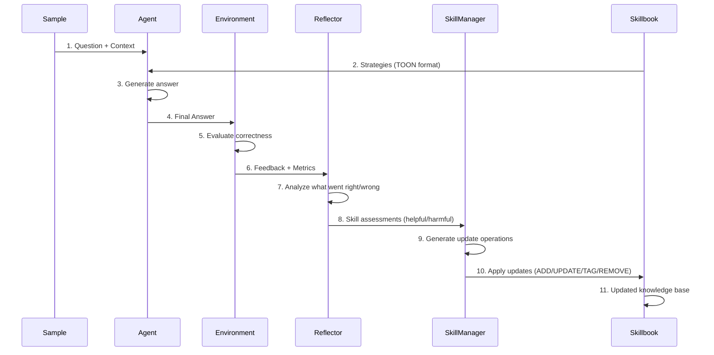

# Agentic Context Engine (ACE) - Comprehensive Documentation

> **Agentic Context Engineering: Evolving Contexts for Self-Improving Language Models**
>
> ACE is a production framework for enabling AI agents to learn from their execution feedback through three collaborative roles: Agent (produces answers), Reflector (analyzes performance), and SkillManager (updates the knowledge base called a "skillbook").

---

## Table of Contents

1. [Executive Summary](#executive-summary)
2. [Architecture Overview](#architecture-overview)
3. [Core Components Reference](#core-components-reference)
4. [New Components Guide](#new-components-guide)
5. [Usage Guides](#usage-guides)
6. [Configuration Reference](#configuration-reference)
7. [Extension Guide](#extension-guide)
8. [API Reference](#api-reference)
9. [Best Practices](#best-practices)
10. [Troubleshooting](#troubleshooting)

---

## Executive Summary

### What is ACE?

**ACE (Agentic Context Engine)** is a framework for implementing self-improving AI agents that learn from their execution feedback. Unlike traditional fine-tuning approaches that require extensive compute and data, ACE works through context engineering - iteratively improving a "skillbook" of strategies that the agent uses to solve tasks.

### Key Features

- ✅ **Zero Fine-Tuning Required**: Works with any LLM without model weight updates
- ✅ **Token-Efficient**: Uses TOON (Token-Oriented Object Notation) for 16-62% token savings
- ✅ **Production-Ready**: Built-in retry logic, error handling, and observability
- ✅ **Multi-Provider Support**: Works with OpenAI, Anthropic, Google, Cohere, Ollama, and 100+ providers via LiteLLM
- ✅ **Async Learning**: Parallel reflection for 3x faster learning
- ✅ **Deduplication**: Automatic skill consolidation to prevent knowledge bloat
- ✅ **Checkpoint Support**: Save and resume training sessions

### Use Cases

| Domain | Application | Example Tasks |
|--------|-------------|---------------|
| **Finance** | NER, Formula Reasoning | FiNER entity recognition, XBRL financial calculations |
| **Web Automation** | Browser Agents | Form filling, domain checking, multi-step tasks |
| **Question Answering** | Knowledge Retrieval | Multi-hop reasoning, factual QA, math problems |
| **Code Generation** | Programming Tasks | API usage, debugging, code translation |
| **Enterprise** | Workflow Automation | Document processing, data extraction, classification |

### Benefits Over Traditional Approaches

1. **Rapid Iteration**: Learn from feedback in minutes, not days
2. **Transparent Learning**: Inspect the skillbook to understand what the agent learned
3. **No Training Infrastructure**: Runs on standard APIs, no GPUs needed
4. **Composability**: Combine with existing agents (LangChain, browser-use, CrewAI)
5. **Cost-Effective**: Pay only for API calls during learning, not for training compute

---

## Architecture Overview

### High-Level System Diagram

```
┌─────────────────────────────────────────────────────────────────────────────┐
│                        AGENTIC CONTEXT ENGINE (ACE)                         │
├─────────────────────────────────────────────────────────────────────────────┤
│                                                                             │
│  ┌──────────────┐      ┌──────────────┐      ┌──────────────┐             │
│  │              │      │              │      │              │             │
│  │    AGENT     │─────▶│  REFLECTOR   │─────▶│ SKILL MANAGER│             │
│  │              │      │              │      │              │             │
│  │  Generator   │      │   Analyzer   │      │   Curator    │             │
│  │              │      │              │      │              │             │
│  └──────┬───────┘      └──────┬───────┘      └──────┬───────┘             │
│         │                     │                     │                      │
│         │ uses                │ analyzes            │ updates              │
│         ▼                     ▼                     ▼                      │
│  ┌──────────────┐      ┌──────────────┐      ┌──────────────┐             │
│  │              │      │              │      │              │             │
│  │  SKILLBOOK   │◀─────│ ENVIRONMENT  │      │   UPDATES    │             │
│  │              │      │              │      │              │             │
│  │ Knowledge    │      │  Feedback    │      │  Operations  │             │
│  │  Base        │      │  Loop        │      │  (ADD/UPDATE)│             │
│  │              │      │              │      │              │             │
│  └──────────────┘      └──────────────┘      └──────────────┘             │
│                                                                             │
│  ┌─────────────────────────────────────────────────────────────────────┐   │
│  │                    OPTIONAL ENHANCEMENTS                             │   │
│  ├─────────────────────────────────────────────────────────────────────┤   │
│  │  • Async Learning Pipeline (parallel reflection)                     │   │
│  │  • Deduplication Manager (skill consolidation)                       │   │
│  │  • Opik Observability (token/cost tracking)                          │   │
│  │  • Resilient Client (retry logic, error classification)              │   │
│  └─────────────────────────────────────────────────────────────────────┘   │
│                                                                             │
└─────────────────────────────────────────────────────────────────────────────┘
```

### Core Components and Their Roles

| Component | Role | Key Methods | Input | Output |
|-----------|------|-------------|-------|--------|
| **Agent** | Produces answers using skillbook context | `generate()` | Question + Skillbook | Answer + Reasoning |
| **Reflector** | Analyzes errors and classifies skill contributions | `reflect()` | Sample + Output + Feedback | Skill assessments |
| **SkillManager** | Updates skillbook based on reflections | `update()` | Skill assessments | Update operations |
| **Skillbook** | Stores strategies with helpful/harmful counters | `add_skill()`, `apply_update()` | Skills | TOON format |
| **TaskEnvironment** | Provides execution feedback | `evaluate()` | Answer | Feedback + Metrics |

### Data Flow Through the System



### Design Patterns Used

1. **Three-Agent Pattern**: Separate concerns across three collaborative roles
2. **Token-Efficient Encoding**: TOON format for compact LLM prompts
3. **Environment Feedback Loop**: Task-specific evaluation drives learning
4. **Idempotent Updates**: Skills can be safely reapplied without side effects
5. **Async Pipeline**: Parallel reflection with serialized skillbook updates
6. **Resilient Client**: Exponential backoff with jitter for API reliability

---

## Core Components Reference

### Agent (Generator)

**Purpose**: Produces answers to questions using strategies from the skillbook.

**Key Methods**:
```python
from ace import Agent, Skillbook, LLMClient

agent = Agent(llm=llm_client)
output = agent.generate(
    question="What is the sum of 5 million and 2 million?",
    context="",
    skillbook=skillbook
)

# Output structure:
# output.final_answer: str           # Final answer
# output.reasoning: str              # Step-by-step reasoning
# output.skill_ids: List[str]        # Skills cited [gen-00001, gen-00002]
```

**Configuration Options**:
- `prompt_template`: Custom prompt for answer generation
- `max_tokens`: Maximum response length (default: 2048)
- `temperature`: Sampling temperature (default: 0.0 for deterministic)

**How It Works**:
1. Receives question + skillbook context
2. Cites relevant skills using `[gen-00001]` notation
3. Produces reasoning trace with step-by-step logic
4. Returns final answer in requested format

---

### Reflector

**Purpose**: Analyzes execution results to classify which skills were helpful or harmful.

**Key Methods**:
```python
from ace import Reflector

reflector = Reflector(llm=llm_client)
reflection = reflector.reflect(
    sample=sample,                    # Original question
    agent_output=output,              # Agent's answer
    environment_result=env_result,    # Feedback from environment
    skillbook=skillbook               # Current knowledge base
)

# Output structure:
# reflection.analysis: str            # What went right/wrong
# reflection.skill_assessments: Dict  # Skill classifications
#   {
#     "gen-00001": "helpful",
#     "gen-00002": "harmful",
#     "gen-00003": "neutral"
#   }
```

**Configuration Options**:
- `max_reflection_rounds`: Number of analysis iterations (default: 3)
- `prompt_template`: Custom reflection prompt

**How It Works**:
1. Reviews the question, agent's answer, and environment feedback
2. Identifies which skills were cited in the reasoning
3. Classifies each skill as helpful/harmful/neutral
4. Provides narrative analysis of what went wrong

---

### SkillManager (Curator)

**Purpose**: Generates update operations to modify the skillbook based on reflections.

**Key Methods**:
```python
from ace import SkillManager

skill_manager = SkillManager(llm=llm_client)
update_batch = skill_manager.update(
    sample=sample,
    agent_output=output,
    reflector_output=reflection,
    skillbook=skillbook
)

# Output structure:
# update_batch.operations: List[UpdateOperation]
#   [
#     UpdateOperation(type="ADD", section="Math", content="..."),
#     UpdateOperation(type="UPDATE", skill_id="gen-00001", metadata={"helpful": 1}),
#     UpdateOperation(type="TAG", skill_id="gen-00002", metadata={"harmful": 1})
#   ]
```

**Configuration Options**:
- `curator_frequency`: How often to run (every N samples)
- `prompt_template`: Custom skill update prompt

**How It Works**:
1. Analyzes reflection to identify knowledge gaps
2. Proposes new skills to add (ADD operations)
3. Suggests improvements to existing skills (UPDATE operations)
4. Updates helpful/harmful counters (TAG operations)

---

### Skillbook

**Purpose**: Stores strategies in a structured format with TOON encoding for token efficiency.

**Data Structures**:

#### Skill Entry
```python
from ace import Skill

skill = Skill(
    id="gen-00001",              # Unique ID
    section="Math",              # Category
    content="For financial numbers like '5 million', convert to plain floating point: 5000000.0",
    helpful=5,                   # Helpful counter
    harmful=1,                   # Harmful counter
    neutral=2,                   # Neutral counter
    created_at="2025-01-15T10:30:00Z",
    updated_at="2025-01-15T12:45:00Z"
)
```

#### TOON Format (Token-Oriented Object Notation)
- **Purpose**: 16-62% token savings vs. JSON/Markdown
- **Format**: Tab-delimited, no field names, no internal metadata
- **Example**:
  ```
  {"skills":[["gen-00001","Math","For financial numbers...",5,1,0],["gen-00002","..."]]}
  ```

**Key Methods**:
```python
from ace import Skillbook

skillbook = Skillbook()

# Add skills
skillbook.add_skill(
    section="Math",
    content="Convert '5 million' to 5000000.0 for calculations"
)

# Update skill metadata
skillbook.tag_skill("gen-00001", "helpful", increment=1)

# Remove skills
skillbook.remove_skill("gen-00001", soft=True)  # Soft delete for audit trail

# Serialize/Deserialize
skillbook.save_to_file("skillbook.json")
loaded = Skillbook.load_from_file("skillbook.json")

# TOON format for LLM prompts
prompt_context = skillbook.as_prompt()  # Returns TOON-encoded string

# Markdown format for debugging
debug_view = str(skillbook)  # Human-readable markdown

# Statistics
stats = skillbook.stats()
# {'sections': 5, 'skills': 42, 'tags': {'helpful': 120, 'harmful': 15, 'neutral': 30}}
```

---

### OfflineACE

**Purpose**: Training mode with multiple epochs over a dataset.

**Key Methods**:
```python
from ace import OfflineACE

adapter = OfflineACE(
    skillbook=skillbook,
    agent=agent,
    reflector=reflector,
    skill_manager=skill_manager,
    async_learning=True,              # Enable parallel reflection
    max_reflector_workers=3,           # Parallel Reflector threads
    deduplication_manager=dedup_manager # Optional deduplication
)

results = adapter.run(
    samples=train_samples,
    environment=environment,
    epochs=3,
    checkpoint_interval=100,           # Save every 100 samples
    checkpoint_dir="./checkpoints"
)
```

**Features**:
- **Multi-epoch training**: Learn from the same data multiple times
- **Checkpoint saving**: Save skillbook at intervals for resumability
- **Async learning**: Parallel reflection for 3x faster training
- **Validation**: Evaluate on separate validation set during training

**Checkpoint Output**:
```
checkpoints/
├── ace_checkpoint_100.json    # Checkpoint at step 100
├── ace_checkpoint_200.json    # Checkpoint at step 200
└── ace_latest.json            # Always the most recent
```

---

### OnlineACE

**Purpose**: Adaptation mode for sequential processing of test data.

**Key Methods**:
```python
from ace import OnlineACE

adapter = OnlineACE(
    skillbook=skillbook,
    agent=agent,
    reflector=reflector,
    skill_manager=skill_manager
)

results = adapter.run(
    samples=test_samples,
    environment=environment
)
```

**Use Cases**:
- **Production adaptation**: Learn from real user interactions
- **Sequential tasks**: Process data streams with continuous learning
- **A/B testing**: Compare skillbook versions in production

---

### LLM Providers

#### LiteLLM Client (Recommended)

**Supports 100+ providers**: OpenAI, Anthropic, Google, Cohere, Ollama, LM Studio, and more.

```python
from ace.llm_providers import LiteLLMClient

# OpenAI
llm = LiteLLMClient(model="gpt-4o-mini")

# Anthropic
llm = LiteLLMClient(model="claude-3-5-sonnet-20241022")

# Local models (Ollama)
llm = LiteLLMClient(model="ollama/gemma3:1b")

# LM Studio
llm = LiteLLMClient(model="lm_studio/gemma-3-1b-it")

# Custom configuration
llm = LiteLLMClient(
    model="gpt-4o",
    max_tokens=2048,
    temperature=0.0,
    timeout=120,
    api_key="your-api-key"
)
```

#### Instructor Client (Structured Output)

**Provides robust JSON parsing with Pydantic validation**.

```python
from ace.llm_providers.litellm_client import LiteLLMClient
from ace.llm_providers.instructor_client import wrap_with_instructor

# Enable automatic Pydantic validation
llm = wrap_with_instructor(LiteLLMClient(model="ollama/gemma3:1b"))
agent = Agent(llm=llm)  # Auto-validates AgentOutput

# Benefits:
# - Field validation
# - Type coercion
# - Intelligent retry
# - ~15% fewer parsing errors

# Recommended for:
# - Small models (Ollama, Gemma, Phi) with JSON formatting issues
```

#### Resilient Client (Retry Logic)

**Adds intelligent retry logic with exponential backoff**.

```python
from ace.llm_providers import ResilientLLMClient, LiteLLMClient

base_client = LiteLLMClient(model="gpt-4")
resilient_client = ResilientLLMClient(
    base_client=base_client,
    max_retries=3,
    base_sleep=1.0,
    timeout=60.0
)

response, call_info = resilient_client.complete(
    "What is ACE?",
    role="agent",
    call_id="call_123"
)

# Call info includes:
# - total_time: Time taken for all retries
# - prompt_tokens: Input token count
# - response_tokens: Output token count
# - error: Error message if failed
```

**Error Classification**:
- `rate_limit`: 429 errors (longer backoff: 2.0x multiplier)
- `server_error`: 5xx errors (moderate backoff: 1.5x multiplier)
- `timeout`: Connection timeouts (shorter backoff: 1.0x multiplier)
- `auth_error`: 401/403 errors (no retry)

---

## New Components Guide

### Answer Extraction (ace/extraction.py)

**Purpose**: Robust extraction of final answers from LLM responses with multiple fallback strategies.

**Key Functions**:

#### `extract_final_answer(response: str) -> str`

Extracts final answers using 5 fallback strategies:

1. Direct JSON parsing for `{"final_answer": "..."}`
2. Regex for final_answer field (double quotes, then single quotes)
3. `Finish[]` format (common in math reasoning)
4. "The final answer is:" pattern with boxed content
5. Extract from boxed content with "The final answer is:" prefix

```python
from ace.extraction import extract_final_answer

# JSON format
answer = extract_final_answer('{"final_answer": "42"}')
# Returns: "42"

# Finish[] format
answer = extract_final_answer('Finish[42]')
# Returns: "42"

# LaTeX boxed format
answer = extract_final_answer('The final answer is: \\boxed{42}')
# Returns: "42"

# Text pattern
answer = extract_final_answer('The final answer is: 42')
# Returns: "42"

# No answer found
answer = extract_final_answer('Some random text')
# Returns: "No final answer found"
```

#### `extract_boxed_content(text: str) -> Optional[str]`

Extracts content from LaTeX `\boxed{}` notation with balanced brace counting.

```python
from ace.extraction import extract_boxed_content

# Simple box
content = extract_boxed_content(r'The answer is \boxed{42}')
# Returns: "42"

# Nested braces
content = extract_boxed_content(r'Result: \boxed{\frac{1}{2}}')
# Returns: r'\frac{1}{2}'
```

#### `extract_json_from_text(text: str) -> Optional[Dict]`

Extracts JSON with multiple fallback strategies.

```python
from ace.extraction import extract_json_from_text

# Direct JSON
data = extract_json_from_text('{"key": "value"}')
# Returns: {'key': 'value'}

# JSON in code block
data = extract_json_from_text('Here is the result: ```json\n{"key": "value"}\n```')
# Returns: {'key': 'value'}

# Find JSON objects using balanced brace counting
data = extract_json_from_text('nested: {"outer": {"inner": "value"}}')
# Returns: {'outer': {'inner': 'value'}}
```

**Use Cases**:
- Math reasoning benchmarks (GSM8K, MATH)
- Financial QA with structured outputs
- Any task requiring robust answer extraction

---

### Parallel Evaluation (ace/evaluation.py)

**Purpose**: Evaluate agent performance on datasets with parallel execution.

**Key Functions**:

#### `evaluate_dataset()`

```python
from ace.evaluation import evaluate_dataset

results = evaluate_dataset(
    samples=test_samples,
    agent=agent,
    skillbook=skillbook,
    answer_checker=lambda pred, truth: pred.strip().lower() == truth.strip().lower(),
    max_workers=20,
    show_progress=True
)

# Output:
# {
#     'accuracy': 0.85,
#     'correct': 85,
#     'total': 100,
#     'errors': [
#         {'index': 5, 'prediction': '42', 'ground_truth': '43', 'skill_ids_used': ['gen-00001']},
#         ...
#     ],
#     'results': [EvaluationResult, ...]
# }
```

**Features**:
- **Parallel execution**: Uses ThreadPoolExecutor with configurable workers
- **Progress tracking**: Shows accuracy every 50 samples
- **Error tracking**: Captures errors without failing entire evaluation
- **Skill attribution**: Tracks which skills were used for each prediction

**Custom Answer Checker**:
```python
def numeric_checker(pred: str, truth: str) -> bool:
    """Check numeric answers with tolerance."""
    try:
        return abs(float(pred) - float(truth)) < 0.01
    except ValueError:
        return pred.strip().lower() == truth.strip().lower()

results = evaluate_dataset(
    samples=samples,
    agent=agent,
    skillbook=skillbook,
    answer_checker=numeric_checker
)
```

---

### Finance Domain Processor (benchmarks/processors/finance.py)

**Purpose**: Data processing and evaluation for finance-related tasks.

**Supported Tasks**:
1. **FiNER**: Financial Named Entity Recognition (multi-label)
2. **Formula**: Financial numerical reasoning with formula computation

**Key Methods**:

```python
from benchmarks.processors.finance import FinanceDataProcessor

# Initialize for specific task
processor = FinanceDataProcessor(task_name="finer")
# or
processor = FinanceDataProcessor(task_name="formula")

# Process raw data
raw_data = [
    {'context': 'Instruction: Classify sentiment.\nInput: Stock prices rose.\nAnswer: ', 'target': 'POS'},
    ...
]
processed_data = processor.process_task_data(raw_data)

# Output format:
# {
#     'context': 'Stock prices rose.',
#     'question': 'Classify sentiment.',
#     'ground_truth': 'POS',
#     'metadata': {'original_context': '...', 'task': 'finer', 'data_source': 'finance'}
# }

# Check answer correctness
is_correct = processor.answer_is_correct(predicted="POS", ground_truth="POS")
# Returns: True

# For FiNER with multi-label entities
is_correct = processor.answer_is_correct(predicted="PER,ORG", ground_truth="PER,ORG")
# Returns: True

# For Formula with numeric comparison
is_correct = processor.answer_is_correct(predicted="1,000", ground_truth="1000")
# Returns: True (handles commas)
```

**Special Features**:

1. **Instruction/Input Parsing** (FiNER):
   ```python
   input_text, instruction = processor.parse_instruction_input_format(
       'Instruction: Classify sentiment.\nInput: Stock prices rose.\nAnswer: '
   )
   # input_text: "Stock prices rose."
   # instruction: "Classify sentiment."
   ```

2. **Numeric Conversion Hint** (Formula):
   ```python
   _, question = processor.parse_context_question_formula(
       'Calculate. Question: "What is 5 million + 2 million?". Answer:'
   )
   # question: "What is 5 million + 2 million? Your answer should be a plain floating
   #            point number, round to the nearest hundredth if necessary. Do the
   #            necessary conversions, for example 5 million should be 5000000.0."
   ```

3. **Partial Credit Scoring** (FiNER):
   - Handles comma-separated entity labels
   - Evaluates numeric values with flexible comparison
   - Awards full credit only for perfect matches

---

### Training CLI (scripts/train_ace.py)

**Purpose**: Unified command-line interface for training ACE models.

**Usage**:

```bash
# Offline training with validation
python scripts/train_ace.py \
    --task finance \
    --mode offline \
    --data-dir ./data/finance \
    --epochs 3 \
    --model gpt-4o-mini

# Online adaptation
python scripts/train_ace.py \
    --task finance \
    --mode online \
    --data-dir ./data/finance \
    --initial-skillbook ./skillbook.json

# Evaluation only
python scripts/train_ace.py \
    --task finance \
    --mode eval_only \
    --data-dir ./data/finance \
    --initial-skillbook ./skillbook.json

# Full configuration
python scripts/train_ace.py \
    --task finer_ord \
    --mode offline \
    --data-dir ./data/finer_ord \
    --model claude-3-5-sonnet-20241022 \
    --epochs 3 \
    --max-reflection-rounds 3 \
    --curator-frequency 10 \
    --checkpoint-interval 100 \
    --skillbook-budget 80000 \
    --test-workers 4 \
    --output-dir ./ace_output \
    --experiment-name finer_experiment_001
```

**Arguments**:

| Category | Argument | Description | Default |
|----------|----------|-------------|---------|
| **Task** | `--task` | Task name (finance, finer_ord, xbrl_math, appworld) | Required |
| **Mode** | `--mode` | Training mode: offline, online, eval_only | offline |
| **Data** | `--data-dir` | Directory containing train.jsonl, val.jsonl, test.jsonl | Required |
| **Skillbook** | `--initial-skillbook` | Path to initial skillbook file | None |
| **Model** | `--model` | Model name for LiteLLM | gpt-4o-mini |
| **Model** | `--max-tokens` | Maximum tokens for LLM responses | 2048 |
| **Model** | `--temperature` | Sampling temperature | 0.0 |
| **Training** | `--epochs` | Number of training epochs | 1 |
| **Training** | `--max-reflection-rounds` | Max reflection rounds for incorrect answers | 3 |
| **Training** | `--curator-frequency` | Run skill manager every N steps | 10 |
| **Training** | `--eval-frequency` | Evaluate on validation set every N steps | 50 |
| **Training** | `--checkpoint-interval` | Save checkpoint every N successful samples | 100 |
| **System** | `--skillbook-budget` | Token budget for skillbook | 80000 |
| **System** | `--test-workers` | Number of parallel workers for testing | 4 |
| **Output** | `--output-dir` | Directory to save results | ./ace_output |
| **Output** | `--experiment-name` | Experiment name for organizing results | Timestamped |

**Output Structure**:
```
ace_output/
└── 20250115_143000/
    ├── finance_skillbook.json       # Trained skillbook
    ├── results_summary.json         # Training metrics
    ├── ace_checkpoint_100.json      # Checkpoint files
    ├── ace_checkpoint_200.json
    └── ace_latest.json
```

---

## Usage Guides

### Quick Start Example

**Minimal code to get started with ACE**:

```python
from ace import Agent, Reflector, SkillManager, OfflineACE, Skillbook, Sample, SimpleEnvironment
from ace.llm_providers import LiteLLMClient

# 1. Initialize LLM client
llm = LiteLLMClient(model="gpt-4o-mini")

# 2. Create skillbook
skillbook = Skillbook()

# 3. Create ACE components
agent = Agent(llm=llm)
reflector = Reflector(llm=llm)
skill_manager = SkillManager(llm=llm)

# 4. Create environment
environment = SimpleEnvironment()

# 5. Prepare training data
samples = [
    Sample(question="What is 2+2?", context="", ground_truth="4"),
    Sample(question="What is 5+3?", context="", ground_truth="8"),
    Sample(question="What is 10-3?", context="", ground_truth="7"),
]

# 6. Train
adapter = OfflineACE(
    skillbook=skillbook,
    agent=agent,
    reflector=reflector,
    skill_manager=skill_manager
)

results = adapter.run(samples=samples, environment=environment, epochs=2)

# 7. Save skillbook
skillbook.save_to_file("my_skillbook.json")

# 8. Use trained agent
test_sample = Sample(question="What is 6+4?", context="", ground_truth="10")
output = agent.generate(question=test_sample.question, context=test_sample.context, skillbook=skillbook)
print(f"Answer: {output.final_answer}")
```

---

### Training on Custom Datasets

**Option 1: Using the Training CLI**

```bash
# Prepare data in JSONL format
echo '{"question": "What is 2+2?", "context": "", "ground_truth": "4"}' > train.jsonl
echo '{"question": "What is 5+3?", "context": "", "ground_truth": "8"}' >> train.jsonl

# Create validation data
echo '{"question": "What is 10-3?", "context": "", "ground_truth": "7"}' > val.jsonl

# Train
python scripts/train_ace.py \
    --task my_task \
    --mode offline \
    --data-dir ./data \
    --epochs 3
```

**Option 2: Python API**

```python
import json
from ace import Sample, OfflineACE

# Load data from JSONL
samples = []
with open("train.jsonl", "r") as f:
    for line in f:
        data = json.loads(line)
        samples.append(Sample(
            question=data["question"],
            context=data.get("context", ""),
            ground_truth=data["ground_truth"]
        ))

# Train
adapter = OfflineACE(...)
results = adapter.run(samples=samples, environment=environment, epochs=3)
```

**Option 3: Domain Processor (for complex tasks)**

```python
from benchmarks.processors.finance import FinanceDataProcessor

# Initialize processor
processor = FinanceDataProcessor(task_name="finer")

# Process raw data
raw_data = load_jsonl("finer_train.jsonl")
processed_data = processor.process_task_data(raw_data)

# Convert to Samples
from ace import Sample
samples = [
    Sample(
        question=item["question"],
        context=item["context"],
        ground_truth=item["ground_truth"],
        metadata=item["metadata"]
    )
    for item in processed_data
]

# Train with custom environment
from benchmarks.environments import FiNEREnvironment
environment = FiNEREnvironment()

adapter = OfflineACE(...)
results = adapter.run(samples=samples, environment=environment, epochs=3)
```

---

### Setting Up Evaluation

**Basic Evaluation**:

```python
from ace import evaluate_dataset

def simple_checker(pred: str, truth: str) -> bool:
    return pred.strip().lower() == truth.strip().lower()

results = evaluate_dataset(
    samples=test_samples,
    agent=agent,
    skillbook=skillbook,
    answer_checker=simple_checker,
    max_workers=10
)

print(f"Accuracy: {results['accuracy']:.2%}")
print(f"Correct: {results['correct']}/{results['total']}")
```

**Advanced Evaluation with Metrics**:

```python
from ace import evaluate_dataset
from typing import Dict, List

def numeric_checker(pred: str, truth: str) -> bool:
    """Numeric comparison with tolerance."""
    try:
        return abs(float(pred) - float(truth)) < 0.01
    except ValueError:
        return False

results = evaluate_dataset(
    samples=test_samples,
    agent=agent,
    skillbook=skillbook,
    answer_checker=numeric_checker,
    max_workers=20,
    show_progress=True
)

# Analyze errors
for error in results['errors']:
    print(f"Sample {error['index']}:")
    print(f"  Predicted: {error['prediction']}")
    print(f"  Ground Truth: {error['ground_truth']}")
    print(f"  Skills Used: {error['skill_ids_used']}")
```

**Domain-Specific Evaluation**:

```python
from benchmarks.processors.finance import FinanceDataProcessor

processor = FinanceDataProcessor(task_name="finer")

# Use built-in answer checker
results = evaluate_dataset(
    samples=test_samples,
    agent=agent,
    skillbook=skillbook,
    answer_checker=processor.answer_is_correct,
    max_workers=10
)
```

---

### Using Domain Processors

**Finance Domain**:

```python
from benchmarks.processors.finance import FinanceDataProcessor, load_finance_data

# Load and process data
raw_data = load_finance_data("data/finer_train.jsonl")
processor = FinanceDataProcessor(task_name="finer")
processed_data = processor.process_task_data(raw_data)

# Convert to Samples
from ace import Sample
samples = [
    Sample(
        question=item["question"],
        context=item["context"],
        ground_truth=item["ground_truth"],
        metadata=item["metadata"]
    )
    for item in processed_data
]

# Evaluate
accuracy, correct, total = processor.evaluate_accuracy(
    predictions=[sample.ground_truth for sample in samples],
    ground_truths=[sample.ground_truth for sample in samples]
)
print(f"Accuracy: {accuracy:.2%} ({correct}/{total})")
```

**Creating Custom Domain Processor**:

```python
from typing import List, Dict, Any

class MyDomainProcessor:
    def __init__(self, task_name: str):
        self.task_name = task_name

    def process_task_data(self, raw_data: List[Dict]) -> List[Dict]:
        """Process raw data into standard format."""
        processed = []
        for item in raw_data:
            processed.append({
                "context": item.get("context", ""),
                "question": item.get("question", ""),
                "ground_truth": item.get("answer", ""),
                "metadata": {"task": self.task_name}
            })
        return processed

    def answer_is_correct(self, predicted: str, ground_truth: str) -> bool:
        """Domain-specific answer validation."""
        # Implement your logic here
        return predicted.strip().lower() == ground_truth.strip().lower()

# Usage
processor = MyDomainProcessor(task_name="my_task")
processed_data = processor.process_task_data(raw_data)
```

---

### CLI Usage Examples

**Basic Training**:

```bash
python scripts/train_ace.py \
    --task finance \
    --mode offline \
    --data-dir ./data/finance \
    --epochs 3
```

**Advanced Configuration**:

```bash
python scripts/train_ace.py \
    --task finer_ord \
    --mode offline \
    --data-dir ./data/finer_ord \
    --model claude-3-5-sonnet-20241022 \
    --max-tokens 4096 \
    --temperature 0.0 \
    --epochs 5 \
    --max-reflection-rounds 5 \
    --curator-frequency 5 \
    --checkpoint-interval 50 \
    --skillbook-budget 100000 \
    --test-workers 8 \
    --output-dir ./experiments \
    --experiment-name finer_ord_exp001
```

**Online Adaptation**:

```bash
python scripts/train_ace.py \
    --task finance \
    --mode online \
    --data-dir ./data/finance \
    --initial-skillbook ./finer_skillbook.json
```

**Evaluation Only**:

```bash
python scripts/train_ace.py \
    --task finance \
    --mode eval_only \
    --data-dir ./data/finance \
    --initial-skillbook ./finer_skillbook.json \
    --test-workers 10
```

**Local Models**:

```bash
# Ollama
python scripts/train_ace.py \
    --task finance \
    --mode offline \
    --data-dir ./data/finance \
    --model ollama/gemma3:1b

# LM Studio
python scripts/train_ace.py \
    --task finance \
    --mode offline \
    --data-dir ./data/finance \
    --model lm_studio/gemma-3-1b-it
```

---

## Configuration Reference

### LLM Provider Setup

#### LiteLLM Configuration

```python
from ace.llm_providers import LiteLLMClient

# OpenAI
llm = LiteLLMClient(
    model="gpt-4o-mini",
    api_key="sk-...",  # Or set OPENAI_API_KEY env var
    max_tokens=2048,
    temperature=0.0,
    timeout=120
)

# Anthropic
llm = LiteLLMClient(
    model="claude-3-5-sonnet-20241022",
    api_key="sk-ant-...",  # Or set ANTHROPIC_API_KEY env var
    max_tokens=4096,
    temperature=0.0
)

# Google
llm = LiteLLMClient(
    model="gemini/gemini-1.5-pro",
    api_key="...",  # Or set GOOGLE_API_KEY env var
    max_tokens=2048
)

# Local models (Ollama)
llm = LiteLLMClient(
    model="ollama/gemma3:1b",
    api_base="http://localhost:11434"  # Ollama endpoint
)

# LM Studio
llm = LiteLLMClient(
    model="lm_studio/gemma-3-1b-it",
    api_base="http://localhost:1234/v1"  # LM Studio endpoint
)
```

#### Environment Variables

```bash
# OpenAI
export OPENAI_API_KEY="sk-..."

# Anthropic
export ANTHROPIC_API_KEY="sk-ant-..."

# Google
export GOOGLE_API_KEY="..."

# Cohere
export COHERE_API_KEY="..."

# LiteLLM proxy (for caching/routing)
export LITELLM_PROXY="http://localhost:4000"

# OpenAI-compatible endpoints
export OPENAI_API_BASE="https://api.openai.com/v1"
```

---

### Skillbook Configuration

**Token Budget**:

```python
from ace import Skillbook

# Set token budget (enforced during skillbook.as_prompt())
skillbook = Skillbook(token_budget=80000)

# Check current token count
stats = skillbook.stats()
print(f"Tokens: {stats['token_count']}/{stats['token_budget']}")
```

**Initial Skills**:

```python
# Pre-populate skillbook with domain knowledge
skillbook = Skillbook()

skillbook.add_skill(
    section="Math",
    content="For financial numbers like '5 million', convert to plain floating point: 5000000.0"
)

skillbook.add_skill(
    section="NER",
    content="Named entities include: PER (person), ORG (organization), LOC (location)"
)

skillbook.add_skill(
    section="Format",
    content="Return answers in the format: {\"final_answer\": \"your answer here\"}"
)
```

**Serialization**:

```python
# Save to file
skillbook.save_to_file("skillbook.json")

# Load from file
loaded = Skillbook.load_from_file("skillbook.json")

# Export as TOON (for LLM prompts)
toon_format = skillbook.as_prompt()

# Export as markdown (for debugging)
markdown_format = str(skillbook)

# Export as dict (for custom processing)
skillbook_dict = skillbook.to_dict()
```

---

### Training Parameters

**OfflineACE Configuration**:

```python
from ace import OfflineACE

adapter = OfflineACE(
    skillbook=skillbook,
    agent=agent,
    reflector=reflector,
    skill_manager=skill_manager,

    # Async learning
    async_learning=True,
    max_reflector_workers=3,

    # Deduplication
    deduplication_manager=dedup_manager,

    # Curator frequency
    curator_frequency=10
)

results = adapter.run(
    samples=train_samples,
    environment=environment,
    epochs=3,

    # Checkpointing
    checkpoint_interval=100,
    checkpoint_dir="./checkpoints"
)
```

**OnlineACE Configuration**:

```python
from ace import OnlineACE

adapter = OnlineACE(
    skillbook=skillbook,
    agent=agent,
    reflector=reflector,
    skill_manager=skill_manager
)

results = adapter.run(
    samples=test_samples,
    environment=environment
)
```

---

### Environment Variables

```bash
# LLM API Keys
export OPENAI_API_KEY="sk-..."
export ANTHROPIC_API_KEY="sk-ant-..."
export GOOGLE_API_KEY="..."
export COHERE_API_KEY="..."

# LiteLLM Configuration
export LITELLM_PROXY="http://localhost:4000"
export LITELLM_CACHE="redis://localhost:6379/0"

# ACE Configuration
export ACE_SKILLBOOK_BUDGET="80000"
export ACE_CHECKPOINT_DIR="./checkpoints"
export ACE_LOG_LEVEL="INFO"

# Observability (Opik)
export OPIK_PROJECT="ace-experiments"
export OPIK_WORKSPACE="my-workspace"
```

---

## Extension Guide

### Creating Custom Domain Processors

```python
from typing import List, Dict, Any, Tuple
from benchmarks.base import BenchmarkConfig

class MyCustomProcessor:
    """Custom processor for my domain."""

    def __init__(self, task_name: str):
        self.task_name = task_name

    def parse_context(self, context: str) -> Tuple[str, str]:
        """
        Parse context into (input_text, question/instruction).

        Override this for your data format.
        """
        # Example: Extract instruction and input from structured format
        if "Instruction: " in context and "Input: " in context:
            parts = context.split("Input: ")
            instruction = parts[0].replace("Instruction: ", "").strip()
            input_text = parts[1].split("Answer:")[0].strip()
            return input_text, instruction

        # Fallback
        return "", context

    def process_task_data(self, raw_data: List[Dict]) -> List[Dict]:
        """Process raw data into standard format."""
        processed = []
        for item in raw_data:
            context = item.get('context', '')
            target = item.get('target', '')

            # Parse context
            input_text, question = self.parse_context(context)

            processed.append({
                "context": input_text,
                "question": question,
                "ground_truth": target,
                "metadata": {
                    "original_context": context,
                    "task": self.task_name,
                    "data_source": "custom"
                }
            })

        return processed

    def answer_is_correct(self, predicted: str, ground_truth: str) -> bool:
        """
        Check if prediction is correct.

        Implement your domain-specific logic here.
        """
        # Example: Numeric comparison with tolerance
        try:
            return abs(float(predicted) - float(ground_truth)) < 0.01
        except ValueError:
            # Fallback to string comparison
            return predicted.strip().lower() == ground_truth.strip().lower()

# Usage
processor = MyCustomProcessor(task_name="my_task")
processed_data = processor.process_task_data(raw_data)
```

---

### Adding New LLM Providers

```python
from ace.llm import LLMClient, LLMResponse

class MyCustomLLMClient(LLMClient):
    """Custom LLM client implementation."""

    def __init__(
        self,
        model: str,
        api_key: str = None,
        **kwargs
    ):
        super().__init__(model=model)
        self.api_key = api_key or os.getenv("MY_API_KEY")
        self.client = MyAPIClient(api_key=self.api_key)

    def complete(self, prompt: str, **kwargs) -> LLMResponse:
        """
        Generate completion.

        Args:
            prompt: Input prompt
            **kwargs: Additional parameters (max_tokens, temperature, etc.)

        Returns:
            LLMResponse with text and optional raw data
        """
        # Call your API
        response = self.client.generate(
            prompt=prompt,
            max_tokens=kwargs.get("max_tokens", 2048),
            temperature=kwargs.get("temperature", 0.0)
        )

        # Return in standard format
        return LLMResponse(
            text=response["output"],
            raw=response  # Include full response for debugging
        )

# Usage
from ace import Agent

llm = MyCustomLLMClient(model="my-model")
agent = Agent(llm=llm)
```

**Integration with Resilient Client**:

```python
from ace.llm_providers import ResilientLLMClient

base_client = MyCustomLLMClient(model="my-model")
resilient_client = ResilientLLMClient(
    base_client=base_client,
    max_retries=3,
    base_sleep=1.0,
    timeout=60.0
)

agent = Agent(llm=resilient_client)
```

---

### Defining Custom Environments

```python
from ace import TaskEnvironment, Sample, EnvironmentResult, AgentOutput

class MyCustomEnvironment(TaskEnvironment):
    """Custom environment for my task."""

    def evaluate(
        self,
        sample: Sample,
        agent_output: AgentOutput
    ) -> EnvironmentResult:
        """
        Evaluate agent output for a sample.

        Args:
            sample: Input sample with question and context
            agent_output: Agent's answer

        Returns:
            EnvironmentResult with feedback and metrics
        """
        # Extract answer
        predicted = agent_output.final_answer
        ground_truth = sample.ground_truth

        # Implement your evaluation logic
        is_correct = self._check_correctness(predicted, ground_truth)

        # Provide feedback
        if is_correct:
            feedback = "Correct! Well done."
        else:
            feedback = f"Incorrect. The correct answer is: {ground_truth}. Your answer: {predicted}"

        # Calculate metrics
        metrics = {
            "accuracy": 1.0 if is_correct else 0.0,
            "exact_match": is_correct
        }

        return EnvironmentResult(
            feedback=feedback,
            ground_truth=ground_truth,
            metrics=metrics
        )

    def _check_correctness(self, predicted: str, ground_truth: str) -> bool:
        """Implement domain-specific correctness check."""
        # Example: Numeric comparison
        try:
            return abs(float(predicted) - float(ground_truth)) < 0.01
        except ValueError:
            return predicted.strip().lower() == ground_truth.strip().lower()

# Usage
from ace import OfflineACE

environment = MyCustomEnvironment()
adapter = OfflineACE(...)
results = adapter.run(samples=train_samples, environment=environment, epochs=3)
```

---

### Prompt Customization

**Using Custom Prompts**:

```python
from ace.prompts_v2_1 import PromptManager

# Create custom prompt manager
prompt_mgr = PromptManager(default_version="2.1")

# Get prompts
agent_prompt = prompt_mgr.get_agent_prompt()
reflector_prompt = prompt_mgr.get_reflector_prompt()
skill_manager_prompt = prompt_mgr.get_skill_manager_prompt()

# Customize prompts
custom_agent_prompt = agent_prompt.replace(
    "You are a helpful AI assistant.",
    "You are a financial analysis expert with deep knowledge of accounting principles."
)

# Use with agents
from ace import Agent, Reflector, SkillManager

agent = Agent(llm=llm, prompt_template=custom_agent_prompt)
reflector = Reflector(llm=llm, prompt_template=reflector_prompt)
skill_manager = SkillManager(llm=llm, prompt_template=skill_manager_prompt)
```

**Creating Custom Prompt Templates**:

```python
from ace.roles import Agent, Reflector, SkillManager

# Custom Agent prompt
MY_AGENT_PROMPT = """
You are an expert in {domain}.

Current Date: {current_date}

Available Strategies:
{skillbook}

Question: {question}

{context_instruction}

Instructions:
1. Analyze the question carefully
2. Cite relevant strategies using [gen-XXXXX] format
3. Show your reasoning step-by-step
4. Provide a clear, concise final answer

Respond in JSON format:
{{
  "reasoning": "Your step-by-step reasoning",
  "final_answer": "Your final answer",
  "skill_ids": ["gen-00001", "gen-00002"]
}}
"""

# Use custom prompt
agent = Agent(llm=llm, prompt_template=MY_AGENT_PROMPT)
```

---

### Benchmark Integration

**Creating Custom Benchmarks**:

```python
from benchmarks.base import BenchmarkConfig, BenchmarkEnvironment, DataLoader

class MyBenchmarkConfig(BenchmarkConfig):
    """Configuration for my benchmark."""

    def __init__(self):
        super().__init__(
            task="my_task",
            description="My custom benchmark task",
            version="1.0",
            data_loader="huggingface",
            dataset_name="my_dataset",
            dataset_split="test"
        )

class MyBenchmarkEnvironment(BenchmarkEnvironment):
    """Environment for my benchmark."""

    def evaluate(self, sample, agent_output):
        # Implement evaluation logic
        predicted = agent_output.final_answer
        ground_truth = sample.ground_truth

        is_correct = self._check_correctness(predicted, ground_truth)

        return EnvironmentResult(
            feedback="Correct!" if is_correct else f"Incorrect. Expected: {ground_truth}",
            ground_truth=ground_truth,
            metrics={"accuracy": 1.0 if is_correct else 0.0}
        )

    def _check_correctness(self, predicted, ground_truth):
        return predicted.strip().lower() == ground_truth.strip().lower()

# Register benchmark
from benchmarks.manager import BenchmarkTaskManager

manager = BenchmarkTaskManager()
manager._benchmarks["my_task"] = MyBenchmarkEnvironment()

# Use benchmark
benchmark = manager.get_benchmark("my_task")
config = manager.get_config("my_task")
```

---

## API Reference

### Core Classes

#### `ace.Skill`

```python
@dataclass
class Skill:
    """Single skillbook entry."""

    id: str                              # Unique ID
    section: str                         # Category/Section
    content: str                         # Strategy content
    helpful: int = 0                     # Helpful counter
    harmful: int = 0                     # Harmful counter
    neutral: int = 0                     # Neutral counter
    created_at: str                      # ISO timestamp
    updated_at: str                      # ISO timestamp
    embedding: Optional[List[float]]     # Vector embedding (for dedup)
    status: Literal["active", "invalid"] # Status flag

    def tag(self, tag: str, increment: int = 1) -> None:
        """Increment helpful/harmful/neutral counter."""

    def to_llm_dict(self) -> Dict[str, Any]:
        """Return dict with LLM-relevant fields only."""
```

#### `ace.Skillbook`

```python
class Skillbook:
    """Structured context store."""

    def __init__(self) -> None:
        """Initialize empty skillbook."""

    def add_skill(
        self,
        section: str,
        content: str,
        skill_id: Optional[str] = None,
        metadata: Optional[Dict[str, int]] = None
    ) -> Skill:
        """Add a new skill."""

    def update_skill(
        self,
        skill_id: str,
        *,
        content: Optional[str] = None,
        metadata: Optional[Dict[str, int]] = None
    ) -> Optional[Skill]:
        """Update existing skill."""

    def tag_skill(
        self,
        skill_id: str,
        tag: str,
        increment: int = 1
    ) -> Optional[Skill]:
        """Increment skill counter."""

    def remove_skill(
        self,
        skill_id: str,
        soft: bool = False
    ) -> None:
        """Remove skill (soft or hard delete)."""

    def get_skill(self, skill_id: str) -> Optional[Skill]:
        """Get skill by ID."""

    def skills(self, include_invalid: bool = False) -> List[Skill]:
        """Get all skills."""

    def apply_update(self, update: UpdateBatch) -> None:
        """Apply update batch."""

    def as_prompt(self) -> str:
        """Return TOON-encoded skillbook for LLM."""

    def save_to_file(self, path: str) -> None:
        """Save to JSON file."""

    @classmethod
    def load_from_file(cls, path: str) -> "Skillbook":
        """Load from JSON file."""

    def stats(self) -> Dict[str, object]:
        """Get skillbook statistics."""
```

#### `ace.Agent`

```python
class Agent:
    """Produces answers using skillbook."""

    def __init__(
        self,
        llm: LLMClient,
        prompt_template: Optional[str] = None
    ) -> None:
        """Initialize agent."""

    def generate(
        self,
        question: str,
        context: str = "",
        skillbook: Optional[Skillbook] = None,
        **kwargs
    ) -> AgentOutput:
        """Generate answer for question."""
```

#### `ace.Reflector`

```python
class Reflector:
    """Analyzes performance and classifies skills."""

    def __init__(
        self,
        llm: LLMClient,
        prompt_template: Optional[str] = None
    ) -> None:
        """Initialize reflector."""

    def reflect(
        self,
        sample: Sample,
        agent_output: AgentOutput,
        environment_result: EnvironmentResult,
        skillbook: Skillbook,
        max_reflection_rounds: int = 3
    ) -> ReflectorOutput:
        """Analyze execution and classify skills."""
```

#### `ace.SkillManager`

```python
class SkillManager:
    """Generates update operations for skillbook."""

    def __init__(
        self,
        llm: LLMClient,
        prompt_template: Optional[str] = None
    ) -> None:
        """Initialize skill manager."""

    def update(
        self,
        sample: Sample,
        agent_output: AgentOutput,
        reflector_output: ReflectorOutput,
        skillbook: Skillbook
    ) -> UpdateBatch:
        """Generate update operations."""
```

#### `ace.OfflineACE`

```python
class OfflineACE:
    """Training mode with multiple epochs."""

    def __init__(
        self,
        skillbook: Skillbook,
        agent: Agent,
        reflector: Reflector,
        skill_manager: SkillManager,
        async_learning: bool = False,
        max_reflector_workers: int = 3,
        deduplication_manager: Optional[DeduplicationManager] = None,
        curator_frequency: int = 10
    ) -> None:
        """Initialize offline ACE."""

    def run(
        self,
        samples: List[Sample],
        environment: TaskEnvironment,
        epochs: int = 1,
        checkpoint_interval: int = 100,
        checkpoint_dir: str = "./checkpoints"
    ) -> List[ACEStepResult]:
        """Run training loop."""

    def learning_stats(self) -> Dict[str, Any]:
        """Get async learning statistics."""

    def wait_for_learning(self, timeout: float = None) -> None:
        """Wait for background learning to complete."""

    def stop_async_learning(self, wait: bool = True) -> None:
        """Stop async learning pipeline."""
```

#### `ace.OnlineACE`

```python
class OnlineACE:
    """Adaptation mode for sequential processing."""

    def __init__(
        self,
        skillbook: Skillbook,
        agent: Agent,
        reflector: Reflector,
        skill_manager: SkillManager
    ) -> None:
        """Initialize online ACE."""

    def run(
        self,
        samples: List[Sample],
        environment: TaskEnvironment
    ) -> List[ACEStepResult]:
        """Run online adaptation."""
```

### Output Classes

#### `ace.AgentOutput`

```python
@dataclass
class AgentOutput:
    """Output from Agent.generate()."""

    final_answer: str              # Final answer
    reasoning: str                 # Step-by-step reasoning
    skill_ids: List[str]           # Cited skill IDs
```

#### `ace.ReflectorOutput`

```python
@dataclass
class ReflectorOutput:
    """Output from Reflector.reflect()."""

    analysis: str                  # What went right/wrong
    skill_assessments: Dict[str, str]  # Skill classifications
```

#### `ace.SkillManagerOutput`

```python
@dataclass
class SkillManagerOutput:
    """Output from SkillManager.update()."""

    operations: List[UpdateOperation]  # Update operations
    reasoning: str                     # Explanation
```

### Utility Functions

#### `ace.evaluation.evaluate_dataset()`

```python
def evaluate_dataset(
    samples: List[Dict[str, Any]],
    agent: Any,
    skillbook: Any,
    answer_checker: Callable[[str, str], bool],
    max_workers: int = 20,
    show_progress: bool = True,
    **kwargs: Any
) -> Dict[str, Any]:
    """Parallel evaluation of dataset."""
```

#### `ace.evaluation.evaluate_single_sample()`

```python
def evaluate_single_sample(
    index: int,
    sample: Dict[str, Any],
    agent: Any,
    skillbook: Any,
    answer_checker: Callable[[str, str], bool],
    **kwargs: Any
) -> EvaluationResult:
    """Evaluate single sample."""
```

#### `ace.extraction.extract_final_answer()`

```python
def extract_final_answer(response: str) -> str:
    """Extract final answer with 5 fallback strategies."""
```

#### `ace.extraction.extract_boxed_content()`

```python
def extract_boxed_content(text: str) -> Optional[str]:
    """Extract LaTeX boxed content."""
```

#### `ace.extraction.extract_json_from_text()`

```python
def extract_json_from_text(text: str) -> Optional[Dict[str, Any]]:
    """Extract JSON with multiple fallback strategies."""
```

---

## Best Practices

### When to Use Offline vs Online Learning

| Aspect | Offline Learning | Online Learning |
|--------|-----------------|-----------------|
| **Data Availability** | Have training data + test data | Only have test/production data |
| **Goal** | Learn patterns from training set | Adapt to new data continuously |
| **Performance** | Better performance (multiple epochs) | Immediate adaptation |
| **Use Case** | Benchmark evaluation, research | Production systems, A/B testing |
| **Recommendation** | Use for initial training | Use for deployment/adaptation |

**Decision Flow**:
```
Have training data?
├─ Yes → Use OfflineACE (train on training set, evaluate on test set)
└─ No → Use OnlineACE (adapt sequentially on test data)
```

---

### Skillbook Management Tips

1. **Start with Initial Skills**:
   ```python
   skillbook.add_skill(section="Format", content="Return answers as JSON: {\"final_answer\": \"...\"}")
   skillbook.add_skill(section="Domain", content="For this task, always show your reasoning")
   ```

2. **Monitor Skill Counters**:
   ```python
   stats = skillbook.stats()
   print(stats['tags'])
   # {'helpful': 120, 'harmful': 15, 'neutral': 30}

   # Remove harmful skills
   for skill in skillbook.skills():
       if skill.harmful > skill.helpful:
           skillbook.remove_skill(skill.id)
   ```

3. **Use Soft Deletes for Audit Trail**:
   ```python
   skillbook.remove_skill("gen-00001", soft=True)  # Mark as invalid but keep in storage
   ```

4. **Regularly Save Checkpoints**:
   ```python
   adapter.run(samples, environment, epochs=3, checkpoint_interval=100)
   ```

5. **Analyze Skill Citations**:
   ```python
   output = agent.generate(question, context, skillbook)
   print(f"Skills used: {output.skill_ids}")
   # Track which skills are actually being used
   ```

---

### Performance Optimization

1. **Use Async Learning**:
   ```python
   adapter = OfflineACE(
       skillbook=skillbook,
       agent=agent,
       reflector=reflector,
       skill_manager=skill_manager,
       async_learning=True,
       max_reflector_workers=3  # Parallel reflection
   )
   # 3x faster learning
   ```

2. **Enable Deduplication**:
   ```python
   from ace.deduplication import DeduplicationManager, DeduplicationConfig

   dedup_config = DeduplicationConfig(
       similarity_threshold=0.85,
       max_consolidation_rounds=3
   )
   dedup_manager = DeduplicationManager(config=dedup_config)

   adapter = OfflineACE(
       skillbook=skillbook,
       agent=agent,
       reflector=reflector,
       skill_manager=skill_manager,
       deduplication_manager=dedup_manager
   )
   # Prevents skill bloat
   ```

3. **Use TOON Format**:
   ```python
   # For LLM prompts (16-62% token savings)
   prompt_context = skillbook.as_prompt()

   # For debugging (human-readable)
   debug_view = str(skillbook)
   ```

4. **Batch Evaluation**:
   ```python
   from ace.evaluation import evaluate_dataset

   results = evaluate_dataset(
       samples=test_samples,
       agent=agent,
       skillbook=skillbook,
       answer_checker=answer_checker,
       max_workers=20  # Parallel evaluation
   )
   ```

5. **Use Resilient Client**:
   ```python
   from ace.llm_providers import ResilientLLMClient

   resilient_llm = ResilientLLMClient(
       base_client=base_client,
       max_retries=3,
       base_sleep=1.0
   )
   # Handles transient failures automatically
   ```

---

### Error Handling Strategies

1. **Validation Environments**:
   ```python
   class ValidatingEnvironment(TaskEnvironment):
       def evaluate(self, sample, agent_output):
           try:
               # Validate answer format
               if not self._is_valid_format(agent_output.final_answer):
                   return EnvironmentResult(
                       feedback="Invalid answer format. Expected JSON.",
                       ground_truth=sample.ground_truth,
                       metrics={"valid": 0}
                   )

               # Check correctness
               is_correct = self._check_correctness(agent_output.final_answer, sample.ground_truth)
               return EnvironmentResult(
                   feedback="Correct!" if is_correct else f"Incorrect. Expected: {sample.ground_truth}",
                   ground_truth=sample.ground_truth,
               metrics={"accuracy": 1.0 if is_correct else 0.0}
           )
           except Exception as e:
               return EnvironmentResult(
                   feedback=f"Error during evaluation: {e}",
                   ground_truth=sample.ground_truth,
                   metrics={"error": 1}
               )
   ```

2. **Graceful Degradation**:
   ```python
   from ace.evaluation import evaluate_dataset

   results = evaluate_dataset(
       samples=test_samples,
       agent=agent,
       skillbook=skillbook,
       answer_checker=answer_checker
   )

   # Check errors
   for error in results['errors']:
       print(f"Sample {error['index']}: {error['error']}")
   ```

3. **Checkpoint Recovery**:
   ```python
   # Load from checkpoint if training was interrupted
   try:
       skillbook = Skillbook.load_from_file("checkpoints/ace_latest.json")
   except FileNotFoundError:
       skillbook = Skillbook()

   # Resume training
   adapter = OfflineACE(skillbook=skillbook, ...)
   ```

4. **Timeout Handling**:
   ```python
   from ace.llm_providers import ResilientLLMClient

   resilient_llm = ResilientLLMClient(
       base_client=base_client,
       timeout=60.0  # Timeout after 60 seconds
   )
   ```

---

## Troubleshooting

### Common Issues and Solutions

#### Issue 1: "LLM response is not valid JSON"

**Symptoms**:
```
ValueError: LLM response is not valid JSON: Expecting ',' delimiter: line 1 column 123 (char 122)
```

**Causes**:
- Small models (Ollama, Gemma, Phi) produce malformed JSON
- Response truncated due to max_tokens limit
- Model doesn't understand JSON format requirements

**Solutions**:

1. **Use Instructor Client**:
   ```python
   from ace.llm_providers.instructor_client import wrap_with_instructor

   llm = wrap_with_instructor(LiteLLMClient(model="ollama/gemma3:1b"))
   # Automatic Pydantic validation and retry
   ```

2. **Increase max_tokens**:
   ```python
   llm = LiteLLMClient(model="gpt-4o-mini", max_tokens=4096)
   ```

3. **Use Resilient Client with Retry**:
   ```python
   from ace.llm_providers import ResilientLLMClient

   llm = ResilientLLMClient(
       base_client=base_client,
       max_retries=3
   )
   ```

4. **Check Prompt Format**:
   ```python
   # Ensure prompt explicitly requests JSON format
   custom_prompt = agent_prompt + "\n\nIMPORTANT: Respond ONLY in valid JSON format."
   agent = Agent(llm=llm, prompt_template=custom_prompt)
   ```

---

#### Issue 2: "Skillbook exceeds token budget"

**Symptoms**:
```
Warning: Skillbook token count (85000) exceeds budget (80000)
```

**Causes**:
- Too many skills accumulated during training
- Long skill content descriptions
- Insufficient skillbook budget for task

**Solutions**:

1. **Increase Token Budget**:
   ```python
   skillbook = Skillbook(token_budget=120000)
   ```

2. **Enable Deduplication**:
   ```python
   from ace.deduplication import DeduplicationManager

   dedup_manager = DeduplicationManager()
   adapter = OfflineACE(
       skillbook=skillbook,
       agent=agent,
       reflector=reflector,
       skill_manager=skill_manager,
       deduplication_manager=dedup_manager
   )
   ```

3. **Prune Low-Value Skills**:
   ```python
   for skill in skillbook.skills():
       if skill.harmful > skill.helpful:
           skillbook.remove_skill(skill.id)
   ```

4. **Consolidate Similar Skills** (manual):
   ```python
   # Review skills and merge similar ones
   skills_by_section = {}
   for skill in skillbook.skills():
       skills_by_section.setdefault(skill.section, []).append(skill)

   for section, skills in skills_by_section.items():
       print(f"\n{section}: {len(skills)} skills")
       for skill in skills:
           print(f"  [{skill.id}] {skill.content} (helpful={skill.helpful}, harmful={skill.harmful})")
   ```

---

#### Issue 3: "Low accuracy on validation set"

**Symptoms**:
```
Final Accuracy: 0.350 (35/100)
```

**Causes**:
- Insufficient training epochs
- Inadequate initial skills
- Poor environment feedback
- Model too small for task complexity

**Solutions**:

1. **Increase Training Epochs**:
   ```python
   results = adapter.run(samples=train_samples, environment=environment, epochs=5)
   ```

2. **Add Initial Domain Knowledge**:
   ```python
   skillbook.add_skill(
       section="Math",
       content="For financial calculations, convert '5 million' to 5000000.0"
   )
   ```

3. **Improve Environment Feedback**:
   ```python
   class DetailedEnvironment(TaskEnvironment):
       def evaluate(self, sample, agent_output):
           # Provide detailed feedback
           if not is_correct:
               feedback = f"""
               Incorrect. Your answer: {agent_output.final_answer}
               Correct answer: {sample.ground_truth}
               Hint: Consider converting financial numbers to plain format.
               """
           else:
               feedback = "Correct! Good job."

           return EnvironmentResult(feedback=feedback, ground_truth=sample.ground_truth)
   ```

4. **Use Larger Model**:
   ```python
   llm = LiteLLMClient(model="gpt-4o")  # Instead of gpt-4o-mini
   ```

5. **Adjust Curator Frequency**:
   ```python
   adapter = OfflineACE(
       skillbook=skillbook,
       agent=agent,
       reflector=reflector,
       skill_manager=skill_manager,
       curator_frequency=5  # Update skillbook more frequently
   )
   ```

---

#### Issue 4: "Slow training performance"

**Symptoms**:
```
Progress: 5/100, Accuracy: 0.400 (estimated time: 2 hours)
```

**Causes**:
- Sequential processing without async learning
- Small max_workers setting
- API rate limits
- Large max_tokens setting

**Solutions**:

1. **Enable Async Learning**:
   ```python
   adapter = OfflineACE(
       skillbook=skillbook,
       agent=agent,
       reflector=reflector,
       skill_manager=skill_manager,
       async_learning=True,
       max_reflector_workers=5  # Parallel reflection
   )
   ```

2. **Increase max_workers for Evaluation**:
   ```python
   results = evaluate_dataset(
       samples=test_samples,
       agent=agent,
       skillbook=skillbook,
       answer_checker=answer_checker,
       max_workers=20  # More parallel workers
   )
   ```

3. **Reduce max_tokens**:
   ```python
   llm = LiteLLMClient(model="gpt-4o-mini", max_tokens=1024)  # Instead of 2048
   ```

4. **Use Local Model** (for development):
   ```python
   llm = LiteLLMClient(model="ollama/gemma3:1b")
   # Faster inference, no API rate limits
   ```

5. **Enable Caching** (LiteLLM proxy):
   ```bash
   # Run LiteLLM proxy with caching
   litellm --model gpt-4o-mini --cache redis://localhost:6379/0

   # Point ACE to proxy
   export LITELLM_PROXY="http://localhost:4000"
   ```

---

#### Issue 5: "Reflector produces inconsistent classifications"

**Symptoms**:
```
Same skill classified as 'helpful' in one run, 'harmful' in another
```

**Causes**:
- Non-deterministic model sampling (temperature > 0)
- Insufficient context in reflection
- Ambiguous feedback from environment

**Solutions**:

1. **Use Temperature = 0**:
   ```python
   llm = LiteLLMClient(model="gpt-4o-mini", temperature=0.0)
   ```

2. **Increase max_reflection_rounds**:
   ```python
   reflection = reflector.reflect(
       sample=sample,
       agent_output=output,
       environment_result=env_result,
       skillbook=skillbook,
       max_reflection_rounds=5  # More thorough analysis
   )
   ```

3. **Improve Environment Feedback**:
   ```python
   class SpecificEnvironment(TaskEnvironment):
       def evaluate(self, sample, agent_output):
           # Provide specific, actionable feedback
           if not is_correct:
               feedback = f"""
               Analysis:
               - Your answer used: {extract_skill_names(agent_output.reasoning)}
               - Step 2 error: {identify_error_step(agent_output.reasoning)}
               - Correction: {provide_hint(sample.ground_truth)}
               """
           return EnvironmentResult(feedback=feedback, ground_truth=sample.ground_truth)
   ```

4. **Use Consistency Checks**:
   ```python
   # Run reflector multiple times and take majority vote
   reflections = [
       reflector.reflect(sample, output, env_result, skillbook)
       for _ in range(3)
   ]

   # Aggregate classifications
   from collections import Counter
   for skill_id in set(sum([r.skill_assessments.keys() for r in reflections], [])):
       votes = [r.skill_assessments.get(skill_id) for r in reflections]
       majority = Counter(votes).most_common(1)[0][0]
       print(f"{skill_id}: {majority} (votes: {votes})")
   ```

---

### Debugging Tips

1. **Enable Verbose Logging**:
   ```python
   import logging
   logging.basicConfig(level=logging.DEBUG)
   ```

2. **Inspect Skillbook Content**:
   ```python
   print(str(skillbook))  # Human-readable markdown
   print(skillbook.as_prompt())  # TOON format for LLM
   print(skillbook.stats())  # Statistics
   ```

3. **Trace Skill Citations**:
   ```python
   output = agent.generate(question, context, skillbook)
   print(f"Reasoning: {output.reasoning}")
   print(f"Skills cited: {output.skill_ids}")

   # Check if cited skills are actually relevant
   for skill_id in output.skill_ids:
       skill = skillbook.get_skill(skill_id)
       print(f"  [{skill.id}] {skill.content}")
   ```

4. **Monitor Token Usage** (with Opik):
   ```python
   from ace.observability import OpikIntegration

   opik = OpikIntegration(project_name="ace-debug")
   # Automatic token/cost tracking for all LLM calls
   ```

5. **Save Intermediate Results**:
   ```python
   results = adapter.run(samples, environment, epochs=1)

   for i, result in enumerate(results):
       print(f"\n=== Sample {i} ===")
       print(f"Question: {result.sample.question}")
       print(f"Answer: {result.agent_output.final_answer}")
       print(f"Correct: {result.environment_result.metrics.get('correct', False)}")
       if result.reflector_output:
           print(f"Reflection: {result.reflector_output.analysis}")
           print(f"Skill Assessments: {result.reflector_output.skill_assessments}")
       if result.skill_manager_output:
           print(f"Updates: {len(result.skill_manager_output.operations)} operations")
   ```

---

## Additional Resources

- **GitHub Repository**: [https://github.com/kayba-ai/agentic-context-engine](https://github.com/kayba-ai/agentic-context-engine)
- **Paper**: "Agentic Context Engineering: Evolving Contexts for Self-Improving Language Models" (arXiv:2510.04618)
- **Documentation**: See `docs/` directory in repository
- **Examples**: See `examples/` directory for integration patterns

---

**Version**: 1.0.0
**Last Updated**: 2025-01-15
**Maintainer**: Kayba AI
