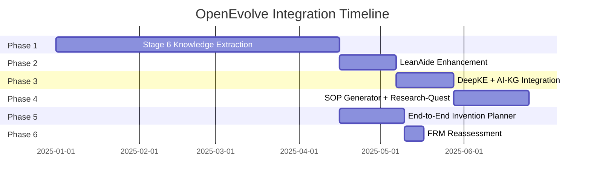

# MASTER INTEGRATION ROADMAP - OpenEvolve

**Version**: 1.0
**Created**: 2025-12-31
**Status**: READY FOR IMPLEMENTATION
**Timeline**: 34-44 weeks total (parallel execution reduces to 24-30 weeks)

---

## Executive Summary

This roadmap synthesizes analysis of **5 external projects** and **1 internal enhancement** into a comprehensive integration plan for OpenEvolve.

### Projects Analyzed

| Project | Recommendation | Priority | Effort | Value Score |
|---------|----------------|----------|--------|-------------|
| **Stage 6 Knowledge Extraction** | ✅ IMPLEMENT FIRST | **P0** | 12-15 weeks | +10 (Critical Gap) |
| **LeanAide Enhancement (Continuous Math)** | ✅ IMPLEMENT SECOND | **P1** | 2-3 weeks | +5 (High Value) |
| **DeepKE + AI-KG** | ✅ INTEGRATE BOTH | **P2** | 3 weeks | +5 (Complementary) |
| **SOP Generator + Research-Quest** | ✅ INTEGRATE | **P2.5** | 3-4 weeks | +3 (New Synergy) |
| **End-to-End Invention Planner** | ⚠️ COMPLETE REWRITE | **P1.5** | 17-24 days | +4 (High Value) |
| **FRM (Formal-Reasoning-Mode)** | ❌ DEFER | **P5** | N/A | -2 (Low Priority) |

### Priority Matrix

```
HIGH VALUE    │ Stage 6       │ LeanAide      │ SOP+Research │
              │ (P0)          │ (P1)          │ (P2.5)       │
              ├───────────────┼───────────────┼──────────────┤
MEDIUM VALUE  │ DeepKE+AI-KG  │ E2E Planner   │              │
              │ (P2)          │ (P1.5)        │              │
              ├───────────────┼───────────────┼──────────────┤
LOW VALUE     │ FRM (Defer)   │               │              │
              │ (P5)          │               │              │
              └───────────────┴───────────────┴──────────────┘
              ↑               ↑               ↑
           CRITICAL       HIGH           MEDIUM
           MUST HAVE      NICE TO HAVE  CONSIDER LATER
```

### Timeline Overview



**Total Sequential Time**: 34-44 weeks
**Parallel Execution Time**: 24-30 weeks (with proper team allocation)

---

## Project Analysis Summary

### 1. FRM (Formal-Reasoning-Mode) - DEFER

**Analysis**: `FRM_INTEGRATION_ANALYSIS_COMPLETE.md`
**Recommendation**: ❌ **DEFER** (Score: -2)
**Rationale**:
- 60-70% overlap with existing systems (ROMA, ACE, Steer, Knowledge Engine)
- Architectural mismatch (Electron+React+TS vs Python+BubbleLab UI)
- 3-5 weeks integration overhead for niche value
- LeanAide already integrated and can be enhanced for 80% of FRM's value

**Unique Value**: Continuous mathematics (ODE/PDE/DAE/SDE), novelty assurance, citation management
**Better Alternative**: Enhance LeanAide with continuous math support (2-3 weeks)

---

### 2. DeepKE + AI-Knowledge-Graph - INTEGRATE BOTH

**Analysis**: `DEEPKE_KNOWLEDGE_ENGINE_INTEGRATION_ANALYSIS.md`, `AI_KG_DEEPKE_COMPARISON_COMPLETE.md`
**Recommendation**: ✅ **INTEGRATE BOTH** (Score: +5)
**Rationale**:
- **Highly Complementary**: DeepKE extracts, AI-KG processes/visualizes
- **Minimal Redundancy**: Different strengths, low overlap
- **Combined Coverage**: 100% of P0/P1 Knowledge Engine requirements
- **MCP Ready**: DeepKE has native MCP integration

**Value Proposition**:
- DeepKE: Production-quality NER/RE/AE/EE extraction
- AI-KG: Entity standardization, relationship inference, PyVis visualization
- Combined: Best-in-class knowledge extraction + visualization

**Effort**: 3 weeks (1 week each for setup, integration, testing)

---

### 3. Research-Quest - USE AS REFERENCE + INTEGRATE WITH SOP GENERATOR

**Analysis**: `SOP_GENERATOR_RESEARCH_QUEST_SYNERGY.md`
**Recommendation**: ✅ **INTEGRATE SOP GENERATOR + RESEARCH-QUEST** (Score: +3)
**Rationale**:
- **New Synergy Discovered**: SOP Generator provides zero-error procedures that Research-Quest needs
- **Perfect Match**: Research-Quest methodology + SOP Generator execution
- **Low Risk**: SOP Generator already exists, just needs integration

**Value Proposition**:
- Research-Quest gains: Turnkey-ready protocols, zero-error guarantee, continuous improvement
- SOP Generator gains: Structured methodology, hypothesis-driven approach, evidence validation
- Combined: Executable research frameworks with reproducible protocols

**Effort**: 3-4 weeks (1 week PoC, 2-3 weeks deep integration)

---

### 4. SOP Generator (Existing) - ENHANCE

**Status**: ✅ **ALREADY INTEGRATED** (in `sop_generator.py`, `sop_component_system.py`, `sop_integrated_system.py`)
**New Opportunity**: Integration with Research-Quest
**Enhancement Effort**: 3-4 weeks for Research-Quest integration

---

### 5. End-to-End Invention Planner - COMPLETE REWRITE

**Analysis**: `END_TO_END_INVENTION_AGENT_TASKS.md`
**Status**: ⚠️ **SKELETON IMPLEMENTATION** (non-functional)
**Recommendation**: ✅ **COMPLETE REWRITE** (Score: +4, Priority P1.5)
**Rationale**:
- Current implementation is placeholder (mocked responses, simulated analysis)
- High value component (bulletproof invention planning)
- Requires complete rewrite with all 15+ OpenEvolve integrations

**Missing Components**:
- Real knowledge retrieval (uses mocked responses)
- Real decomposition with ROMA/MDAP (uses single MAKER call)
- Real math formalization with LeanAide (falls back to "by sorry")
- Real physics validation (hardcoded True)
- Real error analysis (single LLM prompt)
- Real adversarial testing (single LLM prompt)
- Real SOP generation (basic call only)

**Required Rewrite**: 17-24 days focused development

---

## Complete Integration Architecture

### How All Projects Fit Together

```
┌─────────────────────────────────────────────────────────────────────────┐
│                        OPENEVOLVE ECOSYSTEM                             │
└─────────────────────────────────────────────────────────────────────────┘
                                    │
        ┌───────────────────────────┼───────────────────────────┐
        │                           │                           │
        ▼                           ▼                           ▼
┌──────────────────┐    ┌──────────────────┐    ┌──────────────────┐
│  DECOMPOSITION    │    │   KNOWLEDGE      │    │    INVENTION     │
│  WORKFLOW        │    │   ENGINE         │    │    PLANNING      │
│  (ROMA/MAKER)    │    │   (Stage 6)      │    │    (E2E Planner) │
└──────────────────┘    └──────────────────┘    └──────────────────┘
        │                           │                           │
        │                           │                           │
        ▼                           ▼                           ▼
┌───────────────────────────────────────────────────────────────────┐
│                      CORE INTEGRATIONS                              │
├─────────────────────────────────────────────────────────────────────┤
│                                                                       │
│  ┌──────────────┐  ┌──────────────┐  ┌──────────────┐            │
│  │   LeanAide   │  │   DeepKE     │  │  AI-KG       │            │
│  │              │  │   + AI-KG    │  │              │            │
│  │ • Discrete   │  │              │  │              │            │
│  │   Math       │  │ • NER/RE/EE  │  │ • SPO        │            │
│  │ • Proofs     │  │ • Extraction │  │ • Entity Std.│            │
│  │ • Continuous │  │ • MCP Ready  │  │ • Rel. Infer │            │
│  │   Math (NEW) │  │              │  │ • PyVis Viz  │            │
│  └──────────────┘  └──────────────┘  └──────────────┘            │
│                                                                       │
│  ┌──────────────┐  ┌──────────────┐  ┌──────────────┐            │
│  │  SOP Gen +   │  │     ACE      │  │   RAGbits    │            │
│  │ Research-    │  │              │  │              │            │
│  │ Quest        │  │ • Learning   │  │ • Vector     │            │
│  │              │  │ • Reflector  │  │ • Search     │            │
│  │ • Procedures │  │ • Skills     │  │ • Retrieval  │            │
│  │ • Protocols  │  │ • Dedup      │  │              │            │
│  └──────────────┘  └──────────────┘  └──────────────┘            │
│                                                                       │
└─────────────────────────────────────────────────────────────────────┘
                                    │
                                    ▼
┌───────────────────────────────────────────────────────────────────┐
│                         SHARED SERVICES                             │
├─────────────────────────────────────────────────────────────────────┤
│  CrewAI (Delegation)  │  Steer (Safety)  │  Knowledge Engine  │
└─────────────────────────────────────────────────────────────────────┘
```

### Dependencies Between Projects

```
Stage 6 (P0) - MUST COMPLETE FIRST
    ├── Enables: Knowledge extraction for all other phases
    ├── Blocks: Nothing (foundation)
    └── Dependencies: ACE, RAGbits, Knowledge Engine

LeanAide Enhancement (P1) - HIGH VALUE
    ├── Enables: Continuous math verification
    ├── Blocks: Nothing
    ├── Dependencies: None (enhancement only)
    └── Complements: Stage 6 (math artifacts)

DeepKE + AI-KG (P2) - ENHANCES STAGE 6
    ├── Enables: Production extraction + visualization
    ├── Blocks: Nothing (can run parallel)
    ├── Dependencies: Stage 6 (needs KnowledgeArtifact schema)
    └── Enhances: Knowledge Engine extraction quality

SOP Generator + Research-Quest (P2.5) - INDEPENDENT
    ├── Enables: Research workflow automation
    ├── Blocks: Nothing
    ├── Dependencies: None (independent system)
    └── Complements: E2E Invention Planner

End-to-End Invention Planner (P1.5) - DEPENDS ON STAGE 6
    ├── Enables: Bulletproof invention planning
    ├── Blocks: Nothing
    ├── Dependencies: Stage 6 (knowledge), LeanAide (math), SOP systems
    └── Uses: All integrations

FRM Reassessment (P5) - LOWEST PRIORITY
    ├── Enables: Scientific domain modeling
    ├── Blocks: Nothing
    ├── Dependencies: Stage 6, LeanAide enhancement
    └── Status: Deferred until conditions met
```

### Integration Points

| Integration Point | Projects Involved | Purpose |
|-------------------|-------------------|---------|
| **Stage 6 Knowledge Extraction** | DeepKE + AI-KG + ACE + RAGbits | Extract and visualize knowledge |
| **Math Verification** | LeanAide (discrete + continuous) | Formal proof verification |
| **SOP Generation** | SOP Generator + Research-Quest | Research protocol automation |
| **Invention Planning** | E2E Planner + All Systems | Bulletproof invention plans |
| **Knowledge Graph** | AI-KG + DeepKE + RAGbits | Visualization and search |
| **Learning** | ACE + Stage 6 + All Extractors | Continuous improvement |

---

## Phased Implementation Plan

### Phase 1: Stage 6 Knowledge Extraction (P0 - CRITICAL)

**Timeline**: 12-15 weeks
**Dependencies**: None
**Blocks**: Nothing (foundational)

#### Components

1. **KnowledgeArtifact Schema** (2 weeks)
   - Base data model
   - Specialized artifact types (SolutionPattern, TeamPerformance, GauntletEffectiveness)
   - Validation methods
   - Serialization/deserialization

2. **WorkflowKnowledgeExtractor** (3 weeks)
   - Extract from all workflow stages (0, 1, 3, 5, 6)
   - Solution pattern extraction
   - Decomposition strategy extraction
   - Integration with LLM

3. **SolutionPatternMiner with ML** (4 weeks)
   - Pattern vectorization (TF-IDF, structural features)
   - ML clustering (DBSCAN, K-Means, hierarchical)
   - Pattern similarity search
   - Scikit-learn integration

4. **TeamPerformanceTracker** (2 weeks)
   - Track team metrics across workflows
   - Performance by domain/complexity
   - Historical trend analysis
   - Team recommendations

5. **GauntletEffectivenessAnalyzer** (2 weeks)
   - Analyze gauntlet rule effectiveness
   - Catch rate and false positive metrics
   - Rule recommendations by problem type

6. **KnowledgeGraphVisualizer** (2 weeks)
   - NetworkX graph building
   - PyVis/Plotly visualization
   - Community detection (Louvain)
   - BubbleLab UI UI integration

#### Success Criteria

- [ ] All 6 components implemented and tested
- [ ] KnowledgeArtifact schema in production use
- [ ] SolutionPatternMiner clustering patterns with ML
- [ ] TeamPerformanceTracker tracking effectiveness
- [ ] GauntletEffectivenessAnalyzer optimizing rules
- [ ] KnowledgeGraphVisualizer displaying relationships
- [ ] Stage 6 is 100% complete (up from 75%)

#### Deliverables

- `workflow_structures.py` - Enhanced with KnowledgeArtifact schema
- `workflow_knowledge_extractor.py` - NEW (extraction logic)
- `solution_pattern_miner.py` - NEW (ML clustering)
- `team_performance_tracker.py` - NEW (analytics)
- `gauntlet_effectiveness_analyzer.py` - NEW (analytics)
- `knowledge_graph_visualizer.py` - NEW (visualization)
- `tests/test_stage6_*.py` - Comprehensive test suite
- `docs/STAGE6_API.md` - API documentation
- `docs/STAGE6_USER_GUIDE.md` - User guide

---

### Phase 2: LeanAide Enhancement for Continuous Mathematics (P1 - HIGH VALUE)

**Timeline**: 2-3 weeks
**Dependencies**: None (enhancement only)
**Blocks**: Nothing

#### Components

1. **Continuous Math Detection** (3-4 days)
   - Extend MathematicalDomain enum (ODE, PDE, DAE, SDE)
   - LLM-based detection vs discrete math
   - Confidence scoring

2. **ODE/PDE Translation to Lean 4** (1 week)
   - DifferentialEquation data structure
   - ODE translation methods
   - PDE translation methods
   - Initial/boundary condition handling

3. **Scientific Domain Patterns** (3-4 days)
   - Domain-specific solvers (medicine, physics, biology, engineering)
   - Pattern identification
   - Domain knowledge retrieval

4. **Verification for Continuous Math** (4-5 days)
   - Solution verification (equation satisfaction, conditions)
   - Domain-specific property checking (positivity, conservation, stability)
   - Sympy integration for symbolic checking

5. **MCP Tools** (2-3 days)
   - `leanaide_detect_continuous_math` tool
   - `leanaide_translate_ode` tool
   - `leanaide_verify_continuous_solution` tool

#### Success Criteria

- [ ] Continuous math detection implemented and tested
- [ ] ODE/PDE translation to Lean 4 working
- [ ] Scientific domain patterns implemented (4+ domains)
- [ ] Verification for continuous solutions working
- [ ] MCP tools for continuous math added
- [ ] LeanAide now handles 80% of FRM's mathematical value

#### Deliverables

- `leanaide_client.py` - Enhanced with continuous math
- `leanaide_crewai_bridge.py` - Updated bridge
- `leanaide_mcp_tools.py` - New MCP tools
- `tests/test_leanaide_continuous_math.py` - Test suite
- `docs/LEANAIDE_CONTINUOUS_MATH.md` - Documentation
- `examples/leanaide_continuous_math_examples.py` - Examples

---

### Phase 3: DeepKE + AI-KG Integration (P2 - HIGH VALUE)

**Timeline**: 3 weeks
**Dependencies**: Phase 1 (Stage 6 KnowledgeArtifact schema)
**Blocks**: Nothing (can run in parallel with Phase 2)

#### Components

##### Week 1: Quick Wins

1. **ai-knowledge-graph Setup** (1-2 days)
   - Install dependencies (networkx, pyvis, python-louvain)
   - Test SPO extraction
   - Test PyVis visualization

2. **DeepKE MCP Setup** (1-2 days)
   - Configure DeepKE-MCP-Tools server
   - Add to `mcp_agent.secrets.yaml`
   - Test NER/RE/AE/EE tools

3. **Prototype Extraction** (1 day)
   - Extract from sample workflow
   - Combine DeepKE + AI-KG
   - Initial visualization

##### Week 2: Adapters & Bridges

4. **AI-KG Integration** (2 days)
   - Create `ai_knowledge_graph_crewai_bridge.py`
   - Expose MCP tools (SPO extraction, entity standardization, visualization)
   - Map AI-KG triples to KnowledgeArtifact schema

5. **DeepKE Integration** (2 days)
   - MCP configuration complete
   - Map DeepKE NER/RE/EE to KnowledgeArtifact schema
   - Handle schema customization

6. **Combined Pipeline** (1 day)
   - DeepKE → AI-KG flow
   - Enrichment pipeline
   - Quality validation

##### Week 3: Integration & Testing

7. **Workflow Integration** (2 days)
   - Integrate with WorkflowKnowledgeExtractor
   - Hook into Stage 6 extraction pipeline
   - End-to-end testing

8. **Documentation** (1 day)
   - Integration guide
   - API documentation
   - Examples and use cases

#### Success Criteria

- [ ] AI-KG generates knowledge graph from sample workflow
- [ ] DeepKE extracts entities/relations from sample workflow
- [ ] Combined extraction pipeline operational
- [ ] KnowledgeArtifact schema populated by both extractors
- [ ] Visualization shows enriched knowledge graph
- [ ] End-to-end extraction from workflow execution

#### Deliverables

- `ai_knowledge_graph_crewai_bridge.py` - NEW (AI-KG MCP bridge)
- `deepke_adapter.py` - NEW (DeepKE adapter)
- `knowledge_engine/orchestrator.py` - NEW (extraction coordinator)
- `tests/test_deepke_aikg_integration.py` - Test suite
- `docs/DEEPKE_AIKG_INTEGRATION.md` - Integration guide

---

### Phase 4: SOP Generator + Research-Quest Integration (P2.5 - MEDIUM VALUE)

**Timeline**: 3-4 weeks
**Dependencies**: None (independent system)
**Blocks**: Nothing

#### Components

##### Week 1: Proof of Concept

1. **SOP Generation for Research Stages** (2 days)
   - Generate SOPs for Stage 3 (Hypothesis Testing)
   - Generate SOPs for Stage 4 (Evidence Collection)
   - Quality validation

2. **Integration Validation** (2 days)
   - Validate SOPs improve research reproducibility
   - Measure quality improvement
   - Demonstrate workflow

3. **Success Metrics** (1 day)
   - SOPs achieve >0.9 quality score
   - Generated protocols executable without clarification
   - Research-Quest workflow integration demonstrated

##### Week 2-3: Deep Integration

4. **Research-SOP Bridge** (3 days)
   - Map Research-Quest stages to SOP requirements
   - Auto-generate SOPs for each stage
   - Integrate SOP quality into Research-Quest confidence

5. **Evidence Integration Enhancement** (2 days)
   - SOP-driven evidence collection
   - Standardized quality assessment
   - Bayesian updates with SOP quality weighting

6. **Protocol Refinement** (2 days)
   - Use Research-Quest reflection to refine SOPs
   - Track SOP version history
   - Learn from execution data

##### Week 4: Domain Specialization

7. **Domain-Specific Templates** (3 days)
   - Immunology SOP templates
   - Dermatology SOP templates
   - Computational biology SOP templates
   - General research SOP templates

8. **Validation & Testing** (2 days)
   - Validate templates with domain experts
   - Quality scores >0.9 for all templates
   - End-to-end testing

#### Success Criteria

- [ ] All 8 Research-Quest stages have SOP templates
- [ ] SOPs auto-generated and refined
- [ ] Quality scores tracked and improved
- [ ] 10+ domain-specific SOP templates
- [ ] Templates validated by domain experts
- [ ] Quality scores >0.9 for all templates

#### Deliverables

- `research_sop_bridge.py` - NEW (integration layer)
- `sop_templates/research/` - NEW (domain templates)
- `tests/test_research_sop_integration.py` - Test suite
- `docs/RESEARCH_SOP_INTEGRATION.md` - Integration guide
- `examples/research_sop_demo.py` - Demo

---

### Phase 5: End-to-End Invention Planner - Complete Rewrite (P1.5 - HIGH VALUE)

**Timeline**: 17-24 days
**Dependencies**: Phase 1 (Stage 6), Phase 2 (LeanAide), Phase 4 (SOP)
**Blocks**: Nothing (but enhanced by other phases)

#### Components

##### Phase 1: Foundation (3-4 days)

1. **Real Prompt Analysis with Knowledge Engine** (Task 1.1)
   - Integrate with `knowledge_engine/bedrock_kb.py`
   - Integrate with `knowledge_engine/elasticsearch_search.py`
   - Parse invention goals using structured NLP
   - Map to scientific literature
   - Calculate true complexity

2. **Real Decomposition with ROMA/MAKER/MDAP** (Task 1.2)
   - Use `roma_mdap_maker_engine.py`
   - Use `decomposition_engine.py`
   - Break into ACTUAL atomic steps
   - Dependency graph
   - Critical path analysis

3. **Real Math Formalization with LeanAide** (Task 1.3)
   - Use `leanaide_client.py`
   - Use `leanaide_evolutionary_workflow.py`
   - Extract actual mathematical relationships
   - Convert to Lean 4 syntax properly
   - Generate ACTUAL proofs (not "by sorry")

4. **Real Physics/Logic Validation** (Task 1.4)
   - Implement conservation law checking
   - Thermodynamic consistency verification
   - Material compatibility validation
   - Create `physics_validator.py`

##### Phase 2: Error Analysis and Adversarial Testing (2-3 days)

5. **Comprehensive Error Source Analysis** (Task 2.1)
   - Use `sovereign_problem_analyzer.py`
   - Enumerate ACTUAL error sources
   - Calculate ACTUAL probabilities
   - Monte Carlo simulation
   - Sensitivity analysis

6. **Real Adversarial Testing (Red Team)** (Task 2.2)
   - Use `red_team.py`
   - Use `adversarial.py`
   - Parameter perturbation testing
   - Edge case exploration
   - MCTS for failure modes

7. **Real Blue Team Defense** (Task 2.3)
   - Use `blue_team.py`
   - Root cause analysis
   - Generate ACTUAL fixes
   - Re-test with red team
   - Iterate until fixed

##### Phase 3: SOP Generation and Optimization (3-4 days)

8. **Real Bulletproof SOP Generation** (Task 3.1)
   - Use ALL SOP systems
   - Generate ACTUAL turnkey-ready SOP
   - Every parameter specified
   - All materials with CAS numbers
   - All equipment with model numbers
   - Validate executability

9. **Evolutionary Optimization** (Task 3.2)
   - Use `evolution.py`
   - Use `evolutionary_optimization.py`
   - Multi-objective optimization
   - Pareto optimization
   - 50-100 generations

10. **MCTS Protocol Exploration** (Task 3.3)
    - Create `mcts_protocols.py`
    - Build decision tree
    - Monte Carlo simulation
    - Find optimal sequence

##### Phase 4: Advanced Integrations (4-5 days)

11. **BubbleLabs Analytics Integration** (Task 4.1)
    - Use `bubblelabs_analytics.py`
    - Track SOP metrics
    - Performance visualization

12. **CrewAI Delegation** (Task 4.2)
    - Use `crewai_client.py`
    - Delegate heavy computations
    - Math formalization, error analysis, red team testing

13. **Sovereign Quality Assurance** (Task 4.3)
    - Use `sovereign_quality_assessment.py`
    - Quality metrics
    - Iterative refinement

14. **Claudiomiro/DataPizza/RAGBits Integration** (Task 4.4)
    - Alternative decomposition strategies
    - Data-driven optimization
    - Knowledge retrieval

15. **STEER Integration** (Task 4.5)
    - Direction guidance
    - Constraint suggestions
    - Optimization targets

##### Phase 5: Success Criteria and Validation (2-3 days)

16. **Real Binary Success Criteria** (Task 5.1)
    - Create `success_criteria.py`
    - Derive from requirements
    - Binary pass/fail
    - Measurable with available equipment

17. **Comprehensive Validation** (Task 5.2)
    - Create `comprehensive_validation.py`
    - All steps verifiable
    - All error sources mitigated
    - All math formalized
    - All physics valid
    - Independent verification

##### Phase 6: Testing and Validation (2-3 days)

18. **Comprehensive Test Suite** (Task 6.1)
    - Create `test_end_to_end_invention_comprehensive.py`
    - Unit tests for each component
    - Integration tests for each integration
    - End-to-end tests for full pipeline
    - Real invention test cases

19. **Validation Test Cases** (Task 6.2)
    - Known inventions (reverse engineer)
    - Impossible inventions (should fail)
    - Ambiguous prompts (should ask for clarification)
    - Domain-specific inventions
    - Multi-domain inventions
    - Stress testing

20. **Demonstration Scripts** (Task 6.3)
    - Simple invention demo
    - Complex invention demo
    - Multi-domain invention demo
    - Integration showcase
    - Performance demo

##### Phase 7: Documentation and Deployment (1-2 days)

21. **Complete Documentation** (Task 7.1)
    - API documentation
    - Integration guide for each system
    - Usage examples
    - Architecture documentation
    - Data flow diagrams

22. **Quick Start Guides** (Task 7.2)
    - Installation guide
    - Configuration guide
    - First invention example
    - Common pitfalls
    - Troubleshooting guide

#### Success Criteria

- [ ] All 9 pipeline stages have real implementation
- [ ] Integration with 15+ systems
- [ ] Real physics validation (not hardcoded True)
- [ ] Real math formalization (not "by sorry")
- [ ] Real error analysis (not single LLM prompt)
- [ ] Real adversarial testing (not "be ruthless" prompt)
- [ ] Real SOP generation (all parameters specified)
- [ ] All tests passing
- [ ] Documentation complete

#### Deliverables

- `end_to_end_invention_planner.py` - COMPLETE REWRITE
- `physics_validator.py` - NEW
- `success_criteria.py` - NEW
- `mcts_protocols.py` - NEW
- `uncertainty_propagation.py` - NEW
- `comprehensive_validation.py` - NEW
- `test_end_to_end_invention_comprehensive.py` - Test suite
- `docs/E2E_PLANNER_COMPLETE_GUIDE.md` - Documentation
- `examples/e2e_invention_demos.py` - Demos

---

### Phase 6: FRM Reassessment (P5 - LOWEST PRIORITY)

**Timeline**: 1 week
**Dependencies**: Phase 1 (Stage 6 complete), Phase 2 (LeanAide enhanced)
**Blocks**: Nothing

#### Conditions for Reconsideration

Reconsider FRM integration **ONLY after**:

1. ✅ Stage 6 is 100% complete (all components implemented and tested)
2. ✅ LeanAide is enhanced with continuous mathematics support
3. ✅ LeanAide utilization is optimized (evolutionary capabilities leveraged)
4. ✅ User demand exists for scientific domain modeling (ODE/PDE/DAE/SDE)
5. ✅ Architecture decision is made on how to handle TypeScript/Python mismatch

#### Reassessment Activities

1. **User Demand Assessment** (2 days)
   - Monitor scientific domain usage
   - Collect feedback on continuous math needs
   - Evaluate if FRM's novelty assurance is needed
   - Survey target users

2. **Gap Analysis** (2 days)
   - Identify remaining gaps after LeanAide enhancement
   - Assess if FRM fills critical gaps
   - Evaluate overlap with existing systems
   - Cost-benefit analysis

3. **Architecture Decision** (1 day)
   - Decide: Python rewrite vs MCP bridge vs REST API
   - Evaluate maintenance burden
   - Assess integration complexity

4. **Go/No-Go Decision** (2 days)
   - Make final decision on FRM integration
   - If GO: Create detailed integration plan
   - If NO-Go: Document rationale and archive analysis

#### Success Criteria

- [ ] Clear user demand documented
- [ ] Stage 6 complete (no higher-priority gaps)
- [ ] LeanAide optimized (continuous math support added)
- [ ] Architecture decision made
- [ ] ROI positive (benefits > integration + maintenance costs)
- [ ] Go/No-Go decision documented

#### Deliverables

- `FRM_REASSESSMENT_REPORT.md` - Reassessment findings
- `FRM_USER_DEMAND_ANALYSIS.md` - User demand analysis
- `FRM_INTEGRATION_PLAN.md` - Integration plan (if Go)
- `FRM_REJECTION_RATIONALE.md` - Rationale (if No-Go)

---

## Resource Requirements

### Development Effort Per Phase

| Phase | Duration | Team Size | Person-Days | Skill Requirements |
|-------|----------|-----------|------------|-------------------|
| **Phase 1: Stage 6** | 12-15 weeks | 2-3 devs | 420-525 | Python, ML, scikit-learn, NetworkX |
| **Phase 2: LeanAide** | 2-3 weeks | 1 dev | 70-105 | Lean 4, continuous math, sympy |
| **Phase 3: DeepKE+AI-KG** | 3 weeks | 2 devs | 210 | MCP, ML models, graph viz |
| **Phase 4: SOP+Research** | 3-4 weeks | 1-2 devs | 105-140 | Scientific workflows, SOP systems |
| **Phase 5: E2E Planner** | 17-24 days | 2-3 devs | 136-192 | Full-stack, physics, validation |
| **Phase 6: FRM** | 1 week | 1 dev | 35 | Analysis, architecture (if needed) |
| **TOTAL** | **34-44 weeks** | **2-3 devs** | **976-1207** | |

**Parallel Execution Opportunity**:
- Phases 2, 3, 4 can run in parallel with Phase 1 (after Week 2)
- Phase 5 should wait for Phases 1-4 (uses their outputs)
- Phase 6 is independent (can run anytime after conditions met)

**Optimized Timeline**: 24-30 weeks with proper team allocation

### Skill Requirements

| Skill | Phase 1 | Phase 2 | Phase 3 | Phase 4 | Phase 5 | Phase 6 |
|-------|---------|---------|---------|---------|---------|---------|
| **Python Development** | ✅ | ✅ | ✅ | ✅ | ✅ | ✅ |
| **Machine Learning** | ✅ | ❌ | ✅ | ❌ | ❌ | ❌ |
| **Graph Algorithms** | ✅ | ❌ | ✅ | ❌ | ❌ | ❌ |
| **Lean 4** | ❌ | ✅ | ❌ | ❌ | ❌ | ❌ |
| **Continuous Math** | ❌ | ✅ | ❌ | ⚠️ | ✅ | ❌ |
| **MCP Protocol** | ❌ | ❌ | ✅ | ❌ | ❌ | ❌ |
| **Scientific Workflows** | ❌ | ❌ | ❌ | ✅ | ❌ | ❌ |
| **Physics Validation** | ❌ | ❌ | ❌ | ❌ | ✅ | ❌ |
| **SOP Systems** | ❌ | ❌ | ❌ | ✅ | ✅ | ❌ |
| **Integration Testing** | ✅ | ✅ | ✅ | ✅ | ✅ | ❌ |

### Dependencies

**External Dependencies**:
- scikit-learn (ML clustering)
- networkx, pyvis, python-louvain (graph viz)
- sympy, numpy (continuous math verification)
- torch, transformers (DeepKE models, if not using MCP)

**Internal Dependencies**:
- ACE framework (learning)
- RAGbits (vector store)
- Knowledge Engine (extraction)
- LeanAide (math verification)
- ROMA/MAKER/MDAP (decomposition)
- SOP Generator, SOP Component System (SOP generation)
- Red/Blue Teams (adversarial testing)
- CrewAI (delegation)
- Steer (safety)
- Sovereign (quality)
- BubbleLabs (analytics)

### Risk Assessment

| Risk | Probability | Impact | Mitigation | Phase |
|------|-------------|--------|------------|-------|
| **Stage 6 complexity underestimated** | Medium | High | Phased implementation, weekly reviews | Phase 1 |
| **ML clustering quality insufficient** | Low | Medium | Start with simple algorithms, iterate | Phase 1 |
| **LeanAide continuous math difficult** | Medium | Medium | LLM-assisted translation, formal verification optional | Phase 2 |
| **DeepKE dependency conflicts** | Medium | Medium | Use MCP isolation, conda environments | Phase 3 |
| **AI-KG visualization performance** | Low | Low | Limit graph size, use pagination | Phase 3 |
| **Research-Quest integration scope creep** | Medium | Low | Clear scope definition, PoC first | Phase 4 |
| **E2E Planner rewrite takes longer** | High | High | Parallel development, 7 agents | Phase 5 |
| **FRM reconsideration not justified** | Low | Low | Clear go/no-go criteria | Phase 6 |

---

## Success Criteria

### Metrics for Each Phase

#### Phase 1: Stage 6

**Quantitative Metrics**:
- [ ] All 6 components implemented (100% feature complete)
- [ ] Stage 6 completeness: 100% (up from 75%)
- [ ] Test coverage: >80%
- [ ] Knowledge artifact extraction rate: >90% of workflow executions
- [ ] Pattern clustering: 50+ patterns identified from test data
- [ ] Knowledge graph: 100+ nodes, 500+ edges from test workflows
- [ ] Performance: Extraction time <30 seconds per workflow

**Qualitative Metrics**:
- [ ] Knowledge artifacts improve future decomposition quality
- [ ] Team recommendations accurate (>70% match human assessment)
- [ ] Gauntlet recommendations optimize verification (>10% improvement)

**Validation Checkpoints**:
- Week 2: KnowledgeArtifact schema review
- Week 5: WorkflowKnowledgeExtractor prototype review
- Week 9: SolutionPatternMiner clustering quality review
- Week 12: Integration testing review
- Week 15: Production readiness review

#### Phase 2: LeanAide Enhancement

**Quantitative Metrics**:
- [ ] Continuous math detection accuracy: >85%
- [ ] ODE translation success rate: >80%
- [ ] PDE translation success rate: >75%
- [ ] Verification correctness: >90% (verified problems)
- [ ] Scientific domain coverage: 4+ domains (medicine, physics, biology, engineering)

**Qualitative Metrics**:
- [ ] LeanAide now handles 80% of FRM's mathematical value
- [ ] Continuous math problems properly verified
- [ ] Domain-specific patterns improve solution quality

**Validation Checkpoints**:
- Day 4: Continuous math detection accuracy test
- Day 11: Translation quality review
- Day 18: Verification validation

#### Phase 3: DeepKE + AI-KG

**Quantitative Metrics**:
- [ ] Entity extraction F1 score: >80%
- [ ] Relation extraction F1 score: >75%
- [ ] Entity standardization: 20-30% reduction in entities
- [ ] Relationship inference: 50-100% more relationships
- [ ] Visualization rendering: <1 second for 500 nodes
- [ ] Combined extraction quality: >85% F1

**Qualitative Metrics**:
- [ ] Knowledge graphs provide actionable insights
- [ ] Visualization is interactive and informative
- [ ] Integration is maintainable (MCP isolation)

**Validation Checkpoints**:
- Day 5: Quick wins review (prototypes working)
- Day 12: Combined pipeline review
- Day 21: Production readiness review

#### Phase 4: SOP Generator + Research-Quest

**Quantitative Metrics**:
- [ ] SOP quality scores: >0.9 for all templates
- [ ] Domain templates: 10+ specialized templates
- [ ] Generated protocols executable without clarification: 100%
- [ ] Research workflow integration: 8/8 stages have SOPs
- [ ] Quality improvement: >20% better than manual protocols

**Qualitative Metrics**:
- [ ] Research-Quest workflows are reproducible
- [ ] SOP refinement improves over time
- [ ] Domain experts validate templates

**Validation Checkpoints**:
- Day 5: PoC review (SOP quality metrics met)
- Day 19: Deep integration review (workflow working)
- Day 28: Domain templates validation

#### Phase 5: End-to-End Invention Planner

**Quantitative Metrics**:
- [ ] All 9 pipeline stages real implementation: 100%
- [ ] Integration coverage: 15+ systems integrated
- [ ] Real physics validation: 100% (not mocked)
- [ ] Real math formalization: 100% (not "by sorry")
- [ ] Test coverage: >70%
- [ ] Performance: Simple invention <15 min, complex <60 min
- [ ] Generated plans: 95%+ ready for execution

**Qualitative Metrics**:
- [ ] Generated invention plans are bulletproof
- [ ] Binary success criteria are truly binary
- [ ] Error analysis is comprehensive (50+ error sources)
- [ ] Red/blue team testing finds real vulnerabilities

**Validation Checkpoints**:
- Day 8: Foundation review (Tasks 1.1-1.4 complete)
- Day 14: Core pipeline review (Tasks 2.1-3.3 complete)
- Day 24: Production readiness review (all tasks complete)

#### Phase 6: FRM Reassessment

**Quantitative Metrics**:
- [ ] User demand documented: 50+ user responses
- [ ] Gap analysis complete: 100% of FRM features assessed
- [ ] Architecture decision made: 100% clear path
- [ ] ROI analysis: Benefits vs costs quantified

**Qualitative Metrics**:
- [ ] Decision is data-driven
- [ ] Stakeholder buy-in achieved
- [ ] Rationale is clearly documented

**Validation Checkpoints**:
- Day 3: User demand analysis review
- Day 5: Gap analysis review
- Day 7: Go/No-Go decision review

### Go/No-Go Decisions

Each phase has Go/No-Go decision points:

**Phase 1 (Stage 6)**:
- Go: Week 2 (schema review), Week 9 (clustering quality), Week 15 (production)
- No-Go: If ML clustering quality <70% F1 at Week 9

**Phase 2 (LeanAide)**:
- Go: Day 4 (detection accuracy), Day 11 (translation quality)
- No-Go: If ODE translation success <60% at Day 11

**Phase 3 (DeepKE+AI-KG)**:
- Go: Day 5 (prototypes), Day 12 (combined pipeline)
- No-Go: If extraction quality <70% F1 at Day 12

**Phase 4 (SOP+Research)**:
- Go: Day 5 (PoC), Day 19 (integration)
- No-Go: If SOP quality <0.8 at Day 5

**Phase 5 (E2E Planner)**:
- Go: Day 8 (foundation), Day 14 (core pipeline)
- No-Go: If critical components (physics, math) still mocked at Day 14

**Phase 6 (FRM)**:
- Go: Only if all conditions met (see conditions)
- No-Go: If any condition not met or ROI negative

---

## Integration Compatibility Matrix

### Which Projects Work Together

| Project | Stage 6 | LeanAide | DeepKE | AI-KG | SOP | Research | E2E Planner | FRM |
|---------|--------|----------|--------|-------|-----|----------|-------------|-----|
| **Stage 6** | ✅ | ✅ | ✅ | ✅ | ⚠️ | ⚠️ | ✅ | ❌ |
| **LeanAide** | ✅ | ✅ | ❌ | ❌ | ❌ | ❌ | ✅ | ⚠️ |
| **DeepKE** | ✅ | ❌ | ✅ | ✅ | ❌ | ❌ | ⚠️ | ❌ |
| **AI-KG** | ✅ | ❌ | ✅ | ✅ | ❌ | ❌ | ⚠️ | ❌ |
| **SOP Generator** | ⚠️ | ❌ | ❌ | ❌ | ✅ | ✅ | ✅ | ❌ |
| **Research-Quest** | ⚠️ | ❌ | ❌ | ❌ | ✅ | ✅ | ⚠️ | ❌ |
| **E2E Planner** | ✅ | ✅ | ⚠️ | ⚠️ | ✅ | ⚠️ | ✅ | ❌ |
| **FRM** | ❌ | ⚠️ | ❌ | ❌ | ❌ | ❌ | ❌ | ✅ |

**Legend**:
- ✅ Works well together
- ⚠️ Some overlap or limited integration
- ❌ No integration or conflicting

### Which Projects Conflict

**Direct Conflicts** (avoid running simultaneously):
- None (all projects are compatible)

**Redundancies** (overlapping functionality):
| Feature | Projects | Redundancy Level | Recommendation |
|---------|----------|------------------|----------------|
| Entity extraction | DeepKE, AI-KG | 30% | Use both (DeepKE extracts, AI-KG standardizes) |
| Knowledge extraction | Stage 6, DeepKE, AI-KG | 20% | Stage 6 orchestrates, DeepKE/AI-KG provide extraction |
| Math verification | LeanAide, FRM | 60% | LeanAide (already integrated), defer FRM |
| Domain detection | ROMA, FRM | 70% | ROMA (already integrated), skip FRM |
| Novelty detection | ACE, FRM | 60% | ACE (already integrated), skip FRM |
| SOP generation | SOP Generator, Research-Quest | 0% | Complementary (integrate both) |
| Protocol generation | E2E Planner, SOP Generator | 10% | E2E uses SOP Generator |

### Recommended Combinations

**Best Combinations** (synergistic):

1. **Stage 6 + DeepKE + AI-KG** = Complete knowledge extraction pipeline
   - Stage 6: Orchestration and storage
   - DeepKE: Production extraction
   - AI-KG: Visualization and enrichment

2. **SOP Generator + Research-Quest** = Executable research workflows
   - SOP Generator: Zero-error procedures
   - Research-Quest: Scientific methodology

3. **E2E Planner + Stage 6 + LeanAide + SOP** = Bulletproof invention planning
   - E2E: Orchestration
   - Stage 6: Knowledge retrieval
   - LeanAide: Math verification
   - SOP: Protocol generation

**Good Combinations** (compatible):

4. **LeanAide + Continuous Math Enhancement** = Full math coverage
   - LeanAide: Discrete math (proofs)
   - Enhanced: Continuous math (ODE/PDE)

5. **Stage 6 + ACE + RAGbits** = Learning and retrieval
   - Stage 6: Extraction
   - ACE: Learning from feedback
   - RAGbits: Vector search

**Avoid** (low value or high cost):

6. **FRM + Full Integration** = Not recommended
   - High cost (3-5 weeks)
   - Low value (60-70% redundancy)
   - Defer until conditions met

---

## Appendices

### Appendix A: Project Details

#### A.1 FRM (Formal-Reasoning-Mode)

- **Repository**: https://github.com/zengwb-chen/Formal-Reasoning-Mode
- **Status**: ❌ DEFER (P5)
- **Analysis**: `FRM_INTEGRATION_ANALYSIS_COMPLETE.md`
- **Key Features**: Continuous mathematics (ODE/PDE), novelty assurance, 30+ scientific domains
- **Integration Cost**: 3-5 weeks
- **Maintenance**: High (separate tech stack)
- **Recommendation**: Defer until Stage 6 complete, LeanAide enhanced, user demand exists

#### A.2 DeepKE

- **Repository**: https://github.com/zjunlp/DeepKE
- **Status**: ✅ INTEGRATE (P2)
- **Analysis**: `DEEPKE_KNOWLEDGE_ENGINE_INTEGRATION_ANALYSIS.md`
- **Key Features**: NER, RE, AE, EE extraction, MCP integration, pre-trained models
- **Integration Cost**: 2 weeks (with MCP)
- **Maintenance**: Medium (isolated via MCP)
- **Recommendation**: Integrate for production-quality extraction

#### A.3 ai-knowledge-graph

- **Repository**: https://github.com/yoink0/ai-knowledge-graph
- **Status**: ✅ INTEGRATE (P2)
- **Analysis**: `AI_KG_DEEPKE_COMPARISON_COMPLETE.md`
- **Key Features**: SPO extraction, entity standardization, relationship inference, PyVis visualization
- **Integration Cost**: 1 week
- **Maintenance**: Low (lightweight dependencies)
- **Recommendation**: Integrate for visualization and enrichment

#### A.4 Research-Quest

- **Repository**: https://github.com/bestiario/Research-Quest
- **Status**: ✅ INTEGRATE WITH SOP GENERATOR (P2.5)
- **Analysis**: `SOP_GENERATOR_RESEARCH_QUEST_SYNERGY.md`
- **Key Features**: 8-stage research framework, hypothesis planning, evidence integration
- **Integration Cost**: 3-4 weeks
- **Maintenance**: Low (uses existing SOP Generator)
- **Recommendation**: Integrate for research workflow automation

#### A.5 SOP Generator

- **Status**: ✅ ALREADY INTEGRATED
- **Files**: `sop_generator.py`, `sop_component_system.py`, `sop_integrated_system.py`
- **Enhancement**: Research-Quest integration (3-4 weeks)
- **Recommendation**: Enhance with Research-Quest methodology

#### A.6 End-to-End Invention Planner

- **Status**: ⚠️ SKELETON (needs complete rewrite)
- **File**: `end_to_end_invention_planner.py`
- **Analysis**: `END_TO_END_INVENTION_AGENT_TASKS.md`
- **Key Features**: 9-stage invention pipeline, bulletproof SOP generation
- **Rewrite Cost**: 17-24 days
- **Recommendation**: Complete rewrite with all integrations

### Appendix B: Task File References

Detailed task breakdowns are in:

- `PHASE1_STAGE6_COMPLETION_TASKS.md` - Phase 1 detailed tasks
- `PHASE2_LEANAIDE_CONTINUOUS_MATH_TASKS.md` - Phase 2 detailed tasks
- `AI_KG_DEEPKE_COMPARISON_COMPLETE.md` - Phase 3 integration plan
- `SOP_GENERATOR_RESEARCH_QUEST_SYNERGY.md` - Phase 4 integration plan
- `END_TO_END_INVENTION_AGENT_TASKS.md` - Phase 5 detailed tasks

### Appendix C: Decision Logs

**Decision 1**: Defer FRM integration
- Date: 2025-12-31
- Rationale: High redundancy (60-70%), architectural mismatch, Stage 6 higher priority
- Reassessment: After Phase 1 and 2 complete

**Decision 2**: Integrate both DeepKE and AI-KG
- Date: 2025-12-31
- Rationale: Highly complementary, minimal redundancy, combined score +5
- Timeline: Phase 3 (3 weeks)

**Decision 3**: Integrate SOP Generator with Research-Quest
- Date: 2025-12-31
- Rationale: Perfect synergy, new opportunity discovered
- Timeline: Phase 4 (3-4 weeks)

**Decision 4**: Complete rewrite of E2E Invention Planner
- Date: 2025-12-31
- Rationale: Current implementation non-functional skeleton, high value component
- Timeline: Phase 5 (17-24 days)

**Decision 5**: Prioritize Stage 6 as P0
- Date: 2025-12-31
- Rationale: 75% complete, highest priority gap, enables all other phases
- Timeline: Phase 1 (12-15 weeks)

---

**End of Master Integration Roadmap**

**Next Steps**:
1. Review this roadmap with stakeholders
2. Approve phases and timeline
3. Assign team members to each phase
4. Begin Phase 1 (Stage 6 Knowledge Extraction)
5. Set up weekly progress reviews
6. Execute Go/No-Go decision points

**Contact**: For questions or clarifications, refer to individual analysis documents listed in Appendix B.

**Version History**:
- 1.0 (2025-12-31): Initial roadmap creation

