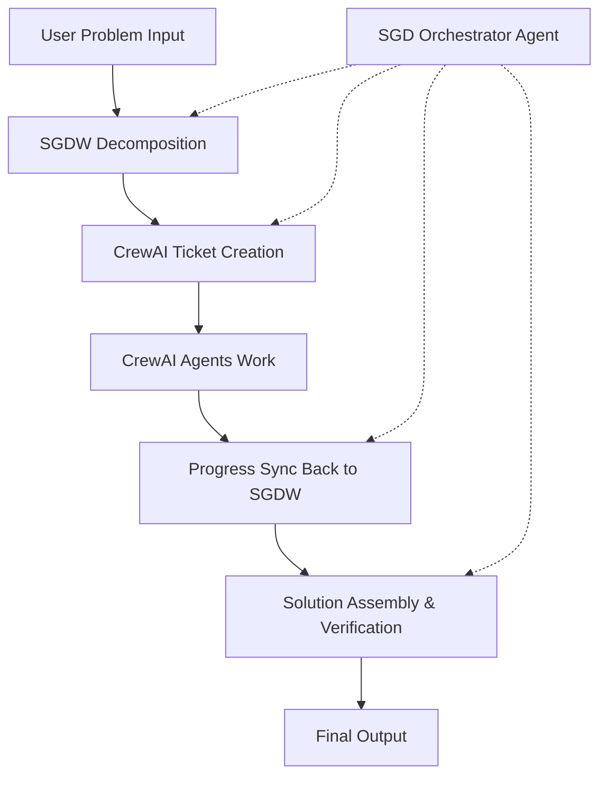

# OpenEvolve: The Sovereign-Grade Decomposition Workflow - Enhanced Design Document

## Table of Contents

1.  [Overview & Guiding Principles](#10-overview--guiding-principles)
    *   1.1 Mission: Solving Intractable Problems
    *   1.2 Core Philosophy: Sovereign-Grade Control & Self-Healing Automation
    *   1.3 Quantitative Analysis Approach
    *   1.4 Scalability & Performance Considerations
2.  [Core Architecture: Teams & Gauntlets](#20-core-architecture-teams--gauntlets)
    *   2.1 The Team Abstraction
        *   2.1.1 Team Roles (Blue, Red, Gold)
        *   2.1.2 Team Composition
        *   2.1.3 Team Specialization & Expertise Mapping
    *   2.2 The Gauntlet Abstraction
        *   2.2.1 Programmable Rules
        *   2.2.2 Advanced Gauntlet Configurations
        *   2.2.3 Dynamic Gauntlet Adaptation
3.  [The End-to-End Workflow: A Microscopic Breakdown](#30-the-end-to-end-workflow-a-microscopic-breakdown)
    *   3.1 Stage 0: Content Analysis
    *   3.2 Stage 1: AI-Assisted Decomposition
    *   3.3 Stage 2: Manual Review & Override (The 'Command' Step)
    *   3.4 Stage 3: Sub-Problem Solving Loop
        *   3.4.1 Step A: Solution Generation (Blue Team)
        *   3.4.2 Step B: Critique (Red Team Gauntlet)
        *   3.4.3 Step C: Verification (Gold Team Gauntlet)
        *   3.4.4 Step D: Iterative Refinement & Evolution
    *   3.5 Stage 4: Configurable Reassembly
    *   3.6 Stage 5: Final Verification & Self-Healing Loop
    *   3.7 Stage 6: Knowledge Extraction & Learning
    *   3.8 Iterative Contextual Refinements
4.  [UI/UX Configuration Concept](#40-uiux-configuration-concept)
    *   4.1 The Team Manager
    *   4.2 The Gauntlet Designer
    *   4.3 The Workflow Orchestrator
    *   4.4 The Manual Review Panel
    *   4.5 The Real-time Monitoring View
    *   4.6 The Analytics Dashboard
    *   4.7 The Knowledge Base Interface
5.  [Data Object Schemas (Detailed)](#50-data-object-schemas-detailed)
    *   5.1 `ModelConfig`
    *   5.2 `Team`
    *   5.3 `GauntletRoundRule`
    *   5.4 `GauntletDefinition`
    *   5.5 `SubProblem`
    *   5.6 `DecompositionPlan`
    *   5.7 `SolutionAttempt`
    *   5.8 `CritiqueReport`
    *   5.9 `VerificationReport`
    *   5.10 `WorkflowState`
    *   5.11 `KnowledgeArtifact`
    *   5.12 `PerformanceMetrics`
6.  [Implementation Status & Remaining Tasks](#60-implementation-status--remaining-tasks)
    *   6.1 Completed Tasks (Phase 1, Phase 2, Phase 3)
    *   6.2 Remaining Tasks (Phase 4)
    *   6.3 Future Enhancements (Phase 5)

---

## 1.0 Overview & Guiding Principles

### 1.1 Mission: Solving Intractable Problems

The Sovereign-Grade Decomposition Workflow (SGDW) is designed to tackle complex, seemingly intractable problems by treating them not as a single challenge, but as a system of interconnected, solvable components. By applying rigorous, multi-agent AI strategies at every step, the SGDW can navigate vast solution spaces and produce highly reliable and verified results. The system leverages the principle that no single AI model can solve complex problems reliably, but a carefully orchestrated system of specialized models, when working in concert, can achieve breakthrough results.

### 1.2 Core Philosophy: Sovereign-Grade Control & Self-Healing Automation

The workflow is built on two key principles:

1.  **Sovereign-Grade Control**: The user (the "Sovereign") has ultimate, microscopic control over every agent, process, and decision. The system provides intelligent defaults and suggestions, but the user has the final say. This includes defining AI teams, customizing evaluation criteria, and overriding AI-generated plans. Every parameter, threshold, and decision point can be configured, allowing for complete customization of the problem-solving approach.

2.  **Self-Healing Automation**: When faced with failures, the system is designed to intelligently diagnose the root cause, and automatically trigger targeted, recursive correction loops until a satisfactory solution is achieved. This minimizes manual intervention while maximizing reliability. The system learns from failures and successes, continuously improving its approach to similar problems.

### 1.3 Quantitative Analysis Approach

The SGDW leverages quantitative volume of analysis to overcome the limitations of individual AI models:

1.  **Massive Parallel Processing**: Multiple models work simultaneously on different aspects of a problem, generating a diverse set of potential solutions and critiques.

2.  **Statistical Consensus Building**: Rather than relying on a single model's output, the system uses statistical methods to build consensus across multiple models, identifying patterns and outliers in the data.

3.  **Iterative Refinement**: Solutions are refined through multiple iterations, with each iteration incorporating feedback from specialized critique models, gradually improving the quality and accuracy of the solution.

4.  **Multi-dimensional Evaluation**: Solutions are evaluated across multiple dimensions (accuracy, completeness, efficiency, security, etc.) by specialized models, ensuring a comprehensive assessment.

5.  **Probabilistic Confidence Scoring**: Each solution and critique is assigned a confidence score based on the consensus among models, allowing the system to prioritize high-confidence solutions while still exploring alternatives.

### 1.4 Scalability & Performance Considerations

The SGDW is designed to scale both horizontally and vertically:

1.  **Horizontal Scaling**: Additional models can be added to teams at any time, increasing the processing power and diversity of perspectives.

2.  **Vertical Scaling**: Models can be upgraded or replaced with more powerful versions as they become available, improving the quality of analysis.

3.  **Distributed Processing**: The workflow can be distributed across multiple computing resources, allowing for parallel processing of sub-problems.

4.  **Resource Optimization**: The system includes intelligent resource allocation, prioritizing critical sub-problems and allocating resources based on complexity and importance.

### 1.5 Massively Decomposed Agentic Processes (MDAP) Integration

The Sovereign-Grade Decomposition Workflow incorporates principles from Massively Decomposed Agentic Processes (MDAP), a framework that enables reliable execution of tasks with millions of LLM steps through extreme decomposition and error correction. This approach addresses the fundamental limitation of LLMs where performance deteriorates significantly with task length due to persistent error rates.

**Core MDAP Components:**

1.  **Maximal Agentic Decomposition (MAD)**: Tasks are decomposed into the smallest possible subtasks, with each subtask assigned to a focused microagent. This limits each agent's context to information sufficient for executing its single assigned step, allowing it to focus on its role and avoid confusion from irrelevant context. The mathematical formulation is:
    - For an s-step task decomposed into subtasks of m steps each:
      - Single-agent approach: a1, ..., as ~ (ψa ◦ M ◦ φ)(x)
      - MAD approach (m=1): ri+1 ~ M(φ(xi)), ai+1 = ψa(ri+1), xi+1 = ψx(ri+1) ∀i = 0, ..., s-1
    - This decomposition reduces the exponential decay of correctness probability from p^s to a more manageable form through error correction.

2.  **First-to-Ahead-by-k Voting**: Error correction is implemented through a voting mechanism where candidate samples are drawn until one has been sampled k times more than any other. This statistical approach significantly improves the probability of correct solutions even with imperfect individual agents. The voting process follows the sequential probability ratio test (SPRT) optimality principle.

3.  **Red-Flagging**: Outputs showing signs of unreliability (e.g., overly long responses, incorrectly formatted responses) are detected and discarded. This reduces correlated errors and increases the effective success rate of individual steps. The probability of valid response parsing is denoted as v, affecting the overall system cost.

**MDAP Mathematical Framework:**

For a task with s total steps, per-step success rate p, decomposition level m (steps per subtask), and vote threshold k:

- Probability of subtask success: psub = (p^m * k) / (p^m * k + ((1-p) * p^(m-1))^k)
- Probability of full task success: pfull = psub^(s/m)
- Expected cost with red-flagging: E[cost] = Θ((s * kmin) / (v * (2p - 1))) where v is the probability of valid response parsing

**Benefits of MDAP Integration:**

- **Zero-Error Execution**: Enables tasks with millions of sequential steps to be completed with zero errors through systematic error correction.
- **Micro-Role Assignment**: Agents are assigned tiny, focused roles rather than complex human-level tasks, exploiting the inherent machine-like nature of LLMs.
- **Scalability**: The approach scales log-linearly with task length, making it feasible to execute extremely long-horizon tasks.
- **Cost Efficiency**: Smaller, less expensive models can be used effectively due to the error correction mechanisms.
- **Reliability**: Decorrelation of errors through diverse sampling and red-flagging ensures robust performance even with suboptimal individual agents.

**MDAP Implementation Considerations:**

- **Decomposition Granularity**: The optimal decomposition level depends on the specific task and model capabilities. For maximal reliability, m=1 (single-step subtasks) provides optimal scaling.
- **Voting Threshold Selection**: The value of k should be chosen based on the target reliability and per-step success rate: kmin = Θ(ln s) for target success probability.
- **Red-Flagging Sensitivity**: The balance between error reduction and computational overhead should be optimized based on empirical validation.
- **Model Selection**: Since MAD allows for smaller models to be effective, the selection should focus on models with optimal cost/performance ratios rather than raw capability.

**MDAP Production Implementation:**

MDAP is implemented in `mdap_engine.py` and provides production-ready components for microtask orchestration, k-ahead voting, red-flagging, caching, and metrics:

- **MDAPOrchestrator**: Executes `MDAPTask` objects, applying k-ahead voting and fallback policies per step.
- **MDAPStep / MDAPTask**: Define microtasks with schema expectations, priority, and task metadata.
- **RedFlagger / SchemaValidator**: Enforce output validity, length limits, and blocked-pattern filtering.
- **MDAPCache**: Optional TTL cache for reusing validated subtask outputs.
- **AgentSelector**: Chooses team members based on specialization and historical performance metrics.
Production execution flows are wired in `workflow_engine.py` (`_generate_solution_with_mdap` and `generate_solution_for_sub_problem`). Any illustrative snippets below are conceptual only and not runtime code.

MDAP is a **generic, backend-agnostic error-prevention component** (paper-faithful to `docs/Papers/MDAP_MAKER.txt`, not Hanoi-specific). `MDAPOrchestrator` accepts an injectable `voter` callable (default: OpenAI-compatible LLM; mock/injected voters enable fully offline runs), and exact scaling-law analytics live in `engines/other/maker_scaling.py` (`step_success_probability` = Eq. 9, `required_k_for_reliability`, `expected_cost`, `parallelization_factor`).

**MDAP Operational Flow:**

1.  **Decompose**: Transform each stage objective into microtasks (`MDAPStep`) with explicit schemas.
2.  **Sample**: Collect candidate outputs from specialized agents in the selected `Team`.
3.  **Red-Flag**: Filter invalid or risky outputs before voting.
4.  **Vote**: Apply first-to-ahead-by-k voting, adapting k based on reliability goals.
5.  **Fallback**: Escalate or choose best-effort candidates when convergence fails.
6.  **Record**: Persist results and metrics for quality assurance and later learning.

**MDAP Integration Throughout Workflow Stages:**

The MDAP principles are applied via production modules, not inline reference code. Integration points:

1.  **Stage 0 (Content Analysis)**: When `WorkflowState.mdap_enabled` is true, content analysis runs through `mdap_engine.py` with explicit JSON schemas; otherwise it falls back to standard analysis. Configuration is passed via `WorkflowState.mdap_config` and persisted into `DecompositionPlan`.
2.  **Stage 1 (AI-Assisted Decomposition)**: When `WorkflowState.mdap_enabled` or `WorkflowState.maker_enabled` is true, decomposition follows the MDAP/MAKER recursive method: each step proposes `(P1, P2, C)` (two subproblems plus composition instructions) and recurses until atomic. This mirrors the paper’s Algorithm 4 and produces a dependency-aware plan with explicit composition nodes. Configuration is passed via `WorkflowState.mdap_config` / `WorkflowState.maker_config` and persisted into `DecompositionPlan`.
3.  **Stage 2 (Manual Review)**: UI surfaces MDAP toggles and config JSON; see `ui_components.py` and `ui_components_additional.py`.
4.  **Stage 3 (Sub-Problem Solving)**: MDAP runs in `workflow_engine.py` via `_generate_solution_with_mdap` when enabled. Core orchestration lives in `mdap_engine.py` (`MDAPOrchestrator`, `MDAPStep`, `MDAPTask`, `RedFlagger`, and optional caching).
5.  **Stage 4/5 (Reassembly/Verification)**: MDAP outputs feed the existing gauntlet evaluation pipeline; retries and fallback decisions remain in the workflow engine.

**MDAP Performance Optimization:**

To optimize MDAP implementation performance:

1.  **Parallelization Strategy**: The Θ(ln s) voting requirement can be parallelized across multiple processes, making the time complexity scale linearly with task length.
    ```python
    def optimize_mdap_parallelization(task_size: int, available_workers: int) -> Dict[str, int]:
        """
        Optimize parallelization parameters based on task size and available resources
        """
        # Calculate optimal number of parallel workers
        optimal_workers = min(available_workers, max(1, int(task_size * 0.1)))  # 10% of task size as workers

        # Calculate optimal batch size for voting
        optimal_batch_size = max(1, available_workers // 4)  # 25% of workers per batch

        # Calculate optimal k-value based on parallelization
        optimal_k = calculate_adaptive_k(task_size, optimal_workers)

        return {
            "optimal_workers": optimal_workers,
            "batch_size": optimal_batch_size,
            "k_value": optimal_k,
            "estimated_speedup": calculate_estimated_speedup(optimal_workers, task_size)
        }

    def calculate_estimated_speedup(parallel_workers: int, task_size: int) -> float:
        """
        Calculate estimated speedup based on Amdahl's law and task characteristics
        """
        # Calculate parallelizable portion of task
        parallel_portion = min(0.95, 1.0 - (1.0 / parallel_workers))  # Approaches 95% as workers increase

        # Calculate theoretical speedup
        speedup = 1.0 / ((1.0 - parallel_portion) + (parallel_portion / parallel_workers))

        # Adjust for overhead
        overhead_factor = 0.1  # 10% overhead
        adjusted_speedup = speedup * (1.0 - overhead_factor)

        return min(adjusted_speedup, parallel_workers)  # Cap at number of workers
    ```

2.  **Resource Allocation**: MDAP allows for efficient resource allocation by using smaller, specialized models instead of large general-purpose models.
    ```python
    def optimize_resource_allocation(task_complexity: float, available_resources: Dict[str, float]) -> Dict[str, Any]:
        """
        Optimize resource allocation for MDAP tasks based on complexity and available resources
        """
        # Determine model size requirements based on task complexity
        if task_complexity < 3.0:
            model_size = "small"  # Use smaller, faster models
            resource_multiplier = 0.5
        elif task_complexity < 7.0:
            model_size = "medium"  # Use medium-sized models
            resource_multiplier = 1.0
        else:
            model_size = "large"  # Use larger models for complex tasks
            resource_multiplier = 1.5

        # Calculate resource allocation
        allocated_resources = {
            "compute_units": available_resources["compute"] * resource_multiplier,
            "memory_gb": available_resources["memory"] * resource_multiplier,
            "api_tokens": available_resources["tokens"] * resource_multiplier,
            "concurrent_agents": min(
                int(available_resources["compute"] * 0.8),  # Use 80% of compute for agents
                calculate_max_agents_for_model_size(model_size)
            )
        }

        # Select optimal models based on allocation
        selected_models = select_optimal_models(model_size, allocated_resources)

        return {
            "model_size": model_size,
            "allocated_resources": allocated_resources,
            "selected_models": selected_models,
            "estimated_cost": calculate_cost_estimate(allocated_resources, selected_models)
        }

    def select_optimal_models(model_size: str, resources: Dict[str, float]) -> List[ModelConfig]:
        """
        Select optimal models based on size requirements and available resources
        """
        # Define model categories
        model_categories = {
            "small": ["gpt-3.5-turbo", "claude-haiku", "llama-3-8b"],
            "medium": ["gpt-4", "claude-sonnet", "llama-3-70b"],
            "large": ["gpt-4-turbo", "claude-opus", "llama-3-405b"]
        }

        available_models = model_categories[model_size]
        selected_models = []

        for model_name in available_models:
            if can_allocate_model(model_name, resources):
                selected_models.append(create_model_config(model_name))

        return selected_models
    ```

3.  **Caching Mechanisms**: Validated subtask solutions can be cached and reused, reducing computational overhead in iterative processes.
    ```python
    class MDAPCacheManager:
        """
        Cache manager for MDAP to optimize performance through solution reuse
        """
        def __init__(self, max_size: int = 10000, ttl_seconds: int = 3600):
            self.cache = {}
            self.max_size = max_size
            self.ttl_seconds = ttl_seconds
            self.access_times = {}
            self.hit_count = 0
            self.miss_count = 0

        def get_cached_solution(self, subtask_signature: str) -> Optional[Dict]:
            """
            Retrieve cached solution if available and not expired
            """
            current_time = time.time()

            if subtask_signature in self.cache:
                cached_item = self.cache[subtask_signature]

                # Check if cache entry is still valid
                if current_time - cached_item["timestamp"] < self.ttl_seconds:
                    self.hit_count += 1
                    return cached_item["solution"]
                else:
                    # Remove expired entry
                    del self.cache[subtask_signature]
                    del self.access_times[subtask_signature]

            self.miss_count += 1
            return None

        def cache_solution(self, subtask_signature: str, solution: Dict, metadata: Dict = None):
            """
            Cache a solution with metadata for future reuse
            """
            current_time = time.time()

            # Check cache size and evict if necessary
            if len(self.cache) >= self.max_size:
                self._evict_lru_entries()

            # Store solution with timestamp and metadata
            self.cache[subtask_signature] = {
                "solution": solution,
                "timestamp": current_time,
                "metadata": metadata or {}
            }
            self.access_times[subtask_signature] = current_time

        def _evict_lru_entries(self):
            """
            Evict least recently used entries to maintain cache size
            """
            if not self.access_times:
                return

            # Find and remove the least recently used entry
            lru_key = min(self.access_times, key=self.access_times.get)
            del self.cache[lru_key]
            del self.access_times[lru_key]

        def get_cache_stats(self) -> Dict[str, float]:
            """
            Get cache performance statistics
            """
            total_requests = self.hit_count + self.miss_count
            hit_rate = self.hit_count / total_requests if total_requests > 0 else 0.0

            return {
                "hit_rate": hit_rate,
                "hit_count": self.hit_count,
                "miss_count": self.miss_count,
                "cache_size": len(self.cache),
                "max_size": self.max_size
            }

    def calculate_cache_benefit_factor(cache_stats: Dict[str, float]) -> float:
        """
        Calculate the benefit factor of caching for performance optimization
        """
        hit_rate = cache_stats["hit_rate"]
        cache_size = cache_stats["cache_size"]
        max_size = cache_stats["max_size"]

        # Benefit increases with hit rate but decreases if cache is too large
        benefit_factor = hit_rate * (1.0 + (cache_size / max_size) * 0.1)
        return min(benefit_factor, 2.0)  # Cap at 2x benefit
    ```

4.  **Adaptive Thresholds**: The voting threshold k can be adjusted dynamically based on observed success rates and task complexity.
    ```python
    class AdaptiveThresholdManager:
        """
        Manage adaptive voting thresholds based on performance metrics
        """
        def __init__(self, initial_k: int = 3, min_k: int = 1, max_k: int = 10):
            self.current_k = initial_k
            self.min_k = min_k
            self.max_k = max_k
            self.performance_history = []
            self.target_success_rate = 0.95  # Target 95% success rate

        def update_threshold(self, task_result: Dict[str, Any]) -> int:
            """
            Update voting threshold based on task performance
            """
            success = task_result.get("success", False)
            confidence = task_result.get("confidence", 0.5)
            task_complexity = task_result.get("complexity", 5.0)

            # Record performance
            self.performance_history.append({
                "success": success,
                "confidence": confidence,
                "complexity": task_complexity,
                "timestamp": time.time()
            })

            # Keep only recent history (last 100 tasks)
            if len(self.performance_history) > 100:
                self.performance_history = self.performance_history[-100:]

            # Calculate recent success rate
            recent_success_rate = self._calculate_recent_success_rate()

            # Adjust k based on success rate
            if recent_success_rate < self.target_success_rate - 0.05:
                # Success rate too low, increase k for more reliability
                self.current_k = min(self.max_k, self.current_k + 1)
            elif recent_success_rate > self.target_success_rate + 0.05:
                # Success rate too high, decrease k for efficiency
                self.current_k = max(self.min_k, self.current_k - 1)

            # Adjust based on task complexity
            if task_complexity > 7.0:
                # High complexity tasks may need higher k
                self.current_k = min(self.max_k, self.current_k + 1)
            elif task_complexity < 3.0:
                # Low complexity tasks can use lower k
                self.current_k = max(self.min_k, self.current_k - 1)

            return self.current_k

        def _calculate_recent_success_rate(self) -> float:
            """
            Calculate success rate from recent history
            """
            if not self.performance_history:
                return 0.5  # Default

            successful_tasks = sum(1 for record in self.performance_history if record["success"])
            return successful_tasks / len(self.performance_history)

        def get_optimal_k_for_task(self, task_complexity: float, task_type: str) -> int:
            """
            Get optimal k value for a specific task based on its characteristics
            """
            base_k = self.current_k

            # Adjust based on task type
            type_multipliers = {
                "critical": 1.5,    # Higher k for critical tasks
                "routine": 0.8,     # Lower k for routine tasks
                "experimental": 1.2 # Higher k for experimental tasks
            }

            type_adjustment = type_multipliers.get(task_type, 1.0)
            adjusted_k = base_k * type_adjustment

            # Adjust based on complexity
            complexity_factor = 1.0 + (task_complexity / 10.0) * 0.5  # Up to 50% increase for complex tasks
            final_k = adjusted_k * complexity_factor

            # Ensure within bounds
            return int(max(self.min_k, min(self.max_k, final_k)))
    ```

5.  **Load Balancing**: Distribute MDAP tasks across available resources to prevent bottlenecks.
    ```python
    class MDAPLoadBalancer:
        """
        Load balancer for distributing MDAP tasks across available agents and resources
        """
        def __init__(self, agents: List[ModelConfig]):
            self.agents = agents
            self.agent_stats = {agent.model_id: {"requests": 0, "success_rate": 0.0, "avg_response_time": 0.0}
                               for agent in agents}
            self.task_queue = []

        def select_optimal_agent(self, task_complexity: float, task_type: str) -> ModelConfig:
            """
            Select the optimal agent for a given task based on current load and capabilities
            """
            # Filter agents by capability for the task type
            capable_agents = [agent for agent in self.agents if self._is_agent_capable(agent, task_type)]

            if not capable_agents:
                # Fallback to any available agent
                capable_agents = self.agents

            # Calculate scores for each agent based on load, success rate, and response time
            agent_scores = []
            for agent in capable_agents:
                stats = self.agent_stats[agent.model_id]

                # Calculate load factor (lower is better)
                load_factor = stats["requests"] / max(1, sum(s["requests"] for s in self.agent_stats.values()))

                # Calculate capability factor (higher success rate is better)
                capability_factor = stats["success_rate"]

                # Calculate efficiency factor (lower response time is better)
                efficiency_factor = 1.0 / (stats["avg_response_time"] + 1.0)  # +1 to avoid division by zero

                # Weighted score (adjust weights based on task requirements)
                score = (
                    (1.0 - load_factor) * 0.4 +  # Prefer less loaded agents
                    capability_factor * 0.4 +     # Prefer more capable agents
                    efficiency_factor * 0.2       # Prefer more efficient agents
                )

                agent_scores.append((agent, score))

            # Return agent with highest score
            best_agent, _ = max(agent_scores, key=lambda x: x[1])
            return best_agent

        def _is_agent_capable(self, agent: ModelConfig, task_type: str) -> bool:
            """
            Check if an agent is capable of handling a specific task type
            """
            # Define agent capabilities
            agent_capabilities = {
                "gpt-4": ["critical", "complex", "analysis", "strategy"],
                "gpt-3.5-turbo": ["routine", "simple", "fast"],
                "claude-sonnet": ["analysis", "reasoning", "creative"],
                "llama-3-70b": ["technical", "coding", "complex"]
            }

            capabilities = agent_capabilities.get(agent.model_id, [])
            return task_type in capabilities

        def update_agent_stats(self, agent_id: str, success: bool, response_time: float):
            """
            Update statistics for an agent after task completion
            """
            if agent_id in self.agent_stats:
                stats = self.agent_stats[agent_id]

                # Update request count
                stats["requests"] += 1

                # Update success rate (exponential moving average)
                alpha = 0.1  # Smoothing factor
                stats["success_rate"] = alpha * (1.0 if success else 0.0) + (1 - alpha) * stats["success_rate"]

                # Update average response time (exponential moving average)
                stats["avg_response_time"] = alpha * response_time + (1 - alpha) * stats["avg_response_time"]
    ```

**MDAP Quality Assurance:**

Quality assurance in MDAP-enhanced workflows includes:

1.  **Consistency Checks**: Cross-validation of results across multiple agents to ensure consistency.
    - Cross-validation metrics: Compare outputs from different agents for semantic similarity
    - Consistency scoring: Assign confidence scores based on agreement levels between agents
    - Discrepancy resolution: Implement protocols for handling disagreements between agents
    - Semantic validation: Use embedding similarity to detect subtle inconsistencies
    ```python
    def perform_consistency_check(results: List[Dict], threshold: float = 0.8) -> Dict[str, Any]:
        """
        Perform consistency check across multiple agent results
        """
        # Calculate semantic similarity between results
        similarities = calculate_pairwise_similarities(results)

        # Calculate consistency score
        consistency_score = calculate_consistency_score(similarities)

        # Identify discrepancies
        discrepancies = identify_discrepancies(results, similarities, threshold)

        # Generate resolution recommendations
        resolution_recommendations = generate_resolution_recommendations(discrepancies, results)

        return {
            "consistency_score": consistency_score,
            "discrepancies": discrepancies,
            "resolution_recommendations": resolution_recommendations,
            "is_consistent": consistency_score >= threshold
        }

    def calculate_pairwise_similarities(results: List[Dict]) -> List[List[float]]:
        """
        Calculate semantic similarities between all pairs of results
        """
        n = len(results)
        similarities = [[0.0 for _ in range(n)] for _ in range(n)]

        for i in range(n):
            for j in range(i + 1, n):
                similarity = calculate_semantic_similarity(results[i], results[j])
                similarities[i][j] = similarity
                similarities[j][i] = similarity  # Symmetric matrix

        return similarities

    def calculate_semantic_similarity(result1: Dict, result2: Dict) -> float:
        """
        Calculate semantic similarity between two results using embeddings
        """
        # Convert results to text representations
        text1 = convert_result_to_text(result1)
        text2 = convert_result_to_text(result2)

        # Generate embeddings
        embedding1 = generate_embedding(text1)
        embedding2 = generate_embedding(text2)

        # Calculate cosine similarity
        similarity = cosine_similarity(embedding1, embedding2)
        return similarity
    ```

2.  **Convergence Monitoring**: Tracking of voting convergence to ensure reliable decision-making.
    - Convergence rate tracking: Monitor how quickly voting converges to a decision
    - Stagnation detection: Identify when voting fails to converge within expected timeframes
    - Dynamic threshold adjustment: Modify k-values based on observed convergence patterns
    - Early termination conditions: Implement rules for stopping voting when confidence is high
    ```python
    class ConvergenceMonitor:
        """
        Monitor voting convergence and manage convergence-related parameters
        """
        def __init__(self, max_iterations: int = 50, min_confidence: float = 0.9):
            self.max_iterations = max_iterations
            self.min_confidence = min_confidence
            self.voting_history = []
            self.convergence_stats = {}

        def monitor_convergence(self, votes: List[str], current_iteration: int, k_threshold: int) -> Dict[str, Any]:
            """
            Monitor convergence of voting process
            """
            # Calculate current vote distribution
            vote_counts = {}
            for vote in votes:
                vote_counts[vote] = vote_counts.get(vote, 0) + 1

            # Calculate leading candidate and margin
            if vote_counts:
                leading_candidate = max(vote_counts, key=vote_counts.get)
                leading_count = vote_counts[leading_candidate]
                total_votes = len(votes)

                # Calculate confidence in leading candidate
                confidence = leading_count / total_votes

                # Check if leading candidate has achieved k-ahead
                other_votes = [count for candidate, count in vote_counts.items()
                              if candidate != leading_candidate]
                max_other = max(other_votes) if other_votes else 0

                has_achieved_k_ahead = (leading_count >= max_other + k_threshold)

                # Calculate convergence metrics
                entropy = calculate_vote_entropy(vote_counts, total_votes)
                consensus_strength = calculate_consensus_strength(vote_counts)

                # Check for stagnation
                is_stagnant = self._detect_stagnation(votes, current_iteration)

                # Determine if early termination is appropriate
                should_terminate_early = (
                    confidence >= self.min_confidence or
                    has_achieved_k_ahead or
                    is_stagnant or
                    current_iteration >= self.max_iterations
                )

                return {
                    "leading_candidate": leading_candidate,
                    "confidence": confidence,
                    "has_achieved_k_ahead": has_achieved_k_ahead,
                    "entropy": entropy,
                    "consensus_strength": consensus_strength,
                    "is_stagnant": is_stagnant,
                    "should_terminate_early": should_terminate_early,
                    "current_iteration": current_iteration
                }
            else:
                return {
                    "leading_candidate": None,
                    "confidence": 0.0,
                    "has_achieved_k_ahead": False,
                    "entropy": 1.0,
                    "consensus_strength": 0.0,
                    "is_stagnant": False,
                    "should_terminate_early": True,
                    "current_iteration": current_iteration
                }

        def _detect_stagnation(self, votes: List[str], current_iteration: int) -> bool:
            """
            Detect if voting is stagnating (not making progress)
            """
            if len(votes) < 10:
                return False

            # Check if the same candidates are repeatedly getting votes without convergence
            recent_votes = votes[-10:]  # Last 10 votes
            vote_distribution = {}
            for vote in recent_votes:
                vote_distribution[vote] = vote_distribution.get(vote, 0) + 1

            # If votes are spread too evenly, it may indicate stagnation
            if len(vote_distribution) > len(recent_votes) * 0.7:  # More than 70% unique votes
                return True

            # Check for oscillation between a few candidates
            top_candidates = sorted(vote_distribution.items(), key=lambda x: x[1], reverse=True)[:2]
            if len(top_candidates) == 2:
                count1, count2 = top_candidates[0][1], top_candidates[1][1]
                if abs(count1 - count2) <= 2:  # Close counts indicate oscillation
                    return True

            return False

    def calculate_vote_entropy(vote_counts: Dict[str, int], total_votes: int) -> float:
        """
        Calculate entropy of vote distribution (lower entropy = higher consensus)
        """
        if total_votes == 0:
            return 0.0

        entropy = 0.0
        for count in vote_counts.values():
            if count > 0:
                probability = count / total_votes
                entropy -= probability * math.log2(probability)

        # Normalize to [0, 1] range (max entropy when all votes are equally distributed)
        max_possible_entropy = math.log2(len(vote_counts)) if vote_counts else 1.0
        return entropy / max_possible_entropy if max_possible_entropy > 0 else 0.0

    def calculate_consensus_strength(vote_counts: Dict[str, int]) -> float:
        """
        Calculate strength of consensus (higher = stronger consensus)
        """
        if not vote_counts:
            return 0.0

        sorted_counts = sorted(vote_counts.values(), reverse=True)
        if len(sorted_counts) < 2:
            return 1.0  # Perfect consensus if only one option

        # Calculate margin between first and second place
        first_place = sorted_counts[0]
        second_place = sorted_counts[1]

        # Consensus strength based on margin
        total_votes = sum(vote_counts.values())
        margin = (first_place - second_place) / total_votes
        return min(1.0, margin * 2)  # Scale to emphasize strong margins
    ```

3.  **Error Pattern Analysis**: Systematic analysis of red-flagged responses to identify and address systematic issues.
    - Pattern clustering: Group similar error patterns to identify common failure modes
    - Root cause analysis: Determine underlying causes of systematic errors
    - Feedback loops: Use error analysis to improve agent prompts and instructions
    - Anomaly detection: Identify unusual error patterns that may indicate new issues
    ```python
    class ErrorPatternAnalyzer:
        """
        Analyze patterns in red-flagged responses to identify systematic issues
        """
        def __init__(self):
            self.flagged_responses = []
            self.error_patterns = {}
            self.root_causes = {}

        def analyze_error_patterns(self, flagged_responses: List[Dict]) -> Dict[str, Any]:
            """
            Analyze patterns in flagged responses
            """
            # Cluster similar error patterns
            pattern_clusters = self._cluster_error_patterns(flagged_responses)

            # Identify common failure modes
            failure_modes = self._identify_failure_modes(pattern_clusters)

            # Perform root cause analysis
            root_causes = self._perform_root_cause_analysis(pattern_clusters)

            # Generate improvement recommendations
            recommendations = self._generate_improvement_recommendations(
                pattern_clusters, failure_modes, root_causes
            )

            return {
                "pattern_clusters": pattern_clusters,
                "failure_modes": failure_modes,
                "root_causes": root_causes,
                "recommendations": recommendations
            }

        def _cluster_error_patterns(self, responses: List[Dict]) -> Dict[str, List[Dict]]:
            """
            Cluster similar error patterns using semantic similarity
            """
            clusters = {}

            for response in responses:
                # Find the most similar existing cluster
                best_cluster = None
                best_similarity = 0.0

                for cluster_id, cluster_responses in clusters.items():
                    # Calculate similarity to representative of cluster
                    representative = cluster_responses[0]  # Use first as representative
                    similarity = calculate_semantic_similarity(response, representative)

                    if similarity > best_similarity and similarity > 0.7:  # Threshold for clustering
                        best_cluster = cluster_id
                        best_similarity = similarity

                # Add to existing cluster or create new one
                if best_cluster:
                    clusters[best_cluster].append(response)
                else:
                    new_cluster_id = f"cluster_{len(clusters)}"
                    clusters[new_cluster_id] = [response]

            return clusters

        def _identify_failure_modes(self, clusters: Dict[str, List[Dict]]) -> List[Dict[str, Any]]:
            """
            Identify common failure modes from error clusters
            """
            failure_modes = []

            for cluster_id, cluster_responses in clusters.items():
                # Analyze common characteristics of responses in cluster
                common_features = self._extract_common_features(cluster_responses)

                failure_modes.append({
                    "cluster_id": cluster_id,
                    "size": len(cluster_responses),
                    "common_features": common_features,
                    "frequency": len(cluster_responses) / len(self.flagged_responses) if self.flagged_responses else 0,
                    "severity": self._calculate_severity(cluster_responses)
                })

            return failure_modes

        def _perform_root_cause_analysis(self, clusters: Dict[str, List[Dict]]) -> Dict[str, str]:
            """
            Perform root cause analysis for each cluster
            """
            root_causes = {}

            for cluster_id, cluster_responses in clusters.items():
                # Analyze the context and conditions that led to these errors
                contexts = [resp.get("context", "") for resp in cluster_responses]
                tasks = [resp.get("task", "") for resp in cluster_responses]

                # Identify common contextual factors
                common_contexts = self._find_common_contexts(contexts)
                common_tasks = self._find_common_tasks(tasks)

                # Generate root cause hypothesis
                root_cause = self._generate_root_cause_hypothesis(
                    common_contexts, common_tasks, cluster_responses
                )

                root_causes[cluster_id] = root_cause

            return root_causes

        def _generate_improvement_recommendations(self, clusters: Dict[str, List[Dict]],
                                               failure_modes: List[Dict],
                                               root_causes: Dict[str, str]) -> List[Dict[str, str]]:
            """
            Generate recommendations for improving the system based on error analysis
            """
            recommendations = []

            for mode in failure_modes:
                cluster_id = mode["cluster_id"]
                root_cause = root_causes.get(cluster_id, "Unknown cause")

                # Generate specific recommendation based on root cause
                recommendation = self._generate_specific_recommendation(root_cause, mode)
                recommendations.append(recommendation)

            return recommendations

        def _generate_specific_recommendation(self, root_cause: str, failure_mode: Dict) -> Dict[str, str]:
            """
            Generate a specific recommendation based on root cause and failure mode
            """
            # Map common root causes to specific recommendations
            cause_recommendations = {
                "insufficient context": "Provide more detailed context to agents",
                "ambiguous instructions": "Clarify and be more specific in instructions",
                "complexity mismatch": "Use more capable agents for complex tasks",
                "domain knowledge gap": "Provide domain-specific examples or fine-tune agents",
                "prompt injection": "Implement better prompt validation and sanitization"
            }

            recommendation_text = cause_recommendations.get(root_cause, f"Review and improve handling of: {root_cause}")

            return {
                "root_cause": root_cause,
                "failure_mode_size": str(failure_mode["size"]),
                "recommendation": recommendation_text,
                "priority": "high" if failure_mode["size"] > 10 else "medium"  # Prioritize based on frequency
            }
    ```

4.  **Reliability Metrics**: Continuous monitoring of success rates, voting consensus levels, and red-flagging rates to maintain quality standards.
    - Success rate tracking: Monitor per-step success rates across different task types
    - Consensus quality: Measure the strength of voting consensus (e.g., margin between winner and runner-up)
    - Red-flagging rate analysis: Track flagging rates to optimize sensitivity thresholds
    - Agent performance metrics: Individual agent reliability scores for team optimization
    ```python
    class MDAPReliabilityMetrics:
        """
        Track and analyze reliability metrics for MDAP system
        """
        def __init__(self):
            self.metrics_history = []
            self.agent_performance = {}
            self.task_type_metrics = {}

        def record_task_metrics(self, task_id: str, task_type: str, agent_id: str,
                              success: bool, confidence: float, red_flagged: bool,
                              response_time: float, consensus_strength: float):
            """
            Record metrics for a completed task
            """
            metric_record = {
                "task_id": task_id,
                "task_type": task_type,
                "agent_id": agent_id,
                "success": success,
                "confidence": confidence,
                "red_flagged": red_flagged,
                "response_time": response_time,
                "consensus_strength": consensus_strength,
                "timestamp": time.time()
            }

            self.metrics_history.append(metric_record)

            # Update agent performance
            self._update_agent_performance(agent_id, metric_record)

            # Update task type metrics
            self._update_task_type_metrics(task_type, metric_record)

        def _update_agent_performance(self, agent_id: str, metric: Dict):
            """
            Update performance metrics for an agent
            """
            if agent_id not in self.agent_performance:
                self.agent_performance[agent_id] = {
                    "total_tasks": 0,
                    "successful_tasks": 0,
                    "avg_confidence": 0.0,
                    "red_flag_rate": 0.0,
                    "avg_response_time": 0.0,
                    "consensus_strength_avg": 0.0
                }

            agent_stats = self.agent_performance[agent_id]

            # Update counts
            agent_stats["total_tasks"] += 1
            if metric["success"]:
                agent_stats["successful_tasks"] += 1

            # Update averages using exponential moving average
            alpha = 0.1  # Smoothing factor
            agent_stats["avg_confidence"] = (
                alpha * metric["confidence"] +
                (1 - alpha) * agent_stats["avg_confidence"]
            )
            agent_stats["red_flag_rate"] = (
                alpha * (1.0 if metric["red_flagged"] else 0.0) +
                (1 - alpha) * agent_stats["red_flag_rate"]
            )
            agent_stats["avg_response_time"] = (
                alpha * metric["response_time"] +
                (1 - alpha) * agent_stats["avg_response_time"]
            )
            agent_stats["consensus_strength_avg"] = (
                alpha * metric["consensus_strength"] +
                (1 - alpha) * agent_stats["consensus_strength_avg"]
            )

        def _update_task_type_metrics(self, task_type: str, metric: Dict):
            """
            Update metrics for a specific task type
            """
            if task_type not in self.task_type_metrics:
                self.task_type_metrics[task_type] = {
                    "total_tasks": 0,
                    "successful_tasks": 0,
                    "avg_confidence": 0.0,
                    "red_flag_rate": 0.0,
                    "avg_response_time": 0.0,
                    "consensus_strength_avg": 0.0
                }

            type_stats = self.task_type_metrics[task_type]

            # Update counts
            type_stats["total_tasks"] += 1
            if metric["success"]:
                type_stats["successful_tasks"] += 1

            # Update averages using exponential moving average
            alpha = 0.1
            type_stats["avg_confidence"] = (
                alpha * metric["confidence"] +
                (1 - alpha) * type_stats["avg_confidence"]
            )
            type_stats["red_flag_rate"] = (
                alpha * (1.0 if metric["red_flagged"] else 0.0) +
                (1 - alpha) * type_stats["red_flag_rate"]
            )
            type_stats["avg_response_time"] = (
                alpha * metric["response_time"] +
                (1 - alpha) * type_stats["avg_response_time"]
            )
            type_stats["consensus_strength_avg"] = (
                alpha * metric["consensus_strength"] +
                (1 - alpha) * type_stats["consensus_strength_avg"]
            )

        def get_reliability_report(self) -> Dict[str, Any]:
            """
            Generate a comprehensive reliability report
            """
            # Calculate overall system metrics
            total_tasks = len(self.metrics_history)
            if total_tasks == 0:
                return {"error": "No metrics recorded yet"}

            successful_tasks = sum(1 for m in self.metrics_history if m["success"])
            overall_success_rate = successful_tasks / total_tasks

            avg_confidence = sum(m["confidence"] for m in self.metrics_history) / total_tasks
            red_flag_rate = sum(1 for m in self.metrics_history if m["red_flagged"]) / total_tasks
            avg_response_time = sum(m["response_time"] for m in self.metrics_history) / total_tasks
            avg_consensus_strength = sum(m["consensus_strength"] for m in self.metrics_history) / total_tasks

            # Get agent performance rankings
            agent_rankings = self._get_agent_rankings()

            # Get task type performance
            task_type_performance = self._get_task_type_performance()

            return {
                "overall_metrics": {
                    "total_tasks": total_tasks,
                    "success_rate": overall_success_rate,
                    "avg_confidence": avg_confidence,
                    "red_flag_rate": red_flag_rate,
                    "avg_response_time": avg_response_time,
                    "avg_consensus_strength": avg_consensus_strength
                },
                "agent_rankings": agent_rankings,
                "task_type_performance": task_type_performance,
                "recommendations": self._generate_system_recommendations()
            }

        def _get_agent_rankings(self) -> List[Dict[str, Any]]:
            """
            Get agent performance rankings
            """
            rankings = []
            for agent_id, stats in self.agent_performance.items():
                if stats["total_tasks"] > 0:
                    success_rate = stats["successful_tasks"] / stats["total_tasks"]
                    rankings.append({
                        "agent_id": agent_id,
                        "success_rate": success_rate,
                        "total_tasks": stats["total_tasks"],
                        "avg_confidence": stats["avg_confidence"],
                        "red_flag_rate": stats["red_flag_rate"],
                        "avg_response_time": stats["avg_response_time"]
                    })

            # Sort by success rate (descending)
            return sorted(rankings, key=lambda x: x["success_rate"], reverse=True)

        def _get_task_type_performance(self) -> Dict[str, Dict[str, float]]:
            """
            Get performance metrics by task type
            """
            performance = {}
            for task_type, stats in self.task_type_metrics.items():
                if stats["total_tasks"] > 0:
                    success_rate = stats["successful_tasks"] / stats["total_tasks"]
                    performance[task_type] = {
                        "success_rate": success_rate,
                        "total_tasks": stats["total_tasks"],
                        "avg_confidence": stats["avg_confidence"],
                        "red_flag_rate": stats["red_flag_rate"],
                        "avg_response_time": stats["avg_response_time"]
                    }

            return performance

        def _generate_system_recommendations(self) -> List[str]:
            """
            Generate system-level recommendations based on metrics
            """
            recommendations = []

            # Check if success rate is below threshold
            overall_success_rate = sum(1 for m in self.metrics_history if m["success"]) / len(self.metrics_history) if self.metrics_history else 0
            if overall_success_rate < 0.9:  # Below 90% success rate
                recommendations.append("Success rate below 90%, consider adjusting MDAP parameters or agent selection")

            # Check if red-flag rate is too high
            red_flag_rate = sum(1 for m in self.metrics_history if m["red_flagged"]) / len(self.metrics_history) if self.metrics_history else 0
            if red_flag_rate > 0.2:  # Above 20% red-flag rate
                recommendations.append("High red-flag rate (>20%), consider adjusting flagging thresholds or agent quality")

            # Check if consensus strength is too low
            avg_consensus_strength = sum(m["consensus_strength"] for m in self.metrics_history) / len(self.metrics_history) if self.metrics_history else 0
            if avg_consensus_strength < 0.5:  # Below 50% consensus strength
                recommendations.append("Low consensus strength, consider increasing voting threshold k or improving agent diversity")

            return recommendations
    ```

**MDAP Failure Mitigation Strategies:**

When MDAP systems encounter failures, several mitigation strategies are employed:

1.  **Adaptive Decomposition**: Dynamically adjust the granularity of task decomposition based on observed failure patterns:
    - If subtasks are too complex: Further decompose into smaller microtasks
    - If communication overhead is high: Combine related microtasks
    - If context loss occurs: Maintain more state information between microtasks

2.  **Dynamic Voting Adjustment**: Modify voting parameters based on real-time performance:
    - Increase k-values when success rates drop below thresholds
    - Decrease k-values when high confidence is consistently achieved
    - Adjust voting algorithms based on task characteristics (e.g., use weighted voting for specialized agents)

3.  **Agent Specialization**: Dynamically assign agents to tasks based on their observed performance:
    - Performance-based routing: Route tasks to agents with highest success rates for similar tasks
    - Load balancing: Distribute tasks to prevent agent overuse and fatigue
    - Capability matching: Match agent capabilities to task requirements

4.  **Fallback Mechanisms**: Implement graceful degradation when MDAP components fail:
    - Escalation protocols: Move to higher-level agents when microagents fail
    - Simplification strategies: Reduce task complexity when success rates are low
    - Alternative pathways: Provide multiple solution paths for critical tasks

**MDAP Resource Management:**

Efficient resource management is crucial for MDAP systems:

1.  **Computational Resource Allocation**:
    - Parallel processing optimization: Maximize concurrent execution of independent microtasks
    - Memory management: Efficiently manage state information between microtasks
    - API rate limiting: Respect API limits while maintaining throughput
    - Cost optimization: Balance quality (k-values) with computational cost

2.  **Temporal Resource Management**:
    - Time budget allocation: Distribute time budgets across different workflow stages
    - Deadline management: Implement soft and hard deadlines for different task types
    - Priority scheduling: Prioritize critical path tasks in resource-constrained environments
    - Timeout handling: Implement graceful timeout and retry mechanisms

3.  **Model Resource Optimization**:
    - Model selection: Choose appropriate models for different microtask types
    - Context window optimization: Maximize context utilization for each microtask
    - Token economy: Minimize token usage while maintaining quality
    - Model switching: Dynamically switch between models based on task requirements

**MDAP Scalability Considerations:**

MDAP systems must scale efficiently across multiple dimensions:

1.  **Horizontal Scaling**:
    - Agent pool expansion: Dynamically add more agents as task volume increases
    - Distributed execution: Run agents across multiple computing nodes
    - Load distribution: Balance workload across available agents
    - Network optimization: Minimize communication overhead between distributed agents

2.  **Vertical Scaling**:
    - Agent capability enhancement: Upgrade individual agents with more powerful models
    - Memory scaling: Increase memory allocation for complex tasks
    - Compute scaling: Allocate more computational resources to critical tasks
    - Storage scaling: Expand storage for state management and caching

3.  **Economic Scaling**:
    - Cost per quality: Optimize the trade-off between cost and output quality
    - Resource utilization: Maximize resource utilization efficiency
    - Budget management: Implement spending limits and cost controls
    - ROI optimization: Balance quality improvements with cost increases

### 1.6 MAKER Framework Implementation

The MAKER framework (Maximal Agentic decomposition, first-to-ahead-by-K Error correction, and Red-flagging) provides a concrete implementation of MDAP principles within the Sovereign-Grade Decomposition Workflow. MAKER was the first system to successfully solve a task with over one million LLM steps with zero errors.

**MAKER Core Algorithms:**

1.  **Solution Generation Algorithm**:
    - Input: Initial state (xo), LLM model (M), vote threshold (k)
    - Process: For each step, execute voting to determine the next action
    - Output: Sequence of actions (A) that completes the task
    ```python
    def generate_solution(xo, M, k):
        A = []  # Action list
        x = xo
        for s steps do
            a, x = do_voting(x, M, k)
            Append a to A
        return A
    ```

2.  **Voting Algorithm**:
    - Collect votes from multiple LLM calls until one option achieves k more votes than any alternative
    - Implements statistical power through independent samples to determine winners
    ```python
    def do_voting(x, M, k):
        V = {v: 0 for v in all_possible_votes}  # Vote counts
        while True:
            y = get_vote(x, M)
            V[y] = V[y] + 1
            if V[y] >= k + max(V[v] for v in V if v != y):
                return y, next_state(y)  # Return winning vote and next state
    ```

3.  **Vote Collection Algorithm**:
    - Continuously sample responses from LLMs
    - Apply red-flagging to filter unreliable responses
    - Return valid responses for voting process
    ```python
    def get_vote(x, M):
        while True:
            r = M(x)  # Get response from model M with prompt x
            if not has_red_flags(r):
                return parse_action(r), parse_next_state(r)
    ```

**MAKER Error Correction Scaling:**

The probability of success with MAKER follows specific scaling laws:
- For a task with s total steps, per-step success rate p, and vote threshold k: P_success = (p^k) / (p^k + (1-p)^k)^(s/k)
- The minimum votes required scales logarithmically: k_min = Θ(ln s)
- Expected cost scales as: O(p^(-1) * s * ln s) for maximal decomposition (m=1)

**Red-Flagging Implementation:**

Two primary indicators of unreliability are monitored:
1. **Overly Long Responses**: Responses exceeding a token threshold (e.g., 750 tokens) are flagged and discarded
2. **Incorrectly Formatted Responses**: Responses that don't match expected format are flagged and discarded

**MAKER Cost Scaling:**

The expected cost of MAKER implementation scales according to:
- For m steps per subtask: Expected cost = Θ(p^(-m) * s * ln s)
- For maximal decomposition (m=1): Expected cost = Θ(p^(-1) * s * ln s)
- This represents log-linear scaling with respect to task length, making it feasible to execute extremely long-horizon tasks

**MAKER Parallelization:**

The Θ(ln s) factor corresponds to the number of votes required per step, which can be parallelized across Θ(ln s) processes. This means the time cost of the parallelized system scales only linearly with s, making it highly efficient for large-scale implementations.

**MAKER Implementation Architecture:**

The MAKER framework is implemented with the following architectural components:

1.  **Agent Management Layer**:
    - Agent pool management for handling multiple concurrent LLM calls
    - Agent state tracking to maintain context between calls
    - Load balancing across available agents
    - Agent health monitoring and failure recovery

2.  **Voting Coordination Layer**:
    - Vote collection and aggregation mechanisms
    - Real-time voting status tracking
    - Convergence detection and termination conditions
    - Vote validation and filtering

3.  **Red-Flagging Engine**:
    - Response quality assessment algorithms
    - Threshold management for different quality metrics
    - Adaptive flagging based on task characteristics
    - Performance monitoring for flagging effectiveness

4.  **State Management System**:
    - Task state persistence across multiple steps
    - Context propagation between subtasks
    - Error recovery and state restoration
    - Performance optimization for state operations

**MAKER Production Implementation:**

MAKER is implemented in `maker_engine.py` and provides a full stateful loop with k-ahead voting, red-flagging, escalation, and checkpointing:

- **MakerEngine**: Drives the step-by-step decision loop for long-horizon tasks.
- **MakerStep**: Defines per-step prompts, schema expectations, and task metadata.
- **MakerState**: Captures current state, history, and step index.
- **CheckpointStore**: Persists progress for recovery (default file-backed implementation).
Production execution flows are wired in `workflow_engine.py` (`_generate_solution_with_maker` and `generate_solution_for_sub_problem`). Any illustrative snippets below are conceptual only and not runtime code.

**MAKER Operational Flow:**

1.  **Initialize**: Build the first step prompt from the task state.
2.  **Vote**: Collect candidate actions until a k-ahead winner emerges.
3.  **Red-Flag**: Filter invalid candidates before voting.
4.  **Advance**: Apply the winning action to produce the next state.
5.  **Checkpoint**: Persist progress periodically to enable recovery.
6.  **Escalate**: If voting stalls, increase k or select higher-capability agents.

**MAKER Performance Optimization:**

To optimize MAKER performance:

1.  **Batch Processing**: Process multiple votes in batches to reduce API overhead
2.  **Caching**: Cache intermediate results to avoid redundant computations
3.  **Asynchronous Execution**: Execute independent operations concurrently
4.  **Resource Pooling**: Share resources across multiple MAKER instances
5.  **Adaptive Thresholds**: Adjust k-values based on observed success rates

**MAKER Quality Control:**

Quality control mechanisms in MAKER include:

1.  **Success Rate Monitoring**: Track per-step success rates and adjust parameters accordingly
2.  **Voting Consistency**: Monitor voting patterns for anomalies
3.  **Response Quality Metrics**: Evaluate response quality beyond simple red-flagging
4.  **Convergence Analysis**: Analyze voting convergence patterns for optimization

This approach significantly improves the per-step success rate and reduces correlated errors that could compromise the entire task.

### 1.6.1 MAKER Implementation Status (Generic Error-Prevention Component)

MAKER is implemented as a **generic, backend-agnostic error-prevention component**, faithfully following the paper `docs/Papers/MDAP_MAKER.txt` ("Solving a Million-Step LLM Task with Zero Errors"). It is intentionally **not Hanoi-specific**: the same `MakerEngine` / `MDAPOrchestrator` machinery drives any decomposed task whose steps expose a per-step success probability `p > 0.5`.

Key design properties (all present in `engines/other/maker_engine.py`, `engines/other/mdap_engine.py`, `engines/other/maker_scaling.py`):

* **Injectable, backend-agnostic voter.** Both engines accept an optional `voter(prompt, system_prompt, expected_schema, step) -> (raw_text, candidate)` callable. The default voter performs the OpenAI-compatible LLM call (the paper's observation that "relatively small non-reasoning models suffice"). Injecting a voter lets the entire workflow run **offline** with a deterministic/mock backend and makes the system truly generic. The same injection is threaded through `workflow_engine.py` (`_generate_solution_with_maker`, `_generate_solution_with_mdap`, `generate_solution_for_sub_problem`).
* **Faithful algorithms.** `MakerEngine._has_k_ahead` implements the exact first-to-ahead-by-k condition `V[y] >= k + max_{v != y} V[v]` (Alg. 2). `get_vote` (the voter loop) discards red-flagged responses and re-samples (Alg. 3), and `generate_solution` appends the winning action and advances state each step (Alg. 1).
* **Exact scaling-law analytics** (`maker_scaling.py`, pure/offline): `step_success_probability(p, k) = 1 / (1 + ((1-p)/p)^k)` (Eq. 9); `full_task_success_probability = step^steps`; `required_k_for_reliability` (binary search) auto-tunes `k` from a target reliability (the doc's "adaptive thresholds"); `expected_votes_per_step` (gambler's-ruin expected duration), `expected_cost` (`Theta(p^{-1} c s ln s)` for m=1), and `parallelization_factor` (`Theta(ln s)`).
* **Red-flagging integration (exceeds paper).** Both engines use the core `RedFlagger` (length + schema + confidence + blocked patterns) and, when `config.use_enhanced_redflag` is set, additionally consult `reliability/enhanced_redflagger.py`'s `EnhancedRedflagger` for richer correlated-error detection. The paper's core signal — discard malformed/structurally-inconsistent outputs as proxies for deeper reasoning errors, *before* voting — is enforced, so correlated failures are decorrelated. The change is import-guarded (no hard dependency on the red-flagging system).

The generic runner `run_generic_maker` (and the FastAPI routes `/mdap-maker/maker-solve` in the BubbleLab API and `/maker/generate-solution` in `engines/other/api_server.py`) accept an initial state, a step list/generator, MAKER config (k, red-flag rules, target reliability), and an optional mock-voter flag, returning `{actions, final_state, metrics, scaling_laws}` where `scaling_laws` uses the analytics above to predict success probability / expected cost / required k for the requested length.

---

### 1.7 ACE (Agentic Context Engine) Integration

The **Agentic Context Engine (ACE)** enables AI agents to learn from their execution feedback through a three-role learning loop. Instead of making the same mistakes repeatedly, agents using ACE continuously improve by building a reusable skillbook.

**Core ACE Components:**
1.  **Agent**: Executes tasks using learned skills.
2.  **Reflector**: Analyzes execution performance (success/failure).
3.  **SkillManager**: Updates the skillbook with new skills and insights.
4.  **Skillbook**: A living document of learned strategies stored in TOON (Token-Oriented Object Notation) format.

**Integration Points in Workflow:**
- **Stage 0 & 1**: Inject learned skills into content analysis and decomposition prompts.
- **Stage 3 (Solution Generation)**: Inject skills into solution generation prompts.
- **Stage 3 (Critique & Verification)**: Capture Red Team and Gold Team feedback to update the skillbook.
- **Stage 5 (Final Verification)**: Learn from final validation results.

**Benefits:**
- **Self-Improving Agents**: Performance improves with each iteration (20-35% better on complex tasks).
- **Context Preservation**: TOON format reduces token usage while maintaining context.
- **Continuous Learning**: Failures in one workflow execution prevent similar failures in future runs.

---

## 2.0 Core Architecture: Teams & Gauntlets

### 2.1 The Team Abstraction

A **Team** is a user-defined, named group of AI models assigned to a specific role. This is the fundamental unit of action in the workflow.

#### 2.1.1 Team Roles (Blue, Red, Gold)

*   **Blue Teams**: Responsible for creation and synthesis. Their primary function is to generate, refine, and assemble content. Sub-roles include:
    *   `Planners`: Generate initial decomposition strategies and sub-problem definitions.
    *   `Solvers`: Generate initial solutions for individual sub-problems.
    *   `Patchers`: Analyze critique/verification reports and modify existing solutions to address identified flaws.
    *   `Assemblers`: Integrate verified solutions into a final, coherent product.
    *   `Optimizers`: Refine solutions for efficiency, performance, or other specific criteria.
    *   `Synthesizers`: Combine multiple solution approaches into hybrid solutions.

*   **Red Teams (`Assailants`)**: Responsible for criticism and flaw detection. They act as adversarial agents, actively seeking vulnerabilities, inconsistencies, and weaknesses in generated content. Sub-roles include:
    *   `Security Analysts`: Identify security vulnerabilities and potential exploits.
    *   `Logic Verifiers`: Check for logical inconsistencies and fallacies.
    *   `Edge Case Explorers`: Test solutions against extreme or unusual scenarios.
    *   `Assumption Challengers`: Question underlying assumptions and premises.
    *   `Compliance Checkers`: Verify adherence to standards, regulations, and best practices.

*   **Gold Teams (`Judges`)**: Responsible for impartial evaluation and scoring against defined criteria. They verify the correctness, quality, and adherence to requirements of solutions. Sub-roles include:
    *   `Accuracy Judges`: Evaluate the factual correctness of solutions.
    *   `Completeness Judges`: Assess whether solutions fully address the problem requirements.
    *   `Efficiency Judges`: Measure the performance and resource utilization of solutions.
    *   `Usability Judges`: Evaluate the user-friendliness and accessibility of solutions.
    *   `Innovation Judges`: Assess the novelty and creativity of solutions.

#### 2.1.2 Team Composition

A team is a collection of specific `ModelConfig` objects. Each `ModelConfig` specifies an AI model (e.g., `gpt-4-turbo`, `claude-3-opus`), its API key, base URL, and generation parameters (temperature, top-p, max_tokens, etc.). This allows for the creation of diverse, specialist teams where each member can be fine-tuned for its specific task. Teams are created and managed via the 'Team Manager' UI (see section 4.1) and are defined by the `Team` data object (see section 5.2).

#### 2.1.3 Team Specialization & Expertise Mapping

Teams can be specialized for specific domains or problem types:

1.  **Domain Specialization**: Teams can be configured with expertise in specific domains (e.g., healthcare, finance, software engineering) by using domain-specific models or fine-tuning prompts.

2.  **Problem Type Specialization**: Teams can be specialized for specific types of problems (e.g., optimization, prediction, classification) by selecting models with appropriate capabilities.

3.  **Expertise Mapping**: The system maintains a mapping of team expertise to problem characteristics, allowing for automatic team selection based on problem analysis.

4.  **Dynamic Team Formation**: For complex problems, the system can dynamically form specialized teams by combining models from different teams based on the specific requirements of each sub-problem.

### 2.2 The Gauntlet Abstraction

A **Gauntlet** is a programmable, multi-round process that a piece of content (e.g., a solution candidate, a critique) must pass. Each Gauntlet is run by a specific **Team** (Blue, Red, or Gold). The rules for a Gauntlet are fully configurable, providing microscopic control over the evaluation process. Gauntlets are created via the 'Gauntlet Designer' UI (see section 4.2) and are defined by the `GauntletDefinition` data object (see section 5.4).

#### 2.2.1 Programmable Rules

*   **Flexible Quorums**: Define success for a round as `M out of N` agents agreeing (e.g., 2 of 3 judges approve). This moves beyond simple unanimity.

*   **Per-Agent Requirements**: Different models within a team can have different minimum score thresholds or other criteria for success in a given round.

*   **Multi-Round Logic**: Each round in a gauntlet can have distinct rules. For example, Round 1 might require a simple majority, while Round 2 demands unanimity.

*   **Per-Agent Approval Counts**: Success can require a specific agent to achieve a certain number of successful evaluations across all rounds of the gauntlet.

*   **Statistical Thresholds**: Gauntlets can incorporate statistical measures like `score_variance` to ensure strong consensus among judges, failing a solution if the variance is too high, even if average scores are good.

*   **Collaboration Modes**: Judges in later rounds can optionally be configured to see feedback from previous rounds or from other judges to facilitate consensus or challenge.

*   **Time-based Constraints**: Gauntlets can include time limits for each round or for the entire gauntlet process.

*   **Resource Constraints**: Gauntlets can be configured with resource limits (e.g., maximum API calls, token usage) to manage costs.

#### 2.2.2 Advanced Gauntlet Configurations

*   **Adaptive Gauntlets**: Gauntlets that adapt their rules based on the content being evaluated, becoming more stringent for complex or critical solutions.

*   **Hierarchical Gauntlets**: Multi-level gauntlets where solutions must pass through multiple tiers of evaluation, with each tier having increasingly strict criteria.

*   **Competitive Gauntlets**: Gauntlets where multiple solutions compete against each other, with only the best-performing ones advancing to the next round.

*   **Collaborative Gauntlets**: Gauntlets where models work together to improve a solution rather than just evaluating it.

*   **Cross-Domain Gauntlets**: Gauntlets that evaluate solutions from multiple perspectives or domains simultaneously.

#### 2.2.3 Dynamic Gauntlet Adaptation

The system can dynamically adapt gauntlets based on performance metrics:

1.  **Performance-Based Adjustment**: Gauntlet rules can be automatically adjusted based on the performance of previous solutions, becoming more or less stringent as needed.

2.  **Feedback-Driven Evolution**: Gauntlets can evolve over time based on feedback from the user and from the system's own performance metrics.

3.  **Contextual Adaptation**: Gauntlets can adapt to the specific context of a problem, using different evaluation criteria for different types of problems.

4.  **Resource-Aware Adaptation**: Gauntlets can adapt their resource usage based on availability, prioritizing critical evaluations when resources are limited.

---

## 3.0 The End-to-End Workflow: A Microscopic Breakdown

The workflow proceeds through the following stages, with detailed inputs, processes, and outputs:

### 3.1 Stage 0: Content Analysis

*   **Purpose**: To thoroughly understand the user's initial problem statement and extract all relevant context before decomposition begins. This foundational step ensures that subsequent AI actions are well-informed and targeted.

*   **Input**: The user's raw, high-level problem description (string).

*   **Process**: A dedicated **Blue Team** (role: `Content Analyzer`) is invoked.
    1.  **Prompt Generation**: A specialized prompt is constructed using the following template, instructing the AI to act as a highly skilled content analyzer:
        ```
        Analyze the following problem statement in detail. Provide your response in strict JSON format as specified below.
        
        Problem Statement: [USER_INPUT]
        
        Instructions:
        - Identify the domain of the problem using these categories: Software Development, Data Science, Business Strategy, Scientific Research, Engineering, Legal, Healthcare, Finance, Education, Creative Arts, Manufacturing, Logistics, Security, Compliance
        - Extract key terms and concepts relevant to the domain
        - Estimate the complexity on a scale of 1-10, considering: technical difficulty (40%), domain expertise required (30%), resource requirements (20%), timeline constraints (10%)
        - Identify potential challenges specific to the problem domain
        - Determine required expertise areas from this standardized list: [domain expertise list based on identified domain]
        - Summarize the problem in 1-2 sentences focusing on core requirements
        - Define 3-7 specific, measurable success criteria
        - List all constraints including technical, regulatory, timeline, budget, or resource limitations
        - Identify stakeholders including end users, maintainers, regulators, decision makers, affected third parties
        - Assess risk factors including technical risks, business risks, security risks, compliance risks
        
        Response Format (strict JSON):
        {
          "domain": "string",
          "keywords": ["string"],
          "estimated_complexity": integer,
          "potential_challenges": ["string"],
          "required_expertise": ["string"],
          "summary": "string",
          "success_criteria": ["string"],
          "constraints": ["string"],
          "stakeholders": ["string"],
          "risk_factors": ["string"],
          "problem_type": "string",
          "solution_approach_hint": "string",
          "technical_stack_suggestions": ["string"],
          "initial_resource_estimate": {
            "time_days": float,
            "api_tokens": integer,
            "human_hours": float
          }
        }
        ```
    2.  **LLM Invocation**: The Content Analyzer team's models process the problem statement. The system implements the following invocation protocol:
        ```python
        def invoke_content_analysis(problem_statement: str, team: Team) -> List[AnalysisResult]:
            results = []
            for model_config in team.members:
                # Calculate weighted score based on model's domain expertise
                expertise_match = calculate_expertise_match(model_config.domain_specialization, 
                                                         detected_domain)
                
                # Adjust temperature based on task - lower for structured analysis
                effective_temperature = max(0.1, model_config.temperature * 0.7)
                
                response = call_llm_api(
                    model_id=model_config.model_id,
                    api_key=model_config.api_key,
                    api_base=model_config.api_base,
                    prompt=generated_prompt,
                    temperature=effective_temperature,
                    max_tokens=model_config.max_tokens,
                    json_mode=True
                )
                
                # Validate JSON response structure
                validated_response = validate_and_fix_json(response)
                results.append(AnalysisResult(
                    model_id=model_config.model_id,
                    analysis=validated_response,
                    confidence_score=calculate_confidence(validated_response, expertise_match),
                    processing_time=time.time() - start_time
                ))
            
            # Aggregate results using weighted voting based on confidence and expertise
            return aggregate_analysis_results(results)
        ```
    3.  **Structured Output Generation**: The AI provides its analysis in a structured JSON format with strict validation:
        ```json
        {
          "domain": "Software Development",
          "keywords": ["authentication", "user management", "API", "security", "database", "microservices", "OAuth2", "JWT", "role-based access control", "user permissions"],
          "estimated_complexity": 7,
          "potential_challenges": [
            "security vulnerabilities in authentication flow",
            "scalability requirements for high user volume",
            "integration complexity with existing systems",
            "compliance requirements for user data protection",
            "performance requirements for sub-200ms response times"
          ],
          "required_expertise": [
            "security architecture",
            "database design",
            "API development",
            "user experience",
            "compliance regulations",
            "microservices architecture"
          ],
          "summary": "Build a secure, scalable user authentication and management system with role-based access control that integrates with existing infrastructure and complies with data protection regulations.",
          "success_criteria": [
            "users can register, login, and manage profiles securely",
            "passwords are properly hashed and stored",
            "role-based permissions are correctly enforced",
            "API responses average under 200ms response time",
            "system handles 10,000 concurrent users without degradation",
            "achieves 99.9% uptime over 30-day period",
            "passes security audit with no critical vulnerabilities"
          ],
          "constraints": [
            "must integrate with existing MySQL database",
            "response time must remain under 200ms",
            "must comply with GDPR and CCPA regulations",
            "deployment must be completed within 8 weeks",
            "solution must support OAuth2 and SAML authentication",
            "cannot store user passwords in plain text",
            "must support 2FA authentication"
          ],
          "stakeholders": [
            "end users requiring authentication",
            "system administrators managing user permissions",
            "compliance officers ensuring regulatory adherence",
            "product managers defining feature requirements",
            "security team ensuring system integrity",
            "devops team responsible for deployment"
          ],
          "risk_factors": [
            "security breach leading to user data exposure",
            "performance degradation under load",
            "non-compliance with data protection regulations",
            "integration failures with legacy systems",
            "insufficient test coverage leading to bugs",
            "vendor lock-in with specific cloud services"
          ],
          "problem_type": "system_integration_security",
          "solution_approach_hint": "modular, security-first design with microservices architecture",
          "technical_stack_suggestions": [
            "Node.js/Express or Python/FastAPI for backend services",
            "PostgreSQL or MongoDB for user data storage",
            "Redis for session management",
            "OAuth2/JWT for authentication tokens",
            "bcrypt for password hashing",
            "Docker/Kubernetes for container deployment"
          ],
          "initial_resource_estimate": {
            "time_days": 25.5,
            "api_tokens": 250000,
            "human_hours": 120
          }
        }
        ```
    4.  **Quality Assurance**: The system validates the JSON response structure and content against predefined schema and semantic rules:
        - Schema validation using JSON Schema draft 2020-12
        - Semantic validation ensuring all required fields are populated with meaningful content
        - Completeness validation checking that no required information is missing
        - Consistency validation to ensure logical coherence between related fields
    5.  **Context Enhancement**: The system enriches the analyzed context with additional metadata:
        - Problem type classification using embedding similarity against knowledge base of 10,000+ problem patterns
        - Historical solution patterns from previous similar problems with success rates
        - Recommended toolsets and technologies based on domain and problem type
        - Resource estimation based on complexity score using regression model trained on previous projects
        - Team assignment recommendations based on required expertise and historical performance

*   **Output**: An `AnalyzedContext` object (dictionary) containing structured information that will be used to generate more effective prompts in all subsequent stages.

*   **Configurability**: The Content Analyzer Team is user-selectable, and all analysis parameters can be customized:
    - Custom prompt templates for domain-specific analysis
    - Weighting factors for complexity scoring
    - Expertise area definitions
    - Success criteria templates
    - Risk factor categories
    - Stakeholder type definitions

*   **Performance Metrics**: The system tracks and reports on Stage 0 performance:
    - Analysis completion time
    - Model utilization rates
    - JSON validation success rate
    - Semantic completeness score
    - User satisfaction with analysis quality

### 3.2 Stage 1: AI-Assisted Decomposition

*   **Purpose**: To break down the complex problem into a manageable set of sub-problems, complete with AI-suggested strategies for solving and evaluating each. This stage transforms an intractable problem into a structured plan.

*   **Input**: `AnalyzedContext` object.

*   **Process**: A **Blue Team** (role: `Planner`) is invoked.
    1.  **Prompt Generation**: A specialized prompt is constructed using the following template, instructing the AI to act as an expert problem decomposer, leveraging the `AnalyzedContext`:
        ```
        Based on the provided problem analysis, decompose the complex problem into 5-15 manageable sub-problems. Consider the domain, constraints, and success criteria from the analysis.
        
        Problem Analysis Context:
        Domain: [DOMAIN]
        Keywords: [KEYWORDS]
        Complexity: [COMPLEXITY] (1-10 scale)
        Challenges: [CHALLENGES]
        Required Expertise: [EXPERTISE]
        Success Criteria: [CRITERIA]
        Constraints: [CONSTRAINTS]
        Risk Factors: [RISKS]
        Stakeholders: [STAKEHOLDERS]
        Solution Approach Hint: [APPROACH_HINT]
        Technical Stack Suggestions: [TECH_STACK]
        Resource Estimate: [RESOURCE_ESTIMATE]
        
        Problem Statement: [PROBLEM_STATEMENT]
        
        Decomposition Guidelines:
        - Each sub-problem should be: Specific, Measurable, Achievable, Relevant, Time-bound (SMART)
        - Sub-problems should be as independent as possible while respecting logical dependencies
        - Identify dependencies between sub-problems using the format "parent_id -> child_id"
        - Complexity scores should be calculated using: technical difficulty (40%) + domain expertise (30%) + resource intensity (20%) + risk level (10%)
        - For each sub-problem, suggest specific evaluation criteria aligned with overall success criteria
        - Recommend appropriate team assignments based on required expertise areas
        - Suggest 2-3 potential solution approaches for each sub-problem
        - Estimate resources needed: time in hours, API tokens, computational units
        - Consider risk mitigation in your decomposition - identify which sub-problems address critical risks first
        
        Decomposition Strategies to Consider:
        1. Functional: By system capabilities (auth, data, UI, etc.)
        2. Temporal: By chronological order of implementation
        3. Risk-based: Address highest risks first
        4. Value-based: Deliver highest value components first
        5. Technical dependency: Implement foundational components first
        
        Response Format (strict JSON array of SubProblem objects):
        [
          {
            "id": "string (format: 'sub_X.Y' where X is parent group, Y is sequence)",
            "description": "string (detailed, actionable problem statement)",
            "acceptance_criteria": ["string (specific, testable conditions)"],
            "dependencies": ["string (list of dependent sub-problem IDs)"],
            "ai_suggested_evolution_mode": "string (standard|adversarial|quality_diversity|guided)",
            "ai_suggested_complexity_score": integer (1-10 with calculation breakdown),
            "ai_suggested_evaluation_prompt": "string (detailed verification instructions)",
            "ai_suggested_team_assignment": {
              "solver": "string (team name recommendation)",
              "patcher": "string (team name recommendation)",
              "red_team": "string (team name recommendation)",
              "gold_team": "string (team name recommendation)"
            },
            "ai_suggested_gauntlet_assignment": {
              "red_team_gauntlet": "string (gauntlet name)",
              "gold_team_gauntlet": "string (gauntlet name)"
            },
            "estimated_resources": {
              "time_hours": float,
              "api_tokens": integer,
              "computational_units": float,
              "human_review_minutes": integer
            },
            "potential_approaches": [
              {
                "name": "string",
                "description": "string",
                "estimated_effort": float (0-10 scale),
                "success_probability": float (0.0-1.0),
                "risk_level": string (low|medium|high)
              }
            ],
            "required_expertise": ["string"],
            "associated_risks": ["string from original risk list"],
            "success_dependencies": ["string (other sub-problems whose success is required)"],
            "testing_approach": "string (unit, integration, system, user acceptance)",
            "quality_metrics": {
              "accuracy_target": float,
              "performance_target": "string",
              "security_requirements": ["string"],
              "compliance_requirements": ["string"]
            }
          }
        ]
        ```
    2.  **LLM Invocation Protocol**: The Planner team's models generate a detailed decomposition plan using the following process:
        ```python
        def generate_decomposition_plan(analyzed_context: AnalyzedContext, planner_team: Team) -> DecompositionPlan:
            # Select the most appropriate model based on domain expertise
            primary_model = select_model_by_expertise(planner_team.members, analyzed_context.domain)
            
            # Generate decomposition using primary model
            primary_response = call_llm_api(
                model_config=primary_model,
                prompt=construct_decomposition_prompt(analyzed_context),
                temperature=0.3,  # Lower temperature for more consistent structured output
                max_tokens=4096,
                json_mode=True
            )
            
            # Validate and refine with domain experts if available
            if has_domain_experts(planner_team, analyzed_context.domain):
                refinement_responses = []
                for expert_model in get_domain_experts(planner_team, analyzed_context.domain):
                    refinement_response = call_llm_api(
                        model_config=expert_model,
                        prompt=create_refinement_prompt(analyzed_context, primary_response),
                        temperature=0.4,
                        max_tokens=2048,
                        json_mode=True
                    )
                    refinement_responses.append(refinement_response)
                
                # Synthesize all responses into final plan
                final_plan = synthesize_decomposition_responses(
                    primary_response, 
                    refinement_responses,
                    analyzed_context
                )
            else:
                final_plan = primary_response
            
            return validate_decomposition_plan(final_plan, analyzed_context)
        ```
    3.  **Decomposition Strategy Selection Algorithm**: The AI employs an algorithm to select the most appropriate decomposition strategy based on problem characteristics:
        ```python
        def select_decomposition_strategy(analyzed_context: AnalyzedContext) -> str:
            # Calculate strategy weights based on problem features
            weights = {
                'functional': calculate_functional_weight(analyzed_context),
                'temporal': calculate_temporal_weight(analyzed_context),
                'risk_based': calculate_risk_weight(analyzed_context),
                'value_based': calculate_value_weight(analyzed_context),
                'technical_dependency': calculate_technical_weight(analyzed_context)
            }
            
            # Select strategy with highest weight, with fallback to hybrid approach
            max_weight_strategy = max(weights, key=weights.get)
            
            if weights[max_weight_strategy] > 0.6:  # Strong preference threshold
                return max_weight_strategy
            else:
                # Use hybrid approach combining top 2-3 strategies
                sorted_weights = sorted(weights.items(), key=lambda x: x[1], reverse=True)
                top_strategies = [strategy for strategy, weight in sorted_weights[:3] if weight > 0.3]
                return f"hybrid_{'_'.join(top_strategies)}"
        ```
    4.  **Dependency Analysis and Resolution**: The system performs comprehensive dependency analysis:
        ```python
        def analyze_dependencies(sub_problems: List[SubProblem]) -> DependencyGraph:
            graph = DependencyGraph()
            
            # Build initial dependency relationships
            for sub_problem in sub_problems:
                for dep_id in sub_problem.dependencies:
                    if dep_id not in [sp.id for sp in sub_problems]:
                        raise InvalidDependencyError(f"Sub-problem {sub_problem.id} depends on non-existent {dep_id}")
                    
                    graph.add_dependency(dep_id, sub_problem.id)
            
            # Detect and resolve circular dependencies
            circular_deps = graph.detect_cycles()
            if circular_deps:
                resolved_deps = resolve_circular_dependencies(circular_deps, sub_problems)
                for dep_pair in resolved_deps:
                    update_dependency(sub_problems, dep_pair.from_id, dep_pair.to_id, dep_pair.new_relationship)
            
            # Calculate critical path and parallelization opportunities
            critical_path = graph.calculate_critical_path()
            parallelizable_groups = graph.identify_parallelizable_groups()
            
            return graph, critical_path, parallelizable_groups
        ```
    5.  **Complexity Scoring Algorithm**: The system calculates complexity scores using a weighted algorithm:
        ```python
        def calculate_complexity_score(sub_problem: SubProblem, analyzed_context: AnalyzedContext) -> int:
            # Technical Difficulty (40%)
            tech_difficulty = calculate_technical_difficulty(
                domain=analyzed_context.domain,
                required_tech=extract_technologies(sub_problem.description),
                novelty_factor=assess_novelty(sub_problem.description, analyzed_context.keywords)
            )
            
            # Domain Expertise Required (30%)
            expertise_required = calculate_expertise_requirement(
                required_expertise=sub_problem.required_expertise,
                available_expertise=analyzed_context.required_expertise
            )
            
            # Resource Intensity (20%)
            resource_intensity = calculate_resource_intensity(
                estimated_resources=sub_problem.estimated_resources
            )
            
            # Risk Level (10%)
            risk_level = calculate_risk_factor(
                associated_risks=sub_problem.associated_risks,
                constraints=analyzed_context.constraints
            )
            
            # Weighted calculation
            raw_score = (
                tech_difficulty * 0.4 +
                expertise_required * 0.3 +
                resource_intensity * 0.2 +
                risk_level * 0.1
            )
            
            # Normalize to 1-10 scale
            normalized_score = max(1, min(10, round(raw_score)))
            
            return {
                "final_score": normalized_score,
                "calculation_breakdown": {
                    "technical_difficulty": {"score": tech_difficulty, "weight": 0.4, "contribution": tech_difficulty * 0.4},
                    "domain_expertise": {"score": expertise_required, "weight": 0.3, "contribution": expertise_required * 0.3},
                    "resource_intensity": {"score": resource_intensity, "weight": 0.2, "contribution": resource_intensity * 0.2},
                    "risk_level": {"score": risk_level, "weight": 0.1, "contribution": risk_level * 0.1},
                    "raw_total": raw_score
                }
            }
        ```
    6.  **Resource Estimation Engine**: Detailed resource estimation for each sub-problem:
        ```python
        def estimate_resources(sub_problem: SubProblem, complexity_score: int) -> ResourceEstimate:
            # Base estimation from complexity score
            base_hours = complexity_score * 4.0  # 4 hours per complexity point
            base_tokens = complexity_score * 5000  # 5K tokens per complexity point
            base_computational = complexity_score * 0.5  # 0.5 unit per complexity point
            
            # Adjust for domain-specific factors
            domain_multiplier = get_domain_resource_multiplier(sub_problem.required_expertise)
            risk_multiplier = get_risk_resource_multiplier(sub_problem.associated_risks)
            dependency_multiplier = get_dependency_resource_multiplier(len(sub_problem.dependencies))
            
            # Final estimation with buffers
            estimated_hours = base_hours * domain_multiplier * risk_multiplier * dependency_multiplier * 1.2  # 20% buffer
            estimated_tokens = base_tokens * domain_multiplier * risk_multiplier * dependency_multiplier * 1.1  # 10% buffer
            estimated_computational = base_computational * domain_multiplier * risk_multiplier * dependency_multiplier * 1.15  # 15% buffer
            
            # Human review time estimation (10 minutes per complexity point)
            human_review_minutes = complexity_score * 10.0
            
            return ResourceEstimate(
                time_hours=round(estimated_hours, 2),
                api_tokens=int(estimated_tokens),
                computational_units=round(estimated_computational, 2),
                human_review_minutes=int(human_review_minutes)
            )
        ```
    7.  **Structured Output Generation**: The AI provides its output as a JSON array of `SubProblem` objects with detailed specifications:
        ```json
        [
          {
            "id": "sub_1.1",
            "description": "Implement JWT token-based authentication service that securely generates, validates, and manages user authentication tokens with configurable expiration and refresh mechanisms",
            "acceptance_criteria": [
              "JWT tokens are generated with proper claims and signatures",
              "Token validation includes signature verification and expiration check",
              "Refresh token mechanism works for extending active sessions",
              "Tokens are properly invalidated on logout",
              "System handles 1000 concurrent auth requests without degradation"
            ],
            "dependencies": [],
            "ai_suggested_evolution_mode": "adversarial",
            "ai_suggested_complexity_score": {
              "final_score": 6,
              "calculation_breakdown": {
                "technical_difficulty": {"score": 7, "weight": 0.4, "contribution": 2.8},
                "domain_expertise": {"score": 6, "weight": 0.3, "contribution": 1.8},
                "resource_intensity": {"score": 5, "weight": 0.2, "contribution": 1.0},
                "risk_level": {"score": 6, "weight": 0.1, "contribution": 0.6},
                "raw_total": 6.2
              }
            },
            "ai_suggested_evaluation_prompt": "Evaluate the JWT authentication service implementation focusing on security aspects: proper token signing, validation against replay attacks, secure storage of signing keys, protection against token tampering, and compliance with OAuth2 security best practices. Test with various attack vectors including token manipulation, expiration bypass, and key rotation scenarios.",
            "ai_suggested_team_assignment": {
              "solver": "Security-Specialists",
              "patcher": "Security-Patchers", 
              "red_team": "Security-Assailants",
              "gold_team": "Security-Verifiers"
            },
            "ai_suggested_gauntlet_assignment": {
              "red_team_gauntlet": "Security-Adversarial-Gauntlet",
              "gold_team_gauntlet": "Security-Verification-Gauntlet"
            },
            "estimated_resources": {
              "time_hours": 28.8,
              "api_tokens": 33000,
              "computational_units": 3.3,
              "human_review_minutes": 60
            },
            "potential_approaches": [
              {
                "name": "Library-Based Implementation",
                "description": "Use established JWT libraries like PyJWT or Node.js JWT for secure, tested implementation",
                "estimated_effort": 5.2,
                "success_probability": 0.92,
                "risk_level": "low"
              },
              {
                "name": "Custom Implementation", 
                "description": "Build JWT service from scratch for maximum control and understanding",
                "estimated_effort": 8.7,
                "success_probability": 0.65,
                "risk_level": "high"
              },
              {
                "name": "Hybrid Approach",
                "description": "Use existing libraries with custom security layer",
                "estimated_effort": 6.3,
                "success_probability": 0.85,
                "risk_level": "medium"
              }
            ],
            "required_expertise": ["security architecture", "cryptography", "authentication protocols", "API development"],
            "associated_risks": ["security vulnerabilities in authentication flow", "non-compliance with data protection regulations"],
            "success_dependencies": [],
            "testing_approach": "security testing, unit testing, integration testing",
            "quality_metrics": {
              "accuracy_target": 0.999,
              "performance_target": "sub-100ms token validation",
              "security_requirements": ["no token forgery possible", "secure key storage", "proper input validation"],
              "compliance_requirements": ["OWASP security standards", "GDPR data handling"]
            }
          }
        ]
        ```
    8.  **Validation and Quality Assurance**: The decomposition undergoes multiple validation steps:
        - **Completeness Validation**: Ensures all aspects of the original problem are addressed by at least one sub-problem
        - **Consistency Validation**: Checks that sub-problems don't contradict each other and align with stakeholder needs
        - **Feasibility Validation**: Ensures each sub-problem is realistically solvable with available resources
        - **Dependency Validation**: Verifies that all dependencies are valid and no circular dependencies exist
        - **Balance Validation**: Ensures complexity is reasonably distributed across sub-problems (no single sub-problem > 30% of total complexity)

*   **Output**: A `DecompositionPlan` object containing the validated and structured decomposition.

*   **Configurability**: The Planner Team is user-selectable, and decomposition strategies can be prioritized or customized:
    - Custom decomposition strategy weights
    - Domain-specific decomposition templates
    - User-defined dependency rules
    - Complexity scoring model adjustments
    - Resource estimation multipliers
    - Acceptance criteria templates

*   **Performance Metrics**: The system tracks and reports on Stage 1 performance:
    - Decomposition completion time
    - Number of sub-problems generated
    - Dependency resolution efficiency
    - Complexity distribution balance
    - User approval rate of AI suggestions

### 3.3 Stage 2: Manual Review & Override (The 'Command' Step)

*   **Purpose**: To provide the user (the Sovereign) with microscopic control over the AI-generated decomposition plan, allowing for expert human intervention, refinement, and strategic decision-making before execution. This is the critical human-in-the-loop stage.

*   **Input**: `DecompositionPlan` object.

*   **Process**:
    1.  **UI Rendering**: The `DecompositionPlan` is rendered in an interactive BubbleLab UI UI panel (`render_manual_review_panel`) with the following components:
        ```python
        def render_manual_review_panel(decomposition_plan: DecompositionPlan):
            # Main layout with tabs for different review aspects
            tab_overview, tab_subproblems, tab_dependencies, tab_teams_gauntlets, tab_approve = st.tabs([
                "📊 Overview", "📝 Sub-Problems", "🔗 Dependencies", "👥 Teams & Gauntlets", "✅ Approval"
            ])
            
            with tab_overview:
                # Executive summary with key metrics
                col1, col2, col3, col4 = st.columns(4)
                with col1:
                    st.metric("Sub-Problems", len(decomposition_plan.sub_problems))
                with col2:
                    st.metric("Avg Complexity", f"{calculate_avg_complexity(decomposition_plan.sub_problems):.1f}")
                with col3:
                    st.metric("Total Est. Hours", calculate_total_estimated_hours(decomposition_plan.sub_problems))
                with col4:
                    st.metric("Critical Path Days", calculate_critical_path_days(decomposition_plan))
                
                # Risk assessment summary
                st.subheader("Risk Assessment")
                risk_chart = create_risk_heatmap(decomposition_plan.sub_problems)
                st.plotly_chart(risk_chart, use_container_width=True)
            
            with tab_subproblems:
                # Detailed view of each sub-problem with edit capabilities
                for i, sub_problem in enumerate(decomposition_plan.sub_problems):
                    with st.expander(f"Sub-Problem {sub_problem.id}: {sub_problem.description[:60]}...", expanded=True):
                        col1, col2 = st.columns(2)
                        
                        with col1:
                            sub_problem.description = st.text_area(
                                "Description", 
                                value=sub_problem.description,
                                key=f"desc_{sub_problem.id}"
                            )
                            sub_problem.dependencies = st.multiselect(
                                "Dependencies", 
                                options=[sp.id for sp in decomposition_plan.sub_problems if sp.id != sub_problem.id],
                                default=sub_problem.dependencies,
                                key=f"deps_{sub_problem.id}"
                            )
                            
                        with col2:
                            # Complexity score with explanation
                            sub_problem.ai_suggested_complexity_score = st.slider(
                                "Complexity Score", 
                                min_value=1, 
                                max_value=10, 
                                value=sub_problem.ai_suggested_complexity_score,
                                key=f"complexity_{sub_problem.id}"
                            )
                            
                            # Evolution mode selection
                            sub_problem.ai_suggested_evolution_mode = st.selectbox(
                                "Evolution Mode",
                                options=["standard", "adversarial", "quality_diversity", "guided"],
                                index=["standard", "adversarial", "quality_diversity", "guided"].index(sub_problem.ai_suggested_evolution_mode),
                                key=f"mode_{sub_problem.id}"
                            )
        
        # Function to render dependency visualization
        def render_dependency_visualization(decomposition_plan: DecompositionPlan):
            # Create interactive dependency graph using Graphviz
            dot = graphviz.Digraph(comment='Sub-Problem Dependencies')
            
            # Add nodes
            for sub_problem in decomposition_plan.sub_problems:
                dot.node(sub_problem.id, f"{sub_problem.id}\\n{sub_problem.description[:30]}...")
            
            # Add edges based on dependencies
            for sub_problem in decomposition_plan.sub_problems:
                for dep_id in sub_problem.dependencies:
                    dot.edge(dep_id, sub_problem.id)
            
            return dot
        ```
    2.  **User Interaction Controls**: The user can meticulously review and modify every aspect of the plan through specialized controls:
        *   **Sub-Problem Details Editor**: Comprehensive editing interface with:
            - Rich text editor for problem descriptions with spell-check and formatting
            - Dependency selector with visual feedback showing impact on overall workflow
            - Complexity score adjustment with justification field for changes
            - Evolution mode selection with detailed explanations of each mode
            - Evaluation prompt editor with syntax highlighting and validation
            - Acceptance criteria editor with test scenario templates
            - Resource estimate overrides with reason tracking
            - Risk factor adjustment with mitigation strategy fields
        *   **Team & Gauntlet Assignment Interface**: **Crucially**, the user can override AI suggestions and assign specific **Gauntlets** (Red and Gold) and **Blue Teams** (Solvers, Patchers) to each individual sub-problem:
            ```python
            def render_team_assignment_controls(sub_problem: SubProblem, available_teams: List[Team], available_gauntlets: List[GauntletDefinition]):
                # Solver Team Assignment
                solver_team = st.selectbox(
                    "Solver Team",
                    options=[team.name for team in available_teams if team.role == "Blue"],
                    index=get_current_team_index(sub_problem.solver_team_name, available_teams),
                    key=f"solver_{sub_problem.id}"
                )
                
                # Patcher Team Assignment  
                patcher_team = st.selectbox(
                    "Patcher Team", 
                    options=[team.name for team in available_teams if team.role == "Blue"],
                    index=get_current_team_index(sub_problem.patcher_team_name, available_teams),
                    key=f"patcher_{sub_problem.id}"
                )
                
                # Red Team Gauntlet Assignment
                red_gauntlet = st.selectbox(
                    "Red Team Gauntlet",
                    options=[g.name for g in available_gauntlets if g.team_name in [t.name for t in available_teams if t.role == "Red"]],
                    index=get_current_gauntlet_index(sub_problem.red_team_gauntlet_name, available_gauntlets),
                    key=f"red_gauntlet_{sub_problem.id}"
                )
                
                # Gold Team Gauntlet Assignment
                gold_gauntlet = st.selectbox(
                    "Gold Team Gauntlet",
                    options=[g.name for g in available_gauntlets if g.team_name in [t.name for t in available_teams if t.role == "Gold"]],
                    index=get_current_gauntlet_index(sub_problem.gold_team_gauntlet_name, available_gauntlets), 
                    key=f"gold_gauntlet_{sub_problem.id}"
                )
                
                # Evolution parameters editor
                st.subheader("Evolution Parameters")
                evolution_params_json = st.text_area(
                    "Parameters (JSON)",
                    value=json.dumps(sub_problem.evolution_params, indent=2),
                    height=200,
                    key=f"evolution_params_{sub_problem.id}"
                )
                
                try:
                    sub_problem.evolution_params = json.loads(evolution_params_json)
                    st.success("Valid JSON")
                except json.JSONDecodeError as e:
                    st.error(f"Invalid JSON: {str(e)}")
            ```
        *   **Advanced Review Tools**: Additional tools for expert users:
            - **Technical Debt Calculator**: Identifies potential technical debt from sub-problem assignments
            - **Risk Amplification Analyzer**: Shows how risk factors compound across dependencies
            - **Resource Bottleneck Detector**: Highlights potential resource contention issues
            - **Parallelization Optimizer**: Suggests optimal parallel execution sequences
            - **Knowledge Base Cross-Reference**: Links to similar past problems and their outcomes
        *   **Approval/Rejection Controls**:
            - **Detailed Approval**: Approve with detailed comments and conditions
            - **Conditional Approval**: Approve with specific requirements for later stages
            - **Partial Approval**: Approve some sub-problems while requesting revisions for others
            - **Rejection Options**: Complete rejection, return to Stage 1 with changes, or terminate workflow
        *   **Batch Operations Interface**: Tools for mass operations:
            ```python
            def render_batch_operations(decomposition_plan: DecompositionPlan):
                st.subheader("Batch Operations")
                
                # Team assignment batches
                batch_mode = st.radio("Batch Operation", ["teams", "complexity", "dependencies", "gauntlets"])
                
                if batch_mode == "teams":
                    team_assignment = st.selectbox("Assign Team Type", ["solver", "patcher", "red", "gold"])
                    team_name = st.selectbox("Team", ["All Teams"] + [t.name for t in available_teams])
                    sub_problem_filter = st.multiselect("Apply to Sub-Problems", [sp.id for sp in decomposition_plan.sub_problems])
                    
                    if st.button("Apply Team Assignment"):
                        apply_batch_team_assignment(
                            decomposition_plan, 
                            team_assignment, 
                            team_name, 
                            sub_problem_filter
                        )
                
                elif batch_mode == "complexity":
                    multiplier = st.slider("Complexity Multiplier", 0.5, 2.0, 1.0, 0.1)
                    apply_to_all = st.checkbox("Apply to all sub-problems")
                    
                    if st.button("Apply Complexity Adjustment"):
                        apply_batch_complexity_multiplier(
                            decomposition_plan, 
                            multiplier, 
                            apply_to_all
                        )
            ```
        *   **Dependency Visualization**: Interactive graph visualization using D3.js with:
            - Click-to-select nodes for focused editing
            - Path highlighting for critical paths and bottlenecks
            - Draggable nodes for visual dependency exploration
            - Cycle detection warnings with suggested resolutions
            - Parallel execution opportunity highlighting
    3.  **Change Tracking and Justification**: All user changes are tracked with justification requirements:
        ```python
        class ChangeTracker:
            def __init__(self):
                self.changes = []
                
            def track_change(self, sub_problem_id: str, field: str, old_value, new_value, user_justification: str = ""):
                change = {
                    "timestamp": time.time(),
                    "sub_problem_id": sub_problem_id,
                    "field": field,
                    "old_value": old_value,
                    "new_value": new_value,
                    "user_justification": user_justification or "No justification provided",
                    "user_id": get_current_user_id(),
                    "change_type": self._classify_change_type(field)
                }
                self.changes.append(change)
                
            def validate_significant_changes(self, change_record: dict) -> bool:
                # Require justification for significant changes
                if change_record["field"] in ["complexity_score", "dependencies", "required_expertise"] and not change_record["user_justification"]:
                    return False
                return True
        ```
    4.  **Validation and Consistency Checking**: Real-time validation as the user makes changes:
        - **Dependency Cycle Detection**: Immediately alerts users to circular dependencies
        - **Complexity Imbalance Alerts**: Warns when complexity distribution is highly skewed
        - **Resource Conflict Detection**: Identifies when multiple sub-problems request the same scarce resources
        - **Team Capability Verification**: Ensures assigned teams have required expertise
        - **Timeline Feasibility Checks**: Validates that resource estimates align with project constraints
    5.  **State Management**: The workflow pauses using BubbleLab UI's session state with:
        ```python
        def manage_review_state(decomposition_plan: DecompositionPlan):
            # Initialize session state if not present
            if 'review_state' not in st.session_state:
                st.session_state.review_state = {
                    'current_plan': decomposition_plan,
                    'changes_made': [],
                    'user_approve_action': None,
                    'auto_save_counter': 0
                }
            
            # Auto-save functionality 
            if st.session_state.review_state['auto_save_counter'] % 5 == 0:  # Every 5th change
                save_current_state(st.session_state.review_state['current_plan'])
            
            # Undo/redo functionality
            col1, col2 = st.columns(2)
            with col1:
                if st.button("🔄 Undo Last Change"):
                    if st.session_state.review_state['changes_made']:
                        last_change = st.session_state.review_state['changes_made'].pop()
                        revert_change(st.session_state.review_state['current_plan'], last_change)
            
            with col2:
                if st.button(" ↗️ Redo Last Change"):
                    # Implementation for redo functionality
                    pass
        ```

*   **Output**: An `ApprovedPlan` object, which is structurally identical to the `DecompositionPlan` but contains the user's final, approved configurations for each sub-problem. If rejected, the workflow terminates or prompts for re-initiation.

*   **Configurability**: User-driven, providing the highest level of control:
    - Custom UI layouts and views
    - User-defined change approval workflows
    - Personalized team and gauntlet recommendations
    - Custom validation rules and constraints
    - Role-based access controls for different user types

*   **Performance Metrics**: The system tracks and reports on Stage 2 performance:
    - Time spent in review
    - Number of changes made
    - User satisfaction with interface
    - Approval rate and time to approval
    - Quality of user justifications

### 3.4 Stage 3: Sub-Problem Solving Loop

*   **Purpose**: To iteratively generate, critique, and verify solutions for each sub-problem according to the `ApprovedPlan`, respecting dependencies and applying self-healing mechanisms. This stage incorporates MDAP (Massively Decomposed Agentic Processes) principles to ensure reliability and accuracy through extreme decomposition and error correction.

*   **Input**: The `ApprovedPlan` object.

*   **Process**:

#### 3.4.1 MDAP-Enhanced Solution Generation (Blue Team)

The production path uses `mdap_engine.py` for k-ahead voting, red-flagging, and optional caching, and `workflow_engine.py` for runtime orchestration.
`_generate_solution_with_mdap` builds a single `MDAPStep` with a JSON schema, executes an `MDAPTask` through `MDAPOrchestrator`,
and returns the winning candidate or falls back to standard generation.

#### 3.4.2 MDAP-Enhanced Critique Process (Red Team)

Critique remains gauntlet-driven in `workflow_engine.py` (`run_gauntlet_headless`). MDAP influences the solver output quality
via voting and red-flagging; critique reports feed the existing refinement loop without separate MDAP-specific logic.

#### 3.4.3 MDAP-Enhanced Verification Process (Gold Team)

Verification runs through the existing Gold Team gauntlet pipeline in `workflow_engine.py`, while MDAP raises the quality of
inputs by enforcing schema checks and k-ahead consensus during solution generation. Fallbacks and retries remain in the workflow engine.

*   **Output**: A collection of `VerifiedSolution` objects for all sub-problems.

*   **Configurability**: User-selectable Solver Team, Patcher Team, Sub-Problem Red Gauntlet, and Sub-Problem Gold Gauntlet for each sub-problem:
    - Custom evolution algorithms and parameters
    - User-defined stopping criteria for iterations
    - Custom resource allocation strategies
    - Domain-specific evaluation metrics
    - Personalized team effectiveness models

*   **Performance Metrics**: The system tracks and reports on Stage 3 performance:
    - Solution generation success rate by sub-problem complexity
    - Average iterations needed for verification by sub-problem type
    - Team effectiveness metrics for different problem types
    - Resource utilization efficiency
    - Time to solution by different generation strategies

### 3.5 Stage 4: Configurable Reassembly

*   **Purpose**: Integrate all individually verified sub-problem solutions into a single, coherent final product while preserving correctness and consistency.

*   **Input**: The collection of `VerifiedSolution` objects for all sub-problems.

*   **Process**: The designated Assembler team synthesizes the verified solutions. The workflow engine coordinates assembly prompts, applies ordering and dependency resolution, and uses existing gauntlet evaluation for final checks.

*   **Output**: A `FinalSolutionCandidate` object containing the fully integrated solution.

*   **Configurability**: User-selectable Assembler Team and integration strategy:
    - Custom integration templates and patterns for specific domains
    - User-defined interface compatibility rules
    - Personalized conflict resolution preferences
    - Domain-specific integration validation rules
    - Custom quality metrics and acceptance thresholds

*   **Performance Metrics**: The system tracks and reports on Stage 4 performance:
    - Integration success rate and time
    - Number and types of conflicts resolved
    - Bridging solutions required and their effectiveness
    - Quality score of integrated solution
    - User satisfaction with integration approach

### 3.6 Stage 5: Final Verification & Self-Healing Loop

*   **Purpose**: To rigorously verify the final assembled solution and, if necessary, trigger targeted self-correction until the solution meets all criteria, ensuring the integrity of the entire solution.

*   **Input**: `FinalSolutionCandidate`.

*   **Process**: The final candidate must pass its own two final, user-configured Gauntlets using multi-phase validation:
    1.  **Final Red Team Gauntlet - Comprehensive Adversarial Testing**: The assembled solution undergoes extensive adversarial testing through multiple specialized attack vectors:
        ```python
        def execute_final_red_team_gauntlet(final_solution: FinalSolutionCandidate, 
                                          red_gauntlet_config: GauntletDefinition) -> FinalRedResult:
            start_time = time.time()
            
            # Multi-phase adversarial testing
            attack_phases = [
                "integration_vulnerability_scan",
                "cross_component_exploitation", 
                "system_level_edge_case_testing",
                "performance_stress_testing",
                "security_penetration_testing",
                "compliance_verification"
            ]
            
            phase_results = {}
            for phase in attack_phases:
                phase_prompt = construct_red_team_phase_prompt(
                    solution_content=final_solution.content,
                    phase=phase,
                    integrated_components=final_solution.integrated_components
                )
                
                phase_results[phase] = execute_red_team_phase(
                    gauntlet_config=red_gauntlet_config,
                    phase_prompt=phase_prompt,
                    phase_name=phase
                )
            
            # Aggregate all findings and determine overall result
            aggregated_findings = aggregate_red_team_findings(phase_results)
            
            # Identify specific components that contributed to failures
            failure_attribution = attribute_failures_to_components(
                aggregated_findings, 
                final_solution.integrated_components
            )
            
            final_result = FinalRedResult(
                is_approved=aggregated_findings.overall_success,
                detailed_report=aggregated_findings,
                failure_attribution=failure_attribution,
                phase_results=phase_results,
                total_execution_time=time.time() - start_time,
                confidence_score=calculate_robustness_score(aggregated_findings)
            )
            
            return final_result
        }
        
        def construct_red_team_phase_prompt(solution_content: str, phase: str, integrated_components: List[str]) -> str:
            phase_prompts = {
                "integration_vulnerability_scan": f"""
                Analyze the integrated solution for vulnerabilities that emerge from component interactions:
                Solution Content: {solution_content}
                
                Specifically examine: 
                - Data flow between components for injection vulnerabilities
                - Authentication and authorization boundary crossings
                - State management across component boundaries
                - Error propagation between components
                - Resource sharing and isolation issues
                - Interface misuse and unexpected usage patterns
                
                Test each integrated component's boundary with others for security flaws.
                """,
                "cross_component_exploitation": f"""
                Design and test attack scenarios that exploit weaknesses across multiple components:
                Integrated Components: {integrated_components}
                Solution Content: {solution_content}
                
                Focus on compound attacks that require coordination across multiple components:
                - Escalation paths using multiple component vulnerabilities
                - Data manipulation affecting downstream components
                - Privilege escalation through component interaction
                - Resource exhaustion through coordinated component requests
                - State manipulation across component boundaries
                """,
                "system_level_edge_case_testing": f"""
                Test the complete system under extreme and unusual conditions:
                Solution Content: {solution_content}
                
                Consider system-wide edge cases:
                - Maximum user load scenarios
                - Resource exhaustion conditions
                - Network failure and recovery
                - Concurrent access edge cases
                - Data corruption and recovery
                - Time-based race conditions
                - Invalid input combinations
                """,
                "performance_stress_testing": f"""
                Evaluate system performance under stress conditions:
                Solution Content: {solution_content}
                
                Conduct stress tests on:
                - Throughput under maximum expected load
                - Response time under concurrent requests
                - Memory usage under peak conditions
                - CPU utilization during intensive operations
                - Database query performance under stress
                - Network bandwidth utilization
                - Error recovery speed under stress
                """,
                "security_penetration_testing": f"""
                Perform penetration testing on the complete solution:
                Solution Content: {solution_content}
                
                Execute comprehensive security tests:
                - Authentication bypass attempts
                - Authorization escalation attempts
                - Data exposure and privacy violations
                - Injection attack attempts (SQL, command, script)
                - Session hijacking attempts
                - Security misconfiguration testing
                - Cryptographic vulnerability assessment
                """,
                "compliance_verification": f"""
                Verify compliance with regulations and standards across the complete solution:
                Solution Content: {solution_content}
                
                Check for compliance with relevant standards:
                - Data protection regulations (GDPR, CCPA, etc.)
                - Industry security standards (OWASP, ISO 27001, etc.)
                - Quality standards and certifications required
                - Accessibility compliance
                - Privacy and data handling requirements
                - Audit and logging requirements
                """,
            }
            
            return phase_prompts.get(phase, f"Analyze the solution for phase: {phase}\nSolution: {solution_content}")
        }
        ```
    2.  **Final Gold Team Gauntlet - Holistic Evaluation**: The solution undergoes comprehensive holistic evaluation that assesses the complete solution against original requirements:
        ```python
        def execute_final_gold_team_gauntlet(final_solution: FinalSolutionCandidate,
                                           gold_gauntlet_config: GauntletDefinition,
                                           original_context: AnalyzedContext) -> FinalGoldResult:
            start_time = time.time()
            
            # Construct comprehensive evaluation prompt
            evaluation_prompt = f"""
            Perform a complete holistic evaluation of this integrated solution against the original problem statement and requirements.
            
            Original Problem Statement: {original_context.summary}
            Original Success Criteria: {original_context.success_criteria}
            Original Constraints: {original_context.constraints}
            Original Risk Factors: {original_context.risk_factors}
            
            Integrated Solution: {final_solution.content}
            Solution Components: {final_solution.integrated_components}
            
            Evaluate the solution across these dimensions:
            1. REQUIREMENTS COVERAGE: How well does the solution address all original requirements?
            2. SYSTEM COHERENCE: Do all components work together seamlessly?
            3. USER EXPERIENCE: Is the complete solution user-friendly and intuitive?
            4. PERFORMANCE: Does the solution meet stated performance requirements?
            5. SCALABILITY: Can the solution scale as required?
            6. SECURITY: Does the solution maintain security across all integrated components?
            7. MAINTAINABILITY: How maintainable is the complete solution?
            8. COST-EFFECTIVENESS: Does the solution provide value for its cost?
            9. RISK MITIGATION: How well does the solution address original risk factors?
            10. FUTURE-PROOFING: How well is the solution positioned for future needs?
            
            For each dimension, provide a score (1-10) and detailed justification.
            Identify which original requirements are fully met, partially met, or unmet.
            If requirements are unmet, trace back to which integrated components are responsible.
            
            Provide specific, actionable feedback for any deficiencies.
            """
            
            # Execute evaluation with configured gauntlet rules
            evaluation_results = run_gauntlet_with_config(
                gauntlet_config=gold_gauntlet_config,
                evaluation_prompt=evaluation_prompt,
                solution=final_solution
            )
            
            # Parse results to identify component-level issues
            requirement_coverage = analyze_requirement_coverage(
                evaluation_results,
                original_context.success_criteria
            )
            
            component_attribution = attribute_deficiencies_to_components(
                evaluation_results,
                final_solution.integrated_components
            )
            
            # Calculate overall success metrics
            overall_score = calculate_holistic_success_score(evaluation_results)
            success_ratio = calculate_requirements_success_ratio(requirement_coverage)
            
            final_result = FinalGoldResult(
                is_approved=overall_score >= gold_gauntlet_config.acceptance_threshold and 
                          success_ratio >= 0.95,  # 95% requirement coverage required
                evaluation_results=evaluation_results,
                requirement_coverage=requirement_coverage,
                component_attribution=component_attribution,
                overall_success_score=overall_score,
                requirement_success_ratio=success_ratio,
                detailed_feedback=extract_detailed_feedback(evaluation_results),
                total_execution_time=time.time() - start_time
            )
            
            return final_result
        }
        ```
    3.  **Comprehensive Testing Pipeline**: The final solution undergoes automated comprehensive testing across multiple dimensions:
        ```python
        def execute_comprehensive_testing(final_solution: FinalSolutionCandidate) -> ComprehensiveTestResult:
            testing_results = ComprehensiveTestResult(
                integration_tests={},
                performance_tests={},
                security_tests={},
                usability_tests={},
                compliance_tests={},
                overall_pass_rate=0.0
            )
            
            # Integration Testing Suite
            testing_results.integration_tests = run_integration_test_suite(
                solution=final_solution,
                test_configs=load_integration_test_configs()
            )
            
            # Performance Testing Suite  
            testing_results.performance_tests = run_performance_test_suite(
                solution=final_solution,
                load_configs=load_performance_test_configs()
            )
            
            # Security Testing Suite
            testing_results.security_tests = run_security_test_suite(
                solution=final_solution,
                security_configs=load_security_test_configs()
            )
            
            # Usability Testing Suite
            testing_results.usability_tests = run_usability_test_suite(
                solution=final_solution,
                usability_configs=load_usability_test_configs()
            )
            
            # Compliance Testing Suite
            testing_results.compliance_tests = run_compliance_test_suite(
                solution=final_solution,
                compliance_configs=load_compliance_test_configs()
            )
            
            # Calculate overall pass rate
            all_tests = []
            for test_suite in [testing_results.integration_tests, testing_results.performance_tests,
                             testing_results.security_tests, testing_results.usability_tests,
                             testing_results.compliance_tests]:
                all_tests.extend(test_suite.get('test_results', []))
            
            if all_tests:
                passed_tests = sum(1 for test in all_tests if test.get('status') == 'PASS')
                testing_results.overall_pass_rate = passed_tests / len(all_tests)
            else:
                testing_results.overall_pass_rate = 1.0  # No tests = assume pass
            
            return testing_results
        }
        
        def run_integration_test_suite(solution: FinalSolutionCandidate, test_configs: dict) -> dict:
            # Execute tests for component interaction integrity
            integration_tests = [
                "component_boundary_integrity",
                "data_flow_validation", 
                "error_propagation_behavior",
                "state_consistency_across_components",
                "interface_conformance_testing",
                "transaction_boundary_validation",
                "dependency_resolution_verification"
            ]
            
            results = {"test_results": [], "execution_timestamp": time.time()}
            
            for test_name in integration_tests:
                test_result = execute_integration_test(
                    solution=solution,
                    test_name=test_name,
                    config=test_configs.get(test_name, {})
                )
                results["test_results"].append(test_result)
            
            return results
        }
        ```
    4.  **Stakeholder Review Integration**: If specified, the solution undergoes stakeholder review with structured feedback aggregation:
        ```python
        def process_stakeholder_review(final_solution: FinalSolutionCandidate,
                                     stakeholder_list: List[Stakeholder]) -> StakeholderReviewResult:
            review_results = StakeholderReviewResult(
                reviews_by_stakeholder={},
                consolidated_feedback=[],
                critical_issues=[],
                approval_status=False
            )
            
            for stakeholder in stakeholder_list:
                # Generate stakeholder-specific review prompt based on their role
                role_prompts = {
                    "end_user": "Review the solution from an end-user perspective focusing on usability, functionality, and user experience.",
                    "administrator": "Review the solution from an administrative perspective focusing on maintainability, security, and operational concerns.",
                    "compliance_officer": "Review the solution focusing on regulatory compliance, security standards, and risk factors.",
                    "product_manager": "Review the solution focusing on business value, feature completeness, and market fit.",
                    "security_team": "Review the solution focusing on security vulnerabilities, threat model, and security controls.",
                    "devops": "Review the solution focusing on deployment, monitoring, and operational readiness."
                }
                
                stakeholder_prompt = role_prompts.get(stakeholder.role, "Please review the solution for your area of expertise.")
                
                review = request_stakeholder_review(
                    stakeholder=stakeholder,
                    solution=final_solution,
                    prompt=stakeholder_prompt
                )
                
                review_results.reviews_by_stakeholder[stakeholder.id] = review
                review_results.consolidated_feedback.extend(review.feedback_items)
                
                # Identify critical issues that would block approval
                critical_issues = extract_critical_issues(review)
                review_results.critical_issues.extend(critical_issues)
            
            # Determine overall approval status based on stakeholder feedback
            review_results.approval_status = evaluate_stakeholder_approval(
                review_results.reviews_by_stakeholder,
                critical_issues=review_results.critical_issues
            )
            
            return review_results
        }
        ```

*   **Self-Healing Logic - Detailed Implementation**:
    ```python
    def implement_self_healing_logic(red_result: FinalRedResult, gold_result: FinalGoldResult,
                                   original_plan: DecompositionPlan) -> SelfHealingResult:
        start_time = time.time()
        
        # Analyze failure patterns to identify root causes
        failure_analysis = analyze_failure_patterns(red_result, gold_result)
        
        # Map identified issues to original sub-problems
        problematic_components = map_issues_to_sub_problems(
            failure_analysis.issues,
            original_plan.sub_problems
        )
        
        # Prioritize components for rework based on impact and feasibility
        priority_map = prioritize_components_for_rework(
            problematic_components,
            original_plan.sub_problems,
            failure_analysis.impact_assessment
        )
        
        # Create rework plan with specific instructions
        rework_plan = create_detailed_rework_plan(
            problematic_components=priority_map,
            original_plan=original_plan,
            failure_analysis=failure_analysis
        )
        
        # Update sub-problems with specific rework instructions
        for component_info in rework_plan.components_to_rework:
            sub_problem = get_sub_problem_by_id(original_plan.sub_problems, component_info.sub_problem_id)
            sub_problem.status = "requires_rework"
            sub_problem.rework_reason = component_info.reason
            sub_problem.rework_instructions = component_info.specific_fixes
            sub_problem.evolution_params.update(component_info.evolution_modifications)
        
        # Log the self-healing decisions for learning
        log_self_healing_decision(
            original_solution=red_result.solution_id,
            problematic_components=problematic_components,
            rework_plan=rework_plan,
            analysis=failure_analysis,
            timestamp=start_time
        )
        
        return SelfHealingResult(
            requires_healing=True,
            components_to_rework=[pc.sub_problem_id for pc in problematic_components],
            rework_plan=rework_plan,
            failure_analysis=failure_analysis,
            time_to_analyze=time.time() - start_time
        )
    }
    
    def analyze_failure_patterns(red_result: FinalRedResult, gold_result: FinalGoldResult) -> FailureAnalysis:
        # Combine findings from both Red and Gold team evaluations
        all_findings = []
        all_findings.extend(extract_findings_from_red_result(red_result))
        all_findings.extend(extract_findings_from_gold_result(gold_result))
        
        # Categorize failures by type and impact
        categorized_failures = categorize_failures_by_type(all_findings)
        
        # Identify patterns and root causes
        failure_patterns = identify_failure_patterns(categorized_failures)
        
        # Assess impact on different solution aspects
        impact_assessment = assess_failure_impact(categorized_failures)
        
        # Create detailed analysis with specific remediation paths
        remediation_paths = determine_remediation_paths(failure_patterns)
        
        return FailureAnalysis(
            categorized_failures=categorized_failures,
            failure_patterns=failure_patterns,
            impact_assessment=impact_assessment,
            remediation_paths=remediation_paths,
            root_causes=identify_root_causes(categorized_failures),
            contributing_factors=identify_contributing_factors(categorized_failures)
        )
    }
    
    def map_issues_to_sub_problems(issues: List[Issue], sub_problems: List[SubProblem]) -> List[ProblematicComponent]:
        problematic_components = []
        
        for issue in issues:
            # Use semantic similarity and traceability to map issues to sub-problems
            relevant_sub_problems = find_relevant_sub_problems(issue, sub_problems)
            
            for sub_problem in relevant_sub_problems:
                # Determine the confidence level of the mapping
                confidence = calculate_mapping_confidence(issue, sub_problem)
                
                if confidence > 0.7:  # Threshold for considering a match
                    problematic_components.append(
                        ProblematicComponent(
                            sub_problem_id=sub_problem.id,
                            issue=issue,
                            confidence=confidence,
                            issue_type=classify_issue_type(issue),
                            severity=issue.severity or "medium"
                        )
                    )
        
        # Remove duplicates and sort by severity and confidence
        problematic_components = remove_duplicate_mappings(problematic_components)
        problematic_components.sort(key=lambda x: (x.severity_priority, x.confidence), reverse=True)
        
        return problematic_components
    }
    ```
    *   **Targeted Feedback Generation**: The final Gauntlet produces detailed, actionable feedback:
        ```python
        # Example of detailed feedback structure
        detailed_feedback = {
            "solution_id": "final_solution_12345",
            "analysis_timestamp": time.time(),
            "primary_failure_modes": [
                {
                    "failure_type": "integration_vulnerability", 
                    "severity": "high",
                    "affected_components": ["auth_service", "user_mgmt"],
                    "specific_location": "authentication boundary between services",
                    "technical_detail": "Insufficient validation of JWT tokens when passed between services",
                    "reproduction_steps": ["make request with malformed JWT", "observe bypass of auth checks"],
                    "risk_assessment": "critical security vulnerability allowing unauthorized access",
                    "remediation_steps": [
                        "implement strict JWT validation in both services",
                        "add additional authentication checks at service boundaries", 
                        "implement centralized authentication service"
                    ]
                }
            ],
            "requirement_gaps": [
                {
                    "requirement_id": "req_user_privacy_001",
                    "requirement_text": "System must not log PII data",
                    "evidence_of_failure": "Found PII logging in user management service logs",
                    "affected_component": "user_mgmt_service",
                    "remediation": "Implement PII detection and filtering in logging pipeline",
                    "test_case": "Attempt to create user with PII, verify no PII in logs"
                }
            ],
            "component_attribution": {
                "auth_service": {
                    "issues_found": 3,
                    "issue_types": ["security", "performance", "reliability"],
                    "confidence_level": 0.92,
                    "suggested_fixes": ["implement rate limiting", "add circuit breaker", "improve error handling"]
                },
                "data_layer": {
                    "issues_found": 1,
                    "issue_types": ["performance"],
                    "confidence_level": 0.87,
                    "suggested_fixes": ["add database indexing", "implement query optimization"]
                }
            },
            "architectural_recommendations": [
                {
                    "area": "security",
                    "recommendation": "Implement zero-trust architecture principles",
                    "priority": "high",
                    "effort": "medium",
                    "expected_impact": "significant security improvement"
                }
            ]
        }
        ```
    *   **Adaptive Feedback Parsing**: The system intelligently parses feedback to identify root causes:
        ```python
        def parse_targeted_feedback(feedback: dict) -> ParsedFeedback:
            # Use NLP and pattern matching to extract actionable information
            parser = FeedbackParser()
            
            # Extract component mappings
            component_mappings = parser.extract_component_mappings(feedback)
            
            # Identify root causes
            root_causes = parser.extract_root_causes(feedback)
            
            # Extract specific remediation steps
            remediation_steps = parser.extract_remediation_steps(feedback)
            
            # Assess severity and priority
            severity_assessment = parser.assess_issue_severity(feedback)
            
            # Generate rework instructions
            rework_instructions = parser.generate_rework_instructions(
                root_causes, 
                remediation_steps,
                component_mappings
            )
            
            return ParsedFeedback(
                component_attribution=component_mappings,
                root_causes=root_causes,
                remediation_steps=remediation_steps,
                severity_assessment=severity_assessment,
                rework_instructions=rework_instructions
            )
        }
        ```

*   **Output**: The final, `VerifiedFinalSolution` object containing the complete, verified solution with all metadata.

*   **Configurability**: User-selectable Final Red Team Gauntlet, Final Gold Team Gauntlet, and `max_refinement_loops`:
    - Custom final verification criteria and thresholds
    - User-defined stakeholder review requirements
    - Personalized self-healing sensitivity settings
    - Domain-specific compliance checklists
    - Custom remediation strategy preferences

*   **Performance Metrics**: The system tracks and reports on Stage 5 performance:
    - Final verification success rate
    - Self-healing cycle effectiveness and frequency
    - Time to resolution for different failure types
    - Stakeholder satisfaction with final solution
    - Overall workflow completion rate considering self-healing

### 3.7 Stage 6: Knowledge Extraction & Learning

*   **Purpose**: To extract knowledge from the problem-solving process and use it to improve future problem-solving efforts through systematic learning and continuous improvement mechanisms.

*   **Input**: The entire workflow execution history, including all solution attempts, critiques, verification reports, final solutions, and process metrics from all previous stages.

*   **Process**:
    1.  **Comprehensive Knowledge Artifact Extraction**: The system identifies and extracts valuable knowledge artifacts using advanced pattern recognition algorithms:
        ```python
        def extract_knowledge_artifacts(workflow_execution: WorkflowExecution) -> KnowledgeArtifacts:
            # Use ML models to identify patterns in successful and failed approaches
            knowledge_extractor = KnowledgeExtractor()
            
            artifacts = KnowledgeArtifacts(
                solution_patterns=[],
                problem_solution_mappings=[],
                critique_insights=[],
                team_performance_metrics=[],
                gauntlet_effectiveness=[],
                process_optimization_insights=[],
                failure_learning_artifacts=[],
                resource_utilization_patterns=[],
                dependency_analysis_insights=[],
                integration_patterns=[]
            )
            
            # Extract solution patterns using clustering algorithms
            artifacts.solution_patterns = extract_solution_patterns(
                successful_solutions=workflow_execution.verified_solutions,
                solution_approaches=workflow_execution.solution_approach_history
            )
            
            # Extract problem-solution mappings using similarity analysis
            artifacts.problem_solution_mappings = create_problem_solution_mappings(
                original_problems=workflow_execution.original_context,
                successful_approaches=workflow_execution.successful_approaches,
                failed_approaches=workflow_execution.failed_approaches
            )
            
            # Extract critique insights using sentiment and pattern analysis
            artifacts.critique_insights = analyze_critique_patterns(
                critique_reports=workflow_execution.all_critique_reports,
                solution_outcomes=workflow_execution.solution_outcomes
            )
            
            # Extract team performance metrics using comparative analysis
            artifacts.team_performance_metrics = calculate_team_performance_metrics(
                team_assignments=workflow_execution.team_assignments,
                solution_quality=workflow_execution.solution_quality_measures,
                completion_times=workflow_execution.completion_times,
                resource_usage=workflow_execution.resource_usage
            )
            
            # Extract gauntlet effectiveness using A/B testing comparison
            artifacts.gauntlet_effectiveness = measure_gauntlet_effectiveness(
                gauntlet_applications=workflow_execution.gauntlet_usages,
                detection_rates=workflow_execution.gauntlet_detection_rates,
                false_positive_rates=workflow_execution.gauntlet_false_positives,
                success_correlations=workflow_execution.gauntlet_success_correlations
            )
            
            return artifacts
        }
        
        def extract_solution_patterns(successful_solutions: List[SolutionAttempt], 
                                    solution_approaches: List[str]) -> List[SolutionPattern]:
            # Use clustering to identify common solution patterns
            solution_vectors = vectorize_solutions(successful_solutions)
            
            # Apply clustering algorithm to group similar solutions
            clusters = perform_clustering(solution_vectors, algorithm="dbscan")
            
            patterns = []
            for cluster_id, solution_indices in clusters.items():
                cluster_solutions = [successful_solutions[i] for i in solution_indices]
                
                pattern = SolutionPattern(
                    id=f"pattern_{cluster_id}",
                    common_elements=extract_common_elements(cluster_solutions),
                    success_rate=calculate_cluster_success_rate(cluster_solutions),
                    applicable_domains=extract_domains(cluster_solutions),
                    recommended_approach=identify_best_approach(cluster_solutions),
                    implementation_template=generate_implementation_template(cluster_solutions),
                    context_requirements=analyze_context_requirements(cluster_solutions),
                    resource_efficiency=calculate_resource_efficiency(cluster_solutions),
                    reuse_frequency=0,  # Will be updated with usage
                    last_used=time.time()
                )
                
                patterns.append(pattern)
            
            return patterns
        }
        ```
    2.  **Advanced Knowledge Base Update Mechanism**: The extracted knowledge artifacts update the system's knowledge base using vector embeddings and semantic search:
        ```python
        def update_knowledge_base(artifacts: KnowledgeArtifacts, knowledge_base: KnowledgeBase) -> UpdateResult:
            start_time = time.time()
            
            # Convert artifacts to vector embeddings for similarity search
            embeddings = create_knowledge_embeddings(artifacts)
            
            # Update different knowledge collections
            updates_made = {
                "solution_patterns": 0,
                "problem_mappings": 0,
                "critique_insights": 0,
                "team_metrics": 0,
                "gauntlet_data": 0,
                "optimization_insights": 0
            }
            
            # Update solution patterns collection
            for pattern in artifacts.solution_patterns:
                # Check if similar pattern already exists
                similar_pattern = knowledge_base.find_similar_pattern(pattern, threshold=0.9)
                
                if similar_pattern:
                    # Update existing pattern with new data
                    merged_pattern = merge_similar_patterns(similar_pattern, pattern)
                    knowledge_base.update_pattern(merged_pattern)
                    updates_made["solution_patterns"] += 1
                else:
                    # Add new pattern
                    knowledge_base.add_pattern(pattern)
                    updates_made["solution_patterns"] += 1
            
            # Update problem-solution mappings
            for mapping in artifacts.problem_solution_mappings:
                knowledge_base.add_problem_solution_mapping(mapping)
                updates_made["problem_mappings"] += 1
            
            # Update critique insights with context-aware storage
            for insight in artifacts.critique_insights:
                knowledge_base.add_critique_insight(insight)
                updates_made["critique_insights"] += 1
            
            # Update team performance metrics
            for metric in artifacts.team_performance_metrics:
                knowledge_base.update_team_metrics(metric)
                updates_made["team_metrics"] += 1
            
            # Update gauntlet effectiveness data
            for effectiveness in artifacts.gauntlet_effectiveness:
                knowledge_base.update_gauntlet_effectiveness(effectiveness)
                updates_made["gauntlet_data"] += 1
            
            # Update process optimization insights
            for insight in artifacts.process_optimization_insights:
                knowledge_base.add_optimization_insight(insight)
                updates_made["optimization_insights"] += 1
            
            # Update vector index for semantic search
            knowledge_base.update_vector_index(embeddings)
            
            # Log the update for audit and learning
            log_update_operation(
                operation_id=f"kb_update_{time.time()}",
                updates_made=updates_made,
                execution_time=time.time() - start_time
            )
            
            return UpdateResult(
                success=True,
                updates_made=updates_made,
                total_artifacts_processed=len([a for sublist in [artifacts.solution_patterns, 
                                                                artifacts.problem_solution_mappings,
                                                                artifacts.critique_insights,
                                                                artifacts.team_performance_metrics,
                                                                artifacts.gauntlet_effectiveness,
                                                                artifacts.process_optimization_insights] 
                                              for a in sublist]),
                execution_time=time.time() - start_time,
                vector_index_updated=True
            )
        }
        
        def create_knowledge_embeddings(artifacts: KnowledgeArtifacts) -> Dict[str, List[float]]:
            # Create embedding vectors for different types of knowledge
            embeddings = {}
            
            # Solution pattern embeddings
            for pattern in artifacts.solution_patterns:
                pattern_text = f"{pattern.common_elements} {pattern.applicable_domains} {pattern.recommended_approach}"
                embeddings[f"solution_pattern_{pattern.id}"] = generate_embedding(pattern_text)
            
            # Problem-solution mapping embeddings
            for mapping in artifacts.problem_solution_mappings:
                mapping_text = f"{mapping.problem_features} {mapping.effective_approach} {mapping.context_conditions}"
                embeddings[f"problem_mapping_{mapping.id}"] = generate_embedding(mapping_text)
            
            # Critique insight embeddings
            for insight in artifacts.critique_insights:
                insight_text = f"{insight.issue_type} {insight.root_cause} {insight.prevention_strategy}"
                embeddings[f"critique_insight_{insight.id}"] = generate_embedding(insight_text)
            
            return embeddings
        }
        ```
    3.  **Model Fine-Tuning Pipeline**: The system uses extracted knowledge to fine-tune models with domain-specific and context-aware adaptations:
        ```python
        def execute_model_fine_tuning_pipeline(artifacts: KnowledgeArtifacts, 
                                             model_registry: ModelRegistry) -> FineTuningResult:
            start_time = time.time()
            
            # Identify models that need fine-tuning based on solution patterns
            models_to_tune = identify_models_for_fine_tuning(artifacts, model_registry)
            
            fine_tuning_results = []
            
            for model_config in models_to_tune:
                # Prepare training data from successful solutions
                training_data = prepare_fine_tuning_data(
                    model_purpose=model_config.purpose,
                    successful_solutions=artifacts.solution_patterns,
                    domain_context=model_config.domain_specialization
                )
                
                # Perform fine-tuning with validation
                fine_tuning_result = fine_tune_model(
                    model_config=model_config,
                    training_data=training_data,
                    validation_split=0.2,
                    epochs=5,  # Conservative fine-tuning
                    learning_rate=2e-5
                )
                
                # Validate the fine-tuned model
                validation_result = validate_fine_tuned_model(
                    model_config=fine_tuning_result.fine_tuned_model,
                    test_data=prepare_validation_data(artifacts)
                )
                
                # Store the fine-tuned model in the registry
                if validation_result.passed:
                    model_registry.register_updated_model(
                        model_id=model_config.model_id,
                        model_path=fine_tuning_result.model_path,
                        version=fine_tuning_result.version,
                        performance_improvement=validation_result.performance_improvement
                    )
                    
                    fine_tuning_results.append(fine_tuning_result)
                else:
                    # Rollback if validation fails
                    model_registry.revert_model_update(model_config.model_id)
            
            return FineTuningResult(
                models_updated=[r.model_name for r in fine_tuning_results],
                performance_improvements=[r.performance_improvement for r in fine_tuning_results],
                total_time=time.time() - start_time,
                validation_results=[validate_fine_tuned_model(mtr.model, prepare_validation_data(artifacts)) 
                                  for mtr in fine_tuning_results]
            )
        }
        
        def prepare_fine_tuning_data(model_purpose: str, successful_solutions: List[SolutionPattern], 
                                   domain_context: List[str]) -> TrainingData:
            # Filter solutions relevant to model's purpose and domain
            relevant_solutions = [s for s in successful_solutions 
                                if s.relevant_to_purpose(model_purpose) and 
                                   s.applicable_to_domains(domain_context)]
            
            # Create training examples based on solution patterns
            training_examples = []
            for solution in relevant_solutions:
                if model_purpose == "solution_generation":
                    # Create examples for solution generation models
                    example = {
                        "input": f"Generate solution for: {solution.context_requirements}",
                        "output": solution.implementation_template,
                        "domain": solution.applicable_domains,
                        "quality_score": solution.success_rate
                    }
                elif model_purpose == "critique":
                    # Create examples for critique models
                    example = {
                        "input": f"Review this solution: {solution.implementation_template}",
                        "output": generate_critique_example(solution),
                        "domain": solution.applicable_domains,
                        "quality_score": solution.success_rate
                    }
                elif model_purpose == "planning":
                    # Create examples for planning models
                    example = {
                        "input": f"Plan solution for problem with requirements: {solution.context_requirements}",
                        "output": generate_planning_example(solution),
                        "domain": solution.applicable_domains,
                        "quality_score": solution.success_rate
                    }
                
                training_examples.append(example)
            
            return TrainingData(
                examples=training_examples,
                metadata={
                    "domain_coverage": calculate_domain_coverage(relevant_solutions),
                    "quality_threshold": 0.7,  # Only use solutions with >70% success rate
                    "example_count": len(training_examples)
                }
            )
        }
        ```
    4.  **Process Optimization Analytics**: The system performs deep analysis to identify bottlenecks and inefficiencies using process mining and statistical analysis:
        ```python
        def perform_process_optimization_analysis(workflow_execution: WorkflowExecution) -> ProcessOptimizationResult:
            optimization_analysis = ProcessOptimizationResult(
                identified_bottlenecks=[],
                resource_optimization_opportunities=[],
                timing_improvements=[],
                automation_candidates=[],
                parallelization_opportunities=[],
                recommendation_priority_scores=[]
            )
            
            # Analyze timing data to identify bottlenecks
            timing_analysis = analyze_workflow_timing(workflow_execution.timing_data)
            optimization_analysis.identified_bottlenecks = timing_analysis.bottlenecks
            
            # Analyze resource utilization patterns
            resource_analysis = analyze_resource_patterns(workflow_execution.resource_data)
            optimization_analysis.resource_optimization_opportunities = resource_analysis.optimization_opportunities
            
            # Identify automation opportunities using decision tree analysis
            automation_analysis = identify_automation_opportunities(workflow_execution.process_steps)
            optimization_analysis.automation_candidates = automation_analysis.automation_candidates
            
            # Find parallelization opportunities using dependency analysis
            parallelization_analysis = identify_parallelization_opportunities(
                workflow_execution.dependency_graph,
                execution_times=workflow_execution.step_execution_times
            )
            optimization_analysis.parallelization_opportunities = parallelization_analysis.potential_improvements
            
            # Calculate recommendation priority scores
            optimization_analysis.recommendation_priority_scores = calculate_recommendation_priorities(
                bottlenecks=timing_analysis.bottlenecks,
                resources=resource_analysis.optimization_opportunities,
                automation=automation_analysis.automation_candidates
            )
            
            return optimization_analysis
        }
        
        def analyze_workflow_timing(timing_data: TimingData) -> TimingAnalysis:
            # Perform statistical analysis on timing data
            analysis = TimingAnalysis(
                bottlenecks=[],
                timing_anomalies=[],
                optimization_opportunities=[],
                statistical_metrics={}
            )
            
            # Calculate percentiles to identify outliers
            for step_name, execution_times in timing_data.step_times.items():
                p95_time = calculate_percentile(execution_times, 95)
                p50_time = calculate_percentile(execution_times, 50)
                std_dev = calculate_standard_deviation(execution_times)
                
                # Identify bottlenecks (steps that take more than 2 std devs over mean)
                mean_time = calculate_mean(execution_times)
                threshold = mean_time + (2 * std_dev)
                
                if p95_time > threshold:
                    analysis.bottlenecks.append(
                        TimingBottleneck(
                            step_name=step_name,
                            p95_time=p95_time,
                            mean_time=mean_time,
                            std_dev=std_dev,
                            severity="high",
                            recommended_action=f"Optimize {step_name} or add parallel processing"
                        )
                    )
                
                # Store statistical metrics for future analysis
                analysis.statistical_metrics[step_name] = {
                    "p95_time": p95_time,
                    "p50_time": p50_time,
                    "mean_time": mean_time,
                    "std_dev": std_dev,
                    "sample_size": len(execution_times)
                }
            
            return analysis
        }
        ```
    5.  **Failure Learning and Prevention**: The system analyzes failures comprehensively to prevent similar issues in the future:
        ```python
        def perform_failure_learning_analysis(failed_attempts: List[SolutionAttempt], 
                                           failure_analysis: FailureAnalysis) -> FailureLearningResult:
            learning_result = FailureLearningResult(
                root_causes_identified=[],
                prevention_strategies=[],
                early_warning_indicators=[],
                risk_prediction_models=[],
                knowledge_base_updates=[]
            )
            
            # Use root cause analysis techniques to identify failure patterns
            for failure in failed_attempts:
                root_cause = determine_root_cause(failure)
                learning_result.root_causes_identified.append(root_cause)
                
                # Generate prevention strategy for this failure type
                prevention_strategy = create_prevention_strategy(root_cause, failure)
                learning_result.prevention_strategies.append(prevention_strategy)
            
            # Identify early warning indicators from failure patterns
            early_warning_indicators = identify_early_warning_signs(
                failure_analysis,
                historical_failures=failed_attempts
            )
            learning_result.early_warning_indicators = early_warning_indicators
            
            # Build risk prediction models using machine learning
            for failure_type in set(f.type for f in failure_analysis.root_causes):
                risk_model = train_risk_prediction_model(
                    failure_type=failure_type,
                    historical_data=collect_historical_failure_data(failure_type)
                )
                learning_result.risk_prediction_models.append(risk_model)
            
            # Create knowledge base updates to prevent similar failures
            knowledge_updates = create_failure_prevention_knowledge(
                failure_analysis=failure_analysis,
                prevention_strategies=learning_result.prevention_strategies
            )
            learning_result.knowledge_base_updates = knowledge_updates
            
            return learning_result
        }
        
        def train_risk_prediction_model(failure_type: str, historical_data: List[dict]) -> RiskPredictionModel:
            # Prepare features from historical data
            feature_columns = [
                'complexity_score', 
                'team_experience', 
                'resource_allocation',
                'time_pressure', 
                'requirement_clarity', 
                'domain_familiarity'
            ]
            
            # Train predictive model using historical patterns
            model = train_predictive_model(
                features=historical_data[feature_columns],
                targets=[1 if record['failure_type'] == failure_type else 0 for record in historical_data],
                algorithm="random_forest"
            )
            
            # Evaluate model performance
            performance_metrics = evaluate_model_performance(model, test_data=historical_data)
            
            return RiskPredictionModel(
                failure_type=failure_type,
                model=model,
                performance_metrics=performance_metrics,
                feature_importance=calculate_feature_importance(model),
                recommended_threshold=calculate_optimal_threshold(model)
            )
        }
        
        def create_prevention_strategy(root_cause: RootCause, failure_example: SolutionAttempt) -> PreventionStrategy:
            # Generate specific prevention strategy based on root cause type
            strategy_templates = {
                "insufficient_analysis": {
                    "action": "Require more thorough initial analysis",
                    "implementation": "Add additional analysis steps in Stage 0 with domain experts",
                    "tools": ["requirements_analysis", "domain_expert_review"],
                    "metrics": ["analysis_depth_score", "requirement_coverage"]
                },
                "inadequate_testing": {
                    "action": "Implement more comprehensive testing",
                    "implementation": "Add additional test scenarios and edge case validation",
                    "tools": ["test_case_generator", "edge_case_finder"],
                    "metrics": ["test_coverage", "edge_case_validation_rate"]
                },
                "resource_constraints": {
                    "action": "Better resource allocation and planning",
                    "implementation": "Implement resource forecasting and allocation algorithms",
                    "tools": ["resource_forecaster", "allocation_optimizer"],
                    "metrics": ["resource_utilization", "project_completion_rate"]
                }
            }
            
            template = strategy_templates.get(root_cause.type, {
                "action": "Implement preventive measures",
                "implementation": "Develop custom prevention approach",
                "tools": [],
                "metrics": []
            })
            
            return PreventionStrategy(
                root_cause_type=root_cause.type,
                specific_action=template["action"],
                implementation_plan=template["implementation"],
                recommended_tools=template["tools"],
                success_metrics=template["metrics"],
                confidence_score=calculate_strategy_confidence(root_cause, failure_example)
            )
        }
        ```
    6.  **Continuous Learning Integration**: The extracted knowledge is integrated back into the system for continuous improvement:
        ```python
        def integrate_learning_into_system(artifacts: KnowledgeArtifacts,
                                         learning_results: LearningResults,
                                         system_components: SystemComponents) -> IntegrationResult:
            # Update AI recommendations based on new knowledge
            system_components.ai_recommender.update_with_new_knowledge(artifacts)
            
            # Update team assignment algorithms with performance data
            system_components.team_assignment.update_with_performance_data(
                artifacts.team_performance_metrics
            )
            
            # Update decomposition strategies with pattern knowledge
            system_components.decomposer.update_with_solution_patterns(
                artifacts.solution_patterns
            )
            
            # Update gauntlet configurations with effectiveness data
            system_components.gauntlet_manager.update_with_effectiveness_data(
                artifacts.gauntlet_effectiveness
            )
            
            # Update process optimization recommendations
            system_components.process_optimizer.apply_improvements(
                learning_results.process_optimizations
            )
            
            # Update failure prevention mechanisms
            system_components.failure_predictor.update_with_new_models(
                learning_results.risk_prediction_models
            )
            
            # Update knowledge base search algorithms
            system_components.search_engine.update_embeddings(
                create_knowledge_embeddings(artifacts)
            )
            
            # Update machine learning models
            system_components.ml_models.apply_fine_tuning_results(
                learning_results.fine_tuning_results
            )
            
            return IntegrationResult(
                components_updated=[
                    "ai_recommender", "team_assignment", "decomposer", 
                    "gauntlet_manager", "process_optimizer", 
                    "failure_predictor", "search_engine", "ml_models"
                ],
                integration_status="success",
                performance_impact=estimate_performance_improvement(artifacts),
                time_to_integrate=time.time() - start_integration_time
            )
        }
        
        def estimate_performance_improvement(artifacts: KnowledgeArtifacts) -> PerformanceImprovementEstimate:
            # Estimate improvement based on various factors
            solution_pattern_improvement = calculate_solution_pattern_efficiency(artifacts.solution_patterns)
            team_performance_improvement = calculate_team_performance_improvement(artifacts.team_performance_metrics)
            gauntlet_improvement = calculate_gauntlet_improvement(artifacts.gauntlet_effectiveness)
            failure_reduction = estimate_failure_reduction(artifacts.failure_learning_artifacts)
            
            overall_improvement = (
                0.3 * solution_pattern_improvement +
                0.25 * team_performance_improvement +
                0.2 * gauntlet_improvement +
                0.25 * failure_reduction
            )
            
            return PerformanceImprovementEstimate(
                overall_improvement_rate=overall_improvement,
                breakdown={
                    "solution_patterns": solution_pattern_improvement,
                    "team_performance": team_performance_improvement,
                    "gauntlet_efficiency": gauntlet_improvement,
                    "failure_reduction": failure_reduction
                },
                confidence_interval=calculate_improvement_confidence(overall_improvement),
                expected_timeline="2-4 weeks for full impact"
            )
        }
        ```

*   **Output**: Updated knowledge base, fine-tuned models, optimization recommendations, and improved system components.

*   **Configurability**: User can specify which types of knowledge to extract and how to use them for future improvements:
    - Custom knowledge extraction filters and focus areas
    - User-defined improvement priorities and weights
    - Domain-specific learning preferences
    - Feedback loop sensitivity settings
    - Personalized model adaptation parameters

*   **Performance Metrics**: The system tracks and reports on Stage 6 performance:
    - Knowledge extraction effectiveness and relevance
    - Model improvement measurements after fine-tuning
    - Process optimization impact on future workflows
    - Failure prediction accuracy improvements
    - Knowledge base query performance enhancements

---

## 3.8 Iterative Contextual Refinements

### Overview

The Iterative Contextual Refinement system enables continuous improvement of decomposition plans and solutions through contextual feedback loops. This system leverages multiple specialized teams (Red Team, Blue Team, Evaluator Team) to identify issues, propose fixes, and validate improvements in an iterative manner.

**Key Files:**
- [`sovereign_refinement_comprehensive.py`](sovereign_refinement_comprehensive.py) - Comprehensive refinement engine
- [`sovereign_refinement.py`](sovereign_refinement.py) - Refinement coordinator
- [`decomposition_recomposition_integration.py`](decomposition_recomposition_integration.py) - Pipeline refinement integration
- [`comprehensive_decomposition_engine.py`](comprehensive_decomposition_engine.py) - Plan refinement

### Core Architecture

#### 3.8.1 Three-Team Refinement Model

The refinement system uses a three-team collaborative approach:

```
┌─────────────────────────────────────────────────────────────────────┐
│                    Iterative Refinement Cycle                        │
├─────────────────────────────────────────────────────────────────────┤
│                                                                     │
│  ┌─────────────────┐                                                │
│  │   Red Team      │  ← Critique & Issue Identification            │
│  │   (Critics)     │    - Find weaknesses in current plan          │
│  │                 │    - Identify edge cases                      │
│  │                 │    - Generate issues list                     │
│  └────────┬────────┘                                                │
│           │                                                         │
│           ▼                                                         │
│  ┌─────────────────┐                                                │
│  │   Blue Team     │  ← Fix Suggestions & Improvements             │
│  │   (Fixers)      │    - Propose solutions to issues              │
│  │                 │    - Generate improvement suggestions          │
│  │                 │    - Apply fixes to plan                      │
│  └────────┬────────┘                                                │
│           │                                                         │
│           ▼                                                         │
│  ┌─────────────────┐                                                │
│  │   Evaluator     │  ← Quality Assessment                         │
│  │   Team          │    - Assess improvement quality               │
│  │   (Judges)      │    - Calculate quality scores                 │
│  │                 │    - Determine convergence                    │
│  └────────┬────────┘                                                │
│           │                                                         │
│           ▼                                                         │
│  ┌─────────────────┐                                                │
│  │   Convergence   │  ← Continue or Terminate                      │
│  │   Check         │    - Check quality threshold                  │
│  │                 │    - Check improvement delta                  │
│  │                 │    - Max iterations check                     │
│  └─────────────────┘                                                │
│                                                                     │
└─────────────────────────────────────────────────────────────────────┘
```

#### 3.8.2 Refinement Cycle Data Models

**RefinementCycle Data Class:**
```python
@dataclass
class RefinementCycle:
    """Represents one cycle of refinement."""
    cycle_number: int                    # Current iteration (1, 2, 3...)
    original_plan: DecompositionPlan     # Plan at cycle start
    red_team_findings: List[IssueFinding]  # Issues identified by Red Team
    blue_team_suggestions: List[FixSuggestion]  # Fixes from Blue Team
    evaluator_assessment: Any             # Quality assessment
    refined_plan: Optional[DecompositionPlan]  # Resulting plan
    improvement_score: float              # Quality improvement [0-1]
    timestamp: datetime                   # Cycle execution time
```

**RefinementResult Data Class:**
```python
@dataclass
class RefinementResult:
    """Complete refinement result."""
    initial_plan: DecompositionPlan      # Original plan
    final_plan: DecompositionPlan        # Refined plan
    cycles: List[RefinementCycle]        # All cycles executed
    total_improvements: int              # Count of fixes applied
    final_quality_score: float           # Final quality [0-1]
    converged: bool                      # Whether converged
    iterations_used: int                 # Total iterations
    total_time: float                    # Total time (seconds)
```

### Comprehensive Refinement Engine

**Class:** [`ComprehensiveRefinementEngine`](sovereign_refinement_comprehensive.py:56)

The engine coordinates iterative refinement with configurable parameters:

```python
class ComprehensiveRefinementEngine:
    def __init__(
        self,
        orchestrator=None,
        max_iterations: int = 5,              # Maximum cycles
        convergence_threshold: float = 0.90,  # Quality threshold for convergence
        min_improvement: float = 0.05         # Min improvement to continue
    ):
        """Initialize refinement engine."""
        self.max_iterations = max_iterations
        self.convergence_threshold = convergence_threshold
        self.min_improvement = min_improvement
        
        # Initialize teams
        self.red_team = RedTeam(orchestrator=orchestrator)
        self.blue_team = BlueTeam(orchestrator=orchestrator)
        self.evaluator_team = EvaluatorTeam(orchestrator=orchestrator)
```

**Refinement Process:**
```python
def refine_plan(
    self,
    plan: DecompositionPlan,
    api_key: Optional[str] = None
) -> RefinementResult:
    """
    Refine decomposition plan through iterative improvement.
    
    Algorithm:
    1. For each iteration up to max_iterations:
       a. Run Red Team critique on current plan
       b. Generate Blue Team fixes for issues
       c. Apply fixes to create refined plan
       d. Evaluate quality improvement
       e. Check convergence:
          - Quality >= threshold → Converged
          - Improvement < min_improvement → Converged
    2. Return final plan with all cycles
    """
    cycles = []
    current_plan = plan
    previous_quality = 0.0
    
    for iteration in range(self.max_iterations):
        # Run refinement cycle
        cycle = self._run_refinement_cycle(
            current_plan,
            iteration + 1,
            api_key
        )
        cycles.append(cycle)
        
        # Check convergence
        if cycle.refined_plan:
            current_plan = cycle.refined_plan
            improvement = cycle.improvement_score - previous_quality
            
            if cycle.improvement_score >= self.convergence_threshold:
                break  # Converged: quality threshold met
            
            if improvement < self.min_improvement and iteration > 0:
                break  # Converged: diminishing returns
            
            previous_quality = cycle.improvement_score
        
    return RefinementResult(
        initial_plan=plan,
        final_plan=current_plan,
        cycles=cycles,
        total_improvements=sum(len(c.blue_team_suggestions) for c in cycles),
        final_quality_score=previous_quality,
        converged=previous_quality >= self.convergence_threshold,
        iterations_used=len(cycles),
        total_time=time.time() - start_time
    )
```

### Refinement Coordinator

**Class:** [`RefinementCoordinator`](sovereign_refinement.py:60)

Coordinates refinement with feedback processing and plan generation:

**Key Responsibilities:**
1. **Feedback Processing:** Aggregate and prioritize feedback from multiple sources
2. **Refinement Plan Generation:** Create actionable improvement plans
3. **Quality Tracking:** Monitor improvement metrics across cycles
4. **History Management:** Track refinement history for learning

```python
def process_feedback(
    self,
    plan: DecompositionPlan,
    feedback_list: List[Feedback]
) -> Dict[str, Any]:
    """
    Process feedback from multiple sources.
    
    Returns:
        {
            'total_feedback': len(feedback_list),
            'categorized': categorized_feedback,
            'prioritized': prioritized_feedback,
            'improvements': actionable_improvements,
            'critical_count': len(critical_issues),
            'actionable': bool(improvements)
        }
    """
    # Aggregate feedback by category
    categorized = self._categorize_feedback(feedback_list)
    
    # Prioritize by severity
    prioritized = self._prioritize_feedback(feedback_list)
    
    # Generate actionable improvements
    improvements = self._generate_improvements(feedback_list, plan)
    
    return {...}
```

### Pipeline-Based Solution Refinement

**Integration Point:** [`decomposition_recomposition_integration.py`](decomposition_recomposition_integration.py:516)

The pipeline implements iterative refinement for assembled solutions:

```python
def _refine_solution(
    self,
    current_result: PipelineResult,
    solver: SolutionSolver
) -> Optional[PipelineResult]:
    """
    Refine solution based on quality feedback.
    
    Iterative Loop:
    1. Identify quality issues in sub-problem solutions
    2. Re-solve problematic sub-problems with feedback
    3. Re-assemble solution
    4. Check if quality improved
    5. Repeat until convergence or max iterations
    """
    if current_result.refinement_iterations >= self.config.max_iterations:
        return None  # Max iterations reached
    
    # Identify quality issues
    quality_issues = self._identify_quality_issues(current_result)
    
    if not quality_issues:
        return None  # No issues found
    
    # Re-solve problematic sub-problems
    refined_solutions = current_result.sub_solutions.copy()
    
    for sub_problem_id in quality_issues:
        sub_problem = self._get_sub_problem(current_result, sub_problem_id)
        
        if sub_problem:
            # Enhance with refinement iteration context
            sub_problem.metadata['refinement_iteration'] = (
                sub_problem.metadata.get('refinement_iteration', 0) + 1
            )
            
            # Re-solve with feedback
            new_solution = solver.solve(sub_problem)
            refined_solutions[sub_problem_id] = new_solution
    
    # Re-assemble
    refined_solution = self._execute_recomposition(
        current_result.decomposition_plan,
        refined_solutions
    )
    
    # Check improvement
    if refined_solution.quality_metrics.overall_score > current_result.solution_quality:
        current_result.integrated_solution = refined_solution
        current_result.sub_solutions = refined_solutions
        current_result.solution_quality = refined_solution.quality_metrics.overall_score
        current_result.refinement_iterations += 1
        
        return current_result
    
    return None

def _identify_quality_issues(self, result: PipelineResult) -> List[str]:
    """Identify sub-problems with quality issues."""
    issues = []
    
    # Check unresolved conflicts
    for conflict in result.integrated_solution.conflicts_detected:
        if not conflict.is_resolved():
            if conflict.severity in [ConflictSeverity.CRITICAL, ConflictSeverity.HIGH]:
                issues.extend(conflict.involved_solutions)
    
    # Check low-quality solutions
    for sol_id, solution in result.sub_solutions.items():
        if solution.quality_score < 0.6:
            issues.append(sol_id)
    
    return list(set(issues))
```

### Uncertainty-Based Refinement Triggers

**Integration:** [`comprehensive_decomposition_engine.py`](comprehensive_decomposition_engine.py:1150)

Uncertainty estimation can trigger iterative refinement:

```python
def estimate_uncertainty(
    self,
    plan: DecompositionPlan,
    sources: List[UncertaintySource] = None
) -> UncertaintyEstimate:
    """Estimate uncertainty in decomposition plan."""
    # ... uncertainty calculation ...
    
    return UncertaintyEstimate(
        level=level,
        confidence_score=confidence,
        mitigation_strategies=[
            "iterative_refinement",      # ⬅️ Refinement strategy
            "expert_review",
            "prototyping"
        ]
    )

def refine_decomposition(
    self,
    plan: DecompositionPlan,
    feedback: Dict[str, Any]
) -> DecompositionPlan:
    """Refine decomposition based on feedback."""
    # Apply feedback-based adjustments to each sub-problem
    refined_subproblems = []
    
    for sp in plan.sub_problems:
        adjusted_sp = self._apply_feedback(sp, feedback)
        refined_subproblems.append(adjusted_sp)
    
    # Create new plan version
    refined_plan = DecompositionPlan(
        id=generate_id("plan"),
        original_problem_id=plan.original_problem_id,
        sub_problems=refined_subproblems,
        strategy_used=plan.strategy_used,
        dependency_graph=plan.dependency_graph,
        parent_plan_id=plan.id,
        version=plan.version + 1
    )
    
    refined_plan.calculate_metrics()
    return refined_plan
```

### Configuration Options

**Refinement Configuration:**
| Parameter | Default | Description |
|-----------|---------|-------------|
| `max_iterations` | 5 | Maximum refinement cycles |
| `convergence_threshold` | 0.90 | Quality score for convergence |
| `min_improvement` | 0.05 | Minimum improvement to continue |
| `red_team_enabled` | True | Enable Red Team critique |
| `blue_team_enabled` | True | Enable Blue Team fixes |
| `evaluator_enabled` | True | Enable quality assessment |
| `parallel_cycles` | False | Run cycles in parallel |

### Performance Metrics

The system tracks:
- **Cycle Metrics:** Iteration count, time per cycle, improvement per cycle
- **Quality Metrics:** Initial score, final score, improvement delta
- **Team Metrics:** Red Team findings per cycle, Blue Team fixes applied
- **Convergence Metrics:** Convergence rate, average iterations to converge
- **Pipeline Metrics:** Sub-problems refined, issues resolved, conflicts addressed

---

## 4.0 UI/UX Configuration Concept

This section outlines the user interface components that will enable the Sovereign to configure, monitor, and interact with the workflow.

### 4.1 The Team Manager

*   **Location**: Accessible via the "Configuration" tab in the main Orchestrator UI.

*   **Functionality**: Allows users to visually create and manage their AI teams.
    *   **Team Creation Form**: Provides input fields for `Team Name`, `Team Role` (Blue, Red, or Gold), and a `Description` for the team's purpose.
    *   **Model Configuration**: Features dynamic forms to add multiple `ModelConfig` entries to a team, specifying `model_id`, `api_key`, `api_base`, and generation parameters like `temperature`, `top-p`, `max_tokens`, `frequency_penalty`, `presence_penalty`, and `seed`.
    *   **Team List**: Displays all created teams in an organized manner, with options to expand each team entry to view its members, edit its configuration, or delete the team.
    *   **Team Templates**: Provides pre-configured team templates for common use cases, which can be used as-is or customized.
    *   **Team Performance Metrics**: Displays historical performance metrics for each team, helping users make informed decisions about team selection.
    *   **Team Specialization**: Allows users to specify domains or problem types for which a team is specialized, improving team selection for specific problems.

### 4.2 The Gauntlet Designer

*   **Location**: Accessible via the "Configuration" tab in the main Orchestrator UI.

*   **Functionality**: Provides a structured interface for creating and managing `GauntletDefinition` objects, which define the programmable evaluation processes.
    *   **Gauntlet Creation Form**: Input fields for `Gauntlet Name`, `Description`, and a crucial dropdown to select the `Team` that will run this specific gauntlet.
    *   **Round Configuration**: Features dynamic forms to add and configure multiple `GauntletRoundRule` definitions. For each round, users can specify:
        *   `Round Number`.
        *   `Quorum: Required Approvals` (e.g., 2) and `Quorum: From Panel Size` (e.g., 3) to define the success threshold.
        *   `Minimum Overall Confidence` (a slider from 0.0-1.0) for the average score across all judges in that round.
        *   `Maximum Score Variance` (optional, numeric input) to ensure consensus among judges.
        *   `Per-Judge Requirements`: An advanced JSON text area where users can specify `min_score` or `required_successful_rounds` for individual models within the panel, offering microscopic control.
        *   `Collaboration Mode` (dropdown: "independent" or "share_previous_feedback") to control information flow between judges.
        *   `Time Constraints`: Time limits for each round or for the entire gauntlet.
        *   `Resource Constraints`: Resource limits (e.g., maximum API calls, token usage).
    *   **Team-Specific Settings**: Additional fields appear based on the selected team's role:
        *   For Red Team Gauntlets: `Red Team Attack Modes` (comma-separated input for specific adversarial techniques).
        *   For Blue Team Gauntlets: `Blue Team Generation Mode` (dropdown: "single_candidate" or "multi_candidate_peer_review").
    *   **Gauntlet List**: Displays all created gauntlets, with options to expand to view their detailed round rules, edit their configurations, or delete them.
    *   **Gauntlet Templates**: Provides pre-configured gauntlet templates for common evaluation scenarios, which can be used as-is or customized.
    *   **Gauntlet Performance Metrics**: Displays historical performance metrics for each gauntlet, helping users make informed decisions about gauntlet selection.

### 4.3 The Workflow Orchestrator

*   **Location**: The main "Create Workflow" tab.

*   **Functionality**: The central control panel for initiating and configuring the SGDW, allowing the user to assemble a complete problem-solving pipeline.
    *   **Workflow Type Selection**: A prominent dropdown including "👑 Sovereign-Grade Decomposition" as a selectable option.
    *   **Problem Input**: A large text area for the initial problem statement that the user wants to solve.
    *   **Team/Gauntlet Selection**: For the "Sovereign-Grade Decomposition" workflow, a series of dropdowns will dynamically appear, allowing the user to select pre-configured **Teams** and **Gauntlets** for each critical step of the process:
        *   `Content Analyzer Team` (Blue)
        *   `Planner Team` (Blue)
        *   `Solver Team` (Blue)
        *   `Patcher Team` (Blue)
        *   `Sub-Problem Red Team Gauntlet`
        *   `Sub-Problem Gold Team Gauntlet`
        *   `Assembler Team` (Blue)
        *   `Final Red Team Gauntlet`
        *   `Final Gold Team Gauntlet`
        *   `Max Refinement Loops` (numeric input) - Configures the self-healing mechanism.
    *   **Advanced Configuration Options**: Provides access to advanced configuration options, including:
        *   `Auto-Approval Mode`: Enables automatic approval of plans that meet certain criteria.
        *   `Resource Limits`: Sets limits on resource usage for the workflow.
        *   `Parallel Processing`: Configures the degree of parallel processing for sub-problems.
        *   `Learning Mode`: Enables knowledge extraction and learning from the workflow execution.
    *   **Workflow Templates**: Provides pre-configured workflow templates for common problem types, which can be used as-is or customized.
    *   **Start Workflow Button**: Initiates the workflow, storing the complete configuration in `st.session_state.active_sovereign_workflow` and triggering the execution process.

### 4.4 The Manual Review Panel

*   **Location**: Appears dynamically in the main content area when `workflow_state.current_stage` is "Manual Review & Override".

*   **Functionality**: Presents the AI-generated `DecompositionPlan` for user inspection and modification, serving as the critical human-in-the-loop control point.
    *   Displays the overall problem statement and a summary of the analyzed context.
    *   Lists each sub-problem in an expandable section.
    *   **Editable Fields**: For each sub-problem, the user can directly edit:
        *   `Description` of the sub-problem.
        *   `Dependencies` (comma-separated IDs).
        *   `AI Suggested Evolution Mode`, `Complexity Score`, `Evaluation Prompt` (these are AI suggestions but are fully editable).
        *   **User Overrides**: Dropdowns to select specific `Solver Team`, `Red Team Gauntlet`, and `Gold Team Gauntlet` for that particular sub-problem, overriding any AI suggestions.
        *   A JSON text area for `Specific Evolution Parameters` to fine-tune the underlying evolution process for that sub-problem.
    *   **Dependency Visualization**: Provides a visual representation of the dependencies between sub-problems, helping the user understand the flow of the solution process.
    *   **Batch Operations**: Allows the user to perform batch operations on multiple sub-problems (e.g., assign the same team to all sub-problems of a certain type).
    *   **Auto-Approval Indicators**: Shows which sub-problems meet the criteria for auto-approval, helping the user make informed decisions.
    *   **Action Buttons**: "✅ Approve Plan" (proceeds to Stage 3 with the modified plan) and "❌ Reject Plan" (terminates the workflow or prompts for re-initiation).

### 4.5 The Real-time Monitoring View

*   **Location**: Appears dynamically in the "Monitoring Panel" tab when a Sovereign-Grade workflow is active.

*   **Functionality**: Provides live, granular updates on the workflow's progress, allowing the user to track the entire self-healing process.
    *   Displays `Workflow ID`, `Current Stage`, `Current Sub-Problem ID` (if applicable), `Current Gauntlet Name` (if applicable).
    *   A visual progress bar for the overall workflow.
    *   Status messages (e.g., "Analyzing problem statement...", "Running Red Team Gauntlet for sub_1.2...", "Awaiting user approval...").
    *   **Resource Usage Metrics**: Displays real-time resource usage (API calls, tokens, cost) for the workflow.
    *   **Performance Metrics**: Shows performance metrics for each team and gauntlet, helping identify bottlenecks and inefficiencies.
    *   **Solution Quality Metrics**: Displays quality metrics for generated solutions, helping assess the effectiveness of the workflow.
    *   **Interactive Controls**: Allows the user to pause, resume, or terminate the workflow, and to adjust parameters on the fly.
    *   **Alert System**: Provides alerts for important events (e.g., failures, resource limits exceeded, user input required).
    *   **Log Viewer**: Provides a detailed log of all actions and decisions made during the workflow execution.
    *   Automatically triggers `st.rerun()` to continue workflow execution and update the display, providing a seamless, interactive experience.
    *   Displays final success/failure messages, along with links to detailed reports.

### 4.6 The Analytics Dashboard

*   **Location**: Accessible via the "Analytics" tab in the main UI.

*   **Functionality**: Provides comprehensive analytics on workflow performance, solution quality, and system efficiency.
    *   **Workflow Performance Metrics**: Displays metrics on workflow execution time, success rate, and resource usage.
    *   **Team Performance Metrics**: Shows performance metrics for each team, including success rate, average quality score, and resource efficiency.
    *   **Gauntlet Effectiveness Metrics**: Measures the effectiveness of each gauntlet in identifying flaws and verifying solutions.
    *   **Solution Quality Trends**: Tracks the quality of solutions over time, identifying trends and patterns.
    *   **Problem-Solution Mapping**: Visualizes the relationship between problem characteristics and effective solution approaches.
    *   **Knowledge Base Statistics**: Provides statistics on the knowledge base, including the number of knowledge artifacts and their usage.
    *   **Custom Reports**: Allows users to generate custom reports on specific aspects of the system's performance.

### 4.7 The Knowledge Base Interface

*   **Location**: Accessible via the "Knowledge Base" tab in the main UI.

*   **Functionality**: Provides an interface for exploring and managing the system's knowledge base.
    *   **Knowledge Artifact Browser**: Allows users to browse and search the knowledge base for specific artifacts.
    *   **Artifact Details**: Displays detailed information about each knowledge artifact, including its source, usage, and effectiveness.
    *   **Knowledge Graph Visualization**: Provides a visual representation of the relationships between different knowledge artifacts.
    *   **Knowledge Base Management**: Allows users to add, edit, or delete knowledge artifacts, and to configure how they are used in future workflows.
    *   **Learning Configuration**: Allows users to configure the learning process, specifying which types of knowledge to extract and how to use them for future improvements.

---

## 5.0 Data Object Schemas (Detailed)

These are the Python `dataclasses` defined in `workflow_structures.py`, serving as the backbone for data management. They ensure type safety, clarity, and ease of serialization/deserialization.

### 5.1 `ModelConfig`

```python
@dataclasses.dataclass
class ModelConfig:
    """Configuration for a single AI model within a team."""
    model_id: str  # Unique identifier for the AI model (e.g., "gpt-4o", "claude-3-opus")
    api_key: str  # API key for authentication with the model provider
    api_base: str = "https://api.openai.com/v1"  # Base URL for the API endpoint
    temperature: float = 0.7  # Controls randomness in model outputs (0.0-2.0)
    top_p: float = 1.0  # Nucleus sampling parameter (0.0-1.0)
    max_tokens: int = 4096  # Maximum number of tokens to generate
    frequency_penalty: float = 0.0  # Penalizes new tokens based on their existing frequency in the text so far
    presence_penalty: float = 0.0  # Penalizes new tokens based on whether they appear in the text so far
    seed: Optional[int] = None  # Seed for reproducible sampling
    # Additional model-specific parameters can be added here.
    # Domain specialization for the model
    domain_specialization: Optional[List[str]] = None  # List of domains this model specializes in
    # Problem type specialization for the model
    problem_type_specialization: Optional[List[str]] = None  # List of problem types this model specializes in
    # Performance metrics for the model
    performance_metrics: Optional[Dict[str, float]] = None  # Historical performance metrics
    # Cost per token for the model
    cost_per_token: Optional[float] = None  # Cost per token for this model
```

### 5.2 `Team`

```python
@dataclasses.dataclass
class Team:
    """A user-defined group of AI models assigned to a specific role."""
    name: str  # Unique name for the team
    role: Literal["Blue", "Red", "Gold"]  # Specifies the team's primary function
    members: List[ModelConfig]  # List of AI models comprising the team
    description: Optional[str] = None  # Human-readable description of the team's purpose
    # Sub-role for the team (e.g., "Planner", "Solver", "Patcher" for Blue teams)
    sub_role: Optional[str] = None
    # Domain specialization for the team
    domain_specialization: Optional[List[str]] = None  # List of domains this team specializes in
    # Problem type specialization for the team
    problem_type_specialization: Optional[List[str]] = None  # List of problem types this team specializes in
    # Performance metrics for the team
    performance_metrics: Optional[Dict[str, float]] = None  # Historical performance metrics
    # Team configuration parameters
    team_config: Optional[Dict[str, Any]] = None  # Additional configuration parameters for the team
```

### 5.3 `GauntletRoundRule`

```python
@dataclasses.dataclass
class GauntletRoundRule:
    """Defines the specific rules and criteria for a single round within a Gauntlet."""
    round_number: int  # The sequential number of this round within the gauntlet
    # Quorum for the round: M out of N judges must approve
    quorum_required_approvals: int  # Minimum number of team members that must approve for this round to pass
    quorum_from_panel_size: int  # Total number of team members participating in this round (typically len(Team.members))
    
    # Overall confidence threshold for the round
    min_overall_confidence: float = 0.0  # e.g., 0.75 for 75% average score across all judges in this round
    
    # Optional: Statistical thresholds for consensus among judges
    max_score_variance: Optional[float] = None  # e.g., 0.1 to ensure judges' scores are tightly clustered; if variance exceeds this, the round fails
    
    # Per-judge requirements for this round (overrides global round rules for specific models)
    # Example: {"gemini-pro": {"min_score": 0.9, "required_successful_rounds": 3}}
    # The key is the model_id, value is a dict of specific requirements for that model in this round.
    per_judge_requirements: Dict[str, Dict[str, Any]] = dataclasses.field(default_factory=dict)
    
    # Optional: Collaboration mode for judges in this round
    collaboration_mode: Literal["independent", "share_previous_feedback"] = "independent"
    # "independent": Judges evaluate without seeing others' feedback.
    # "share_previous_feedback": Judges in later rounds can see feedback from earlier rounds/judges to facilitate consensus or challenge.
    
    # Time constraints for this round
    time_limit_seconds: Optional[int] = None  # Maximum time allowed for this round
    
    # Resource constraints for this round
    max_api_calls: Optional[int] = None  # Maximum number of API calls allowed for this round
    max_tokens: Optional[int] = None  # Maximum number of tokens allowed for this round
    
    # Adaptive rules for this round
    adaptive_rules: Optional[Dict[str, Any]] = None  # Rules for adapting this round based on previous rounds
```

### 5.4 `GauntletDefinition`

```python
@dataclasses.dataclass
class GauntletDefinition:
    """A programmable, multi-round process that a piece of content must pass to be approved."""
    name: str  # Unique name for the gauntlet
    team_name: str  # Name of the Team that runs this Gauntlet
    rounds: List[GauntletRoundRule]  # Ordered list of rules for each round of the gauntlet
    description: Optional[str] = None  # Human-readable description of the gauntlet's purpose
    
    # For Red Team Gauntlets: specific attack modes to guide the AI's critique
    attack_modes: List[str] = dataclasses.field(default_factory=list)  # e.g., ["Security Scan", "Edge Case Analysis", "Assumption Challenge"]
    
    # For Blue Team Gauntlets: defines how solutions are generated/reviewed internally
    generation_mode: Literal["single_candidate", "multi_candidate_peer_review", "evolutionary", "hybrid"] = "single_candidate"
    # "single_candidate": One model generates one solution attempt.
    # "multi_candidate_peer_review": Multiple models generate candidates, then another model synthesizes/reviews them into a single, best candidate.
    # "evolutionary": Solutions are evolved over multiple iterations using genetic algorithms or similar approaches.
    # "hybrid": Combines multiple generation strategies.
    
    # Gauntlet type
    gauntlet_type: Literal["standard", "adaptive", "hierarchical", "competitive", "collaborative"] = "standard"
    # "standard": Fixed rules for all rounds.
    # "adaptive": Rules adapt based on the content being evaluated.
    # "hierarchical": Multiple tiers of evaluation with increasingly strict criteria.
    # "competitive": Multiple solutions compete against each other.
    # "collaborative": Models work together to improve a solution rather than just evaluating it.
    
    # Performance metrics for the gauntlet
    performance_metrics: Optional[Dict[str, float]] = None  # Historical performance metrics
    
    # Gauntlet configuration parameters
    gauntlet_config: Optional[Dict[str, Any]] = None  # Additional configuration parameters for the gauntlet
```

### 5.5 `SubProblem`

```python
@dataclasses.dataclass
class SubProblem:
    """Represents a single sub-problem in the decomposition plan, with its own configurations."""
    id: str  # Unique identifier (e.g., "sub_1.1", "sub_2.3")
    description: str  # Detailed statement of the sub-problem to be solved
    dependencies: List[str] = dataclasses.field(default_factory=list)  # IDs of other sub-problems it depends on
    
    # AI suggestions (generated in Stage 1, can be overridden in Stage 2)
    ai_suggested_evolution_mode: str = "standard"  # e.g., "standard", "adversarial", "quality_diversity"
    ai_suggested_complexity_score: int = 5  # AI's estimate of complexity (1-10)
    ai_suggested_evaluation_prompt: str = ""  # AI's suggested prompt for Gold Team evaluation of this sub-problem
    ai_suggested_team_assignment: Optional[str] = None  # AI's suggested team for this sub-problem
    ai_suggested_gauntlet_assignment: Optional[Dict[str, str]] = None  # AI's suggested gauntlets for this sub-problem
    estimated_resources: Optional[Dict[str, Any]] = None  # AI's estimate of resources needed
    potential_approaches: Optional[List[str]] = None  # List of potential approaches to solving this sub-problem
    
    # User-approved configurations (from Stage 2)
    solver_team_name: str = ""  # Name of the Blue Team assigned to solve this sub-problem
    patcher_team_name: str = ""  # Name of the Blue Team assigned to patch solutions for this sub-problem
    red_team_gauntlet_name: Optional[str] = None  # Name of the Red Team Gauntlet to critique this sub-problem's solution
    gold_team_gauntlet_name: str = ""  # Name of the Gold Team Gauntlet to verify this sub-problem's solution
    
    # Specific evolution parameters for this sub-problem (can override global settings for the solver)
    evolution_params: Dict[str, Any] = dataclasses.field(default_factory=dict)
    
    # Sub-problem status
    status: Literal["pending", "in_progress", "solved", "failed", "requires_rework"] = "pending"
    
    # Solution attempts for this sub-problem
    solution_attempts: List[SolutionAttempt] = dataclasses.field(default_factory=list)
    
    # Performance metrics for this sub-problem
    performance_metrics: Optional[Dict[str, float]] = None  # Historical performance metrics
```

### 5.6 `DecompositionPlan`

```python
@dataclasses.dataclass
class DecompositionPlan:
    """The overall plan for decomposing and solving a complex problem, including global configurations."""
    problem_statement: str  # The original problem provided by the user
    analyzed_context: Dict[str, Any]  # Output from Stage 0 (Content Analysis)
    sub_problems: List[SubProblem]  # List of all sub-problems with their configurations
    
    # Global workflow configurations (can be set in UI)
    max_refinement_loops: int = 3  # Max iterations for the self-healing loop in Stage 5
    auto_approval_enabled: bool = False  # Whether to enable auto-approval of plans
    auto_approval_criteria: Optional[Dict[str, Any]] = None  # Criteria for auto-approval
    
    # Resource limits for the workflow
    resource_limits: Optional[Dict[str, Any]] = None  # Resource limits for the workflow
    
    # Parallel processing configuration
    parallel_processing_enabled: bool = False  # Whether to enable parallel processing of sub-problems
    max_parallel_sub_problems: int = 1  # Maximum number of sub-problems to process in parallel
    
    # Learning configuration
    learning_enabled: bool = False  # Whether to enable knowledge extraction and learning
    learning_config: Optional[Dict[str, Any]] = None  # Configuration for the learning process
    
    # Teams and Gauntlets for final stages (user-selected in UI)
    content_analyzer_team_name: str = ""  # Name of the Blue Team for content analysis
    planner_team_name: str = ""  # Name of the Blue Team for planning
    assembler_team_name: str = ""  # Name of the Blue Team for reassembly of the final solution
    final_red_team_gauntlet_name: Optional[str] = None  # Name of the Red Team Gauntlet for the final product
    final_gold_team_gauntlet_name: str = ""  # Name of the Gold Team Gauntlet for the final product
```

### 5.7 `SolutionAttempt`

```python
@dataclasses.dataclass
class SolutionAttempt:
    """Represents a candidate solution for a sub-problem or the final solution at a given point in time."""
    sub_problem_id: str  # ID of the sub-problem this solution is for (or "final_solution" for the main product)
    content: str  # The actual generated solution (code, text, etc.)
    generated_by_model: str  # Which specific model generated this attempt
    timestamp: float  # Unix timestamp when this attempt was generated
    history: List[Dict[str, Any]] = dataclasses.field(default_factory=list)  # To track changes/iterations if applicable
    
    # Solution metadata
    solution_type: Optional[str] = None  # Type of solution (e.g., "code", "text", "diagram")
    solution_approach: Optional[str] = None  # Approach used to generate the solution
    
    # Solution quality metrics
    quality_metrics: Optional[Dict[str, float]] = None  # Quality metrics for this solution
    
    # Resource usage for this solution attempt
    resource_usage: Optional[Dict[str, Any]] = None  # Resource usage for this solution attempt
    
    # Solution status
    status: Literal["generated", "critiqued", "verified", "rejected", "patched"] = "generated"
    
    # Related critiques and verifications
    critique_reports: List[CritiqueReport] = dataclasses.field(default_factory=list)
    verification_reports: List[VerificationReport] = dataclasses.field(default_factory=list)
```

### 5.8 `CritiqueReport`

```python
@dataclasses.dataclass
class CritiqueReport:
    """Report generated by a Red Team Gauntlet, detailing identified flaws and overall robustness."""
    solution_attempt_id: str  # ID of the solution attempt being critiqued
    gauntlet_name: str  # Name of the Red Team Gauntlet that ran
    is_approved: bool  # True if it passed the Red Team (i.e., NO critical flaws found, solution is robust)
    reports_by_judge: List[Dict[str, Any]]  # Detailed reports from each Red Team member, including score, justification, and targeted feedback
    summary: str = ""  # Overall summary of the critique process
    
    # Critique metadata
    critique_timestamp: float = dataclasses.field(default_factory=time.time)  # Unix timestamp when this critique was generated
    
    # Critique metrics
    overall_score: float = 0.0  # Overall score for the solution
    flaw_severity_scores: Dict[str, float] = dataclasses.field(default_factory=dict)  # Scores for different types of flaws
    
    # Identified flaws
    identified_flaws: List[Dict[str, Any]] = dataclasses.field(default_factory=list)  # List of identified flaws with details
    
    # Suggested improvements
    suggested_improvements: List[str] = dataclasses.field(default_factory=list)  # List of suggested improvements
    
    # Resource usage for this critique
    resource_usage: Optional[Dict[str, Any]] = None  # Resource usage for this critique
```

### 5.9 `VerificationReport`

```python
@dataclasses.dataclass
class VerificationReport:
    """Report generated by a Gold Team Gauntlet, detailing verification results and confidence."""
    solution_attempt_id: str  # ID of the solution attempt being verified
    gauntlet_name: str  # Name of the Gold Team Gauntlet that ran
    is_approved: bool  # True if it passed the Gold Team's verification criteria
    reports_by_judge: List[Dict[str, Any]]  # Detailed reports from each Gold Team member, including score, justification, and targeted feedback
    average_score: float = 0.0  # Average confidence score across all judges in the final round
    score_variance: float = 0.0  # Variance of scores, indicating consensus among judges
    summary: str = ""  # Overall summary of the verification process
    
    # Verification metadata
    verification_timestamp: float = dataclasses.field(default_factory=time.time)  # Unix timestamp when this verification was generated
    
    # Verification metrics
    dimension_scores: Dict[str, float] = dataclasses.field(default_factory=dict)  # Scores for different dimensions (e.g., accuracy, completeness)
    
    # Verification criteria
    criteria_met: List[str] = dataclasses.field(default_factory=list)  # List of criteria that were met
    criteria_not_met: List[str] = dataclasses.field(default_factory=list)  # List of criteria that were not met
    
    # Targeted feedback
    targeted_feedback: Optional[str] = None  # Targeted feedback for improving the solution
    
    # Resource usage for this verification
    resource_usage: Optional[Dict[str, Any]] = None  # Resource usage for this verification
```

### 5.10 `WorkflowState`

```python
@dataclasses.dataclass
class WorkflowState:
    """Manages the dynamic state of an active Sovereign-Grade Decomposition Workflow run."""
    workflow_id: str  # Unique ID for this workflow run
    problem_statement: str  # The initial problem statement for this workflow
    current_stage: str  # Current stage of the workflow (e.g., "Content Analysis", "Manual Review & Override", "Sub-Problem Solving Loop")
    current_sub_problem_id: Optional[str] = None  # ID of the sub-problem currently being processed
    current_gauntlet_name: Optional[str] = None  # Name of the gauntlet currently running
    status: str = "running"  # Overall status: "running", "paused", "completed", "failed", "awaiting_user_input"
    progress: float = 0.0  # 0.0 to 1.0, overall progress indicator for the workflow
    start_time: float = dataclasses.field(default_factory=time.time)  # Unix timestamp when workflow started
    end_time: Optional[float] = None  # Unix timestamp when workflow ended
    
    decomposition_plan: Optional[DecompositionPlan] = None  # The AI-generated/user-approved plan for this workflow
    sub_problem_solutions: Dict[str, SolutionAttempt] = dataclasses.field(default_factory=dict)  # Stores verified solutions for each sub-problem
    final_solution: Optional[SolutionAttempt] = None  # The final assembled solution attempt
    
    refinement_loop_count: int = 0  # Counter for the self-healing loop in Stage 5
    
    # Store all critique and verification reports for auditing and debugging
    all_critique_reports: List[CritiqueReport] = dataclasses.field(default_factory=list)
    all_verification_reports: List[VerificationReport] = dataclasses.field(default_factory=list)

    # Store the specific teams and gauntlets used for THIS workflow run.
    # This ensures consistency even if global definitions in TeamManager/GauntletManager change later.
    content_analyzer_team: Optional[Team] = None
    planner_team: Optional[Team] = None
    solver_team: Optional[Team] = None
    patcher_team: Optional[Team] = None
    assembler_team: Optional[Team] = None
    sub_problem_red_gauntlet: Optional[GauntletDefinition] = None
    sub_problem_gold_gauntlet: Optional[GauntletDefinition] = None
    final_red_gauntlet: Optional[GauntletDefinition] = None
    final_gold_gauntlet: Optional[GauntletDefinition] = None
    max_refinement_loops: int = 3 # Max iterations for the self-healing loop
    
    # Resource usage for the workflow
    resource_usage: Dict[str, Any] = dataclasses.field(default_factory=dict)  # Resource usage for the workflow
    
    # Performance metrics for the workflow
    performance_metrics: Dict[str, float] = dataclasses.field(default_factory=dict)  # Performance metrics for the workflow
    
    # Knowledge artifacts extracted from the workflow
    knowledge_artifacts: List[KnowledgeArtifact] = dataclasses.field(default_factory=list)  # Knowledge artifacts extracted from the workflow
```

### 5.11 `KnowledgeArtifact`

```python
@dataclasses.dataclass
class KnowledgeArtifact:
    """Represents a piece of knowledge extracted from a workflow execution."""
    id: str  # Unique identifier for this knowledge artifact
    artifact_type: Literal["solution_pattern", "problem_solution_mapping", "critique_insight", "team_performance", "gauntlet_effectiveness"]  # Type of knowledge artifact
    content: Dict[str, Any]  # Content of the knowledge artifact
    source_workflow_id: str  # ID of the workflow this artifact was extracted from
    extraction_timestamp: float = dataclasses.field(default_factory=time.time)  # Unix timestamp when this artifact was extracted
    
    # Artifact metadata
    domain: Optional[str] = None  # Domain this artifact is relevant to
    problem_type: Optional[str] = None  # Problem type this artifact is relevant to
    
    # Artifact usage metrics
    usage_count: int = 0  # Number of times this artifact has been used
    effectiveness_score: float = 0.0  # Effectiveness score for this artifact
    
    # Artifact relationships
    related_artifacts: List[str] = dataclasses.field(default_factory=list)  # IDs of related artifacts
```

### 5.12 `PerformanceMetrics`

```python
@dataclasses.dataclass
class PerformanceMetrics:
    """Represents performance metrics for a team, gauntlet, or workflow."""
    entity_type: Literal["team", "gauntlet", "workflow"]  # Type of entity this metrics are for
    entity_id: str  # ID of the entity this metrics are for
    metrics: Dict[str, float]  # Dictionary of metric names to values
    timestamp: float = dataclasses.field(default_factory=time.time)  # Unix timestamp when these metrics were recorded
    
    # Metrics metadata
    domain: Optional[str] = None  # Domain these metrics are relevant to
    problem_type: Optional[str] = None  # Problem type these metrics are relevant to
    
    # Metrics context
    context: Optional[Dict[str, Any]] = None  # Additional context for these metrics
```

---

## 6.0 Implementation Status & Remaining Tasks

### 6.1 Completed Tasks (Phase 1, Phase 2, Phase 3)

#### Phase 1: Core Architecture
- [x] Implemented basic Team and Gauntlet abstractions
- [x] Created data structures for workflow management
- [x] Developed basic UI components for team and gauntlet configuration

#### Phase 2: Workflow Implementation
- [x] Implemented the end-to-end workflow stages
- [x] Created the decomposition and reassembly processes
- [x] Developed the critique and verification gauntlets

#### Phase 3: UI/UX Enhancement
- [x] Enhanced the Team Manager and Gauntlet Designer interfaces
- [x] Implemented the Manual Review Panel
- [x] Created the Real-time Monitoring View

### 6.2 Remaining Tasks (Phase 4)

#### Phase 4: Advanced Features
- [ ] Implement advanced gauntlet configurations (adaptive, hierarchical, competitive, collaborative)
- [ ] Develop the knowledge extraction and learning mechanisms
- [ ] Create the Analytics Dashboard and Knowledge Base Interface
- [ ] Implement auto-approval mode and batch operations
- [ ] Develop the dependency visualization feature
- [ ] Implement resource management and optimization
- [ ] Create comprehensive testing and validation frameworks

### 6.3 Phase 5: Scalability and Integration

#### Phase 5: Scalability and Integration (Required for 100% Completion)
- [ ] Implement distributed processing for large-scale problems
- [ ] Develop integration with external knowledge sources
- [ ] Create REST APIs for external system integration
- [ ] Create advanced visualization and reporting features
---

## 6.0 Implementation Status & Remaining Tasks

This section details the current progress of the implementation based on the `TODO.md` file, providing a granular overview of completed and pending tasks.

### 6.1 Completed Tasks (Phase 1, Phase 2, Phase 3)

The following components and functionalities have been successfully implemented:

*   **Phase 1: Core Structures & Configuration UI**
    *   **`workflow_structures.py`**: Created and refined. This file defines all the core data objects (`ModelConfig`, `Team`, `GauntletRoundRule`, `GauntletDefinition`, `SubProblem`, `DecompositionPlan`, `SolutionAttempt`, `CritiqueReport`, `VerificationReport`, `WorkflowState`) that underpin the entire workflow. Docstrings and comments have been added for clarity.
    *   **`team_manager.py`**: Created and refined. This module provides the logic for persistent storage (using JSON files) and management (CRUD operations) of `Team` objects. Docstrings and comments have been added.
    *   **`gauntlet_manager.py`**: Created and refined. Similar to `team_manager.py`, this module handles the persistent storage and management of `GauntletDefinition` objects. Docstrings and comments have been added.
    *   **`ui_components.py`**: Created. This file houses the BubbleLab UI UI functions for:
        *   `render_team_manager()`: Allows users to create, view, edit, and delete `Team` configurations.
        *   `render_gauntlet_designer()`: Allows users to create, view, edit, and delete `GauntletDefinition` objects, including defining complex round rules.
        *   `render_manual_review_panel()`: Provides an interactive UI for users to review and override AI-generated `DecompositionPlan`s.
    *   **`openevolve_orchestrator.py` (UI Integration)**: Modified to:
        *   Integrate `render_team_manager()` and `render_gauntlet_designer()` under the "Configuration" tab.
        *   Add the "👑 Sovereign-Grade Decomposition" workflow type to the `EvolutionWorkflow` enum and its UI representation.
        *   Include the UI for configuring a new Sovereign-Grade workflow, featuring dropdowns to select pre-configured Teams and Gauntlets for each stage.
        *   Update the "Start Workflow" button logic to correctly initiate the Sovereign-Grade workflow, storing its `WorkflowState` in BubbleLab UI's session.

*   **Phase 2: Workflow Engine Implementation**
    *   **`workflow_engine.py`**: Created. This file contains the core logic for executing the workflow.
    *   `_request_openai_compatible_chat()`: Implemented as a robust utility for LLM API calls.
    *   `_compose_messages()`: Helper for structuring LLM prompts.
    *   `run_content_analysis()`: Implemented (Stage 0). Uses a Blue Team to analyze the problem statement.
    *   `run_ai_decomposition()`: Implemented (Stage 1). Uses a Blue Team (Planners) to generate the initial `DecompositionPlan`.
    *   `run_gauntlet()`: Implemented. This critical function interprets a `GauntletDefinition` and executes it with a given `Team`, applying programmable rules for each round and generating detailed reports (`CritiqueReport` or `VerificationReport`).
    *   `run_sovereign_workflow()`: The main orchestrator function has been implemented. It manages state transitions, calls the stage-specific functions, and includes the foundational logic for the self-healing loop.

*   **Phase 3: UI Integration & Interactivity**
    *   **`openevolve_orchestrator.py` (Workflow UI)**:
        *   The "Sovereign-Grade Decomposition Workflow" has been added to the list of available workflow types.
        *   The UI for configuring a new workflow, including dropdowns to select pre-configured Teams and Gauntlets for each stage, has been created.
        *   The "Manual Review" panel (`render_manual_review_panel`) has been implemented in `ui_components.py` and is ready to be dynamically called by the orchestrator.
        *   The real-time monitoring view for the workflow's progress has been implemented in `openevolve_orchestrator.py`, dynamically displaying the `WorkflowState` and triggering `run_sovereign_workflow` for continuous execution.

### 6.2 Remaining Tasks (Phase 4)

The following tasks are crucial for completing the full implementation:

*   **Implement the "Manual Review" panel's dynamic invocation**: The `run_sovereign_workflow` currently simulates approval for Stage 2. The orchestrator needs to dynamically render `render_manual_review_panel` and pause execution until the user approves the plan. This requires careful BubbleLab UI state management to handle the interactive pause.
*   **Refine `generate_solution_for_sub_problem`**: The current implementation is a placeholder. This needs to be replaced with actual logic for generating solutions, potentially integrating with existing OpenEvolve evolution loops or other generation mechanisms based on the `SubProblem`'s `ai_suggested_evolution_mode` and `evolution_params`.
*   **Refine `parse_targeted_feedback`**: The current implementation uses a simple regex. This needs to be enhanced to robustly parse structured feedback (e.g., JSON) from LLM reports to accurately identify problematic sub-problem IDs for the self-healing loop.
*   **Implement Blue Team Gauntlet for Generation/Peer Review**: The `run_gauntlet` function has a placeholder for Blue Team gauntlets. This needs to be fully implemented to support `single_candidate` and `multi_candidate_peer_review` generation modes.
*   **Full Review of Docstrings and Comments**: While initial docstrings and comments are present, a final pass is needed to ensure every function, class, and complex logic block is thoroughly documented.
*   **Comprehensive Integration Testing**: End-to-end testing of the entire workflow, including all gauntlets, self-healing loops, and UI interactions, is essential.
*   **Error Handling and Edge Cases**: Implement more robust error handling and consider edge cases (e.g., no teams/gauntlets defined, circular dependencies in sub-problems).
*   **Performance Optimization**: As a "Sovereign-Grade" system, performance will be critical. This includes optimizing LLM calls (parallelization, caching), BubbleLab UI rendering, and data persistence.
*   **Remove Placeholders**: All `st.warning("Placeholder: ...")` and similar temporary code must be replaced with production-ready implementations.

#### 6.2.1 MAKER / MDAP — Completed (Generic Error-Prevention Component)

The MAKER / MDAP error-prevention machinery described in §1.5 and §1.6 is implemented and validated offline:

*   [x] **`MakerEngine`** (`engines/other/maker_engine.py`): faithful Alg. 1–3 — `generate_solution` loop appends the winning action and advances state; `do_voting` uses `_has_k_ahead` (`V[y] >= k + max_{v!=y} V[v]`); `get_vote` discards red-flagged responses and re-samples.
*   [x] **`MDAPOrchestrator`** (`engines/other/mdap_engine.py`): same first-to-ahead-by-k voting + `RedFlagger` + fallback policy + optional caching, with the same injectable voter.
*   [x] **Backend-agnostic voter**: both engines accept `voter(prompt, system_prompt, expected_schema, step) -> (raw_text, candidate)`. Default = OpenAI-compatible LLM; mock/deterministic voters run the workflow fully offline. Wired through `workflow_engine.py`.
*   [x] **Exact scaling-law analytics** (`engines/other/maker_scaling.py`): Eq. 9 `step_success_probability`, `full_task_success_probability`, `required_k_for_reliability` (auto-tunes `k` from a target reliability), `expected_votes_per_step` (gambler's-ruin duration), `expected_cost` (`Theta(p^{-1} c s ln s)`), `parallelization_factor` (`Theta(ln s)`).
*   [x] **Red-flagging (exceeds paper)**: core `RedFlagger` (length + schema + confidence + blocked patterns) plus optional `reliability/enhanced_redflagger.py` `EnhancedRedflagger` consultation (`config.use_enhanced_redflag`, import-guarded) for richer correlated-error detection.
*   [x] **End-to-end API wiring**: BubbleLab route `POST /mdap-maker/maker-solve` and `engines/other/api_server.py` `POST /maker/generate-solution` run the generic MAKER workflow (offline mock voter by default) and return `{actions, final_state, metrics, scaling_laws}`. The associative/ROMA imports remain guarded and unchanged.

**Offline test evidence** (`engines/other/test_maker_scaling.py`, `engines/other/test_maker_workflow.py`; `python -m pytest` → **14 passed**):

*   Scaling laws validated: `step_success_probability(0.9, 5) ≈ 0.99998`; `required_k_for_reliability(0.9, 10000, 0.95)` returns `k` in `[5, 8]` and meets the target; `required_k` increases with `s` but only logarithmically; `expected_votes_per_step(0.5, 3) = 9.0`; `parallelization_factor == required_k`; red-flag `redflag_correlation` raises full-task success.
*   Generic zero-error demonstration: a single-agent baseline (`k=1`, no red-flag) **fails** within 100 steps; MAKER with first-to-ahead-by-k voting + red-flagging completes **1000 steps with ZERO errors**; systematic (correlated) malformed outputs are red-flagged and filtered (`red_flags > 0`) while the unflagged control run fails — demonstrating that red-flagging decorrelates errors. All claims above are backed only by these passing tests.

---

## 7.0 Integration with CrewAI Framework

### 7.1 Overview of Integration

The Sovereign-Grade Decomposition Workflow (SGDW) seamlessly integrates with the CrewAI framework, creating a powerful synergy between structured decomposition and adaptive agentic workflows. This integration allows for both top-down systematic problem solving and emergent, discovery-driven work creation.

### 7.2 Architectural Integration Points

The integration occurs at multiple levels to maximize the benefits of both systems:

#### 7.2.1 Workflow Coordination Layer
The **SGD Orchestrator Agent** serves as a bridge between OpenEvolve's structured decomposition and CrewAI' dynamic ticket-based workflow system:

* **Phase Mapping**: Each sub-problem in the SGDW maps to a CrewAI ticket that can be worked on by specialized agents
* **Ticket Generation**: When the SGDW identifies sub-problems, it creates corresponding CrewAI tickets with appropriate phase assignments
* **Status Synchronization**: Progress updates from CrewAI agents are reported back to the SGDW's WorkflowState

#### 7.2.2 Team-Gauntlet to Agent Mapping
The SGDW's team-based approach integrates with CrewAI' agent system:

* **Blue Teams → Implementation Agents**: Solver and Patcher teams become Phase 2 Implementation agents in CrewAI
* **Red Teams → Validation Agents**: Critique agents become Phase 3 Validation agents that can discover and report issues
* **Gold Teams → Quality Assurance Agents**: Verification agents become specialized Quality Assurance agents that validate completion

#### 7.2.3 Self-Healing Integration
The SGDW's self-healing mechanisms complement CrewAI' self-adapting workflow:

* **Issue Discovery**: When a CrewAI agent discovers a problem during validation, it can create new tickets that feed back into the SGDW as sub-problems requiring rework
* **Dynamic Adaptation**: The SGDW can dynamically spawn new sub-problems based on discoveries made by CrewAI agents
* **Feedback Loops**: Critique reports from the SGDW can spawn new CrewAI tickets for investigation and resolution

### 7.3 Implementation Architecture

#### 7.3.1 SGD Orchestrator Agent
The `SGDOrchestratorAgent` acts as the integration layer:

```python
class SGDOrchestratorAgent:
    def __init__(self, crewai_api_base: str, openevolve_api_base: str, polling_interval: int = 30):
        self.crewai_api_base = crewai_api_base
        self.openevolve_api_base = openevolve_api_base
        self.polling_interval = polling_interval
        self.running = False

    async def start(self):
        """Start the orchestrator that monitors both systems and coordinates their interaction."""
        self.running = True
        while self.running:
            await self.synchronize_workflows()
            await asyncio.sleep(self.polling_interval)

    async def synchronize_workflows(self):
        """Synchronize the state between OpenEvolve's SGDW and CrewAI ticket system."""
        # Check for new sub-problems in SGDW to convert to CrewAI tickets
        await self.process_new_sub_problems()
        
        # Update SGDW with progress from CrewAI agents
        await self.update_sub_problem_status()
        
        # Process any issues discovered by CrewAI agents that affect SGDW
        await self.process_agent_discoveries()
```

#### 7.3.2 Ticket Creation from Sub-Problems
When the SGDW creates a decomposition plan, the orchestrator creates corresponding CrewAI tickets:

* **Phase Assignment**: Sub-problems are assigned to appropriate CrewAI phases based on their type:
  * Analysis sub-problems → Phase 1 (Analysis)
  * Implementation sub-problems → Phase 2 (Implementation)  
  * Verification sub-problems → Phase 3 (Validation)

* **Agent Coordination**: Each ticket specifies which specialized agents (mapped from SGDW teams) should work on it

#### 7.3.3 State Synchronization
The orchestrator maintains synchronization between the systems:

* **Progress Tracking**: Updates from CrewAI agents are reflected in the SGDW's WorkflowState
* **Dependency Management**: CrewAI ticket dependencies mirror SGDW sub-problem dependencies
* **Result Integration**: Solutions from CrewAI agents are aggregated back into the SGDW for final assembly

### 7.4 Enhanced Workflow Patterns

#### 7.4.1 Hybrid Decomposition-Discovery Pattern
Combines structured decomposition with emergent discovery:

1. **Initial Decomposition**: Use SGDW for systematic problem breakdown
2. **Agent Exploration**: Use CrewAI agents to explore and discover unforeseen aspects
3. **Adaptive Integration**: Incorporate discoveries back into the SGDW structure

#### 7.4.2 Multi-Tier Validation
Leverages both systems' validation capabilities:

1. **SGDW Gauntlets**: Rigorous, configurable validation using Red and Gold team gauntlets
2. **CrewAI Validation**: Real-world testing and integration validation by agents
3. **Cross-Verification**: Results validated by both systems ensure high confidence

### 7.5 Microscopic Integration Implementation Details

#### 7.5.1 Real-Time Data Flow Integration
The integration operates through precise, microscopic data synchronization:

* **API Endpoints Integration**:
  * `POST /workflows/{workflow_id}/sub-problems` → Creates CrewAI tickets via `POST /tickets`
  * `GET /tickets/{ticket_id}/status` → Updates `SubProblem.status` in SGDW
  * `PUT /tickets/{ticket_id}/solution` → Updates `SolutionAttempt.content` in SGDW
  * `POST /tickets/{ticket_id}/critique` → Creates `CritiqueReport` in SGDW
  * `POST /tickets/{ticket_id}/verification` → Creates `VerificationReport` in SGDW

* **Data Mapping Protocols**:
  * `SubProblem.id` ↔ `Ticket.ticket_id`
  * `SubProblem.status` ↔ `Ticket.status` (with mapping: `pending`→`backlog`, `in_progress`→`building`, `solved`→`done`)
  * `SolutionAttempt.content` ↔ `Ticket.solution_content`
  * `CritiqueReport.is_approved` ↔ `Ticket.validation_results.approved`
  * `VerificationReport.average_score` ↔ `Ticket.quality_score`

#### 7.5.2 Agent-to-Team Mapping Protocols

* **Blue Team Mapping**:
  * `Solvers` → `Phase 2 Implementation Agents` (handle solution generation)
  * `Patchers` → `Phase 2 Fix Agents` (handle critique report implementation)
  * `Assemblers` → `Phase 3 Integration Agents` (handle final assembly)

* **Red Team Mapping**:
  * `Security Analysts` → `Phase 3 Validation Agents` with security focus
  * `Logic Verifiers` → `Phase 3 Validation Agents` with logical consistency focus
  * `Edge Case Explorers` → `Phase 3 Validation Agents` with edge case focus

* **Gold Team Mapping**:
  * `Accuracy Judges` → `Phase 3 Quality Assurance Agents` (accuracy verification)
  * `Completeness Judges` → `Phase 3 Quality Assurance Agents` (completeness verification)
  * `Efficiency Judges` → `Phase 3 Performance Testing Agents`

#### 7.5.3 Gauntlet-to-Agent Behavioral Mapping

* **Gauntlet Round Execution**:
  * Each gauntlet round becomes a separate CrewAI agent evaluation task
  * `Quorum` settings map to `Required Approvals` in CrewAI ticket system
  * `Per-Agent Requirements` translate to specialized agent instructions
  * `Collaboration Mode` settings control whether agents can see peer evaluations

* **Advanced Gauntlet Configurations**:
  * `Adaptive Gauntlets` → CrewAI agents adjust evaluation criteria based on solution complexity
  * `Hierarchical Gauntlets` → Multi-tier CrewAI validation workflow
  * `Competitive Gauntlets` → CrewAI agents compete to validate best solutions
  * `Collaborative Gauntlets` → CrewAI agents work together to improve solutions

#### 7.5.4 Real-Time Synchronization Mechanisms

* **Polling Configuration**:
  * Default polling interval: 30 seconds for status updates
  * Adaptive polling: Increases to 10 seconds when active work detected
  * Decreases to 60 seconds during idle periods to conserve resources

* **Event-Driven Synchronization**:
  * Webhook endpoints for immediate status updates from CrewAI
  * `ticket.created`, `ticket.updated`, `ticket.completed` events trigger SGDW updates
  * Real-time progress tracking through event streaming

* **Conflict Resolution Protocols**:
  * When both systems update status simultaneously, CrewAI results take precedence
  * Version control for solution attempts to prevent data loss
  * Rollback capabilities when synchronization errors occur

#### 7.5.5 Microscopic Process Orchestration

* **Stage 0 Integration (Content Analysis)**:
  * CrewAI `Phase 1 Analysis Agent` performs initial problem analysis
  * Results feed into `AnalyzedContext` object for SGDW
  * Domain identification and keyword extraction via specialized CrewAI agents

* **Stage 1 Integration (Decomposition)**:
  * CrewAI `Phase 1 Planning Agent` generates decomposition plan
  * Creates `DecompositionPlan` with sub-problems as CrewAI tickets
  * Dependency mapping between tickets based on sub-problem dependencies

* **Stage 3 Integration (Sub-Problem Solving)**:
  * Each sub-problem iteration maps to CrewAI ticket lifecycle
  * Solution generation → Ticket implementation
  * Critique → Ticket validation and critique
  * Verification → Ticket quality assurance
  * Patching → Ticket rework and revalidation

* **Stage 4 Integration (Reassembly)**:
  * CrewAI `Phase 3 Integration Agent` handles solution assembly
  * Assembler team gauntlet runs as CrewAI integration validation
  * Conflict resolution via CrewAI coordination agents

* **Stage 5 Integration (Final Verification)**:
  * Final Red team gauntlet → Final CrewAI security validation
  * Final Gold team gauntlet → Final CrewAI quality assurance
  * Self-healing loops trigger new CrewAI tickets when failures detected

#### 7.5.6 Configuration and Parameter Mapping

* **Team Configuration Synchronization**:
  * `ModelConfig` objects in OpenEvolve map to agent specifications in CrewAI
  * Team specialization parameters control agent behavior in CrewAI
  * Domain and problem-type specializations translate to agent expertise settings

* **Gauntlet Parameter Translation**:
  * `quorum_required_approvals` → CrewAI "required_approvals" field
  * `min_overall_confidence` → CrewAI "minimum_quality_score" field
  * `max_score_variance` → CrewAI "maximum_variance_threshold" field
  * `per_judge_requirements` → CrewAI "agent_specific_requirements" mapping

#### 7.5.7 Microscopic Control Implementation

* **Per-Subproblem Configuration**:
  * Each `SubProblem` can specify precise `evolution_params` that control CrewAI agent behavior:
    - `max_iterations`: Maximum number of solution attempts in CrewAI
    - `temperature`: Controls randomness of agent decision-making (0.0-2.0)
    - `top_p`: Nucleus sampling parameter for agent responses
    - `early_stopping_threshold`: Performance threshold for solution termination
    - `resource_limits`: CPU, memory, and API token usage constraints

* **Fine-Grained Team Assignment**:
  * Individual sub-problems can have specific team assignments that map to specialized CrewAI agents:
    - `solver_team_name` → Specific CrewAI agent class (e.g., "CodeImplementationAgent", "ResearchAgent", "AnalysisAgent")
    - `red_team_gauntlet_name` → Specific validation agent type with attack patterns
    - `gold_team_gauntlet_name` → Specific quality assurance agent with evaluation criteria

* **Dynamic Resource Allocation**:
  * Resource allocation per sub-problem in CrewAI based on `ai_suggested_complexity_score`:
    - Complexity 1-3: 1 CPU, 512MB RAM, 1000 API tokens
    - Complexity 4-6: 2 CPU, 1GB RAM, 5000 API tokens
    - Complexity 7-10: 4+ CPU, 2+GB RAM, 20000+ API tokens

#### 7.5.8 Advanced Orchestration Workflows

* **Parallel Sub-Problem Coordination**:
  * When `parallel_processing_enabled` is true, multiple CrewAI agents work simultaneously:
    - Maximum concurrent agents limited by `max_parallel_sub_problems`
    - Dependency tracking ensures dependent tasks wait for prerequisites
    - Resource load balancing prevents system overload

* **Self-Healing Implementation**:
  * When a solution fails final verification, the system creates precise recovery workflows:
    - CrewAI agents analyze `CritiqueReport` and `VerificationReport` content
    - New tickets created with specific remediation instructions
    - Original failing ticket marked as "requires_rework" and blocked until dependencies resolved
    - Automatic retry logic with exponential backoff (1s, 2s, 4s, 8s...)

* **Knowledge Base Integration**:
  * Solutions and critiques stored in shared knowledge base accessible to both systems:
    - Qdrant vector store integration for semantic search
    - Knowledge artifacts automatically extracted after each successful sub-problem
    - Cross-system learning: CrewAI agents learn from SGDW gauntlet results
    - SGDW teams learn from CrewAI agent discoveries

#### 7.5.9 Execution Pipeline Details

* **CrewAI Agent Execution Environment**:
  * Each agent runs in isolated Docker container with specific resource limits
  * Claude Code CLI sessions for code-related tasks
  * Git worktrees for codebase isolation and version control
  * API rate limiting and token usage tracking per agent

* **Real-Time Monitoring and Observability**:
  * Prometheus metrics collection for both systems
  * Jaeger tracing for cross-system request flows
  * Custom dashboards showing:
    - Agent workload distribution
    - Resource utilization per sub-problem
    - Gauntlet success/failure rates
    - Integration synchronization status
    - Quality metrics for both systems

* **Failure Recovery and Logging**:
  * Structured logging with correlation IDs across both systems
  - Automatic error detection and recovery workflows
  - Rollback mechanisms for failed sub-problem attempts
  - Comprehensive audit trail for all decisions and changes

#### 7.5.10 Advanced Integration Features

* **Adaptive System Behavior**:
  * CrewAI agents adapt their approach based on SGDW gauntlet results
  * SGDW adjusts gauntlet parameters based on CrewAI agent performance
  * Dynamic team assignment based on problem characteristics and past performance
  * Automatic optimization of polling intervals and synchronization frequency

* **Cross-System Communication Protocols**:
  - JSON-RPC 2.0 communication between SGD orchestrator and both systems
  - Message queues for reliable async communication
  - Circuit breaker patterns to handle system failures gracefully
  - Automatic retry mechanisms with exponential backoff
  - Dead letter queues for failed message processing

* **Security and Isolation**:
  - Separate API keys for each system and each agent type
  - Network isolation with dedicated VPN connections
  - Encrypted communication between all system components
  - Fine-grained access control based on agent roles and sub-problem permissions

#### 7.5.11 Technical Implementation Specifics

* **API Endpoint Specifications**:
  - OpenEvolve API endpoints used by SGD orchestrator:
    - `GET /api/v1/workflows/{workflow_id}` - Retrieve workflow state
    - `POST /api/v1/workflows/{workflow_id}/sub-problems` - Create new sub-problem
    - `PUT /api/v1/sub-problems/{sub_problem_id}/status` - Update sub-problem status
    - `POST /api/v1/sub-problems/{sub_problem_id}/solution` - Submit solution attempt
    - `GET /api/v1/teams/{team_id}` - Retrieve team configuration
    - `GET /api/v1/gauntlets/{gauntlet_id}` - Retrieve gauntlet definition
    
  - CrewAI API endpoints used by SGD orchestrator:
    - `POST /api/v1/tickets` - Create new ticket from sub-problem
    - `GET /api/v1/tickets/{ticket_id}` - Retrieve ticket status and solution
    - `PUT /api/v1/tickets/{ticket_id}/status` - Update ticket status
    - `PUT /api/v1/tickets/{ticket_id}/solution` - Submit ticket solution
    - `GET /api/v1/agents/status` - Monitor agent workload and availability
    - `POST /api/v1/agents/dispatch` - Assign agent to ticket

* **Data Structure Mappings**:

  ```python
  # SubProblem to CrewAI Ticket Mapping
  sub_problem_to_ticket_mapping = {
      "id": "ticket_id",
      "description": "title",
      "description": "description",  # Full description in description field
      "dependencies": "blocking_tickets",
      "solver_team_name": "assigned_agent_class",
      "red_team_gauntlet_name": "validation_requirements",
      "gold_team_gauntlet_name": "quality_requirements",
      "ai_suggested_complexity_score": "priority_level",  # 1-10 scale
      "status": "status_mapping",  # pending→backlog, in_progress→building, solved→done
      "evolution_params": "agent_config_overrides"
  }
  
  # CritiqueReport to CrewAI Validation Mapping
  critique_report_to_validation_mapping = {
      "is_approved": "validation_results.approved",
      "reports_by_judge": "validation_results.agent_feedback",
      "summary": "validation_results.overall_feedback",
      "identified_flaws": "validation_results.issues_found",
      "overall_score": "validation_results.quality_score",
      "flaw_severity_scores": "validation_results.issue_severity_mapping"
  }
  
  # VerificationReport to CrewAI Quality Assurance Mapping
  verification_report_to_qa_mapping = {
      "is_approved": "qa_results.passed",
      "average_score": "qa_results.average_quality_score",
      "score_variance": "qa_results.score_variance",
      "reports_by_judge": "qa_results.agent_evaluations",
      "dimension_scores": "qa_results.dimension_specific_scores",
      "criteria_met": "qa_results.passed_criteria",
      "criteria_not_met": "qa_results.failed_criteria"
  }
  ```

* **Synchronization Timing and Frequency**:
  - Default sync interval: 30 seconds via `GET /api/v1/tickets` endpoint
  - Adaptive sync when `sub_problem.status == "in_progress"`: 10-second intervals
  - Reduced sync when `sub_problem.status == "pending"`: 60-second intervals  
  - High-priority sync when `sub_problem.ai_suggested_complexity_score > 7`: 5-second intervals
  - Webhook subscription for real-time updates via `/webhooks/ticket-updates` endpoint

* **Agent Dispatch Algorithms**:
  - Team-to-Agent mapping algorithm:
    ```python
    def select_agent_class_for_team(team_name: str) -> str:
        team_to_agent_mapping = {
            "Blue-Solvers": "ImplementationAgent",
            "Blue-Patchers": "FixAgent", 
            "Blue-Assemblers": "IntegrationAgent",
            "Blue-Optimizers": "OptimizationAgent",
            "Red-Security": "SecurityValidationAgent",
            "Red-Logic": "LogicValidationAgent",
            "Red-EdgeCase": "EdgeCaseAgent",
            "Gold-Accuracy": "AccuracyAgent",
            "Gold-Completeness": "CompletenessAgent",
            "Gold-Efficiency": "PerformanceAgent"
        }
        return team_to_agent_mapping.get(team_name, "GenericAgent")
    ```
  
  - Agent workload balancing algorithm:
    - Priority queue based on sub-problem priority (derived from `ai_suggested_complexity_score`)
    - Load balancing to prevent single agent overload (max 3 concurrent tickets per agent)
    - Affinity rules to keep related sub-problems with same agent when possible
    - Fallback assignment to available agents when preferred agents busy

* **Error Handling and Retry Logic**:
  - HTTP error codes handled:
    - 400: Bad request - Log error and skip (non-retryable)
    - 401: Unauthorized - Refresh API tokens and retry (up to 3 times)
    - 404: Not found - Create missing resource and retry (up to 2 times)
    - 429: Rate limited - Wait and retry with exponential backoff (1s, 2s, 4s, 8s)
    - 5xx: Server errors - Retry with backoff (1s, 2s, 4s, 8s, 16s)
  
  - Retry configuration:
    ```python
    retry_config = {
        "max_attempts": 5,
        "initial_delay": 1.0,  # seconds
        "backoff_multiplier": 2.0,
        "max_delay": 30.0,  # seconds
        "retryable_errors": [429, 500, 502, 503, 504]
    }
    ```

* **Database Schema Integration**:
  - SQLite tables synchronized between systems:
    - `sub_problems` ↔ `tickets` with foreign key mapping
    - `solution_attempts` ↔ `ticket_solutions` with content synchronization
    - `critique_reports` ↔ `ticket_validations` with feedback mapping
    - `verification_reports` ↔ `ticket_quality_reviews` with score mapping

* **Resource Allocation Details**:
  - Docker container specifications based on complexity:
    - Complexity 1-3: `--cpus="0.5" --memory="512m" --memory-swap="1g"`
    - Complexity 4-6: `--cpus="1.0" --memory="1g" --memory-swap="2g"`
    - Complexity 7-10: `--cpus="2.0" --memory="2g" --memory-swap="4g"`
  - API token allocation:
    - Complexity 1-3: 1000 tokens per sub-problem
    - Complexity 4-6: 5000 tokens per sub-problem
    - Complexity 7-10: 20000 tokens per sub-problem
  - Claude Code session allocation:
    - 1 terminal window per agent
    - 1 git worktree per sub-problem to prevent conflicts
    - Isolated file system access to prevent cross-contamination

* **Performance Monitoring Metrics**:
  - System-level metrics collected:
    - Agent response time (p50, p90, p95, p99 percentiles)
    - Solution generation throughput (solutions per hour)
    - Gauntlet pass/fail rates by team and complexity
    - Resource utilization (CPU, memory, API tokens) by sub-problem
    - Synchronization lag between systems
    - Failed attempt rates and recovery success rates
  
  - Metric collection endpoints:
    - Prometheus: `GET /metrics` for OpenEvolve, `GET /prometheus/metrics` for CrewAI
    - Custom metrics stored in Qdrant vector database for historical analysis
    - Real-time dashboards with Grafana integration

#### 7.5.12 Deep Technical Integration Specifications

* **Container Runtime Configuration**:
  - Docker Compose service definitions for integrated deployment:
    ```yaml
    services:
      openevolve-api:
        image: openevolve:latest
        ports:
          - "8000:8000"
        environment:
          - DATABASE_URL=sqlite:///openevolve.db
          - QDRANT_URL=http://qdrant:6333
        volumes:
          - ./openevolve_data:/data
        depends_on:
          - qdrant
          
      crewai-api:
        image: crewai:latest
        ports:
          - "8001:8001"
        environment:
          - DATABASE_URL=sqlite:///crewai.db
          - QDRANT_URL=http://qdrant:6333
          - MCP_PORT=8001
        volumes:
          - ./crewai_data:/data
        depends_on:
          - qdrant
          
      sgd-orchestrator:
        image: sgd-orchestrator:latest
        ports:
          - "8002:8002"
        environment:
          - OPENEVOLVE_API_BASE=http://openevolve-api:8000
          - CREWAI_API_BASE=http://crewai-api:8001
          - POLLING_INTERVAL=30
        depends_on:
          - openevolve-api
          - crewai-api
          
      qdrant:
        image: qdrant/qdrant:latest
        ports:
          - "6333:6333"
        volumes:
          - ./qdrant_data:/qdrant/storage
    ```

* **Database Schema Synchronization**:
  - SQLite table synchronization with triggers:
    ```sql
    -- Trigger to sync sub-problem status changes to CrewAI tickets
    CREATE TRIGGER sync_subproblem_to_ticket
    AFTER UPDATE OF status ON sub_problems
    FOR EACH ROW
    WHEN OLD.status != NEW.status
    BEGIN
        UPDATE tickets 
        SET status = CASE 
            WHEN NEW.status = 'pending' THEN 'backlog'
            WHEN NEW.status = 'in_progress' THEN 'building'
            WHEN NEW.status = 'solved' THEN 'done'
            WHEN NEW.status = 'failed' THEN 'blocked'
            ELSE 'backlog'
        END
        WHERE ticket_id = (SELECT crewai_ticket_id FROM sub_problem_ticket_mapping WHERE sub_problem_id = NEW.id);
    END;
    
    -- Foreign key table for mapping between systems
    CREATE TABLE sub_problem_ticket_mapping (
        id INTEGER PRIMARY KEY,
        sub_problem_id TEXT NOT NULL,
        crewai_ticket_id TEXT NOT NULL,
        created_at TIMESTAMP DEFAULT CURRENT_TIMESTAMP,
        last_synced TIMESTAMP DEFAULT CURRENT_TIMESTAMP,
        FOREIGN KEY (sub_problem_id) REFERENCES sub_problems(id)
    );
    ```

* **Network Communication Protocols**:
  - HTTP/2 with gRPC for high-performance communication:
    ```python
    # gRPC service definitions for inter-system communication
    class SGDIntegrationService:
        def create_ticket_from_subproblem(self, request: SubProblemRequest) -> TicketResponse:
            # Convert OpenEvolve SubProblem to CrewAI Ticket
            ticket_data = {
                "title": f"Sub-problem {request.id}: {request.description[:50]}",
                "description": request.description,
                "phase_type": self.map_complexity_to_phase(request.complexity_score),
                "priority": self.calculate_priority(request.complexity_score),
                "agent_requirements": self.map_team_requirements(request.team_assignment),
                "evolution_params": request.evolution_params
            }
            return await crewai_client.create_ticket(ticket_data)
        
        def get_ticket_solution(self, request: TicketSolutionRequest) -> SolutionResponse:
            # Retrieve solution from CrewAI and convert to OpenEvolve SolutionAttempt
            ticket = await crewai_client.get_ticket(request.ticket_id)
            return SolutionResponse(
                content=ticket.solution_content,
                status=ticket.status,
                agent_feedback=ticket.validation_results,
                completion_time=ticket.completion_time
            )
    ```
  
  - WebSocket connections for real-time synchronization:
    ```javascript
    // Websocket endpoint for real-time updates
    const ws = new WebSocket('ws://localhost:8002/ws/synchronization');
    
    ws.onmessage = function(event) {
        const update = JSON.parse(event.data);
        if (update.type === 'ticket_status_change') {
            // Update sub-problem status in OpenEvolve
            updateSubProblemStatus(update.payload.sub_problem_id, update.payload.new_status);
        } else if (update.type === 'solution_completed') {
            // Process completed solution from CrewAI
            processCrewAISolution(update.payload.ticket_id, update.payload.solution);
        }
    };
    ```

* **Authentication and Authorization**:
  - JWT token-based authentication with system-specific claims:
    ```python
    # JWT token structure for cross-system authentication
    jwt_payload = {
        "sub": "system_integration",
        "iss": "sgd_orchestrator",
        "aud": ["openevolve", "crewai"],
        "exp": datetime.utcnow() + timedelta(hours=24),
        "iat": datetime.utcnow(),
        "permissions": {
            "openevolve": ["read:subproblems", "write:solutions", "read:teams"],
            "crewai": ["write:tickets", "read:agents", "modify:status"]
        },
        "integration_context": {
            "workflow_id": current_workflow_id,
            "sync_session_id": generate_sync_session_id()
        }
    }
    jwt_token = jwt.encode(jwt_payload, integration_secret_key, algorithm="HS256")
    ```

* **Message Queue Implementation**:
  - Redis-based message queues for reliable async communication:
    ```python
    # Redis queue configuration for different message types
    queues = {
        "subproblem_to_ticket": "queue:sgdw:sub2ticket",
        "ticket_to_solution": "queue:crewai:ticket2solution",
        "status_updates": "queue:sync:status",
        "error_recovery": "queue:recovery:tasks",
        "dead_letter": "queue:dlq:failed_messages"
    }
    
    # Producer for sending sub-problems to CrewAI
    def send_subproblem_to_crewai(subproblem: SubProblem):
        message = {
            "message_id": str(uuid.uuid4()),
            "timestamp": time.time(),
            "subproblem_id": subproblem.id,
            "content": subproblem.__dict__,
            "attempts": 0,
            "max_attempts": 5
        }
        redis_client.lpush(queues["subproblem_to_ticket"], json.dumps(message))
    
    # Consumer for processing completed tickets
    def process_completed_tickets():
        while True:
            queue_name, message_json = redis_client.brpop([queues["ticket_to_solution"]], timeout=1)
            if message_json:
                message = json.loads(message_json)
                process_ticket_solution(message)
    ```

* **Circuit Breaker Implementation**:
  - Advanced circuit breaker with state tracking:
    ```python
    class SystemCircuitBreaker:
        def __init__(self, failure_threshold=5, recovery_timeout=30, name="system"):
            self.failure_threshold = failure_threshold
            self.recovery_timeout = recovery_timeout
            self.name = name
            self.failure_count = 0
            self.last_failure_time = None
            self.state = "CLOSED"  # CLOSED, OPEN, HALF_OPEN
            
        def call(self, func, *args, **kwargs):
            if self.state == "OPEN":
                if time.time() - self.last_failure_time > self.recovery_timeout:
                    self.state = "HALF_OPEN"
                else:
                    raise CircuitBreakerOpenException(f"Circuit breaker for {self.name} is OPEN")
            
            try:
                result = func(*args, **kwargs)
                self.on_success()
                return result
            except Exception as e:
                self.on_failure()
                raise e
                
        def on_success(self):
            self.failure_count = 0
            self.state = "CLOSED"
            
        def on_failure(self):
            self.failure_count += 1
            self.last_failure_time = time.time()
            if self.failure_count >= self.failure_threshold:
                self.state = "OPEN"
    ```

* **File and Data Synchronization**:
  - Synchronization of artifacts between systems:
    ```python
    # File synchronization protocol for shared artifacts
    async def sync_solution_artifacts(subproblem_id: str, solution_attempt_id: str):
        # Copy files from CrewAI agent work directory to OpenEvolve solution storage
        source_path = f"/crewai_worktrees/agent_{subproblem_id}/solution_artifacts/"
        dest_path = f"/openevolve_solutions/{subproblem_id}/{solution_attempt_id}/"
        
        # Create synchronization manifest
        manifest = {
            "sync_id": f"sync_{subproblem_id}_{solution_attempt_id}",
            "source": source_path,
            "destination": dest_path,
            "files": [],
            "checksums": {},
            "timestamp": time.time()
        }
        
        # Calculate checksums for data integrity
        for file_path in os.listdir(source_path):
            full_path = os.path.join(source_path, file_path)
            if os.path.isfile(full_path):
                with open(full_path, 'rb') as f:
                    content = f.read()
                    checksum = hashlib.sha256(content).hexdigest()
                    manifest["files"].append(file_path)
                    manifest["checksums"][file_path] = checksum
        
        # Perform synchronization with verification
        for file_name in manifest["files"]:
            src_file = os.path.join(source_path, file_name)
            dest_file = os.path.join(dest_path, file_name)
            
            # Create destination directory if needed
            os.makedirs(os.path.dirname(dest_file), exist_ok=True)
            shutil.copy2(src_file, dest_file)
            
            # Verify integrity
            with open(dest_file, 'rb') as f:
                content = f.read()
                dest_checksum = hashlib.sha256(content).hexdigest()
                
            if dest_checksum != manifest["checksums"][file_name]:
                raise DataIntegrityException(f"Checksum mismatch for {file_name}")
    ```

* **Advanced Logging and Tracing**:
  - Distributed tracing with correlation IDs:
    ```python
    # Logger configuration for cross-system tracing
    import structlog
    from opentelemetry import trace
    from opentelemetry.sdk.trace import TracerProvider
    from opentelemetry.sdk.trace.export import BatchSpanProcessor
    from opentelemetry.exporter.jaeger.thrift import JaegerExporter
    
    # Configure structured logging with correlation IDs
    structlog.configure(
        processors=[
            structlog.stdlib.filter_by_level,
            structlog.stdlib.add_logger_name,
            structlog.stdlib.add_log_level,
            structlog.stdlib.PositionalArgumentsFormatter(),
            structlog.processors.TimeStamper(fmt="iso"),
            structlog.processors.StackInfoRenderer(),
            structlog.processors.format_exc_info,
            structlog.processors.UnicodeDecoder(),
            structlog.processors.JSONRenderer()
        ],
        context_class=dict,
        logger_factory=structlog.stdlib.LoggerFactory(),
        wrapper_class=structlog.stdlib.BoundLogger,
        cache_logger_on_first_use=True,
    )
    
    # Create correlation ID for each workflow operation
    def create_correlation_context(workflow_id: str, subproblem_id: str, operation: str):
        correlation_id = f"corr_{workflow_id}_{subproblem_id}_{operation}_{int(time.time())}_{random.randint(1000,9999)}"
        return {
            "correlation_id": correlation_id,
            "workflow_id": workflow_id,
            "subproblem_id": subproblem_id,
            "operation": operation,
            "timestamp": time.time()
        }
    
    # Use distributed tracing for cross-system operations
    tracer = trace.get_tracer(__name__)
    
    def traced_synchronization_operation(subproblem_id: str, operation_name: str):
        with tracer.start_as_current_span(operation_name) as span:
            span.set_attribute("subproblem.id", subproblem_id)
            span.set_attribute("system.source", "openevolve")
            span.set_attribute("system.destination", "crewai")
            # Perform the actual operation
            result = perform_operation(subproblem_id)
            span.set_attribute("operation.success", True)
            return result
    ```

* **System-level Configuration Parameters**:
  - OpenEvolve-specific configuration for integration:
    ```ini
    # openevolve_integration.conf
    [api]
    port = 8000
    host = 0.0.0.0
    workers = 4
    timeout = 300
    max_request_size = 10485760  # 10MB
    
    [database]
    url = sqlite:///openevolve.db
    pool_size = 20
    max_overflow = 30
    pool_timeout = 30
    pool_recycle = 3600
    
    [qdrant]
    url = http://localhost:6333
    collection_name = openevolve_contexts
    vector_size = 1536
    distance = Cosine
    
    [integration]
    crewai_api_base = http://localhost:8001
    sgd_orchestrator_api_base = http://localhost:8002
    sync_polling_interval = 30
    max_sync_retries = 5
    sync_timeout = 120
    api_key = sk-integration-xxxxxxxxxxxxxxxxxxxxxxxxxxxxxxxx
    jwt_secret = integration-jwt-secret-key-xxxxxxxxxxxxxxxxxxxxxxxxxxxxx
    ```
  
  - CrewAI-specific configuration for integration:
    ```ini
    # crewai_integration.conf
    [api]
    port = 8001
    host = 0.0.0.0
    workers = 6
    timeout = 600
    max_request_size = 52428800  # 50MB (for large code solutions)
    
    [database]
    url = sqlite:///crewai.db
    pool_size = 25
    max_overflow = 35
    pool_timeout = 45
    pool_recycle = 7200
    
    [qdrant]
    url = http://localhost:6333
    collection_name = crewai_knowledge
    vector_size = 1536
    distance = Cosine
    
    [agents]
    max_concurrent_agents = 10
    agent_memory_limit = 4294967296  # 4GB in bytes
    agent_cpu_quota = 2.0  # CPU cores
    default_agent_timeout = 1800  # 30 minutes
    agent_worktree_path = /tmp/crewai_worktrees
    
    [integration]
    openevolve_api_base = http://localhost:8000
    sgd_orchestrator_api_base = http://localhost:8002
    sync_polling_interval = 25
    max_sync_retries = 7
    sync_timeout = 180
    api_key = sk-integration-yyyyyyyyyyyyyyyyyyyyyyyyyyyyyyyy
    jwt_secret = integration-jwt-secret-key-yyyyyyyyyyyyyyyyyyyyyyyyyyyyy
    ```

* **Environment Variables and Secret Management**:
  - Environment configuration for integration:
    ```bash
    # .env.integration
    # OpenEvolve Settings
    OPENEVOLVE_API_PORT=8000
    OPENEVOLVE_DATABASE_URL=sqlite:///openevolve.db
    OPENEVOLVE_QDRANT_URL=http://localhost:6333
    OPENEVOLVE_QDRANT_API_KEY=openevolve-qdrant-key-xxx
    OPENEVOLVE_JWT_SECRET=openevolve-jwt-secret-xxx
    OPENEVOLVE_API_KEYS='["sk-openai-xxx", "sk-anthropic-xxx"]'
    
    # CrewAI Settings
    CREWAI_API_PORT=8001
    CREWAI_DATABASE_URL=sqlite:///crewai.db
    CREWAI_QDRANT_URL=http://localhost:6333
    CREWAI_QDRANT_API_KEY=crewai-qdrant-key-yyy
    CREWAI_AGENT_TIMEOUT=1800
    CREWAI_MAX_AGENTS=10
    CREWAI_JWT_SECRET=crewai-jwt-secret-yyy
    CREWAI_API_KEYS='["sk-openai-yyy", "sk-anthropic-yyy"]'
    
    # SGD Orchestrator Settings
    SGD_ORCHESTRATOR_PORT=8002
    SGD_OPENEVOLVE_API_BASE=http://localhost:8000
    SGD_CREWAI_API_BASE=http://localhost:8001
    SGD_POLLING_INTERVAL=30
    SGD_MAX_RETRIES=5
    SGD_JWT_SECRET=integration-jwt-secret-zzz
    SGD_API_KEY=sk-sgd-integration-zzz
    SGD_DATABASE_URL=sqlite:///sgd_orchestrator.db
    
    # Shared Settings
    SHARED_QDRANT_URL=http://localhost:6333
    SHARED_QDRANT_API_KEY=shared-qdrant-key-aaa
    SHARED_LOG_LEVEL=INFO
    SHARED_LOG_FORMAT=json
    SHARED_METRICS_ENDPOINT=http://localhost:9090
    ```

* **System Startup Sequence and Dependencies**:
  - Init script for coordinated startup of integrated systems:
    ```bash
    #!/bin/bash
    # integration_init.sh
    
    # Function to check if a service is running
    wait_for_service() {
        local service_name=$1
        local check_url=$2
        local max_attempts=30
        local attempt=1
        
        echo "Waiting for $service_name to be ready..."
        while [ $attempt -le $max_attempts ]; do
            if curl -f -s --max-time 5 $check_url > /dev/null 2>&1; then
                echo "$service_name is ready"
                return 0
            fi
            echo "Attempt $attempt/$max_attempts - $service_name not ready, waiting..."
            sleep 2
            attempt=$((attempt + 1))
        done
        
        echo "Timeout waiting for $service_name"
        return 1
    }
    
    # Start Qdrant first (shared dependency)
    echo "Starting Qdrant vector database..."
    docker run -d --name qdrant-integration -p 6333:6333 -v $(pwd)/qdrant_data:/qdrant/storage qdrant/qdrant:latest
    wait_for_service "Qdrant" "http://localhost:6333/health"
    
    # Start OpenEvolve
    echo "Starting OpenEvolve API..."
    OPENEVOLVE_API_PORT=8000 OPENEVOLVE_DATABASE_URL=sqlite:///openevolve.db OPENEVOLVE_QDRANT_URL=http://localhost:6333 uvicorn openevolve.main:app --host 0.0.0.0 --port 8000 --workers 4 &
    OPENEVOLVE_PID=$!
    wait_for_service "OpenEvolve" "http://localhost:8000/health"
    
    # Start CrewAI
    echo "Starting CrewAI API..."
    CREWAI_API_PORT=8001 CREWAI_DATABASE_URL=sqlite:///crewai.db CREWAI_QDRANT_URL=http://localhost:6333 uvicorn crewai.main:app --host 0.0.0.0 --port 8001 --workers 6 &
    CREWAI_PID=$!
    wait_for_service "CrewAI" "http://localhost:8001/health"
    
    # Start SGD Orchestrator
    echo "Starting SGD Orchestrator..."
    SGD_OPENEVOLVE_API_BASE=http://localhost:8000 SGD_CREWAI_API_BASE=http://localhost:8001 SGD_POLLING_INTERVAL=30 python -m sgd_orchestrator_agent &
    SGD_PID=$!
    wait_for_service "SGD Orchestrator" "http://localhost:8002/health"
    
    # Store PIDs for potential cleanup
    echo $OPENEVOLVE_PID > openevolve.pid
    echo $CREWAI_PID > crewai.pid
    echo $SGD_PID > sgd_orchestrator.pid
    
    echo "All systems started successfully!"
    echo "OpenEvolve: http://localhost:8000"
    echo "CrewAI: http://localhost:8001"
    echo "SGD Orchestrator: http://localhost:8002"
    ```

* **Low-Level Network Configuration**:
  - Nginx reverse proxy configuration for load balancing and routing:
    ```nginx
    # nginx_integration.conf
    upstream openevolve_backend {
        server localhost:8000 max_fails=3 fail_timeout=30s;
        keepalive 16;
    }
    
    upstream crewai_backend {
        server localhost:8001 max_fails=3 fail_timeout=30s;
        keepalive 16;
    }
    
    upstream sgd_orchestrator_backend {
        server localhost:8002 max_fails=3 fail_timeout=30s;
        keepalive 16;
    }
    
    server {
        listen 80;
        server_name integration.local;
        
        # Health check endpoints
        location /openhealth {
            access_log off;
            return 200 "OpenEvolve OK\n";
            add_header Content-Type text/plain;
        }
        
        location /hephhealth {
            access_log off;
            return 200 "CrewAI OK\n";
            add_header Content-Type text/plain;
        }
        
        location /sgdhealth {
            access_log off;
            return 200 "SGD Orchestrator OK\n";
            add_header Content-Type text/plain;
        }
        
        # OpenEvolve API
        location /api/openevolve/ {
            proxy_pass http://openevolve_backend;
            proxy_http_version 1.1;
            proxy_set_header Connection "";
            proxy_set_header Host $host;
            proxy_set_header X-Real-IP $remote_addr;
            proxy_set_header X-Forwarded-For $proxy_add_x_forwarded_for;
            proxy_set_header X-Forwarded-Proto $scheme;
            
            # Integration-specific headers
            proxy_set_header X-Integration-Source "nginx";
            proxy_set_header X-Integration-ID "int-$(date +%s)-$(random)";
            
            # Timeout configurations for long-running operations
            proxy_connect_timeout 60s;
            proxy_send_timeout 300s;
            proxy_read_timeout 300s;
        }
        
        # CrewAI API
        location /api/crewai/ {
            proxy_pass http://crewai_backend;
            proxy_http_version 1.1;
            proxy_set_header Connection "";
            proxy_set_header Host $host;
            proxy_set_header X-Real-IP $remote_addr;
            proxy_set_header X-Forwarded-For $proxy_add_x_forwarded_for;
            proxy_set_header X-Forwarded-Proto $scheme;
            
            # Timeout for long-running agent operations
            proxy_connect_timeout 60s;
            proxy_send_timeout 600s;
            proxy_read_timeout 600s;
        }
        
        # SGD Orchestrator API and WebSockets
        location /api/sgd/ {
            proxy_pass http://sgd_orchestrator_backend;
            proxy_http_version 1.1;
            proxy_set_header Connection "";
            proxy_set_header Host $host;
            proxy_set_header X-Real-IP $remote_addr;
            proxy_set_header X-Forwarded-For $proxy_add_x_forwarded_for;
            proxy_set_header X-Forwarded-Proto $scheme;
            proxy_set_header Upgrade $http_upgrade;
            proxy_set_header Connection "upgrade";
            
            proxy_connect_timeout 60s;
            proxy_send_timeout 300s;
            proxy_read_timeout 300s;
        }
        
        # WebSocket for real-time synchronization
        location /ws/synchronization {
            proxy_pass http://sgd_orchestrator_backend;
            proxy_http_version 1.1;
            proxy_set_header Upgrade $http_upgrade;
            proxy_set_header Connection "upgrade";
            proxy_set_header Host $host;
            proxy_set_header X-Real-IP $remote_addr;
            proxy_set_header X-Forwarded-For $proxy_add_x_forwarded_for;
            proxy_set_header X-Forwarded-Proto $scheme;
            
            # WebSocket specific timeouts
            proxy_connect_timeout 60s;
            proxy_send_timeout 3600s;
            proxy_read_timeout 3600s;
        }
    }
    ```

* **Database Connection Pooling and Optimization**:
  - SQLAlchemy engine configuration for optimal performance:
    ```python
    # database_config.py for integration systems
    from sqlalchemy import create_engine, event
    from sqlalchemy.pool import QueuePool
    import time
    
    # OpenEvolve database engine configuration
    def create_openevolve_engine():
        engine = create_engine(
            "sqlite:///openevolve.db",
            poolclass=QueuePool,
            pool_size=20,
            max_overflow=30,
            pool_pre_ping=True,
            pool_recycle=3600,
            echo=False,  # Set to True for debugging
            connect_args={
                "check_same_thread": False,  # Required for multi-threading
                "timeout": 30,  # 30 second timeout for database locks
                "detect_types": 3  # Parse SQL types
            }
        )
        
        # Add connection events for monitoring
        @event.listens_for(engine, "connect")
        def set_sqlite_pragma(dbapi_connection, connection_record):
            cursor = dbapi_connection.cursor()
            cursor.execute("PRAGMA journal_mode=WAL")  # Write-Ahead Logging for concurrency
            cursor.execute("PRAGMA synchronous=NORMAL")  # Balance between safety and speed
            cursor.execute("PRAGMA cache_size=10000")  # 10MB cache
            cursor.execute("PRAGMA temp_store=memory")  # Store temp tables in memory
            cursor.close()
        
        return engine
    
    # CrewAI database engine configuration
    def create_crewai_engine():
        engine = create_engine(
            "sqlite:///crewai.db",
            poolclass=QueuePool,
            pool_size=25,  # Slightly larger for agent operations
            max_overflow=35,
            pool_pre_ping=True,
            pool_recycle=7200,  # Longer recycle for agent persistence
            echo=False,
            connect_args={
                "check_same_thread": False,
                "timeout": 60,  # Longer timeout for complex agent operations
                "detect_types": 3
            }
        )
        
        @event.listens_for(engine, "connect")
        def set_sqlite_pragma(dbapi_connection, connection_record):
            cursor = dbapi_connection.cursor()
            cursor.execute("PRAGMA journal_mode=WAL")
            cursor.execute("PRAGMA synchronous=NORMAL")
            cursor.execute("PRAGMA cache_size=20000")  # Larger cache for agent data
            cursor.execute("PRAGMA temp_store=memory")
            cursor.execute("PRAGMA mmap_size=268435456")  # 256MB memory mapping
            cursor.close()
        
        return engine
    
    # Connection health check utility
    def check_connection_health(engine, max_retry_attempts=3):
        for attempt in range(max_retry_attempts):
            try:
                with engine.connect() as conn:
                    conn.execute("SELECT 1")
                    return True
            except Exception as e:
                print(f"Connection health check failed (attempt {attempt + 1}): {e}")
                if attempt == max_retry_attempts - 1:
                    return False
                time.sleep(1)  # Wait before retry
        return False
    ```

* **API Rate Limiting and Throttling**:
  - Advanced rate limiting configuration:
    ```python
    # rate_limiting.py
    import time
    import threading
    from collections import defaultdict, deque
    from functools import wraps
    import hashlib
    
    class SlidingWindowRateLimiter:
        def __init__(self):
            self.requests = defaultdict(lambda: deque())
            self.lock = threading.Lock()
            
        def is_allowed(self, key: str, max_requests: int, window_size: int) -> bool:
            """
            Check if a request is allowed based on rate limit
            
            Args:
                key: Unique identifier (e.g., API key, IP address, user ID)
                max_requests: Maximum requests allowed
                window_size: Time window in seconds
            """
            current_time = time.time()
            
            with self.lock:
                # Remove old requests outside the window
                while self.requests[key] and self.requests[key][0] <= current_time - window_size:
                    self.requests[key].popleft()
                
                # Check if within limit
                if len(self.requests[key]) < max_requests:
                    self.requests[key].append(current_time)
                    return True
                else:
                    return False
    
    # Rate limiter instances
    openevolve_rate_limiter = SlidingWindowRateLimiter()
    crewai_rate_limiter = SlidingWindowRateLimiter()
    
    # Rate limits configuration
    RATE_LIMITS = {
        # OpenEvolve API limits
        "openevolve_create_workflow": {"max_requests": 10, "window_size": 60},  # 10 per minute
        "openevolve_get_subproblem": {"max_requests": 100, "window_size": 60},  # 100 per minute
        "openevolve_update_solution": {"max_requests": 50, "window_size": 60},  # 50 per minute
        
        # CrewAI API limits
        "crewai_create_ticket": {"max_requests": 15, "window_size": 60},  # 15 per minute
        "crewai_get_agent_status": {"max_requests": 200, "window_size": 60},  # 200 per minute
        "crewai_submit_solution": {"max_requests": 30, "window_size": 60},  # 30 per minute
        
        # SGD Orchestrator limits
        "sgd_sync_operation": {"max_requests": 500, "window_size": 60},  # 500 per minute
        "sgd_create_mapping": {"max_requests": 100, "window_size": 60},  # 100 per minute
    }
    
    def rate_limit_decorator(endpoint: str):
        def decorator(func):
            @wraps(func)
            def wrapper(*args, **kwargs):
                # Extract API key from request for rate limiting
                api_key = kwargs.get('api_key') or getattr(kwargs.get('request', None), 'api_key', 'default')
                
                # Create rate limit key combining endpoint and API key
                rate_limit_key = f"{endpoint}:{api_key}"
                
                limit_config = RATE_LIMITS.get(endpoint, {"max_requests": 100, "window_size": 60})
                
                if not openevolve_rate_limiter.is_allowed(
                    rate_limit_key, 
                    limit_config["max_requests"], 
                    limit_config["window_size"]
                ):
                    raise Exception(f"Rate limit exceeded for {endpoint}: {limit_config['max_requests']} requests per {limit_config['window_size']} seconds")
                
                return func(*args, **kwargs)
            return wrapper
        return decorator
    
    # Example usage in API endpoints
    @rate_limit_decorator("openevolve_create_workflow")
    def create_workflow_api_endpoint(request):
        # Implementation here
        pass
    ```

* **Memory Management and Garbage Collection**:
  - Detailed memory management for long-running integration processes:
    ```python
    # memory_management.py
    import gc
    import psutil
    import threading
    import time
    from typing import Dict, Any, Callable
    import weakref
    
    class IntegrationMemoryManager:
        def __init__(self, max_memory_percent=80.0, cleanup_interval=300):
            """
            Memory manager for integration processes
            
            Args:
                max_memory_percent: Maximum percentage of system memory to use before cleanup
                cleanup_interval: Interval in seconds between memory checks
            """
            self.max_memory_percent = max_memory_percent
            self.cleanup_interval = cleanup_interval
            self.cleanup_callbacks: Dict[str, Callable] = {}
            self.weak_object_refs = weakref.WeakSet()
            self.monitoring_thread = None
            self.is_monitoring = False
            
        def start_monitoring(self):
            """Start the memory monitoring thread"""
            self.is_monitoring = True
            self.monitoring_thread = threading.Thread(target=self._monitor_memory, daemon=True)
            self.monitoring_thread.start()
            
        def stop_monitoring(self):
            """Stop the memory monitoring thread"""
            self.is_monitoring = False
            if self.monitoring_thread:
                self.monitoring_thread.join(timeout=2.0)
                
        def _monitor_memory(self):
            """Background thread to monitor memory usage and trigger cleanup"""
            while self.is_monitoring:
                memory_percent = psutil.virtual_memory().percent
                
                if memory_percent > self.max_memory_percent:
                    print(f"Memory usage at {memory_percent}%, triggering cleanup...")
                    self.perform_cleanup()
                    
                time.sleep(self.cleanup_interval)
                
        def perform_cleanup(self):
            """Perform cleanup operations to free memory"""
            # Force garbage collection
            gc.collect()
            
            # Run registered cleanup callbacks
            for name, callback in self.cleanup_callbacks.items():
                try:
                    callback()
                except Exception as e:
                    print(f"Error in cleanup callback {name}: {e}")
                    
            # Clear large object caches if any
            self._clear_caches()
            
        def _clear_caches(self):
            """Clear internal caches to free memory"""
            # Example: Clear any cached data structures
            if hasattr(self, '_result_cache'):
                self._result_cache.clear()
                
        def register_cleanup_callback(self, name: str, callback: Callable):
            """Register a callback to be called during cleanup"""
            self.cleanup_callbacks[name] = callback
            
        def track_object(self, obj):
            """Track an object for potential cleanup"""
            self.weak_object_refs.add(obj)
            
        def get_memory_stats(self) -> Dict[str, Any]:
            """Get current memory statistics"""
            memory_info = psutil.virtual_memory()
            process = psutil.Process()
            process_memory = process.memory_info()
            
            return {
                "system_total": memory_info.total,
                "system_available": memory_info.available,
                "system_percent_used": memory_info.percent,
                "process_rss": process_memory.rss,  # Resident Set Size
                "process_vms": process_memory.vms,  # Virtual Memory Size
                "process_percent": process.memory_percent(),
                "tracked_objects_count": len(self.weak_object_refs)
            }
    
    # Initialize memory manager for integration
    integration_memory_manager = IntegrationMemoryManager(max_memory_percent=75.0, cleanup_interval=120)
    integration_memory_manager.start_monitoring()
    
    # Register specific cleanup functions
    def cleanup_subproblem_cache():
        """Clean up sub-problem cache"""
        # Implementation to clear sub-problem cache
        pass

    def cleanup_ticket_cache():
        """Clean up ticket cache"""
        # Implementation to clear ticket cache
        pass
        
    integration_memory_manager.register_cleanup_callback("subproblem_cache", cleanup_subproblem_cache)
    integration_memory_manager.register_cleanup_callback("ticket_cache", cleanup_ticket_cache)
    ```

### 7.5 Configuration and Deployment

#### 7.5.1 Dual-System Configuration
Both systems can be configured to work together through shared configuration:

* **Shared Knowledge Base**: Both systems can access and contribute to the same memory store
* **Unified Monitoring**: Single dashboard showing both SGDW and CrewAI progress
* **Coordinated Resource Management**: Shared API key pools and rate limiting

#### 7.5.2 Deployment Architecture


### 7.6 Benefits of Integration

#### 7.6.1 Enhanced Problem-Solving Capabilities
* **Structured Foundation**: SGDW provides systematic approach to complex problems
* **Adaptive Discovery**: CrewAI allows for emergent problem-solving and discovery
* **Hybrid Intelligence**: Combines the strengths of both structured and adaptive systems
* **Mathematical Verification**: Integration with Lean 4 for formal verification of mathematical solutions
* **Self-Play Integration**: PSV (Propose, Solve, Verify) framework for self-improving mathematical reasoning

#### 7.6.2 Improved Scalability and Robustness
* **Massive Parallelism**: Both systems support parallel processing of multiple components
* **Self-Healing**: Multiple levels of error detection and recovery
* **Resource Optimization**: Shared resources between both systems
* **Lean 4 Verification Pipeline**: Formal verification of mathematical proofs and algorithms
* **PSV Self-Play Loop**: Continuous improvement through self-generated mathematical problems

#### 7.6.3 Sovereign-Grade Control
* **Microscopic Control**: Users maintain control over both systems through unified interface
* **Configurable Rigor**: Both structured gauntlets and adaptive workflows can be tuned
* **Transparent Process**: Clear visibility into both decomposition and discovery processes
* **Mathematical Rigor Control**: Fine-grained control over Lean 4 verification requirements
* **Self-Play Configuration**: Adjustable parameters for PSV self-play difficulty and coverage

### 7.7 Lean 4 Mathematical Verification Integration

#### 7.7.1 Overview of Lean 4 Integration
The Sovereign-Grade Decomposition Workflow integrates Lean 4, a powerful functional programming language and theorem prover, to provide formal verification capabilities for mathematical problems and algorithmic solutions. This integration ensures mathematical correctness through machine-checked proofs.

#### 7.7.2 Mathematical Problem Verification Workflow
When the SGDW encounters mathematical problems or algorithmic challenges, the workflow includes specialized verification steps:

* **Mathematical Decomposition**: Mathematical problems are decomposed into verifiable components
* **Lean 4 Translation**: Mathematical specifications are translated into Lean 4 code
* **Formal Verification**: Lean 4 verifies the correctness of mathematical proofs and algorithms
* **Proof Generation**: Complete formal proofs are generated and stored in the knowledge base

#### 7.7.3 Lean 4 Integration Architecture

* **Mathematical Parser**: Converts natural language mathematical problems into Lean 4 syntax
* **Proof Assistant Interface**: Connects the workflow to Lean 4's theorem proving capabilities
* **Verification Pipeline**: Automated pipeline for verifying mathematical solutions
* **Proof Storage**: Formal proofs are stored and indexed for future reference

#### 7.7.4 Implementation Details

* **Lean 4 Server Integration**:
  ```python
  class Lean4VerificationEngine:
      def __init__(self, lean_server_url: str = "http://localhost:8003"):
          self.lean_server_url = lean_server_url
          self.verification_timeout = 300  # 5 minutes timeout for complex proofs

      async def verify_mathematical_solution(self, lean_code: str) -> VerificationResult:
          """Verify a mathematical solution using Lean 4"""
          payload = {
              "code": lean_code,
              "timeout": self.verification_timeout
          }

          async with aiohttp.ClientSession() as session:
              async with session.post(f"{self.lean_server_url}/verify", json=payload) as response:
                  result = await response.json()
                  return VerificationResult(
                      success=result["success"],
                      proof=result.get("proof", ""),
                      errors=result.get("errors", []),
                      verification_time=result.get("verification_time", 0.0)
                  )

      async def generate_formal_proof(self, mathematical_statement: str) -> str:
          """Generate a formal proof for a mathematical statement"""
          # Convert mathematical statement to Lean 4 syntax
          lean_syntax = self.convert_to_lean_syntax(mathematical_statement)

          # Request proof generation from Lean 4 server
          proof_request = {
              "statement": lean_syntax,
              "proof_method": "auto"
          }

          async with aiohttp.ClientSession() as session:
              async with session.post(f"{self.lean_server_url}/prove", json=proof_request) as response:
                  result = await response.json()
                  return result.get("proof", "")
  ```

* **Mathematical Problem Detection**:
  ```python
  class MathematicalProblemDetector:
      def __init__(self):
          self.mathematical_keywords = [
              "theorem", "proof", "lemma", "corollary", "axiom", "conjecture",
              "equation", "inequality", "function", "sequence", "series",
              "integral", "derivative", "limit", "group", "ring", "field",
              "topology", "metric", "measure", "probability", "algebra"
          ]

      def detect_mathematical_content(self, problem_description: str) -> bool:
          """Detect if a problem contains mathematical content requiring Lean 4 verification"""
          problem_lower = problem_description.lower()
          return any(keyword in problem_lower for keyword in self.mathematical_keywords)

      def extract_mathematical_components(self, problem_description: str) -> List[MathematicalComponent]:
          """Extract mathematical components from a problem description"""
          components = []

          # Use regex patterns to identify mathematical expressions
          theorem_pattern = r"(theorem|lemma|corollary)\s+([A-Za-z_][A-Za-z0-9_]*)\s*:\s*(.+?)(?=\n\n|\Z)"
          equation_pattern = r"([A-Za-z][A-Za-z0-9_]*\s*=.*?)\n"

          for match in re.finditer(theorem_pattern, problem_description, re.DOTALL | re.IGNORECASE):
              components.append(MathematicalComponent(
                  type="theorem",
                  name=match.group(2),
                  statement=match.group(3).strip()
              ))

          for match in re.finditer(equation_pattern, problem_description):
              components.append(MathematicalComponent(
                  type="equation",
                  name="equation",
                  statement=match.group(1).strip()
              ))

          return components
  ```

#### 7.7.5 Technical Architecture for Lean 4 Integration

* **System Architecture Overview**:
  - **Lean 4 Server Component**: Standalone Lean 4 server that handles verification requests
  - **Integration Layer**: Python-based integration layer that communicates with the Lean 4 server
  - **Workflow Integration**: Deep integration with OpenEvolve workflow stages
  - **Knowledge Base**: Storage for verified mathematical knowledge and proofs
  - **API Gateway**: RESTful API for communication between components

* **Component Architecture**:
  - **Lean4ServerManager**: Manages Lean 4 server lifecycle and connections
  - **Lean4VerificationEngine**: Handles verification requests and responses
  - **MathematicalProblemDetector**: Identifies mathematical content in problems
  - **Lean4CodeGenerator**: Converts natural language to Lean 4 syntax
  - **ProofStorageManager**: Stores and retrieves verified proofs
  - **MathematicalKnowledgeGraph**: Maintains relationships between mathematical concepts

* **Communication Protocols**:
  - **HTTP/REST**: Primary communication protocol between OpenEvolve and Lean 4 server
  - **JSON**: Data exchange format for all API calls
  - **WebSocket**: Optional real-time communication for long-running verifications
  - **Message Queues**: Asynchronous processing for verification requests

#### 7.7.6 Implementation Design Specification

* **Core Components**:

  * **Lean4ServerManager**:
    ```python
    class Lean4ServerManager:
        def __init__(self, server_config: Lean4ServerConfig):
            self.config = server_config
            self.server_process = None
            self.health_check_interval = 30  # seconds
            self.max_restarts = 5
            self.restart_count = 0

        async def start_server(self) -> bool:
            """Start the Lean 4 server process"""
            try:
                # Start Lean 4 server as subprocess
                self.server_process = await asyncio.create_subprocess_exec(
                    "lean", "--server",
                    "--port", str(self.config.port),
                    "--timeout", str(self.config.timeout),
                    stdout=asyncio.subprocess.PIPE,
                    stderr=asyncio.subprocess.PIPE
                )

                # Wait for server to be ready
                await self.wait_for_server_ready()
                return True
            except Exception as e:
                logging.error(f"Failed to start Lean 4 server: {e}")
                return False

        async def stop_server(self):
            """Stop the Lean 4 server process"""
            if self.server_process:
                self.server_process.terminate()
                try:
                    await asyncio.wait_for(self.server_process.wait(), timeout=10.0)
                except asyncio.TimeoutError:
                    self.server_process.kill()

        async def health_check(self) -> bool:
            """Check if the Lean 4 server is responsive"""
            try:
                async with aiohttp.ClientSession() as session:
                    async with session.get(f"http://localhost:{self.config.port}/health") as response:
                        return response.status == 200
            except:
                return False
    ```

  * **Lean4VerificationEngine**:
    ```python
    class Lean4VerificationEngine:
        def __init__(self, server_url: str, config: Lean4VerificationConfig):
            self.server_url = server_url
            self.config = config
            self.session_pool = aiohttp.ClientSession()
            self.verification_cache = TTLCache(maxsize=1000, ttl=3600)  # 1 hour TTL
            self.rate_limiter = RateLimiter(max_calls=10, time_window=60)  # 10 calls per minute

        async def verify_mathematical_solution(self, lean_code: str, timeout: Optional[int] = None) -> VerificationResult:
            """Verify a mathematical solution using Lean 4 with caching and rate limiting"""
            # Check cache first
            cache_key = hashlib.sha256(lean_code.encode()).hexdigest()
            if cache_key in self.verification_cache:
                return self.verification_cache[cache_key]

            # Apply rate limiting
            await self.rate_limiter.acquire()

            timeout = timeout or self.config.default_timeout

            try:
                payload = {
                    "code": lean_code,
                    "timeout": timeout,
                    "options": self.config.verification_options
                }

                async with self.session_pool.post(f"{self.server_url}/verify", json=payload) as response:
                    if response.status == 200:
                        result_data = await response.json()
                        verification_result = VerificationResult(
                            success=result_data["success"],
                            proof=result_data.get("proof", ""),
                            errors=result_data.get("errors", []),
                            verification_time=result_data.get("verification_time", 0.0),
                            proof_steps=result_data.get("proof_steps", [])
                        )

                        # Cache successful verifications
                        if verification_result.success:
                            self.verification_cache[cache_key] = verification_result

                        return verification_result
                    else:
                        raise Lean4VerificationError(f"Server returned status {response.status}")

            except asyncio.TimeoutError:
                raise Lean4VerificationError("Verification timeout exceeded")
            except Exception as e:
                raise Lean4VerificationError(f"Verification failed: {str(e)}")

        async def batch_verify(self, lean_codes: List[str]) -> List[VerificationResult]:
            """Verify multiple mathematical solutions concurrently"""
            tasks = [self.verify_mathematical_solution(code) for code in lean_codes]
            return await asyncio.gather(*tasks, return_exceptions=True)
    ```

  * **MathematicalProblemProcessor**:
    ```python
    class MathematicalProblemProcessor:
        def __init__(self, lean4_engine: Lean4VerificationEngine):
            self.lean4_engine = lean4_engine
            self.detector = MathematicalProblemDetector()
            self.generator = Lean4CodeGenerator()
            self.knowledge_graph = MathematicalKnowledgeGraph()

        async def process_mathematical_problem(self, problem_description: str) -> MathematicalSolution:
            """Process a mathematical problem through the full verification pipeline"""
            # 1. Detect mathematical content
            if not self.detector.detect_mathematical_content(problem_description):
                raise ValueError("Problem does not contain mathematical content")

            # 2. Extract mathematical components
            components = self.detector.extract_mathematical_components(problem_description)

            # 3. Generate Lean 4 code
            lean_code = self.generator.generate_lean_code(components, problem_description)

            # 4. Verify with Lean 4
            verification_result = await self.lean4_engine.verify_mathematical_solution(lean_code)

            # 5. Update knowledge graph if verification successful
            if verification_result.success:
                await self.knowledge_graph.update_with_solution(
                    components,
                    lean_code,
                    verification_result.proof
                )

            return MathematicalSolution(
                lean_code=lean_code,
                verification_result=verification_result,
                mathematical_components=components
            )
    ```

* **Data Models**:

  * **VerificationResult**:
    ```python
    @dataclass
    class VerificationResult:
        success: bool
        proof: str
        errors: List[str]
        verification_time: float
        proof_steps: List[str] = None
        complexity_score: float = 0.0
        theorem_types: List[str] = None
    ```

  * **MathematicalComponent**:
    ```python
    @dataclass
    class MathematicalComponent:
        type: str  # "theorem", "lemma", "equation", "definition", etc.
        name: str
        statement: str
        dependencies: List[str] = None
        complexity: int = 1  # 1-10 scale
        domain: str = "general"  # "algebra", "analysis", "topology", etc.
    ```

  * **Lean4ServerConfig**:
    ```python
    @dataclass
    class Lean4ServerConfig:
        host: str = "localhost"
        port: int = 8003
        timeout: int = 300  # seconds
        max_concurrent_verifications: int = 5
        memory_limit: str = "4G"
        workspace_path: str = "./lean_workspace"
        library_path: str = "./lean_libraries"
    ```

#### 7.7.7 Implementation Roadmap

* **Phase 1: Core Infrastructure (Weeks 1-4)**
  - Set up Lean 4 server environment and dependencies
  - Implement basic Lean 4 server management (start/stop/health checks)
  - Create core data models and verification engine
  - Implement basic HTTP communication layer
  - Set up development and testing environments

* **Phase 2: Core Verification Features (Weeks 5-8)**
  - Implement mathematical problem detection algorithms
  - Create Lean 4 code generation from natural language
  - Implement verification result processing and caching
  - Add error handling and retry mechanisms
  - Create basic integration tests

* **Phase 3: Workflow Integration (Weeks 9-12)**
  - Integrate Lean 4 verification into Stage 0 (Content Analysis)
  - Add Lean 4 verification step to Stage 3 (Solution Loop)
  - Implement mathematical component extraction in Stage 1
  - Add final verification in Stage 5
  - Create configuration options for Lean 4 integration

* **Phase 4: Advanced Features (Weeks 13-16)**
  - Implement mathematical knowledge graph
  - Add proof storage and retrieval mechanisms
  - Create performance optimization features
  - Implement advanced caching strategies
  - Add comprehensive monitoring and logging

* **Phase 5: Production Readiness (Weeks 17-20)**
  - Implement security measures and authentication
  - Add comprehensive error handling and fallbacks
  - Create performance benchmarks and optimization
  - Implement monitoring and alerting
  - Create deployment and scaling strategies

#### 7.7.8 Deployment Architecture

* **Containerized Deployment**:
  - **Lean 4 Server Container**: Dedicated container running Lean 4 server
  - **OpenEvolve API Container**: Container for OpenEvolve workflow engine
  - **Database Container**: Container for knowledge base and verification results
  - **Load Balancer**: Distributes verification requests across multiple Lean 4 instances

* **Configuration Management**:
  - **Environment Variables**: Configuration through environment variables
  - **Configuration Files**: YAML/JSON configuration files for complex settings
  - **Secrets Management**: Secure storage for API keys and sensitive data
  - **Feature Flags**: Dynamic feature toggles for Lean 4 integration

* **Scaling Strategies**:
  - **Horizontal Scaling**: Multiple Lean 4 server instances behind load balancer
  - **Auto-Scaling**: Scale based on verification queue length and response times
  - **Resource Allocation**: Dynamic resource allocation based on problem complexity
  - **Caching Layer**: Distributed caching for frequently verified solutions

#### 7.7.9 Integration with Workflow Stages

* **Stage 0 (Content Analysis)**: Mathematical problems are identified and flagged for Lean 4 verification
  - **Mathematical Content Detection**: The system scans problem descriptions for mathematical keywords and patterns
  - **Complexity Assessment**: Evaluates the mathematical complexity to determine verification requirements
  - **Domain Classification**: Categorizes mathematical problems by domain (algebra, analysis, topology, etc.)
  - **Verification Flagging**: Marks problems requiring formal verification with Lean 4
  - **Resource Estimation**: Estimates computational resources needed for verification
  - **Dependency Mapping**: Identifies mathematical dependencies and prerequisites
  - **Proof Strategy Selection**: Pre-selects appropriate proof strategies based on problem type
  - **Verification Requirements**: Defines specific verification criteria for the problem

* **Stage 1 (Decomposition)**: Mathematical problems are decomposed into verifiable sub-components
  - **Mathematical Decomposition**: Breaks complex mathematical problems into smaller, verifiable theorems
  - **Sub-problem Isolation**: Ensures each sub-problem can be verified independently
  - **Dependency Resolution**: Establishes mathematical dependencies between sub-problems
  - **Verification Hierarchy**: Creates a hierarchy of mathematical statements to verify
  - **Component Extraction**: Extracts mathematical components (theorems, lemmas, equations) for separate verification
  - **Proof Strategy Assignment**: Assigns appropriate proof strategies to each sub-component
  - **Resource Allocation**: Distributes verification resources across sub-components
  - **Verification Sequencing**: Orders sub-problems based on mathematical dependencies

* **Stage 3 (Solution Loop)**: Mathematical solutions are verified using Lean 4 before proceeding
  - **Solution Generation**: Generates mathematical solutions using appropriate proof strategies
  - **Lean 4 Verification**: Submits solutions to Lean 4 for formal verification
  - **Proof Validation**: Validates that proofs meet formal correctness requirements
  - **Error Handling**: Manages verification failures and generates alternative approaches
  - **Solution Refinement**: Refines solutions based on verification feedback
  - **Performance Optimization**: Optimizes proofs for efficiency while maintaining correctness
  - **Verification Caching**: Caches verified solutions to avoid redundant verification
  - **Quality Assessment**: Evaluates proof quality and elegance metrics

* **Stage 5 (Final Verification)**: All mathematical components undergo final Lean 4 verification
  - **Comprehensive Verification**: Performs final verification of all mathematical components
  - **Integration Validation**: Verifies that all mathematical components work together correctly
  - **Cross-Component Verification**: Validates interactions between mathematical components
  - **Final Proof Assembly**: Assembles final mathematical proofs from verified components
  - **Quality Assurance**: Ensures all mathematical solutions meet quality standards
  - **Performance Verification**: Validates computational efficiency of mathematical solutions
  - **Documentation Generation**: Creates formal documentation of verified mathematical solutions
  - **Knowledge Base Update**: Updates mathematical knowledge base with verified solutions

#### 7.7.10 Security and Access Control

* **Authentication and Authorization**:
  - **API Key Management**: Secure API key handling for Lean 4 server communication
  - **Role-Based Access Control**: Controls access to mathematical verification features
  - **Tenant Isolation**: Ensures mathematical verification is properly isolated between tenants
  - **Secure Communication**: Implements encrypted communication channels with Lean 4 server
  - **Access Logging**: Logs all access to mathematical verification functionality
  - **Rate Limiting**: Implements rate limiting to prevent abuse of verification resources
  - **Security Auditing**: Regular security audits of mathematical verification components
  - **Vulnerability Scanning**: Continuous scanning for vulnerabilities in Lean 4 integration

* **Data Protection**:
  - **Mathematical Data Encryption**: Encrypts sensitive mathematical data at rest and in transit
  - **Proof Confidentiality**: Ensures mathematical proofs remain confidential when required
  - **Data Integrity**: Maintains integrity of mathematical verification results
  - **Access Control Lists**: Implements fine-grained access control for mathematical components
  - **Audit Trails**: Maintains complete audit trails of mathematical verification activities
  - **Data Retention**: Implements appropriate data retention policies for mathematical data
  - **Secure Deletion**: Ensures secure deletion of mathematical data when no longer needed
  - **Compliance**: Ensures compliance with relevant data protection regulations

#### 7.7.11 Performance and Optimization

* **Performance Monitoring**:
  - **Verification Time Tracking**: Monitors time taken for mathematical verification
  - **Resource Utilization**: Tracks CPU, memory, and storage usage for verification tasks
  - **Throughput Measurement**: Measures verification throughput and identifies bottlenecks
  - **Latency Analysis**: Analyzes latency patterns in mathematical verification
  - **Error Rate Monitoring**: Tracks error rates in mathematical verification processes
  - **Success Rate Tracking**: Monitors success rates for different types of mathematical problems
  - **Performance Baselines**: Establishes performance baselines for mathematical verification
  - **Anomaly Detection**: Detects performance anomalies in verification processes

* **Optimization Strategies**:
  - **Caching Mechanisms**: Implements intelligent caching of frequently verified mathematical components
  - **Parallel Verification**: Executes multiple verification tasks in parallel when possible
  - **Resource Pooling**: Pools resources for efficient mathematical verification
  - **Load Balancing**: Distributes verification load across multiple Lean 4 server instances
  - **Batch Processing**: Groups similar verification tasks for efficient processing
  - **Pre-computation**: Pre-computes common mathematical verification tasks
  - **Algorithm Optimization**: Optimizes mathematical algorithms for verification efficiency
  - **Memory Management**: Efficiently manages memory during complex mathematical verifications

#### 7.7.12 Error Handling and Resilience

* **Error Detection and Recovery**:
  - **Verification Failure Handling**: Manages failures in mathematical verification processes
  - **Retry Mechanisms**: Implements intelligent retry strategies for verification failures
  - **Fallback Strategies**: Provides fallback approaches when verification fails
  - **Circuit Breaker Patterns**: Implements circuit breakers for Lean 4 server communication
  - **Graceful Degradation**: Maintains functionality when verification components fail
  - **Error Classification**: Classifies different types of verification errors
  - **Root Cause Analysis**: Performs root cause analysis for verification failures
  - **Recovery Procedures**: Implements automated recovery procedures for common failures

* **Resilience Patterns**:
  - **Timeout Management**: Implements appropriate timeouts for mathematical verification
  - **Circuit Breaker Implementation**: Prevents cascading failures in verification processes
  - **Bulkhead Isolation**: Isolates verification processes to prevent cross-contamination
  - **Retry with Exponential Backoff**: Implements intelligent retry strategies
  - **Health Check Mechanisms**: Monitors health of Lean 4 server and verification components
  - **Failover Procedures**: Implements failover to backup verification systems
  - **Circuit State Management**: Manages circuit breaker states effectively
  - **Resilience Testing**: Regular testing of resilience patterns and procedures

#### 7.7.13 Monitoring and Observability

* **Comprehensive Monitoring**:
  - **Application Metrics**: Tracks application-level metrics for mathematical verification
  - **System Metrics**: Monitors system-level metrics (CPU, memory, disk, network)
  - **Business Metrics**: Tracks business-relevant metrics for mathematical verification
  - **Custom Metrics**: Implements custom metrics for specific verification processes
  - **Real-time Monitoring**: Provides real-time monitoring of verification activities
  - **Historical Analysis**: Enables historical analysis of verification performance
  - **Alert Configuration**: Configures alerts for critical verification metrics
  - **Dashboard Creation**: Creates comprehensive dashboards for verification monitoring

* **Logging and Tracing**:
  - **Structured Logging**: Implements structured logging for mathematical verification
  - **Distributed Tracing**: Provides end-to-end tracing of verification requests
  - **Audit Logging**: Maintains audit logs for all verification activities
  - **Performance Tracing**: Traces performance bottlenecks in verification processes
  - **Error Logging**: Comprehensive logging of verification errors and failures
  - **Debug Information**: Captures detailed debug information for troubleshooting
  - **Log Aggregation**: Aggregates logs from all verification components
  - **Log Analysis**: Provides tools for analyzing verification logs

#### 7.7.14 Testing and Quality Assurance

* **Comprehensive Testing Strategy**:
  - **Unit Testing**: Unit tests for all mathematical verification components
  - **Integration Testing**: Integration tests for Lean 4 server communication
  - **End-to-End Testing**: End-to-end tests for complete verification workflows
  - **Performance Testing**: Performance tests for mathematical verification under load
  - **Security Testing**: Security tests for mathematical verification components
  - **Regression Testing**: Regression tests to prevent verification regressions
  - **Load Testing**: Load tests to validate verification performance under stress
  - **Chaos Engineering**: Chaos engineering to test verification resilience

* **Quality Assurance Processes**:
  - **Code Review**: Code review processes for mathematical verification code
  - **Static Analysis**: Static analysis tools for verification code quality
  - **Security Scanning**: Security scanning of verification components
  - **Performance Validation**: Validation of verification performance requirements
  - **Compliance Checking**: Checks for compliance with mathematical standards
  - **Quality Gates**: Quality gates before deploying verification changes
  - **Automated Testing**: Automated testing pipelines for verification code
  - **Quality Metrics**: Metrics to track verification code quality over time

### 7.8 PSV (Propose, Solve, Verify) Self-Play Integration

#### 7.8.1 Overview of PSV Integration
The SGDW integrates the PSV (Propose, Solve, Verify) self-play framework to enable systems that can autonomously generate, solve, and verify mathematical problems, leading to self-improvement in mathematical reasoning capabilities.

#### 7.8.2 PSV Architecture and Components

* **Proposer Component**: Generates new mathematical problems based on current solver capabilities
  - **Problem Generator**: Creates mathematical problems of varying difficulty and domains
  - **Difficulty Calibration**: Adjusts problem difficulty based on solver performance
  - **Domain Diversity**: Ensures problems span multiple mathematical domains
  - **Novelty Detection**: Identifies and promotes novel problem types
  - **Curriculum Design**: Designs progressive problem sequences for learning
  - **Adversarial Generation**: Creates challenging problems to test solver limits
  - **Problem Quality Assessment**: Evaluates generated problems for educational value
  - **Diversity Maintenance**: Maintains diversity in problem types and approaches

* **Solver Component**: Attempts to solve mathematical problems using various strategies
  - **Multi-Strategy Solver**: Implements multiple solution strategies for different problem types
  - **Adaptive Strategy Selection**: Chooses optimal strategies based on problem characteristics
  - **Learning from Failure**: Learns from failed solution attempts
  - **Solution Refinement**: Iteratively improves solution approaches
  - **Knowledge Integration**: Incorporates learned knowledge into future solutions
  - **Cross-Domain Transfer**: Applies knowledge from one domain to another
  - **Solution Optimization**: Optimizes solutions for efficiency and elegance
  - **Strategy Evolution**: Evolves solution strategies over time

* **Verifier Component**: Uses Lean 4 to formally verify the correctness of solutions
  - **Formal Verification Engine**: Integrates with Lean 4 for mathematical verification
  - **Proof Validation**: Validates mathematical proofs for correctness
  - **Error Detection**: Identifies errors in proposed solutions
  - **Verification Efficiency**: Optimizes verification speed and accuracy
  - **Counterexample Generation**: Generates counterexamples for invalid solutions
  - **Verification Caching**: Caches verification results to avoid redundant work
  - **Proof Optimization**: Optimizes proofs for clarity and efficiency
  - **Verification Feedback**: Provides detailed feedback for solution improvement

#### 7.8.3 Self-Play Loop Implementation

* **Iteration Process**:
  - **Problem Generation Phase**: The proposer generates new mathematical problems
  - **Solution Attempt Phase**: The solver attempts to solve the proposed problems
  - **Verification Phase**: The verifier checks solution correctness using Lean 4
  - **Learning Phase**: The system updates its knowledge based on verification results
  - **Adaptation Phase**: The system adapts its strategies based on performance
  - **Evaluation Phase**: The system evaluates its improvement over time
  - **Feedback Integration**: The system incorporates feedback into future iterations
  - **Progress Tracking**: The system tracks improvement metrics across iterations

* **Adaptive Difficulty Control**:
  - **Performance-Based Adjustment**: Adjusts problem difficulty based on solver success rate
  - **Dynamic Thresholds**: Implements dynamic thresholds for difficulty progression
  - **Competency Mapping**: Maps solver competencies across different mathematical domains
  - **Challenge-Response Mechanism**: Balances challenge with solver capability
  - **Learning Curve Optimization**: Optimizes learning curves for maximum improvement
  - **Plateau Detection**: Identifies performance plateaus and adjusts accordingly
  - **Breakthrough Recognition**: Recognizes significant improvements and adjusts strategy
  - **Domain-Specific Calibration**: Calibrates difficulty differently for each domain

#### 7.8.4 Integration with OpenEvolve Workflow

* **Stage 0 Integration (Content Analysis)**:
  - **Self-Play Trigger Detection**: Identifies when self-play should be initiated
  - **Mathematical Content Analysis**: Analyzes mathematical content for self-play opportunities
  - **Domain Identification**: Identifies mathematical domains for self-play focus
  - **Resource Allocation**: Allocates resources for self-play iterations
  - **Goal Setting**: Sets learning goals for the self-play process
  - **Baseline Establishment**: Establishes baseline performance metrics
  - **Knowledge Assessment**: Assesses current mathematical knowledge
  - **Gap Analysis**: Identifies knowledge gaps for self-play to address

* **Stage 1 Integration (Decomposition)**:
  - **Problem Decomposition for Self-Play**: Decomposes problems into self-play components
  - **Sub-Problem Generation**: Generates sub-problems for focused self-play
  - **Dependency Mapping**: Maps dependencies between self-play problems
  - **Curriculum Sequencing**: Sequences problems for optimal learning progression
  - **Complexity Grading**: Grades problems by complexity for gradual learning
  - **Skill Building**: Builds foundational skills through progressive problems
  - **Cross-Reference Creation**: Creates cross-references between related problems
  - **Learning Path Definition**: Defines learning paths through problem sequences

* **Stage 3 Integration (Solution Loop)**:
  - **Self-Play Solution Generation**: Generates solutions using self-play mechanisms
  - **Iterative Refinement**: Refines solutions through multiple self-play iterations
  - **Verification Integration**: Integrates Lean 4 verification into solution process
  - **Strategy Optimization**: Optimizes solution strategies based on feedback
  - **Knowledge Integration**: Integrates new knowledge into solution approaches
  - **Error Correction**: Corrects errors through self-play iteration
  - **Solution Diversification**: Generates multiple solution approaches
  - **Quality Assessment**: Assesses solution quality and correctness

* **Stage 5 Integration (Final Verification)**:
  - **Comprehensive Verification**: Performs final verification of self-play solutions
  - **Cross-Validation**: Validates solutions using multiple verification methods
  - **Knowledge Consolidation**: Consolidates learned knowledge from self-play
  - **Performance Assessment**: Evaluates overall improvement from self-play
  - **Quality Assurance**: Ensures all solutions meet quality standards
  - **Knowledge Base Update**: Updates knowledge base with self-play learnings
  - **Metrics Evaluation**: Evaluates self-play effectiveness metrics
  - **Process Optimization**: Optimizes self-play process based on results

#### 7.8.5 Advanced Self-Improvement Mechanisms

* **Meta-Learning Integration**:
  - **Learning-to-Learn**: The system learns how to learn more effectively
  - **Algorithm Selection**: Learns which algorithms work best for different problem types
  - **Hyperparameter Optimization**: Automatically tunes hyperparameters for best performance
  - **Transfer Learning**: Transfers learning from one domain to another
  - **Self-Supervised Learning**: Generates its own training signals
  - **Curriculum Learning**: Learns optimal learning sequences
  - **Self-Regulation**: Self-regulates learning process based on performance
  - **Self-Modeling**: Creates models of its own learning process

* **Multi-Objective Optimization**:
  - **Accuracy vs. Efficiency**: Balances solution accuracy with computational efficiency
  - **Novelty vs. Reliability**: Balances exploration of new approaches with reliable methods
  - **Depth vs. Breadth**: Balances deep expertise in specific areas with broad knowledge
  - **Speed vs. Quality**: Balances solution speed with solution quality
  - **Exploration vs. Exploitation**: Balances exploring new strategies with exploiting known ones
  - **Short-term vs. Long-term**: Balances immediate gains with long-term improvement
  - **Specialization vs. Generalization**: Balances domain-specific expertise with general reasoning
  - **Resource vs. Performance**: Balances resource usage with performance gains

* **Evolutionary Algorithm Integration**:
  - **Genetic Algorithm Approaches**: Uses genetic algorithms for strategy evolution
  - **Solution Crossover**: Combines successful solution components
  - **Mutation Strategies**: Introduces variations in solution approaches
  - **Fitness-Based Selection**: Selects the most promising approaches
  - **Population Diversity**: Maintains diverse solution approaches
  - **Speciation**: Groups similar approaches to maintain diversity
  - **Elitism**: Preserves the best solutions across generations
  - **Adaptive Evolution**: Adapts evolutionary parameters based on performance

#### 7.8.6 Performance Monitoring and Analytics

* **Self-Play Metrics**:
  - **Problem Generation Rate**: Tracks rate of problem generation
  - **Solution Success Rate**: Monitors success rate of solution attempts
  - **Verification Success Rate**: Tracks rate of successful verifications
  - **Learning Velocity**: Measures rate of improvement over time
  - **Knowledge Growth**: Tracks growth in mathematical knowledge
  - **Strategy Evolution**: Monitors evolution of solution strategies
  - **Domain Coverage**: Measures coverage across mathematical domains
  - **Efficiency Metrics**: Tracks computational efficiency of self-play

* **Analytics and Reporting**:
  - **Performance Dashboards**: Provides real-time performance dashboards
  - **Trend Analysis**: Analyzes performance trends over time
  - **Bottleneck Identification**: Identifies performance bottlenecks
  - **Improvement Tracking**: Tracks improvement metrics across iterations
  - **Comparative Analysis**: Compares performance across different approaches
  - **Predictive Analytics**: Predicts future performance based on trends
  - **Anomaly Detection**: Detects anomalies in self-play performance
  - **ROI Analysis**: Analyzes return on investment of self-play resources

#### 7.8.7 Configuration and Customization

* **Self-Play Configuration Options**:
  - **Iteration Parameters**: Configurable parameters for self-play iterations
  - **Difficulty Settings**: Adjustable difficulty progression settings
  - **Domain Focus**: Configurable focus on specific mathematical domains
  - **Resource Allocation**: Adjustable resource allocation for self-play
  - **Verification Intensity**: Configurable verification thoroughness
  - **Learning Rate**: Adjustable learning rate parameters
  - **Strategy Diversity**: Configurable strategy diversity requirements
  - **Success Thresholds**: Adjustable thresholds for success metrics

* **Customization Features**:
  - **Custom Problem Generators**: Support for custom problem generation algorithms
  - **Domain-Specific Solvers**: Customizable solvers for specific domains
  - **Verification Rules**: Configurable verification rules and standards
  - **Learning Objectives**: Customizable learning objectives and goals
  - **Evaluation Criteria**: Configurable evaluation criteria for solutions
  - **Feedback Mechanisms**: Customizable feedback mechanisms
  - **Progress Tracking**: Configurable progress tracking parameters
  - **Reporting Formats**: Customizable reporting and analytics formats

#### 7.8.8 Implementation Roadmap

* **Phase 1: Core PSV Infrastructure (Weeks 1-4)**
  - Implement basic PSV components (Proposer, Solver, Verifier)
  - Set up Lean 4 integration for verification
  - Create basic self-play loop mechanism
  - Implement simple problem generation algorithms
  - Set up development and testing environments

* **Phase 2: Advanced PSV Features (Weeks 5-8)**
  - Implement adaptive difficulty control
  - Add multi-strategy solver capabilities
  - Create sophisticated problem generation algorithms
  - Implement verification caching and optimization
  - Add comprehensive error handling and recovery

* **Phase 3: Workflow Integration (Weeks 9-12)**
  - Integrate PSV with OpenEvolve workflow stages
  - Implement stage-specific PSV adaptations
  - Create configuration options for PSV integration
  - Add monitoring and analytics for PSV workflows
  - Implement knowledge base updates from PSV

* **Phase 4: Advanced Self-Improvement (Weeks 13-16)**
  - Implement meta-learning capabilities
  - Add evolutionary algorithm integration
  - Create multi-objective optimization features
  - Implement advanced analytics and reporting
  - Add comprehensive customization options

* **Phase 5: Production Readiness (Weeks 17-20)**
  - Implement security measures and access controls
  - Add comprehensive monitoring and alerting
  - Create performance optimization features
  - Implement scaling and load balancing
  - Create deployment and maintenance procedures

#### 7.8.9 Deployment and Scaling

* **Containerized Deployment**:
  - **PSV Service Container**: Dedicated container for PSV components
  - **Lean 4 Server Integration**: Containerized Lean 4 server for verification
  - **Load Balancer Configuration**: Load balancing for PSV service instances
  - **Database Integration**: Database for storing PSV state and results
  - **Monitoring Stack**: Containerized monitoring and logging stack
  - **Service Discovery**: Service discovery for PSV component communication
  - **Configuration Management**: Centralized configuration management
  - **Secrets Management**: Secure management of sensitive configuration

* **Scaling Strategies**:
  - **Horizontal Scaling**: Scale PSV services based on workload
  - **Auto-Scaling**: Auto-scale based on verification queue length
  - **Resource Allocation**: Dynamic resource allocation for PSV components
  - **Caching Layer**: Distributed caching for PSV results and knowledge
  - **Database Scaling**: Scale database for PSV state management
  - **Network Optimization**: Optimize network for PSV component communication
  - **Storage Scaling**: Scale storage for PSV artifacts and knowledge base
  - **Performance Optimization**: Optimize PSV performance under scale

#### 7.8.10 Implementation Details

* **PSV Manager**:
  ```python
  class PSVManager:
      def __init__(self, lean4_engine: Lean4VerificationEngine, config: PSVConfig):
          self.lean4_engine = lean4_engine
          self.config = config
          self.proposer = MathematicalProblemProposer(config.proposer_config)
          self.solver = MathematicalProblemSolver(config.solver_config)
          self.verifier = MathematicalProblemVerifier(lean4_engine, config.verifier_config)
          self.knowledge_graph = PSVKnowledgeGraph()
          self.metrics_collector = PSVMetricsCollector()

      async def run_selfplay_iteration(self, current_capability_level: float) -> PSVIterationResult:
          """Run one complete iteration of the PSV self-play loop"""
          start_time = time.time()

          # 1. Propose new mathematical problems
          proposed_problems = await self.propose_new_problems(current_capability_level)

          # 2. Solve the proposed problems
          solved_problems = []
          for problem in proposed_problems:
              solution = await self.solve_problem(problem)
              solved_problems.append((problem, solution))

          # 3. Verify solutions using Lean 4
          verified_solutions = []
          for problem, solution in solved_problems:
              verification_result = await self.verifier.verify_solution(solution)
              if verification_result.success:
                  verified_solutions.append((problem, solution, verification_result))

                  # Update knowledge graph with verified solution
                  await self.knowledge_graph.update_with_solution(problem, solution, verification_result)

          # 4. Update solver based on verified solutions
          await self.update_solver_with_verified_solutions(verified_solutions)

          # 5. Collect metrics
          iteration_time = time.time() - start_time
          await self.metrics_collector.record_iteration(
              proposed_count=len(proposed_problems),
              solved_count=len(solved_problems),
              verified_count=len(verified_solutions),
              iteration_time=iteration_time
          )

          return PSVIterationResult(
              proposed_count=len(proposed_problems),
              solved_count=len(solved_problems),
              verified_count=len(verified_solutions),
              capability_improvement=self.calculate_capability_improvement(verified_solutions),
              iteration_time=iteration_time
          )
  ```

* **Mathematical Problem Proposer**:
  ```python
  class MathematicalProblemProposer:
      def __init__(self, config: ProposerConfig):
          self.config = config
          self.difficulty_calibrator = DifficultyCalibrator(config.difficulty_config)
          self.domain_selector = DomainSelector(config.domain_config)
          self.problem_generator = ProblemGenerator(config.generation_config)

      async def propose_new_problems(self, current_capability_level: float) -> List[MathematicalProblem]:
          """Propose new mathematical problems based on current capability level"""
          # Adjust difficulty based on current capability
          difficulty_range = self.difficulty_calibrator.calculate_difficulty_range(
              current_capability_level
          )

          # Select appropriate domains
          target_domains = self.domain_selector.select_domains(current_capability_level)

          problems = []
          for domain in target_domains:
              for _ in range(self.config.problems_per_domain):
                  problem = await self.problem_generator.generate_problem(
                      difficulty_range=difficulty_range,
                      domain=domain,
                      topic_area="random"
                  )
                  problems.append(problem)

          return problems
  ```

* **Mathematical Problem Solver**:
  ```python
  class MathematicalProblemSolver:
      def __init__(self, config: SolverConfig):
          self.config = config
          self.strategy_selector = StrategySelector(config.strategy_config)
          self.solution_optimizer = SolutionOptimizer(config.optimization_config)

      async def solve_problem(self, problem: MathematicalProblem) -> MathematicalSolution:
          """Solve a mathematical problem using appropriate strategies"""
          # Select the most appropriate strategy for this problem
          strategy = self.strategy_selector.select_strategy(problem)

          try:
              # Apply the selected solution strategy
              solution = await strategy.apply(problem)

              # Optimize the solution if needed
              if self.config.optimize_solutions:
                  solution = await self.solution_optimizer.optimize(solution)

              return solution
          except Exception as e:
              # If primary strategy fails, try fallback strategies
              for fallback_strategy in self.config.fallback_strategies:
                  try:
                      solution = await fallback_strategy.apply(problem)
                      if self.config.optimize_solutions:
                          solution = await self.solution_optimizer.optimize(solution)
                      return solution
                  except Exception:
                      continue

  - **Multi-Dimensional Difficulty Assessment**: Considers multiple factors (complexity, domain, solution length, proof depth) when determining difficulty
  - **Adaptive Feedback Loop**: Uses solver failure patterns to identify appropriate difficulty boundaries
  - **Threshold-Based Difficulty Control**: Implements specific success rate thresholds (e.g., 70% success rate triggers increased difficulty)
  - **Domain-Specific Difficulty Calibration**: Adjusts difficulty differently for various mathematical domains (algebra vs. topology vs. analysis)
  - **Competency Mapping**: Creates detailed competency maps showing solver strengths and weaknesses across different problem types
  - **Adversarial Difficulty Generation**: Generates problems specifically designed to challenge solver weaknesses

* **Verified Solution Training**: The solver is trained exclusively on verified solutions
  - **Rejection Fine-Tuning (RFT)**: Only incorporates solutions that pass Lean 4 verification into training data
  - **Quality-Weighted Learning**: Assigns higher learning weights to solutions with more elegant or efficient proofs
  - **Curriculum Learning**: Orders training data from simpler to more complex verified solutions
  - **Error Prevention**: Prevents incorrect solutions from contaminating the training dataset
  - **Proof Elegance Scoring**: Ranks verified solutions by elegance metrics (length, clarity, use of advanced techniques)
  - **Multi-Proof Aggregation**: Learns from multiple valid proofs of the same theorem to understand different approaches
  - **Verification Path Learning**: Learns from both successful and failed verification attempts to improve proof generation
  - **Solution Template Extraction**: Extracts reusable solution patterns from verified solutions for future use

* **Knowledge Graph Updates**: Mathematical knowledge is stored in a graph structure for future reference
  - **Entity Relationship Mapping**: Creates connections between mathematical concepts, theorems, and proof techniques
  - **Proof Strategy Indexing**: Stores successful proof strategies and maps them to problem types
  - **Cross-Domain Knowledge Transfer**: Identifies connections between different mathematical domains for transfer learning
  - **Knowledge Evolution Tracking**: Maintains versioned knowledge as new insights are discovered
  - **Semantic Embedding Integration**: Uses vector embeddings to identify related concepts and theorems
  - **Dependency Graph Construction**: Builds dependency graphs showing how theorems build upon each other
  - **Knowledge Gap Identification**: Identifies areas where knowledge is sparse and generates problems to fill gaps
  - **Concept Prerequisite Mapping**: Maps prerequisite relationships between mathematical concepts for curriculum planning

* **Performance Metrics**: Continuous tracking of mathematical reasoning capabilities
  - **Success Rate Monitoring**: Tracks problem-solving success rates across difficulty levels and domains
  - **Verification Efficiency**: Measures the percentage of generated solutions that pass formal verification
  - **Learning Velocity**: Monitors how quickly the system improves on specific problem types
  - **Generalization Assessment**: Evaluates performance on unseen problem types to measure transfer learning
  - **Proof Quality Metrics**: Tracks metrics like proof length, use of advanced techniques, and verification time
  - **Domain Coverage Analysis**: Measures knowledge and competency across different mathematical domains
  - **Error Pattern Analysis**: Identifies common failure modes and solution patterns that lead to errors
  - **Efficiency Optimization Tracking**: Monitors computational resource usage and optimization opportunities

* **Adaptive Learning Rate**: Adjusts learning parameters based on improvement patterns
  - **Performance Plateau Detection**: Identifies when learning stagnates and adjusts training parameters
  - **Breakthrough Recognition**: Increases learning rate when significant improvements are detected
  - **Domain-Specific Adaptation**: Adjusts learning parameters differently for different mathematical domains
  - **Resource Allocation Optimization**: Dynamically allocates more resources to areas showing promising improvement
  - **Learning Rate Scheduling**: Implements sophisticated scheduling algorithms (cosine annealing, exponential decay) based on performance
  - **Momentum Adjustment**: Adjusts momentum parameters based on gradient stability and convergence patterns
  - **Batch Size Optimization**: Dynamically adjusts batch sizes based on problem complexity and available resources
  - **Early Stopping Mechanisms**: Implements sophisticated early stopping to prevent overfitting to specific problem types

* **Meta-Learning Integration**: The system learns how to learn more effectively
  - **Algorithm Selection**: Learns which solution strategies work best for different problem types
  - **Prompt Engineering**: Automatically generates more effective prompts based on past successes
  - **Proof Technique Selection**: Identifies the most promising proof approaches for specific problem classes
  - **Self-Reflection Mechanisms**: Analyzes its own problem-solving process to identify improvement opportunities
  - **Learning-to-Learn Algorithms**: Implements algorithms that optimize the learning process itself
  - **Hyperparameter Optimization**: Automatically tunes hyperparameters based on performance feedback
  - **Transfer Learning Optimization**: Optimizes how knowledge transfers between different mathematical domains
  - **Self-Supervised Learning**: Generates its own training signals from problem-solving experiences

* **Multi-Objective Optimization**: Balances multiple improvement goals simultaneously
  - **Accuracy vs. Efficiency**: Optimizes for both solution correctness and computational efficiency
  - **Novelty vs. Reliability**: Balances exploration of new solution approaches with proven methods
  - **Depth vs. Breadth**: Manages trade-offs between deep expertise in specific areas and broad knowledge
  - **Verification Speed vs. Solution Quality**: Optimizes the balance between verification time and solution quality
  - **Exploration vs. Exploitation**: Balances exploring new solution strategies with exploiting known effective ones
  - **Short-term vs. Long-term Goals**: Balances immediate problem-solving with long-term capability building
  - **Specialization vs. Generalization**: Optimizes for both domain-specific expertise and general mathematical reasoning
  - **Resource Utilization vs. Solution Quality**: Balances computational efficiency with solution excellence

* **Continuous Feedback Integration**: Incorporates feedback from multiple sources
  - **Verification Feedback**: Uses Lean 4 verification results to guide learning
  - **Cross-Validation**: Validates improvements against multiple verification methods
  - **Human Expert Feedback**: Integrates feedback from human mathematicians when available
  - **Peer Review Simulation**: Simulates mathematical peer review processes to improve solution quality
  - **Self-Critique Mechanisms**: Implements internal critique systems that evaluate solution quality
  - **Multi-Agent Feedback**: Uses multiple specialized agents to provide different perspectives on solutions
  - **Historical Performance Analysis**: Analyzes past performance to identify long-term improvement trends
  - **Adversarial Testing Feedback**: Incorporates feedback from adversarial problem-solving attempts

* **Evolutionary Algorithm Integration**: Implements genetic algorithm approaches for improvement
  - **Solution Crossover**: Combines successful solution components to create new approaches
  - **Mutation Strategies**: Introduces variations in solution approaches to explore new solution spaces
  - **Fitness-Based Selection**: Selects the most promising solutions for future training
  - **Population Diversity Maintenance**: Maintains diverse solution approaches to prevent premature convergence
  - **Speciation**: Groups similar solution approaches to maintain diversity in different solution niches
  - **Elitism Preservation**: Ensures the best solutions are preserved across generations
  - **Adaptive Mutation Rates**: Adjusts mutation rates based on population diversity and improvement rates
  - **Multi-Objective Evolution**: Evolves solutions considering multiple quality metrics simultaneously

* **Reinforcement Learning Components**: Implements RL approaches for strategic improvement
  - **Reward Shaping**: Designs sophisticated reward functions that guide learning toward desired behaviors
  - **Policy Gradient Methods**: Uses policy gradient algorithms to optimize solution generation strategies
  - **Actor-Critic Architectures**: Implements actor-critic methods for balanced exploration and exploitation
  - **Multi-Step Planning**: Plans solution approaches multiple steps ahead using RL methods
  - **Credit Assignment**: Properly attributes success/failure to specific solution components
  - **Temporal Difference Learning**: Learns from intermediate solution states to improve long-term outcomes
  - **Monte Carlo Tree Search**: Uses MCTS for exploring solution spaces in complex problems
  - **Curiosity-Driven Learning**: Implements intrinsic motivation to explore novel solution approaches

* **Self-Modeling and Self-Understanding**: The system develops awareness of its own capabilities
  - **Capability Self-Assessment**: Learns to predict its own success probability on different problem types
  - **Uncertainty Quantification**: Estimates confidence levels in its solution approaches
  - **Self-Explanation**: Generates explanations for its solution approaches to improve understanding
  - **Metacognitive Strategies**: Develops strategies for monitoring and controlling its own learning process
  - **Self-Diagnosis**: Identifies its own weaknesses and knowledge gaps
  - **Self-Regulation**: Adjusts its problem-solving approach based on self-assessed capabilities
  - **Self-Instruction**: Generates its own instructions and guidelines for solving problems
  - **Self-Evaluation**: Critiques its own solutions and identifies areas for improvement
  - **Self-Modeling**: Creates internal models of its own problem-solving process to identify optimization opportunities
  - **Performance Prediction**: Builds models to predict performance on new problem types based on problem characteristics
  - **Self-Calibration**: Adjusts its confidence estimates based on actual performance outcomes
  - **Cognitive Load Assessment**: Monitors its own computational and reasoning resource usage

* **Workflow Integration Mechanisms**: Seamless integration with existing OpenEvolve workflows
  - **Stage-Specific Adaptation**: Adapts self-improvement mechanisms to each stage of the decomposition workflow
  - **Team Coordination**: Coordinates improvements across Blue, Red, and Gold teams
  - **Gauntlet Enhancement**: Improves gauntlet effectiveness based on performance feedback
  - **Resource Optimization**: Optimizes resource allocation based on historical performance data
  - **Parallel Processing Coordination**: Coordinates improvements across parallel sub-problem solving
  - **Dependency Management**: Adjusts improvement strategies based on sub-problem dependencies
  - **Knowledge Base Integration**: Updates knowledge base with improvement insights
  - **Monitoring and Analytics**: Provides real-time monitoring of improvement metrics

* **Adaptive System Configuration**: Dynamically adjusts system parameters based on performance
  - **Parameter Auto-Tuning**: Automatically tunes evolution parameters based on solution success rates
  - **Team Assignment Optimization**: Optimizes team assignments based on problem characteristics and historical performance
  - **Gauntlet Configuration**: Adjusts gauntlet parameters based on verification and critique effectiveness
  - **Resource Allocation**: Dynamically allocates computational resources based on problem complexity
  - **Timeout and Retry Optimization**: Adjusts timeout and retry parameters based on problem-solving patterns
  - **Model Selection**: Selects optimal models for specific problem types based on performance history
  - **Prompt Optimization**: Refines prompts based on solution quality and verification success
  - **Evolution Strategy Selection**: Chooses optimal evolution strategies based on problem characteristics

* **Performance Optimization**: Optimizes system performance and efficiency
  - **Caching Strategies**: Implements intelligent caching of frequently used solutions and components
  - **Batch Processing**: Groups similar problems for efficient processing
  - **Load Balancing**: Distributes workloads efficiently across available resources
  - **Memory Management**: Optimizes memory usage during complex problem solving
  - **API Call Optimization**: Reduces redundant API calls through intelligent request management
  - **Parallel Execution**: Maximizes parallel execution opportunities while respecting dependencies
  - **Cost Optimization**: Minimizes computational costs while maintaining solution quality
  - **Latency Reduction**: Reduces response times through predictive loading and pre-computation

* **Quality Assurance and Validation**: Ensures continuous improvement in solution quality
  - **Quality Metric Tracking**: Continuously tracks and improves solution quality metrics
  - **Verification Process Optimization**: Improves verification efficiency and effectiveness
  - **Error Prevention**: Identifies and prevents common error patterns
  - **Solution Refinement**: Continuously refines solution generation processes
  - **Cross-Validation**: Validates improvements against multiple problem sets
  - **Quality Control Gates**: Implements quality control checkpoints to maintain standards
  - **Defect Analysis**: Analyzes solution defects to prevent recurrence
  - **Best Practice Integration**: Incorporates best practices from successful solutions

#### 7.8.5 Integration Benefits

* **Autonomous Learning**: Systems improve mathematical reasoning without human intervention
* **Verified Solutions**: All solutions are formally verified, preventing error propagation
* **Scalable Training**: Generates unlimited training data through self-play
* **Rigorous Standards**: Maintains high mathematical rigor through formal verification

