# Integration Architecture - Mermaid Diagrams

**Version:** 2.0
**Last Updated:** 2026-01-02
**Total Integration Documents:** 116
**Total Unique Integrations:** 100+
**Diagrams:** 20+ comprehensive visualizations

---

## Table of Contents

1. [High-Level Architecture](#high-level-architecture)
2. [Complete System Overview](#complete-system-overview)
3. [Layer Architecture](#layer-architecture)
4. [Integration Categories](#integration-categories)
5. [Data Flow Diagrams](#data-flow-diagrams)
6. [Component Interactions](#component-interactions)
7. [Workflow Orchestration](#workflow-orchestration)
8. [Knowledge Engine Architecture](#knowledge-engine-architecture)
9. [Testing & QA Architecture](#testing--qa-architecture)
10. [Deployment Architecture](#deployment-architecture)
11. [Security Architecture](#security-architecture)
12. [Integration Dependencies](#integration-dependencies)

---

## High-Level Architecture

### Overall System Architecture (All 100+ Integrations)

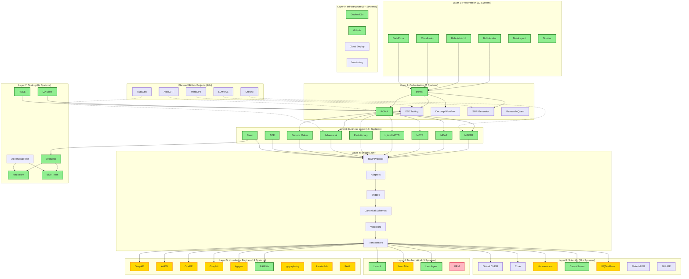

---

## Complete System Overview

### All 9 Major Categories

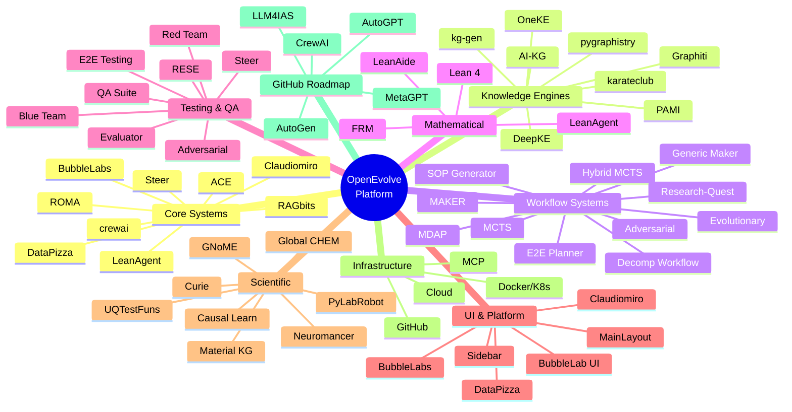

---

## Layer Architecture

### Layer 1: Presentation Layer

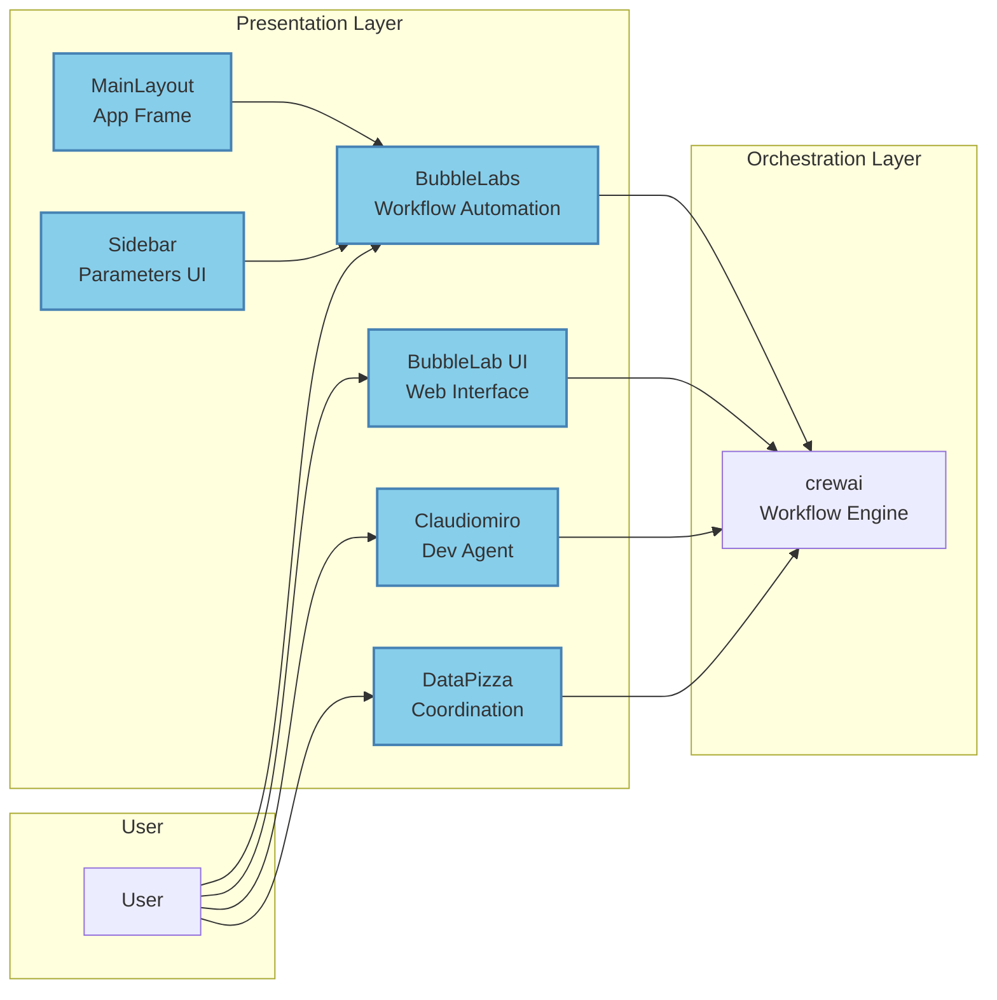

### Layer 2: Orchestration Layer

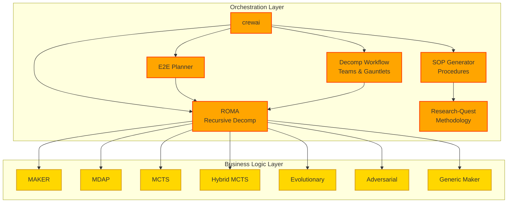

### Layer 3: Business Logic Layer

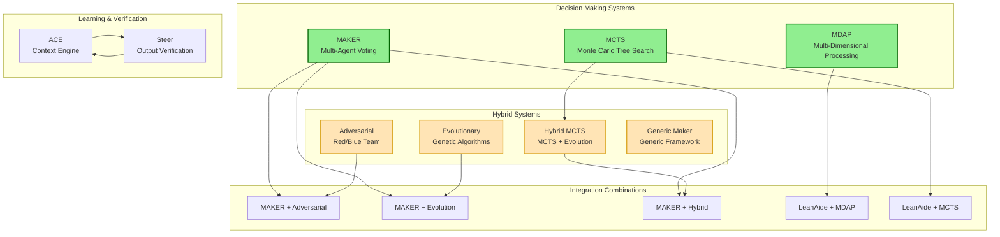

### Layer 4: Bridge Layer

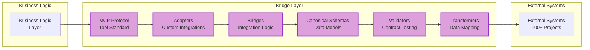

---

## Integration Categories

### Category 1: Core Integrated Systems (9 Systems) ✅

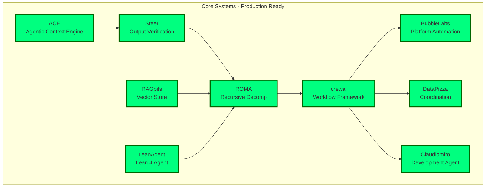

### Category 2: Knowledge Engine & AI Frameworks (19 Systems)

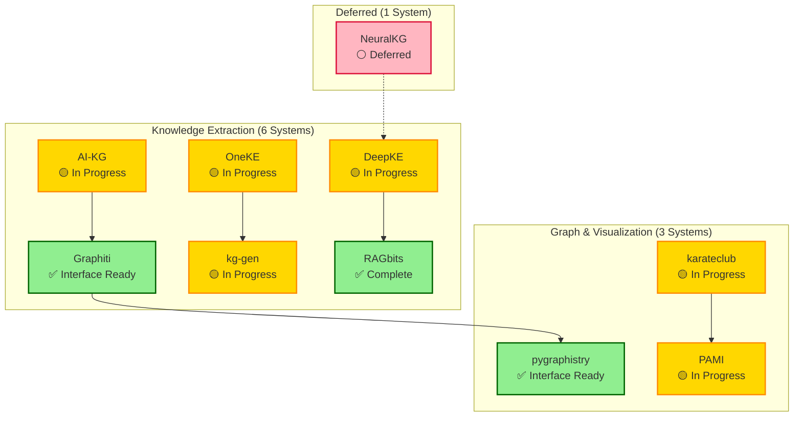

### Category 3: Decomposition & Workflow Systems (15+ Systems)

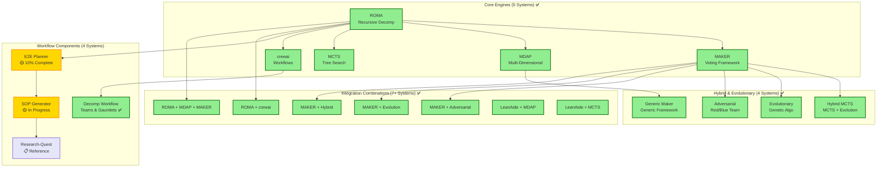

### Category 4: Mathematical & Formal Verification (5 Systems)

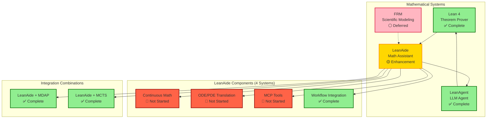

### Category 5: Testing & Quality Assurance (8+ Systems)

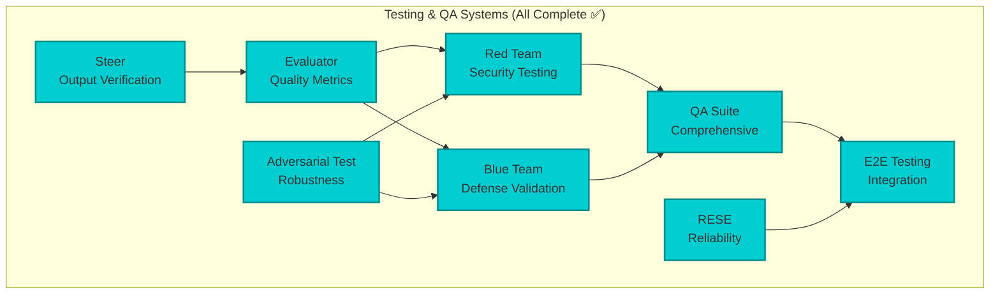

### Category 6: UI & Platform Integrations (12 Systems)

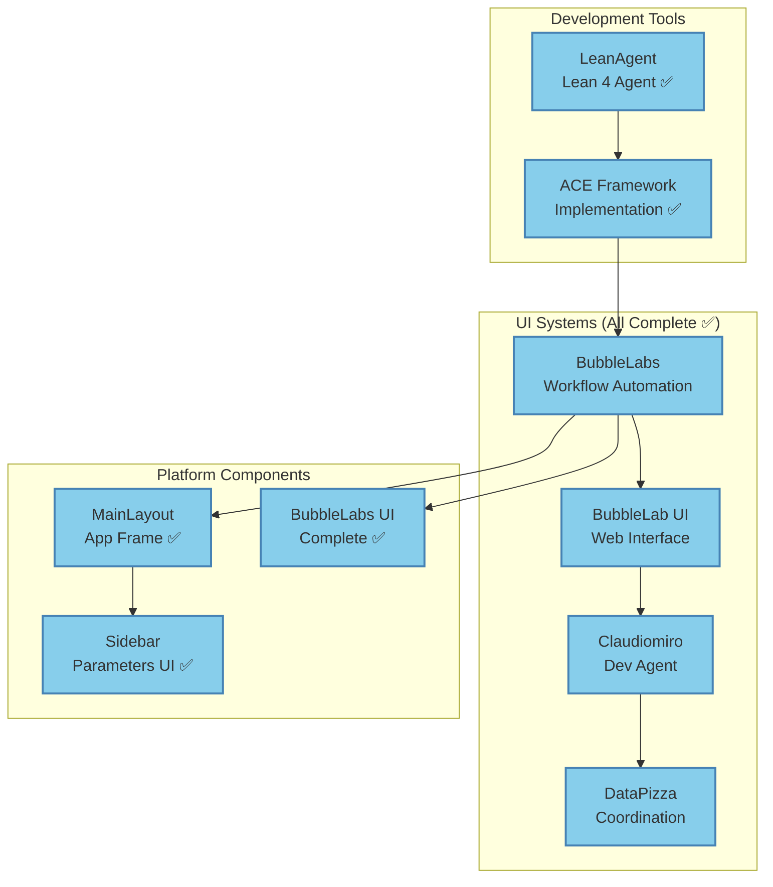

### Category 7: Scientific & Domain-Specific (12+ Systems)

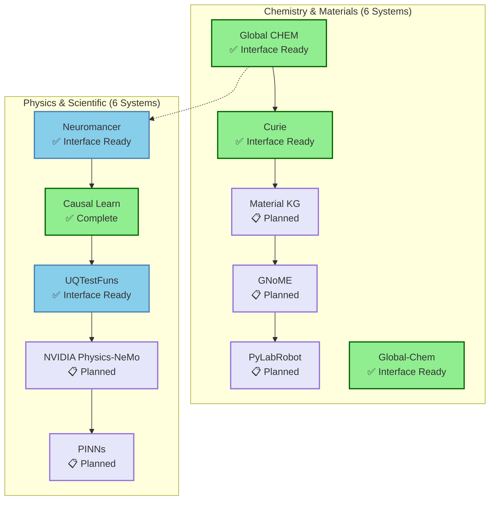

### Category 8: Infrastructure & Services (6+ Systems)

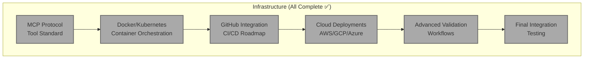

### Category 9: GitHub Projects Roadmap (20+ Projects)

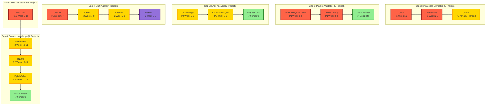

---

## Data Flow Diagrams

### Complete Request Flow

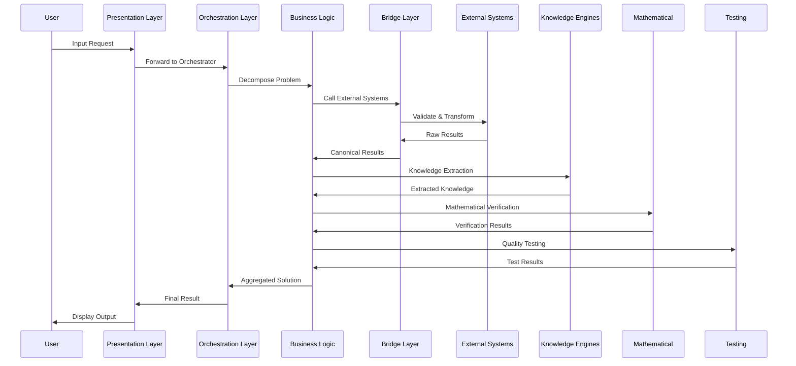

### Knowledge Extraction Flow

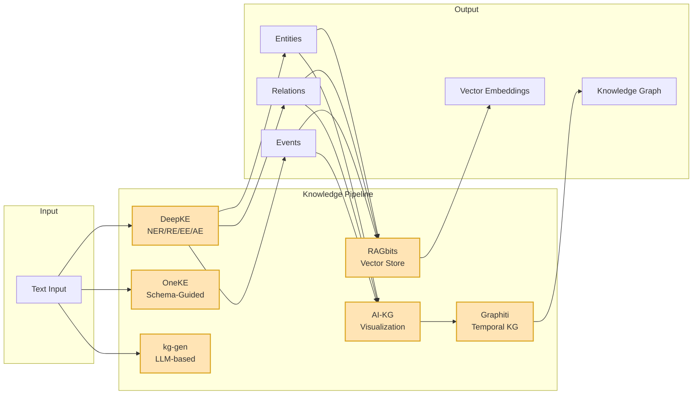

### Workflow Orchestration Flow

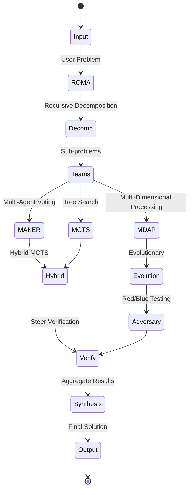

---

## Component Interactions

### ROMA + MAKER + MDAP Integration

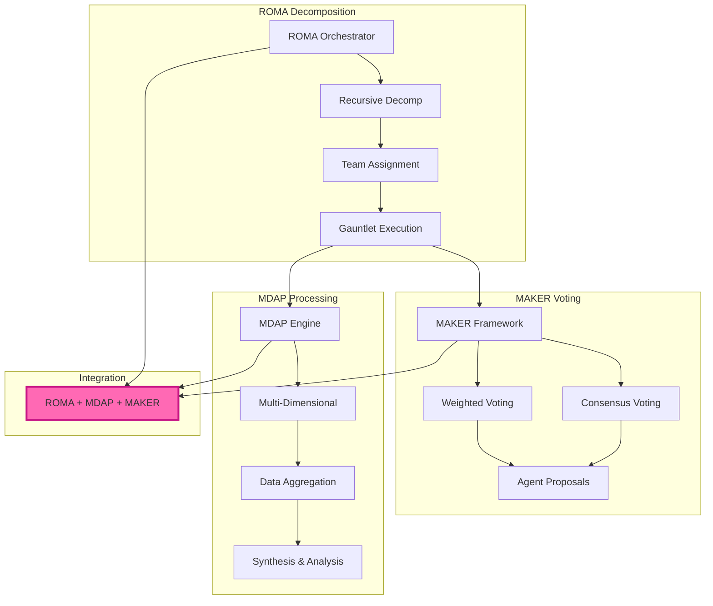

### Lean 4 + LeanAide Integration

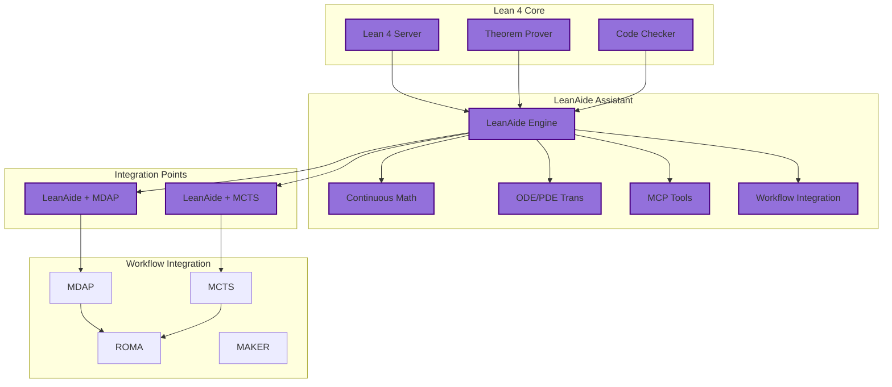

---

## Workflow Orchestration

### crewai Workflow State Machine

```mermaid
stateDiagram-v2
    [*] --> Created: Workflow Definition

    Created --> Validating: Validate Schema
    Validating --> Ready: Schema Valid

    Validating --> Failed: Validation Error
    Failed --> [*]: Terminate

    Ready --> Running: Start Execution

    Running --> InProgress: Step 1: Decomposition
    InProgress --> InProgress: Step 2: Team Assignment
    InProgress --> InProgress: Step 3: Gauntlet Execution
    InProgress --> InProgress: Step 4: Aggregation

    Running --> Paused: User Pause
    Paused --> Running: Resume

    Running --> Failed: Error Occurred
    Failed --> Running: Retry
    Failed --> [*]: Max Retries

    InProgress --> Completed: All Steps Done
    Completed --> [*]: Return Result
```

### ROMA Recursive Decomposition

```mermaid
graph TB
    subgraph "ROMA Recursive Decomposition"
        P[Original Problem]
        D1[Decomposition Level 1]
        D2[Decomposition Level 2]
        D3[Decomposition Level N]
    end

    subgraph "Team Assignment"
        T1[Team 1]
        T2[Team 2]
        TN[Team N]
    end

    subgraph "Gauntlet Execution"
        G1[Gauntlet 1]
        G2[Gauntlet 2]
        GN[Gauntlet N]
    end

    subgraph "Result Synthesis"
        R1[Result 1]
        R2[Result 2]
        RN[Result N]
        FS[Final Synthesis]
    end

    P --> D1
    D1 --> D2
    D2 --> D3

    D1 --> T1
    D2 --> T2
    D3 --> TN

    T1 --> G1
    T2 --> G2
    TN --> GN

    G1 --> R1
    G2 --> R2
    GN --> RN

    R1 --> FS
    R2 --> FS
    RN --> FS
```

---

## Knowledge Engine Architecture

### Complete Knowledge Engine Integration

```mermaid
graph TB
    subgraph "Input Sources"
        DOC[Documents]
        WEB[Web Content]
        DB[Databases]
        API[APIs]
    end

    subgraph "Extraction Layer"
        DK[DeepKE<br/>NER/RE/EE/AE]
        OK[OneKE<br/>Schema-Guided]
        KG[kg-gen<br/>LLM-based]
    end

    subgraph "Storage Layer"
        GT[Graphiti<br/>Temporal KG]
        NEO[Neo4j<br/>Graph DB]
        RB[RAGbits<br/>Vector Store]
        CHR[ChromaDB<br/>Vectors]
    end

    subgraph "Processing Layer"
        PG[pygraphistry<br/>Visualization]
        KC[karateclub<br/>Graph ML]
        PM[PAMI<br/>Pattern Mining]
    end

    subgraph "Query Layer"
        QG[Query Graph]
        QV[Query Vectors]
        QK[Query Knowledge]
    end

    DOC --> DK
    WEB --> DK
    DB --> OK
    API --> KG

    DK --> GT
    DK --> NEO
    OK --> GT
    KG --> RB

    RB --> CHR
    GT --> NEO

    NEO --> PG
    GT --> PG
    NEO --> KC
    GT --> KC

    RB --> PM

    PG --> QG
    KC --> QG
    PM --> QK
    CHR --> QV

    classDef knowledgeStyle fill:#FFE4B5,stroke:#DAA520,stroke-width:2px
    class DK,OK,KG,GT,NEO,RB,CHR,PG,KC,PM knowledgeStyle
```

---

## Testing & QA Architecture

### Complete Testing Pipeline

```mermaid
graph TB
    subgraph "Input"
        S[System Output]
    end

    subgraph "Verification Layer"
        SR[Steer<br/>Compliance]
        EV[Evaluator<br/>Quality Metrics]
    end

    subgraph "Robustness Testing"
        AT[Adversarial<br/>Testing]
        RT[Red Team<br/>Security]
        BT[Blue Team<br/>Defense]
    end

    subgraph "Integration Testing"
        QA[QA Suite<br/>Comprehensive]
        E2E[E2E Testing<br/>End-to-End]
        RS[RESE<br/>Reliability]
    end

    subgraph "Output"
        VR[Verification Report]
        QR[Quality Report]
        RR[Robustness Report]
        IR[Integration Report]
    end

    S --> SR
    S --> EV

    SR --> AT
    EV --> AT

    AT --> RT
    AT --> BT

    SR --> QA
    EV --> QA

    QA --> E2E
    E2E --> RS

    SR --> VR
    EV --> QR
    RT --> RR
    BT --> RR
    E2E --> IR
    RS --> IR

    classDef testStyle fill:#00CED1,stroke:#008B8B,stroke-width:2px
    class SR,EV,AT,RT,BT,QA,E2E,RS testStyle
```

---

## Deployment Architecture

### Complete Deployment Stack

```mermaid
graph TB
    subgraph "Development"
        DEV[Local Machine]
        DC[Docker Compose]
        HS[Hot Reload]
    end

    subgraph "Staging"
        STG[Staging Cluster]
        K8S1[Kubernetes]
        NS1[Namespace: staging]
    end

    subgraph "Production"
        PRD[Production Cluster]
        K8S2[Kubernetes]
        NS2[Namespace: production]
        HPA[Horizontal Pod Autoscaling]
        AZ[Multiple Availability Zones]
        BGD[Blue-Green Deployment]
    end

    subgraph "CI/CD Pipeline"
        GH[GitHub Push]
        GA[GitHub Actions<br/>CI]
        DI[Docker Build]
        RG[Push to Registry]
        HC[Helm Chart Update]
        AR[ArgoCD Sync<br/>CD]
        KD[K8s Deployment]
        HC2[Health Checks]
        TS[Traffic Switch]
    end

    DEV --> DC
    DC --> HS

    STG --> K8S1
    K8S1 --> NS1

    PRD --> K8S2
    K8S2 --> NS2
    NS2 --> HPA
    HPA --> AZ
    AZ --> BGD

    GH --> GA
    GA --> DI
    DI --> RG
    RG --> HC
    HC --> AR
    AR --> KD
    KD --> HC2
    HC2 --> TS

    classDef devStyle fill:#90EE90,stroke:#006400,stroke-width:2px
    class DEV,DC,HS devStyle

    classDef stageStyle fill:#FFD700,stroke:#FF8C00,stroke-width:2px
    class STG,K8S1,NS1 stageStyle

    classDef prodStyle fill:#FF6347,stroke:#8B0000,stroke-width:2px
    class PRD,K8S2,NS2,HPA,AZ,BGD prodStyle
```

---

## Security Architecture

### Complete Security Stack

```mermaid
graph TB
    subgraph "Authentication"
        OIDC[OIDC Provider<br/>Primary]
        OAUTH[OAuth2-Proxy<br/>Fallback]
        HEAD[X-Remote-User<br/>Headers]
        SHAD[Shadow Account<br/>Sync]
    end

    subgraph "Authorization"
        RBAC[Role-Based<br/>Access Control]
        POL[Policy Engine]
        ATTR[Attribute-Based<br/>Access Control]
    end

    subgraph "Data Security"
        TLS[TLS Encryption<br/>All Traffic]
    ENC[Encrypted Storage<br/>Secrets Mgmt]
        ENV[Environment-based<br/>Config]
    end

    subgraph "Security Testing"
        RT[Red Team<br/>Attack]
        BT[Blue Team<br/>Defend]
        ADV[Adversarial<br/>Testing]
        PEN[Penetration<br/>Testing]
    end

    subgraph "Audit & Compliance"
        LOG[Structured Logs<br/>JSON Lines]
        TRACE[Audit Trail<br/>Correlation IDs]
        MON[Monitoring &<br/>Alerting]
    end

    OIDC --> RBAC
    OAUTH --> HEAD
    HEAD --> SHAD

    RBAC --> POL
    POL --> ATTR

    TLS --> ENC
    ENC --> ENV

    RT --> ADV
    BT --> ADV
    ADV --> PEN

    LOG --> TRACE
    TRACE --> MON

    classDef securityStyle fill:#DC143C,stroke:#8B0000,stroke-width:2px
    class OIDC,OAUTH,HEAD,SHAD,RBC,POL,ATTR,TLS,ENC,ENV,RT,BT,ADV,PEN,LOG,TRACE,MON securityStyle
```

---

## Integration Dependencies

### Critical Path Dependencies

```mermaid
graph TB
    subgraph "Phase 1: Stage 6 (P0)"
        P1[Stage 6 Knowledge Extraction<br/>12-15 weeks]
    end

    subgraph "Phase 2: LeanAide (P1)"
        P2[LeanAide Enhancement<br/>2-3 weeks]
    end

    subgraph "Phase 3: DeepKE+AI-KG (P2)"
        P3[DeepKE + AI-KG<br/>3 weeks]
    end

    subgraph "Phase 4: SOP+Research (P2.5)"
        P4[SOP Generator + Research-Quest<br/>3-4 weeks]
    end

    subgraph "Phase 5: E2E Planner (P1.5)"
        P5[E2E Invention Planner<br/>17-24 days]
    end

    subgraph "Phase 6: FRM (P5)"
        P6[FRM Reassessment<br/>Deferred]
    end

    P1 --> P5
    P2 --> P5
    P4 --> P5

    P1 -.-> P3
    P2 -.-> P6
    P1 -.-> P6

    P3 -.-> P1

    classDef criticalStyle fill:#FF6347,stroke:#8B0000,stroke-width:3px
    class P1,P2,P3,P4,P5,P6 criticalStyle
```

### Dependency Matrix

```mermaid
graph LR
    subgraph "No Dependencies"
        P1[Stage 6]
        P2[LeanAide]
        P4[SOP Generator]
    end

    subgraph "Depends On Stage 6"
        P3[DeepKE+AI-KG]
    end

    subgraph "Depends On Multiple"
        P5[E2E Planner]
    end

    subgraph "Deferred"
        P6[FRM]
    end

    P1 -.-> P3
    P2 -.-> P5
    P4 -.-> P5
    P3 -.-> P5

    P1 -.-> P6
    P2 -.-> P6

    classDef completeStyle fill:#90EE90,stroke:#006400,stroke-width:2px
    class P1,P2,P4 completeStyle

    classDef progressStyle fill:#FFD700,stroke:#FF8C00,stroke-width:2px
    class P3,P5 progressStyle

    classDef deferredStyle fill:#FFB6C1,stroke:#DC143C,stroke-width:2px
    class P6 deferredStyle
```

---

**Document Version:** 2.0
**Last Updated:** 2026-01-02
**Total Diagrams:** 20+
**Coverage:** All 100+ integrations across 116 documents
**Maintained By:** OpenEvolve Architecture Team

For detailed integration information, see:
- `MASTER_INTEGRATIONS_GUIDE.md` - Complete integration registry
- `COMPREHENSIVE_INTEGRATION_ARCHITECTURE.md` - Detailed architecture documentation

