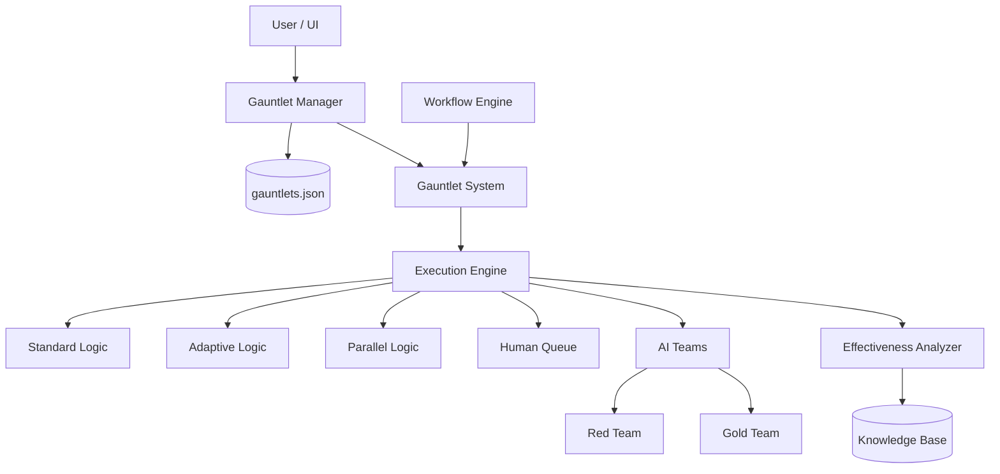
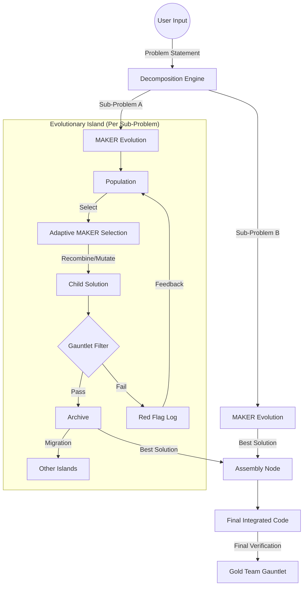
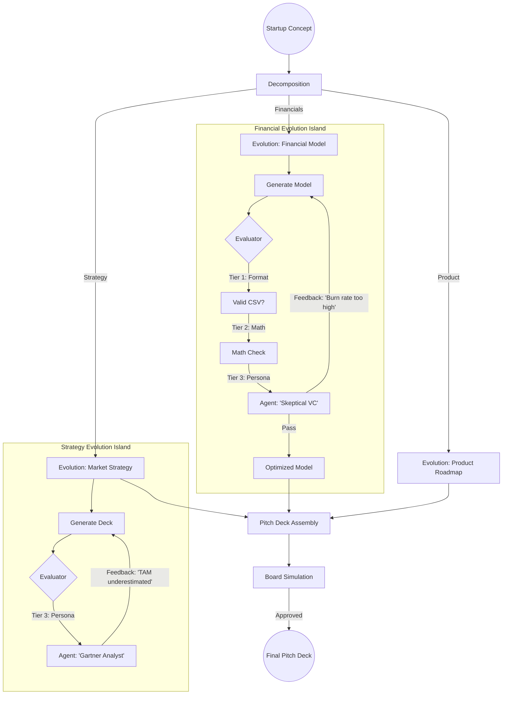
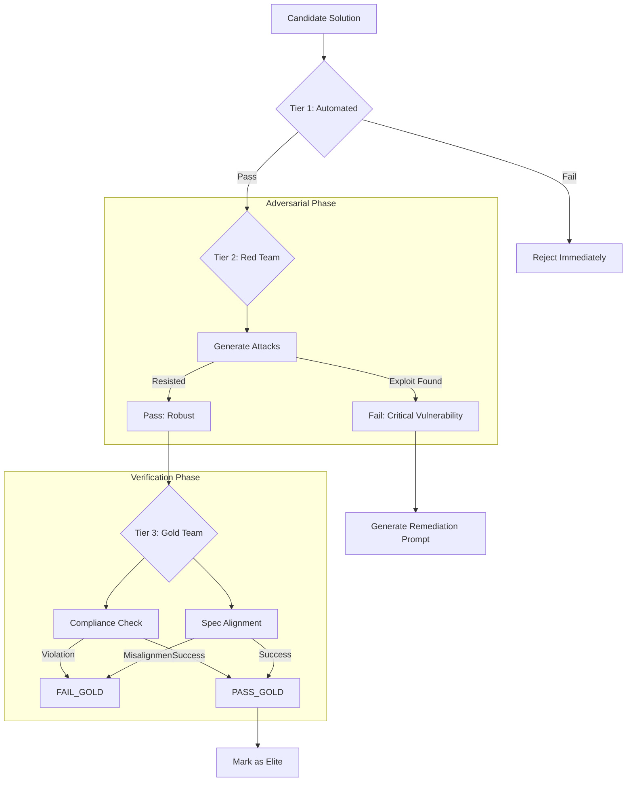

# OpenEvolve Gauntlet System: The Complete Reference

**Version:** 2.0
**Status:** Production Ready
**Scope:** Architecture, Configuration, Execution, and Analytics

---

## 1. Executive Summary

The **OpenEvolve Gauntlet System** is a sovereign-grade, programmable quality assurance framework designed to solve the "Intractable Problem" of validating generative AI outputs. Unlike traditional unit tests (which check syntax) or simple LLM evaluations (which are often superficial), the Gauntlet System treats validation as a **multi-agent adversarial process**.

It is built on the premise that **rigor must be programmable**. A "code quality" check differs fundamentally from a "security audit," and the Gauntlet System allows developers to define these differences through granular rules, multi-round workflows, and specialized AI teams.

### 1.1 Core Philosophy: "Zero Trust" Generation
The system operates on a Zero Trust model regarding AI generation.
1.  **Trust Nothing:** Every output (solution, plan, critique) is assumed flawed until verified.
2.  **Verify Everything:** Verification is not a single step; it is a *gauntlet* of challenges.
3.  **Adversarial by Design:** We employ "Red Teams" whose explicit goal is to break the solution, ensuring only robust outputs survive.
4.  **Adaptive Rigor:** The system increases scrutiny for complex or borderline solutions dynamically.

### 1.2 Key Capabilities
*   **Multi-Modal Evaluation:** Supports Red Team (Attack), Gold Team (Verify), Blue Team (Peer Review), and Automated (Code/Test) evaluation rounds.
*   **Dynamic Adaptation:** Automatically adjusts difficulty (strictness, number of rounds) based on real-time performance metrics.
*   **High-Throughput Parallelism:** Executes independent validation rounds concurrently to minimize latency without sacrificing depth.
*   **Human-in-the-Loop:** Seamlessly integrates human approval gates within automated workflows.
*   **Self-Healing Feedback:** Generates actionable, structured feedback that feeds directly back into the Solver agents for refinement.

---

## 2. System Architecture

The Gauntlet System is composed of four distinct layers, separating definition, management, execution, and analysis.



### 2.1 The Definition Layer (`workflow_structures.py`)
This layer defines the data models that structure a Gauntlet. These are the blueprints.

#### 2.1.1 `GauntletDefinition`
The master configuration object.

| Field | Type | Required | Description |
| :--- | :--- | :--- | :--- |
| `gauntlet_id` | `str` | Yes | Unique immutable identifier (e.g., `security_audit_v1`). |
| `name` | `str` | Yes | Human-readable display name. |
| `team_name` | `str` | Yes | The ID of the Team responsible for executing this gauntlet. |
| `rounds` | `List[GauntletRoundRule]` | Yes | Ordered list of validation steps. |
| `gauntlet_type` | `str` | No | Execution strategy: `standard`, `adaptive`, `hierarchical`, `competitive`, `collaborative`. Default: `standard`. |
| `description` | `str` | No | Detailed intent of the validation process. |
| `stop_on_first_failure` | `bool` | No | If `True`, execution halts immediately upon any round failure (Fail Fast). Default: `False`. |
| `require_all_rounds` | `bool` | No | If `True`, result is only valid if all rounds complete. |
| `attack_modes` | `List[str]` | No | (Red Team) Specific attack vectors (e.g., "SQL Injection", "Social Engineering"). |
| `red_flags` | `Dict[str, Any]` | No | Passive rejection criteria (e.g., `max_token_length`, `forbidden_phrases`). |
| `formal_verification_enabled` | `bool` | No | Enables Lean 4 mathematical verification integration. |

#### 2.1.2 `GauntletRoundRule`
The configuration for a single step within the Gauntlet.

| Field | Type | Description |
| :--- | :--- | :--- |
| `rule_id` | `str` | Unique ID for this specific rule/round. |
| `round_number` | `int` | Sequence order (1-based index). |
| `rule_type` | `str` | The nature of the check: `red_team`, `gold_team`, `automated`, `human`. |
| `evaluation_prompt` | `str` | **Crucial:** The specific instructions given to the AI judge for this round. |
| `min_score` | `float` | Threshold (0.0 - 1.0) required to pass. |
| `voting_strategy` | `str` | Consensus mechanism: `fixed_quorum` (requires N votes) or `first_to_ahead_by_k` (statistical confidence). |
| `quorum_required_approvals` | `int` | For `fixed_quorum`: Number of judges that must approve. |
| `margin_k` | `int` | For `first_to_ahead_by_k`: The lead required for a decision. |
| `can_fail_gracefully` | `bool` | If `True`, failure in this round counts against the score but does not abort the gauntlet. |
| `retry_on_failure` | `bool` | If `True`, the system will attempt this round again (up to `max_attempts`) before failing. |
| `success_criteria` | `List[str]` | Explicit checklist items the judge must verify. |

### 2.2 The Management Layer (`gauntlet_manager.py`)
Responsible for the lifecycle of Gauntlet definitions.

*   **Persistence:** Loads/Saves definitions to `gauntlets.json`.
*   **CRUD:** Methods for `create_gauntlet`, `get_gauntlet`, `update_gauntlet`, `delete_gauntlet`.
*   **Adaptation:** Contains logic (`adapt_gauntlet_with_openevolve`) to use the OpenEvolve LLM to rewrite and optimize Gauntlet definitions based on performance data.
*   **Metrics Tracking:** Aggregates high-level usage statistics (runs, pass rate) into the definition metadata.

### 2.3 The Execution Layer (`formal_gauntlet_system.py`)
The heavy lifting engine. It takes a definition + content and produces a result.

*   **State Management:** Creates and maintains `GauntletExecution` objects to track progress.
*   **Router:** Dispatches to the correct logic (`_execute_sequential`, `_execute_parallel`, etc.) based on `gauntlet_type`.
*   **Prompt Engineering:** Dynamically constructs prompts for Red/Gold teams, injecting the specific `evaluation_prompt` and `success_criteria` from the rule.
*   **Parsing:** robustly parses AI outputs (JSON, YAML, or structured text) into standardized `CritiqueReport` or `VerificationReport` objects.

### 2.4 The Analytics Layer (`gauntlet_effectiveness_analyzer.py`)
Closes the loop by analyzing how well Gauntlets work.

*   **Catch Rate:** Measures how often a Gauntlet catches known bad solutions.
*   **False Positive Rate:** Measures how often valid solutions are rejected.
*   **Rule Effectiveness:** Identifies which specific `GauntletRoundRule` contributes most to the final decision.
*   **Optimization:** `recommend_optimal_configuration()` suggests removing redundant rules or tightening loose ones.

### 2.5 System File Map
A comprehensive listing of the physical files that constitute the Gauntlet System.

| File Path | Component | Description |
| :--- | :--- | :--- |
| `formal_gauntlet_system.py` | **Core Engine** | The main orchestration logic. Handles round execution, scoring, and state management. |
| `workflow_structures.py` | **Data Models** | Defines `GauntletDefinition`, `GauntletRoundRule`, `GauntletExecution` classes. |
| `gauntlet_manager.py` | **Persistence** | CRUD operations for Gauntlets. Manages `gauntlets.json`. |
| `gauntlet_effectiveness_analyzer.py` | **Analytics** | Calculates Catch Rate, False Positive Rate, and optimizes rules. |
| `dynamic_gauntlet_adaptation.py` | **Adaptation** | Logic for real-time difficulty adjustment and rule evolution. |
| `sovereign_gauntlets.py` | **Pre-Built** | Specialized gauntlets for Decomposition (Coherence, Completeness, etc.). |
| `gauntlet_server.py` | **API** | FastAPI implementation exposing the system over HTTP. |
| `gauntlets.json` | **Database** | JSON storage for all active Gauntlet definitions. |
| `gauntlet_decomposition_integration.py` | **Mixin** | Utilities to attach Gauntlets to the Decomposition Engine. |
| `ui_components.py` | **Frontend** | BubbleLab UI UI components for the Gauntlet Designer/Runner. |

---

## 3. Execution Strategies (Deep Dive)

The system supports five distinct execution modes, each tailored for different stages of the lifecycle.

### 3.1 Standard Execution (`execution_order="sequential"`)
The default mode. Rounds are executed strictly in order (1, 2, 3...).
1.  **System** retrieves Round 1 rule.
2.  **System** constructs prompt for the assigned Team.
3.  **Team** evaluates content.
4.  **System** parses result.
    *   **Pass:** Move to Round 2.
    *   **Fail:**
        *   If `retry_on_failure` is True: Retry N times.
        *   If `can_fail_gracefully` is True: Log failure, decrement score, move to Round 2.
        *   If `stop_on_first_failure` is True: **ABORT GAUNTLET**.
        *   Else: Log failure, move to Round 2.
5.  **Final Score:** `rounds_passed / total_rounds`.

### 3.2 Adaptive Execution (`execution_order="adaptive"`)
Designed for efficiency. It adjusts difficulty based on the *initial* rounds.

**The Algorithm:**
1.  Execute "Initial Phase" rounds (usually a quick sanity check).
2.  Calculate `initial_score`.
3.  **Decision Logic:**
    *   **Case A: High Competence (Score > 0.9 & Pass Rate > 95%)**
        *   *Action:* **Increase Difficulty**.
        *   *Mechanism:* Triggers `_create_adaptive_rounds(phase="harder")`.
        *   *Effect:* Adds rounds with `min_score + 0.1` and appends "Apply STRICT scrutiny" to prompts.
    *   **Case B: Struggling (Score < 0.6 & Pass Rate < 70%)**
        *   *Action:* **Decrease Difficulty / Remediation**.
        *   *Mechanism:* Triggers `_create_adaptive_rounds(phase="easier")`.
        *   *Effect:* Lowers `min_score - 0.1`, adds +1 retry attempt, and appends "Be CONSTRUCTIVE/Provide Guidance" to prompts.
    *   **Case C: Borderline (Score 0.7 - 0.85)**
        *   *Action:* **Add Scrutiny**.
        *   *Mechanism:* Triggers `_create_adaptive_rounds(phase="scrutiny")`.
        *   *Effect:* Injects a specialized "Tie-Breaker" Red Team round focused on edge cases.

### 3.3 Parallel Execution (`execution_order="parallel"`)
Optimized for throughput.
1.  **System** identifies all rounds.
2.  **System** spins up a `ThreadPoolExecutor` with `max_parallel_workers` (default 4).
3.  **Execution:** All rounds run simultaneously.
4.  **Aggregation:** A thread-safe lock collects results as they finish.
5.  **Constraint:** `stop_on_first_failure` is less effective here, as other rounds may complete before the kill signal processes.

### 3.4 Hierarchical Execution (`execution_order="hierarchical"`)
Optimized for token cost ("Fail Fast").
1.  **Tier 1 (Smoke Test):** Cheap, fast automated checks.
    *   *If Fail:* Reject immediately. Cost: Low.
2.  **Tier 2 (Logic Check):** Standard LLM evaluation.
    *   *If Fail:* Reject. Cost: Medium.
3.  **Tier 3 (Deep Dive):** Expensive Red Team adversarial attack or Human Review.
    *   *Only reached if Tiers 1 & 2 pass.*

### 3.5 Human-in-the-Loop (`rule_type="human"`)
Integrates manual oversight.
*   **Queueing:** Creates a `HumanReviewItem` in the `HumanReviewQueue`.
*   **State Machine:** `PENDING` -> `IN_PROGRESS` -> `APPROVED`/`REJECTED`.
*   **Modes:**
    *   **Blocking:** The system polls the queue until a timeout (`review_timeout_seconds`) is reached.
    *   **Async:** The system returns a "Pending" status, allowing the workflow to pause/serialize state.

---

## 4. Specialized "Sovereign" Gauntlets

Beyond the general-purpose execution engine, the system includes pre-built, specialized implementations for validating **Decomposition Plans** (`sovereign_gauntlets.py`).

### 4.1 Coherence Gauntlet
*   **Goal:** Verifies that the plan makes logical sense.
*   **Checks:**
    *   Are the sub-problems mutually exclusive?
    *   Do they collectively exhaust the problem space (MECE)?
    *   Is the flow logical?

### 4.2 Completeness Gauntlet
*   **Goal:** Verifies alignment with the user's prompt.
*   **Checks:**
    *   Does the plan address *every* requirement in the original request?
    *   Are there missing constraints?
    *   Are edge cases handled?

### 4.3 Feasibility Gauntlet
*   **Goal:** Verifies resource and technical constraints.
*   **Checks:**
    *   Is each sub-problem technically solvable?
    *   Are the resource estimates (time/tokens) realistic?
    *   Does the plan rely on non-existent capabilities?

### 4.4 Dependency Gauntlet
*   **Goal:** Validates the Directed Acyclic Graph (DAG).
*   **Checks:**
    *   Are there circular dependencies (A -> B -> A)?
    *   Are prerequisites correctly ordered?
    *   Can parallel branches genuinely run in parallel?

---

## 5. Analytics & Optimization Details

The `GauntletEffectivenessAnalyzer` transforms raw logs into optimization intelligence.

### 5.1 Metrics Calculation
*   **Catch Rate ($CR$):**
    $$CR = \frac{\text{Issues Caught}}{\text{Total Checks}}$$
    *   *Interpretation:* A low catch rate implies the Gauntlet is too lenient or irrelevant.
*   **False Positive Rate ($FPR$):**
    $$FPR = \frac{\text{False Positives}}{\text{Total Checks}}$$
    *   *Interpretation:* A high FPR implies the Gauntlet is too strict or "hallucinating" flaws.
*   **Effectiveness Score ($ES$):**
    $$ES = CR - (FPR \times 0.5)$$
    *   *Interpretation:* A composite metric where false positives are penalized (but less than missing a real bug).

### 5.2 A/B Testing
The system can run two gauntlet configurations against the same inputs to determine the superior one.
*   **Function:** `ab_test_gauntlets(gauntlet_a_id, gauntlet_b_id)`
*   **Logic:** Compares $ES$ of both. If difference > 10%, declares a winner.

### 5.3 Optimization Recommendations
The `recommend_optimal_configuration` method analyzes rule-level data:
*   **Disable Rule:** If rule effectiveness < 0.3.
*   **Tune Rule:** If rule effectiveness is between 0.3 and 0.7.
*   **Keep/Prioritize:** If rule effectiveness > 0.7.

---

## 6. Integration Guide

### 6.1 Integrating with Decomposition
To add Gauntlet validation to a decomposition flow, use the `GauntletDecompositionMixin`.

```python
from gauntlet_decomposition_integration import GauntletDecompositionMixin
from decomposition_engine import DecompositionEngine

class EnhancedDecompositionEngine(GauntletDecompositionMixin, DecompositionEngine):
    pass

engine = EnhancedDecompositionEngine(...)

# 1. Decompose with automatic gauntlet assignment
plan = engine.decompose_with_gauntlets(
    problem,
    use_gauntlets=True,
    gauntlet_template="security" # Assigns "Security Gauntlet" to all sub-problems
)

# 2. Execute validation on a solution
result = engine.execute_solution_gauntlets(
    solution=my_solution,
    gauntlet_assignment=sub_problem.ai_suggested_gauntlet_assignment
)
```

### 6.2 Using the API (REST)
The system exposes a REST API via `api/gauntlets.py`.

*   **Create Gauntlet:** `POST /api/gauntlets`
    *   Body: `GauntletCreate` schema.
*   **Run Gauntlet:** `POST /api/gauntlets/run`
    *   Body: `{"gauntlet_name": "...", "content": "..."}`
*   **Get Effectiveness:** `GET /api/gauntlets/{id}/effectiveness`

### 6.3 Using the BubbleLab UI UI
The `render_gauntlet_designer()` function in `ui_components.py` provides a full visual IDE.
1.  **Team Selection:** Dropdown filters valid Teams (Red/Gold).
2.  **Round Builder:** Dynamic form to add/remove rounds.
3.  **Strategy Config:** Sliders for `min_score`, inputs for `evaluation_prompt`.
4.  **Test Runner:** Button to execute against sample text immediately.

---

## 7. Cookbook: Common Configurations

### 7.1 "The Ironclad" (High Security)
*   **Type:** Sequential
*   **Team:** Red-Team-Sec
*   **Rounds:**
    1.  **Automated:** SAST Scan (Static Analysis).
    2.  **Red Team:** "Inject SQL, XSS, and buffer overflow attempts." (`min_score=0.9`)
    3.  **Gold Team:** "Verify compliance with OWASP Top 10." (`min_score=0.95`)
*   **Config:** `stop_on_first_failure=True`, `retry_on_failure=False`.

### 7.2 "The Polisher" (Refinement)
*   **Type:** Collaborative
*   **Team:** Blue-Team-Peer
*   **Rounds:**
    1.  **Blue Team:** "Suggest style improvements." (`can_fail_gracefully=True`)
    2.  **Blue Team:** "Optimize variable naming."
    3.  **Blue Team:** "Generate docstrings."
*   **Config:** `stop_on_first_failure=False`, `gauntlet_config={"max_iterations": 3}`.

### 7.3 "The Gatekeeper" (Human Approval)
*   **Type:** Standard
*   **Team:** Gold-Team-QA
*   **Rounds:**
    1.  **Automated:** Unit Tests.
    2.  **Gold Team:** "Verify Logic."
    3.  **Human:** "Final Production Sign-off." (`rule_type="human"`)

---

## 8. Troubleshooting & FAQ

### 8.1 Common Errors

**Error:** `RuntimeError: OpenEvolve client not available`
*   **Cause:** The system cannot connect to the LLM provider to execute the Judge agents.
*   **Fix:** Ensure `OPENEVOLVE_API_KEY` is set in the environment. The system will fall back to "Mock" execution if unavailable, but results will be dummy data.

**Error:** `ValueError: Invalid gauntlet definition`
*   **Cause:** Validation failure during creation.
*   **Fix:** Check constraints: `min_score` must be 0-1, `team_name` must exist in TeamManager, `rounds` list cannot be empty.

**Error:** Adaptive Gauntlet not adapting.
*   **Cause:** Scores are falling in the "Average" range (0.6 - 0.9).
*   **Fix:** Adaptation only triggers at extremes. To force adaptation for testing, manually set `gauntlet_system.adaptive_metrics.current_difficulty_multiplier` or adjust the hardcoded thresholds in `formal_gauntlet_system.py`.

### 8.2 Thread Safety
The Gauntlet System is thread-safe.
*   **`HumanReviewQueue`**: Uses `threading.Lock` for all enqueue/assign/complete operations.
*   **`GauntletSystem`**: Uses `_execution_lock` for shared state updates during parallel execution.
*   **Persistence**: `GauntletManager` handles file I/O atomically (mostly) but file locking is recommended for high-concurrency environments.

### 8.3 Performance Tips
*   **Use Parallel:** For Gauntlets with 3+ independent rounds (e.g., Style + Security + Performance), always use `execution_order="parallel"` to reduce latency by ~60%.
*   **Use Hierarchical:** If you have expensive checks (GPT-4), gate them behind cheap checks (GPT-3.5) using the Hierarchical mode.
*   **Cache Results:** The system does *not* cache execution results by default. Implement caching at the `WorkflowEngine` level if re-running identical content.

---

## 9. Appendix: Full Data Model Reference

### 9.1 GauntletRoundRule Fields

| Field | Default | Usage |
| :--- | :--- | :--- |
| `rule_id` | Required | Internal tracking ID. |
| `round_number` | Required | Sorting order. |
| `rule_type` | Required | Defines the executor (`red_team`, `gold_team`, etc). |
| `description` | `""` | Human-readable intent. |
| `validation_type` | `quality` | Tag for analytics (`security`, `performance`, etc). |
| `min_score` | `0.0` | 0.0 to 1.0 pass threshold. |
| `max_attempts` | `1` | Retries allowed before hard fail. |
| `evaluator` | `""` | Specific agent persona ID (optional override of Team). |
| `evaluation_prompt` | Required | The "System Prompt" for the judge. |
| `success_criteria` | `[]` | List of items to check. |
| `is_required` | `True` | If False, failure doesn't stop the gauntlet. |
| `can_fail_gracefully` | `False` | If True, failure is recorded but execution continues. |
| `retry_on_failure` | `False` | Enables `max_attempts` logic. |
| `voting_strategy` | `fixed_quorum` | `fixed_quorum` or `first_to_ahead_by_k`. |
| `quorum_required` | `1` | Votes needed to pass (if fixed). |
| `margin_k` | `3` | Margin needed (if k-voting). |
| `metadata` | `{}` | Arbitrary extra data. |

### 9.2 GauntletExecution Fields

| Field | Description |
| :--- | :--- |
| `execution_id` | Unique run ID. |
| `gauntlet_definition` | Snapshot of the definition used (for reproducibility). |
| `sub_problem_id` | Context of execution. |
| `solution_attempt` | The content being evaluated. |
| `round_results` | List of detailed result dicts for each round. |
| `rounds_passed` | Count of passed rounds. |
| `rounds_failed` | Count of failed rounds. |
| `final_score` | Aggregated score (0.0 - 1.0). |
| `overall_passed` | Boolean final judgment. |
| `execution_duration` | Time in seconds. |
| `start_time` | Timestamp. |
| `end_time` | Timestamp. |

---

## 10. OpenEvolve Ecosystem Integration

The Gauntlet System is not an island; it is deeply woven into the OpenEvolve architecture.

### 10.1 The Mixin Pattern (`GauntletDecompositionMixin`)
The primary integration point is the `GauntletDecompositionMixin` class found in `gauntlet_decomposition_integration.py`. This mixin allows the `DecompositionEngine` to transparently acquire Gauntlet capabilities.

*   **Automatic Assignment:** The `decompose_with_gauntlets()` method wraps standard decomposition. After sub-problems are generated, it iterates through them and attaches a `GauntletDefinition` to the sub-problem's metadata.
*   **Metadata Persistence:** The full Gauntlet definition is serialized into `sub_problem.metadata['red_team_gauntlet_definition']`. This ensures that even if the Gauntlet Manager updates the global definition later, this specific problem instance retains the validation rules it was born with (provenance).

### 10.2 ROMA Engine & Robustness
For high-stakes validation, the system integrates with the **ROMA (Robust Open-ended Multi-Agent)** subsystem via `roma_mdap_maker_associative_integration.py`.

*   **Priority Execution:** In `_execute_red_team_round`, the system first attempts to use `self.roma_engine`.
*   **Confidence Scores:** The ROMA engine returns a `confidence` metric along with the validation result. This confidence score is appended to the feedback (e.g., `(Verified by ROMA Confidence: 0.92)`).
*   **Fallback Strategy:** If ROMA is unavailable or fails, the system gracefully degrades to the standard `openevolve_client`.

### 10.3 Agent Personas
The Gauntlet System leverages OpenEvolve's evolution modes to simulate different teams:

| Team | Implementation | Evolution Mode | Temperature | Intent |
| :--- | :--- | :--- | :--- | :--- |
| **Red Team** | `_execute_red_team_round` | `adversarial` | 0.7 | Break the solution. High creativity/entropy. |
| **Gold Team** | `_execute_gold_team_round` | `standard` | 0.3 | Verify the solution. Low noise, high precision. |

### 10.4 Feedback Loops
The integration ensures that feedback from a failed Gauntlet round is not lost.
1.  **Capture:** The `GauntletExecution` object captures the specific failure reasons (e.g., "SQL Injection found in login handler").
2.  **Route:** The `DecompositionEngine` reads this feedback.
3.  **Refine:** The engine triggers a **Solver Loop**, feeding the specific Red Team feedback back into the prompt for the next generation attempt: *"Previous attempt failed due to SQL Injection. Fix this specific issue."*

---

## 11. The Core Engine: MAKER-Enhanced Evolution

The Evolutionary Engine is the heartbeat of OpenEvolve. It moves beyond simple "prompt-and-pray" generation by implementing a rigorous, iterative **Genetic Algorithm (GA)** enhanced by Multi-Agent Knowledge-Enhanced Reasoning (MAKER). This system treats code generation not as a creative writing task, but as an optimization problem where "survival of the fittest" is determined by the Gauntlet.

### 11.1 The Philosophy: Search vs. Generation
Standard LLM usage is generative: asking a model to write code once. This fails for complex software because models often get stuck in local optima (good-looking but flawed code).
OpenEvolve uses **Evolutionary Search**:
*   **Population-Based:** We maintain diverse populations of potential solutions.
*   **Iterative Refinement:** Solutions are bred, mutated, and filtered over generations.
*   **Zero-Error Guarantee:** By using statistical voting (MAKER) and adversarial filtering (Gauntlet), we mathematically increase the probability of correctness with every generation.

### 11.2 Architecture: The Evolutionary Loop
The `MAKEREvolutionEngine` orchestrates the following lifecycle for every Sub-Problem:

1.  **Initialization (The Primordial Soup):**
    *   The engine generates an initial population ($N=20$) of diverse solutions.
    *   *Mechanism:* It uses high temperature ($T=1.0$) and distinct system prompts (e.g., "Optimize for speed", "Optimize for readability", "Optimize for safety") to ensure the starting gene pool is rich in variety.

2.  **Evaluation (The Gauntlet Filter):**
    *   Every individual in the population runs the **Gauntlet**.
    *   *Fitness Function:* `fitness = gauntlet.final_score`.
    *   *Red Flagging:* If a solution triggers a critical Red Team finding (e.g., security vulnerability), it is assigned `fitness = 0.0` and immediately culled, preventing it from reproducing.

3.  **Selection (MAKER Voting):**
    *   Instead of random tournament selection, we use **Adaptive MAKER Voting**.
    *   **The Problem:** Traditional GA relies on a scalar fitness score. Code is complex; a score of 0.8 doesn't tell the whole story.
    *   **The Solution:** A panel of "Judge Agents" reviews the top candidates. They vote on which parent is best suited to breed.
    *   **Adaptive Threshold ($k$):** The system calculates the complexity of the task.
        *   *Low Complexity:* $k=1$ (Simple majority wins).
        *   *High Complexity:* $k=3$ (Winner must be ahead by 3 votes). This ensures that for difficult problems, we only breed from indisputably superior parents.

4.  **Recombination (Crossover):**
    *   Two parent solutions are "mated".
    *   *Logic Splicing:* The LLM identifies functional blocks (functions, classes) in Parent A and Parent B. It synthesizes a child solution that attempts to combine the strengths of both (e.g., the efficient algorithm of Parent A with the error handling of Parent B).

5.  **Mutation (Adversarial Refinement):**
    *   Child solutions undergo mutation based on `mutation_rate`.
    *   *Directed Mutation:* Unlike random bit-flipping in biological GA, our mutation is semantic. The engine looks at the Gauntlet feedback from the *parents* (e.g., "Parent A failed edge case X") and specifically mutates the child to address that weakness.

### 11.3 Advanced Capabilities

#### 11.3.1 The Island Model
To prevent premature convergence (where the whole population becomes identical clones of a mediocre solution), the engine uses an **Island Model**.
*   **Islands:** The population is split into independent sub-populations (Islands), typically 5.
*   **Isolation:** Evolution happens independently on each island. Island 1 might evolve towards a Recursive solution, while Island 2 evolves an Iterative one.
*   **Migration:** Every `migration_interval` generations, the top 10% (Elites) of Island A migrate to Island B. This injects "superior genetics" into different evolutionary paths, often triggering breakthroughs.

#### 11.3.2 MDAP Decomposition
Complex problems are not evolved as a monolith. The **MDAP (Multi-Domain Agent Planning)** engine breaks the problem into a dependency graph.
*   *Example:* "Build a Chat App".
*   *Decomposition:*
    1.  Evolve `DatabaseSchema`.
    2.  Evolve `AuthSystem` (depends on 1).
    3.  Evolve `MessageAPI` (depends on 1, 2).
*   *Execution:* Each node in the graph runs its own isolated Evolutionary Loop. The final product is assembled from the "Winner" of each node's evolution.

#### 11.3.3 Adaptive Resource Allocation
The system monitors the "Diversity" of the population (using Semantic Embedding distance).
*   **High Diversity:** Evolution is exploring well. Keep resources steady.
*   **Low Diversity (Stagnation):** The system detects a "collapse". It automatically:
    *   Increases `temperature`.
    *   Injects radically different "Mutant" individuals.
    *   Spins up a new Island with a contrary prompt strategy.

### 11.4 Integration Points
*   **Input:** Receives `SubProblem` from the Decomposition Engine.
*   **Output:** Returns a `SolutionAttempt` that has survived the Gauntlet.
*   **Configuration:** Controlled via `MakerevolutionConfig` (population size, islands, voting threshold).
*   **Visualization:** The BubbleLab UI (Section 12) visualizes the fitness landscape in real-time, showing the trajectory of each Island.

---

## 12. BubbleLab Visual Integration

The Gauntlet System is natively accessible via **BubbleLab**, the project's visual node-based workflow editor. This allows non-coders to orchestrate complex validation pipelines.

### 12.1 Node-Based Architecture
BubbleLab represents system components as drag-and-drop nodes. The Gauntlet System exposes the following key nodes:

#### 12.1.1 The `GauntletNode`
*   **Purpose:** Runs a validation gauntlet on input content.
*   **Inputs:**
    *   `content`: The text/code to validate.
    *   `gauntlet_id`: (Optional) ID of a pre-defined gauntlet.
    *   `config`: (Optional) Dynamic configuration override.
*   **Outputs:**
    *   `passed`: Boolean signal.
    *   `score`: Float (0.0-1.0).
    *   `feedback`: Structured list of issues found.
    *   `report`: Full JSON report object.
*   **Visual Config:**
    *   Dropdown to select "Standard", "Security", or "Performance" templates.
    *   Sliders for `min_score` thresholds.

#### 12.1.2 The `EvolutionNode`
*   **Purpose:** Runs the MAKER-enhanced evolutionary loop (Section 11.1).
*   **Inputs:** `initial_content`, `iterations`.
*   **Configuration:**
    *   **Population Size:** [1-20]
    *   **Temperature:** [0.0-1.0]
    *   **Model:** Select LLM provider (Anthropic, OpenAI, etc.).
*   **Visualization:** Real-time graph of fitness scores over generations.

#### 12.1.3 The `AdversarialNode`
*   **Purpose:** Runs the Red/Blue team co-evolution (Section 11.2).
*   **Configuration:**
    *   **Attack Mode:** "Prompt Injection", "Logic Flaws", "Security".
    *   **Red Team Provider:** LLM for attacks.
    *   **Blue Team Provider:** LLM for defenses.
    *   **Rounds:** Number of co-evolution battle cycles.

### 12.2 Integration Workflow
A typical "Sovereign" workflow in BubbleLab looks like this:

1.  **Input Node:** Receives user prompt.
2.  **Decomposition Node:** Breaks prompt into sub-problems (using MDAP).
3.  **Evolution Node:** Evolves code for each sub-problem (using MAKER).
4.  **Gauntlet Node:** Validates each evolved solution (Red Team check).
    *   *If Fail:* Routes back to Evolution Node with feedback.
    *   *If Pass:* Routes to Assembly Node.
5.  **Assembly Node:** Combines verified parts into final output.

### 12.3 Real-Time Monitoring
When executing a flow in BubbleLab:
*   **Live Logs:** The "Execution Monitor" panel streams real-time logs from the Gauntlet System (e.g., `[RedTeam] Attack successful: SQL Injection found`).
*   **Progress Bars:** Show the status of multi-round validations.
*   **Visual Feedback:** Nodes turn Green (Pass) or Red (Fail) based on Gauntlet outcomes.

### 12.4 Setup
To enable the Gauntlet System in BubbleLab:
1.  Ensure the `OpenEvolveBubbleLabsPlugin` is registered (auto-registered on import).
2.  In BubbleLab sidebar, click "Bubbles" -> "New Bubble".
3.  Search for "OpenEvolve" services to drag-and-drop the nodes.

---

## 13. Deep Dive: OpenEvolve Core Capabilities

The **OpenEvolve Backend** is a high-performance, distributed evolutionary computation engine designed for code synthesis. Unlike simple generation, it implements rigorous population genetics and archive-based search.

### 13.1 The "Island Model" Architecture (Distributed Evolution)
To solve the problem of local optima, OpenEvolve implements a distributed Island Model where sub-populations evolve in isolation before exchanging genetic material.

*   **Implementation:** Defined in `openevolve.database.ProgramDatabase`.
*   **Isolation:** The total population is split into `num_islands` (default 5).
*   **Migration Protocol:**
    *   **Trigger:** Happens every `migration_interval` generations (default 50).
    *   **Selection:** The top `migration_rate` (default 10%) of programs from Island $i$ are selected.
    *   **Topology:** A **Ring Topology** is enforced. Migrants from Island $i$ are sent to Island $(i+1)$ and Island $(i-1)$.
    *   **Anti-Duplication:** To prevent "super-predator" clones from collapsing diversity, the system tracks `migrant` metadata. A program that has already migrated is ineligible to migrate again in the same lineage.

### 13.2 MAP-Elites (Multi-Dimensional Archive of Phenotypic Elites)
OpenEvolve replaces scalar fitness with a multi-dimensional feature grid to illuminate the search space.

*   **Configuration:** `DatabaseConfig.feature_dimensions` (default: `["complexity", "diversity"]`).
*   **Grid Mechanics:**
    *   **Binning:** Continuous metrics are scaled and mapped to discrete bins (default `feature_bins=10` per dimension).
    *   **Scaling:** Uses min-max scaling dynamically adjusted as new extremes are found.
    *   **Survival:** The grid stores the *single best* program for every bin coordinate (e.g., Bin `[HighComplexity, LowDiversity]`).
    *   **Cell Replacement:** If a new program maps to an occupied cell, it only replaces the occupant if its `fitness` (excluding feature dims) is strictly higher.

### 13.3 Advanced Prompt Engineering (`PromptSampler`)
The `PromptSampler` class manages the construction of prompts to prevent "mode collapse" in the LLM.

*   **Template Stochasticity:** `use_template_stochasticity=True`. The system rotates through variations of the system prompt (e.g., "You are an expert coder" vs "You are a pragmatic engineer") to trigger different latent capabilities.
*   **Few-Shot Infection:** The prompt dynamically includes:
    *   **Top Programs:** The 3 best solutions found so far.
    *   **Diverse Programs:** 2 solutions from distant regions of the MAP-Elites grid (to encourage novelty).
    *   **Inspirations:** Randomly selected "Mutants" or migrants from other islands.
*   **Meta-Prompting:** If enabled (`use_meta_prompting=True`), the engine asks the LLM to analyze the *evolution history* and rewrite its own instructions for the next generation.

### 13.4 Artifact & Side-Channel Support
Code often relies on external files. The engine supports **Artifact Evolution** via `enable_artifacts=True`.

*   **Storage:** Artifacts (images, JSON, binaries) are captured after execution.
*   **Security:** The `_apply_security_filter` regex scans artifacts for leaked secrets (API keys, passwords) before storage.
*   **Feedback:** Text-based artifacts (logs, CSVs) are truncated (`max_artifact_bytes=20KB`) and injected back into the prompt under a `## Last Execution Output` section, giving the LLM "eyes" on its runtime behavior.

### 13.5 Evaluation & Feedback Loop
The `Evaluator` runs a multi-stage validation pipeline:

1.  **Cascade Evaluation:** A cost-saving filter chain.
    *   *Tier 1:* Static Analysis / Linter (Cost: ~0).
    *   *Tier 2:* Unit Tests (Cost: Low).
    *   *Tier 3:* LLM Logic Review (Cost: High).
    *   *Rule:* A solution must pass Tier $N$ to attempt Tier $N+1$.
2.  **Semantic Feedback:** If a test fails, the `Evaluator` generates a specific failure report (e.g., "IndexError at line 45"). The `PromptSampler` injects this into the `improvement_areas` section of the next generation prompt, converting specific errors into semantic guidance.

### 13.6 Model Ensembles
Defined in `openevolve.llm.ensemble`, this allows mixing different models in the same evolutionary run.

*   **Configuration:** `LLMConfig.models` takes a list of models with `weight`.
*   **Weighted Sampling:** For each generation, a model is selected based on its weight. You can configure 80% cheap models (e.g., GPT-3.5) for bulk evolution and 20% smart models (e.g., GPT-4) for complex mutations.
*   **Deterministic RNG:** Model selection uses a seeded RNG (`random_seed`) to ensure that evolutionary runs are reproducible even with stochastic model switching.

---

## 14. Universal Evolution: Beyond Code

While OpenEvolve's roots are in software engineering, its architecture is fundamentally a **Universal Optimization Engine**. The system treats "Code" simply as "Structured Text that produces an Effect." This definition applies equally to Business Plans (Effect: Funding/Viability), Scientific Experiments (Effect: Reproducibility/Insight), and Standard Operating Procedures (Effect: Compliance/Efficiency).

This section details how the integration leverages OpenEvolve for **Multi-Domain Synthesis**.

### 14.1 The Abstraction: `EvolvableUnit`
To support non-code domains, the internal concept of a `Program` is abstracted to an `EvolvableUnit`.

*   **Genotype:** The raw text content (e.g., a Markdown Business Plan, a JSON Experiment Protocol, a Python Script).
*   **Phenotype:** The *execution result* of that content.
    *   *Code:* Execution Result = Stdout/Stderr + Unit Test Status.
    *   *Business Plan:* Execution Result = Simulation Score + "VC Agent" Funding Probability.
    *   *SOP:* Execution Result = Compliance Check + Ambiguity Score.
*   **Fitness Landscape:** The `Evaluator` maps the Phenotype to a scalar score.

### 14.2 Domain-Specific Evaluators (The Strategy Pattern)
The `openevolve_integration.py` module uses a Factory Pattern to instantiate the correct evaluator based on `content_type`.

#### 14.2.1 Business & Strategy (`content_type="business_plan"`)
*   **Objective:** Maximize viability, clarity, and market fit.
*   **Cascade Evaluation:**
    1.  **Tier 1 (Format):** Checks for required sections (Executive Summary, Financials, SWOT).
    2.  **Tier 2 (Heuristics):** Analyzes constraints (e.g., "Burn rate must be < $50k/mo").
    3.  **Tier 3 (Simulation):** Uses the **"Board of Directors" Gauntlet**.
*   **Gauntlet Mapping:**
    *   *Red Team:* Persona: "Skeptical Venture Capitalist". Task: Find logic holes in revenue models.
    *   *Gold Team:* Persona: "Market Analyst". Task: Verify assumptions against Knowledge Graph data.

#### 14.2.2 Scientific Protocols (`content_type="experiment_protocol"`)
*   **Objective:** Maximize reproducibility, safety, and statistical power.
*   **Cascade Evaluation:**
    1.  **Tier 1 (Safety):** Scans for dangerous reagent combinations (using RAG against Chemical Safety DB).
    2.  **Tier 2 (Logic):** Verifies step-by-step causality (Step B must follow Step A).
    3.  **Tier 3 (Peer Review):** Uses the **"Journal Reviewer" Gauntlet**.
*   **Gauntlet Mapping:**
    *   *Red Team:* Persona: "Statistical Reviewer". Task: Attack sample size assumptions and p-hacking risks.
    *   *Gold Team:* Persona: "Lab Safety Officer". Task: Verify compliance with OSHA/ISO standards.

#### 14.2.3 SOPs & Legal (`content_type="legal_contract"`)
*   **Objective:** Minimize ambiguity and liability.
*   **Cascade Evaluation:**
    1.  **Tier 1 (Consistency):** Terminology consistency check (e.g., "Client" vs "Customer").
    2.  **Tier 2 (Completeness):** Checks against a standard clause library (Force Majeure, Indemnification).
    3.  **Tier 3 (Adversarial):** Uses the **"Opposing Counsel" Gauntlet**.
*   **Gauntlet Mapping:**
    *   *Red Team:* Persona: "Litigator". Task: Find loopholes to exploit or void the contract.
    *   *Gold Team:* Persona: "Compliance Officer". Task: Ensure alignment with regulatory frameworks (GDPR, HIPAA).

### 14.3 Technical Implementation: Updates Required
To fully realize this Universal Engine, the current `openevolve_integration.py` implementation requires the following specific refactoring:

1.  **Refactor `create_language_specific_evaluator`:**
    *   *Current:* Hardcoded `if content_type == 'code_python'`.
    *   *Target:* Switch to a `EvaluatorFactory` registry that accepts plugin-based evaluators.
    *   *Addition:* Implement `create_semantic_evaluator` which uses an LLM with a *Rubric-Based System Prompt* rather than a Linter.

2.  **Enhance `PromptSampler` for Prose:**
    *   *Current:* Optimized for Code Diffs (Line-based).
    *   *Target:* Implement `SentenceDiff` or `ParagraphDiff` strategies for prose to allow granular editing of documents without rewriting the whole text.

3.  **Artifact Generalization:**
    *   Ensure `enable_artifacts` can handle non-standard outputs (e.g., a "Business Plan" might generate a `financial_model.csv` artifact which needs to be parsed by pandas for the fitness function).

4.  **Gauntlet Dynamic Injection:**
    *   Modify `run_advanced_code_evolution` to accept a `gauntlet_persona_config` object. This allows the UI to pass in "VC Investor" or "Safety Inspector" personas dynamically, which are then injected into the System Prompt of the Evaluator Models.

### 14.4 The User Experience (BubbleLab)
In the visual editor:
1.  **Select Domain:** User drops an `Evolution Node` and selects "Domain: Business".
2.  **Context Injection:** User connects a `Knowledge Node` containing "Q3 Financial Data".
3.  **Evolution:** The system generates 5 Business Plans.
4.  **Visualization:** Instead of "Syntax Errors", the dashboard shows "Market Viability Score" and "Risk Analysis".
5.  **Result:** The user receives a rigorous, "Battle-Tested" business plan that has survived 100 rounds of adversarial simulation.

---

## 15. Visual Workflow Diagrams

This section provides visual architectural references for how the system processes different types of content.

### 15.1 The Core Code Evolution Loop
The standard workflow for software generation.



### 15.2 The Universal Business Plan Workflow
How the system adapts to abstract content (e.g., "Create a Series A Pitch Deck").



### 15.3 The Gauntlet Internal Logic
The detailed decision tree within a single validation step.



