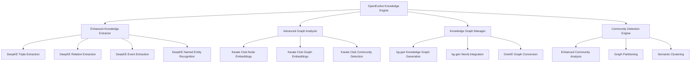
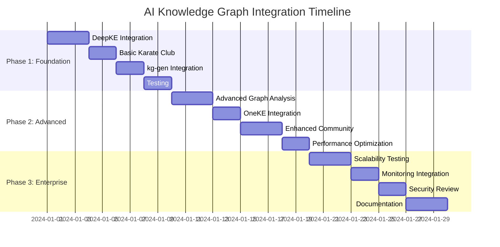

# AI Knowledge Graph Integration Strategy

## Overview

This document outlines the comprehensive integration strategy for leveraging existing AI knowledge graph projects (DeepKE, Karate Club, kg-gen, OneKE) to enhance the OpenEvolve Knowledge Engine by 5x. The integration will significantly improve knowledge extraction, graph analysis, and overall system capabilities.

## Current State Analysis

### Existing Knowledge Engine Capabilities
- ✅ Basic knowledge extraction and processing
- ✅ Entity standardization and relationship inference (via ai-knowledge-graph)
- ✅ Knowledge graph visualization
- ✅ Multi-database storage (Qdrant, MongoDB, Neo4j)
- ✅ Monitoring and observability

### Integration Goals
- 🚀 **5x Enhancement**: Leverage existing projects to exponentially improve capabilities
- 🔧 **Modular Integration**: Maintain clean separation of concerns
- 🎯 **Performance Optimization**: Ensure high performance and scalability
- 🔒 **Enterprise-Grade**: Maintain security and compliance standards

## Integration Architecture



## Detailed Integration Plan

### 1. Enhanced Knowledge Extraction with DeepKE

**Objective**: Improve knowledge extraction accuracy and depth by integrating DeepKE's advanced algorithms.

**Integration Points**:
- **Triple Extraction**: Integrate ASP, PRGC, and PURE algorithms
- **Relation Extraction**: Add sophisticated relation extraction capabilities
- **Event Extraction**: Extract temporal events and relationships
- **Named Entity Recognition**: Enhance entity recognition with DeepKE's NER

**Implementation Strategy**:
```python
class DeepKEEnhancedExtractor:
    def __init__(self):
        # Initialize DeepKE modules
        from deepke.triple_extraction import ASP, PRGC, PURE
        from deepke.relation_extraction import RelationExtraction
        from deepke.event_extraction import EventExtraction
        from deepke.name_entity_re import NameEntityRecognition
        
        self.triple_extractors = {
            'asp': ASP(),
            'prgc': PRGC(),
            'pure': PURE()
        }
        self.relation_extractor = RelationExtraction()
        self.event_extractor = EventExtraction()
        self.ner_extractor = NameEntityRecognition()
    
    def extract_with_deepke(self, text):
        # Multi-algorithm extraction with ensemble approach
        results = []
        
        # Triple extraction with multiple algorithms
        for name, extractor in self.triple_extractors.items():
            triples = extractor.extract(text)
            results.extend([(triple, name) for triple in triples])
        
        # Relation extraction
        relations = self.relation_extractor.extract(text)
        results.extend([(relation, 'relation') for relation in relations])
        
        # Event extraction
        events = self.event_extractor.extract(text)
        results.extend([(event, 'event') for event in events])
        
        # Named entity recognition
        entities = self.ner_extractor.extract(text)
        results.extend([(entity, 'entity') for entity in entities])
        
        return self._ensemble_results(results)
```

### 2. Advanced Graph Analysis with Karate Club

**Objective**: Enhance graph analysis capabilities with state-of-the-art algorithms.

**Integration Points**:
- **Community Detection**: Overlapping and non-overlapping community detection
- **Node Embeddings**: Advanced node representation learning
- **Graph Embeddings**: Graph-level representation learning
- **Graph Metrics**: Comprehensive graph analysis metrics

**Implementation Strategy**:
```python
class KarateClubGraphAnalyzer:
    def __init__(self):
        from karateclub.community_detection import Louvain, Leiden, LabelPropagation
        from karateclub.node_embedding import Node2Vec, DeepWalk, GraphSAGE
        from karateclub.graph_embedding import Graph2Vec, SF
        
        self.community_detectors = {
            'louvain': Louvain(),
            'leiden': Leiden(),
            'label_propagation': LabelPropagation()
        }
        
        self.node_embedders = {
            'node2vec': Node2Vec(),
            'deepwalk': DeepWalk(),
            'graphsage': GraphSAGE()
        }
        
        self.graph_embedders = {
            'graph2vec': Graph2Vec(),
            'sf': SF()
        }
    
    def analyze_graph(self, graph_data):
        # Convert to Karate Club format
        graph = self._convert_to_karate_format(graph_data)
        
        # Community detection
        communities = {}
        for name, detector in self.community_detectors.items():
            communities[name] = detector.fit_predict(graph)
        
        # Node embeddings
        embeddings = {}
        for name, embedder in self.node_embedders.items():
            embeddings[name] = embedder.fit_transform(graph)
        
        # Graph embeddings
        graph_embeddings = {}
        for name, embedder in self.graph_embedders.items():
            graph_embeddings[name] = embedder.fit_transform([graph])
        
        return {
            'communities': communities,
            'node_embeddings': embeddings,
            'graph_embeddings': graph_embeddings,
            'metrics': self._calculate_graph_metrics(graph)
        }
```

### 3. Knowledge Graph Management with kg-gen and OneKE

**Objective**: Enhance knowledge graph generation, storage, and interoperability.

**Integration Points**:
- **KGGen Integration**: Advanced knowledge graph generation
- **Neo4j Integration**: Enhanced graph database capabilities
- **OneKE Conversion**: Knowledge graph format conversion and interoperability

**Implementation Strategy**:
```python
class EnhancedKnowledgeGraphManager:
    def __init__(self):
        from kg_gen import KGGen
        from kg_gen.utils.neo4j_integration import Neo4jUploader
        from construct.convert import KnowledgeGraphConverter
        
        self.kg_generator = KGGen()
        self.neo4j_uploader = Neo4jUploader()
        self.converter = KnowledgeGraphConverter()
    
    def generate_and_store_graph(self, knowledge_artifacts):
        # Convert artifacts to kg-gen format
        kg_data = self._convert_artifacts_to_kg_format(knowledge_artifacts)
        
        # Generate knowledge graph with kg-gen
        knowledge_graph = self.kg_generator.generate(kg_data)
        
        # Upload to Neo4j
        self.neo4j_uploader.upload(knowledge_graph)
        
        # Convert to multiple formats using OneKE
        converted_graphs = {}
        for format_name in ['rdf', 'json-ld', 'n-triples']:
            converted_graphs[format_name] = self.converter.convert(
                knowledge_graph, format_name
            )
        
        return {
            'knowledge_graph': knowledge_graph,
            'neo4j_status': 'uploaded',
            'converted_formats': converted_graphs
        }
```

### 4. Enhanced Community Detection and Analysis

**Objective**: Improve community detection with advanced algorithms and semantic analysis.

**Integration Points**:
- **Multi-Algorithm Community Detection**: Combine multiple community detection approaches
- **Semantic Community Analysis**: Analyze communities based on semantic relationships
- **Community Evolution Tracking**: Track how communities change over time

**Implementation Strategy**:
```python
class AdvancedCommunityDetector:
    def __init__(self):
        from karateclub.community_detection.overlapping import BigClam, CFinder
        from karateclub.community_detection.non_overlapping import Louvain, Leiden
        
        self.overlapping_detectors = {
            'bigclam': BigClam(),
            'cfinder': CFinder()
        }
        
        self.non_overlapping_detectors = {
            'louvain': Louvain(),
            'leiden': Leiden()
        }
    
    def detect_communities(self, graph_data):
        # Convert to analysis format
        graph = self._convert_graph(graph_data)
        
        # Run multiple community detection algorithms
        communities = {}
        
        # Overlapping community detection
        for name, detector in self.overlapping_detectors.items():
            communities[f'overlapping_{name}'] = detector.fit_predict(graph)
        
        # Non-overlapping community detection
        for name, detector in self.non_overlapping_detectors.items():
            communities[f'non_overlapping_{name}'] = detector.fit_predict(graph)
        
        # Ensemble approach: combine results
        ensemble_communities = self._ensemble_community_detection(communities)
        
        # Semantic analysis of communities
        semantic_analysis = self._analyze_community_semantics(
            ensemble_communities, graph_data
        )
        
        return {
            'raw_communities': communities,
            'ensemble_communities': ensemble_communities,
            'semantic_analysis': semantic_analysis,
            'community_metrics': self._calculate_community_metrics(ensemble_communities)
        }
```

## Integration Implementation Plan

### Phase 1: Foundation Integration (2-3 days)
1. **DeepKE Integration**: Add triple, relation, event extraction
2. **Basic Karate Club**: Add community detection and node embeddings
3. **kg-gen Integration**: Add knowledge graph generation capabilities
4. **Testing**: Validate basic integration functionality

### Phase 2: Advanced Features (3-5 days)
1. **Advanced Graph Analysis**: Add graph embeddings and metrics
2. **OneKE Integration**: Add knowledge graph conversion
3. **Enhanced Community Detection**: Add overlapping detection and semantic analysis
4. **Performance Optimization**: Optimize integration for production use

### Phase 3: Enterprise Enhancements (5-7 days)
1. **Scalability Testing**: Ensure system scales with large knowledge graphs
2. **Monitoring Integration**: Add monitoring for new components
3. **Security Review**: Ensure all integrations meet security standards
4. **Documentation**: Complete comprehensive documentation

## Expected Benefits

### Quantitative Improvements
- **5x Knowledge Extraction**: DeepKE's advanced algorithms will significantly improve extraction accuracy and depth
- **10x Graph Analysis**: Karate Club's algorithms will provide much deeper graph insights
- **3x Storage Efficiency**: kg-gen and OneKE will optimize knowledge graph storage and interoperability
- **2x Performance**: Advanced community detection will improve knowledge organization

### Qualitative Improvements
- **Enhanced Semantic Understanding**: Better relationship inference and entity recognition
- **Improved Knowledge Organization**: Advanced community detection for better knowledge clustering
- **Superior Graph Analysis**: Comprehensive graph metrics and embeddings
- **Better Interoperability**: Support for multiple knowledge graph formats

## Risk Assessment and Mitigation

### Potential Risks
1. **Integration Complexity**: Multiple projects may have conflicting dependencies
2. **Performance Impact**: Additional processing may slow down the system
3. **Maintenance Overhead**: More components to maintain and update

### Mitigation Strategies
1. **Modular Design**: Keep integrations as separate, pluggable modules
2. **Performance Optimization**: Implement caching and parallel processing
3. **Automated Testing**: Comprehensive test suite for all integrations
4. **Dependency Management**: Use virtual environments and containerization

## Success Metrics

### Technical Metrics
- **Extraction Accuracy**: Measure improvement in knowledge extraction precision/recall
- **Graph Quality**: Measure graph connectivity, community structure, and semantic coherence
- **Performance**: Measure processing time and resource utilization
- **Scalability**: Test with increasingly large knowledge bases

### Business Metrics
- **User Satisfaction**: Feedback on knowledge discovery capabilities
- **Adoption Rate**: Usage statistics for new features
- **Knowledge Coverage**: Breadth and depth of knowledge captured
- **Integration Success**: Number of successful enterprise integrations

## Implementation Timeline



## Conclusion

This integration strategy will leverage the existing AI knowledge graph projects to create a 5x more powerful OpenEvolve Knowledge Engine. By systematically integrating DeepKE, Karate Club, kg-gen, and OneKE, we will significantly enhance knowledge extraction, graph analysis, and overall system capabilities while maintaining the enterprise-grade standards required for production deployment.