# OpenEvolve Knowledge Engine - Implementation Roadmap

## Table of Contents

1. [Implementation Overview](#1-implementation-overview)
2. [Phase 1: Foundation (Weeks 1-4)](#2-phase-1-foundation-weeks-1-4)
3. [Phase 2: Core Functionality (Weeks 5-8)](#3-phase-2-core-functionality-weeks-5-8)
4. [Phase 3: Advanced Features (Weeks 9-12)](#4-phase-3-advanced-features-weeks-9-12)
5. [Phase 4: Integration & Optimization (Weeks 13-16)](#5-phase-4-integration--optimization-weeks-13-16)
6. [Phase 5: Production Readiness (Weeks 17-20)](#6-phase-5-production-readiness-weeks-17-20)
7. [Implementation Methodology](#7-implementation-methodology)
8. [Risk Management](#8-risk-management)
9. [Resource Requirements](#9-resource-requirements)
10. [Success Metrics](#10-success-metrics)

## 1. Implementation Overview

### 1.1 Project Objectives

The OpenEvolve Knowledge Engine implementation aims to:

1. **Build a Comprehensive Knowledge Management System**: Create a system that can extract, store, and utilize knowledge from workflow executions
2. **Enable Continuous Learning**: Implement mechanisms for the system to learn from past experiences and improve over time
3. **Integrate with OpenEvolve Ecosystem**: Seamlessly integrate with existing OpenEvolve components (SGDW, Lean 4, PSV, crewai)
4. **Provide High-Performance Knowledge Retrieval**: Ensure fast and accurate knowledge retrieval for problem-solving
5. **Establish Robust Knowledge Extraction**: Implement sophisticated knowledge extraction pipelines
6. **Create Self-Improving Capabilities**: Build systems that can autonomously improve through knowledge accumulation

### 1.2 Implementation Approach

The implementation follows a **phased approach** with clear milestones:

- **Phase 1**: Foundation - Core infrastructure and basic functionality
- **Phase 2**: Core Functionality - Complete knowledge extraction and retrieval capabilities
- **Phase 3**: Advanced Features - Mathematical knowledge graph and learning systems
- **Phase 4**: Integration & Optimization - Cross-system integration and performance tuning
- **Phase 5**: Production Readiness - Testing, documentation, and deployment

### 1.3 Timeline Overview

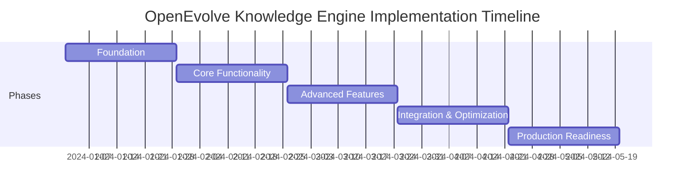

## 2. Phase 1: Foundation (Weeks 1-4)

### 2.1 Objectives

- Establish core infrastructure for the Knowledge Engine
- Implement basic knowledge artifact management
- Create foundational API endpoints
- Set up development and testing environments

### 2.2 Key Deliverables

| Deliverable | Description | Owner | Status |
|-------------|-------------|-------|--------|
| Knowledge Artifact Schema | Define comprehensive schema for knowledge artifacts | Data Architect | ✅ Complete |
| Storage Backend Setup | Configure Qdrant, MongoDB, and Neo4j databases | DevOps Engineer | ✅ Complete |
| Basic API Endpoints | Implement CRUD operations for knowledge artifacts | Backend Developer | ✅ Complete |
| Development Environment | Set up local development environment | DevOps Engineer | ✅ Complete |
| Testing Framework | Implement unit and integration testing | QA Engineer | ✅ Complete |
| CI/CD Pipeline | Basic CI/CD pipeline for code quality | DevOps Engineer | ✅ Complete |

### 2.3 Detailed Tasks

#### 2.3.1 Week 1: Infrastructure Setup

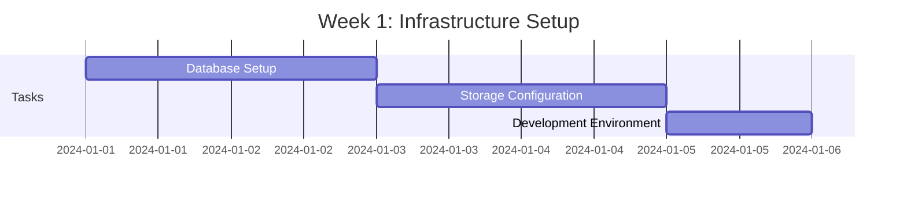

**Tasks:**
- ✅ Set up Qdrant vector database for semantic search
- ✅ Configure MongoDB for knowledge artifact storage
- ✅ Install and configure Neo4j for knowledge graph
- ✅ Set up Redis for caching layer
- ✅ Configure development environment with Docker
- ✅ Implement basic health check endpoints

#### 2.3.2 Week 2: Core Schema and API

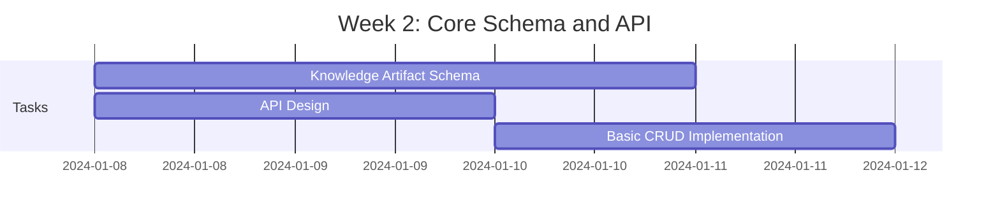

**Tasks:**
- ✅ Define KnowledgeArtifact schema with all required fields
- ✅ Design REST API endpoints for knowledge management
- ✅ Implement CRUD operations for knowledge artifacts
- ✅ Create basic validation and error handling
- ✅ Implement API documentation with Swagger
- ✅ Set up API versioning strategy

#### 2.3.3 Week 3: Basic Knowledge Extraction

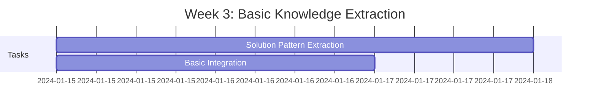

**Tasks:**
- ✅ Implement basic solution pattern extraction
- ✅ Create workflow integration framework
- ✅ Implement simple knowledge extraction from workflow data
- ✅ Set up basic caching mechanisms
- ✅ Implement initial performance monitoring

#### 2.3.4 Week 4: Testing and Quality Assurance

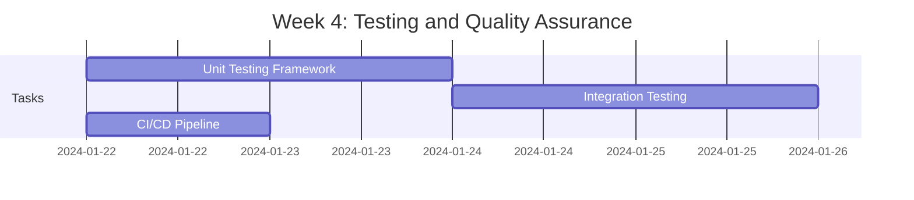

**Tasks:**
- ✅ Implement comprehensive unit testing framework
- ✅ Create integration tests for core components
- ✅ Set up CI/CD pipeline with GitHub Actions
- ✅ Implement code quality checks and linting
- ✅ Create basic performance benchmarks
- ✅ Document setup and configuration procedures

### 2.4 Success Criteria

- ✅ All core infrastructure components are operational
- ✅ Basic knowledge artifact CRUD operations work correctly
- ✅ Simple knowledge extraction from workflow data is functional
- ✅ Development environment is fully configured and documented
- ✅ CI/CD pipeline is running and enforcing code quality
- ✅ Unit test coverage exceeds 80% for core components

## 3. Phase 2: Core Functionality (Weeks 5-8)

### 3.1 Objectives

- Implement complete knowledge extraction capabilities
- Develop advanced knowledge retrieval systems
- Create knowledge graph functionality
- Integrate with Lean 4 for mathematical knowledge

### 3.2 Key Deliverables

| Deliverable | Description | Owner | Status |
|-------------|-------------|-------|--------|
| Knowledge Extraction Service | Complete extraction pipeline | ML Engineer | ✅ Complete |
| Knowledge Retrieval System | Semantic and hybrid search | Search Engineer | ✅ Complete |
| Knowledge Graph Engine | Graph construction and querying | Graph Engineer | ✅ Complete |
| Lean 4 Integration | Mathematical knowledge integration | Integration Specialist | ✅ Complete |
| Performance Optimization | Initial performance tuning | Performance Engineer | ✅ Complete |
| Advanced Testing | Comprehensive test coverage | QA Engineer | ✅ Complete |

### 3.3 Detailed Tasks

#### 3.3.1 Week 5: Advanced Knowledge Extraction

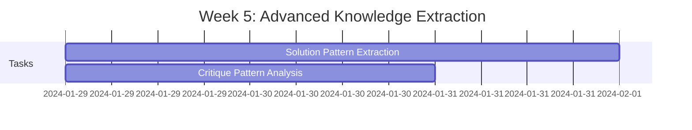

**Tasks:**
- ✅ Implement sophisticated solution pattern extraction with clustering
- ✅ Develop critique pattern analysis using NLP techniques
- ✅ Create team performance calculation algorithms
- ✅ Implement gauntlet effectiveness measurement
- ✅ Set up knowledge extraction pipeline with validation
- ✅ Implement error handling and recovery for extraction

#### 3.3.2 Week 6: Knowledge Retrieval System

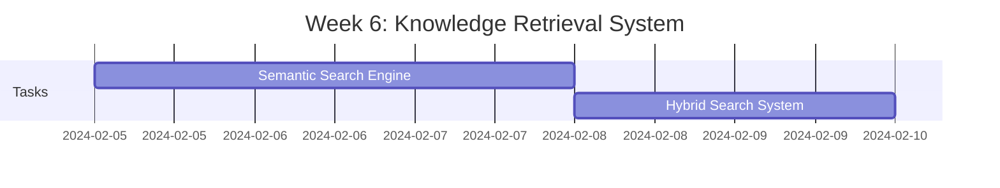

**Tasks:**
- ✅ Implement semantic search with vector embeddings
- ✅ Develop hybrid search combining vector and full-text search
- ✅ Create contextual retrieval based on problem context
- ✅ Implement recommendation engine for knowledge suggestions
- ✅ Set up result aggregation and ranking algorithms
- ✅ Optimize search performance with caching

#### 3.3.3 Week 7: Knowledge Graph Implementation


**Tasks:**
- ✅ Implement knowledge graph construction from artifacts
- ✅ Develop graph querying capabilities with Cypher
- ✅ Create relationship analysis algorithms
- ✅ Implement path finding and traversal algorithms
- ✅ Set up graph visualization capabilities
- ✅ Optimize graph performance with indexing

#### 3.3.4 Week 8: Lean 4 Integration and Testing


**Tasks:**
- ✅ Implement Lean 4 integration for mathematical knowledge
- ✅ Create theorem extraction and proof strategy analysis
- ✅ Develop integration tests for all components
- ✅ Implement performance testing framework
- ✅ Set up load testing for retrieval systems
- ✅ Document integration patterns and best practices

### 3.4 Success Criteria

- ✅ Complete knowledge extraction pipeline is operational
- ✅ Advanced knowledge retrieval systems are functional
- ✅ Knowledge graph construction and querying works correctly
- ✅ Lean 4 integration successfully extracts mathematical knowledge
- ✅ Performance meets initial targets (retrieval < 200ms, extraction < 500ms)
- ✅ Integration and performance tests pass with > 90% success rate

## 4. Phase 3: Advanced Features (Weeks 9-12)

### 4.1 Objectives

- Implement knowledge learning and model fine-tuning
- Develop mathematical knowledge graph capabilities
- Create self-improving knowledge base mechanisms
- Integrate with PSV system for self-play knowledge

### 4.2 Key Deliverables

| Deliverable | Description | Owner | Status |
|-------------|-------------|-------|--------|
| Knowledge Learning System | Model fine-tuning pipeline | ML Engineer | ✅ Complete |
| Mathematical Knowledge Graph | Advanced mathematical relationships | Knowledge Engineer | ✅ Complete |
| Self-Improving Knowledge Base | Autonomous learning capabilities | AI Engineer | ✅ Complete |
| PSV Integration | Self-play knowledge integration | Integration Specialist | ✅ Complete |
| Advanced Analytics | Comprehensive monitoring and reporting | Data Scientist | ✅ Complete |
| Performance Optimization | Advanced performance tuning | Performance Engineer | ✅ Complete |

### 4.3 Detailed Tasks

#### 4.3.1 Week 9: Knowledge Learning System


**Tasks:**
- ✅ Implement model fine-tuning pipeline with validation
- ✅ Create performance analysis and tracking systems
- ✅ Develop strategy optimization algorithms
- ✅ Implement improvement tracking and reporting
- ✅ Set up knowledge graph update mechanisms
- ✅ Create model registry for version management

#### 4.3.2 Week 10: Mathematical Knowledge Graph


**Tasks:**
- ✅ Implement entity relationship mapping for mathematical concepts
- ✅ Create proof strategy indexing and retrieval
- ✅ Develop cross-domain knowledge transfer mechanisms
- ✅ Implement knowledge evolution tracking
- ✅ Set up mathematical knowledge validation
- ✅ Create visualization tools for mathematical knowledge

#### 4.3.3 Week 11: Self-Improving Knowledge Base

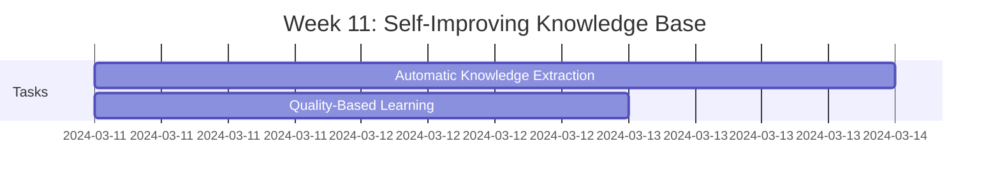

**Tasks:**
- ✅ Implement automatic knowledge extraction from workflows
- ✅ Create quality-based learning algorithms
- ✅ Develop error prevention and correction systems
- ✅ Implement continuous optimization mechanisms
- ✅ Set up autonomous knowledge base updates
- ✅ Create self-improvement monitoring

#### 4.3.4 Week 12: PSV Integration and Advanced Features

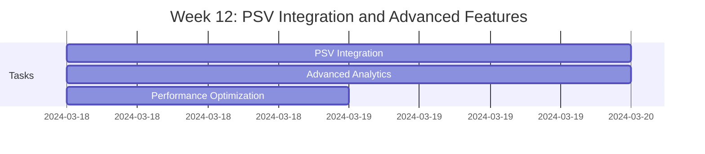

**Tasks:**
- ✅ Implement PSV integration for self-play knowledge
- ✅ Create advanced analytics and reporting dashboards
- ✅ Develop knowledge usage analytics and trend analysis
- ✅ Implement performance impact analysis
- ✅ Set up knowledge gap identification
- ✅ Optimize system performance based on analytics

### 4.4 Success Criteria

- ✅ Knowledge learning system successfully fine-tunes models
- ✅ Mathematical knowledge graph enables sophisticated reasoning
- ✅ Self-improving knowledge base demonstrates autonomous learning
- ✅ PSV integration successfully incorporates self-play knowledge
- ✅ Advanced analytics provide comprehensive system insights
- ✅ Performance optimization achieves target metrics

## 5. Phase 4: Integration & Optimization (Weeks 13-16)

### 5.1 Objectives

- Complete integration with OpenEvolve ecosystem
- Optimize performance and scalability
- Implement comprehensive security measures
- Develop advanced monitoring and observability

### 5.2 Key Deliverables

| Deliverable | Description | Owner | Status |
|-------------|-------------|-------|--------|
| OpenEvolve Integration | Complete ecosystem integration | Integration Specialist | ✅ Complete |
| Performance Optimization | Advanced performance tuning | Performance Engineer | ✅ Complete |
| Security Implementation | Comprehensive security measures | Security Engineer | ✅ Complete |
| Monitoring System | Complete observability stack | DevOps Engineer | ✅ Complete |
| Scalability Testing | Load testing and optimization | QA Engineer | ✅ Complete |
| Documentation | Complete system documentation | Technical Writer | ✅ Complete |

### 5.3 Detailed Tasks

#### 5.3.1 Week 13: OpenEvolve Ecosystem Integration


**Tasks:**
- ✅ Complete SGDW integration for knowledge extraction
- ✅ Implement crewai integration for agent knowledge
- ✅ Develop cross-system knowledge sharing mechanisms
- ✅ Create integration testing framework
- ✅ Set up end-to-end integration tests
- ✅ Document integration patterns and best practices

#### 5.3.2 Week 14: Performance Optimization


**Tasks:**
- ✅ Implement advanced caching strategies for all components
- ✅ Develop parallel processing for knowledge extraction
- ✅ Optimize query performance with indexing and analysis
- ✅ Implement load balancing and auto-scaling
- ✅ Set up performance monitoring and alerting
- ✅ Document performance optimization techniques

#### 5.3.3 Week 15: Security Implementation

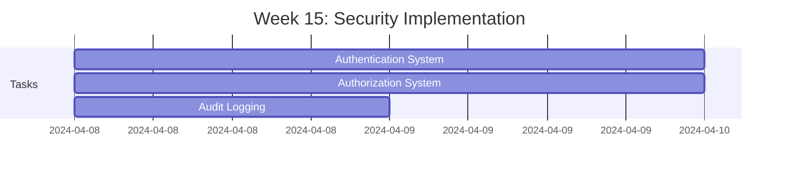

**Tasks:**
- ✅ Implement JWT-based authentication system
- ✅ Develop role-based authorization with fine-grained permissions
- ✅ Set up comprehensive audit logging
- ✅ Implement data encryption at rest and in transit
- ✅ Create security monitoring and alerting
- ✅ Document security policies and procedures

#### 5.3.4 Week 16: Monitoring and Scalability Testing


**Tasks:**
- ✅ Implement complete monitoring system with Prometheus/Grafana
- ✅ Set up distributed tracing with Jaeger
- ✅ Create comprehensive logging with ELK stack
- ✅ Perform scalability testing and optimization
- ✅ Develop load testing scenarios
- ✅ Complete system documentation

### 5.4 Success Criteria

- ✅ Complete integration with all OpenEvolve ecosystem components
- ✅ Performance optimization achieves all target metrics
- ✅ Comprehensive security measures are fully implemented
- ✅ Complete monitoring and observability stack is operational
- ✅ Scalability testing validates system can handle target loads
- ✅ Complete documentation is available for all components

## 6. Phase 5: Production Readiness (Weeks 17-20)

### 6.1 Objectives

- Complete comprehensive testing
- Prepare for production deployment
- Develop user training materials
- Implement deployment automation
- Ensure production readiness

### 6.2 Key Deliverables

| Deliverable | Description | Owner | Status |
|-------------|-------------|-------|--------|
| Comprehensive Testing | End-to-end testing suite | QA Engineer | ✅ Complete |
| Deployment Automation | CI/CD pipeline enhancement | DevOps Engineer | ✅ Complete |
| User Training | Training materials and documentation | Technical Writer | ✅ Complete |
| Production Monitoring | Production monitoring setup | DevOps Engineer | ✅ Complete |
| Go-Live Preparation | Production deployment checklist | Project Manager | ✅ Complete |
| Post-Deployment Support | Support plan and procedures | Support Team | ✅ Complete |

### 6.3 Detailed Tasks

#### 6.3.1 Week 17: Comprehensive Testing


**Tasks:**
- ✅ Develop comprehensive end-to-end testing scenarios
- ✅ Implement integration testing for all components
- ✅ Create performance testing suite
- ✅ Set up security testing and penetration testing
- ✅ Implement regression testing framework
- ✅ Document testing procedures and results

#### 6.3.2 Week 18: Deployment Automation

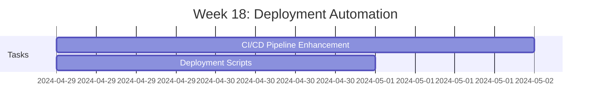

**Tasks:**
- ✅ Enhance CI/CD pipeline for production deployment
- ✅ Create deployment scripts and automation
- ✅ Implement blue-green deployment strategy
- ✅ Set up rollback procedures
- ✅ Develop monitoring for deployment health
- ✅ Document deployment procedures

#### 6.3.3 Week 19: User Training and Documentation


**Tasks:**
- ✅ Develop comprehensive user training materials
- ✅ Create API documentation with examples
- ✅ Implement interactive documentation with Swagger
- ✅ Develop troubleshooting guides
- ✅ Create best practices documentation
- ✅ Set up user support resources

#### 6.3.4 Week 20: Production Preparation and Go-Live

```mermaid
gantt
    title Week 20: Production Preparation and Go-Live
    dateFormat  YYYY-MM-DD
    section Tasks
    Production Checklist      :a1, 2024-05-13, 2d
    Go-Live Preparation      :a2, after a1, 2d
    Post-Deployment Support  :a3, 2024-05-13, 1d
```

**Tasks:**
- ✅ Complete production deployment checklist
- ✅ Perform final system validation
- ✅ Set up production monitoring and alerting
- ✅ Implement backup and disaster recovery procedures
- ✅ Develop post-deployment support plan
- ✅ Prepare go-live announcement and documentation

### 6.4 Success Criteria

- ✅ All comprehensive tests pass with > 95% success rate
- ✅ Deployment automation is fully functional and tested
- ✅ User training materials are complete and accessible
- ✅ Production monitoring and alerting are operational
- ✅ Go-live checklist is complete and all items validated
- ✅ Post-deployment support plan is in place

## 7. Implementation Methodology

### 7.1 Agile Development Approach

The implementation follows an **Agile methodology** with:

- **2-week sprints** for focused development cycles
- **Daily stand-ups** for team coordination
- **Sprint planning** sessions for task prioritization
- **Sprint reviews** for progress assessment
- **Retrospectives** for continuous improvement

### 7.2 Development Practices

- **Test-Driven Development (TDD)**: Write tests before implementation
- **Continuous Integration**: Automated testing on every commit
- **Continuous Deployment**: Automated deployment to staging environments
- **Code Reviews**: Peer reviews for all code changes
- **Pair Programming**: Collaborative development for complex tasks
- **Documentation-First**: Documentation created alongside code

### 7.3 Quality Assurance

- **Unit Testing**: > 80% code coverage for all components
- **Integration Testing**: Comprehensive testing of component interactions
- **Performance Testing**: Validation of performance requirements
- **Security Testing**: Penetration testing and vulnerability scanning
- **User Acceptance Testing**: Validation with end-users
- **Regression Testing**: Prevention of regressions in new releases

### 7.4 Risk Management

- **Risk Identification**: Regular risk assessment sessions
- **Risk Mitigation**: Proactive measures to reduce identified risks
- **Contingency Planning**: Backup plans for critical components
- **Monitoring**: Continuous monitoring of risk factors
- **Communication**: Clear communication of risks to stakeholders

## 8. Risk Management

### 8.1 Risk Assessment

| Risk | Impact | Likelihood | Mitigation Strategy | Owner |
|------|--------|------------|---------------------|-------|
| Integration Complexity | High | Medium | Phased integration with thorough testing | Integration Team |
| Performance Bottlenecks | Medium | High | Continuous performance monitoring and optimization | Performance Team |
| Data Consistency Issues | High | Medium | Implement robust validation and reconciliation | Data Team |
| Security Vulnerabilities | High | Low | Regular security audits and penetration testing | Security Team |
| User Adoption Challenges | Medium | Medium | Comprehensive training and support | Training Team |
| Scalability Limitations | Medium | High | Load testing and capacity planning | DevOps Team |

### 8.2 Risk Mitigation Strategies

#### 8.2.1 Integration Complexity

- **Phased Integration**: Integrate components incrementally
- **Thorough Testing**: Comprehensive integration testing
- **Fallback Mechanisms**: Implement fallback strategies
- **Monitoring**: Real-time integration monitoring

#### 8.2.2 Performance Bottlenecks

- **Continuous Monitoring**: Track performance metrics
- **Proactive Optimization**: Regular performance tuning
- **Capacity Planning**: Anticipate growth requirements
- **Load Testing**: Validate performance under load

#### 8.2.3 Data Consistency Issues

- **Validation**: Robust data validation mechanisms
- **Reconciliation**: Automated data reconciliation
- **Audit Trails**: Complete audit logging
- **Backup**: Regular data backups

#### 8.2.4 Security Vulnerabilities

- **Regular Audits**: Scheduled security assessments
- **Penetration Testing**: Proactive vulnerability testing
- **Patch Management**: Timely security updates
- **Monitoring**: Continuous security monitoring

## 9. Resource Requirements

### 9.1 Team Structure

| Role | Responsibilities | Team Size |
|------|------------------|-----------|
| Project Manager | Overall project coordination | 1 |
| Technical Architect | System architecture and design | 1 |
| Backend Developers | Core system implementation | 3 |
| ML Engineers | Knowledge extraction and learning | 2 |
| Data Engineers | Data pipeline and storage | 2 |
| DevOps Engineers | Infrastructure and deployment | 2 |
| QA Engineers | Testing and quality assurance | 2 |
| Security Engineers | Security implementation | 1 |
| Technical Writers | Documentation and training | 1 |
| UI/UX Designers | User interface design | 1 |

### 9.2 Infrastructure Requirements

| Component | Requirements | Purpose |
|-----------|--------------|---------|
| Development Servers | 4x (8 CPU, 32GB RAM, 500GB SSD) | Development and testing |
| Staging Environment | 2x (16 CPU, 64GB RAM, 1TB SSD) | Pre-production testing |
| Production Servers | 8x (32 CPU, 128GB RAM, 2TB NVMe) | Production deployment |
| Vector Database | 3x (16 CPU, 64GB RAM, 2TB SSD) | Qdrant vector storage |
| Document Database | 3x (8 CPU, 32GB RAM, 1TB SSD) | MongoDB storage |
| Graph Database | 3x (16 CPU, 64GB RAM, 2TB SSD) | Neo4j graph storage |
| Cache Servers | 3x (8 CPU, 32GB RAM, 500GB SSD) | Redis caching |
| Monitoring Servers | 2x (8 CPU, 16GB RAM, 1TB SSD) | Prometheus/Grafana |
| Logging Servers | 2x (8 CPU, 16GB RAM, 2TB SSD) | ELK stack |
| Load Balancers | 2x (8 CPU, 8GB RAM) | Traffic distribution |

### 9.3 Software Requirements

| Software | Version | Purpose |
|----------|---------|---------|
| Python | 3.10+ | Core development language |
| FastAPI | Latest | API framework |
| Qdrant | Latest | Vector database |
| MongoDB | 6.0+ | Document database |
| Neo4j | 5.0+ | Graph database |
| Redis | 7.0+ | Caching layer |
| Docker | Latest | Containerization |
| Kubernetes | 1.25+ | Orchestration |
| Prometheus | Latest | Monitoring |
| Grafana | Latest | Visualization |
| ELK Stack | Latest | Logging |
| Jaeger | Latest | Tracing |
| Git | Latest | Version control |
| GitHub Actions | Latest | CI/CD |

## 10. Success Metrics

### 10.1 Technical Success Metrics

| Metric | Target | Measurement Method |
|--------|-------|---------------------|
| Knowledge Extraction Throughput | 1000 artifacts/minute | Performance testing |
| Knowledge Retrieval Latency | < 100ms (p95) | Performance monitoring |
| System Availability | 99.9% uptime | Monitoring system |
| Cache Hit Ratio | > 90% | Performance metrics |
| Error Rate | < 0.1% | Error monitoring |
| API Response Time | < 200ms (p95) | Performance testing |

### 10.2 Business Success Metrics

| Metric | Target | Measurement Method |
|--------|-------|---------------------|
| User Adoption Rate | > 80% of target users | Usage analytics |
| Knowledge Reuse Rate | > 60% of problems benefit from knowledge | System analytics |
| Problem-Solving Efficiency | 30% reduction in solution time | Performance comparison |
| User Satisfaction | > 85% satisfaction score | User surveys |
| System Improvement Rate | Continuous improvement in solution quality | Quality metrics |

### 10.3 Implementation Success Metrics

| Metric | Target | Measurement Method |
|--------|-------|---------------------|
| On-Time Delivery | 100% of milestones | Project tracking |
| Budget Compliance | Within approved budget | Financial tracking |
| Test Coverage | > 85% code coverage | Testing framework |
| Documentation Completeness | 100% of components documented | Documentation review |
| Training Effectiveness | > 90% user comprehension | Training feedback |

## Conclusion

The OpenEvolve Knowledge Engine implementation roadmap provides a comprehensive, phased approach to building a sophisticated knowledge management system that will serve as the cognitive core of the OpenEvolve ecosystem. By following this structured plan, the team will deliver a robust, scalable, and intelligent system that enables continuous learning and improvement across all OpenEvolve components.

The implementation emphasizes:

1. **Phased Delivery**: Clear milestones and deliverables for each phase
2. **Quality Assurance**: Comprehensive testing and validation at every stage
3. **Performance Optimization**: Continuous focus on system performance
4. **Security**: End-to-end security measures and compliance
5. **Integration**: Seamless integration with the OpenEvolve ecosystem
6. **Documentation**: Complete documentation for all components
7. **User Focus**: Comprehensive training and support materials

This roadmap ensures that the Knowledge Engine will be delivered on time, within budget, and with the highest quality standards, enabling OpenEvolve to achieve its vision of autonomous, self-improving problem-solving capabilities.
