# OpenEvolve Knowledge Engine - Integration Guide

## Table of Contents

1. [Integration Overview](#1-integration-overview)
2. [Knowledge Engine in the OpenEvolve Ecosystem](#2-knowledge-engine-in-the-openevolve-ecosystem)
3. [Stage-by-Stage Integration](#3-stage-by-stage-integration)
4. [Cross-System Integration](#4-cross-system-integration)
5. [Integration Architecture](#5-integration-architecture)
6. [Integration Patterns](#6-integration-patterns)
7. [Data Flow and Knowledge Exchange](#7-data-flow-and-knowledge-exchange)
8. [Performance Optimization](#8-performance-optimization)
9. [Security and Compliance](#9-security-and-compliance)
10. [Monitoring and Observability](#10-monitoring-and-observability)

## 1. Integration Overview

### 1.1 Purpose

This guide provides a comprehensive overview of how the OpenEvolve Knowledge Engine integrates with the broader OpenEvolve ecosystem, enabling continuous learning and knowledge-driven problem-solving across all components.

### 1.2 Knowledge Engine Role

The Knowledge Engine serves as the **cognitive core** of the OpenEvolve ecosystem by:

1. **Extracting Knowledge**: Capturing valuable insights from every workflow execution
2. **Storing Knowledge**: Organizing knowledge in structured, searchable formats
3. **Reusing Knowledge**: Providing relevant knowledge to enhance problem-solving
4. **Learning Continuously**: Improving system performance through accumulated knowledge
5. **Enabling Cross-System Learning**: Sharing knowledge across all OpenEvolve components

### 1.3 Integration Benefits

- **Improved Problem-Solving**: Reuse of past solutions and patterns
- **Continuous Improvement**: System learns from every execution
- **Reduced Computational Cost**: Avoid redundant problem-solving efforts
- **Enhanced Quality**: Knowledge-based validation and optimization
- **Cross-Domain Learning**: Transfer knowledge between different problem domains

## 2. Knowledge Engine in the OpenEvolve Ecosystem

### 2.1 Ecosystem Architecture

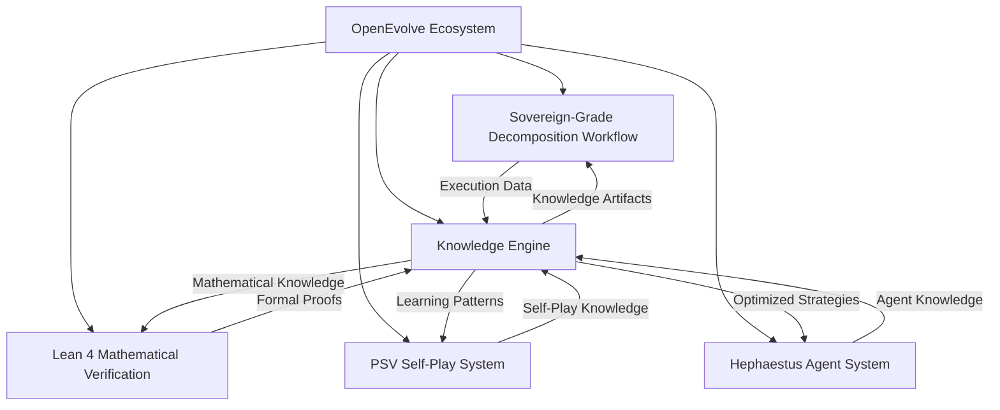
```mermaid
graph TD
    A[OpenEvolve Ecosystem] --> B[Sovereign-Grade Decomposition Workflow]
    A --> C[Lean 4 Mathematical Verification]
    A --> D[PSV Self-Play System]
    A --> E[Hephaestus Agent System]
    A --> F[Knowledge Engine]
    
    B -->|Execution Data| F
    C -->|Formal Proofs| F
    D -->|Self-Play Knowledge| F
    E -->|Agent Knowledge| F
    
    F -->|Knowledge Artifacts| B
    F -->|Mathematical Knowledge| C
    F -->|Learning Patterns| D
    F -->|Optimized Strategies| E
```

### 2.2 Knowledge Engine Components

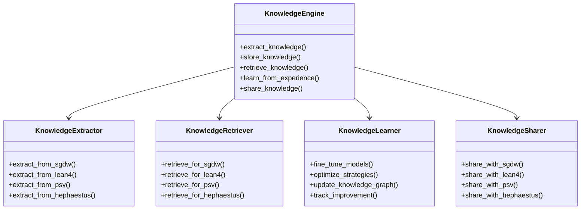
```mermaid
classDiagram
    class KnowledgeEngine {
        +extract_knowledge()
        +store_knowledge()
        +retrieve_knowledge()
        +learn_from_experience()
        +share_knowledge()
    }
    
    class KnowledgeExtractor {
        +extract_from_sgdw()
        +extract_from_lean4()
        +extract_from_psv()
        +extract_from_hephaestus()
    }
    
    class KnowledgeRetriever {
        +retrieve_for_sgdw()
        +retrieve_for_lean4()
        +retrieve_for_psv()
        +retrieve_for_hephaestus()
    }
    
    class KnowledgeLearner {
        +fine_tune_models()
        +optimize_strategies()
        +update_knowledge_graph()
        +track_improvement()
    }
    
    class KnowledgeSharer {
        +share_with_sgdw()
        +share_with_lean4()
        +share_with_psv()
        +share_with_hephaestus()
    }
    
    KnowledgeEngine --> KnowledgeExtractor
    KnowledgeEngine --> KnowledgeRetriever
    KnowledgeEngine --> KnowledgeLearner
    KnowledgeEngine --> KnowledgeSharer
```

### 2.3 Knowledge Flow

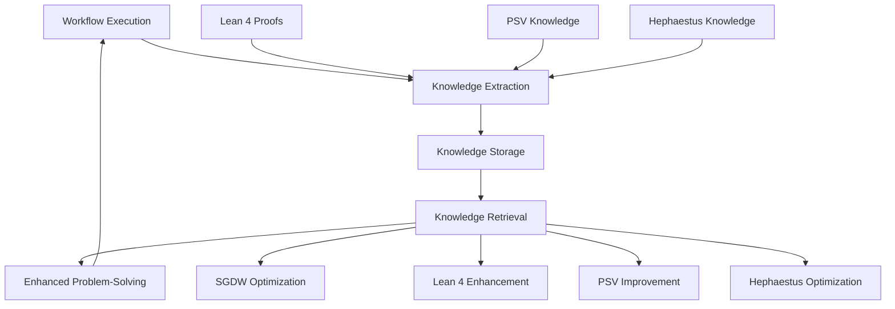
```mermaid
flowchart TD
    A[Workflow Execution] --> B[Knowledge Extraction]
    B --> C[Knowledge Storage]
    C --> D[Knowledge Retrieval]
    D --> E[Enhanced Problem-Solving]
    E --> A
    
    F[Lean 4 Proofs] --> B
    G[PSV Knowledge] --> B
    H[Hephaestus Knowledge] --> B
    
    D --> I[SGDW Optimization]
    D --> J[Lean 4 Enhancement]
    D --> K[PSV Improvement]
    D --> L[Hephaestus Optimization]
```

## 3. Stage-by-Stage Integration

### 3.1 Sovereign-Grade Decomposition Workflow (SGDW) Integration

#### 3.1.1 Stage 0: Content Analysis

**Integration Point**: Knowledge injection for problem understanding

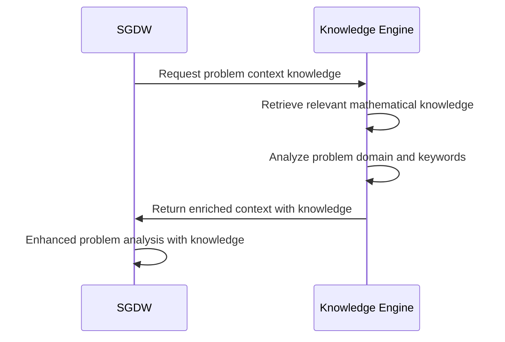
```mermaid
sequenceDiagram
    participant SGDW as SGDW
    participant KE as Knowledge Engine
    
    SGDW->>KE: Request problem context knowledge
    KE->>KE: Retrieve relevant mathematical knowledge
    KE->>KE: Analyze problem domain and keywords
    KE->>SGDW: Return enriched context with knowledge
    SGDW->>SGDW: Enhanced problem analysis with knowledge
```

**Knowledge Contribution**:
- Domain-specific knowledge and patterns
- Historical problem-solving approaches
- Mathematical concept relationships
- Context enrichment from knowledge graph

#### 3.1.2 Stage 1: AI-Assisted Decomposition

**Integration Point**: Pattern-based decomposition guidance

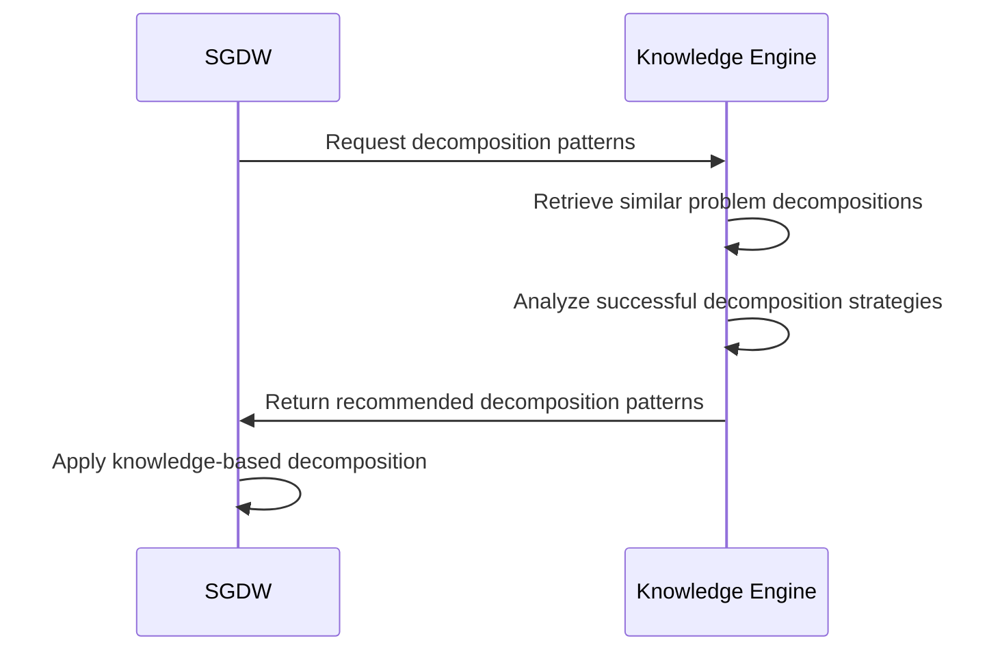
```mermaid
sequenceDiagram
    participant SGDW as SGDW
    participant KE as Knowledge Engine
    
    SGDW->>KE: Request decomposition patterns
    KE->>KE: Retrieve similar problem decompositions
    KE->>KE: Analyze successful decomposition strategies
    KE->>SGDW: Return recommended decomposition patterns
    SGDW->>SGDW: Apply knowledge-based decomposition
```

**Knowledge Contribution**:
- Successful decomposition patterns
- Domain-specific decomposition strategies
- Complexity estimation based on historical data
- Dependency analysis from knowledge graph

#### 3.1.3 Stage 3: Sub-Problem Solving Loop

**Integration Point**: Solution pattern retrieval and critique analysis

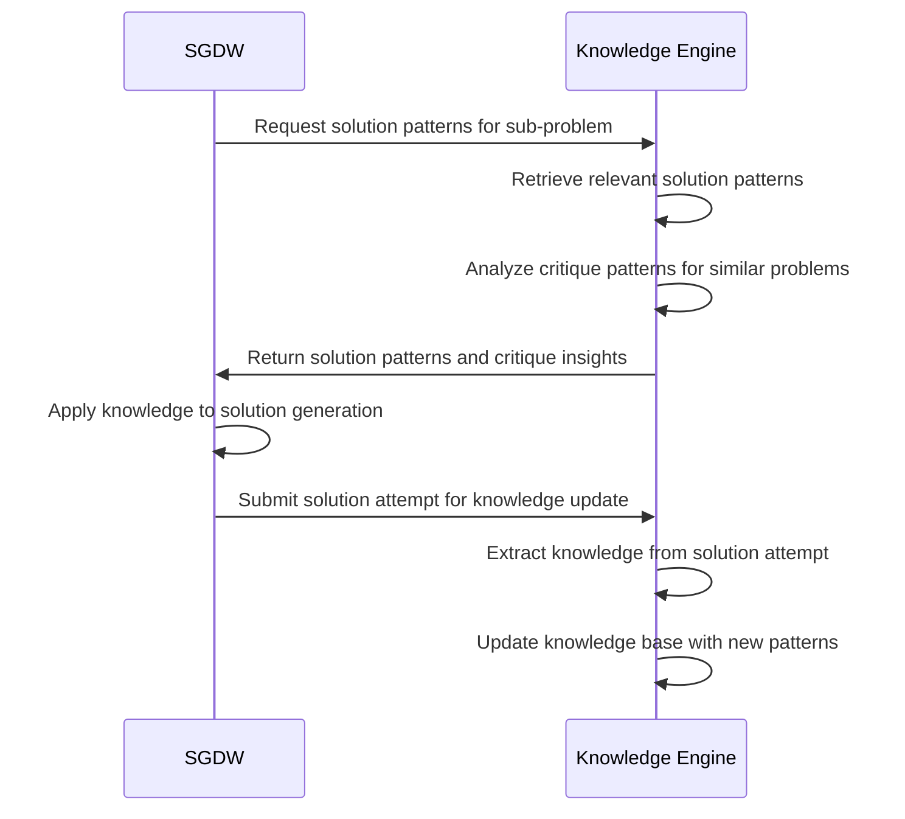
```mermaid
sequenceDiagram
    participant SGDW as SGDW
    participant KE as Knowledge Engine
    
    SGDW->>KE: Request solution patterns for sub-problem
    KE->>KE: Retrieve relevant solution patterns
    KE->>KE: Analyze critique patterns for similar problems
    KE->>SGDW: Return solution patterns and critique insights
    SGDW->>SGDW: Apply knowledge to solution generation
    
    SGDW->>KE: Submit solution attempt for knowledge update
    KE->>KE: Extract knowledge from solution attempt
    KE->>KE: Update knowledge base with new patterns
```

**Knowledge Contribution**:
- Relevant solution patterns and templates
- Critique patterns and prevention strategies
- Verification knowledge and quality metrics
- Historical success/failure analysis

#### 3.1.4 Stage 5: Final Verification

**Integration Point**: Knowledge-based validation and quality assurance

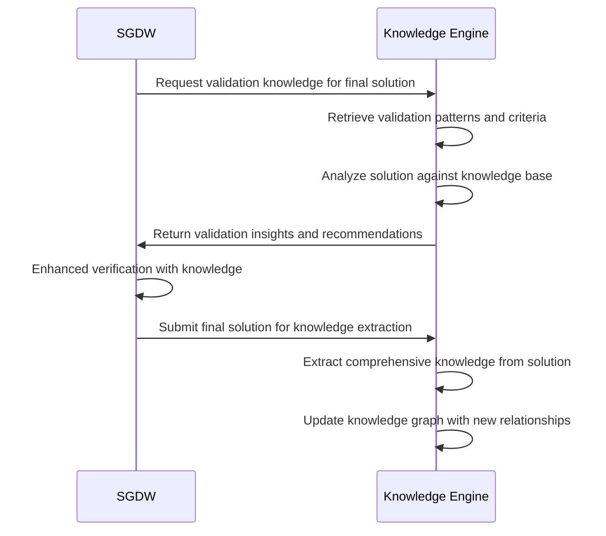
```mermaid
sequenceDiagram
    participant SGDW as SGDW
    participant KE as Knowledge Engine
    
    SGDW->>KE: Request validation knowledge for final solution
    KE->>KE: Retrieve validation patterns and criteria
    KE->>KE: Analyze solution against knowledge base
    KE->>SGDW: Return validation insights and recommendations
    SGDW->>SGDW: Enhanced verification with knowledge
    
    SGDW->>KE: Submit final solution for knowledge extraction
    KE->>KE: Extract comprehensive knowledge from solution
    KE->>KE: Update knowledge graph with new relationships
```

**Knowledge Contribution**:
- Validation patterns and quality criteria
- Cross-validation with historical solutions
- Pattern matching for known solution types
- Quality assessment based on knowledge metrics

#### 3.1.5 Stage 6: Knowledge Extraction & Learning

**Integration Point**: Comprehensive knowledge extraction and system learning

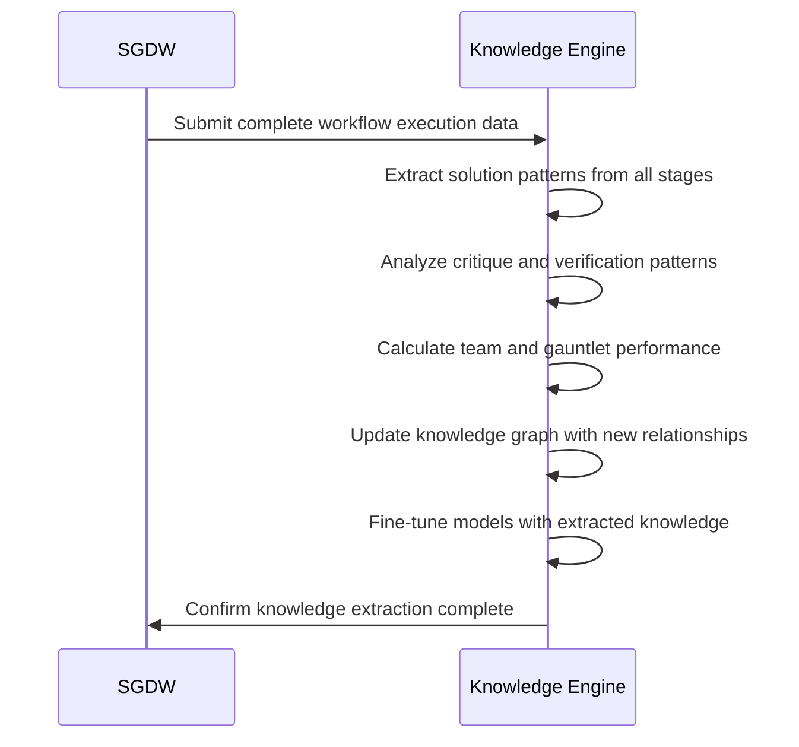
```mermaid
sequenceDiagram
    participant SGDW as SGDW
    participant KE as Knowledge Engine
    
    SGDW->>KE: Submit complete workflow execution data
    KE->>KE: Extract solution patterns from all stages
    KE->>KE: Analyze critique and verification patterns
    KE->>KE: Calculate team and gauntlet performance
    KE->>KE: Update knowledge graph with new relationships
    KE->>KE: Fine-tune models with extracted knowledge
    KE->>SGDW: Confirm knowledge extraction complete
```

**Knowledge Contribution**:
- Comprehensive knowledge artifact extraction
- Team performance metrics and insights
- Gauntlet effectiveness analysis
- Knowledge graph updates and evolution
- Model fine-tuning and improvement

### 3.2 Lean 4 Mathematical Verification Integration

#### 3.2.1 Mathematical Knowledge Extraction

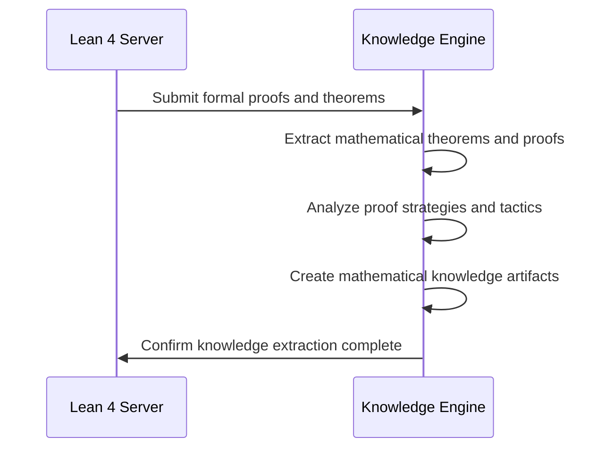
```mermaid
sequenceDiagram
    participant Lean4 as Lean 4 Server
    participant KE as Knowledge Engine
    
    Lean4->>KE: Submit formal proofs and theorems
    KE->>KE: Extract mathematical theorems and proofs
    KE->>KE: Analyze proof strategies and tactics
    KE->>KE: Create mathematical knowledge artifacts
    KE->>Lean4: Confirm knowledge extraction complete
```

**Integration Benefits**:
- Formal verification of mathematical knowledge
- Proof strategy indexing and retrieval
- Theorem relationship mapping
- Cross-domain mathematical knowledge transfer

#### 3.2.2 Knowledge-Enhanced Verification

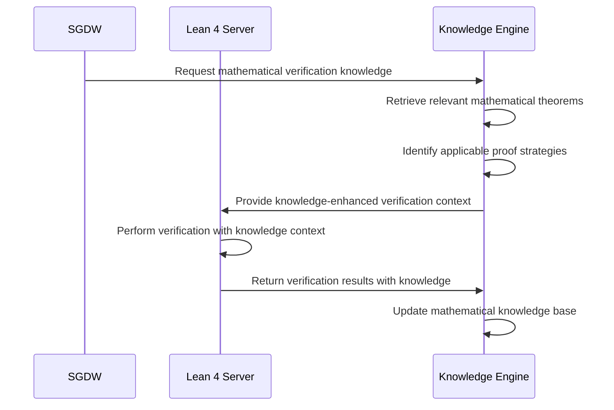
```mermaid
sequenceDiagram
    participant SGDW as SGDW
    participant Lean4 as Lean 4 Server
    participant KE as Knowledge Engine
    
    SGDW->>KE: Request mathematical verification knowledge
    KE->>KE: Retrieve relevant mathematical theorems
    KE->>KE: Identify applicable proof strategies
    KE->>Lean4: Provide knowledge-enhanced verification context
    Lean4->>Lean4: Perform verification with knowledge context
    Lean4->>KE: Return verification results with knowledge
    KE->>KE: Update mathematical knowledge base
```

**Integration Benefits**:
- Context-aware mathematical verification
- Proof strategy recommendations
- Theorem reuse and adaptation
- Verification performance optimization

### 3.3 PSV Self-Play System Integration

#### 3.3.1 Self-Play Knowledge Extraction

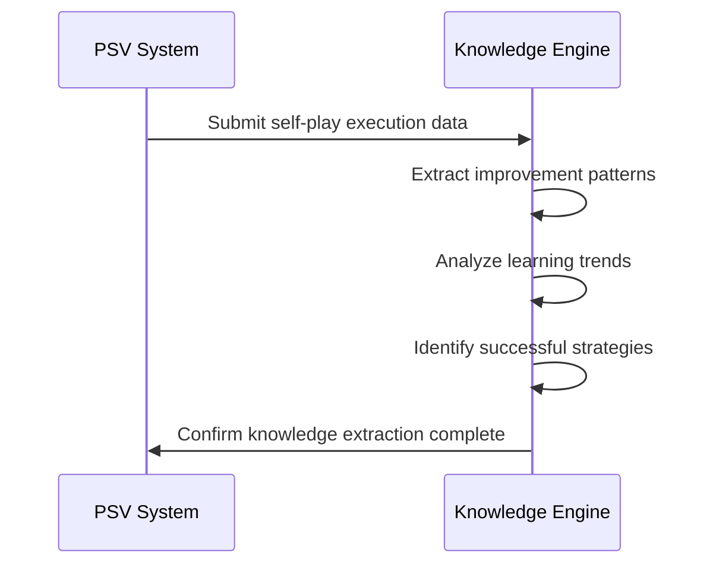
```mermaid
sequenceDiagram
    participant PSV as PSV System
    participant KE as Knowledge Engine
    
    PSV->>KE: Submit self-play execution data
    KE->>KE: Extract improvement patterns
    KE->>KE: Analyze learning trends
    KE->>KE: Identify successful strategies
    KE->>PSV: Confirm knowledge extraction complete
```

**Integration Benefits**:
- Autonomous learning pattern extraction
- Strategy evolution tracking
- Performance improvement analysis
- Cross-domain transfer learning

#### 3.3.2 Knowledge-Enhanced Self-Play

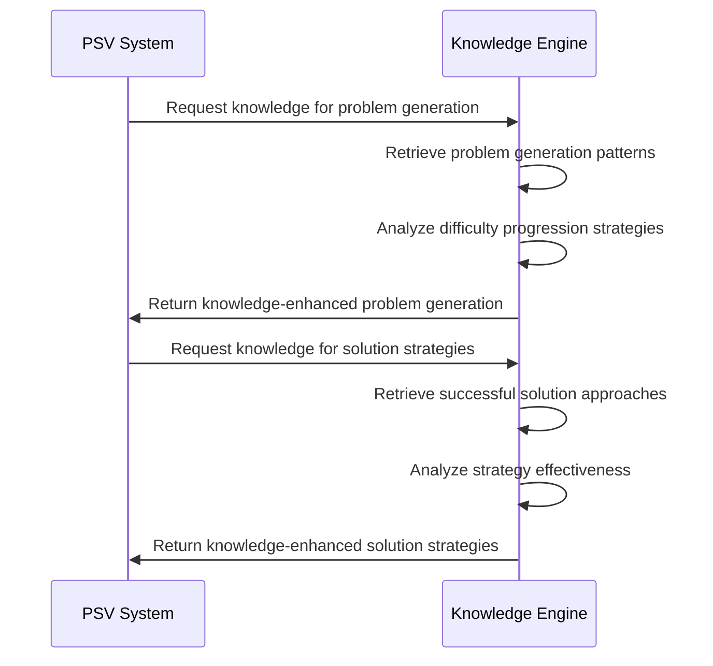
```mermaid
sequenceDiagram
    participant PSV as PSV System
    participant KE as Knowledge Engine
    
    PSV->>KE: Request knowledge for problem generation
    KE->>KE: Retrieve problem generation patterns
    KE->>KE: Analyze difficulty progression strategies
    KE->>PSV: Return knowledge-enhanced problem generation
    
    PSV->>KE: Request knowledge for solution strategies
    KE->>KE: Retrieve successful solution approaches
    KE->>KE: Analyze strategy effectiveness
    KE->>PSV: Return knowledge-enhanced solution strategies
```

**Integration Benefits**:
- Knowledge-based problem generation
- Strategy optimization from historical data
- Adaptive difficulty calibration
- Continuous self-improvement

### 3.4 Hephaestus Agent System Integration

#### 3.4.1 Agent Knowledge Extraction

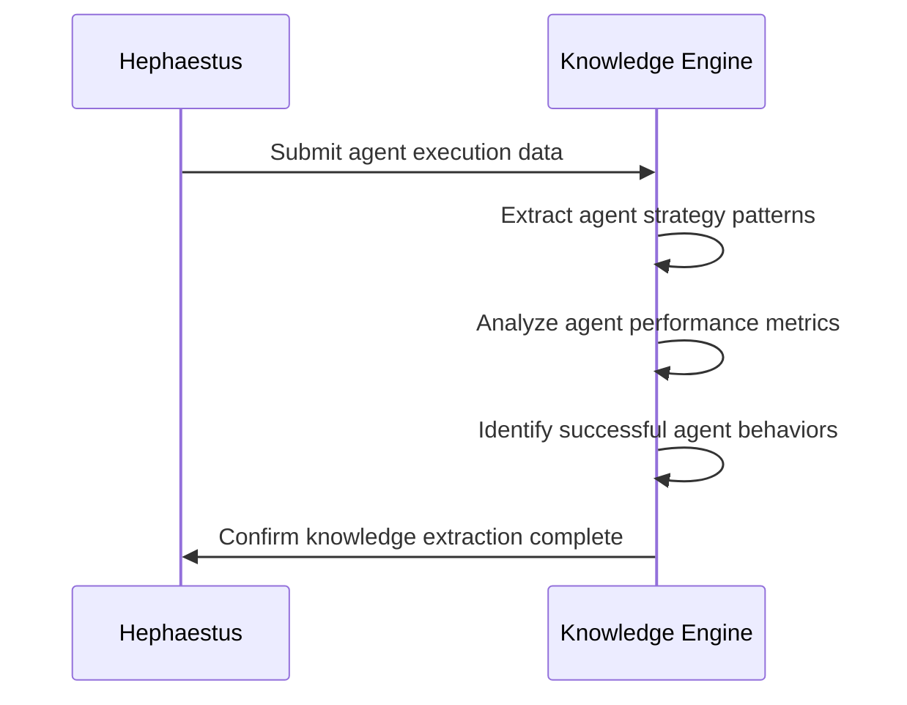
```mermaid
sequenceDiagram
    participant Hephaestus as Hephaestus
    participant KE as Knowledge Engine
    
    Hephaestus->>KE: Submit agent execution data
    KE->>KE: Extract agent strategy patterns
    KE->>KE: Analyze agent performance metrics
    KE->>KE: Identify successful agent behaviors
    KE->>Hephaestus: Confirm knowledge extraction complete
```

**Integration Benefits**:
- Agent strategy pattern extraction
- Performance optimization insights
- Cross-agent knowledge sharing
- Adaptive agent behavior learning

#### 3.4.2 Knowledge-Enhanced Agent Execution

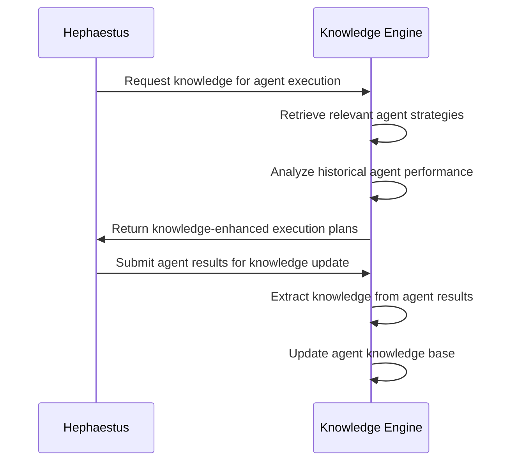
```mermaid
sequenceDiagram
    participant Hephaestus as Hephaestus
    participant KE as Knowledge Engine
    
    Hephaestus->>KE: Request knowledge for agent execution
    KE->>KE: Retrieve relevant agent strategies
    KE->>KE: Analyze historical agent performance
    KE->>Hephaestus: Return knowledge-enhanced execution plans
    
    Hephaestus->>KE: Submit agent results for knowledge update
    KE->>KE: Extract knowledge from agent results
    KE->>KE: Update agent knowledge base
```

**Integration Benefits**:
- Knowledge-based agent strategy selection
- Performance prediction and optimization
- Adaptive agent behavior
- Cross-agent learning

## 4. Cross-System Integration

### 4.1 Integration Architecture

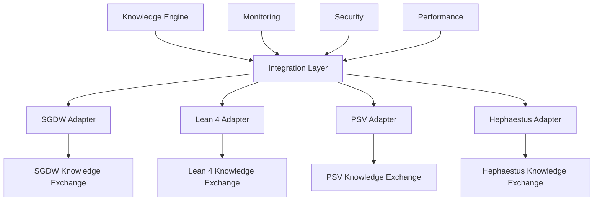
```mermaid
graph TD
    A[Knowledge Engine] --> B[Integration Layer]
    B --> C[SGDW Adapter]
    B --> D[Lean 4 Adapter]
    B --> E[PSV Adapter]
    B --> F[Hephaestus Adapter]
    
    C --> G[SGDW Knowledge Exchange]
    D --> H[Lean 4 Knowledge Exchange]
    E --> I[PSV Knowledge Exchange]
    F --> J[Hephaestus Knowledge Exchange]
    
    K[Monitoring] --> B
    L[Security] --> B
    M[Performance] --> B
```

### 4.2 Integration Components

#### 4.2.1 Integration Adapter Pattern

```python
class IntegrationAdapter:
    def __init__(self, system_name: str):
        self.system_name = system_name
        self.data_transformers = self._initialize_transformers()
        self.error_handlers = self._initialize_error_handlers()
        
    def adapt_to_knowledge_engine(self, system_data: Any) -> KnowledgeArtifact:
        """Adapt system data to knowledge engine format"""
        try:
            # Validate system data
            self._validate_system_data(system_data)
            
            # Transform data structure
            transformed_data = self._transform_data_structure(system_data)
            
            # Create knowledge artifact
            knowledge_artifact = self._create_knowledge_artifact(transformed_data)
            
            return knowledge_artifact
            
        except Exception as e:
            self.error_handlers.handle_error(e, system_data)
            raise IntegrationError(f"Adaptation failed: {str(e)}")
        
    def adapt_from_knowledge_engine(self, knowledge_artifact: KnowledgeArtifact) -> Any:
        """Adapt knowledge artifact to system format"""
        try:
            # Validate knowledge artifact
            self._validate_knowledge_artifact(knowledge_artifact)
            
            # Transform to system format
            system_data = self._transform_to_system_format(knowledge_artifact)
            
            return system_data
            
        except Exception as e:
            self.error_handlers.handle_error(e, knowledge_artifact)
            raise IntegrationError(f"Adaptation failed: {str(e)}")
```

#### 4.2.2 Knowledge Exchange Protocol

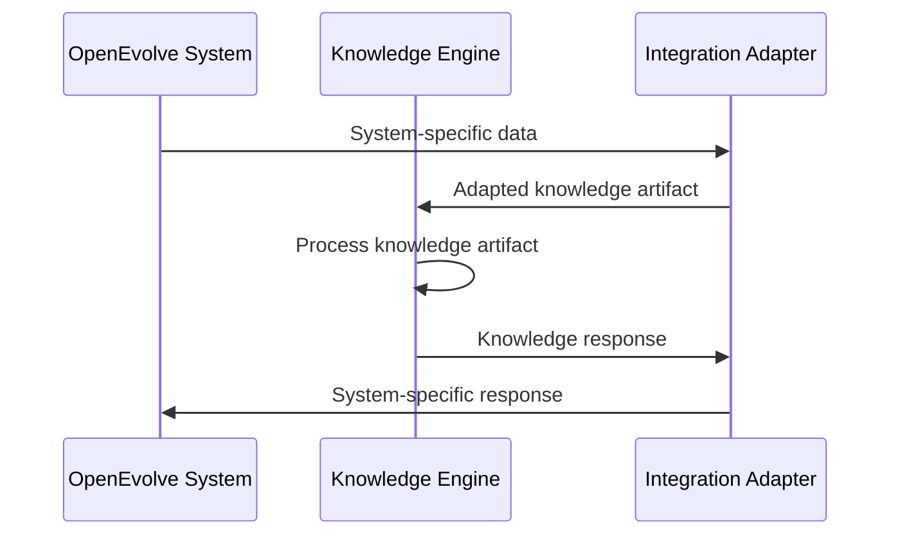
```mermaid
sequenceDiagram
    participant System as OpenEvolve System
    participant KE as Knowledge Engine
    participant Adapter as Integration Adapter
    
    System->>Adapter: System-specific data
    Adapter->>KE: Adapted knowledge artifact
    KE->>KE: Process knowledge artifact
    KE->>Adapter: Knowledge response
    Adapter->>System: System-specific response
```

### 4.3 Cross-System Knowledge Sharing

#### 4.3.1 Knowledge Sharing Architecture

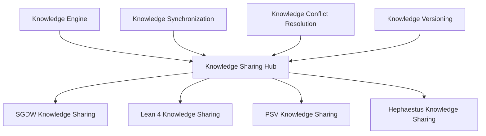
```mermaid
graph TD
    A[Knowledge Engine] --> B[Knowledge Sharing Hub]
    B --> C[SGDW Knowledge Sharing]
    B --> D[Lean 4 Knowledge Sharing]
    B --> E[PSV Knowledge Sharing]
    B --> F[Hephaestus Knowledge Sharing]
    
    G[Knowledge Synchronization] --> B
    H[Knowledge Conflict Resolution] --> B
    I[Knowledge Versioning] --> B
```

#### 4.3.2 Knowledge Synchronization

```python
class KnowledgeSynchronizer:
    def __init__(self):
        self.knowledge_store = KnowledgeStore()
        self.conflict_resolver = ConflictResolver()
        self.version_manager = VersionManager()
        
    def synchronize_knowledge(self, system_name: str, knowledge_artifacts: List[KnowledgeArtifact]):
        """Synchronize knowledge across systems"""
        synchronized_artifacts = []
        
        for artifact in knowledge_artifacts:
            # Check for conflicts
            conflicts = self.conflict_resolver.detect_conflicts(artifact)
            
            if conflicts:
                # Resolve conflicts
                resolved_artifact = self.conflict_resolver.resolve_conflicts(artifact, conflicts)
            else:
                resolved_artifact = artifact
            
            # Version the artifact
            versioned_artifact = self.version_manager.version_artifact(resolved_artifact)
            
            # Store synchronized artifact
            self.knowledge_store.store_artifact(versioned_artifact)
            synchronized_artifacts.append(versioned_artifact)
            
        return synchronized_artifacts
```

## 5. Integration Architecture

### 5.1 High-Level Integration Architecture

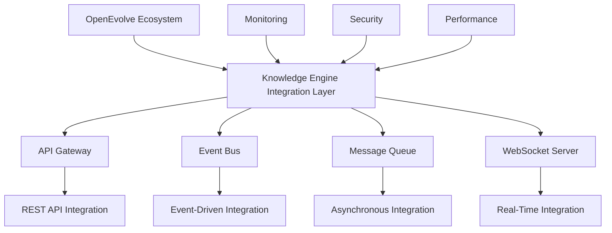
```mermaid
graph TD
    A[OpenEvolve Ecosystem] --> B[Knowledge Engine Integration Layer]
    B --> C[API Gateway]
    B --> D[Event Bus]
    B --> E[Message Queue]
    B --> F[WebSocket Server]
    
    C --> G[REST API Integration]
    D --> H[Event-Driven Integration]
    E --> I[Asynchronous Integration]
    F --> J[Real-Time Integration]
    
    K[Monitoring] --> B
    L[Security] --> B
    M[Performance] --> B
```

### 5.2 Integration Patterns

#### 5.2.1 REST API Integration

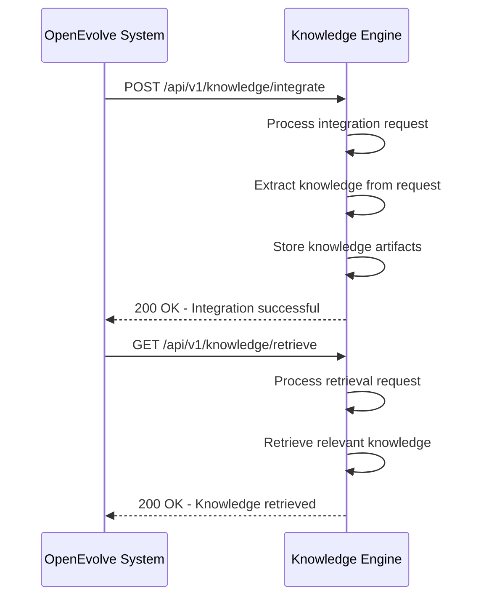
```mermaid
sequenceDiagram
    participant System as OpenEvolve System
    participant KE as Knowledge Engine
    
    System->>KE: POST /api/v1/knowledge/integrate
    KE->>KE: Process integration request
    KE->>KE: Extract knowledge from request
    KE->>KE: Store knowledge artifacts
    KE-->>System: 200 OK - Integration successful
    
    System->>KE: GET /api/v1/knowledge/retrieve
    KE->>KE: Process retrieval request
    KE->>KE: Retrieve relevant knowledge
    KE-->>System: 200 OK - Knowledge retrieved
```

#### 5.2.2 Event-Driven Integration

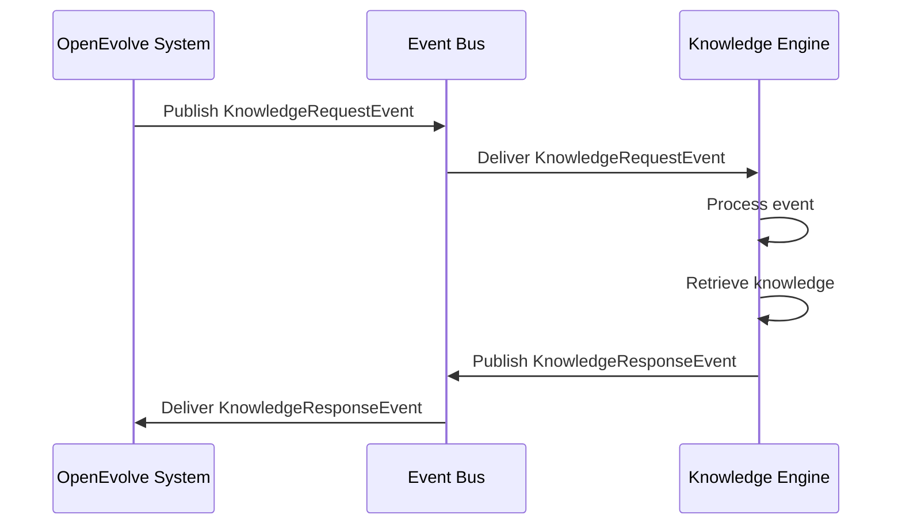
```mermaid
sequenceDiagram
    participant System as OpenEvolve System
    participant EventBus as Event Bus
    participant KE as Knowledge Engine
    
    System->>EventBus: Publish KnowledgeRequestEvent
    EventBus->>KE: Deliver KnowledgeRequestEvent
    KE->>KE: Process event
    KE->>KE: Retrieve knowledge
    KE->>EventBus: Publish KnowledgeResponseEvent
    EventBus->>System: Deliver KnowledgeResponseEvent
```

#### 5.2.3 Asynchronous Integration

```mermaid
sequenceDiagram
    participant System as OpenEvolve System
    participant Queue as Message Queue
    participant KE as Knowledge Engine
    
    System->>Queue: Enqueue KnowledgeRequest
    Queue->>KE: Dequeue KnowledgeRequest
    KE->>KE: Process request
    KE->>KE: Retrieve knowledge
    KE->>Queue: Enqueue KnowledgeResponse
    Queue->>System: Dequeue KnowledgeResponse
```

#### 5.2.4 Real-Time Integration

```mermaid
sequenceDiagram
    participant System as OpenEvolve System
    participant KE as Knowledge Engine
    
    System->>KE: WebSocket Connection
    KE-->>System: Connection Established
    
    loop Real-Time Updates
        KE->>System: Knowledge Update Notification
        System->>KE: Knowledge Retrieval Request
        KE-->>System: Knowledge Data
    end
```

### 5.3 Integration Best Practices

1. **Standardized Data Formats**: Use consistent data schemas across systems
2. **Error Handling**: Implement robust error handling and recovery
3. **Performance Optimization**: Optimize integration for low latency
4. **Security**: Implement authentication and authorization
5. **Monitoring**: Track integration performance and health
6. **Documentation**: Document all integration points and protocols

## 6. Integration Patterns

### 6.1 Adapter Pattern

```python
class SystemAdapter:
    def __init__(self, system_name: str):
        self.system_name = system_name
        self.adapters = self._initialize_adapters()
        
    def adapt(self, data: Any, direction: str) -> Any:
        """Adapt data between system and knowledge engine"""
        adapter = self.adapters.get(direction)
        if not adapter:
            raise IntegrationError(f"No adapter for direction: {direction}")
        
        return adapter.adapt(data)
```

### 6.2 Facade Pattern

```python
class KnowledgeEngineFacade:
    def __init__(self):
        self.integration_layer = IntegrationLayer()
        self.knowledge_manager = KnowledgeManager()
        
    def integrate_system(self, system_name: str, data: Any) -> Any:
        """Provide simplified interface for system integration"""
        # Adapt data to knowledge engine format
        adapted_data = self.integration_layer.adapt_to_knowledge_engine(system_name, data)
        
        # Process data in knowledge engine
        result = self.knowledge_manager.process(adapted_data)
        
        # Adapt result back to system format
        system_result = self.integration_layer.adapt_from_knowledge_engine(system_name, result)
        
        return system_result
```

### 6.3 Observer Pattern

```python
class KnowledgeObserver:
    def __init__(self):
        self.observers = {}
        
    def register_observer(self, system_name: str, observer: Observer):
        """Register an observer for knowledge updates"""
        self.observers[system_name] = observer
        
    def notify_observers(self, knowledge_update: KnowledgeUpdate):
        """Notify all observers of knowledge updates"""
        for system_name, observer in self.observers.items():
            observer.update(knowledge_update)
```

### 6.4 Strategy Pattern

```python
class IntegrationStrategy:
    def __init__(self):
        self.strategies = {}
        
    def add_strategy(self, system_name: str, strategy: IntegrationStrategy):
        """Add integration strategy for a system"""
        self.strategies[system_name] = strategy
        
    def integrate(self, system_name: str, data: Any) -> Any:
        """Integrate using appropriate strategy"""
        strategy = self.strategies.get(system_name)
        if not strategy:
            raise IntegrationError(f"No strategy for system: {system_name}")
        
        return strategy.integrate(data)
```

## 7. Data Flow and Knowledge Exchange

### 7.1 Knowledge Flow Architecture

```mermaid
flowchart TD
    A[System Execution] --> B[Data Extraction]
    B --> C[Knowledge Creation]
    C --> D[Knowledge Storage]
    D --> E[Knowledge Retrieval]
    E --> F[Enhanced Execution]
    F --> A
    
    G[Cross-System Sharing] --> D
    H[Knowledge Learning] --> D
    I[Performance Optimization] --> E
```

### 7.2 Data Flow Patterns

#### 7.2.1 Unidirectional Data Flow

```mermaid
flowchart TD
    A[System] --> B[Knowledge Engine]
    B --> C[Processed Data]
```

#### 7.2.2 Bidirectional Data Flow

```mermaid
flowchart TD
    A[System] -->|Data| B[Knowledge Engine]
    B -->|Enhanced Data| A
```

#### 7.2.3 Multi-System Data Flow

```mermaid
flowchart TD
    A[System 1] --> B[Knowledge Engine]
    C[System 2] --> B
    D[System 3] --> B
    B --> A
    B --> C
    B --> D
```

### 7.3 Knowledge Exchange Protocols

#### 7.3.1 JSON-Based Exchange

```json
{
  "knowledge_request": {
    "system": "SGDW",
    "request_type": "solution_patterns",
    "context": {
      "problem_type": "mathematical_optimization",
      "domain": "algebra",
      "complexity": 7
    }
  }
}
```

#### 7.3.2 Binary Exchange

```python
class KnowledgeRequest:
    def __init__(self, system: str, request_type: str, context: dict):
        self.system = system
        self.request_type = request_type
        self.context = context
        
    def serialize(self) -> bytes:
        """Serialize request to binary format"""
        return pickle.dumps(self.__dict__)
        
    @classmethod
    def deserialize(cls, data: bytes):
        """Deserialize request from binary format"""
        return cls(**pickle.loads(data))
```

#### 7.3.3 Protocol Buffers Exchange

```protobuf
message KnowledgeRequest {
    string system = 1;
    string request_type = 2;
    map<string, string> context = 3;
}
```

### 7.4 Knowledge Exchange Optimization

1. **Data Compression**: Compress knowledge data for efficient transfer
2. **Batch Processing**: Process multiple knowledge requests in batches
3. **Caching**: Cache frequently accessed knowledge
4. **Delta Updates**: Transfer only changed knowledge
5. **Prioritization**: Prioritize critical knowledge updates

## 8. Performance Optimization

### 8.1 Performance Optimization Strategies

#### 8.1.1 Caching Strategies

```mermaid
graph TD
    A[Knowledge Request] --> B[Cache Check]
    B -->|Hit| C[Return Cached Knowledge]
    B -->|Miss| D[Retrieve from Storage]
    D --> E[Store in Cache]
    E --> F[Return Knowledge]
```

#### 8.1.2 Parallel Processing

```mermaid
graph TD
    A[Batch Request] --> B[Request Splitter]
    B --> C[Parallel Workers]
    C --> D[Worker 1]
    C --> E[Worker 2]
    C --> F[Worker N]
    D --> G[Result Aggregator]
    E --> G
    F --> G
    G --> H[Final Result]
```

#### 8.1.3 Load Balancing

```mermaid
graph TD
    A[Requests] --> B[Load Balancer]
    B --> C[Service Instance 1]
    B --> D[Service Instance 2]
    B --> E[Service Instance N]
    C --> F[Response]
    D --> F
    E --> F
```

### 8.2 Performance Monitoring

```mermaid
graph TD
    A[Knowledge Engine] --> B[Metrics Collection]
    B --> C[Performance Metrics]
    B --> D[Resource Metrics]
    B --> E[Error Metrics]
    
    C --> F[Latency Tracking]
    C --> G[Throughput Tracking]
    C --> H[Cache Hit Ratio]
    
    D --> I[CPU Usage]
    D --> J[Memory Usage]
    D --> K[Storage Usage]
    
    E --> L[Error Rates]
    E --> M[Error Types]
    E --> N[Error Trends]
    
    F --> O[Prometheus]
    G --> O
    H --> O
    I --> O
    J --> O
    K --> O
    L --> O
    M --> O
    N --> O
    
    O --> P[Grafana Dashboard]
    O --> Q[Alert Manager]
```

### 8.3 Performance Optimization Techniques

1. **Indexing**: Optimize database queries with proper indexing
2. **Query Optimization**: Analyze and optimize slow queries
3. **Connection Pooling**: Reuse database connections
4. **Asynchronous Processing**: Use async/await for I/O operations
5. **Memory Optimization**: Minimize memory usage and leaks
6. **Network Optimization**: Reduce network overhead

## 9. Security and Compliance

### 9.1 Security Architecture

```mermaid
graph TD
    A[Client] -->|HTTPS| B[API Gateway]
    B --> C[Authentication Service]
    C -->|JWT Token| B
    B --> D[Rate Limiter]
    D -->|Rate Limit Check| B
    B --> E[Request Validator]
    E -->|Validated Request| F[Knowledge Engine]
    
    F --> G[Authorization Service]
    G -->|Access Decision| F
    F --> H[Knowledge Services]
    
    I[Audit Logger] --> F
    J[Secret Manager] --> F
    K[Security Monitor] --> F
    
    L[Encryption] --> H
    M[Access Control] --> H
    N[Data Protection] --> H
```

### 9.2 Security Measures

1. **Authentication**: JWT-based authentication with OAuth2 support
2. **Authorization**: Role-based access control with fine-grained permissions
3. **Data Encryption**: AES-256 encryption for data at rest and TLS 1.3 for data in transit
4. **Audit Logging**: Comprehensive logging of all knowledge operations
5. **Rate Limiting**: Protection against abuse and DDoS attacks
6. **Input Validation**: Validation of all incoming data
7. **Secret Management**: Secure storage of sensitive information

### 9.3 Compliance Requirements

1. **Data Retention**: Compliance with data retention policies
2. **Privacy Protection**: Protection of sensitive and personal information
3. **Regulatory Compliance**: Compliance with relevant regulations (GDPR, CCPA, etc.)
4. **Audit Trails**: Complete audit trails for all operations
5. **Access Control**: Fine-grained access control and permissions

## 10. Monitoring and Observability

### 10.1 Monitoring Architecture

```mermaid
graph TD
    A[Knowledge Engine Components] --> B[Metrics Collection]
    B --> C[Prometheus Server]
    C --> D[Grafana Dashboard]
    C --> E[Alert Manager]
    E --> F[Notification Services]
    
    G[Application Logs] --> H[Log Aggregation]
    H --> I[ELK Stack]
    I --> J[Log Analysis]
    I --> K[Log Visualization]
    
    L[Distributed Tracing] --> M[Jaeger]
    M --> N[Trace Analysis]
    M --> O[Trace Visualization]
    
    P[Health Checks] --> Q[Status Monitoring]
    Q --> R[Health Dashboard]
    Q --> S[Incident Detection]
```

### 10.2 Monitoring Components

#### 10.2.1 Metrics Collection

```python
class KnowledgeEngineMetrics:
    def __init__(self):
        self.metrics = {
            'knowledge_extraction_time': Histogram(
                'knowledge_extraction_time',
                'Time taken for knowledge extraction',
                buckets=[0.1, 0.5, 1.0, 2.0, 5.0, 10.0]
            ),
            'knowledge_retrieval_time': Histogram(
                'knowledge_retrieval_time',
                'Time taken for knowledge retrieval',
                buckets=[0.05, 0.1, 0.2, 0.5, 1.0, 2.0]
            ),
            'api_response_time': Histogram(
                'api_response_time',
                'Time taken for API responses',
                buckets=[0.05, 0.1, 0.2, 0.5, 1.0, 2.0]
            ),
            'cache_hit_ratio': Gauge(
                'cache_hit_ratio',
                'Cache hit ratio'
            ),
            'error_count': Counter(
                'error_count',
                'Number of errors',
                ['error_type', 'component']
            )
        }
```

#### 10.2.2 Alerting System

```python
class KnowledgeEngineAlertManager:
    def __init__(self, alert_rules: List[AlertRule]):
        self.alert_rules = alert_rules
        self.notification_services = []
        
    def evaluate_metrics(self, metrics: Dict[str, float]):
        """Evaluate metrics against alert rules"""
        triggered_alerts = []
        
        for rule in self.alert_rules:
            if self._evaluate_rule(rule, metrics):
                triggered_alerts.append(rule)
                
        return triggered_alerts
```

#### 10.2.3 Observability Dashboard

```mermaid
graph TD
    A[Grafana Dashboard] --> B[Overview Panel]
    B --> C[System Health]
    B --> D[Performance Metrics]
    B --> E[Resource Utilization]
    
    A --> F[Knowledge Extraction Panel]
    F --> G[Extraction Throughput]
    F --> H[Extraction Latency]
    F --> I[Extraction Error Rates]
    
    A --> J[Knowledge Retrieval Panel]
    J --> K[Retrieval Latency]
    J --> L[Search Performance]
    J --> M[Cache Hit Ratio]
    
    A --> N[Integration Panel]
    N --> O[Integration Metrics]
    N --> P[Cross-System Performance]
    N --> Q[Integration Health]
```

## Conclusion

The OpenEvolve Knowledge Engine integration guide provides a comprehensive overview of how the Knowledge Engine integrates with the broader OpenEvolve ecosystem. By following the integration patterns, best practices, and architectural guidelines outlined in this document, the Knowledge Engine can effectively serve as the cognitive core of the OpenEvolve system.

Key takeaways from this guide:

1. **Comprehensive Integration**: The Knowledge Engine integrates with all major OpenEvolve components (SGDW, Lean 4, PSV, Hephaestus)
2. **Stage-by-Stage Knowledge Contribution**: Knowledge is contributed at every stage of the problem-solving workflow
3. **Cross-System Learning**: Knowledge is shared and reused across all systems for continuous improvement
4. **Performance Optimization**: Integration is designed for high performance and scalability
5. **Security and Compliance**: Integration includes comprehensive security measures and compliance features
6. **Monitoring and Observability**: Complete monitoring ensures system health and performance

This integration enables the OpenEvolve ecosystem to achieve its vision of autonomous, self-improving problem-solving capabilities through systematic knowledge accumulation and reuse.
