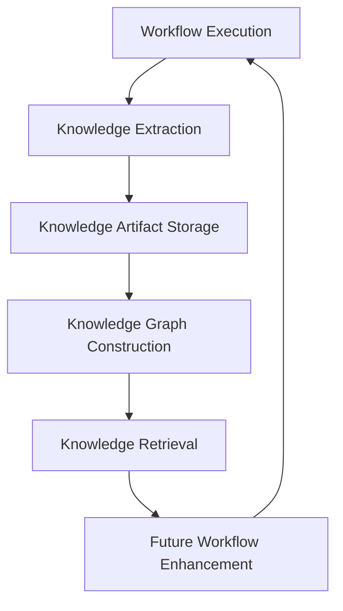
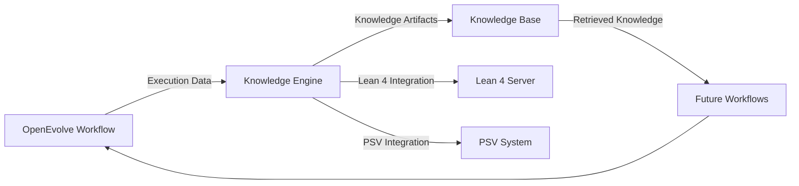
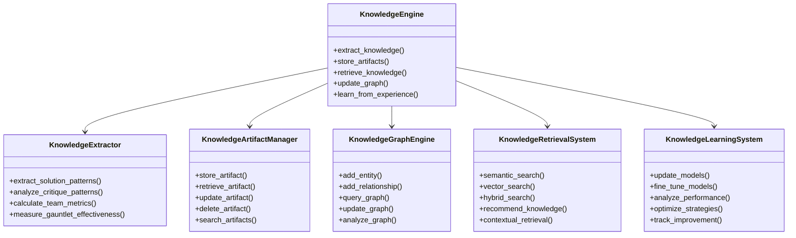
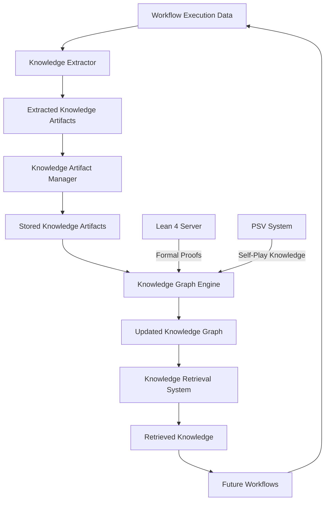
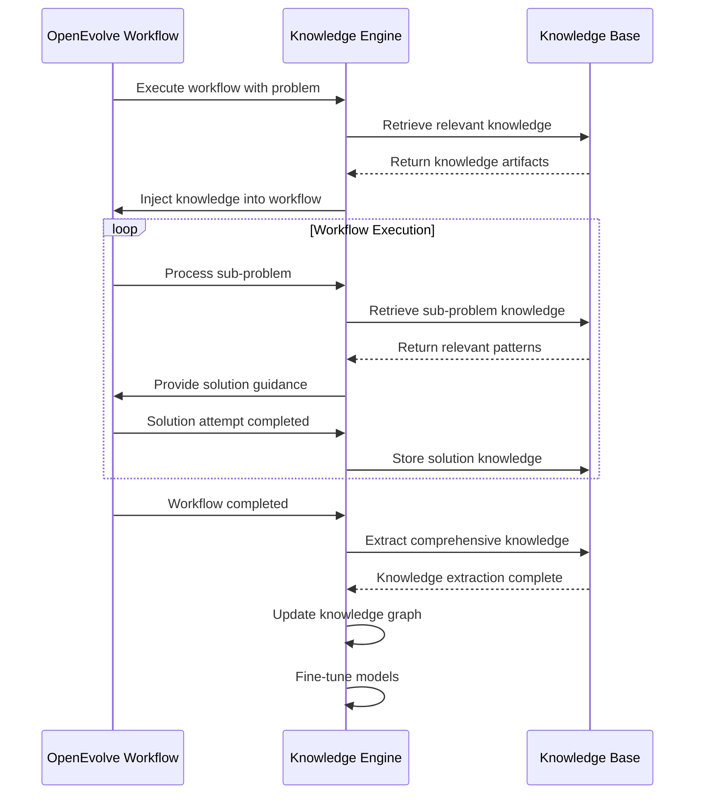
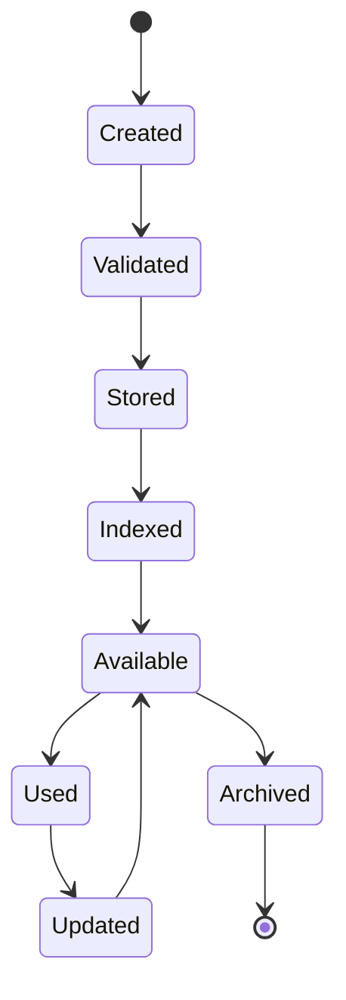

# OpenEvolve Knowledge Engine - Comprehensive Documentation

## Table of Contents

1. [Executive Summary](#1-executive-summary)
2. [Knowledge Engine Overview](#2-knowledge-engine-overview)
3. [Technical Architecture](#3-technical-architecture)
4. [Core Components](#4-core-components)
5. [Integration with OpenEvolve Workflow](#5-integration-with-openevolve-workflow)
6. [Knowledge Artifact Management](#6-knowledge-artifact-management)
7. [Implementation Roadmap](#7-implementation-roadmap)
8. [Advanced Features](#8-advanced-features)
9. [Performance Optimization](#9-performance-optimization)
10. [Security and Compliance](#10-security-and-compliance)

## 1. Executive Summary

### 1.1 Purpose

The OpenEvolve Knowledge Engine is a sophisticated knowledge management system designed to extract, store, and utilize knowledge from the Sovereign-Grade Decomposition Workflow (SGDW). It serves as the cognitive memory and learning system for the entire OpenEvolve ecosystem, enabling continuous improvement through systematic knowledge extraction and application.

### 1.2 Key Capabilities

- **Knowledge Artifact Extraction**: Extracts valuable knowledge from workflow executions
- **Semantic Knowledge Base**: Stores knowledge in a structured, searchable format
- **Knowledge Graph**: Maintains relationships between mathematical concepts and solutions
- **Knowledge Retrieval**: Provides efficient access to relevant knowledge during problem-solving
- **Knowledge Learning**: Enables the system to learn from past experiences
- **Knowledge Evolution**: Tracks knowledge changes and improvements over time
- **Cross-System Integration**: Integrates with Lean 4, PSV, and other OpenEvolve components

### 1.3 Strategic Importance

The Knowledge Engine is the foundation for OpenEvolve's self-improving capabilities. By systematically capturing and reusing knowledge from every workflow execution, it enables:

- **Continuous Learning**: The system improves with each problem solved
- **Knowledge Reuse**: Past solutions inform future problem-solving
- **Quality Improvement**: Lessons learned prevent repeated mistakes
- **Efficiency Gains**: Reusing proven approaches reduces computational costs
- **Mathematical Rigor**: Formal knowledge representation ensures correctness

## 2. Knowledge Engine Overview

### 2.1 Core Concepts

#### 2.1.1 Knowledge Artifacts

Knowledge artifacts are the fundamental units of knowledge stored in the Knowledge Engine. They represent reusable patterns, solutions, and insights extracted from workflow executions.

#### 2.1.2 Knowledge Graph

The knowledge graph maintains semantic relationships between mathematical concepts, theorems, proof techniques, and solution approaches. It enables sophisticated reasoning and knowledge discovery.

#### 2.1.3 Knowledge Extraction Pipeline

The extraction pipeline processes workflow execution data to identify valuable knowledge patterns and store them as knowledge artifacts.

### 2.2 System Architecture



### 2.3 Key Components

- **Knowledge Extractor**: Identifies and extracts knowledge patterns
- **Knowledge Artifact Manager**: Stores and manages knowledge artifacts
- **Knowledge Graph Engine**: Maintains semantic relationships
- **Knowledge Retrieval System**: Provides efficient knowledge access
- **Knowledge Learning System**: Enables continuous improvement
- **Knowledge Evolution Tracker**: Monitors knowledge changes over time

## 3. Technical Architecture

### 3.1 High-Level Architecture



### 3.2 Component Architecture



### 3.3 Data Flow



## 4. Core Components

### 4.1 Knowledge Extractor

#### 4.1.1 Solution Pattern Extraction

```python
class SolutionPatternExtractor:
    def __init__(self, clustering_algorithm='dbscan', similarity_threshold=0.85):
        self.clustering_algorithm = clustering_algorithm
        self.similarity_threshold = similarity_threshold
        self.vectorizer = SolutionVectorizer()
        
    def extract_patterns(self, solutions: List[SolutionAttempt]) -> List[SolutionPattern]:
        """Extract common solution patterns using clustering algorithms"""
        # Vectorize solutions for clustering
        solution_vectors = self.vectorizer.vectorize(solutions)
        
        # Apply clustering algorithm
        clusters = self._perform_clustering(solution_vectors)
        
        # Create patterns from clusters
        patterns = []
        for cluster_id, solution_indices in clusters.items():
            cluster_solutions = [solutions[i] for i in solution_indices]
            pattern = self._create_pattern(cluster_solutions)
            patterns.append(pattern)
            
        return patterns
```

#### 4.1.2 Critique Insight Analysis

```python
class CritiqueInsightAnalyzer:
    def __init__(self, nlp_model='en_core_web_lg'):
        self.nlp = spacy.load(nlp_model)
        self.insight_extractor = InsightExtractor()
        
    def analyze_critiques(self, critique_reports: List[CritiqueReport]) -> List[CritiqueInsight]:
        """Analyze critique reports to extract valuable insights"""
        insights = []
        
        for report in critique_reports:
            # Extract insights using NLP
            extracted_insights = self.insight_extractor.extract(report.summary)
            
            for insight in extracted_insights:
                critique_insight = CritiqueInsight(
                    issue_type=insight['type'],
                    root_cause=insight['cause'],
                    prevention_strategy=insight['prevention'],
                    domain=insight['domain'],
                    severity=insight['severity']
                )
                insights.append(critique_insight)
                
        return insights
```

### 4.2 Knowledge Artifact Manager

#### 4.2.1 Artifact Storage System

```python
class KnowledgeArtifactStorage:
    def __init__(self, storage_backend='qdrant', collection_name='knowledge_artifacts'):
        self.storage_backend = storage_backend
        self.collection_name = collection_name
        self._initialize_storage()
        
    def store_artifact(self, artifact: KnowledgeArtifact) -> str:
        """Store a knowledge artifact with metadata and vector embeddings"""
        # Generate vector embedding for semantic search
        artifact_embedding = self._generate_embedding(artifact)
        
        # Store in vector database
        artifact_id = f"artifact_{uuid.uuid4()}"
        
        self._store_in_backend(artifact_id, artifact, artifact_embedding)
        
        return artifact_id
        
    def retrieve_artifact(self, artifact_id: str) -> KnowledgeArtifact:
        """Retrieve a knowledge artifact by ID"""
        return self._retrieve_from_backend(artifact_id)
```

### 4.3 Knowledge Graph Engine

#### 4.3.1 Graph Construction

```python
class KnowledgeGraphConstructor:
    def __init__(self, graph_backend='neo4j'):
        self.graph_backend = graph_backend
        self._initialize_graph()
        
    def add_knowledge_relationship(self, source_artifact: KnowledgeArtifact, 
                                  target_artifact: KnowledgeArtifact, 
                                  relationship_type: str, 
                                  properties: Dict[str, Any]) -> str:
        """Add a relationship between knowledge artifacts"""
        relationship_id = f"rel_{uuid.uuid4()}"
        
        # Add nodes if they don't exist
        self._ensure_node_exists(source_artifact)
        self._ensure_node_exists(target_artifact)
        
        # Create relationship
        self._create_relationship(
            source_artifact.id,
            target_artifact.id,
            relationship_type,
            properties,
            relationship_id
        )
        
        return relationship_id
```

### 4.4 Knowledge Retrieval System

#### 4.4.1 Semantic Search

```python
class SemanticSearchEngine:
    def __init__(self, vector_store, embedding_model='text-embedding-ada-002'):
        self.vector_store = vector_store
        self.embedding_model = embedding_model
        self.embedding_cache = TTLCache(maxsize=10000, ttl=3600)
        
    def semantic_search(self, query: str, top_k: int = 10, 
                       filters: Dict[str, Any] = None) -> List[SearchResult]:
        """Perform semantic search using vector embeddings"""
        # Generate query embedding
        query_embedding = self._generate_query_embedding(query)
        
        # Perform vector search
        results = self.vector_store.search(
            query_embedding,
            top_k=top_k,
            filters=filters
        )
        
        # Process and rank results
        processed_results = self._process_results(results)
        
        return processed_results
```

### 4.5 Knowledge Learning System

#### 4.5.1 Model Fine-Tuning

```python
class KnowledgeLearningSystem:
    def __init__(self, model_registry, fine_tuning_config):
        self.model_registry = model_registry
        self.fine_tuning_config = fine_tuning_config
        self.performance_tracker = PerformanceTracker()
        
    async def fine_tune_models(self, knowledge_artifacts: List[KnowledgeArtifact]) -> FineTuningResult:
        """Fine-tune models using extracted knowledge artifacts"""
        # Identify models that need fine-tuning
        models_to_tune = self._identify_models_for_fine_tuning(knowledge_artifacts)
        
        results = []
        
        for model_config in models_to_tune:
            # Prepare training data
            training_data = self._prepare_training_data(model_config, knowledge_artifacts)
            
            # Perform fine-tuning
            fine_tuning_result = await self._perform_fine_tuning(model_config, training_data)
            
            # Validate and register
            if self._validate_fine_tuning(fine_tuning_result):
                self.model_registry.register_updated_model(fine_tuning_result)
                results.append(fine_tuning_result)
                
        return FineTuningResult(
            models_updated=[r.model_name for r in results],
            performance_improvements=[r.performance_improvement for r in results]
        )
```

## 5. Integration with OpenEvolve Workflow

### 5.1 Stage-by-Stage Integration

#### 5.1.1 Stage 0: Content Analysis

- **Knowledge Injection**: Injects relevant mathematical knowledge into problem analysis
- **Domain Identification**: Uses knowledge graph to identify mathematical domains
- **Context Enrichment**: Enhances problem context with related mathematical concepts

#### 5.1.2 Stage 1: AI-Assisted Decomposition

- **Pattern-Based Decomposition**: Uses solution patterns to guide decomposition
- **Domain-Specific Strategies**: Applies domain-specific decomposition approaches
- **Complexity Estimation**: Uses historical knowledge to estimate sub-problem complexity

#### 5.1.3 Stage 3: Sub-Problem Solving Loop

- **Solution Pattern Retrieval**: Retrieves relevant solution patterns for current sub-problem
- **Critique Pattern Application**: Applies learned critique patterns to identify potential issues
- **Verification Knowledge**: Uses verification knowledge to guide solution validation

#### 5.1.4 Stage 5: Final Verification

- **Cross-Validation**: Uses knowledge base to cross-validate final solutions
- **Pattern Matching**: Identifies known solution patterns in final output
- **Quality Assessment**: Applies learned quality metrics to final verification

#### 5.1.5 Stage 6: Knowledge Extraction & Learning

- **Comprehensive Extraction**: Extracts knowledge from all workflow stages
- **Knowledge Artifact Creation**: Creates knowledge artifacts from successful solutions
- **Knowledge Graph Updates**: Updates knowledge graph with new relationships
- **Model Fine-Tuning**: Fine-tunes models using extracted knowledge

### 5.2 Integration Architecture



## 6. Knowledge Artifact Management

### 6.1 Knowledge Artifact Schema

```python
@dataclass
class KnowledgeArtifact:
    """Represents a piece of knowledge extracted from workflow execution"""
    id: str  # Unique identifier
    artifact_type: str  # Type of knowledge artifact
    content: Dict[str, Any]  # Content of the artifact
    source_workflow_id: str  # Source workflow
    extraction_timestamp: float  # When extracted
    domain: Optional[str] = None  # Mathematical domain
    problem_type: Optional[str] = None  # Problem type
    usage_count: int = 0  # Usage statistics
    effectiveness_score: float = 0.0  # Effectiveness rating
    related_artifacts: List[str] = field(default_factory=list)  # Related artifacts
    vector_embedding: Optional[List[float]] = None  # For semantic search
    metadata: Dict[str, Any] = field(default_factory=dict)  # Additional metadata
```

### 6.2 Artifact Types

| Artifact Type | Description | Example Content |
|---------------|-------------|-----------------|
| `solution_pattern` | Reusable solution patterns | Code templates, proof strategies |
| `problem_solution_mapping` | Problem-to-solution mappings | Problem characteristics → solution approaches |
| `critique_insight` | Critique patterns and insights | Common failure modes, prevention strategies |
| `team_performance` | Team performance metrics | Success rates, efficiency metrics |
| `gauntlet_effectiveness` | Gauntlet effectiveness data | Detection rates, false positive rates |
| `process_optimization` | Process optimization insights | Bottleneck identification, resource optimization |
| `failure_learning` | Failure prevention knowledge | Root cause analysis, prevention strategies |
| `mathematical_theorem` | Formal mathematical theorems | Theorem statements, proofs |
| `proof_strategy` | Mathematical proof strategies | Proof techniques, tactic sequences |
| `domain_knowledge` | Domain-specific knowledge | Algebraic identities, analysis theorems |

### 6.3 Artifact Lifecycle



## 7. Implementation Roadmap

### 7.1 Phase 1: Core Infrastructure (Weeks 1-4)

- **Knowledge Artifact Schema**: Define comprehensive artifact schema
- **Storage Backend**: Implement vector database storage (Qdrant)
- **Basic Extraction**: Implement solution pattern extraction
- **Retrieval System**: Create basic semantic search capabilities
- **Integration Framework**: Develop workflow integration framework

### 7.2 Phase 2: Advanced Extraction (Weeks 5-8)

- **Critique Pattern Analysis**: Implement critique insight extraction
- **Team Performance Tracking**: Add team performance metrics
- **Gauntlet Effectiveness**: Implement gauntlet effectiveness measurement
- **Knowledge Graph**: Create knowledge graph construction
- **Lean 4 Integration**: Integrate with Lean 4 verification system

### 7.3 Phase 3: Learning System (Weeks 9-12)

- **Model Fine-Tuning**: Implement model fine-tuning pipeline
- **Performance Tracking**: Add performance monitoring
- **Knowledge Evolution**: Implement knowledge evolution tracking
- **PSV Integration**: Integrate with PSV self-play system
- **Advanced Analytics**: Create comprehensive analytics dashboard

### 7.4 Phase 4: Optimization & Scaling (Weeks 13-16)

- **Performance Optimization**: Optimize knowledge retrieval speed
- **Caching Strategies**: Implement intelligent caching
- **Load Balancing**: Add load balancing for distributed operation
- **Security Implementation**: Implement security and access control
- **Compliance Features**: Add compliance and audit capabilities

### 7.5 Phase 5: Production Readiness (Weeks 17-20)

- **Comprehensive Testing**: End-to-end testing
- **Monitoring Integration**: Add monitoring and alerting
- **Documentation**: Complete documentation
- **Deployment Pipelines**: Create deployment automation
- **User Training**: Develop training materials

## 8. Advanced Features

### 8.1 Mathematical Knowledge Graph

- **Entity Relationship Mapping**: Connects mathematical concepts and theorems
- **Proof Strategy Indexing**: Maps proof strategies to problem types
- **Cross-Domain Knowledge Transfer**: Enables transfer learning between domains
- **Knowledge Evolution Tracking**: Tracks knowledge changes over time

### 8.2 Self-Improving Knowledge Base

- **Automatic Knowledge Extraction**: Extracts knowledge from every workflow
- **Quality-Based Learning**: Learns from high-quality verified solutions
- **Error Prevention**: Identifies and prevents common failure patterns
- **Continuous Optimization**: Continuously improves knowledge retrieval

### 8.3 Cross-System Integration

- **Lean 4 Integration**: Formal verification of mathematical knowledge
- **PSV Integration**: Self-play knowledge generation
- **crewai Integration**: Agent-based knowledge application
- **Multi-System Learning**: Learns from all OpenEvolve components

### 8.4 Advanced Analytics

- **Knowledge Usage Analytics**: Tracks knowledge artifact usage patterns
- **Performance Impact Analysis**: Measures knowledge impact on workflow performance
- **Knowledge Gap Identification**: Identifies areas needing more knowledge
- **Trend Analysis**: Analyzes knowledge evolution trends

## 9. Performance Optimization

### 9.1 Caching Strategies

- **Vector Embedding Cache**: Caches frequently used vector embeddings
- **Knowledge Artifact Cache**: Caches frequently retrieved artifacts
- **Query Result Cache**: Caches common search query results
- **Knowledge Graph Cache**: Caches frequently accessed graph relationships

### 9.2 Parallel Processing

- **Parallel Extraction**: Processes multiple workflows simultaneously
- **Batch Processing**: Groups similar operations for efficiency
- **Distributed Search**: Distributes search operations across nodes
- **Asynchronous Updates**: Performs non-critical updates asynchronously

### 9.3 Resource Optimization

- **Memory Management**: Optimizes memory usage for large knowledge bases
- **CPU Optimization**: Efficiently utilizes CPU resources
- **Storage Optimization**: Minimizes storage requirements
- **Network Optimization**: Reduces network overhead

## 10. Security and Compliance

### 10.1 Security Features

- **Access Control**: Role-based access to knowledge artifacts
- **Data Encryption**: Encrypts sensitive knowledge data
- **Audit Logging**: Comprehensive logging of knowledge operations
- **Authentication**: Secure authentication mechanisms

### 10.2 Compliance Features

- **Data Retention**: Compliance with data retention policies
- **Privacy Protection**: Protection of sensitive information
- **Regulatory Compliance**: Compliance with relevant regulations
- **Audit Trails**: Complete audit trails for all operations

## 11. Conclusion

The OpenEvolve Knowledge Engine represents a paradigm shift in AI problem-solving systems. By systematically capturing, organizing, and reusing knowledge from every workflow execution, it enables continuous improvement and self-learning capabilities that are essential for solving complex, intractable problems.

The Knowledge Engine's integration with the Sovereign-Grade Decomposition Workflow, Lean 4 formal verification, and PSV self-play systems creates a powerful synergy that combines structured problem-solving with emergent discovery and formal mathematical rigor.

As the Knowledge Engine evolves, it will become the cognitive core of the OpenEvolve ecosystem, enabling increasingly sophisticated problem-solving capabilities and driving the system toward true autonomous intelligence.
