# OpenEvolve Knowledge Engine - Technical Architecture

## Table of Contents

1. [Architecture Overview](#1-architecture-overview)
2. [Component Architecture](#2-component-architecture)
3. [Data Architecture](#3-data-architecture)
4. [Integration Architecture](#4-integration-architecture)
5. [Performance Architecture](#5-performance-architecture)
6. [Security Architecture](#6-security-architecture)
7. [Deployment Architecture](#7-deployment-architecture)
8. [Monitoring and Observability](#8-monitoring-and-observability)
9. [Error Handling and Resilience](#9-error-handling-and-resilience)
10. [Scalability Architecture](#10-scalability-architecture)

## 1. Architecture Overview

### 1.1 High-Level Architecture

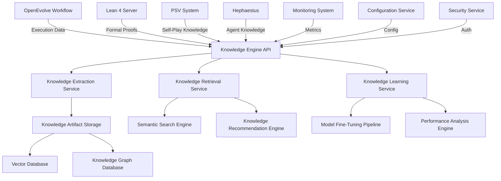

### 1.2 Architecture Principles

1. **Modular Design**: Components are designed as independent services with well-defined interfaces
2. **Scalability**: Architecture supports horizontal scaling for all major components
3. **Resilience**: Built-in fault tolerance and recovery mechanisms
4. **Performance**: Optimized for low-latency knowledge retrieval and high-throughput processing
5. **Security**: Comprehensive security measures at all levels
6. **Observability**: Complete monitoring and logging capabilities
7. **Extensibility**: Designed for easy addition of new knowledge types and services

### 1.3 Technology Stack

| Category | Technology | Purpose |
|----------|------------|---------|
| **Backend Framework** | FastAPI | REST API and service framework |
| **Vector Database** | Qdrant | Vector embeddings and semantic search |
| **Graph Database** | Neo4j | Knowledge graph storage and querying |
| **Document Storage** | MongoDB | Knowledge artifact storage |
| **Search Engine** | Elasticsearch | Full-text and hybrid search |
| **Message Queue** | Redis | Asynchronous processing and caching |
| **Containerization** | Docker | Container runtime |
| **Orchestration** | Kubernetes | Container orchestration |
| **Monitoring** | Prometheus/Grafana | Metrics collection and visualization |
| **Logging** | ELK Stack | Log aggregation and analysis |
| **Tracing** | Jaeger | Distributed tracing |
| **Authentication** | JWT/OAuth2 | Security and access control |
| **Configuration** | Consul | Dynamic configuration management |

## 2. Component Architecture

### 2.1 Knowledge Engine API

#### 2.1.1 API Endpoints

```python
class KnowledgeEngineAPI:
    def __init__(self):
        self.router = APIRouter(prefix="/api/v1/knowledge", tags=["knowledge"])
        self._setup_routes()
        
    def _setup_routes(self):
        # Knowledge Artifact Endpoints
        self.router.add_api_route("/artifacts", self.create_artifact, methods=["POST"])
        self.router.add_api_route("/artifacts/{artifact_id}", self.get_artifact, methods=["GET"])
        self.router.add_api_route("/artifacts/{artifact_id}", self.update_artifact, methods=["PUT"])
        self.router.add_api_route("/artifacts/{artifact_id}", self.delete_artifact, methods=["DELETE"])
        self.router.add_api_route("/artifacts/search", self.search_artifacts, methods=["POST"])
        
        # Knowledge Graph Endpoints
        self.router.add_api_route("/graph/nodes", self.create_node, methods=["POST"])
        self.router.add_api_route("/graph/relationships", self.create_relationship, methods=["POST"])
        self.router.add_api_route("/graph/query", self.query_graph, methods=["POST"])
        
        # Knowledge Retrieval Endpoints
        self.router.add_api_route("/retrieve/semantic", self.semantic_search, methods=["POST"])
        self.router.add_api_route("/retrieve/recommend", self.get_recommendations, methods=["POST"])
        self.router.add_api_route("/retrieve/contextual", self.contextual_retrieval, methods=["POST"])
        
        # Knowledge Learning Endpoints
        self.router.add_api_route("/learn/fine-tune", self.fine_tune_models, methods=["POST"])
        self.router.add_api_route("/learn/performance", self.get_performance_metrics, methods=["GET"])
        self.router.add_api_route("/learn/improvement", self.get_improvement_metrics, methods=["GET"])
        
        # Integration Endpoints
        self.router.add_api_route("/integrate/workflow", self.integrate_workflow_data, methods=["POST"])
        self.router.add_api_route("/integrate/lean4", self.integrate_lean4_proofs, methods=["POST"])
        self.router.add_api_route("/integrate/psv", self.integrate_psv_knowledge, methods=["POST"])
```

#### 2.1.2 API Gateway Pattern

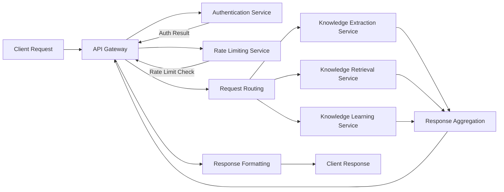

### 2.2 Knowledge Extraction Service

#### 2.2.1 Service Architecture

```mermaid
classDiagram
    class KnowledgeExtractionService {
        +extract_from_workflow(workflow_data: WorkflowExecution)
        +extract_solution_patterns(solutions: List[SolutionAttempt])
        +analyze_critique_patterns(critiques: List[CritiqueReport])
        +calculate_team_performance(team_data: List[TeamPerformance])
        +measure_gauntlet_effectiveness(gauntlet_data: List[GauntletMetrics])
        +extract_mathematical_knowledge(lean4_data: Lean4ProofData)
        +extract_selfplay_knowledge(psv_data: PSVKnowledgeData)
    }
    
    class SolutionPatternExtractor {
        +extract_patterns(solutions: List[SolutionAttempt])
        +cluster_similar_solutions(solutions: List[SolutionAttempt])
        +create_solution_patterns(clusters: Dict[int, List[SolutionAttempt]])
    }
    
    class CritiquePatternAnalyzer {
        +analyze_critiques(critiques: List[CritiqueReport])
        +identify_failure_patterns(critiques: List[CritiqueReport])
        +generate_prevention_strategies(patterns: List[FailurePattern])
    }
    
    class TeamPerformanceCalculator {
        +calculate_performance(team_data: List[TeamPerformance])
        +analyze_success_rates(team_data: List[TeamPerformance])
        +identify_improvement_opportunities(performance_data: PerformanceMetrics)
    }
    
    class GauntletEffectivenessAnalyzer {
        +analyze_effectiveness(gauntlet_data: List[GauntletMetrics])
        +calculate_detection_rates(gauntlet_data: List[GauntletMetrics])
        +identify_false_positives(gauntlet_data: List[GauntletMetrics])
    }
    
    class MathematicalKnowledgeExtractor {
        +extract_theorems(lean4_data: Lean4ProofData)
        +extract_proof_strategies(lean4_data: Lean4ProofData)
        +create_knowledge_graph(extracted_data: ExtractedKnowledge)
    }
    
    class SelfPlayKnowledgeExtractor {
        +extract_selfplay_patterns(psv_data: PSVKnowledgeData)
        +analyze_improvement_trends(psv_data: PSVKnowledgeData)
        +identify_learning_patterns(psv_data: PSVKnowledgeData)
    }
    
    KnowledgeExtractionService --> SolutionPatternExtractor
    KnowledgeExtractionService --> CritiquePatternAnalyzer
    KnowledgeExtractionService --> TeamPerformanceCalculator
    KnowledgeExtractionService --> GauntletEffectivenessAnalyzer
    KnowledgeExtractionService --> MathematicalKnowledgeExtractor
    KnowledgeExtractionService --> SelfPlayKnowledgeExtractor
```

#### 2.2.2 Extraction Pipeline

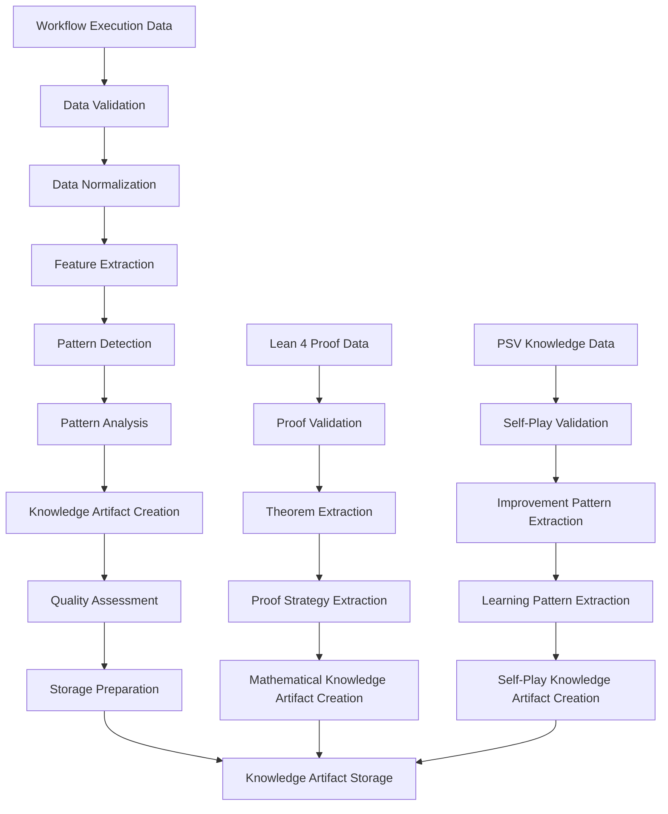

### 2.3 Knowledge Artifact Storage

#### 2.3.1 Storage Architecture

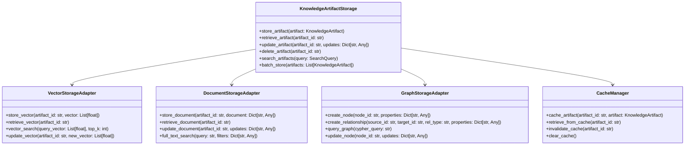

#### 2.3.2 Storage Implementation

```python
class KnowledgeArtifactStorage:
    def __init__(self, config: StorageConfig):
        self.config = config
        self.vector_store = self._initialize_vector_store()
        self.document_store = self._initialize_document_store()
        self.graph_store = self._initialize_graph_store()
        self.cache = self._initialize_cache()
        
    def store_artifact(self, artifact: KnowledgeArtifact) -> str:
        """Store a knowledge artifact with all required components"""
        # Generate unique ID
        artifact_id = f"artifact_{uuid.uuid4()}"
        
        # Generate vector embedding if not provided
        if not artifact.vector_embedding:
            artifact.vector_embedding = self._generate_embedding(artifact)
        
        # Store in all storage backends
        self._store_in_vector_store(artifact_id, artifact)
        self._store_in_document_store(artifact_id, artifact)
        self._store_in_graph_store(artifact_id, artifact)
        
        # Cache the artifact
        self.cache.cache_artifact(artifact_id, artifact)
        
        return artifact_id
        
    def retrieve_artifact(self, artifact_id: str) -> KnowledgeArtifact:
        """Retrieve a knowledge artifact with caching"""
        # Check cache first
        cached_artifact = self.cache.retrieve_from_cache(artifact_id)
        if cached_artifact:
            return cached_artifact
        
        # Retrieve from document store
        artifact = self.document_store.retrieve_document(artifact_id)
        
        # Cache the retrieved artifact
        self.cache.cache_artifact(artifact_id, artifact)
        
        return artifact
```

### 2.4 Knowledge Retrieval Service

#### 2.4.1 Retrieval Architecture

```mermaid
classDiagram
    class KnowledgeRetrievalService {
        +semantic_search(query: str, filters: Dict[str, Any], top_k: int)
        +hybrid_search(query: str, filters: Dict[str, Any], top_k: int)
        +contextual_retrieval(context: Dict[str, Any], top_k: int)
        +get_recommendations(artifact_id: str, context: Dict[str, Any], top_k: int)
        +advanced_search(search_query: AdvancedSearchQuery)
    }
    
    class SemanticSearchEngine {
        +generate_query_embedding(query: str)
        +vector_search(query_embedding: List[float], filters: Dict[str, Any], top_k: int)
        +rerank_results(results: List[SearchResult], query: str)
    }
    
    class FullTextSearchEngine {
        +full_text_search(query: str, filters: Dict[str, Any], top_k: int)
        +boolean_search(query: str, filters: Dict[str, Any], top_k: int)
        +fuzzy_search(query: str, filters: Dict[str, Any], top_k: int)
    }
    
    class KnowledgeGraphSearch {
        +graph_search(query: str, depth: int, filters: Dict[str, Any])
        +path_finding(source_id: str, target_id: str, max_hops: int)
        +relationship_analysis(artifact_id: str, relationship_types: List[str])
    }
    
    class RecommendationEngine {
        +generate_recommendations(artifact_id: str, context: Dict[str, Any], top_k: int)
        +collaborative_filtering(user_id: str, artifact_id: str, top_k: int)
        +content_based_recommendations(artifact_id: str, top_k: int)
        +hybrid_recommendations(artifact_id: str, context: Dict[str, Any], top_k: int)
    }
    
    class ResultAggregator {
        +aggregate_results(results: List[SearchResult])
        +rank_results(aggregated_results: List[SearchResult], query: str)
        +filter_results(ranked_results: List[SearchResult], filters: Dict[str, Any])
        +post_process_results(filtered_results: List[SearchResult])
    }
    
    KnowledgeRetrievalService --> SemanticSearchEngine
    KnowledgeRetrievalService --> FullTextSearchEngine
    KnowledgeRetrievalService --> KnowledgeGraphSearch
    KnowledgeRetrievalService --> RecommendationEngine
    KnowledgeRetrievalService --> ResultAggregator
```

#### 2.4.2 Retrieval Pipeline

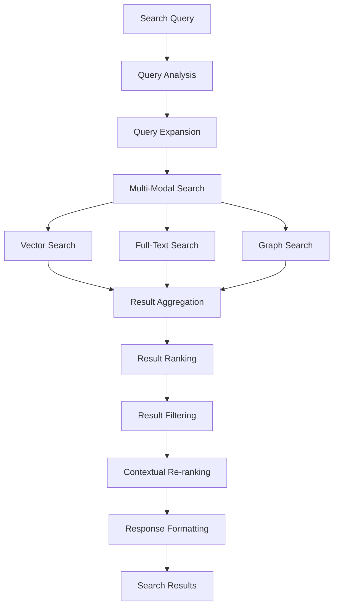

### 2.5 Knowledge Learning Service

#### 2.5.1 Learning Architecture

```mermaid
classDiagram
    class KnowledgeLearningService {
        +fine_tune_models(knowledge_artifacts: List[KnowledgeArtifact])
        +analyze_performance(performance_data: PerformanceMetrics)
        +optimize_strategies(strategy_data: StrategyMetrics)
        +track_improvement(improvement_data: ImprovementMetrics)
        +update_knowledge_graph(graph_updates: GraphUpdateData)
    }
    
    class ModelFineTuner {
        +identify_models_for_fine_tuning(artifacts: List[KnowledgeArtifact])
        +prepare_training_data(model_config: ModelConfig, artifacts: List[KnowledgeArtifact])
        +perform_fine_tuning(model_config: ModelConfig, training_data: TrainingData)
        +validate_fine_tuning(fine_tuning_result: FineTuningResult)
    }
    
    class PerformanceAnalyzer {
        +analyze_model_performance(performance_data: PerformanceMetrics)
        +identify_improvement_opportunities(performance_data: PerformanceMetrics)
        +generate_performance_reports(performance_data: PerformanceMetrics)
        +track_performance_trends(performance_data: PerformanceMetrics)
    }
    
    class StrategyOptimizer {
        +analyze_strategy_effectiveness(strategy_data: StrategyMetrics)
        +identify_optimal_strategies(strategy_data: StrategyMetrics)
        +generate_strategy_recommendations(strategy_data: StrategyMetrics)
        +update_strategy_parameters(strategy_data: StrategyMetrics)
    }
    
    class ImprovementTracker {
        +track_improvement_metrics(improvement_data: ImprovementMetrics)
        +calculate_improvement_rates(improvement_data: ImprovementMetrics)
        +generate_improvement_reports(improvement_data: ImprovementMetrics)
        +identify_improvement_patterns(improvement_data: ImprovementMetrics)
    }
    
    class KnowledgeGraphUpdater {
        +update_graph_structure(graph_updates: GraphUpdateData)
        +add_new_relationships(graph_updates: GraphUpdateData)
        +remove_outdated_relationships(graph_updates: GraphUpdateData)
        +optimize_graph_performance(graph_updates: GraphUpdateData)
    }
    
    KnowledgeLearningService --> ModelFineTuner
    KnowledgeLearningService --> PerformanceAnalyzer
    KnowledgeLearningService --> StrategyOptimizer
    KnowledgeLearningService --> ImprovementTracker
    KnowledgeLearningService --> KnowledgeGraphUpdater
```

#### 2.5.2 Learning Pipeline

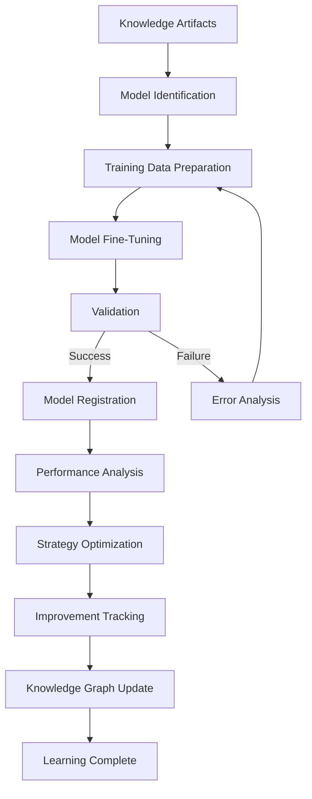

## 3. Data Architecture

### 3.1 Data Model

#### 3.1.1 Knowledge Artifact Schema

```json
{
  "$schema": "http://json-schema.org/draft-07/schema#",
  "title": "KnowledgeArtifact",
  "type": "object",
  "properties": {
    "id": {
      "type": "string",
      "format": "uuid",
      "description": "Unique identifier for the knowledge artifact"
    },
    "artifact_type": {
      "type": "string",
      "enum": [
        "solution_pattern",
        "problem_solution_mapping", 
        "critique_insight",
        "team_performance",
        "gauntlet_effectiveness",
        "process_optimization",
        "failure_learning",
        "mathematical_theorem",
        "proof_strategy",
        "domain_knowledge"
      ],
      "description": "Type of knowledge artifact"
    },
    "content": {
      "type": "object",
      "description": "Content of the knowledge artifact",
      "additionalProperties": true
    },
    "source_workflow_id": {
      "type": "string",
      "description": "ID of the workflow that generated this artifact"
    },
    "extraction_timestamp": {
      "type": "number",
      "description": "Unix timestamp when artifact was extracted"
    },
    "domain": {
      "type": "string",
      "description": "Mathematical domain (e.g., algebra, analysis, topology)"
    },
    "problem_type": {
      "type": "string",
      "description": "Type of problem this artifact relates to"
    },
    "usage_count": {
      "type": "integer",
      "minimum": 0,
      "default": 0,
      "description": "Number of times this artifact has been used"
    },
    "effectiveness_score": {
      "type": "number",
      "minimum": 0,
      "maximum": 1,
      "default": 0,
      "description": "Effectiveness score (0-1)"
    },
    "related_artifacts": {
      "type": "array",
      "items": {
        "type": "string"
      },
      "description": "IDs of related knowledge artifacts"
    },
    "vector_embedding": {
      "type": "array",
      "items": {
        "type": "number"
      },
      "description": "Vector embedding for semantic search"
    },
    "metadata": {
      "type": "object",
      "description": "Additional metadata",
      "additionalProperties": true
    }
  },
  "required": ["id", "artifact_type", "content", "source_workflow_id", "extraction_timestamp"]
}
```

#### 3.1.2 Knowledge Graph Schema

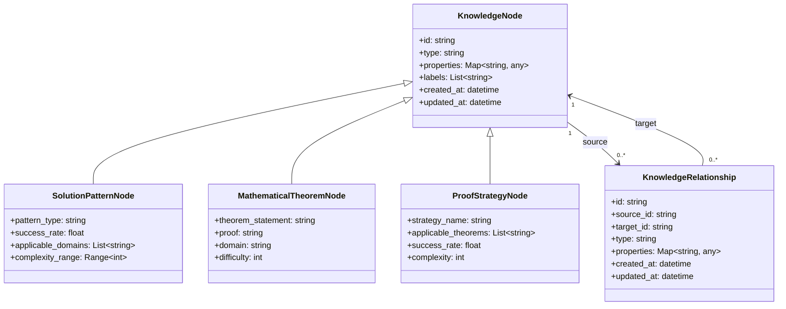

### 3.2 Data Storage Architecture

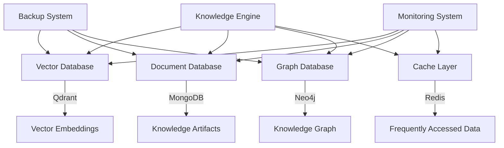

### 3.3 Data Flow Architecture

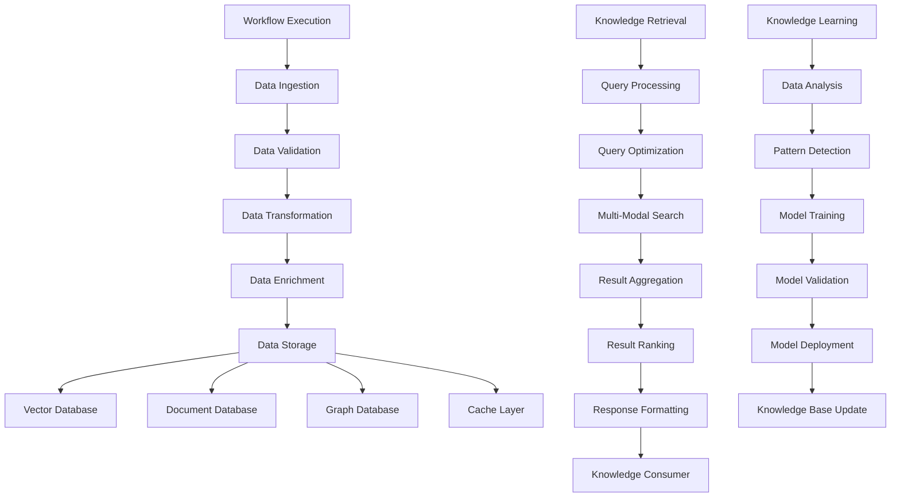

## 4. Integration Architecture

### 4.1 Integration Overview

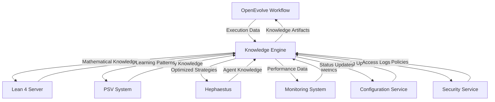

### 4.2 Integration Patterns

#### 4.2.1 Event-Driven Integration

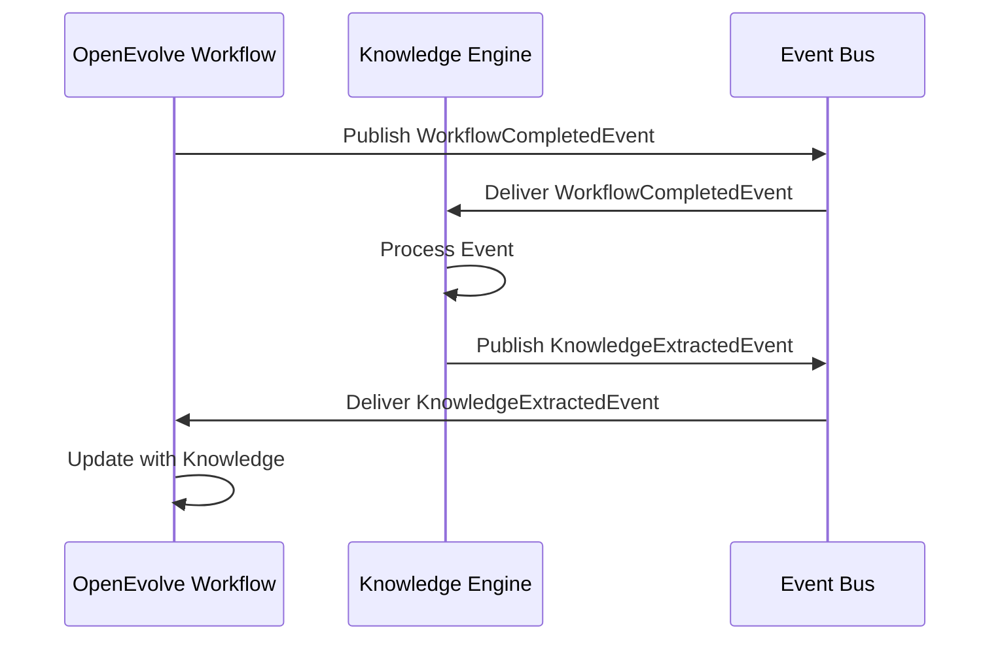

#### 4.2.2 REST API Integration

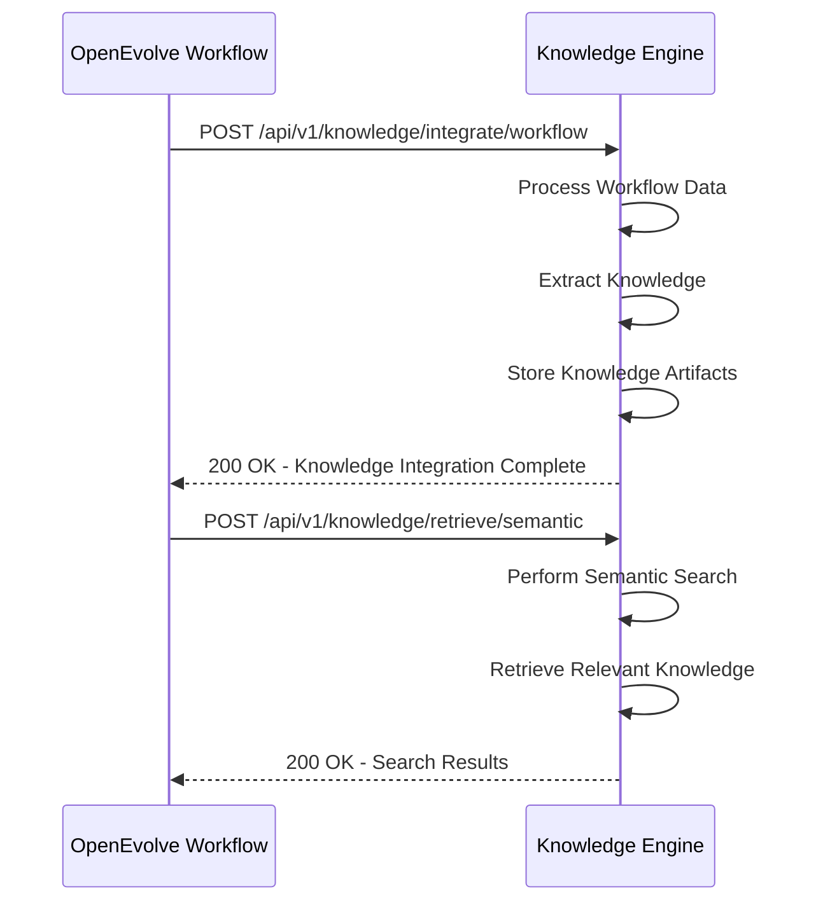

#### 4.2.3 WebSocket Integration

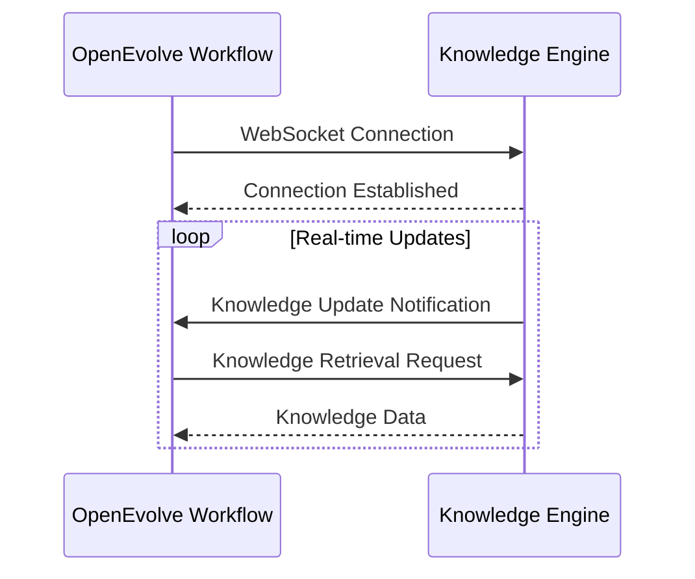

### 4.3 Integration Components

#### 4.3.1 Integration Adapter Pattern

```python
class IntegrationAdapter:
    def __init__(self, source_system: str, target_system: str):
        self.source_system = source_system
        self.target_system = target_system
        self.data_transformers = self._initialize_transformers()
        self.error_handlers = self._initialize_error_handlers()
        
    def adapt_data(self, source_data: Any) -> Any:
        """Adapt data from source system to target system format"""
        try:
            # Validate source data
            self._validate_source_data(source_data)
            
            # Transform data structure
            transformed_data = self._transform_data_structure(source_data)
            
            # Map data fields
            mapped_data = self._map_data_fields(transformed_data)
            
            # Validate target data
            self._validate_target_data(mapped_data)
            
            return mapped_data
            
        except Exception as e:
            self.error_handlers.handle_error(e, source_data)
            raise IntegrationError(f"Data adaptation failed: {str(e)}")
```

#### 4.3.2 Integration Gateway Pattern

```python
class IntegrationGateway:
    def __init__(self):
        self.adapters = {}
        self.routers = {}
        self.monitors = {}
        
    def register_adapter(self, source_system: str, adapter: IntegrationAdapter):
        """Register an adapter for a source system"""
        self.adapters[source_system] = adapter
        
    def register_router(self, target_system: str, router: IntegrationRouter):
        """Register a router for a target system"""
        self.routers[target_system] = router
        
    def integrate(self, source_system: str, target_system: str, data: Any) -> Any:
        """Integrate data between systems"""
        # Get appropriate adapter
        adapter = self.adapters.get(source_system)
        if not adapter:
            raise IntegrationError(f"No adapter for source system: {source_system}")
        
        # Adapt data
        adapted_data = adapter.adapt_data(data)
        
        # Get appropriate router
        router = self.routers.get(target_system)
        if not router:
            raise IntegrationError(f"No router for target system: {target_system}")
        
        # Route data
        result = router.route_data(adapted_data)
        
        # Monitor integration
        self._monitor_integration(source_system, target_system, data, result)
        
        return result
```

## 5. Performance Architecture

### 5.1 Performance Requirements

| Component | Requirement | Target |
|-----------|-------------|--------|
| Knowledge Extraction | Throughput | 1000 artifacts/minute |
| Knowledge Retrieval | Latency | < 100ms (p95) |
| Knowledge Storage | Write Latency | < 50ms (p95) |
| Knowledge Storage | Read Latency | < 20ms (p95) |
| Semantic Search | Query Latency | < 150ms (p95) |
| Model Fine-Tuning | Throughput | 10 models/hour |
| API Response | Latency | < 200ms (p95) |
| Cache Hit Ratio | Efficiency | > 90% |

### 5.2 Performance Optimization Strategies

#### 5.2.1 Caching Architecture

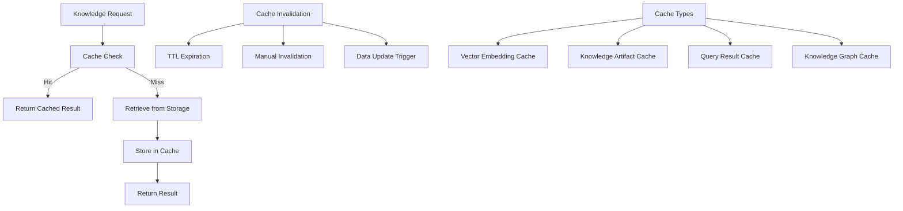

#### 5.2.2 Parallel Processing Architecture

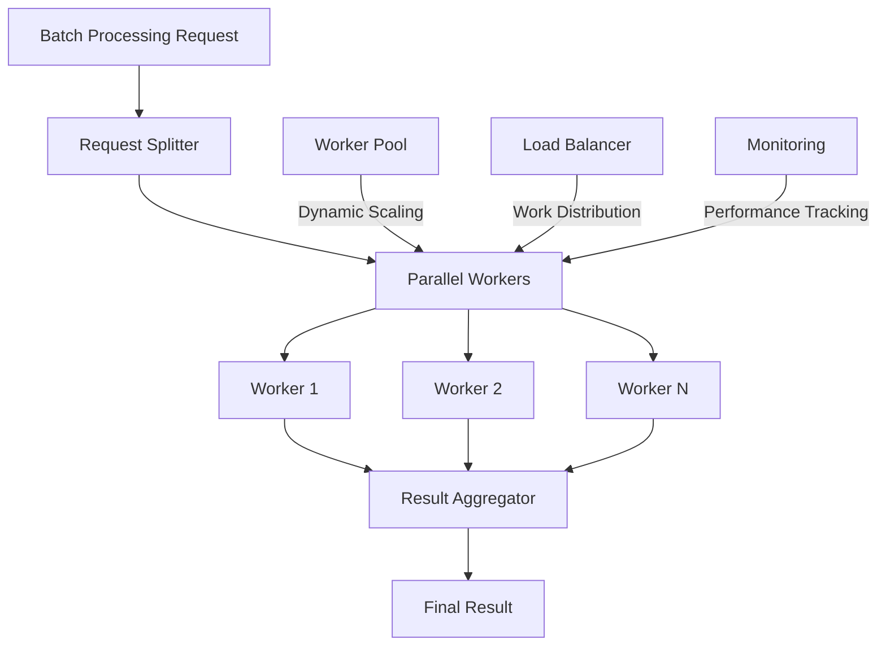

#### 5.2.3 Query Optimization Architecture

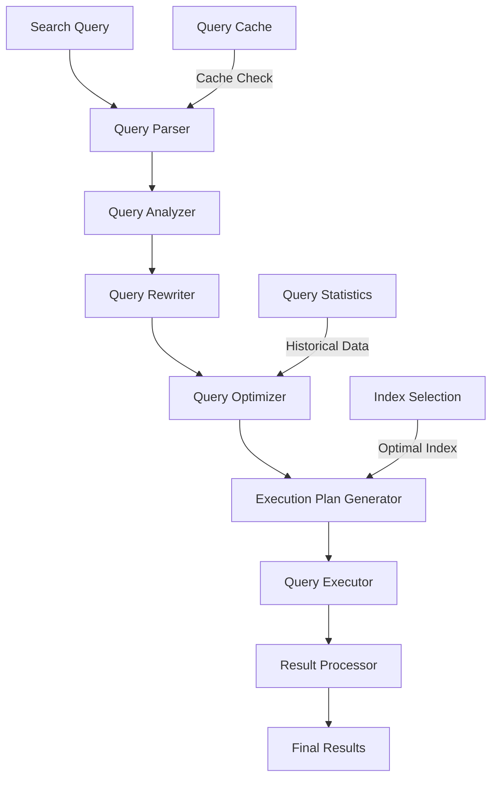

### 5.3 Performance Monitoring Architecture

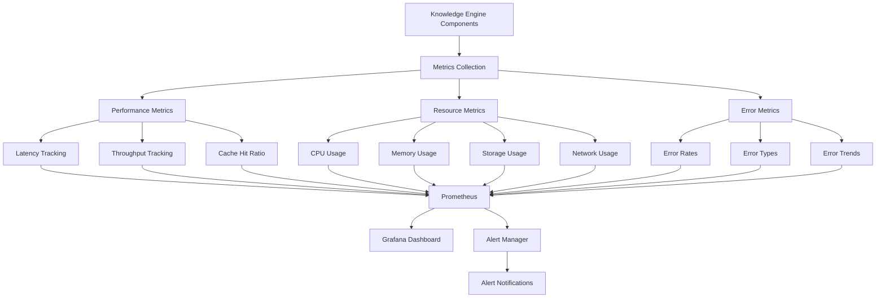

## 6. Security Architecture

### 6.1 Security Requirements

| Category | Requirement | Implementation |
|----------|-------------|----------------|
| Authentication | Secure user authentication | JWT/OAuth2 |
| Authorization | Role-based access control | RBAC |
| Data Protection | Encryption at rest | AES-256 |
| Data Protection | Encryption in transit | TLS 1.3 |
| Access Control | Fine-grained permissions | Attribute-based access control |
| Audit Logging | Comprehensive audit trails | ELK Stack |
| Rate Limiting | API request limiting | Token bucket algorithm |
| Input Validation | Request validation | Schema validation |
| Secret Management | Secure secrets storage | HashiCorp Vault |
| Network Security | Network isolation | VPC/Subnets |

### 6.2 Security Architecture Diagram

```mermaid
graph TD
    A[Client] -->|HTTPS| B[API Gateway]
    B --> C[Authentication Service]
    C -->|JWT Token| B
    B --> D[Rate Limiter]
    D -->|Rate Limit Check| B
    B --> E[Request Validator]
    E -->|Validated Request| F[Knowledge Engine API]
    
    F --> G[Authorization Service]
    G -->|Access Decision| F
    F --> H[Knowledge Services]
    
    I[Audit Logger] --> F
    J[Secret Manager] --> F
    K[Security Monitor] --> F
    
    L[Encryption] --> H
    M[Access Control] --> H
    N[Data Protection] --> H
    
    O[Monitoring] --> F
    P[Alerting] --> F
```

### 6.3 Security Components

#### 6.3.1 Authentication Service

```python
class AuthenticationService:
    def __init__(self, jwt_secret: str, token_expiry: int = 3600):
        self.jwt_secret = jwt_secret
        self.token_expiry = token_expiry
        self.user_store = UserStore()
        
    def authenticate(self, credentials: Credentials) -> str:
        """Authenticate user and return JWT token"""
        # Validate credentials
        user = self.user_store.validate_credentials(credentials)
        
        if not user:
            raise AuthenticationError("Invalid credentials")
        
        # Create JWT token
        token = self._create_jwt_token(user)
        
        return token
        
    def _create_jwt_token(self, user: User) -> str:
        """Create JWT token with user claims"""
        payload = {
            "sub": user.id,
            "name": user.name,
            "email": user.email,
            "roles": user.roles,
            "permissions": user.permissions,
            "exp": datetime.utcnow() + timedelta(seconds=self.token_expiry),
            "iat": datetime.utcnow()
        }
        
        return jwt.encode(payload, self.jwt_secret, algorithm="HS256")
        
    def validate_token(self, token: str) -> User:
        """Validate JWT token and return user"""
        try:
            payload = jwt.decode(token, self.jwt_secret, algorithms=["HS256"])
            return User(**payload)
        except jwt.ExpiredSignatureError:
            raise AuthenticationError("Token expired")
        except jwt.InvalidTokenError:
            raise AuthenticationError("Invalid token")
```

#### 6.3.2 Authorization Service

```python
class AuthorizationService:
    def __init__(self):
        self.permission_matrix = self._load_permission_matrix()
        
    def check_permission(self, user: User, resource: str, action: str) -> bool:
        """Check if user has permission for resource action"""
        # Check user roles
        for role in user.roles:
            if self._check_role_permission(role, resource, action):
                return True
        
        # Check user permissions
        for permission in user.permissions:
            if self._check_permission(permission, resource, action):
                return True
        
        return False
        
    def _check_role_permission(self, role: str, resource: str, action: str) -> bool:
        """Check role-based permissions"""
        role_permissions = self.permission_matrix.get(role, {})
        resource_permissions = role_permissions.get(resource, [])
        
        return action in resource_permissions
        
    def _check_permission(self, permission: str, resource: str, action: str) -> bool:
        """Check explicit permissions"""
        return permission == f"{resource}:{action}"
```

#### 6.3.3 Audit Logging Service

```python
class AuditLoggingService:
    def __init__(self, log_store: LogStore):
        self.log_store = log_store
        
    def log_event(self, event: AuditEvent):
        """Log an audit event"""
        # Add timestamp
        event.timestamp = datetime.utcnow()
        
        # Store event
        self.log_store.store_event(event)
        
    def search_events(self, query: AuditQuery) -> List[AuditEvent]:
        """Search audit events"""
        return self.log_store.search_events(query)
        
    def generate_report(self, report_type: str, time_range: TimeRange) -> AuditReport:
        """Generate audit report"""
        events = self.log_store.get_events_by_time_range(time_range)
        
        if report_type == "access_report":
            return self._generate_access_report(events)
        elif report_type == "security_report":
            return self._generate_security_report(events)
        elif report_type == "compliance_report":
            return self._generate_compliance_report(events)
        else:
            raise ValueError(f"Unknown report type: {report_type}")
```

## 7. Deployment Architecture

### 7.1 Deployment Overview

```mermaid
graph TD
    A[Development] -->|CI/CD| B[Staging]
    B -->|CI/CD| C[Production]
    
    D[Infrastructure as Code] --> A
    D --> B
    D --> C
    
    E[Configuration Management] --> A
    E --> B
    E --> C
    
    F[Monitoring] --> A
    F --> B
    F --> C
    
    G[Logging] --> A
    G --> B
    G --> C
```

### 7.2 Containerized Deployment

```mermaid
graph TD
    A[Knowledge Engine Application] --> B[Docker Container]
    B --> C[Container Registry]
    C --> D[Kubernetes Cluster]
    D --> E[Deployment]
    D --> F[Service]
    D --> G[Ingress]
    D --> H[ConfigMap]
    D --> I[Secret]
    
    J[CI/CD Pipeline] --> C
    K[Infrastructure as Code] --> D
    L[Monitoring] --> D
    M[Logging] --> D
```

### 7.3 Kubernetes Architecture

```mermaid
graph TD
    A[Knowledge Engine API] -->|Deployment| B[API Pods]
    B -->|Service| C[API Service]
    C -->|Ingress| D[API Ingress]
    
    E[Knowledge Extraction Service] -->|Deployment| F[Extraction Pods]
    F -->|Service| G[Extraction Service]
    
    H[Knowledge Retrieval Service] -->|Deployment| I[Retrieval Pods]
    I -->|Service| J[Retrieval Service]
    
    K[Knowledge Learning Service] -->|Deployment| L[Learning Pods]
    L -->|Service| M[Learning Service]
    
    N[Vector Database] -->|StatefulSet| O[Qdrant Pods]
    O -->|Service| P[Qdrant Service]
    
    Q[Document Database] -->|StatefulSet| R[MongoDB Pods]
    R -->|Service| S[MongoDB Service]
    
    T[Graph Database] -->|StatefulSet| U[Neo4j Pods]
    U -->|Service| V[Neo4j Service]
    
    W[Cache] -->|Deployment| X[Redis Pods]
    X -->|Service| Y[Redis Service]
    
    Z[Monitoring] -->|Deployment| AA[Prometheus Pods]
    AA -->|Service| AB[Prometheus Service]
    
    AC[Logging] -->|Deployment| AD[ELK Pods]
    AD -->|Service| AE[ELK Service]
```

### 7.4 Deployment Configuration

```yaml
# knowledge-engine-deployment.yaml
apiVersion: apps/v1
kind: Deployment
metadata:
  name: knowledge-engine-api
  namespace: openevolve
  labels:
    app: knowledge-engine
    component: api
spec:
  replicas: 3
  selector:
    matchLabels:
      app: knowledge-engine
      component: api
  template:
    metadata:
      labels:
        app: knowledge-engine
        component: api
    spec:
      containers:
      - name: api
        image: openevolve/knowledge-engine-api:latest
        imagePullPolicy: Always
        ports:
        - containerPort: 8000
        env:
        - name: ENVIRONMENT
          value: "production"
        - name: DATABASE_URL
          valueFrom:
            secretKeyRef:
              name: knowledge-engine-secrets
              key: database_url
        - name: QDRANT_URL
          valueFrom:
            configMapKeyRef:
              name: knowledge-engine-config
              key: qdrant_url
        - name: JWT_SECRET
          valueFrom:
            secretKeyRef:
              name: knowledge-engine-secrets
              key: jwt_secret
        resources:
          requests:
            cpu: "500m"
            memory: "1Gi"
          limits:
            cpu: "1000m"
            memory: "2Gi"
        livenessProbe:
          httpGet:
            path: /health
            port: 8000
          initialDelaySeconds: 30
          periodSeconds: 10
        readinessProbe:
          httpGet:
            path: /ready
            port: 8000
          initialDelaySeconds: 5
          periodSeconds: 5
      nodeSelector:
        node-role: backend
      affinity:
        podAntiAffinity:
          preferredDuringSchedulingIgnoredDuringExecution:
          - weight: 100
            podAffinityTerm:
              labelSelector:
                matchExpressions:
                - key: app
                  operator: In
                  values:
                  - knowledge-engine
              topologyKey: "kubernetes.io/hostname"
```

### 7.5 CI/CD Pipeline

```mermaid
flowchart TD
    A[Code Commit] --> B[Code Review]
    B --> C[Automated Testing]
    C --> D[Build Docker Image]
    D --> E[Push to Registry]
    E --> F[Staging Deployment]
    F --> G[Integration Testing]
    G --> H[Performance Testing]
    H --> I[Security Scanning]
    I --> J[Approval Gate]
    J -->|Approved| K[Production Deployment]
    J -->|Rejected| F
    K --> L[Canary Release]
    L --> M[Monitoring]
    M --> N[Full Rollout]
    N --> O[Post-Deployment Testing]
    O --> P[Deployment Complete]
```

## 8. Monitoring and Observability

### 8.1 Monitoring Architecture

```mermaid
graph TD
    A[Knowledge Engine Components] --> B[Metrics Collection]
    B --> C[Prometheus Server]
    C --> D[Grafana Dashboard]
    C --> E[Alert Manager]
    E --> F[Notification Services]
    
    G[Application Logs] --> H[Log Aggregation]
    H --> I[ELK Stack]
    I --> J[Log Analysis]
    I --> K[Log Visualization]
    
    L[Distributed Tracing] --> M[Jaeger]
    M --> N[Trace Analysis]
    M --> O[Trace Visualization]
    
    P[Health Checks] --> Q[Status Monitoring]
    Q --> R[Health Dashboard]
    Q --> S[Incident Detection]
```

### 8.2 Monitoring Components

#### 8.2.1 Metrics Collection

```python
class MetricsCollector:
    def __init__(self):
        self.metrics = {
            'knowledge_extraction_time': Histogram(
                'knowledge_extraction_time',
                'Time taken for knowledge extraction',
                buckets=[0.1, 0.5, 1.0, 2.0, 5.0, 10.0]
            ),
            'knowledge_retrieval_time': Histogram(
                'knowledge_retrieval_time',
                'Time taken for knowledge retrieval',
                buckets=[0.05, 0.1, 0.2, 0.5, 1.0, 2.0]
            ),
            'knowledge_storage_time': Histogram(
                'knowledge_storage_time',
                'Time taken for knowledge storage',
                buckets=[0.01, 0.05, 0.1, 0.2, 0.5, 1.0]
            ),
            'semantic_search_time': Histogram(
                'semantic_search_time',
                'Time taken for semantic search',
                buckets=[0.05, 0.1, 0.2, 0.5, 1.0, 2.0]
            ),
            'model_fine_tuning_time': Histogram(
                'model_fine_tuning_time',
                'Time taken for model fine-tuning',
                buckets=[60, 300, 600, 1800, 3600]
            ),
            'api_response_time': Histogram(
                'api_response_time',
                'Time taken for API responses',
                buckets=[0.05, 0.1, 0.2, 0.5, 1.0, 2.0]
            ),
            'cache_hit_ratio': Gauge(
                'cache_hit_ratio',
                'Cache hit ratio'
            ),
            'error_count': Counter(
                'error_count',
                'Number of errors',
                ['error_type', 'component']
            ),
            'active_connections': Gauge(
                'active_connections',
                'Number of active connections'
            )
        }
        
    def track_extraction_time(self, duration: float):
        """Track knowledge extraction time"""
        self.metrics['knowledge_extraction_time'].observe(duration)
        
    def track_retrieval_time(self, duration: float):
        """Track knowledge retrieval time"""
        self.metrics['knowledge_retrieval_time'].observe(duration)
        
    def track_error(self, error_type: str, component: str):
        """Track error occurrence"""
        self.metrics['error_count'].labels(error_type=error_type, component=component).inc()
        
    def set_cache_hit_ratio(self, ratio: float):
        """Set cache hit ratio"""
        self.metrics['cache_hit_ratio'].set(ratio)
```

#### 8.2.2 Alerting System

```python
class AlertManager:
    def __init__(self, alert_rules: List[AlertRule]):
        self.alert_rules = alert_rules
        self.notification_services = []
        
    def add_notification_service(self, service: NotificationService):
        """Add a notification service"""
        self.notification_services.append(service)
        
    def evaluate_metrics(self, metrics: Dict[str, float]):
        """Evaluate metrics against alert rules"""
        triggered_alerts = []
        
        for rule in self.alert_rules:
            if self._evaluate_rule(rule, metrics):
                triggered_alerts.append(rule)
                
        return triggered_alerts
        
    def _evaluate_rule(self, rule: AlertRule, metrics: Dict[str, float]) -> bool:
        """Evaluate a single alert rule"""
        metric_value = metrics.get(rule.metric_name)
        
        if metric_value is None:
            return False
            
        if rule.operator == '>':
            return metric_value > rule.threshold
        elif rule.operator == '<':
            return metric_value < rule.threshold
        elif rule.operator == '==':
            return metric_value == rule.threshold
        elif rule.operator == '>=':
            return metric_value >= rule.threshold
        elif rule.operator == '<=':
            return metric_value <= rule.threshold
        else:
            return False
        
    def trigger_alerts(self, alerts: List[AlertRule]):
        """Trigger alerts and send notifications"""
        for alert in alerts:
            for service in self.notification_services:
                service.send_notification(alert)
```

### 8.3 Observability Dashboard

```mermaid
graph TD
    A[Grafana Dashboard] --> B[Overview Panel]
    B --> C[System Health]
    B --> D[Performance Metrics]
    B --> E[Resource Utilization]
    
    A --> F[Knowledge Extraction Panel]
    F --> G[Extraction Throughput]
    F --> H[Extraction Latency]
    F --> I[Extraction Error Rates]
    
    A --> J[Knowledge Retrieval Panel]
    J --> K[Retrieval Latency]
    J --> L[Search Performance]
    J --> M[Cache Hit Ratio]
    
    A --> N[Knowledge Learning Panel]
    N --> O[Model Fine-Tuning]
    N --> P[Performance Improvement]
    N --> Q[Learning Trends]
    
    A --> R[Integration Panel]
    R --> S[Integration Metrics]
    R --> T[Cross-System Performance]
    R --> U[Integration Health]
```

## 9. Error Handling and Resilience

### 9.1 Error Handling Architecture

```mermaid
graph TD
    A[Request] --> B[Error Detection]
    B -->|No Error| C[Normal Processing]
    B -->|Error Detected| D[Error Classification]
    D --> E[Retry Logic]
    D --> F[Fallback Logic]
    D --> G[Error Logging]
    D --> H[Alert Generation]
    
    E --> I[Retry Attempt]
    I -->|Success| C
    I -->|Failure| J[Max Retries Check]
    J -->|Retries Remaining| E
    J -->|Max Retries Reached| F
    
    F --> K[Fallback Response]
    F --> L[Error Recovery]
    
    G --> M[Error Analysis]
    H --> N[Notification System]
```

### 9.2 Resilience Patterns

#### 9.2.1 Circuit Breaker Pattern

```python
class CircuitBreaker:
    def __init__(self, failure_threshold: int = 5, 
                 recovery_timeout: int = 30, 
                 name: str = "circuit_breaker"):
        self.failure_threshold = failure_threshold
        self.recovery_timeout = recovery_timeout
        self.name = name
        self.failure_count = 0
        self.last_failure_time = None
        self.state = "CLOSED"  # CLOSED, OPEN, HALF_OPEN
        
    def call(self, func, *args, **kwargs):
        """Execute function with circuit breaker protection"""
        if self.state == "OPEN":
            if self._can_retry():
                self.state = "HALF_OPEN"
            else:
                raise CircuitBreakerOpenException(
                    f"Circuit breaker for {self.name} is OPEN"
                )
        
        try:
            result = func(*args, **kwargs)
            self._on_success()
            return result
        except Exception as e:
            self._on_failure()
            raise e
        
    def _on_success(self):
        """Handle successful execution"""
        self.failure_count = 0
        self.state = "CLOSED"
        
    def _on_failure(self):
        """Handle failed execution"""
        self.failure_count += 1
        self.last_failure_time = time.time()
        
        if self.failure_count >= self.failure_threshold:
            self.state = "OPEN"
        
    def _can_retry(self) -> bool:
        """Check if circuit breaker can transition to HALF_OPEN"""
        if self.state != "OPEN":
            return False
            
        if self.last_failure_time is None:
            return True
            
        return (time.time() - self.last_failure_time) > self.recovery_timeout
```

#### 9.2.2 Retry Pattern

```python
class RetryManager:
    def __init__(self, max_attempts: int = 3, 
                 initial_delay: float = 1.0, 
                 backoff_multiplier: float = 2.0, 
                 max_delay: float = 10.0):
        self.max_attempts = max_attempts
        self.initial_delay = initial_delay
        self.backoff_multiplier = backoff_multiplier
        self.max_delay = max_delay
        
    def execute_with_retry(self, func, *args, **kwargs):
        """Execute function with retry logic"""
        attempt = 1
        last_exception = None
        
        while attempt <= self.max_attempts:
            try:
                return func(*args, **kwargs)
            except Exception as e:
                last_exception = e
                
                if attempt < self.max_attempts:
                    delay = min(
                        self.initial_delay * (self.backoff_multiplier ** (attempt - 1)),
                        self.max_delay
                    )
                    
                    time.sleep(delay)
                    attempt += 1
                else:
                    raise RetryExhaustedException(
                        f"Max retries ({self.max_attempts}) exceeded"
                    ) from last_exception
```

#### 9.2.3 Bulkhead Pattern

```python
class Bulkhead:
    def __init__(self, max_concurrent: int, max_queue: int):
        self.max_concurrent = max_concurrent
        self.max_queue = max_queue
        self.semaphore = threading.Semaphore(max_concurrent)
        self.queue = queue.Queue(max_queue)
        self.worker_thread = threading.Thread(target=self._process_queue, daemon=True)
        self.worker_thread.start()
        
    def submit(self, func, *args, **kwargs):
        """Submit a task to the bulkhead"""
        if self.queue.full():
            raise BulkheadFullException("Bulkhead queue is full")
            
        future = Future()
        self.queue.put((func, args, kwargs, future))
        return future
        
    def _process_queue(self):
        """Process tasks from the queue"""
        while True:
            func, args, kwargs, future = self.queue.get()
            
            try:
                with self.semaphore:
                    result = func(*args, **kwargs)
                    future.set_result(result)
            except Exception as e:
                future.set_exception(e)
            finally:
                self.queue.task_done()
```

### 9.3 Error Recovery Architecture

```mermaid
graph TD
    A[Error Detection] --> B[Error Classification]
    B --> C[Transient Error]
    B --> D[Permanent Error]
    B --> E[Unknown Error]
    
    C --> F[Retry Logic]
    F --> G[Exponential Backoff]
    G --> H[Retry Attempt]
    H -->|Success| I[Normal Processing]
    H -->|Failure| J[Max Retries Check]
    J -->|Retries Remaining| F
    J -->|Max Retries Reached| K[Fallback Logic]
    
    D --> K
    E --> K
    
    K --> L[Fallback Response]
    K --> M[Error Recovery]
    M --> N[System Recovery]
    N --> I
    
    O[Error Logging] --> P[Error Analysis]
    P --> Q[Root Cause Analysis]
    Q --> R[Preventive Measures]
```

## 10. Scalability Architecture

### 10.1 Scalability Requirements

| Component | Scalability Requirement | Target |
|-----------|-------------------------|--------|
| Knowledge Extraction | Horizontal scaling | 100+ concurrent extractions |
| Knowledge Retrieval | Horizontal scaling | 1000+ concurrent searches |
| Knowledge Storage | Vertical scaling | 10M+ knowledge artifacts |
| Vector Database | Horizontal scaling | 1B+ vector embeddings |
| Graph Database | Horizontal scaling | 100M+ nodes/relationships |
| API Service | Horizontal scaling | 1000+ requests/second |
| Cache Layer | Horizontal scaling | 1M+ cached items |

### 10.2 Scaling Strategies

#### 10.2.1 Horizontal Scaling Architecture

```mermaid
graph TD
    A[Load Balancer] --> B[Service Instance 1]
    A --> C[Service Instance 2]
    A --> D[Service Instance N]
    
    B --> E[Shared Storage]
    C --> E
    D --> E
    
    F[Auto-Scaling Controller] --> G[Metrics Collection]
    G --> H[Scaling Decision]
    H --> I[Scale Out]
    H --> J[Scale In]
    
    I --> K[New Instance Creation]
    K --> A
    
    J --> L[Instance Termination]
    L --> A
```

#### 10.2.2 Vertical Scaling Architecture

```mermaid
graph TD
    A[Service Instance] --> B[Resource Monitoring]
    B --> C[Resource Analysis]
    C --> D[Vertical Scaling Decision]
    D --> E[Resource Allocation Increase]
    D --> F[Resource Allocation Decrease]
    
    E --> G[CPU Upgrade]
    E --> H[Memory Upgrade]
    E --> I[Storage Upgrade]
    
    F --> J[CPU Downgrade]
    F --> K[Memory Downgrade]
    F --> L[Storage Downgrade]
    
    M[Performance Monitoring] --> B
    N[Cost Optimization] --> C
```

#### 10.2.3 Database Scaling Architecture

```mermaid
graph TD
    A[Application] --> B[Database Proxy]
    B --> C[Read Replicas]
    B --> D[Write Master]
    
    D --> E[Data Replication]
    E --> C
    
    F[Sharding] --> G[Shard 1]
    F --> H[Shard 2]
    F --> I[Shard N]
    
    J[Partitioning] --> K[Partition 1]
    J --> L[Partition 2]
    J --> M[Partition N]
    
    N[Auto-Scaling] --> O[Read Replica Scaling]
    N --> P[Shard Scaling]
```

### 10.3 Scalability Implementation

#### 10.3.1 Auto-Scaling Configuration

```yaml
# auto-scaling-config.yaml
apiVersion: autoscaling/v2
kind: HorizontalPodAutoscaler
metadata:
  name: knowledge-engine-api-hpa
  namespace: openevolve
spec:
  scaleTargetRef:
    apiVersion: apps/v1
    kind: Deployment
    name: knowledge-engine-api
  minReplicas: 3
  maxReplicas: 20
  metrics:
  - type: Resource
    resource:
      name: cpu
      target:
        type: Utilization
        averageUtilization: 70
  - type: Resource
    resource:
      name: memory
      target:
        type: Utilization
        averageUtilization: 80
  - type: Pods
    pods:
      metric:
        name: requests_per_second
      target:
        type: AverageValue
        averageValue: 500
  behavior:
    scaleDown:
      stabilizationWindowSeconds: 300
      policies:
      - type: Percent
        value: 10
        periodSeconds: 60
    scaleUp:
      stabilizationWindowSeconds: 60
      policies:
      - type: Percent
        value: 20
        periodSeconds: 60
      - type: Pods
        value: 5
        periodSeconds: 60
      selectPolicy: Max
```

#### 10.3.2 Database Sharding Configuration

```yaml
# database-sharding-config.yaml
sharding:
  enabled: true
  strategy: hash
  key: artifact_id
  shards:
    - name: shard-0
      range: "0-1000000"
      replicas: 3
    - name: shard-1
      range: "1000001-2000000"
      replicas: 3
    - name: shard-2
      range: "2000001-3000000"
      replicas: 3
  read_replicas: 2
  write_concern: majority
  read_preference: nearest
  auto_rebalance: true
  rebalance_interval: 3600
```

#### 10.3.3 Load Balancing Configuration

```yaml
# load-balancing-config.yaml
load_balancing:
  algorithm: least_connections
  health_check:
    interval: 30
    timeout: 5
    healthy_threshold: 3
    unhealthy_threshold: 5
  session_persistence:
    enabled: true
    cookie_name: KE_SESSION_ID
    timeout: 1800
  ssl:
    enabled: true
    certificate: /etc/ssl/certs/knowledge-engine.crt
    key: /etc/ssl/private/knowledge-engine.key
  rate_limiting:
    enabled: true
    requests_per_minute: 1000
    burst_limit: 200
  circuit_breaker:
    enabled: true
    failure_threshold: 5
    recovery_timeout: 30
```

### 10.4 Scalability Testing

#### 10.4.1 Load Testing Architecture

```mermaid
graph TD
    A[Load Test Controller] --> B[Load Generators]
    B --> C[Knowledge Engine API]
    C --> D[Knowledge Extraction Service]
    C --> E[Knowledge Retrieval Service]
    C --> F[Knowledge Learning Service]
    
    G[Monitoring System] --> C
    G --> D
    G --> E
    G --> F
    
    H[Metrics Collection] --> G
    I[Performance Analysis] --> G
    J[Report Generation] --> G
```

#### 10.4.2 Performance Benchmarking

```python
class PerformanceBenchmark:
    def __init__(self, test_config: BenchmarkConfig):
        self.test_config = test_config
        self.metrics_collector = MetricsCollector()
        
    def run_benchmark(self) -> BenchmarkResult:
        """Run performance benchmark tests"""
        results = {}
        
        # Test knowledge extraction performance
        extraction_result = self._test_extraction_performance()
        results['extraction'] = extraction_result
        
        # Test knowledge retrieval performance
        retrieval_result = self._test_retrieval_performance()
        results['retrieval'] = retrieval_result
        
        # Test knowledge storage performance
        storage_result = self._test_storage_performance()
        results['storage'] = storage_result
        
        # Test semantic search performance
        search_result = self._test_search_performance()
        results['search'] = search_result
        
        # Test API performance
        api_result = self._test_api_performance()
        results['api'] = api_result
        
        return BenchmarkResult(
            results=results,
            timestamp=datetime.utcnow()
        )
        
    def _test_extraction_performance(self) -> ExtractionBenchmark:
        """Test knowledge extraction performance"""
        test_data = self._generate_test_data()
        
        start_time = time.time()
        for _ in range(self.test_config.extraction_iterations):
            self._extract_knowledge(test_data)
        end_time = time.time()
        
        return ExtractionBenchmark(
            iterations=self.test_config.extraction_iterations,
            total_time=end_time - start_time,
            avg_time=(end_time - start_time) / self.test_config.extraction_iterations
        )
```

## Conclusion

The OpenEvolve Knowledge Engine technical architecture provides a comprehensive foundation for building a scalable, resilient, and high-performance knowledge management system. By leveraging modern architectural patterns, robust integration mechanisms, and sophisticated performance optimization strategies, the Knowledge Engine is designed to handle the complex requirements of continuous learning and knowledge extraction in the OpenEvolve ecosystem.

The architecture emphasizes:

1. **Modularity**: Clear separation of concerns with well-defined interfaces
2. **Scalability**: Support for both horizontal and vertical scaling strategies
3. **Resilience**: Comprehensive error handling and recovery mechanisms
4. **Performance**: Optimization at all levels for low-latency, high-throughput operation
5. **Security**: End-to-end security measures and compliance features
6. **Observability**: Complete monitoring and logging capabilities
7. **Extensibility**: Design patterns that support future growth and evolution

This architecture enables the Knowledge Engine to serve as the cognitive core of the OpenEvolve ecosystem, supporting continuous improvement and self-learning capabilities across all components and workflows.
