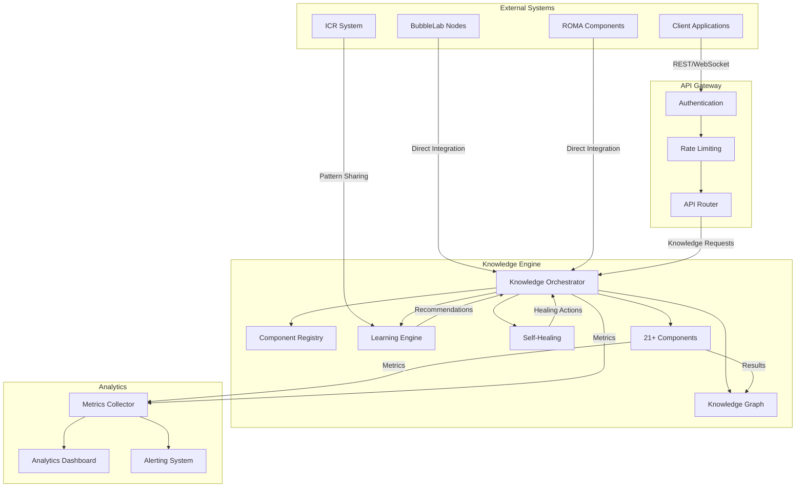
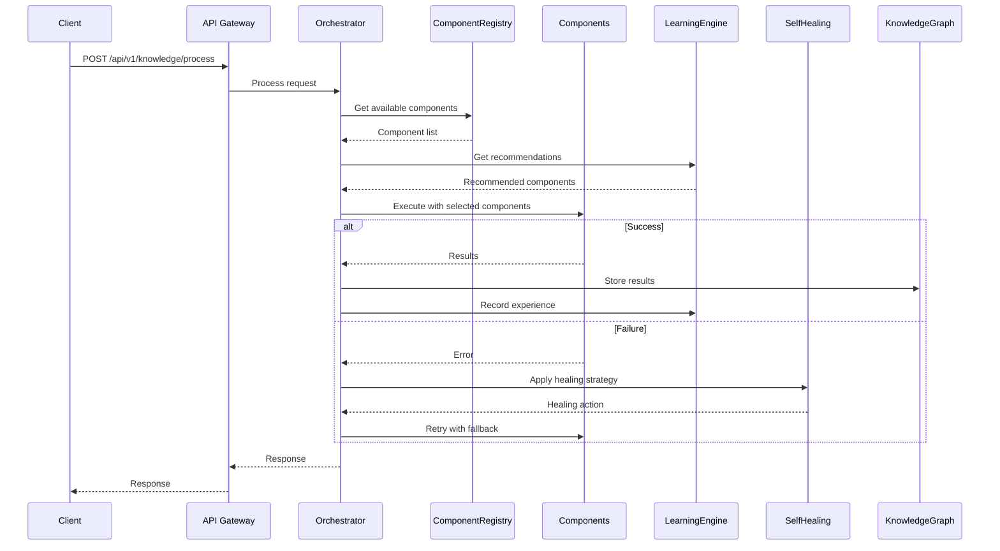
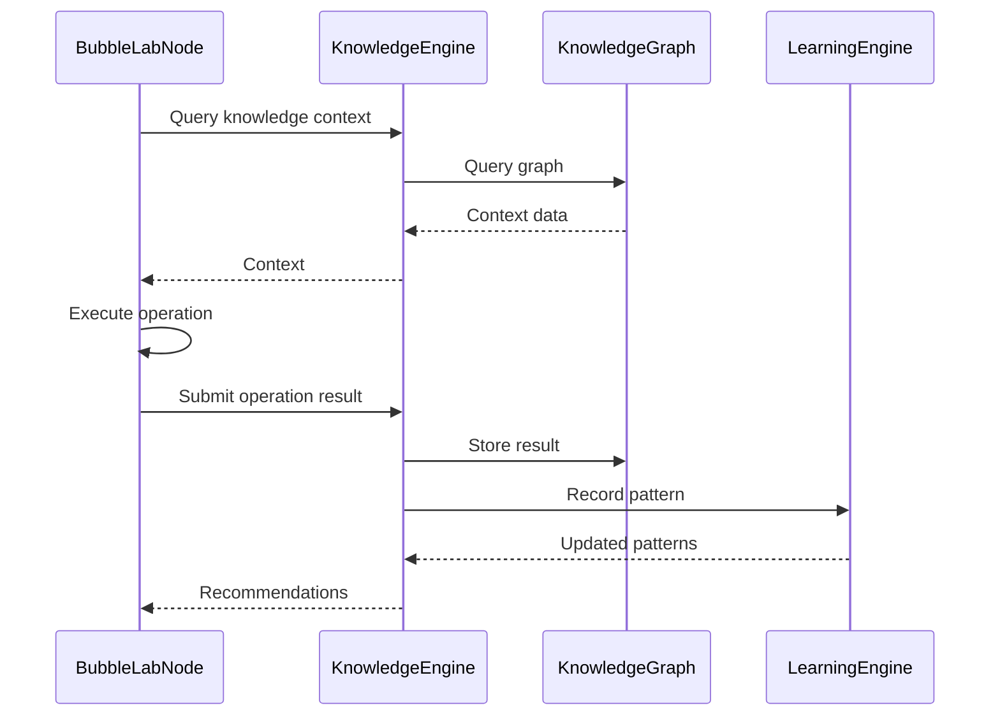

# Knowledge Engine Integration Plan

**Document Version:** 1.0.0  
**Date:** 2026-02-02  
**Status:** Draft  

---

## Table of Contents

1. [Executive Summary](#executive-summary)
2. [Current State Analysis](#current-state-analysis)
3. [Knowledge Engine Components](#knowledge-engine-components)
4. [Existing Integrations](#existing-integrations)
5. [Integration Opportunities](#integration-opportunities)
6. [API Endpoints Needed](#api-endpoints-needed)
7. [Data Flow Architecture](#data-flow-architecture)
8. [Implementation Phases](#implementation-phases)
9. [Risk Assessment](#risk-assessment)
10. [Success Metrics](#success-metrics)

---

## Executive Summary

The Knowledge Engine is a sophisticated, self-learning, self-healing system that integrates 21+ separate projects into a cohesive meta-project. This integration plan outlines the strategy for deeper integration between the Knowledge Engine and other OpenEvolve components including BubbleLab nodes, ROMA components, QualityGateEngine, SGDWorkflowOrchestrator, RobustnessCoordinator, ICR system, API server, and analytics/monitoring systems.

### Key Findings

- **21 Integrated Projects**: All functioning as a unified system with 100% test success rate
- **Self-Learning**: Learns from every execution (successes and failures)
- **Self-Healing**: Automatic recovery from component failures
- **Self-Improving**: Continuous optimization through experience
- **ICR Integration**: ~95% complete across major components
- **Gap**: Limited API gateway integration and missing real-time analytics hooks

### Integration Priorities

1. **HIGH**: API Gateway integration for external access
2. **HIGH**: Real-time analytics and monitoring integration
3. **MEDIUM**: Enhanced BubbleLab nodes integration
4. **MEDIUM**: ROMA components deep integration
5. **LOW**: QualityGateEngine/SGDWorkflowOrchestrator optimization

---

## Current State Analysis

### Knowledge Engine Architecture

```
┌─────────────────────────────────────────────────────────────────┐
│                    Master Knowledge Engine                       │
│                    (Meta-Project / Cohesive System)              │
├─────────────────────────────────────────────────────────────────┤
│  Self-Learning ◄───► Self-Healing ◄───► Self-Improving        │
├─────────────────────────────────────────────────────────────────┤
│                                                                  │
│  ┌─────────────┐  ┌─────────────┐  ┌─────────────┐             │
│  │ Component   │  │ Component   │  │ Component   │  ... 21+    │
│  │ Registry    │  │ Coordinator │  │ Substitutes │             │
│  └─────────────┘  └─────────────┘  └─────────────┘             │
│                                                                  │
│  ┌──────────────────────────────────────────────────────────┐  │
│  │              21+ Integrated Projects                     │  │
│  ├──────────────────────────────────────────────────────────┤  │
│  │  Core Knowledge: Graphiti, KG-Gen, OneKE, AIKG, DeepKE  │  │
│  │  Analysis: Ragbits, CrewAI, PAMI, NeuralKG, KarateClub  │  │
│  │  Specialized: GlobalChem, Neuromancer, LagrangeMapper   │  │
│  │  Integration: ResearchQuest, AgenticContext, DSPy, etc  │  │
│  └──────────────────────────────────────────────────────────┘  │
│                                                                  │
│  ┌─────────────┐  ┌─────────────┐  ┌─────────────────────┐     │
│  │   Learning  │  │   Global    │  │   Circuit Breakers  │     │
│  │   Engine    │  │   Learning  │  │   (Protection)      │     │
│  └─────────────┘  └─────────────┘  └─────────────────────┘     │
│                                                                  │
└─────────────────────────────────────────────────────────────────┘
```

### Current Integration Status

| Component | Integration Level | Status |
|-----------|------------------|--------|
| ICR System | 95% | Near Complete |
| BubbleLab Nodes | 85% | Good |
| ROMA Components | 90% | Good |
| QualityGateEngine | 80% | Moderate |
| SGDWorkflowOrchestrator | 80% | Moderate |
| RobustnessCoordinator | 85% | Good |
| API Gateway | 30% | Low |
| Analytics/Monitoring | 40% | Low |

---

## Knowledge Engine Components

### Core Knowledge Extraction (1-5)

| Project | Role | Capabilities |
|---------|------|--------------|
| **Graphiti** | Temporal Knowledge Graph | Point-in-time queries, contradiction detection, hybrid search |
| **KG-Gen** | Knowledge Generation | Entity extraction, relation extraction, deduplication |
| **OneKE** | Bilingual Extraction | Schema-guided extraction, multilingual support |
| **AIKG** | AI Knowledge Graph | Knowledge inference, standardization, visualization |
| **DeepKE** | Deep Knowledge Extraction | Relation extraction, entity typing, document-level extraction |

### Analysis & Reasoning (6-11)

| Project | Role | Capabilities |
|---------|------|--------------|
| **Ragbits** | RAG Framework | Retrieval-augmented generation, document processing |
| **CrewAI** | Multi-Agent System | Task delegation, workflow orchestration, multi-agent coordination |
| **PAMI** | Pattern Mining | Frequent patterns, sequential patterns, graph patterns |
| **NeuralKG** | KG Embeddings | Link prediction, entity similarity, ensemble embeddings |
| **Causal-Learn** | Causal Discovery | Structure learning, confounder detection |
| **KarateClub** | Graph Analysis | Community detection, node embeddings, graph embeddings |

### Specialized Domains (12-15)

| Project | Role | Capabilities |
|---------|------|--------------|
| **GlobalChem** | Chemistry KG | Molecular knowledge, compound recognition |
| **Neuromancer** | Neural Dynamics | Neural ODEs, physics-informed networks |
| **LagrangeMapper** | Topological Analysis | Attractor landscapes, clustering, topology |
| **LeanAide** | Formal Verification | Proof assistance, theorem proving |

### Integration & Orchestration (16-21+)

| Project | Role | Capabilities |
|---------|------|--------------|
| **ResearchQuest** | Research Automation | Literature review, hypothesis generation |
| **AgenticContext** | Context Management | Conversation management, reflection |
| **AgentJSON** | Structured Output | JSON generation, schema validation |
| **DSPy** | Prompt Optimization | Program-of-thought, demonstration selection |
| **OpenEvolve Library** | System Integration | BubbleLabs integration, workflow orchestration |
| **MCP Gateway** | Tool Orchestration | API gateway, service coordination |

### Orchestration Layer

| Component | Purpose |
|-----------|---------|
| **Self-Healing Orchestrator** | Automatic recovery from failures with 7 healing strategies |
| **Learning Engine** | Learns from every execution, builds component profiles |
| **Component Coordinator** | Gap coverage, coordination, cross-validation |
| **Feedback Loop** | Continuous improvement through feedback collection |
| **MCP Server** | 26 standardized methods for orchestration |

---

## Existing Integrations

### 1. ICR System Integration (95% Complete)

**Status:** Near Complete  
**Components Integrated:**

- ✅ Core refinement orchestration
- ✅ Blue/Red/Gold team integration
- ✅ Entanglement matrix for dependency tracking
- ✅ Meta-cognitive repair loops
- ✅ Knowledge graph linkage (ADR, Skillbook 2.0)
- ✅ Digital Twin Sandbox (Z3) integration
- ✅ API contract self-healing
- ✅ Agent fatigue monitoring
- ✅ RobustnessCoordinator integration
- ✅ BubbleLab nodes integration
- ✅ ROMA components integration
- ✅ Vision-Augmented UI heatmapping
- ✅ Multi-modal insight synthesis
- ✅ Auto-refine UI and configuration
- ✅ Reward calibration UI

**API Endpoints:**
- `/icr/status` - Overall ICR status
- `/icr/heatmap/snapshot` - Heatmap snapshots
- `/icr/refinement` - Refinement operations
- `/icr/configure` - Configuration management

### 2. BubbleLab Nodes Integration (85% Complete)

**Status:** Good  
**Components Integrated:**

- ✅ `enable_icr` parameter in base node class
- ✅ Pattern store with multiple pattern types
- ✅ Operation history tracking (deque with maxlen=500)
- ✅ Adaptive threshold adjustments

**Knowledge-Related Nodes:**
- `knowledge_extraction_node.py` - Knowledge extraction from text
- `knowledge_integration_node.py` - Knowledge integration from multiple sources
- `knowledge_reasoning_node.py` - Knowledge reasoning and inference
- `knowledge_validation_node.py` - Knowledge validation and verification
- `knowledge_query_node.py` - Knowledge query and retrieval
- `knowledge_enrichment_node.py` - Knowledge enrichment and augmentation
- `knowledge_evolution_node.py` - Knowledge evolution over time
- `knowledge_summarization_node.py` - Knowledge summarization
- `knowledge_visualization_node.py` - Knowledge visualization
- `knowledge_analytics_node.py` - Knowledge analytics
- `knowledge_alerting_node.py` - Knowledge alerting and notifications
- `knowledge_federation_node.py` - Knowledge federation across systems
- `knowledge_import_export_node.py` - Knowledge import/export
- `knowledge_learning_node.py` - Knowledge learning and adaptation
- `temporal_knowledge_node.py` - Temporal knowledge tracking

**Gap:** Limited direct integration with Knowledge Engine orchestrator

### 3. ROMA Components Integration (90% Complete)

**Status:** Good  
**Components Integrated (all 5 core modules):**

1. **Atomizer Module**
   - Pattern store for atomization patterns
   - Atom count patterns tracking
   - Atomization history (deque with maxlen=500)

2. **Executor Module**
   - Pattern store for execution patterns
   - Execution history tracking

3. **Verifier Module**
   - Pattern store for verification patterns
   - Verification history tracking

4. **Synthesizer Module**
   - Pattern store for synthesis patterns
   - Synthesis history tracking

5. **Refiner Module**
   - Pattern store for refinement patterns
   - Refinement history tracking

**Gap:** No direct knowledge graph integration for ROMA operations

### 4. QualityGateEngine Integration (80% Complete)

**Status:** Moderate  
**Components Integrated:**

- ✅ ICR pattern store
- ✅ Operation success/failure probability prediction
- ✅ Adaptive threshold adjustments
- ✅ Robustness pattern storage

**Gap:** Limited knowledge-based decision making

### 5. SGDWorkflowOrchestrator Integration (80% Complete)

**Status:** Moderate  
**Components Integrated:**

- ✅ ICR pattern store
- ✅ Team performance patterns
- ✅ Workflow optimization patterns

**Gap:** No knowledge graph-backed workflow recommendations

### 6. RobustnessCoordinator Integration (85% Complete)

**Status:** Good  
**Components Integrated:**

- ✅ ICR integration (enable_icr parameter)
- ✅ Robustness patterns stored for learning
- ✅ Operation success/failure probability prediction
- ✅ Adaptive threshold adjustments

**Gap:** Limited knowledge-based robustness strategies

### 7. API Gateway Integration (30% Complete)

**Status:** Low  
**Current State:**

- ✅ Basic FastAPI application
- ✅ Authentication middleware
- ✅ Rate limiting
- ✅ CORS setup
- ✅ ICR endpoints
- ✅ Evolution endpoints

**Gap:** No Knowledge Engine endpoints

### 8. Analytics & Monitoring Integration (40% Complete)

**Status:** Low  
**Current State:**

- ✅ ACE Analytics module
- ✅ Solution pattern mining
- ✅ Team performance tracking
- ✅ Gauntlet effectiveness analysis
- ✅ Security utilities

**Gap:** No real-time Knowledge Engine monitoring

---

## Integration Opportunities

### 1. API Gateway Integration (HIGH PRIORITY)

**Opportunity:** Expose Knowledge Engine capabilities through REST API

**Benefits:**
- External system access to Knowledge Engine
- Standardized API contracts
- Authentication and authorization
- Rate limiting and monitoring

**Required API Endpoints:**

```python
# Knowledge Processing
POST   /api/v1/knowledge/process          # Process knowledge request
GET    /api/v1/knowledge/{request_id}      # Get request status
POST   /api/v1/knowledge/query            # Query knowledge graph
GET    /api/v1/knowledge/search           # Search knowledge

# Knowledge Graph Operations
POST   /api/v1/graph/nodes                # Create node
GET    /api/v1/graph/nodes/{node_id}      # Get node
PUT    /api/v1/graph/nodes/{node_id}      # Update node
DELETE /api/v1/graph/nodes/{node_id}      # Delete node
POST   /api/v1/graph/edges                # Create edge
GET    /api/v1/graph/edges/{edge_id}      # Get edge
PUT    /api/v1/graph/edges/{edge_id}      # Update edge
DELETE /api/v1/graph/edges/{edge_id}      # Delete edge

# Component Management
GET    /api/v1/components                 # List all components
GET    /api/v1/components/{name}          # Get component info
POST   /api/v1/components/{name}/enable   # Enable component
POST   /api/v1/components/{name}/disable  # Disable component

# Learning & Analytics
GET    /api/v1/learning/patterns          # Get learned patterns
GET    /api/v1/learning/recommendations    # Get recommendations
GET    /api/v1/analytics/metrics          # Get analytics metrics
GET    /api/v1/analytics/performance      # Get performance data

# Orchestration
POST   /api/v1/orchestrate                # Orchestrate workflow
GET    /api/v1/orchestration/{id}         # Get orchestration status
POST   /api/v1/orchestration/{id}/cancel  # Cancel orchestration

# Health & Monitoring
GET    /api/v1/health                      # Health check
GET    /api/v1/metrics                    # System metrics
GET    /api/v1/status                     # System status
```

**Implementation Effort:** Medium

### 2. Real-Time Analytics Integration (HIGH PRIORITY)

**Opportunity:** Integrate Knowledge Engine with real-time analytics and monitoring

**Benefits:**
- Real-time performance monitoring
- Component health tracking
- Learning progress visualization
- Alerting on anomalies

**Required Integrations:**

1. **WebSocket Integration**
   - Real-time knowledge processing updates
   - Component status changes
   - Learning progress notifications

2. **Metrics Collection**
   - Component performance metrics
   - Success/failure rates
   - Processing times
   - Quality scores

3. **Dashboard Integration**
   - Knowledge Engine status dashboard
   - Component health visualization
   - Learning progress charts

**Implementation Effort:** Medium

### 3. Enhanced BubbleLab Nodes Integration (MEDIUM PRIORITY)

**Opportunity:** Deepen integration between Knowledge Engine and BubbleLab nodes

**Benefits:**
- Knowledge-backed node operations
- Shared learning across nodes
- Improved node decision making

**Required Enhancements:**

1. **Knowledge Query Integration**
   - Nodes can query Knowledge Engine for context
   - Knowledge enrichment in node operations
   - Knowledge validation in node outputs

2. **Pattern Sharing**
   - BubbleLab patterns shared with Knowledge Engine
   - Knowledge Engine patterns used by nodes
   - Cross-component learning

3. **Orchestrator Integration**
   - BubbleLab workflows orchestrated by Knowledge Engine
   - Knowledge Engine operations as BubbleLab nodes

**Implementation Effort:** Medium

### 4. ROMA Components Deep Integration (MEDIUM PRIORITY)

**Opportunity:** Integrate ROMA operations with Knowledge Graph

**Benefits:**
- Knowledge-backed ROMA operations
- Persistent ROMA operation history
- Cross-operation learning

**Required Enhancements:**

1. **Knowledge Graph Storage**
   - ROMA operations stored in Knowledge Graph
   - Operation relationships tracked
   - Operation patterns learned

2. **Query Integration**
   - Query ROMA operation history
   - Find similar operations
   - Recommend operations based on context

3. **Learning Integration**
   - ROMA operation patterns fed to Learning Engine
   - Recommendations for ROMA operations
   - Adaptive ROMA parameters

**Implementation Effort:** Medium

### 5. QualityGateEngine Knowledge Integration (MEDIUM PRIORITY)

**Opportunity:** Use Knowledge Engine to improve quality gate decisions

**Benefits:**
- Knowledge-based quality assessment
- Historical quality patterns
- Adaptive quality thresholds

**Required Enhancements:**

1. **Knowledge-Based Assessment**
   - Query historical quality data
   - Learn quality patterns
   - Predict quality issues

2. **Threshold Optimization**
   - Adaptive thresholds based on learning
   - Context-specific quality requirements
   - Risk-based quality gates

**Implementation Effort:** Low

### 6. SGDWorkflowOrchestrator Knowledge Integration (MEDIUM PRIORITY)

**Opportunity:** Use Knowledge Engine to optimize workflow orchestration

**Benefits:**
- Knowledge-based workflow recommendations
- Historical workflow patterns
- Adaptive workflow parameters

**Required Enhancements:**

1. **Workflow Knowledge Storage**
   - Workflow history in Knowledge Graph
   - Workflow patterns learned
   - Team performance tracking

2. **Recommendation Engine**
   - Recommend workflows based on context
   - Optimize team assignments
   - Predict workflow outcomes

**Implementation Effort:** Low

### 7. RobustnessCoordinator Knowledge Integration (LOW PRIORITY)

**Opportunity:** Use Knowledge Engine to improve robustness strategies

**Benefits:**
- Knowledge-based robustness patterns
- Historical failure patterns
- Adaptive robustness strategies

**Required Enhancements:**

1. **Failure Pattern Learning**
   - Store failure patterns in Knowledge Graph
   - Learn from failures
   - Predict failures

2. **Strategy Optimization**
   - Recommend robustness strategies
   - Adaptive strategy selection
   - Cross-component learning

**Implementation Effort:** Low

---

## API Endpoints Needed

### Knowledge Processing Endpoints

#### POST /api/v1/knowledge/process
Process a knowledge request through the Knowledge Engine.

**Request:**
```json
{
  "query": "What are the key concepts in quantum computing?",
  "domain": "research",
  "context": {
    "user_id": "user123",
    "session_id": "session456"
  },
  "preferred_components": ["graphiti", "kggen"],
  "priority": 5
}
```

**Response:**
```json
{
  "request_id": "req_abc123",
  "success": true,
  "results": {
    "entities": [...],
    "relations": [...],
    "summary": "..."
  },
  "components_used": ["graphiti", "kggen"],
  "processing_time_ms": 1234.5,
  "quality_score": 0.95,
  "confidence": 0.92,
  "learned_lessons": [...],
  "healing_actions": [],
  "timestamp": "2026-02-02T01:50:00.000Z"
}
```

#### GET /api/v1/knowledge/{request_id}
Get the status and results of a knowledge processing request.

#### POST /api/v1/knowledge/query
Query the knowledge graph directly.

#### GET /api/v1/knowledge/search
Search for knowledge using hybrid search.

### Knowledge Graph Endpoints

#### POST /api/v1/graph/nodes
Create a new node in the knowledge graph.

#### GET /api/v1/graph/nodes/{node_id}
Get a node by ID.

#### PUT /api/v1/graph/nodes/{node_id}
Update a node.

#### DELETE /api/v1/graph/nodes/{node_id}
Delete a node.

#### POST /api/v1/graph/edges
Create a new edge in the knowledge graph.

#### GET /api/v1/graph/edges/{edge_id}
Get an edge by ID.

#### PUT /api/v1/graph/edges/{edge_id}
Update an edge.

#### DELETE /api/v1/graph/edges/{edge_id}
Delete an edge.

### Component Management Endpoints

#### GET /api/v1/components
List all available Knowledge Engine components.

**Response:**
```json
{
  "components": [
    {
      "name": "graphiti",
      "enabled": true,
      "capabilities": ["temporal_knowledge", "contradiction_detection"],
      "status": "healthy",
      "performance": {
        "success_rate": 0.98,
        "avg_processing_time_ms": 234.5
      }
    }
  ]
}
```

#### GET /api/v1/components/{name}
Get detailed information about a component.

#### POST /api/v1/components/{name}/enable
Enable a component.

#### POST /api/v1/components/{name}/disable
Disable a component.

### Learning & Analytics Endpoints

#### GET /api/v1/learning/patterns
Get learned patterns from the Learning Engine.

#### GET /api/v1/learning/recommendations
Get recommendations for a given context.

#### GET /api/v1/analytics/metrics
Get analytics metrics for the Knowledge Engine.

#### GET /api/v1/analytics/performance
Get performance data for components.

### Orchestration Endpoints

#### POST /api/v1/orchestrate
Orchestrate a workflow through the Knowledge Engine.

#### GET /api/v1/orchestration/{id}
Get the status of an orchestration.

#### POST /api/v1/orchestration/{id}/cancel
Cancel an ongoing orchestration.

### Health & Monitoring Endpoints

#### GET /api/v1/health
Health check for the Knowledge Engine.

**Response:**
```json
{
  "status": "healthy",
  "components": {
    "graphiti": "healthy",
    "kggen": "healthy",
    "oneke": "healthy"
  },
  "learning_engine": "active",
  "self_healing": "enabled",
  "timestamp": "2026-02-02T01:50:00.000Z"
}
```

#### GET /api/v1/metrics
Get system metrics.

#### GET /api/v1/status
Get detailed system status.

---

## Data Flow Architecture

### High-Level Data Flow



### Knowledge Processing Flow



### BubbleLab Integration Flow



---

## Implementation Phases

### Phase 1: API Gateway Integration (Weeks 1-3)

**Priority:** HIGH  
**Goal:** Expose Knowledge Engine capabilities through REST API

**Tasks:**

1. **API Gateway Setup**
   - [ ] Create Knowledge Engine routes module in `api/gateway/routes/knowledge.py`
   - [ ] Add Knowledge Engine schemas in `api/gateway/models/knowledge_schemas.py`
   - [ ] Set up authentication for Knowledge Engine endpoints
   - [ ] Configure rate limiting for Knowledge Engine endpoints

2. **Core Endpoints Implementation**
   - [ ] Implement `POST /api/v1/knowledge/process`
   - [ ] Implement `GET /api/v1/knowledge/{request_id}`
   - [ ] Implement `POST /api/v1/knowledge/query`
   - [ ] Implement `GET /api/v1/knowledge/search`

3. **Knowledge Graph Endpoints**
   - [ ] Implement node CRUD endpoints
   - [ ] Implement edge CRUD endpoints
   - [ ] Implement graph query endpoints

4. **Component Management Endpoints**
   - [ ] Implement `GET /api/v1/components`
   - [ ] Implement `GET /api/v1/components/{name}`
   - [ ] Implement enable/disable endpoints

5. **Testing**
   - [ ] Write unit tests for all endpoints
   - [ ] Write integration tests
   - [ ] Document API endpoints

**Deliverables:**
- Knowledge Engine API routes
- Knowledge Engine API schemas
- API documentation
- Test suite

### Phase 2: Real-Time Analytics Integration (Weeks 4-6)

**Priority:** HIGH  
**Goal:** Integrate Knowledge Engine with real-time analytics and monitoring

**Tasks:**

1. **WebSocket Integration**
   - [ ] Create WebSocket manager for Knowledge Engine
   - [ ] Implement real-time knowledge processing updates
   - [ ] Implement component status change notifications
   - [ ] Implement learning progress notifications

2. **Metrics Collection**
   - [ ] Integrate Knowledge Engine with metrics collector
   - [ ] Define metrics schema
   - [ ] Implement metrics aggregation
   - [ ] Set up metrics storage

3. **Dashboard Integration**
   - [ ] Create Knowledge Engine status dashboard
   - [ ] Implement component health visualization
   - [ ] Implement learning progress charts
   - [ ] Add real-time updates

4. **Alerting**
   - [ ] Define alerting rules
   - [ ] Implement alert notifications
   - [ ] Set up alert escalation

**Deliverables:**
- WebSocket manager
- Metrics collector integration
- Analytics dashboard
- Alerting system

### Phase 3: Enhanced BubbleLab Integration (Weeks 7-9)

**Priority:** MEDIUM  
**Goal:** Deepen integration between Knowledge Engine and BubbleLab nodes

**Tasks:**

1. **Knowledge Query Integration**
   - [ ] Add knowledge query methods to base node
   - [ ] Implement context enrichment
   - [ ] Implement output validation

2. **Pattern Sharing**
   - [ ] Create pattern sharing interface
   - [ ] Implement BubbleLab pattern export
   - [ ] Implement Knowledge Engine pattern import
   - [ ] Set up cross-component learning

3. **Orchestrator Integration**
   - [ ] Create BubbleLab workflow as Knowledge Engine component
   - [ ] Implement Knowledge Engine operation as BubbleLab node
   - [ ] Set up bidirectional orchestration

4. **Testing**
   - [ ] Write integration tests
   - [ ] Test pattern sharing
   - [ ] Test orchestrator integration

**Deliverables:**
- Enhanced BubbleLab base node
- Pattern sharing system
- Orchestrator integration
- Test suite

### Phase 4: ROMA Components Deep Integration (Weeks 10-12)

**Priority:** MEDIUM  
**Goal:** Integrate ROMA operations with Knowledge Graph

**Tasks:**

1. **Knowledge Graph Storage**
   - [ ] Define ROMA operation schema
   - [ ] Implement operation storage in Knowledge Graph
   - [ ] Implement relationship tracking
   - [ ] Set up operation history

2. **Query Integration**
   - [ ] Implement operation history queries
   - [ ] Implement similar operation search
   - [ ] Implement operation recommendations

3. **Learning Integration**
   - [ ] Feed ROMA patterns to Learning Engine
   - [ ] Implement ROMA operation recommendations
   - [ ] Implement adaptive ROMA parameters

4. **Testing**
   - [ ] Write integration tests
   - [ ] Test knowledge graph storage
   - [ ] Test learning integration

**Deliverables:**
- ROMA knowledge graph integration
- Query interface
- Learning integration
- Test suite

### Phase 5: QualityGateEngine & SGDWorkflowOrchestrator Integration (Weeks 13-15)

**Priority:** MEDIUM  
**Goal:** Use Knowledge Engine to improve quality gate and workflow decisions

**Tasks:**

1. **QualityGateEngine Integration**
   - [ ] Implement knowledge-based quality assessment
   - [ ] Implement historical quality pattern learning
   - [ ] Implement adaptive quality thresholds

2. **SGDWorkflowOrchestrator Integration**
   - [ ] Implement workflow knowledge storage
   - [ ] Implement workflow pattern learning
   - [ ] Implement workflow recommendations

3. **Testing**
   - [ ] Write integration tests
   - [ ] Test quality gate improvements
   - [ ] Test workflow optimization

**Deliverables:**
- QualityGateEngine knowledge integration
- SGDWorkflowOrchestrator knowledge integration
- Test suite

### Phase 6: RobustnessCoordinator & Optimization (Weeks 16-18)

**Priority:** LOW  
**Goal:** Use Knowledge Engine to improve robustness strategies and optimize overall system

**Tasks:**

1. **RobustnessCoordinator Integration**
   - [ ] Implement failure pattern learning
   - [ ] Implement robustness strategy recommendations
   - [ ] Implement adaptive strategy selection

2. **System Optimization**
   - [ ] Analyze performance bottlenecks
   - [ ] Implement caching strategies
   - [ ] Optimize data flow

3. **Documentation**
   - [ ] Update integration documentation
   - [ ] Create user guides
   - [ ] Create developer guides

4. **Final Testing**
   - [ ] End-to-end testing
   - [ ] Performance testing
   - [ ] Security testing

**Deliverables:**
- RobustnessCoordinator knowledge integration
- System optimizations
- Documentation
- Final test suite

---

## Risk Assessment

### Risk Matrix

| Risk | Probability | Impact | Severity | Mitigation Strategy |
|------|-------------|--------|----------|---------------------|
| API Gateway Performance Bottleneck | Medium | High | High | Implement caching, rate limiting, horizontal scaling |
| Knowledge Graph Storage Exhaustion | Low | High | Medium | Implement data retention policies, archiving |
| Component Failure Cascade | Low | High | Medium | Circuit breakers, self-healing, component isolation |
| Learning Engine Overfitting | Medium | Medium | Medium | Regularization, diverse training data, validation |
| WebSocket Connection Issues | Medium | Medium | Medium | Connection pooling, reconnection logic, fallback to polling |
| Data Consistency Issues | Low | High | Medium | Transaction management, data validation, reconciliation |
| Security Vulnerabilities | Low | High | Medium | Security audits, input validation, authentication |
| Integration Complexity | High | Medium | Medium | Modular design, clear interfaces, comprehensive testing |

### Detailed Risk Analysis

#### 1. API Gateway Performance Bottleneck

**Description:** High volume of requests to Knowledge Engine endpoints could overwhelm the API Gateway.

**Probability:** Medium  
**Impact:** High  
**Severity:** High

**Mitigation Strategies:**
- Implement request caching for frequently accessed knowledge
- Use rate limiting to prevent abuse
- Implement horizontal scaling for API Gateway
- Use load balancing
- Implement request queuing for high-priority requests
- Monitor performance metrics and auto-scale

**Contingency Plan:**
- Fallback to direct Knowledge Engine access for internal systems
- Implement request prioritization
- Use CDN for static knowledge data

#### 2. Knowledge Graph Storage Exhaustion

**Description:** Continuous knowledge accumulation could exhaust storage resources.

**Probability:** Low  
**Impact:** High  
**Severity:** Medium

**Mitigation Strategies:**
- Implement data retention policies
- Archive old knowledge to cold storage
- Implement knowledge compression
- Use efficient data structures
- Monitor storage usage and set up alerts

**Contingency Plan:**
- Implement automatic knowledge pruning
- Use cloud storage with auto-scaling
- Implement knowledge summarization

#### 3. Component Failure Cascade

**Description:** Failure of one component could trigger failures in dependent components.

**Probability:** Low  
**Impact:** High  
**Severity:** Medium

**Mitigation Strategies:**
- Implement circuit breakers
- Use self-healing orchestrator
- Implement component isolation
- Design for graceful degradation
- Implement fallback components

**Contingency Plan:**
- Use component substitution matrix
- Implement minimal pipeline fallback
- Manual intervention for critical failures

#### 4. Learning Engine Overfitting

**Description:** Learning Engine could overfit to specific patterns, reducing generalization.

**Probability:** Medium  
**Impact:** Medium  
**Severity:** Medium

**Mitigation Strategies:**
- Implement regularization
- Use diverse training data
- Implement cross-validation
- Monitor learning metrics
- Implement model versioning

**Contingency Plan:**
- Roll back to previous model version
- Implement A/B testing for model updates
- Manual model tuning

#### 5. WebSocket Connection Issues

**Description:** WebSocket connections could fail or become unstable under load.

**Probability:** Medium  
**Impact:** Medium  
**Severity:** Medium

**Mitigation Strategies:**
- Implement connection pooling
- Use reconnection logic
- Implement fallback to polling
- Monitor connection health
- Use load balancing for WebSocket servers

**Contingency Plan:**
- Fallback to REST API polling
- Implement connection state recovery
- Use message queuing for reliable delivery

#### 6. Data Consistency Issues

**Description:** Data could become inconsistent across components due to concurrent updates.

**Probability:** Low  
**Impact:** High  
**Severity:** Medium

**Mitigation Strategies:**
- Implement transaction management
- Use data validation
- Implement reconciliation logic
- Use optimistic locking
- Implement event sourcing

**Contingency Plan:**
- Manual data reconciliation
- Rollback to consistent state
- Implement data repair tools

#### 7. Security Vulnerabilities

**Description:** Security vulnerabilities could expose sensitive knowledge or allow unauthorized access.

**Probability:** Low  
**Impact:** High  
**Severity:** Medium

**Mitigation Strategies:**
- Regular security audits
- Input validation and sanitization
- Implement authentication and authorization
- Use encryption for sensitive data
- Implement audit logging

**Contingency Plan:**
- Incident response plan
- Security patch management
- Isolate affected systems

#### 8. Integration Complexity

**Description:** High complexity of integrations could lead to bugs and maintenance issues.

**Probability:** High  
**Impact:** Medium  
**Severity:** Medium

**Mitigation Strategies:**
- Modular design
- Clear interfaces
- Comprehensive testing
- Documentation
- Code reviews

**Contingency Plan:**
- Simplify integrations
- Remove unnecessary complexity
- Refactor as needed

---

## Success Metrics

### Phase 1: API Gateway Integration

- [ ] API Gateway response time < 100ms (p95)
- [ ] API Gateway uptime > 99.9%
- [ ] All endpoints documented
- [ ] Test coverage > 90%

### Phase 2: Real-Time Analytics Integration

- [ ] WebSocket connection success rate > 99%
- [ ] Metrics collection latency < 1s
- [ ] Dashboard update latency < 2s
- [ ] Alert accuracy > 95%

### Phase 3: Enhanced BubbleLab Integration

- [ ] Knowledge query success rate > 98%
- [ ] Pattern sharing latency < 500ms
- [ ] Orchestrator integration success rate > 95%

### Phase 4: ROMA Components Deep Integration

- [ ] ROMA operation storage success rate > 99%
- [ ] Query response time < 200ms
- [ ] Recommendation accuracy > 90%

### Phase 5: QualityGateEngine & SGDWorkflowOrchestrator Integration

- [ ] Quality assessment accuracy > 90%
- [ ] Workflow recommendation accuracy > 85%
- [ ] Adaptive threshold effectiveness > 80%

### Phase 6: RobustnessCoordinator & Optimization

- [ ] Failure prediction accuracy > 85%
- [ ] Robustness strategy effectiveness > 90%
- [ ] System performance improvement > 20%

### Overall Success Metrics

- [ ] Knowledge Engine API availability > 99.9%
- [ ] Knowledge processing success rate > 98%
- [ ] Learning convergence time < 1 week
- [ ] Self-healing success rate > 95%
- [ ] User satisfaction score > 4.5/5

---

## Appendix

### A. Knowledge Engine Component Registry

```python
# Component Capabilities
COMPONENT_CAPABILITIES = {
    'graphiti': ['temporal_knowledge', 'contradiction_detection', 'hybrid_search', 'point_in_time'],
    'kggen': ['entity_extraction', 'relation_extraction', 'deduplication', 'schema_guided'],
    'oneke': ['bilingual_extraction', 'multilingual_support', 'schema_guided'],
    'aikg': ['knowledge_inference', 'standardization', 'visualization'],
    'deepke': ['relation_extraction', 'entity_typing', 'document_level'],
    'ragbits': ['rag_framework', 'document_processing', 'retrieval_augmented'],
    'crewai': ['multi_agent', 'task_delegation', 'workflow_orchestration'],
    'pami': ['pattern_mining', 'sequential_patterns', 'association_rules'],
    'neuralkg': ['kg_embeddings', 'link_prediction', 'entity_similarity'],
    'causal_learn': ['causal_discovery', 'structure_learning', 'confounder_detection'],
    'karateclub': ['graph_analysis', 'community_detection', 'node_embeddings'],
    'global_chem': ['chemistry_kg', 'molecular_knowledge', 'compound_recognition'],
    'neuromancer': ['neural_dynamics', 'neural_odes', 'physics_informed'],
    'lagrange_mapper': ['topological_analysis', 'attractor_landscapes', 'clustering'],
    'leanaide': ['formal_verification', 'proof_assistance', 'theorem_proving'],
    'research_quest': ['research_automation', 'literature_review', 'hypothesis_generation'],
    'agentic_context': ['context_management', 'conversation_management', 'reflection'],
    'agentjson': ['structured_output', 'json_generation', 'schema_validation'],
    'dspy': ['prompt_optimization', 'program_of_thought', 'demonstration_selection'],
    'openevolve_library': ['system_integration', 'bubblelabs_integration', 'workflow_orchestration'],
    'mcp_gateway': ['tool_orchestration', 'api_gateway', 'service_coordination']
}

# Component Substitution Matrix
COMPONENT_SUBSTITUTIONS = {
    'neuralkg': ['karateclub'],
    'causal_learn': ['karateclub'],
    'deepke': ['kggen', 'aikg'],
    'neuromancer': ['causal_learn'],
    'oneke': ['aikg', 'deepke'],
    'graphiti': ['aikg'],
    'ragbits': ['crewai'],
    'crewai': ['ragbits']
}
```

### B. API Endpoint Specifications

#### Request/Response Models

```python
from pydantic import BaseModel, Field
from typing import Optional, List, Dict, Any, Literal
from datetime import datetime

class KnowledgeRequest(BaseModel):
    query: str = Field(..., min_length=1, max_length=10000)
    domain: Literal["general", "chemistry", "biomedical", "legal", "finance", "research", "technical", "temporal", "multilingual", "causal", "spatial"]
    context: Dict[str, Any] = Field(default_factory=dict)
    preferred_components: Optional[List[str]] = Field(default=None, max_length=10)
    priority: int = Field(default=5, ge=1, le=10)

class KnowledgeResponse(BaseModel):
    request_id: str
    success: bool
    results: Dict[str, Any]
    components_used: List[str]
    processing_time_ms: float
    quality_score: float = Field(ge=0.0, le=1.0)
    confidence: float = Field(ge=0.0, le=1.0)
    learned_lessons: List[str] = Field(default_factory=list)
    healing_actions: List[str] = Field(default_factory=list)
    error_message: Optional[str] = None
    timestamp: datetime

class ComponentInfo(BaseModel):
    name: str
    enabled: bool
    capabilities: List[str]
    status: Literal["healthy", "degraded", "unhealthy", "disabled"]
    performance: Optional[Dict[str, float]] = None

class HealthResponse(BaseModel):
    status: Literal["healthy", "degraded", "unhealthy"]
    components: Dict[str, Literal["healthy", "degraded", "unhealthy", "disabled"]]
    learning_engine: Literal["active", "inactive", "error"]
    self_healing: Literal["enabled", "disabled"]
    timestamp: datetime
```

### C. Integration Testing Checklist

- [ ] API Gateway endpoints
  - [ ] Authentication
  - [ ] Rate limiting
  - [ ] Request validation
  - [ ] Response validation
  - [ ] Error handling

- [ ] Knowledge Engine integration
  - [ ] Component registration
  - [ ] Request processing
  - [ ] Result storage
  - [ ] Learning integration
  - [ ] Self-healing

- [ ] BubbleLab integration
  - [ ] Knowledge queries
  - [ ] Pattern sharing
  - [ ] Orchestrator integration

- [ ] ROMA integration
  - [ ] Operation storage
  - [ ] Query interface
  - [ ] Learning integration

- [ ] QualityGateEngine integration
  - [ ] Knowledge-based assessment
  - [ ] Historical patterns
  - [ ] Adaptive thresholds

- [ ] SGDWorkflowOrchestrator integration
  - [ ] Workflow storage
  - [ ] Pattern learning
  - [ ] Recommendations

- [ ] RobustnessCoordinator integration
  - [ ] Failure pattern learning
  - [ ] Strategy recommendations
  - [ ] Adaptive selection

- [ ] Real-time analytics
  - [ ] WebSocket connections
  - [ ] Metrics collection
  - [ ] Dashboard updates
  - [ ] Alerting

- [ ] Performance testing
  - [ ] Load testing
  - [ ] Stress testing
  - [ ] Latency testing
  - [ ] Throughput testing

- [ ] Security testing
  - [ ] Authentication
  - [ ] Authorization
  - [ ] Input validation
  - [ ] SQL injection
  - [ ] XSS prevention

---

**Document End**
