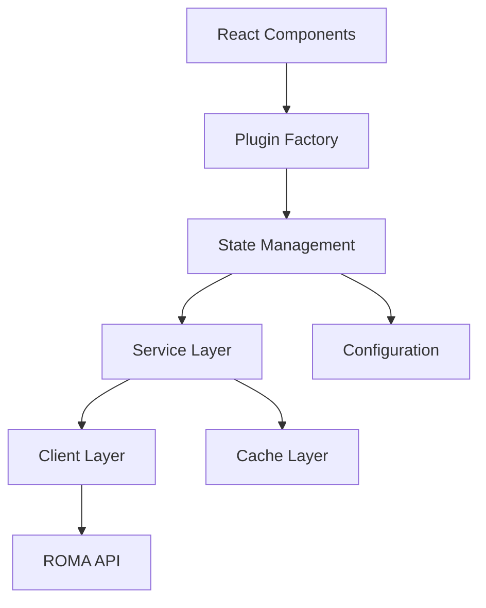
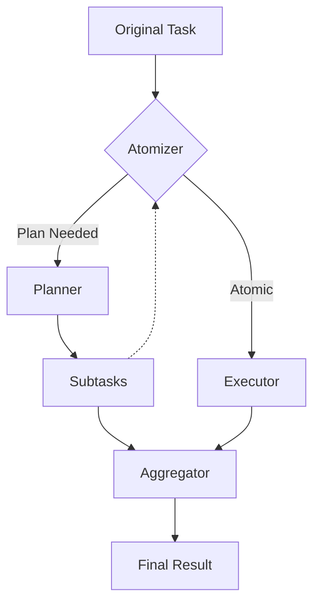

# ROMA BubbleLabs Plugin

**ROMA (Recursive Open Meta-Agents) Integration for BubbleLabs**


## 📖 Table of Contents

- [📖 Table of Contents](#-table-of-contents)
- [🚀 Introduction](#-introduction)
- [🎯 Features](#-features)
- [📦 Installation](#-installation)
- [🔧 Configuration](#-configuration)
- [🏗️ Architecture](#-architecture)
- [📂 Plugin Structure](#-plugin-structure)
- [🎨 React Components](#-react-components)
- [🔌 Service Layer](#-service-layer)
- [📝 TypeScript Interfaces](#-typescript-interfaces)
- [🚀 Usage Examples](#-usage-examples)
- [📊 ROMA Core Concepts](#-roma-core-concepts)
- [🔗 MCP Integration](#-mcp-integration)
- [🛠️ Toolkits](#-toolkits)
- [📈 Performance Optimization](#-performance-optimization)
- [🔒 Error Handling](#-error-handling)
- [🧪 Testing](#-testing)
- [📄 API Reference](#-api-reference)
- [🎓 Best Practices](#-best-practices)
- [🐛 Troubleshooting](#-troubleshooting)
- [📚 Resources](#-resources)
- [📝 License](#-license)

## 🚀 Introduction

The **ROMA BubbleLabs Plugin** provides seamless integration of [ROMA (Recursive Open Meta-Agents)](https://github.com/sentient-agi/roma) into the BubbleLabs ecosystem. ROMA is a powerful meta-agent framework that uses hierarchical task decomposition to solve complex problems through recursive planning and execution.

This plugin follows the same architectural pattern as other BubbleLabs plugins (LeanAIDE, ClaudieMiro, Datapizza) and provides:

- **Standalone operation** without modifying core BubbleLabs codebase
- **Comprehensive UI configurability** through React components
- **Full TypeScript support** with complete type definitions
- **State management** with Zustand for global plugin state
- **Service layer** with caching and retry logic
- **MCP integration** for connecting to external tools and data sources

## 🎯 Features

### Core ROMA Functionality

- **Hierarchical Task Decomposition**: Break complex tasks into manageable subtasks
- **5 Core Modules**: Atomizer, Planner, Executor, Aggregator, Verifier
- **Recursive Execution**: Tasks are decomposed and executed recursively
- **Dependency Management**: Automatic handling of task dependencies

### BubbleLabs Integration

- **Standalone Plugin Architecture**: Zero modifications to core BubbleLabs
- **React Components**: Configurable UI panels for setup and monitoring
- **React Hooks**: Easy integration with existing React applications
- **State Management**: Global plugin state with comprehensive tracking
- **Error Handling**: Robust error handling with user-friendly messages

### Advanced Features

- **MCP Integration**: Connect to 700+ MCP servers for unlimited extensibility
- **Toolkit System**: 10+ built-in toolkits plus custom toolkit support
- **Caching System**: Execution result caching with configurable TTL
- **Retry Logic**: Automatic retry with exponential backoff
- **Performance Analysis**: Execution metrics and efficiency scoring
- **Observability**: Optional MLflow integration for tracking

## 📦 Installation

### Prerequisites

- **Node.js** 18+ or **Bun** 1.0+
- **BubbleLabs** core system
- **ROMA Server** (optional for local development)

### Install via NPM

```bash
# Install the ROMA plugin
npm install roma-bubblelab-plugin

# Or with yarn
yarn add roma-bubblelab-plugin

# Or with pnpm
pnpm add roma-bubblelab-plugin
```

### Install via Bun

```bash
bun add roma-bubblelab-plugin
```

### Development Installation

```bash
# Clone the repository
git clone https://github.com/your-repo/roma-bubblelab-plugin.git
cd roma-bubblelab-plugin

# Install dependencies
bun install

# Build the plugin
bun run build

# Run tests
bun run test
```

## 🔧 Configuration

### Basic Configuration

```typescript
import { createRomaPlugin } from 'roma-bubblelab-plugin';

// Create ROMA plugin instance
const romaPlugin = createRomaPlugin({
  serverUrl: 'http://localhost:8000',
  apiKey: 'your-api-key',
  defaultProfile: 'general',
  maxDepth: 3,
  timeout: 30000,
  enableObservability: false,
  enableStorage: false
});

// Initialize the plugin
await romaPlugin.initialize();
```

### Advanced Configuration

```typescript
import { createRomaPlugin, RomaMcpServerConfig, RomaToolkitConfig } from 'roma-bubblelab-plugin';

// Define MCP servers
const mcpServers: RomaMcpServerConfig[] = [
  {
    server_name: 'coingecko',
    server_type: 'http',
    url: 'https://mcp.api.coingecko.com/sse',
    use_storage: false,
    enabled: true
  },
  {
    server_name: 'exa',
    server_type: 'http',
    url: 'https://mcp.exa.ai/mcp',
    headers: {
      Authorization: 'Bearer your-exa-api-key'
    },
    use_storage: true,
    storage_threshold_kb: 100,
    enabled: true
  }
];

// Define toolkits
const toolkits: RomaToolkitConfig[] = [
  {
    class_name: 'FileToolkit',
    enabled: true
  },
  {
    class_name: 'CalculatorToolkit',
    enabled: true
  },
  {
    class_name: 'E2BToolkit',
    enabled: true,
    toolkit_config: {
      timeout: 300
    }
  }
];

// Create ROMA plugin with full configuration
const romaPlugin = createRomaPlugin({
  serverUrl: 'http://localhost:8000',
  apiKey: 'your-api-key',
  defaultProfile: 'crypto_agent',
  maxDepth: 4,
  timeout: 60000,
  cacheTTL: 3600000,
  enableObservability: true,
  enableStorage: true,
  storageBasePath: './roma-storage',
  agents: {
    atomizer: {
      llm: {
        model: 'openrouter/google/gemini-2.5-flash',
        temperature: 0.6,
        cache: true,
        max_tokens: 4096
      },
      prediction_strategy: 'chain_of_thought',
      toolkits: [],
      context_defaults: {}
    },
    planner: {
      llm: {
        model: 'openrouter/openai/gpt-4o-mini',
        temperature: 0.85,
        cache: true
      },
      prediction_strategy: 'chain_of_thought'
    },
    executor: {
      llm: {
        model: 'openrouter/openai/gpt-4o-mini',
        temperature: 0.65
      },
      prediction_strategy: 'react',
      toolkits: toolkits
    },
    aggregator: {
      llm: {
        model: 'openrouter/openai/gpt-4o-mini',
        temperature: 0.65
      },
      prediction_strategy: 'chain_of_thought'
    },
    verifier: {
      llm: {
        model: 'openrouter/openai/gpt-4o-mini',
        temperature: 0.0
      },
      prediction_strategy: 'chain_of_thought'
    }
  },
  mcpServers: mcpServers,
  debugMode: false
});

// Initialize the plugin
await romaPlugin.initialize();
```

## 🏗️ Architecture

The ROMA plugin follows a **modular, layered architecture** that separates concerns and provides clean interfaces:



### Layered Architecture

1. **React Components**: UI components for configuration and execution monitoring
2. **Plugin Factory**: Singleton pattern with global state management
3. **State Management**: Zustand store for plugin state and history
4. **Service Layer**: Business logic, caching, retry logic, validation
5. **Client Layer**: HTTP communication with ROMA API
6. **Cache Layer**: Execution result caching with TTL

### Key Design Patterns

- **Singleton Pattern**: Global plugin instance management
- **Dependency Injection**: Services injected into components
- **State Management**: Global state with React hooks
- **Error Handling**: Comprehensive try-catch with user-friendly messages
- **Performance Optimization**: Caching and retry logic

## 📂 Plugin Structure

```
roma-bubblelab-plugin/
├── src/
│   ├── types/
│   │   └── plugin-types.ts       # TypeScript interfaces and types
│   ├── utils/
│   │   └── createRomaPlugin.ts   # Plugin factory with state management
│   ├── components/
│   │   ├── RomaConfigPanel.tsx   # Main configuration UI
│   │   └── RomaExecutionPanel.tsx # Execution monitoring UI
│   ├── hooks/
│   │   ├── useRomaConfig.ts      # Configuration hook
│   │   ├── useRomaState.ts       # State hook
│   │   └── useRomaExecution.ts   # Execution hook
│   ├── services/
│   │   ├── RomaClient.ts         # HTTP client
│   │   └── RomaService.ts        # Business logic service
│   └── index.ts                 # Main exports
├── package.json
├── tsconfig.json
└── README.md
```

## 🎨 React Components

### RomaConfigPanel

The main configuration panel with tabs for:

- **General Settings**: Server URL, API key, profiles, timeouts
- **Agents Configuration**: Configure each ROMA module (Atomizer, Planner, etc.)
- **MCP Servers**: Add and manage MCP server connections
- **Toolkits**: Add and manage toolkits

**Usage:**
```typescript
import { RomaConfigPanel } from 'roma-bubblelab-plugin';
import { useRomaPlugin } from './hooks/useRomaPlugin';

function App() {
  const { plugin } = useRomaPlugin();
  
  return (
    <RomaConfigPanel
      plugin={plugin}
      onConfigChange={(config) => console.log('Config changed:', config)}
      onClose={() => console.log('Panel closed')}
    />
  );
}
```

### RomaExecutionPanel

Execution monitoring and management panel with:

- **Execution History**: List of recent executions
- **Execution Details**: Detailed view of specific execution
- **Status Monitoring**: Real-time status updates
- **Result Display**: Formatted execution results

**Usage:**
```typescript
import { RomaExecutionPanel } from 'roma-bubblelab-plugin';

function ExecutionDashboard() {
  const { plugin } = useRomaPlugin();
  
  return (
    <RomaExecutionPanel
      plugin={plugin}
      executionId="roma-exec-123456"
      onClose={() => console.log('Execution panel closed')}
    />
  );
}
```

## 🔌 Service Layer

### RomaClient

HTTP client for ROMA API communication:

- **Axios-based** with interceptors for error handling
- **API key management** with automatic header injection
- **Timeout handling** with configurable timeouts
- **Response mapping** to standard formats
- **Comprehensive error handling** with detailed error messages

**Key Methods:**
- `executeTask(goal, options)`: Execute a task
- `getExecution(executionId)`: Get execution details
- `getExecutionHistory(limit)`: Get execution history
- `cancelExecution(executionId)`: Cancel execution
- `getStatus()`: Get server status
- `getStatistics()`: Get execution statistics
- `getAvailableMcps()`: Get MCP servers
- `addMcpServer(mcpConfig)`: Add MCP server
- `removeMcpServer(serverName)`: Remove MCP server
- `getAvailableToolkits()`: Get toolkits
- `addToolkit(toolkitConfig)`: Add toolkit
- `removeToolkit(toolkitName)`: Remove toolkit

### RomaService

Business logic layer with advanced features:

- **Caching**: Execution result caching with TTL
- **Retry Logic**: Automatic retry with exponential backoff
- **Validation**: Execution result validation
- **Formatting**: Result formatting for display
- **Performance Analysis**: Execution metrics and analysis

**Key Methods:**
- `executeTaskWithRetry(goal, options, retries)`: Execute with retry
- `executeTaskWithCache(goal, options)`: Execute with caching
- `getCachedExecution(goal)`: Get cached result
- `cacheExecutionResult(goal, result)`: Cache result
- `clearCache()`: Clear cache
- `validateExecutionResult(result)`: Validate result
- `formatExecutionResult(result)`: Format result
- `getExecutionPlan(executionId)`: Get execution plan
- `analyzeExecutionPerformance(executionId)`: Analyze performance

## 📝 TypeScript Interfaces

### Core Types

- **RomaPlugin**: Main plugin interface with all methods
- **RomaPluginConfig**: Plugin configuration interface
- **RomaPluginState**: Plugin state with history and statistics
- **RomaExecutionResult**: Execution result with status and statistics
- **RomaExecutionOptions**: Execution options (timeout, profile, etc.)
- **RomaMcpServerConfig**: MCP server configuration
- **RomaToolkitConfig**: Toolkit configuration
- **RomaExecutionStatistics**: Execution statistics

### Status and Strategy Types

- **RomaExecutionStatus**: 'initializing' | 'idle' | 'configuring' | 'executing' | 'paused' | 'completed' | 'failed' | 'cancelled'
- **RomaModuleType**: 'atomizer' | 'planner' | 'executor' | 'aggregator' | 'verifier'
- **RomaTaskType**: 'retrieve' | 'write' | 'think' | 'code_interpret' | 'image_generation'
- **RomaPredictionStrategy**: 'predict' | 'chain_of_thought' | 'react' | 'code_act' | 'best_of_n' | 'refine' | 'parallel' | 'majority'

### Error Handling

- **RomaPluginError**: Custom error class with error codes
- **Error Codes**: 'INITIALIZATION_FAILED', 'CONFIGURATION_FAILED', 'EXECUTION_FAILED', etc.

## 🚀 Usage Examples

### Basic Task Execution

```typescript
import { createRomaPlugin } from 'roma-bubblelab-plugin';

// Create and initialize plugin
const romaPlugin = createRomaPlugin({
  serverUrl: 'http://localhost:8000',
  apiKey: 'your-api-key'
});

await romaPlugin.initialize();

// Execute a simple task
const result = await romaPlugin.executeTask('What is 2+2?');
console.log('Result:', result);

// Execute with options
const advancedResult = await romaPlugin.executeTask(
  'Analyze the latest developments in quantum computing',
  {
    maxDepth: 4,
    timeout: 60000,
    profile: 'general',
    useCache: true,
    debug: false
  }
);

console.log('Advanced result:', advancedResult);
```

### Configuration Management

```typescript
// Update configuration
await romaPlugin.updateConfig({
  maxDepth: 5,
  timeout: 90000,
  defaultProfile: 'crypto_agent'
});

// Get current state
const state = romaPlugin.getState();
console.log('Current state:', state);

// Get execution history
const history = romaPlugin.getExecutionHistory(10); // Last 10 executions
console.log('Execution history:', history);

// Clear history
await romaPlugin.clearHistory();
```

### MCP Server Management

```typescript
// Add MCP server
await romaPlugin.addMcpServer({
  server_name: 'coingecko',
  server_type: 'http',
  url: 'https://mcp.api.coingecko.com/sse',
  use_storage: false,
  enabled: true
});

// Get available MCP servers
const mcps = romaPlugin.getAvailableMcps();
console.log('Available MCP servers:', mcps);

// Remove MCP server
await romaPlugin.removeMcpServer('coingecko');
```

### Toolkit Management

```typescript
// Add toolkit
await romaPlugin.addToolkit({
  class_name: 'FileToolkit',
  enabled: true
});

// Get available toolkits
const toolkits = romaPlugin.getAvailableToolkits();
console.log('Available toolkits:', toolkits);

// Remove toolkit
await romaPlugin.removeToolkit('FileToolkit');
```

### MDAP/MAKER Zero-Error Execution

```typescript
// Execute with explicit MDAP/MAKER selection
const result = await romaPlugin.executeTask(
  'Design zero-error financial trading system',
  {
    executionMethod: 'roma_mdap_maker',
    mdapMakerConfig: {
      maxDepth: 3,
      kAhead: 4,
      enableRedFlagging: true,
      enableAdaptiveK: true
    }
  }
);

// Auto-selection (recommended) - will automatically use MDAP/MAKER for critical tasks
const autoResult = await romaPlugin.executeTask(
  'Develop mission-critical safety system with zero-error requirements',
  {
    executionMethod: 'auto' // Will auto-select MDAP/MAKER due to keywords
  }
);

// Configure MDAP/MAKER globally
await romaPlugin.updateConfig({
  mdapMaker: {
    enabled: true,
    autoSelect: true,
    maxDepth: 2,
    kAhead: 3,
    enableRedFlagging: true,
    enableAdaptiveK: true,
    provider: 'openai',
    model: 'gpt-4o-mini'
  }
});
```

### Error Handling

```typescript
try {
  const result = await romaPlugin.executeTask('Complex task');
  console.log('Success:', result);
} catch (error) {
  if (error instanceof RomaPluginError) {
    console.error('ROMA Error:', error.message);
    console.error('Error Code:', error.code);
    console.error('Details:', error.details);
    
    // Handle specific error codes
    switch (error.code) {
      case 'PLUGIN_NOT_INITIALIZED':
        await romaPlugin.initialize();
        break;
      case 'EXECUTION_IN_PROGRESS':
        await romaPlugin.cancelExecution();
        break;
      case 'TASK_EXECUTION_FAILED':
        // Retry with different configuration
        break;
      default:
        console.error('Unexpected error:', error);
    }
  } else {
    console.error('Unexpected error:', error);
  }
}
```

## 📊 ROMA Core Concepts

### Hierarchical Task Decomposition

ROMA breaks down complex tasks into smaller, manageable subtasks through a recursive process:

1. **Atomizer**: Decides if task is atomic or needs planning
2. **Planner**: Breaks non-atomic tasks into subtasks with dependencies
3. **Executor**: Handles atomic tasks with tool support
4. **Aggregator**: Combines subtask results into final answer
5. **Verifier**: Validates final output against original goal

### ROMA-MDAP-MAKER Integration (Zero-Error Execution)

The plugin includes full support for **ROMA-MDAP-MAKER**, the 7th execution method that provides zero-error guarantees:

- **ROMA**: Recursive Open Meta-Agents for hierarchical decomposition
- **MDAP**: Massively Decomposed Agentic Processes for millions of LLM steps
- **MAKER**: Maximal Agentic decomposition with first-to-ahead-by-K error correction

**Key Features:**
- **Zero-Error Guarantee**: P(success) ≈ 99%+ with k=5
- **Auto-Selection**: Automatically selected for critical zero-error tasks
- **Hierarchical Voting**: Confidence-weighted aggregation across ROMA levels
- **Adaptive K**: Dynamic k-ahead based on task complexity and history
- **Red-Flagging**: Enhanced error detection for ROMA decomposition
- **6-Phase Workflow**: Full Hephaestus integration

**Auto-Selection Keywords:**
Tasks containing these keywords automatically use MDAP/MAKER:
- `critical`, `zero error`, `flawless`, `perfect`
- `mission-critical`, `safety-critical`, `high-reliability`

### Recursive Execution Flow



### Task Types (MECE Framework)

- **RETRIEVE**: Information retrieval tasks
- **WRITE**: Content generation tasks
- **THINK**: Reasoning and analysis tasks
- **CODE_INTERPRET**: Code execution and interpretation
- **IMAGE_GENERATION**: Image creation tasks

### Prediction Strategies

- **Predict**: Simple prediction
- **Chain of Thought**: Step-by-step reasoning
- **ReAct**: Reasoning and action
- **Code Act**: Code execution with reasoning
- **Best of N**: Multiple predictions, select best
- **Refine**: Iterative refinement
- **Parallel**: Parallel execution
- **Majority**: Majority voting

## 🔗 MCP Integration

### What is MCP?

**MCP (Model Context Protocol)** is an open protocol for connecting AI applications to data sources and tools. It's like "USB-C for AI" - a universal connector that enables ROMA to integrate with 700+ external services.

### MCP Server Types

1. **HTTP/SSE Servers**: Remote MCP servers (CoinGecko, Exa, etc.)
2. **Stdio Servers**: Local subprocess MCP servers (GitHub, Filesystem, etc.)

### Adding MCP Servers

```typescript
// Add HTTP MCP server (CoinGecko)
await romaPlugin.addMcpServer({
  server_name: 'coingecko',
  server_type: 'http',
  url: 'https://mcp.api.coingecko.com/sse',
  use_storage: false,
  enabled: true
});

// Add HTTP MCP server with authentication (Exa)
await romaPlugin.addMcpServer({
  server_name: 'exa',
  server_type: 'http',
  url: 'https://mcp.exa.ai/mcp',
  headers: {
    Authorization: 'Bearer your-exa-api-key'
  },
  use_storage: true,
  storage_threshold_kb: 100,
  enabled: true
});

// Add stdio MCP server (GitHub)
await romaPlugin.addMcpServer({
  server_name: 'github',
  server_type: 'stdio',
  command: 'npx',
  args: ['-y', '@modelcontextprotocol/server-github'],
  env: {
    GITHUB_PERSONAL_ACCESS_TOKEN: 'your-github-token'
  },
  use_storage: false,
  enabled: true
});
```

### MCP Resources

- **Awesome MCP Servers**: [700+ servers](https://github.com/wong2/awesome-mcp-servers)
- **MCP Documentation**: [modelcontextprotocol.io](https://modelcontextprotocol.io/)
- **Build Your Own**: Any server implementing the MCP protocol

## 🛠️ Toolkits

### Built-in Toolkits

1. **FileToolkit**: File operations (read, write, manage files)
2. **CalculatorToolkit**: Mathematical calculations
3. **E2BToolkit**: Code execution in isolated sandboxes
4. **SerperToolkit**: Web search via Serper.dev
5. **WebSearchToolkit**: LLM-powered web search
6. **BinanceToolkit**: Binance cryptocurrency data
7. **CoinGeckoToolkit**: CoinGecko cryptocurrency data
8. **DefiLlamaToolkit**: DeFi protocol analytics
9. **ArkhamToolkit**: Blockchain analytics
10. **MCPToolkit**: Connect to any MCP server

### Adding Toolkits

```typescript
// Add single toolkit
await romaPlugin.addToolkit({
  class_name: 'FileToolkit',
  enabled: true
});

// Add multiple toolkits
await romaPlugin.addToolkit({
  class_name: 'CalculatorToolkit',
  enabled: true
});

await romaPlugin.addToolkit({
  class_name: 'E2BToolkit',
  enabled: true,
  toolkit_config: {
    timeout: 300
  }
});
```

### Toolkit Configuration

Each toolkit can be configured with:

- `class_name`: Toolkit class name
- `enabled`: Whether toolkit is enabled
- `toolkit_config`: Toolkit-specific configuration
- `include_tools`: List of tools to include
- `exclude_tools`: List of tools to exclude

## 📈 Performance Optimization

### Caching

The plugin includes a built-in caching system:

```typescript
// Execute with caching (default behavior)
const result = await romaPlugin.executeTask('Task that can be cached');

// Execute without caching
const result = await romaPlugin.executeTask('Unique task', { useCache: false });

// Clear cache
romaPlugin.clearCache();

// Get cache statistics
const cacheStats = romaPlugin.getCacheStatistics();
```

### Retry Logic

Automatic retry with exponential backoff:

```typescript
// The service automatically retries failed executions
// You can customize the number of retries
const result = await romaPlugin.executeTask('Task that might fail', {
  // Other options...
});

// The service will automatically retry up to 3 times with exponential backoff
```

### Performance Analysis

```typescript
// Get execution statistics
const stats = romaPlugin.getStatistics();
console.log('Statistics:', stats);

// Analyze specific execution performance
const performance = await romaPlugin.analyzeExecutionPerformance('execution-id');
console.log('Performance analysis:', performance);
```

## 🔒 Error Handling

### Error Types

The plugin uses a custom error class with detailed error codes:

```typescript
class RomaPluginError extends Error {
  constructor(message: string, public code: string, public details?: any) {
    super(message);
    this.name = 'RomaPluginError';
  }
}
```

### Common Error Codes

- `INITIALIZATION_FAILED`: Plugin initialization failed
- `CONFIGURATION_FAILED`: Configuration update failed
- `PLUGIN_NOT_INITIALIZED`: Plugin not initialized
- `EXECUTION_IN_PROGRESS`: Execution already in progress
- `EXECUTION_FAILED`: Task execution failed
- `NO_ACTIVE_EXECUTION`: No active execution to cancel
- `CANCELLATION_FAILED`: Execution cancellation failed
- `TASK_EXECUTION_FAILED`: Task execution failed
- `GET_EXECUTION_FAILED`: Failed to get execution
- `GET_EXECUTION_HISTORY_FAILED`: Failed to get execution history
- `MCP_SERVER_ERROR`: MCP server operation failed
- `TOOLKIT_ERROR`: Toolkit operation failed
- `STATE_IMPORT_FAILED`: State import failed

### Error Handling Example

```typescript
try {
  const result = await romaPlugin.executeTask('Complex task');
  console.log('Success:', result);
} catch (error) {
  if (error instanceof RomaPluginError) {
    console.error(`ROMA Error (${error.code}): ${error.message}`);
    
    // Handle specific errors
    if (error.code === 'PLUGIN_NOT_INITIALIZED') {
      await romaPlugin.initialize();
      // Retry the operation
    } else if (error.code === 'EXECUTION_IN_PROGRESS') {
      await romaPlugin.cancelExecution();
      // Retry the operation
    } else {
      // Show user-friendly error message
      toast.error(`ROMA operation failed: ${error.message}`);
    }
  } else {
    console.error('Unexpected error:', error);
    toast.error('An unexpected error occurred');
  }
}
```

## 🧪 Testing

### Running Tests

```bash
# Run all tests
bun run test

# Run tests in watch mode
bun run test:watch

# Run specific test files
bun run test src/services/RomaClient.test.ts
```

### Test Structure

```
tests/
├── unit/
│   ├── RomaClient.test.ts       # Client unit tests
│   ├── RomaService.test.ts      # Service unit tests
│   └── createRomaPlugin.test.ts # Plugin factory tests
├── integration/
│   ├── RomaIntegration.test.ts  # Integration tests
│   └── RomaE2E.test.ts          # End-to-end tests
└── mocks/
    └── mockData.ts              # Mock data
```

### Mocking for Tests

```typescript
import { createRomaPlugin } from 'roma-bubblelab-plugin';
import { resetRomaPluginInstance } from 'roma-bubblelab-plugin';

// Reset plugin instance before each test
beforeEach(() => {
  resetRomaPluginInstance();
});

// Test plugin creation
test('should create ROMA plugin', () => {
  const plugin = createRomaPlugin({
    serverUrl: 'http://test-server:8000',
    apiKey: 'test-api-key'
  });
  
  expect(plugin).toBeDefined();
  expect(plugin.metadata.name).toBe('ROMA Recursive Open Meta-Agents');
  expect(plugin.getState().serverUrl).toBe('http://test-server:8000');
});
```

## 📄 API Reference

### Plugin Methods

#### `initialize(config?)`
Initialize the ROMA plugin

#### `updateConfig(configUpdate)`
Update plugin configuration

#### `executeTask(goal, options?)`
Execute a task using ROMA

#### `getState()`
Get current plugin state

#### `getExecutionHistory(limit?)`
Get execution history

#### `getExecution(executionId)`
Get execution by ID

#### `cancelExecution()`
Cancel current execution

#### `clearHistory()`
Clear execution history

#### `reset()`
Reset plugin state

#### `getAvailableMcps()`
Get available MCP servers

#### `addMcpServer(mcpConfig)`
Add MCP server configuration

#### `removeMcpServer(serverName)`
Remove MCP server

#### `getAvailableToolkits()`
Get available toolkits

#### `addToolkit(toolkitConfig)`
Add toolkit configuration

#### `removeToolkit(toolkitName)`
Remove toolkit

#### `getStatistics()`
Get plugin statistics

#### `exportState()`
Export plugin state

#### `importState(state)`
Import plugin state

#### `isReady()`
Check if plugin is ready

#### `getVersion()`
Get plugin version

#### `getMetadata()`
Get plugin metadata

### React Hooks

#### `useRomaConfig(plugin)`
React hook for configuration management

#### `useRomaState(plugin)`
React hook for state management

#### `useRomaExecution(plugin)`
React hook for execution management

### Service Methods

#### `executeTaskWithRetry(goal, options?, retries?)`
Execute task with retry logic

#### `executeTaskWithCache(goal, options?)`
Execute task with caching

#### `getCachedExecution(goal)`
Get cached execution result

#### `cacheExecutionResult(goal, result)`
Cache execution result

#### `clearCache()`
Clear cache

#### `validateExecutionResult(result)`
Validate execution result

#### `formatExecutionResult(result)`
Format execution result

#### `getExecutionPlan(executionId)`
Get execution plan

#### `analyzeExecutionPerformance(executionId)`
Analyze execution performance

## 🎓 Best Practices

### Configuration Management

1. **Use profiles** for different use cases (general, crypto, etc.)
2. **Set appropriate timeouts** based on task complexity
3. **Enable caching** for repetitive tasks
4. **Configure toolkits** based on your specific needs
5. **Use MCP servers** for external data integration

### Error Handling

1. **Always wrap calls** in try-catch blocks
2. **Handle specific error codes** appropriately
3. **Provide user-friendly messages** for errors
4. **Log errors** for debugging and monitoring
5. **Implement retry logic** for transient errors

### Performance Optimization

1. **Use caching** for repetitive tasks
2. **Set appropriate maxDepth** (3-5 for most tasks)
3. **Enable observability** for production monitoring
4. **Use storage** for large execution results
5. **Monitor statistics** to identify bottlenecks

### Security

1. **Never hardcode API keys** - use environment variables
2. **Validate all inputs** before sending to ROMA
3. **Use HTTPS** for all API communications
4. **Restrict MCP servers** to trusted sources
5. **Limit toolkit permissions** based on needs

## 🐛 Troubleshooting

### Common Issues

#### Plugin not initializing

**Symptoms:**
- `initialize()` throws `INITIALIZATION_FAILED` error
- Plugin status remains 'initializing'

**Solutions:**
1. Check server URL and API key
2. Verify ROMA server is running
3. Check network connectivity
4. Review server logs for errors

```typescript
try {
  await romaPlugin.initialize();
} catch (error) {
  if (error.code === 'CLIENT_INITIALIZATION_FAILED') {
    console.error('Check server configuration:', error.details);
  }
}
```

#### Task execution failing

**Symptoms:**
- `executeTask()` throws `EXECUTION_FAILED` error
- Tasks consistently fail

**Solutions:**
1. Check task complexity and maxDepth
2. Verify agent configurations
3. Review execution logs
4. Try simpler tasks first

```typescript
try {
  const result = await romaPlugin.executeTask('Complex task', {
    maxDepth: 4, // Increase max depth
    timeout: 60000 // Increase timeout
  });
} catch (error) {
  console.error('Execution failed:', error.message);
}
```

#### MCP server connection issues

**Symptoms:**
- MCP operations fail
- `MCP_SERVER_ERROR` errors

**Solutions:**
1. Verify MCP server URLs
2. Check authentication headers
3. Test MCP server independently
4. Review MCP server logs

```typescript
try {
  await romaPlugin.addMcpServer({
    server_name: 'coingecko',
    server_type: 'http',
    url: 'https://mcp.api.coingecko.com/sse',
    use_storage: false,
    enabled: true
  });
} catch (error) {
  console.error('MCP server error:', error.message);
}
```

### Debugging

Enable debug mode for detailed logging:

```typescript
const romaPlugin = createRomaPlugin({
  debugMode: true,
  // Other configuration...
});

// Debug logs will be output to console
```

### Logging

The plugin provides detailed logging for:

- Initialization process
- Configuration changes
- Task execution lifecycle
- MCP server operations
- Toolkit operations
- Error conditions

## 📚 Resources

### ROMA Documentation

- **ROMA GitHub**: [https://github.com/sentient-agi/roma](https://github.com/sentient-agi/roma)
- **ROMA Documentation**: [https://github.com/sentient-agi/roma/blob/main/README.md](https://github.com/sentient-agi/roma/blob/main/README.md)
- **MCP Documentation**: [https://modelcontextprotocol.io/](https://modelcontextprotocol.io/)
- **Awesome MCP Servers**: [https://github.com/wong2/awesome-mcp-servers](https://github.com/wong2/awesome-mcp-servers)

### BubbleLabs Documentation

- **BubbleLabs Core**: [https://github.com/bubblelab/bubblelab](https://github.com/bubblelab/bubblelab)
- **Plugin Architecture**: [https://github.com/bubblelab/bubblelab/blob/main/docs/plugins.md](https://github.com/bubblelab/bubblelab/blob/main/docs/plugins.md)
- **Development Guide**: [https://github.com/bubblelab/bubblelab/blob/main/docs/development.md](https://github.com/bubblelab/bubblelab/blob/main/docs/development.md)

### Related Projects

- **LeanAIDE**: Mathematical autoformalization plugin
- **ClaudieMiro**: Autonomous development workflow plugin
- **Datapizza**: Data processing pipeline plugin

## 📝 License

This project is licensed under the **MIT License** - see the [LICENSE](LICENSE) file for details.

```
Copyright (c) 2025 OpenEvolve Team

Permission is hereby granted, free of charge, to any person obtaining a copy
of this software and associated documentation files (the "Software"), to deal
in the Software without restriction, including without limitation the rights
to use, copy, modify, merge, publish, distribute, sublicense, and/or sell
copies of the Software, and to permit persons to whom the Software is
furnished to do so, subject to the following conditions:

The above copyright notice and this permission notice shall be included in all
copies or substantial portions of the Software.

THE SOFTWARE IS PROVIDED "AS IS", WITHOUT WARRANTY OF ANY KIND, EXPRESS OR
IMPLIED, INCLUDING BUT NOT LIMITED TO THE WARRANTIES OF MERCHANTABILITY,
FITNESS FOR A PARTICULAR PURPOSE AND NONINFRINGEMENT. IN NO EVENT SHALL THE
AUTHORS OR COPYRIGHT HOLDERS BE LIABLE FOR ANY CLAIM, DAMAGES OR OTHER
LIABILITY, WHETHER IN AN ACTION OF CONTRACT, TORT OR OTHERWISE, ARISING FROM,
OUT OF OR IN CONNECTION WITH THE SOFTWARE OR THE USE OR OTHER DEALINGS IN THE
SOFTWARE.
```

---

**🚀 Ready to build with ROMA and BubbleLabs!**

This comprehensive documentation provides everything you need to integrate ROMA's powerful meta-agent capabilities into your BubbleLabs applications. The plugin follows established patterns and provides a clean, type-safe interface for all ROMA functionality.

For questions, issues, or contributions, please refer to the GitHub repository and issue tracker.