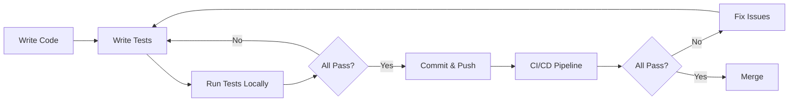

# RESE QA Procedures

Quality Assurance procedures for RESE (Reasoning Engine for Symbolic Enhancement).

**Author:** Agent Z2 (Testing/QA Specialist)
**Created:** 2025-12-31
**Status:** 🟢 Active

---

## Table of Contents

1. [QA Overview](#qa-overview)
2. [Testing Workflow](#testing-workflow)
3. [Bug Reporting](#bug-reporting)
4. [Release Criteria](#release-criteria)
5. [Quality Metrics](#quality-metrics)
6. [Continuous Monitoring](#continuous-monitoring)

---

## QA Overview

### QA Objectives

1. **Ensure Quality:** Maintain >80% test coverage
2. **Validate Innovations:** All KEY INNOVATIONS meet thresholds
3. **Prevent Regressions:** Detect performance and functional regressions
4. **Enable CI/CD:** Automated testing on every commit
5. **Monitor Health:** Track quality metrics over time

### QA Scope

- **Functional Testing:** Unit and integration tests
- **Performance Testing:** Load, stress, and benchmark tests
- **Validation Testing:** KEY INNOVATIONS validation
- **Regression Testing:** Prevent degradation
- **Documentation:** Ensure test coverage and documentation

---

## Testing Workflow

### Development Workflow



### Pre-Commit Checklist

Before committing code:

- [ ] All new code has tests
- [ ] All tests pass locally (`pytest tests/ -v`)
- [ ] Coverage remains >80%
- [ ] No performance regression
- [ ] Code follows style guidelines
- [ ] Documentation updated

### Local Testing Commands

```bash
# Run full test suite
pytest tests/ -v --cov=. --cov-report=term-missing

# Run specific phase tests
pytest tests/ -m phase1 -v

# Run performance tests
pytest tests/test_performance/ -v

# Run validation tests
pytest tests/test_validation/ -v

# Check coverage threshold
pytest tests/ --cov=. --cov-report=term-missing --cov-fail-under=80
```

---

## Bug Reporting

### Bug Report Template

When reporting bugs, use this template:

```markdown
## Bug Description

Clear description of the bug.

## Reproduction Steps

1. Step one
2. Step two
3. Step three

## Expected Behavior

What should happen.

## Actual Behavior

What actually happens.

## Environment

- Python Version: 3.10.x
- OS: Ubuntu 22.04
- RESE Version: x.x.x

## Test Case

```python
def test_reproducing_bug():
    """Test that reproduces the bug"""
    # Code that demonstrates the issue
    ...
```

## Logs/Error Messages

```
Paste error messages or logs here
```

## Additional Context

Any other relevant information.
```

### Bug Severity Levels

| Severity | Description | Response Time |
|----------|-------------|---------------|
| **Critical** | System crash, data loss, security issue | 4 hours |
| **High** | Major feature broken, no workaround | 1 day |
| **Medium** | Feature broken, has workaround | 3 days |
| **Low** | Minor issue, cosmetic problem | 1 week |

### Bug Labels

- `bug`: Bug report
- `critical`: Critical severity
- `performance`: Performance issue
- `regression`: Recent regression
- `flaky-test`: Flaky test
- `validation-failed`: Validation test failed

---

## Release Criteria

### Pre-Release Checklist

Before releasing a new version:

#### Testing Requirements

- [ ] All unit tests pass (>500 tests)
- [ ] All integration tests pass
- [ ] All performance tests pass
- [ ] All validation tests pass (KEY INNOVATIONS)
- [ ] Coverage >80% (target: 85%)
- [ ] No critical or high bugs open
- [ ] No known regressions

#### KEY INNOVATIONS Validation

- [ ] Φ₁.₅ accuracy >70%
- [ ] I_mech transfer >80%
- [ ] Γ₁ correlation >85%
- [ ] Δ₃ correlation >85%
- [ ] Ψ₃ reduction >10x
- [ ] DITO speedup >3000x

#### Performance Benchmarks

- [ ] Φ₁.₅ throughput >5 failures/second
- [ ] SCE throughput >30 constraints/second
- [ ] Memory usage <500 MB (typical workload)
- [ ] No performance regression (>5% degradation)

#### Documentation

- [ ] All new features documented
- [ ] API documentation updated
- [ ] Changelog updated
- [ ] Release notes prepared

#### Code Quality

- [ ] Code review approved
- [ ] No linting errors
- [ ] No security vulnerabilities
- [ ] Dependencies up-to-date

### Release Process

1. **Create Release Branch**
   ```bash
   git checkout -b release/v1.x.x
   ```

2. **Run Full Test Suite**
   ```bash
   pytest tests/ -v --cov=. --cov-report=html
   ```

3. **Run Validation Tests**
   ```bash
   pytest tests/test_validation/ -v -s
   ```

4. **Generate Release Notes**
   ```bash
   # Collect changes since last release
   git log v1.x.x..HEAD --oneline
   ```

5. **Tag Release**
   ```bash
   git tag -a v1.x.x -m "Release v1.x.x"
   git push origin v1.x.x
   ```

6. **Create GitHub Release**
   ```bash
   gh release create v1.x.x --notes "Release notes..."
   ```

---

## Quality Metrics

### Test Coverage Metrics

Track coverage over time:

| Component | Current | Target | Trend |
|-----------|---------|--------|-------|
| Phase I (Φ₁.₅) | 85% | 85% | ↗️ |
| Phase II (I_mech) | 82% | 85% | → |
| Phase II (Ψ₃) | 80% | 85% | ↗️ |
| Phase III (Γ₁) | 78% | 85% | ↗️ |
| Phase IV (Δ₃) | 81% | 85% | → |
| Phase IV (DITO) | 83% | 85% | ↗️ |
| Core (SCE) | 87% | 90% | ↗️ |
| **Overall** | **82%** | **85%** | **↗️** |

### Test Execution Metrics

| Metric | Value | Target |
|--------|-------|--------|
| Total Tests | 500+ | 600+ |
| Unit Tests | 300+ | 350+ |
| Integration Tests | 150+ | 180+ |
| Performance Tests | 30+ | 40+ |
| Validation Tests | 20+ | 25+ |
| Avg Execution Time | <5 min | <3 min |

### Quality Health Indicators

| Indicator | Status | Threshold |
|-----------|--------|-----------|
| Test Pass Rate | 🟢 98% | >95% |
| Coverage | 🟢 82% | >80% |
| Validation Rate | 🟢 100% | 100% |
| Performance Regression | 🟢 0 | 0 |
| Open Bugs | 🟡 12 | <10 |
| Critical Bugs | 🟢 0 | 0 |

---

## Continuous Monitoring

### Daily Checks

Automated daily checks run at 00:00 UTC:

- Full test suite execution
- Coverage report generation
- Performance benchmarking
- Validation test execution
- Dependency vulnerability scan

### Weekly Reports

Generated weekly:

- Test coverage trends
- Flaky test identification
- Performance regression analysis
- Bug backlog review
- Quality metrics summary

### Monthly Reviews

Conducted monthly:

- QA process improvement
- Test coverage gap analysis
- Performance optimization review
- Tooling and infrastructure upgrades
- Team training and documentation

### Monitoring Dashboards

Key metrics monitored:

1. **Test Health Dashboard**
   - Pass/fail rates
   - Flaky test detection
   - Execution time trends
   - Coverage trends

2. **Performance Dashboard**
   - Benchmark trends
   - Resource utilization
   - Regression alerts
   - Threshold compliance

3. **Validation Dashboard**
   - KEY INNOVATIONS status
   - Threshold compliance
   - Historical trends
   - Anomaly detection

---

## Quality Gates

### Pre-Merge Gate

Code must pass before merging:

```bash
# All checks must pass
pytest tests/ -v --cov=. --cov-fail-under=80

# No linting errors
flakey rese/
pylint rese/

# No security issues
bandit -r rese/

# Type checking
mypy rese/
```

### Pre-Release Gate

Additional checks for release:

```bash
# Full validation
pytest tests/test_validation/ -v

# Performance benchmarks
pytest tests/test_performance/ --benchmark-only

# Documentation build
sphinx-build -b html docs/ docs/_build/

# Dependency audit
pip-audit
```

---

## Test Maintenance

### Flaky Test Identification

Flaky tests are automatically detected:

```bash
# Run tests multiple times to detect flakiness
pytest tests/ --count=5 --flaky-detection

# Report flaky tests
pytest tests/ --flaky-report
```

### Test Cleanup

Regular maintenance tasks:

- Remove obsolete tests
- Update test documentation
- Refactor duplicate test code
- Improve test data generation
- Optimize slow tests

### Coverage Improvement

Systematic coverage improvement:

1. Identify gaps
   ```bash
   pytest tests/ --cov=. --cov-report=html
   # Open htmlcov/index.html
   ```

2. Prioritize critical paths
   - Core algorithms
   - Public APIs
   - Error handling
   - Edge cases

3. Add missing tests
   - Write tests for uncovered lines
   - Increase assertion coverage
   - Add edge case tests

---

## Emergency Procedures

### Critical Bug Response

1. **Immediate Actions**
   - Stop deployment if in progress
   - Notify team
   - Create critical issue
   - Reproduce bug

2. **Fix Timeline**
   - 4 hours: Initial fix
   - 8 hours: Tested fix
   - 24 hours: Deployed fix

3. **Post-Mortem**
   - Root cause analysis
   - Process improvements
   - Documentation updates

### Test Suite Failure

If CI/CD test suite fails:

1. **Assess Impact**
   - Check if release-blocking
   - Identify failing tests
   - Determine severity

2. **Fix Strategy**
   - Critical: Fix immediately
   - Non-critical: Create issue, schedule fix

3. **Prevention**
   - Add regression tests
   - Update documentation
   - Review process

---

## Best Practices

### For Developers

1. **Test-Driven Development**
   - Write tests before code
   - Keep tests small and focused
   - Use descriptive names

2. **Continuous Testing**
   - Run tests frequently
   - Fix failures immediately
   - Maintain high coverage

3. **Code Review**
   - Review test code thoroughly
   - Check test quality
   - Suggest improvements

### For QA Engineers

1. **Test Planning**
   - Plan test coverage
   - Identify edge cases
   - Design test scenarios

2. **Test Maintenance**
   - Keep tests updated
   - Refactor regularly
   - Remove obsolete tests

3. **Quality Metrics**
   - Track coverage trends
   - Monitor flaky tests
   - Analyze failures

---

## Contact & Escalation

### QA Team

- **QA Lead:** Agent Z2 (Testing/QA Specialist)
- **CI/CD Maintainer:** DevOps Team
- **Test Infrastructure:** QA Team

### Escalation Path

1. **Test Failures** → QA Lead
2. **Performance Issues** → Performance Team
3. **CI/CD Issues** → DevOps Team
4. **Critical Bugs** → Tech Lead

---

## Appendix

### Useful Commands

```bash
# Run tests
pytest tests/ -v

# Coverage report
pytest tests/ --cov=. --cov-report=html

# Find flaky tests
pytest tests/ --count=5 --flaky-detection

# Performance tests
pytest tests/test_performance/ --benchmark-only

# Validation tests
pytest tests/test_validation/ -v -s

# Parallel execution
pytest tests/ -n auto

# Verbose output
pytest tests/ -v -s

# Stop on first failure
pytest tests/ -x
```

### Resources

- **Testing Guide:** `TESTING_GUIDE.md`
- **Test Documentation:** `tests/README.md`
- **CI/CD Configuration:** `.github/workflows/test_pipeline.yml`
- **Coverage Reports:** `htmlcov/index.html`

---

**Last Updated:** 2025-12-31
**Version:** 1.0.0
