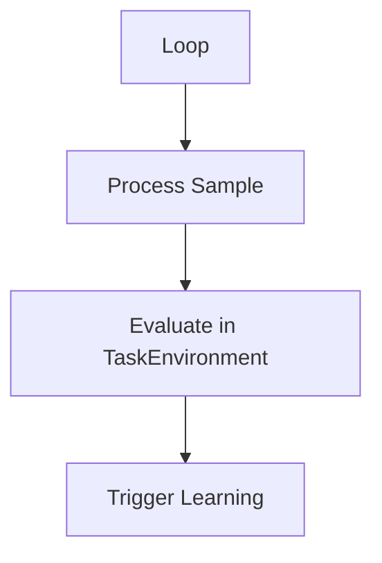

# ACE Adaptation Orchestrator (Loops)

## Summary
Manages the execution lifecycle of the adaptation process. It supports two main modes: **OfflineACE** for batch training on historical samples and **OnlineACE** for continuous, real-time adaptation in a production environment.

## Core Flow

## Notable Gotchas & Tech Debt
- **Local Checkpoints**: Current implementation relies on local files for checkpoints, which may not scale to distributed environments.
- **Custom Environments**: Requires a bespoke `TaskEnvironment` implementation for every new problem domain.

[[ace_agentic_context_engine.md]]
