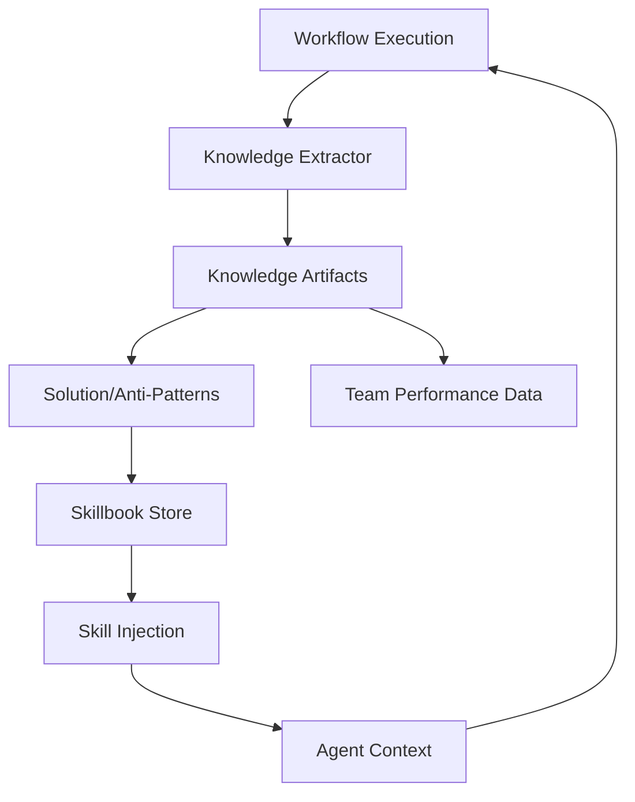

# ACE (Agentic Context Engine)

## Summary
The Agentic Context Engine (ACE) is responsible for context management, knowledge extraction, and skill injection within the multi-agent ecosystem. it orchestrates the lifecycle of "knowledge artifacts" (Solution Patterns, Anti-Patterns, Decomposition Strategies) by extracting them from workflow executions and mining them for reusable insights.

## Core Flow

## Notable Gotchas & Tech Debt
- **Schema Complexity**: The `KnowledgeArtifact` dataclass has a deeply nested structure with complex metadata, which can be brittle if external tools expect different formats.
- **Pattern Mining Overhead**: Mining patterns from large sets of artifacts using ML (in `SolutionPatternMiner`) can be computationally expensive.
- **Lock Contention**: Global locks are used for thread safety in knowledge extraction and storage, which may limit parallel processing throughput.

[[run_me.md]]
