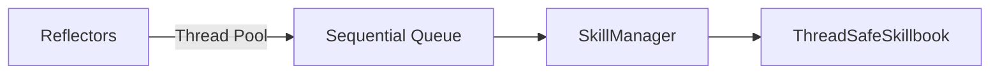

# ACE Async Learning Infrastructure

## Summary
A performance-oriented layer that decouples the execution of agent tasks from the learning process. It parallelizes the computationally expensive Reflector calls while ensuring that Skillbook updates remain serialized and thread-safe.

## Core Flow

## Notable Gotchas & Tech Debt
- **Eventual Consistency**: The agent might operate on a slightly outdated version of the skillbook while reflections are being processed in the background.
- **Queue Management**: Large bursts of tasks can overwhelm the queue, requiring backpressure mechanisms.

[[ace_agentic_context_engine.md]]
