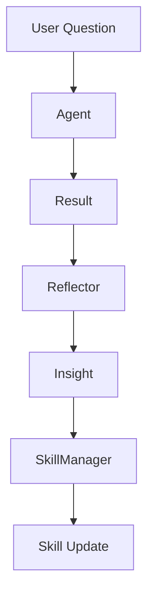

# ACE Core Roles

## Summary
The core functional units of the Agentic Context Engine. The **Agent** performs the actual tasks; the **Reflector** analyzes the success or failure of those tasks; and the **SkillManager** uses those reflections to update the Skillbook with new or refined strategies.

## Core Flow

## Notable Gotchas & Tech Debt
- **JSON Sensitivity**: Highly dependent on strictly structured JSON outputs from LLMs.
- **Prompt Versioning**: Changes in prompt versions (e.g., `prompts_v2_1.py`) can have cascading effects on all three roles.

[[ace_agentic_context_engine.md]]
