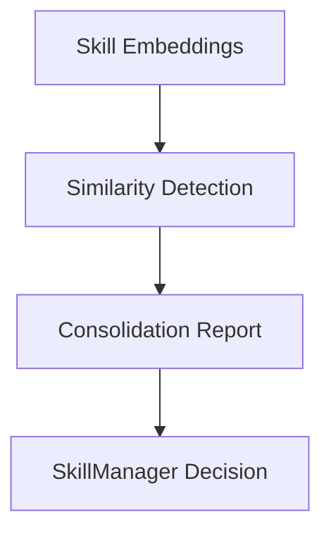

# ACE Deduplication & Consolidation

## Summary
A maintenance component that uses embeddings to detect redundant or highly similar skills within the Skillbook. It merges these skills to prevent context bloat and ensure that the agent is presented with a diverse set of distinct strategies.

## Core Flow

## Notable Gotchas & Tech Debt
- **Model Compatibility**: Requires a specific embedding model to be consistent across the lifecycle.
- **Loss of Nuance**: Low similarity thresholds for merging can lead to the loss of subtle but important distinctions between strategies.

[[ace_agentic_context_engine.md]]
