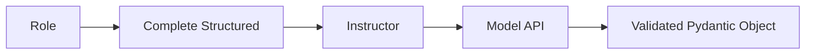

# ACE Model Abstraction Layer (LLM Clients)

## Summary
Provides a provider-agnostic interface for interacting with different LLMs (OpenAI, Anthropic, Transformers, etc.). It includes built-in support for the `Instructor` library to ensure that all model outputs are validated against Pydantic schemas.

## Core Flow

## Notable Gotchas & Tech Debt
- **Regex Cleaning**: `TransformersLLMClient` uses complex regex-based logic to clean JSON from local models, which can be fragile.
- **Provider Parity**: Not all features (like system prompts or specific sampling parameters) are supported equally across all providers.

[[ace_agentic_context_engine.md]]
