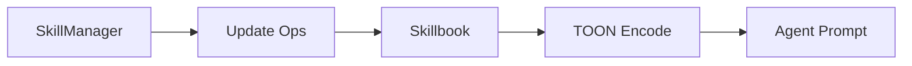

# ACE Context Management (Skillbook)

## Summary
The **Skillbook** acts as a persistent repository of strategies (skills) learned by the system. It tracks which skills are helpful or harmful and uses TOON compression to ensure that agent prompts remain token-efficient even as the library of learned skills grows.

## Core Flow

## Notable Gotchas & Tech Debt
- **TOON Dependency**: TOON is a critical but optional dependency; if missing, context bloat can occur rapidly.
- **Scaling Limits**: As the skillbook grows, finding the most relevant skills for a given task becomes a retrieval challenge.

[[ace_agentic_context_engine.md]]
