# Analyzing Voicetree Project Progress

## Analysis of the Voicetree project structure and identification of major modules

I have analyzed the Voicetree project structure and explored the broader codebase to identify major modules. The Voicetree project appears to be a spatial IDE for multi-agent orchestration that stores its content in markdown files forming a graph structure.

## Key findings from codebase exploration

After exploring the codebase in the Frontend directory, I identified several major modules that form the core of the OpenEvolve system:

1. **ACE (Autonomous Cognitive Entity) Framework** - Contains core AI agent functionality with files like `ace_crewai_bridge.py`, `ace_mcp_tools.py`, `ace_analytics.py`, etc.

2. **Knowledge Management System** - Includes knowledge extraction and artifact management with files like `ace_knowledge_artifacts.py`, `ace_workflow_knowledge_extractor.py`.

3. **Adversarial Testing Framework** - Contains adversarial testing capabilities with files like `adversarial.py`, `adversarial_testing.py`, `adversarial_unified.py`.

4. **Decomposition Engine** - Core functionality for breaking down complex tasks with files like `decomposition_engine.py`, `adaptive_decomposition_integration.py`.

5. **API and Integration Layer** - Handles API contracts and integrations with files like `api_bridge.py`, `ace_api_utils.py`.

6. **Analytics and Monitoring** - Provides analytics capabilities with files like `analytics.py`, `analytics_dashboard.py`, `ace_analytics.py`.

7. **Testing and Validation Framework** - Comprehensive testing infrastructure with multiple test suites in the `tests/` directory.

List of all additional files changed: None (this is a documentation task)

## DIAGRAM

```mermaid
graph TD
    A[Voicetree Spatial IDE] --> B[ACE Framework]
    A --> C[Knowledge Management]
    A --> D[Adversarial Testing]
    A --> E[Decomposition Engine]
    A --> F[API Integration]
    A --> G[Analytics]
    A --> H[Validation Framework]
    
    B --> B1[ace_crewai_bridge.py]
    B --> B2[ace_mcp_tools.py]
    B --> B3[ace_analytics.py]
    
    C --> C1[ace_knowledge_artifacts.py]
    C --> C2[ace_workflow_knowledge_extractor.py]
    
    D --> D1[adversarial.py]
    D --> D2[adversarial_testing.py]
    
    E --> E1[decomposition_engine.py]
    E --> E2[adaptive_decomposition_integration.py]
    
    F --> F1[api_bridge.py]
    F --> F2[ace_api_utils.py]
    
    G --> G1[analytics.py]
    G --> G2[analytics_dashboard.py]
    
    H --> H1[tests/]
```

### NOTES

This analysis was performed by exploring the directory structure and file listings in the OpenEvolve Frontend directory. The Voicetree system appears to be a sophisticated multi-agent orchestration platform that uses markdown files to represent a graph of interconnected nodes. The system has a strong focus on autonomous cognitive entities (ACE), knowledge management, and adversarial testing methodologies.

The complexity of the codebase is high due to the integration of multiple AI frameworks, testing methodologies, and distributed agent systems. Understanding the interconnections between different modules would require deeper analysis of the actual code implementations.
