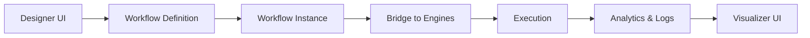

# BubbleLabs

## Summary
BubbleLabs is the primary visualization and UI framework for the OpenEvolve Frontend. It provides a visual workflow designer, real-time execution monitoring, and an integrated analytics dashboard. It uses a "bubble" metaphor for workflow nodes and supports a plugin system for extending UI capabilities (e.g., LeanAide, ROMA).

## Core Flow

## Notable Gotchas & Tech Debt
- **State Sync**: Maintaining synchronization between the BubbleLab UI-based UI state and the background execution engines (CrewAI, MDAP) requires careful handling of session states.
- **Frontend/Backend Coupling**: Some logic for creating workflow definitions is duplicated between the UI components and the integration layers.
- **XSS Risks**: Extensive use of `escape_html` and `escape_json_for_js` indicates a potential attack surface in the visualizer's custom JS components.

[[run_me.md]]

