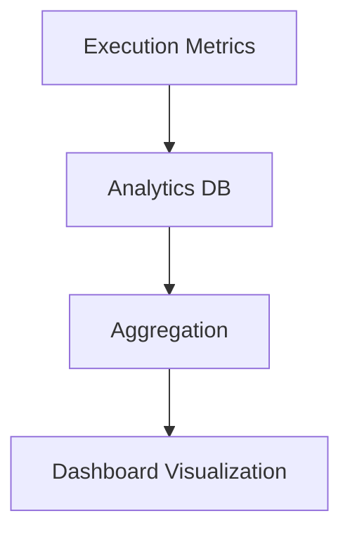

# BubbleLabs Analytics & Observability

## Summary
The monitoring component that tracks performance metrics, success rates, and resource usage for all workflow executions. It provides the data source for real-time health dashboards.

## Core Flow

## Notable Gotchas & Tech Debt
- **Performance Impact**: High-frequency metric collection can introduce significant overhead; batching is required for high-throughput scenarios.
- **Storage Growth**: The analytics database can grow rapidly in high-usage environments, necessitating automatic cleanup or archiving policies.

[[bubblelabs.md]]
