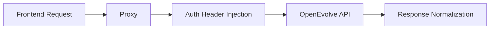

# BubbleLabs API Gateway & Connectivity

## Summary
The backend proxy layer (using Bun and Hono) that routes traffic and normalizes data between the JavaScript-based frontend and Python-based backend services. It manages authentication and request forwarding.

## Core Flow

## Notable Gotchas & Tech Debt
- **Error Normalization**: Standardizing errors across multiple programming languages (JS/TS and Python) is complex and requires a unified JSON error format.
- **Payload Limits**: Large workflow definitions can exceed default proxy payload limits, requiring manual configuration adjustments.

[[bubblelabs.md]]
