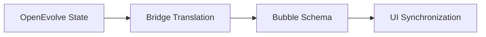

# BubbleLabs Core Integration Bridge

## Summary
The primary link between OpenEvolve's Python-based evolutionary engines and the BubbleLabs visual platform. It maps internal data models to the visual "bubble" schema and maintains bi-directional synchronization of the workflow state.

## Core Flow

## Notable Gotchas & Tech Debt
- **Concurrency**: Requires a very strict RLock hierarchy (Definitions -> Instances -> Threads) to prevent deadlocks during high-concurrency updates.
- **Data Mapping**: Some complex OpenEvolve parameters are difficult to represent visually, leading to potential data loss or display errors.

[[bubblelabs.md]]
